# 从零讲透 Kubernetes

*从一次凌晨故障到一套生产级集群*

> 本文件由 `tools/build-book.sh` 从 `chapters/` 自动合并生成，请勿直接编辑。
> 需要修改内容请改对应章节文件后重新运行该脚本。

## 目录

- [前言](#preface)
- **[第一篇　原理基础](#part-1)**
  - [第 1 章　一张地图看清 Kubernetes：它到底解决什么问题](#ch-01-why-k8s)
    - [1.1 凌晨两点四十七分的电话](#sec-01-1-1)
    - [1.2 第一层解药：容器 —— 把运行环境装进标准集装箱](#sec-01-1-2)
    - [1.3 第二层解药：从"命令式"到"声明式"](#sec-01-1-3)
    - [1.4 Kubernetes 是什么：一句话定义 + 一个类比](#sec-01-1-4)
    - [1.5 全局图谱：把上面的名字全部挂到一张图上](#sec-01-1-5)
    - [1.6 灵魂三问：K8s 的三条核心原则](#sec-01-1-6)
    - [1.7 一次 `kubectl apply` 之后，30 秒内发生了什么](#sec-01-1-7)
    - [1.8 名词地图：核心对象速查](#sec-01-1-8)
    - [1.9 贯穿全书的案例：CloudNote 云笔记](#sec-01-1-9)
    - [1.10 动手：三种零成本起一个集群](#sec-01-1-10)
    - [1.11 本章要点](#sec-01-1-11)
    - [1.12 练习题](#sec-01-1-12)
  - [第 2 章　容器与 Pod：最小调度单元的秘密](#ch-02-pod)
    - [2.1 先想清楚：为什么不直接管容器？](#sec-02-2-1)
    - [2.2 Pod 不是"容器组"，而是"一台逻辑小机器"](#sec-02-2-2)
    - [2.3 解剖一个 Pod：那个你看不见的 pause 容器](#sec-02-2-3)
    - [2.4 共享什么，不共享什么（含一个必踩的坑）](#sec-02-2-4)
    - [2.5 多容器 Pod 的三种经典模式](#sec-02-2-5)
    - [2.6 init 容器：主容器的"先行部队"](#sec-02-2-6)
    - [2.7 Pod 的生命周期：从 Pending 到 Terminating](#sec-02-2-7)
    - [2.8 动手：写一个多容器 Pod，亲手验证"共享"](#sec-02-2-8)
    - [2.9 对应到 CloudNote：api 的 Pod 长什么样](#sec-02-2-9)
    - [2.10 本章要点](#sec-02-2-10)
    - [2.11 练习题](#sec-02-2-11)
  - [第 3 章　集群的解剖学：控制平面与工作节点](#ch-03-cluster-anatomy)
    - [3.1 先把集群劈成两半：控制面与数据面](#sec-03-3-1)
    - [3.2 kube-apiserver：唯一的门，也是全集群的咽喉](#sec-03-3-2)
    - [3.3 etcd：唯一的事实来源，也是唯一的"单点"](#sec-03-3-3)
    - [3.4 kube-scheduler：只做一件事，就是"选址"](#sec-03-3-4)
    - [3.5 kube-controller-manager：一群"监工"的集合](#sec-03-3-5)
    - [3.6 工作节点三件套：kubelet / 容器运行时 / kube-proxy](#sec-03-3-6)
    - [3.7 为什么除了 etcd，其他组件都能挂](#sec-03-3-7)
    - [3.8 一个完整的故障故事：节点宕机之后](#sec-03-3-8)
    - [3.9 动手：把集群翻过来看](#sec-03-3-9)
    - [3.10 本章要点](#sec-03-3-10)
    - [3.11 练习题](#sec-03-3-11)
  - [第 4 章　声明式 API 与控制器模式：K8s 的灵魂](#ch-04-declarative-controller)
    - [4.1 先问一个让事件驱动系统崩溃的问题](#sec-04-4-1)
    - [4.2 两套根本不同的哲学：边缘触发 vs 水平触发](#sec-04-4-2)
    - [4.3 把调和循环真正拆开](#sec-04-4-3)
    - [4.4 控制器怎么"知道"状态变了：List、Watch 与 WorkQueue](#sec-04-4-4)
    - [4.5 幂等性：为什么跑 1 次和跑 1000 次结果一样](#sec-04-4-5)
    - [4.6 resourceVersion 与乐观并发：两个控制器怎么不打架](#sec-04-4-6)
    - [4.7 对象图：为什么 Deployment 要转一手 ReplicaSet](#sec-04-4-7)
    - [4.8 控制器的完整形态，以及 Operator 的由来](#sec-04-4-8)
    - [4.9 "声明式"的适用边界：什么时候不该用它](#sec-04-4-9)
    - [4.10 动手：亲眼看见调和循环在工作](#sec-04-4-10)
    - [4.11 本章要点](#sec-04-4-11)
    - [4.12 练习题](#sec-04-4-12)
- **[第二篇　部署与网络](#part-2)**
  - [第 5 章　把应用跑起来：Deployment 与滚动更新](#ch-05-deployment)
    - [5.1 Deployment 到底多做了哪两件事](#sec-05-5-1)
    - [5.2 把一个真实的 Deployment 逐行看懂](#sec-05-5-2)
    - [5.3 发布时，三层是怎么接力的](#sec-05-5-3)
    - [5.4 滚动更新的节奏：maxSurge 与 maxUnavailable](#sec-05-5-4)
    - [5.5 真正的"刹车"是就绪探针](#sec-05-5-5)
    - [5.6 动手：发布、观察、搞坏、回滚](#sec-05-5-6)
    - [5.7 为什么回滚能这么快：一次彻底的机制拆解](#sec-05-5-7)
    - [5.8 为什么 Deployment 会"卡住十分钟不动"](#sec-05-5-8)
    - [5.9 生产上的 Deployment 该怎么写](#sec-05-5-9)
    - [5.10 本章要点](#sec-05-5-10)
    - [5.11 练习题](#sec-05-5-11)
  - [第 6 章　Pod 之间怎么说话：Service、DNS 与数据面](#ch-06-service-network)
    - [6.1 三个死结：为什么 Pod IP 不能直接用](#sec-06-6-1)
    - [6.2 Service 由四部分构成](#sec-06-6-2)
    - [6.3 EndpointSlice：Service 背后那本"地址簿"](#sec-06-6-3)
    - [6.4 一个 Service 的 YAML 逐字段拆解](#sec-06-6-4)
    - [6.5 ClusterIP 的真相：一个"谎言的集合"](#sec-06-6-5)
    - [6.6 kube-proxy 到底写了什么规则](#sec-06-6-6)
    - [6.7 四种 Service 类型：从集群内到公网](#sec-06-6-7)
    - [6.8 DNS：真正让服务发现变好用的那一层](#sec-06-6-8)
    - [6.9 动手：把 Service 的每一层都验一遍](#sec-06-6-9)
    - [6.10 几个必须知道的边界与坑](#sec-06-6-10)
    - [6.11 本章要点](#sec-06-6-11)
    - [6.12 练习题](#sec-06-6-12)
  - [第 7 章　让世界访问你：Ingress 与南北向流量](#ch-07-ingress)
    - [7.1 先讲一个刚发生的行业事件](#sec-07-7-1)
    - [7.2 Ingress 与 Ingress Controller：声明与实现](#sec-07-7-2)
    - [7.3 先分清两个词：南北向与东西向](#sec-07-7-3)
    - [7.4 一个 Ingress 的 YAML 逐字段拆解](#sec-07-7-4)
    - [7.5 `pathType` 的门道：一个真实的坑](#sec-07-7-5)
    - [7.6 TLS 在哪里终止：一次把证书问题讲清](#sec-07-7-6)
    - [7.7 Ingress 的天花板：为什么它会被冻结](#sec-07-7-7)
    - [7.8 Gateway API：角色分离与更强表达力](#sec-07-7-8)
    - [7.9 动手：搭一个七层入口](#sec-07-7-9)
    - [7.10 本章要点](#sec-07-7-10)
    - [7.11 练习题](#sec-07-7-11)
- **[第三篇　配置、存储与调度](#part-3)**
  - [第 8 章　配置与密钥：ConfigMap 与 Secret](#ch-08-configmap-secret)
    - [8.1 ConfigMap：把配置从镜像里抠出来](#sec-08-8-1)
    - [8.2 Secret 与 ConfigMap 的本质区别（纠正最大误解）](#sec-08-8-2)
    - [8.3 Secret 的几种类型](#sec-08-8-3)
    - [8.4 注入到 Pod 的两种方式](#sec-08-8-4)
    - [8.5 最大的坑：改了 ConfigMap，Pod 不会重启](#sec-08-8-5)
    - [8.6 `subPath` 与目录覆盖：两个真实的血案](#sec-08-8-6)
    - [8.7 边界与限制：什么不该放进去](#sec-08-8-7)
    - [8.8 动手：一次实验看清全部三种行为](#sec-08-8-8)
    - [8.9 速查：四步流程 + 四种写法 + 常见报错](#sec-08-8-9)
    - [8.10 本章要点](#sec-08-8-10)
    - [8.11 练习题](#sec-08-8-11)
  - [第 9 章　数据要持久：Volume、PV、PVC、StorageClass](#ch-09-storage)
    - [9.1 先看清容器文件系统的三层"寿命"](#sec-09-9-1)
    - [9.2 Volume：一个被误解的名字](#sec-09-9-2)
    - [9.3 `emptyDir`：用对了很好，用错了很惨](#sec-09-9-3)
    - [9.4 `hostPath`：为什么它是"反模式"](#sec-09-9-4)
    - [9.5 三层抽象：PV 和 PVC 到底是谁写给谁的](#sec-09-9-5)
    - [9.6 `accessModes` 的真相：`ReadWriteOnce` 不是"一个 Pod"](#sec-09-9-6)
    - [9.7 StorageClass：让存储"动态供给"](#sec-09-9-7)
    - [9.8 一个完整的 PVC 用法](#sec-09-9-8)
    - [9.9 数据安全的三条红线](#sec-09-9-9)
    - [9.10 动手：一个 A/B 实验看清 PVC 和 emptyDir 的差别](#sec-09-9-10)
    - [9.11 本章要点](#sec-09-9-11)
    - [9.12 练习题](#sec-09-9-12)
  - [第 10 章　调度与资源管理：requests、limits、QoS 与亲和性](#ch-10-scheduling)
    - [10.1 先分清：requests 是"预留"，limits 是"天花板"](#sec-10-10-1)
    - [10.2 CPU 和内存：两种性质完全不同的资源](#sec-10-10-2)
    - [10.3 QoS 等级：谁决定的、决定了什么](#sec-10-10-3)
    - [10.4 节点资源不足时会发生什么](#sec-10-10-4)
    - [10.5 控制 Pod 落在哪：四个工具，两个方向](#sec-10-10-5)
    - [10.6 `topologySpreadConstraints`：比反亲和性更好的打散方式](#sec-10-10-6)
    - [10.7 把资源与调度写进生产配置](#sec-10-10-7)
    - [10.8 动手：把资源与调度的行为都看一遍](#sec-10-10-8)
    - [10.9 本章要点](#sec-10-10-9)
    - [10.10 练习题](#sec-10-10-10)
- **[第四篇　稳定性与弹性](#part-4)**
  - [第 11 章　自愈的真相：探针与故障恢复](#ch-11-self-healing)
    - [11.1 先把"自愈"拆成三层](#sec-11-11-1)
    - [11.2 `restartPolicy` 与 CrashLoopBackOff 的由来](#sec-11-11-2)
    - [11.3 三种探针：各解决什么问题、触发什么动作](#sec-11-11-3)
    - [11.4 探针的四种检查方式与参数](#sec-11-11-4)
    - [11.5 配错探针的三种典型事故](#sec-11-11-5)
    - [11.6 完整推演：一次探针配错如何造成全站故障](#sec-11-11-6)
    - [11.7 自愈能力的完整边界：K8s 能修什么、不能修什么](#sec-11-11-7)
    - [11.8 动手：把每一种自愈都亲眼看一遍](#sec-11-11-8)
    - [11.9 本章要点](#sec-11-11-9)
    - [11.10 练习题](#sec-11-11-10)
  - [第 12 章　弹性伸缩：HPA、VPA 与 Cluster Autoscaler](#ch-12-autoscaling)
    - [12.1 弹性的三个层次](#sec-12-12-1)
    - [12.2 HPA 的第一原理：它不看 QPS，它看"比例"](#sec-12-12-2)
    - [12.3 HPA 工作的三个前置条件](#sec-12-12-3)
    - [12.4 三种指标源：从 CPU 到"队列里积压了多少个任务"](#sec-12-12-4)
    - [12.5 HPA 的震荡抑制：为什么它不会疯狂扩缩](#sec-12-12-5)
    - [12.6 HPA 扩不上去的五个原因](#sec-12-12-6)
    - [12.7 Cluster Autoscaler：当节点不够时](#sec-12-12-7)
    - [12.8 VPA：纵向伸缩，以及它和 HPA 的尴尬关系](#sec-12-12-8)
    - [12.9 CloudNote 的完整弹性伸缩配置](#sec-12-12-9)
    - [12.10 动手：看着 Pod 自己变多](#sec-12-12-10)
    - [12.11 本章要点](#sec-12-12-11)
    - [12.12 练习题](#sec-12-12-12)
  - [第 13 章　工作负载全景：StatefulSet、DaemonSet、Job 与 CronJob](#ch-13-workloads)
    - [13.1 五种工作负载的总纲](#sec-13-13-1)
    - [13.2 StatefulSet 的三个"稳定"](#sec-13-13-2)
    - [13.3 一个完整的 StatefulSet：CloudNote 的 postgres](#sec-13-13-3)
    - [13.4 StatefulSet 的边界：它只给了地基，没给房子](#sec-13-13-4)
    - [13.5 DaemonSet：每个节点跑一个](#sec-13-13-5)
    - [13.6 Job：第 4 章那个问题，终于有答案了](#sec-13-13-6)
    - [13.7 CronJob：定时任务](#sec-13-13-7)
    - [13.8 五种工作负载对照表与常见误用](#sec-13-13-8)
    - [13.9 动手：把四种工作负载都跑一遍](#sec-13-13-9)
    - [13.10 本章要点](#sec-13-13-10)
    - [13.11 练习题](#sec-13-13-11)
- **[第五篇　实战与生产](#part-5)**
  - [第 14 章　实战总演习：CloudNote 从 0 到 1](#ch-14-capstone)
    - [14.1 部署的顺序原则：为什么不能一把梭](#sec-14-14-1)
    - [14.2 阶段一：地基（命名空间 + 配置 + 密钥）](#sec-14-14-2)
    - [14.3 阶段二：数据层（headless Service + StatefulSet）](#sec-14-14-3)
    - [14.4 阶段三：应用层（api / web / worker + Service）](#sec-14-14-4)
    - [14.5 阶段四：入口与弹性](#sec-14-14-5)
    - [14.6 阶段五：验收清单（13 项）](#sec-14-14-6)
    - [14.7 故障演习一：删掉主库 Pod，数据会丢吗？](#sec-14-14-7)
    - [14.8 故障演习二：发一个坏版本，然后回滚](#sec-14-14-8)
    - [14.9 故障演习三：一个探针配置，让全站不可用](#sec-14-14-9)
    - [14.10 故障演习四：节点故障与污点驱逐](#sec-14-14-10)
    - [14.11 故障演习五：把流量打满，看它扩不上去](#sec-14-14-11)
    - [14.12 故障演习六：K8s 救不了的那些故障](#sec-14-14-12)
    - [14.13 一键部署与一键清理](#sec-14-14-13)
    - [14.14 本章要点](#sec-14-14-14)
    - [14.15 练习题](#sec-14-14-15)
  - [第 15 章　生产实践与排错手册](#ch-15-production)
    - [15.1 排错方法论：分层收敛，不要跳步](#sec-15-15-1)
    - [15.2 症状对照表（Pod 异常状态）](#sec-15-15-2)
    - [15.3 十个高频命令与它们的"适用场景"](#sec-15-15-3)
    - [15.4 必须补上的四块：权限、网络策略、可观测性、备份](#sec-15-15-4)
    - [15.5 集群运维：排空、PDB、升级](#sec-15-15-5)
    - [15.6 多环境管理：三种做法](#sec-15-15-6)
    - [15.7 上线前检查清单（40 项）](#sec-15-15-7)
    - [15.8 本章要点](#sec-15-15-8)
    - [15.9 练习题](#sec-15-15-9)
- **[附录](#part-6)**
  - [附录　命令速查表 · YAML 骨架 · 术语中英对照](#ch-appendix-cheatsheet)

# <a id="preface"></a>前言

## 这本书要解决什么问题

关于 Kubernetes 的资料不缺。官方文档完备到近乎冗长，教程多到可以按周更新。真正稀缺的是另一种东西：把这些零散知识串成一条因果链的叙述。

大多数人学 Kubernetes 的过程是这样的：照着教程敲完 `kubectl apply`，服务跑起来了，于是以为学会了。等到线上出现第一个 `CrashLoopBackOff`、第一次 `ping` 不通 ClusterIP、第一次 Pod 明明 Running 却收不到流量，才发现自己掌握的是一份操作手册，而不是一套模型。手册只在预期路径上有效，而故障从不走预期路径。

本书试图给出那套模型。它的组织原则是：**每个概念都必须回答"它为什么必须存在"，而不只是"它怎么配置"。** Pod 为什么不能是容器；Service 为什么 ping 不通却能通 TCP；副本数为什么会自己恢复，而裸 Pod 不会；`requests` 和 `limits` 为什么一个决定调度、一个决定生死。这些问题的答案彼此关联，串起来只有一条主线——**声明期望状态，让控制器持续收敛**。全书 15 章都是这条主线的展开。

## 怎么读

全书分为五篇，可以顺序读，也可以按需跳读，但第一篇建议不要跳。

- **第一篇　原理基础（第 1~4 章）**　建立整体模型：手工运维为什么失效、Pod 为什么是最小单元、集群由哪些零件构成、调和循环凭什么能在消息丢失时依然收敛。这一篇几乎不需要集群，纯读即可。
- **第二篇　部署与网络（第 5~7 章）**　把应用真正跑起来并暴露出去：Deployment 与滚动更新、Service 与集群内通信、Ingress 与外部入口。从这一篇开始需要一个可用的集群。
- **第三篇　配置、存储与调度（第 8~10 章）**　让应用具备生产形态：配置与密钥的解耦、数据的持久化、资源申请与落点控制。
- **第四篇　稳定性与弹性（第 11~13 章）**　让系统在故障与波动中存活：探针与自愈的边界、三个层次的自动伸缩、四种工作负载的适用范围。
- **第五篇　实战与生产（第 14~15 章）**　从零部署一整套服务，注入六类故障做演习，最后固化成排错手册与上线检查清单。

附录是工具性内容，按需检索：命令速查、YAML 骨架、术语中英对照。

## 贯穿案例：CloudNote

从第 2 章到第 14 章，所有示例都围绕同一个虚构服务展开：**CloudNote**，一个在线笔记应用，由 `web`（前端）、`api`（后端）、`worker`（异步导出）、`redis`（缓存）、`postgres`（数据库）五个组件构成。

选择单一贯穿案例，是为了让读者看到同一套配置如何在各章之间演进——第 5 章的 Deployment 到第 8 章会长出 ConfigMap 与 Secret，到第 10 章会加上资源声明与打散约束，到第 11 章会补上探针。每一章都在同一份配置上做增量，而不是各讲一个互不相干的玩具例子。

CloudNote 也承载了第 1 章列出的四种手工运维失效方式：环境漂移、人肉扩容、故障无人接管、发布靠勇气。每一种都在后续某一章被正面解决。完整的 YAML 清单与实验脚本在配套仓库的 `cases/cloudnote/` 目录下。

## 约定

- 术语保留英文原文（Pod、Deployment、etcd、Scheduler 等），首次出现时给出中文解释。这样做是为了让读者能直接对照官方文档与报错信息。
- 命令与字段名使用等宽标记，如 `kubectl get pods`、`spec.replicas`。
- 每章结尾有"本章要点"与"练习题"。练习题不提供答案，因为答案都在正文中，检索的过程本身就是复习。
- 书中命令基于 Kubernetes 1.28 及以上版本验证。涉及版本差异的地方会明确标注。


---

# <a id="part-1"></a>第一篇　原理基础

---

## <a id="ch-01-why-k8s"></a>第 1 章　一张地图看清 Kubernetes：它到底解决什么问题

Kubernetes 的学习曲线之所以陡峭，不在于命令多，而在于它的每个概念都只有放回整体才讲得通：Pod 为什么不等于容器、Service 为什么 ping 不通、副本数为什么会自己恢复。孤立地看，这些都是需要死记的规则；放进同一张图里看，它们是同一条原理的不同侧面。

本章的任务是先把这张图画出来。叙述从一次凌晨故障开始，归纳手工运维失效的四种典型方式，再依次引入三层解药——容器解决环境一致，声明式 API 解决意图表达，调和循环解决持续收敛——最后把控制平面与工作节点的全部组件挂到一条完整链路上：一次 `kubectl apply` 之后的三十秒里，究竟是谁在依次接手。

本章不要求记住任何字段名，只要求读懂结构。后续各章都是在放大这条链路里的某一段。

---

### <a id="sec-01-1-1"></a>1.1 凌晨两点四十七分的电话

先看一个真实场景。

你是一家公司的后端开发。你们的"云笔记"服务跑在三台物理服务器上：一台跑 Nginx 前端，两台跑 Java 后端，数据库装在第二台的那些机器里。

周五凌晨 2:47，手机响了。值班同事说：**"服务 502 了，用户打不开笔记。"**

你连上 VPN，开始查。第一台机器正常，第二台机器上：

```
$ ps -ef | grep java
（什么都没输出）
```

进程没了。为什么没了？没人知道——可能是半夜 OOM 被系统杀了，可能是有人手滑关了终端窗口把进程带走了。

你决定重启。于是你面对三个问题：

1. **启动脚本在哪？** 在某个同事的 `~/deploy/restart.sh` 里，而他三个月前离职了。
2. **参数对得上吗？** 生产环境和测试环境的 JVM 参数、`-D` 变量，只在部署文档的某个版本的注释里写着。
3. **启动需要多久？** 冷启动 90 秒，而这 90 秒里用户一直在刷新页面看到 502。

等你终于把它拉起来，天亮了。花了两小时,复盘的时候你写下：

"这次故障的根因不是代码 bug，是**没有人管这个进程**。"

这句话，就是 Kubernetes 存在的全部理由。

手工运维的四种典型失效方式如下：

| 编号 | 名字     | 典型症状                | 本质问题             |
| -- | ------ | ------------------- | ---------------- |
| 1  | 环境漂移   | "在我机器上是好的"          | 运行环境没有被打包固化      |
| 2  | 人肉扩容   | 大促前一周开始申请机器、装环境、改配置 | 扩容单位是"人天"，不是"秒"  |
| 3  | 故障无人接管 | 进程挂了没人拉起来，磁盘满了没人清理  | 没有任何东西持续盯着"实际状态" |
| 4  | 发布靠勇气  | 一次性替换全部实例，出错回滚要半小时  | 变更不可描述、不可回退、不可分批 |

请注意，这四个地狱有一个共同点：**它们都是"事后人工反应"，而不是"系统自动收敛"。**

"收敛"是本书出现频率最高的词，它是 Kubernetes 的核心思想。

---

### <a id="sec-01-1-2"></a>1.2 第一层解药：容器 —— 把运行环境装进标准集装箱

针对地狱 1（环境漂移），业界先给出了答案：**容器**。

#### 一个类比

想象你要运 1000 种货物到海外：钢琴、西瓜、散装螺丝。

- **传统部署（裸机）**：全部散装堆进船舱。西瓜被钢琴压烂，螺丝沉进角落找不到。这就是"环境冲突"——同一个操作系统的库版本只能有一个。
- **虚拟机**：给每种货配一个独立小舱室，还各配一台发电机+空调。安全、隔离彻底，但每台虚拟机都要跑一个完整的操作系统内核，**太重**：启动要几十秒，内存开销以 GB 计。
- **容器**：发明**标准集装箱**。箱子尺寸统一，吊装机械通用，箱内装什么都不影响隔壁。集装箱本身不烧油——它共享船的动力系统。

这就是容器的位置：**比虚拟机轻一个数量级，但保留了"箱内互不干扰"的隔离性。**

#### 技术真相（一句话点到）

容器常被误解为"轻量级虚拟机"。其实它根本不是虚拟机，它是：

**一个被 Linux 内核"骗"了、以为自己独占了整台机器的普通进程。**

内核用了两套机制来制造这个幻觉：

| 机制            | 作用      | 通俗解释                                                                 |
| ------------- | ------- | -------------------------------------------------------------------- |
| **Namespace** | 负责"看不见" | 给进程戴上眼罩：看不见别的进程（PID）、别人的网卡（NET）、别人的目录树（MNT）、别人的主机名（UTS）、别人的用户表（USER） |
| **cgroups**   | 负责"用不多" | 给进程套上量化紧箍咒：最多用 1 个 CPU、512MB 内存，超了就杀                                 |

再加上 **Capabilities / seccomp / AppArmor** 等安全特性削减它的权限，一个容器就成型了。

#### 镜像：集装箱的"设计图纸"

容器的"内容"由**镜像（Image）**描述。镜像是一个**分层叠加**的文件系统：

```
┌─────────────────────────────┐  可写层（容器跑起来后的改动，容器删了就没了）
│  Container Layer            │
├─────────────────────────────┤
│  应用层：app.jar + 启动脚本  │  ← 你加的一层
├─────────────────────────────┤
│  JDK 层：openjdk-17         │  ← 官方镜像提供
├─────────────────────────────┤
│  基础层：debian:12-slim     │  ← 别人建的
└─────────────────────────────┘
```

镜像一旦构建完成，**内容永不变**（immutable）。这就是它消灭"环境漂移"的原因：你在测试环境跑的 `myapp:v1.2.3` 和在生产环境跑的，是**逐字节相同**的东西。

#### 但容器解决不了全部问题

容器只解决了"跑起来环境一致"。它**不会**：

- 自己决定该跑到哪台机器上（不会选址）.
- 挂了之后自动重生（不会自愈）
- 流量涨了自动多起几个（不会伸缩）
- 把自己的地址告诉别人、帮别人找到自己（不会服务发现）
- 保证集群里有 3 个实例在跑（没有"数量"这个概念）

一句话：**容器是"被管的对象"，它需要一个"管理者"。**

这个管理者，就叫**容器编排系统（Container Orchestrator）**。

---

### <a id="sec-01-1-3"></a>1.3 第二层解药：从"命令式"到"声明式"

编排系统有好几个（Docker Swarm、Apache Mesos、Nomad、Kubernetes）。为什么最后是 Kubernetes 赢了？因为它做了一个关键的范式选择。

#### 命令式 vs 声明式

想象你坐出租车：

- **命令式（Imperative）**：你说"前面路口左转，然后直行 200 米，再右转，看到红色招牌停"。司机的每个动作都来自你的指令。**中间路上出了任何状况（堵车、封路），你的指令序列就失效了，必须重新下指令。**
- **声明式（Declarative）**：你说"我要去虹桥机场 T2"。司机自己规划路线，遇到堵车自己绕。**你只表达目标，不表达过程。**

Kubernetes 选的是后者。你写一个文件说：

```yaml
# 我要：始终有 3 个 api 容器的副本在运行
spec:
  replicas: 3
```

然后你就不再管了。至于这 3 个副本在哪台机器上、什么时候被重建、用的是哪个镜像层缓存——**都不需要你操心。**

#### 这个文件叫什么

在 K8s 里，这个文件是**期望状态（Desired State）**的声明：

**"我期望集群的样子是这样的。"**

K8s 会持续做一件事：把集群**实际的样子（Actual State）**往你声明的样子上拧，直到两边一致。

```
     期望状态                   实际状态
  （你写的 YAML）           （集群里真实发生）
        │                        │
        └────── 持续对比 ────────┘
                  │
          有差异？→ 采取行动，
          然后再对比，
          再行动，再对比……
```

这个"对比—行动"的循环，叫**调和循环 / 调谐循环（Reconciliation Loop）**。

**这是本书最重要的一张图。**第 4 章会专门把它拆开讲，但你现在就要记住它的形状：**它是一个永远转下去的闭环，不是一个一次性的命令。**

命令式系统里，你要"正确地做每一步"；声明式系统里，你只要"把目标写对"，剩下的交给循环。

---

### <a id="sec-01-1-4"></a>1.4 Kubernetes 是什么：一句话定义 + 一个类比

#### 名字的来历

Kubernetes 来自希腊语 **κυβερνήτης**，意思是**舵手 / 船长**。英语里的 Cybernetics（控制论）和它同源。简写 K8s 的来历是：K + 中间 8 个字母（ubernete）+ s。

看这个字源，你就知道它想做什么了：**站在船头持续调整方向，让船朝着目标走。**——又是"收敛"。

##### 一句话定义

> **Kubernetes 是一个以"容器"为管理单元、以"声明式 API"为交互方式、通过"控制器"持续把实际状态推向期望状态的分布式操作系统。**

注意最后一个词：**分布式操作系统**。这是理解 K8s 的最佳类比：

| 单机操作系统                   | Kubernetes                              |
| ------------------------ | --------------------------------------- |
| 管理进程和线程                  | 管理 Pod（容器组）                             |
| 用 CPU/内存调度器分配时间片         | 用 kube-scheduler 分配节点                   |
| 提供文件系统给程序读写              | 提供 Volume / PV 给容器挂载                    |
| 提供本地回环网络                 | 提供 Service / DNS / CNI 网络               |
| 进程崩了由 shell 或 systemd 重启 | Pod 挂了由控制器重建                            |
| `ps` / `top` 查看状态        | `kubectl get` / `kubectl describe` 查看状态 |

换句话说：**K8s 把"一整个机房的所有机器"虚拟成了一台超级计算机**，你像在单机上写程序一样，把一个 YAML 交给它，它负责让这东西在这台"超级计算机"上跑起来。

#### 第二个类比：一家 24 小时不睡觉的物业管理公司

这个类比更贴 K8s 的组件结构：

| K8s 里的角色                          | 类比成物业         | 职责                                                   |
| --------------------------------- | ------------- | ---------------------------------------------------- |
| **你 / CI 流水线**                    | 业主            | 写订单："我要 3 套两室一厅，配套齐全"                                |
| **kube-apiserver**                | 前台接待处         | **唯一**收单窗口。所有人（内部外部）都只能找它，它负责查证件（认证）、查权限（授权）、查条款（准入） |
| **etcd**                          | 档案室 / 不动产登记中心 | 存放全公司唯一一份"事实台账"。所有订单、所有房子的状态，都在这里                    |
| **kube-scheduler**                | 选址部门          | 拿到新订单，看哪块地皮还有空、水电够不够，然后决定建在哪                         |
| **kube-controller-manager**       | 监理 / 巡逻队      | 天天巡楼，发现"订单要 3 套、现场只有 2 套"，立刻上报再建 1 套                 |
| **kubelet**                       | 每栋楼的驻场管家      | 只负责自己那栋楼：房子真的建好了吗？住户健康吗？按要求上报                        |
| **kube-proxy**                    | 楼内电话交换机       | 别人打"服务中心"这个总机号，它负责转接到某一个在岗的人身上                       |
| **Container Runtime**（containerd） | 施工队           | 真正动手拉材料、砌墙、通水电（创建容器）                                 |
| **CNI 插件**（Calico / Cilium）       | 弱电工程队         | 负责给每套房子拉网线、分配门牌号（Pod IP）                             |

这张表不需要背，第 3 章会逐个拆开。此处只需记住一件事：

> **K8s 的所有组件都不"直接干活"，它们全部通过"读/写 API Server 里的对象"来协作。**

这一点非常关键，后面会反复用到。

---

### <a id="sec-01-1-5"></a>1.5 全局图谱：把上面的名字全部挂到一张图上

这是本章的核心图谱，后续各章都会回到它上面。

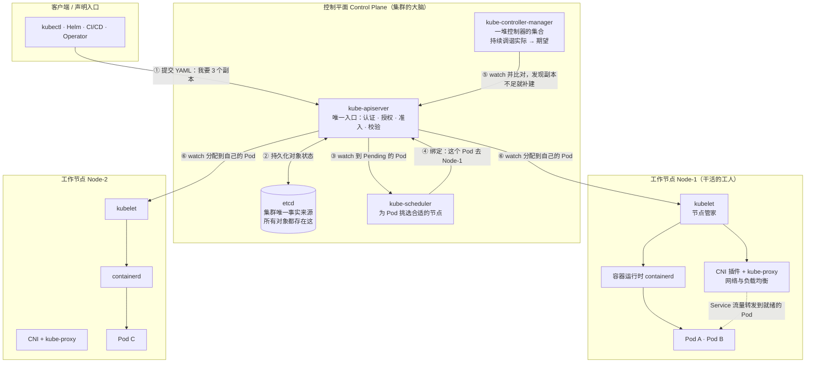
```mermaid
flowchart TB
    subgraph CLIENTS["客户端 / 声明入口"]
        K["kubectl · Helm · CI/CD · Operator"]
    end

    subgraph CONTROL["控制平面 Control Plane（集群的大脑）"]
        API["kube-apiserver<br/>唯一入口：认证 · 授权 · 准入 · 校验"]
        ETCD[("etcd<br/>集群唯一事实来源<br/>所有对象都存在这")]
        SCH["kube-scheduler<br/>为 Pod 挑选合适的节点"]
        CM["kube-controller-manager<br/>一堆控制器的集合<br/>持续调谐实际 → 期望"]
    end

    subgraph NODE1["工作节点 Node-1（干活的工人）"]
        KL1["kubelet<br/>节点管家"]
        CR1["容器运行时 containerd"]
        NET1["CNI 插件 + kube-proxy<br/>网络与负载均衡"]
        POD1["Pod A · Pod B"]
    end

    subgraph NODE2["工作节点 Node-2"]
        KL2["kubelet"]
        CR2["containerd"]
        NET2["CNI + kube-proxy"]
        POD2["Pod C"]
    end

    K -->|"① 提交 YAML：我要 3 个副本"| API
    API <-->|"② 持久化对象状态"| ETCD
    API -->|"③ watch 到 Pending 的 Pod"| SCH
    SCH -->|"④ 绑定：这个 Pod 去 Node-1"| API
    CM -->|"⑤ watch 并比对，发现副本不足就补建"| API
    API -->|"⑥ watch 分配到自己的 Pod"| KL1
    API -->|"⑥ watch 分配到自己的 Pod"| KL2
    KL1 --> CR1 --> POD1
    KL2 --> CR2 --> POD2
    KL1 --> NET1
    NET1 -.->|"Service 流量转发到就绪的 Pod"| POD1
```

看懂这张图的顺序建议：

1. **看形状**：左边是"人"，中间是"大脑"，右边是"手脚"。所有箭头都汇聚到 API Server，**没有任何一条线绕过它**。
2. **看数据流**：etcd 是唯一真相来源。你 `kubectl get pods` 看到的内容，全部来自 etcd 里存的对象的副本。
3. **看方向**：箭头 ③④⑤⑥ 都是 **watch（长连接订阅）**，不是"调用"。  
   这是 K8s 的性能秘诀：**没有人在轮询，也没有人在相互调用。所有人都在订阅 API Server 的变更通知。**

#### 一句话总结这张图

**K8s 本质上是一个"共享数据库 + 一群订阅它并各自干活的守护进程"。**

---

### <a id="sec-01-1-6"></a>1.6 灵魂三问：K8s 的三条核心原则

图谱之外，还有三条原则贯穿全书，后面 14 章都是它们的展开。

#### 原则一：一切皆对象（Everything is an Object）

在 K8s 里，你操作的从来不是"一个进程"或"一台机器"，而是一个**对象（Object）**：

- `Pod` 对象描述"一组容器应该怎么跑"
- `Service` 对象描述"一组 Pod 应该用什么地址被访问"
- `Node` 对象描述"一台机器现在有什么资源、什么状态"

每个对象都有：

```yaml
apiVersion: apps/v1       # 属于哪个 API 组和版本
kind: Deployment          # 是什么类型
metadata:
  name: api               # 叫什么
  labels:                 # 贴什么标签（用于筛选）
    app: cloudnote
spec:                     # 期望状态：我要它变成什么样（你写的）
status:                   # 实际状态：它现在是什么样（K8s 写的）
```

注意最后两行：**`spec` 是你的输入，`status` 是系统的输出。**你改 `spec`，系统负责让 `status` 追上 `spec`。

#### 原则二：通过声明 `spec`，让系统收敛 `status`

这就是第 1.3 节讲的调和循环。它的工程实现非常具体：

```
for {
    读期望状态 (spec)
    读实际状态 (status)
    if 两者不一致 {
        执行最小必要的动作让它一致
    }
    sleep 一小会儿 或 等待下一次事件通知
}
```

**自愈、扩缩容、滚动更新，全都是这一个循环的不同表现。**第 11 章你会看到，所谓"自愈"根本不是魔法，就是这个循环发现"要 3 个、只有 2 个"然后补了一个。

#### 原则三：松耦合 + 可扩展（CRD / Operator）

K8s 没有把"什么是一个应用"写死在代码里。它提供的是**框架**：

- 你可以用 **CRD（Custom Resource Definition）** 定义自己的对象类型，比如 `kind: MySQLCluster`。
- 然后写一个 **控制器**去调谐它，这叫 **Operator**。比如 Prometheus Operator、Kafka Operator。

所以 K8s 的能力边界是**可生长的**。这也是它统治市场的原因之一。

---

### <a id="sec-01-1-7"></a>1.7 一次 `kubectl apply` 之后，30 秒内发生了什么

这条链路是理解全书其余章节的主干道。

假设你执行：

```bash
kubectl apply -f api-deployment.yaml    # 里面写着 replicas: 3
```

#### 时间线

| 时刻      | 谁在动                       | 发生了什么                                                                                                                                             | 对应本书章节  |
| ------- | ------------------------- | ------------------------------------------------------------------------------------------------------------------------------------------------- | ------- |
| T+0.00s | **kubectl**               | 读本地 YAML，做客户端校验与转换，向 API Server 发 `POST /apis/apps/v1/namespaces/cloudnote/deployments`                                                           | —       |
| T+0.02s | **kube-apiserver**        | 三连关卡：① **认证**（你是谁）② **授权**（RBAC：你能否建 Deployment）③ **准入**（Mutating 先补默认值，如 `strategy: RollingUpdate`、`revisionHistoryLimit: 10`；Validating 再校验合法性） | 第 15 章  |
| T+0.05s | **kube-apiserver → etcd** | 校验通过，对象写入 etcd。**此刻这个 Deployment 才算"存在"了**。返回 201，kubectl 打印 `deployment.apps/api created`                                                        | 第 3 章   |
| T+0.06s | **Deployment 控制器**        | 它在 watch Deployment 的变更，收到事件："新建了一个要 3 副本的 Deployment"。于是创建一个 **ReplicaSet** 对象（名字类似 `api-7d4b9c8f5`）。它不直接建 Pod！                                  | 第 4、5 章 |
| T+0.08s | **ReplicaSet 控制器**        | watch 到新 ReplicaSet，发现 `status.replicas=0 < spec.replicas=3`，于是创建 3 个 **Pod 对象**写入 etcd。此时 Pod 的 `spec.nodeName` 是**空的**，`status.phase=Pending`   | 第 4、5 章 |
| T+0.10s | **kube-scheduler**        | watch 到"没有 nodeName 的 Pod"，开始两阶段决策：**Filter**（过滤掉资源不够、有污点、不满足亲和性的节点）→ **Score**（给剩下的节点打分）。选出 Node-1，写回 `spec.nodeName`。这叫**绑定（Binding）**          | 第 10 章  |
| T+0.15s | **Node-1 的 kubelet**      | watch 到自己名下多了 Pod，开始工作：调用 **CRI** 让 containerd 拉镜像 → 创建 **Pod Sandbox**（先起一个 `pause` 容器，用它建网络命名空间，调 **CNI** 分配 Pod IP）→ 起 init 容器 → 起业务容器         | 第 2、3 章 |
| T+5~20s | **kubelet**               | 容器跑起来了。**readinessProbe** 开始探测 `/healthz`。**探针通过之前，这个 Pod 不会接流量**                                                                                 | 第 11 章  |
| T+20s   | **EndpointSlice 控制器**     | 感知到 Pod 变成 Ready，把它的 `IP:port` 写进 Service 的后端列表                                                                                                   | 第 6 章   |
| T+20s+  | **kube-proxy**（每个节点）      | watch 到后端列表变化，在本机 iptables/IPVS 里写上转发规则。**到这一刻，流量才真的能进来**                                                                                         | 第 6 章   |
| 之后      | **kubelet**               | 每隔一段时间（或状态变化时）把 Pod 最新状态上报 API Server → etcd。**这就是 `kubectl get pods` 看到的那份数据**                                                                   | 第 3 章   |

#### 从这条链路里读出的三个重要结论

1. **没有人打电话给谁。** 所有组件都是 watch + 写对象，**没有直接的 RPC 调用**。这带来了极强的解耦与容错。
2. **API Server 是唯一入口。** 想改状态？只能通过它。想读状态？也只能通过它。etcd 从不对外暴露。
3. **"创建"是分层的。** 你建 Deployment，它建 ReplicaSet，ReplicaSet 建 Pod，kubelet 建容器。**每一层只管一件事**。这就是为什么"要 3 个副本"这件事能自动维持——它是 ReplicaSet 的 `spec.replicas` 在起约束作用。

这条链路是全书的主干道，后面每一章都在放大其中的某一段。

---

### <a id="sec-01-1-8"></a>1.8 名词地图：核心对象速查

下面是全书会出现的对象。不必现在记忆，扫一眼即可，知道有这么个东西、它属于哪一类就够了。

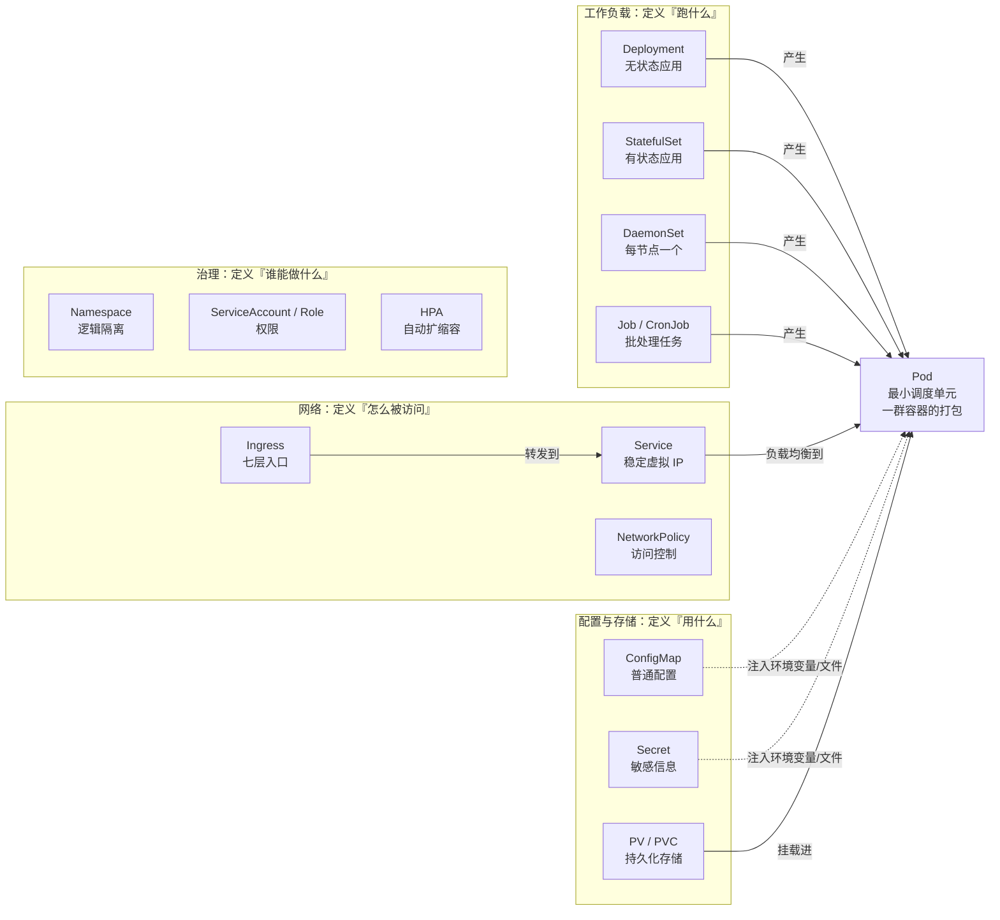
```mermaid
flowchart LR
    subgraph WORKLOAD["工作负载：定义『跑什么』"]
        DEP["Deployment<br/>无状态应用"]
        STS["StatefulSet<br/>有状态应用"]
        DS["DaemonSet<br/>每节点一个"]
        JOB["Job / CronJob<br/>批处理任务"]
    end

    subgraph NET["网络：定义『怎么被访问』"]
        SVC["Service<br/>稳定虚拟 IP"]
        ING["Ingress<br/>七层入口"]
        NP["NetworkPolicy<br/>访问控制"]
    end

    subgraph CONFIG["配置与存储：定义『用什么』"]
        CMAP["ConfigMap<br/>普通配置"]
        SEC["Secret<br/>敏感信息"]
        PV["PV / PVC<br/>持久化存储"]
    end

    subgraph GOVER["治理：定义『谁能做什么』"]
        NS["Namespace<br/>逻辑隔离"]
        RBAC["ServiceAccount / Role<br/>权限"]
        HPA["HPA<br/>自动扩缩容"]
    end

    DEP -->|"产生"| POD["Pod<br/>最小调度单元<br/>一群容器的打包"]
    STS -->|"产生"| POD
    DS -->|"产生"| POD
    JOB -->|"产生"| POD
    SVC -->|"负载均衡到"| POD
    ING -->|"转发到"| SVC
    CMAP -.->|"注入环境变量/文件"| POD
    SEC -.->|"注入环境变量/文件"| POD
    PV -->|"挂载进"| POD
```


| 类别    | 对象                                      | 一句话作用                     | 记忆抓手                       |
| ----- | --------------------------------------- | ------------------------- | -------------------------- |
| 最小单元  | **Pod**                                 | K8s 调度和运行的最小单位，里面跑一个或多个容器 | 豆荚：一粒荚里可以有几颗豆              |
| 无状态应用 | **Deployment**                          | 声明"某个镜像要跑 N 份"，并管理滚动更新与回滚 | 最常用，90% 的服务用它              |
| 中间层   | **ReplicaSet**                          | 只负责"保证恰好有 N 个 Pod"        | 通常由 Deployment 代管，你不用直接写   |
| 有状态应用 | **StatefulSet**                         | 每个 Pod 有稳定名字、稳定存储、有序启停    | 数据库、消息队列                   |
| 每节点一个 | **DaemonSet**                           | 保证每个（或指定的）节点上跑一份          | 日志采集、监控 Agent、CNI          |
| 批处理   | **Job / CronJob**                       | 跑完就结束的任务 / 定时任务           | 数据迁移、报表生成                  |
| 服务发现  | **Service**                             | 给一组 Pod 一个**稳定不变的地址**     | Pod 会死会重建 IP 会变，Service 不会 |
| 七层入口  | **Ingress**                             | 按域名和路径把外部流量分发到不同 Service  | 需要 Ingress Controller 才生效  |
| 配置    | **ConfigMap**                           | 存非敏感的键值配置，注入 Pod          | 配置与镜像解耦                    |
| 密钥    | **Secret**                              | 存密码、Token、证书（base64 编码）   | 别当它是加密的，默认只是编码             |
| 存储    | **PV / PVC**                            | PV 是"一块地皮"，PVC 是"用地申请"    | 声明式存储分配                    |
| 隔离    | **Namespace**                           | 逻辑上把集群切成多个虚拟小集群           | 团队/环境隔离                    |
| 权限    | **ServiceAccount / Role / RoleBinding** | 定义"哪个 Pod 能以什么身份做什么事"     | RBAC 三件套                   |
| 网络策略  | **NetworkPolicy**                       | 控制 Pod 之间能否通信             | 需要 CNI 支持                  |
| 伸缩    | **HPA**                                 | 按 CPU/内存/自定义指标自动调整副本数     | 第 12 章主角                   |
| 机器    | **Node**                                | 一台工作机器                    | 不是 Pod，是"地皮"               |
| 标签    | **Label / Selector**                    | 给对象贴标签，用选择器筛选             | K8s 的"关系型数据库外键"            |
| 注释    | **Annotation**                          | 存非筛选用途的元数据                | 给工具用的便签                    |

标签选择器（Label Selector）值得单独提一句：**K8s 里对象之间的"关系"几乎全靠标签来建立**。Deployment 靠标签找到自己的 Pod，Service 靠标签找到后端 Pod。这是 K8s 解耦的关键设计。

标签**只**用来做筛选；需要记长文本、给工具用、不参与筛选的信息，放 **Annotation**。

---

#### 最容易混淆的一对：Deployment 与 Service

上面那张表里，有两个名字最容易让人误以为是一回事——**因为它们的中文都沾了"服务"两个字**。先把它们彻底分开：

**Deployment 管"有没有人在干活"；Service 管"怎么找到干活的人"。**

| | Deployment | Service |
|---|---|---|
| 类别 | **工作负载（Workload）** | **网络对象（Network）** |
| 管什么 | 跑什么镜像、跑几个副本、怎么更新 | 给这组 Pod 一个**稳定地址**，做负载均衡 |
| 关注的本质 | **进程的存在性** | **地址的稳定性** |
| 同类兄弟 | StatefulSet / DaemonSet / Job / CronJob | Ingress / EndpointSlice / NetworkPolicy |
| 能否对外暴露端口 | **不能** | 能（ClusterIP / NodePort / LoadBalancer） |
| 没有对方会怎样 | 没有它，Pod 挂了不会自动重建 | 没有它，Pod 在跑但外部访问不到 |

**它们是两个平行的对象，不是包含关系。**典型的三层结构是这样的：

```
Deployment（管副本与版本）
      ↓ 创建并维持
   Pod × 3（真正跑进程，监听 :8080）
      ↑ 通过标签匹配
Service（提供稳定 ClusterIP + DNS，把流量分给这 3 个 Pod）
```

##### 最精彩的一点：它们互不认识

**Deployment 里没有任何字段指向 Service，Service 里也没有任何字段指向 Deployment。**它们之间唯一的联系是**标签**：

- Deployment 创建 Pod 时给它贴上 `app: api`
- Service 用 `selector: app: api` 去找后端

这个松耦合带来两个反直觉的推论，你可以亲手验证：

1. **删掉 Service，Deployment 毫不知情**——Pod 照样跑，副本数照样维持，只是外部访问不到了。
2. **把 Deployment 换成 StatefulSet，只要 Pod 的标签不变，Service 完全不需要改动。**

顺便纠正一个常见的错误认知：**Deployment 里的 `containerPort` 并不"开放"任何端口。**它只是**声明性质**的说明（给人和工具看的文档），真正让流量进来的必须是 Service。事实上，`containerPort` 不写也能正常工作——**除非你要用命名端口给 Service 引用**（`targetPort: http`），那时名字就变成必需的了。

一个类比帮你记牢：**Deployment 是后厨的排班表**（要几个厨师在岗，走一个补一个）；**Service 是前台的订餐电话**（客户打这个号码，转给任意一个在岗的厨师）。**排班表不接电话，订餐电话也不做菜。**

### <a id="sec-01-1-9"></a>1.9 贯穿全书的案例：CloudNote 云笔记

下面介绍全书的贯穿案例。从第 2 章到第 14 章，所有例子都围绕它展开。

#### 业务是什么

**CloudNote** 是一个在线笔记服务：用户写笔记、自动同步到云端、可以导出成 PDF。

#### 技术架构

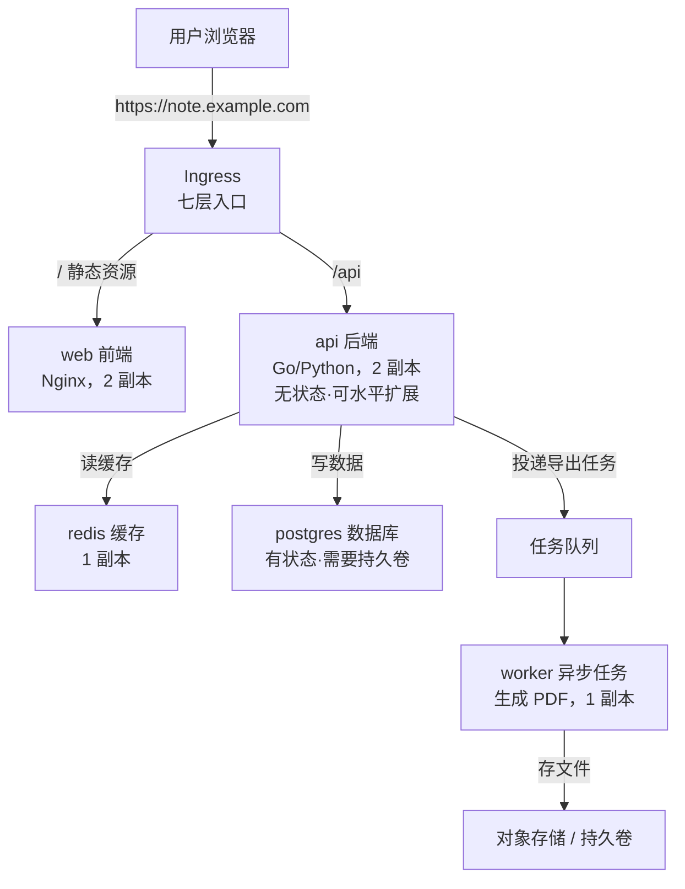
```mermaid
flowchart TB
    USER["用户浏览器"] -->|"https://note.example.com"| ING["Ingress<br/>七层入口"]
    ING -->|"/ 静态资源"| WEB["web 前端<br/>Nginx，2 副本"]
    ING -->|"/api"| API["api 后端<br/>Go/Python，2 副本<br/>无状态·可水平扩展"]
    API -->|"读缓存"| REDIS["redis 缓存<br/>1 副本"]
    API -->|"写数据"| PG["postgres 数据库<br/>有状态·需要持久卷"]
    API -->|"投递导出任务"| QUEUE["任务队列"]
    QUEUE --> WORKER["worker 异步任务<br/>生成 PDF，1 副本"]
    WORKER -->|"存文件"| OBJ["对象存储 / 持久卷"]
```

#### 它复刻了第 1.1 节里的四个地狱

| 地狱     | CloudNote 的具体表现                   | 将在哪一章被解决           |
| ------ | --------------------------------- | ------------------ |
| 环境漂移   | 测试环境 Go 1.21、生产 Go 1.20，行为有差异     | 第 2 章（容器镜像固化环境）    |
| 人肉扩容   | 每天晚上 20:00 同步高峰，API 需要 2 → 10 个实例 | 第 12 章（HPA 自动扩缩容）  |
| 故障无人接管 | api 容器 OOM 挂掉，没人拉起；worker 卡死但进程还在 | 第 11 章（探针 + 控制器自愈） |
| 发布靠勇气  | 全量替换导致 2 分钟不可用                    | 第 5 章（滚动更新 + 回滚）   |

再加两个新问题，正好对应另外几章：

- **配置散落**：数据库密码硬编码在镜像里，改一次要重新构建镜像 → 第 8 章
- **数据丢失**：容器重启后上传的附件全没了 → 第 9 章

#### 全书的推进路线

```
第 2-4 章：认识工具（Pod / 集群 / 控制器）      ← 打地基
第 5-9 章：把 CloudNote 完整搭起来              ← 建房子
第 10-13 章：让它稳、让它快、让它省             ← 精装修
第 14 章：把它从零部署一遍，然后亲手打挂它      ← 实战演习
第 15 章：生产上线检查清单与排错手册            ← 出师
```

案例的完整 YAML 清单会随章节逐步添加到本书配套仓库的 `cases/cloudnote/` 目录下。到第 14 章时，你会拿到一套可以直接 `kubectl apply -f` 跑起来的完整配置。

---

### <a id="sec-01-1-10"></a>1.10 动手：三种零成本起一个集群

概念看得再多，也不如亲手起一个集群。以下三种方式任选其一，都不花钱。

#### 方案 A：kind（推荐给动手党）

**kind = Kubernetes in Docker**。用 Docker 容器模拟 Kubernetes 节点，几十秒起一个多节点集群，最适合学习。

```bash
# macOS
brew install kind kubectl

# 起一个 1 控制平面 + 2 工作节点的集群
cat > kind-config.yaml <<'EOF'
kind: Cluster
apiVersion: kind.x-k8s.io/v1alpha4
nodes:
  - role: control-plane
  - role: worker
  - role: worker
EOF

kind create cluster --name k8s-study --config kind-config.yaml
```

#### 方案 B：minikube

```bash
brew install minikube kubectl
minikube start --nodes 2 --cpus 2 --memory 4096
```

#### 方案 C：k3s（最轻量，一条命令）

```bash
curl -sfL https://get.k3s.io | sh -
```

#### 或者：干脆不搭本地集群

- **Docker Desktop 自带**：设置里勾选 "Enable Kubernetes"，点应用就行。
- **云托管**：腾讯云 TKE / 阿里云 ACK / AWS EKS 都有免费试用额度，生产形态最接近真实。

#### 起好之后的三个验证命令

```bash
# 1. 看节点，状态应该是 Ready
kubectl get nodes -o wide

# 2. 看集群的系统组件都跑在哪
kubectl get pods -n kube-system

# 3. 看 API Server 暴露了哪些资源类型（这就是"一切皆对象"的证据）
kubectl api-resources | head -30
```

第 3 个命令很值得跑一下。你会看到一长串资源类型——**这个列表就是 K8s 的"对象字典"**，也是后续各章要逐个攻克的清单。

如果你暂时不想装环境也没关系。第 1-4 章是概念章，纯读也能懂；到第 5 章开始动手时再搭，也来得及。

---

### <a id="sec-01-1-11"></a>1.11 本章要点

1. **容器**解决了"环境一致"，但没有解决"谁来管"。
2. **Kubernetes** 是一个分布式操作系统，它用**声明式 API** 让你描述期望状态，用**控制器循环**把实际状态持续拧向期望状态。
3. **所有组件都通过 API Server 读写对象来协作**，etcd 是唯一事实来源，没有任何组件在轮询或直接互相调用。

#### 本章全景图

```
     你写 YAML                      K8s 持续干活
   （期望状态）          ┌──────────────────────────────┐
        │                │  调和循环 Reconciliation     │
        │                │                              │
        ▼                │   比对 spec 与 status         │
   ┌─────────┐           │        │                     │
   │  spec   │───────────┼────────┤ 一致 → 什么都不做     │
   └─────────┘           │        │ 不一致 → 采取行动      │
                         │        ▼                     │
   ┌─────────┐           │   创建/删除/重启/迁移         │
   │ status  │◄──────────┼────────┘                     │
   └─────────┘           └──────────────────────────────┘
        ▲
        └── 由各组件真实上报
```

### <a id="sec-01-1-12"></a>1.12 练习题


1. 用一个比喻解释"容器"和"虚拟机"的区别。
2. 为什么说容器不是"轻量虚拟机"？它到底用了 Linux 的哪两套机制？
3. "命令式"和"声明式"的区别是什么？为什么 K8s 选声明式？
4. 调和循环在做什么？它为什么能实现"自愈"？
5. 一次 `kubectl apply` 后，是**谁**把 Pod 分配到节点上的？它依据什么？
6. 为什么 `kubectl get pods` 能看到最新状态？数据从哪来？
7. Deployment 为什么不直接建 Pod，而要先建一个 ReplicaSet？（第 1.7 节，第 5 章会详细讲）
8. `spec` 和 `status` 分别是谁写的？


---

## <a id="ch-02-pod"></a>第 2 章　容器与 Pod：最小调度单元的秘密

第 1 章已说明，容器是被管的对象。但真去翻 Kubernetes 的文档，会发现一件奇怪的事：

**K8s 里根本没有 `kind: Container` 这种东西。**

你永远找不到一个叫 `Container` 的对象去创建它。你能创建的最小东西叫 **Pod**。

这就像你去餐厅点菜，菜单上最小的单位不是"一颗鸡蛋"，而是"一份蛋炒饭"——你要么要一整份，要么不要。为什么 K8s 要做这个设计？这一章就回答它。

---

### <a id="sec-02-2-1"></a>2.1 先想清楚：为什么不直接管容器？

先做个思想实验。假设你是 K8s 的设计者，你决定"最小单位就是容器"，简单直接。然后你遇到三个问题。

#### 问题一：有些进程天生"同生共死"

CloudNote 的 `api` 服务上线后，你需要一个日志采集器把它写到 stdout 的日志收走。

- 如果日志采集器是**独立的容器**、独立调度：它可能被调度到 Node-5，而 api 在 Node-1。它得跨节点去捞日志，还得自己维护"我要跟着哪个 api"的逻辑。api 挂了重建、换了节点，采集器要重新找。**复杂度爆炸。**
- 如果日志采集器**和 api 在一个单位里**：它们永远在一起，共享一块磁盘目录，采集器直接读文件。**简单。**

再想想：这两个进程的生命周期是不是该绑定？api 重建了，采集器还守着旧文件有意义吗？没有。**它们应该一起生、一起死。**

#### 问题二：有些进程需要"本地回环"级别的贴近

微服务里常见一种做法：主容器调用外部的数据库/缓存，中间夹一个本地代理（比如 Envoy sidecar、Cloud SQL Proxy）。

这个代理必须在**主容器的 localhost 上**。如果它俩在各自独立的网络命名空间里（也就是各自独立的容器），主容器就得拿代理的 IP 去连——IP 会变、要注册、要发现。而如果它们**共享一个网络命名空间**，主容器只要连 `localhost:3306` 就行了，**永远不变**。

#### 问题三：调度要有个"合理的粒度"

如果最小单位是容器，调度器要为每个容器单独算一遍资源、单独选一次节点。一个应用拆成 10 个容器，就是 10 次调度决策，还得保证它们尽量靠在一起（否则网络延迟爆炸）。

**粒度太细，调度器会累死，一致性也没法保证。**

#### 结论

上面三个问题指向同一个答案：

**"容器的管理粒度太细了，需要一个更大的、能表达'这几个东西必须在一起'的单位。"**

这个单位，就是 **Pod**。

顺便说一句，Pod 这个名字来自**鲸鱼群（a pod of whales）**——Docker 的 logo 是鲸鱼，所以 K8s 用"一群鲸鱼"来命名它的最小单位。一"群"里可以是一头，也可以是好几头。

---

### <a id="sec-02-2-2"></a>2.2 Pod 不是"容器组"，而是"一台逻辑小机器"

这是本章最重要的一句话，请反复读：

> **Pod 不是"把几个容器装在一起"，Pod 本身是一台逻辑上的小机器（a logical host）。容器是被部署到这台小机器上运行的进程。**

这个视角切换非常关键。对比一下就明白了：

| | 把 Pod 理解成"容器组" | 把 Pod 理解成"逻辑小机器" |
|---|---|---|
| 你关心的东西 | 有几个容器 | 这台机器有什么资源：一个 IP、一个端口空间、一块共享磁盘、一个主机名 |
| 为什么容器能互通 | 因为"打包在一起了" | 因为**它们跑在同一台机器上**，就像你在自己电脑上开两个进程 |
| 为什么端口会冲突 | 想不通 | 同一台机器上当然不能有两个进程听同一个端口 |
| 为什么能共享磁盘 | 因为配置了 | 因为**它们挂载的是同一块盘** |

用"合租房"来类比更直白：

- **Pod = 一套合租房**：有一个门牌号（Pod IP）、一个厨房（端口空间）、一个公共阳台（共享卷）。
- **容器 = 住进来的室友**：每人有自己独立的房间（独立文件系统 rootfs）、自己的行李。室友之间可以互相喊话（localhost 互通），但**不能两个人同时占用厨房的同一条灶**（端口冲突）。

再看一张正式定义：

**Pod 是一组容器的集合，这些容器共享网络命名空间、IPC 命名空间，以及可选的存储卷，并且总是被调度到同一台节点上一起运行。**

四个要点，一个都不能少：

1. **一组**：可以 1 个（最常见），也可以多个。
2. **共享网络 + IPC**：同一个 IP、同一个端口空间、可以用 localhost 互相访问。
3. **可选共享存储**：通过 Volume 实现，不是强制的。文件系统本身**不共享**。
4. **总是同节点**：**一个 Pod 永远不会跨机器。**这是原子性保证。

---

### <a id="sec-02-2-3"></a>2.3 解剖一个 Pod：那个你看不见的 pause 容器

下面拆开一个双容器 Pod，看 kubelet 实际创建了几个容器。

**答案是三个。**

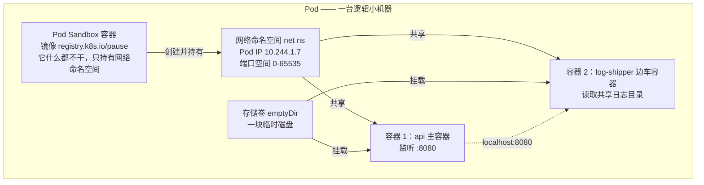
```mermaid
flowchart TB
    subgraph POD["Pod —— 一台逻辑小机器"]
        SANDBOX["Pod Sandbox 容器<br/>镜像 registry.k8s.io/pause<br/>它什么都不干，只持有网络命名空间"]
        NET["网络命名空间 net ns<br/>Pod IP 10.244.1.7<br/>端口空间 0-65535"]
        VOL["存储卷 emptyDir<br/>一块临时磁盘"]
        C1["容器 1：api 主容器<br/>监听 :8080"]
        C2["容器 2：log-shipper 边车容器<br/>读取共享日志目录"]
    end
    SANDBOX -->|"创建并持有"| NET
    NET -->|"共享"| C1
    NET -->|"共享"| C2
    VOL -->|"挂载"| C1
    VOL -->|"挂载"| C2
    C1 -.->|"localhost:8080"| C2
```

#### 那个 sandbox 容器是什么

它叫 **pause 容器**（也叫 infra 容器、sandbox 容器）。它的镜像只有几百 KB，里面就一个程序，干的事是这样的：

```c
// 伪代码：pause 容器的全部人生
for (;;) {
    pause();   // 挂起，什么都不做，等信号
}
```

**它不跑业务，不占资源，你 `kubectl get pods` 也看不到它。** 那它存在的意义是什么？

**它存在的唯一意义是：创建并持有这个 Pod 的网络命名空间。**

#### 为什么不把网络命名空间挂在业务容器上？

因为**业务容器会死，pause 容器不会。**

想一想：如果网络命名空间挂在 api 容器上，那么 api 容器因为 OOM 被重启时——

1. 网络命名空间跟着容器一起销毁
2. 新的 api 容器起来，创建新的网络命名空间
3. **CNI 重新分配一个新的 Pod IP**
4. 所有指向旧 IP 的东西全部失效

而有了 pause 容器做"锚点"：

1. api 容器死了 → 只有它自己的进程和文件系统消失
2. pause 容器还活着 → **网络命名空间原封不动**
3. 新的 api 容器被创建，**直接加入这个已有的网络命名空间**
4. **Pod IP 不变**，端口空间不变

这就是「容器重启，但 Pod 不重启」的秘密。**在 K8s 里，"Pod 重启"从来都不是真的重启 Pod，而是重建它里面的容器。**

#### 完整创建顺序

所以 kubelet 创建一个 Pod 的实际顺序是：

```
① kubelet 收到指令：这个 Pod 归我管
       ↓
② 调用 CRI（containerd）：先起 pause 容器
       ↓
③ 调用 CNI 插件（Calico/Cilium）：给 pause 容器的 net ns 分配 IP
       ↓
④ 挂载 Volume，准备共享目录
       ↓
⑤ 依次运行 init 容器（见第 2.6 节）
       ↓
⑥ 并行启动所有业务容器，并把它们的 net ns 指向 pause 容器
```

第 5 步之后的业务容器，都会带上类似这样的参数（由容器运行时处理）：

```
--net=container:<pause容器ID>
```

**这就是"共享网络"的物理实现：不是魔法，是让后来者加入同一个 net ns。**

---

### <a id="sec-02-2-4"></a>2.4 共享什么，不共享什么（含一个必踩的坑）

这一节最容易出错，下面把清单列清楚。

| 资源 | 是否共享 | 说明 |
|---|---|---|
| **网络命名空间** | **共享** | 同一个 Pod IP、同一个端口空间、容器间用 `localhost` 互访 |
| **IPC 命名空间** | **共享** | 共享内存、信号量，可以走 System V IPC |
| **存储卷 Volume** | **按需共享** | 只有显式挂载的卷才共享，是"指定目录"级别的共享 |
| **文件系统 rootfs** | **不共享** | 每个容器有自己的镜像层和可写层，看不到别人的 `/etc` |
| **进程命名空间 PID** | **默认不共享** | 默认看不到对方的进程；可用 `shareProcessNamespace: true` 打开（排错神器） |
| **主机名 hostname** | **共享** | 默认是 Pod 名，Pod 内所有容器看到的 hostname 一样 |
| **cgroup 资源限制** | **不共享** | 每个容器各自算 requests/limits，配额是分别施加的 |

#### 那个必踩的坑：端口冲突

既然共享网络命名空间，就意味着：**同一个 Pod 内的所有容器，共用一套端口号。**

```
Pod IP: 10.244.1.7
┌────────────────────────────────────────┐
│  端口空间（所有容器共用）                 │
│                                        │
│  :8080  ← api 容器监听                  │
│  :9000  ← sidecar 容器监听              │
│  :8080  ←  sidecar 也想监听 → 失败！   │
└────────────────────────────────────────┘
```

所以你会看到这种报错：

```
Error: listen tcp :8080: bind: address already in use
```

注意：**这不是"配置错了"，这是物理上做不到**，就像同一台电脑上不能有两个程序占同一个端口。

解决办法：让 sidecar 换一个端口（比如 9090），或者干脆把它做成同一个容器里的两个进程。

记住这条口决：**同一 Pod 内 = 同一台机器。同一台机器上不能重复占端口。**

#### 反过来，两个优势

1. **容器间通信零成本**：直接用 `localhost:端口`，不需要服务发现，不需要知道 Pod IP。
2. **对外只有一个 IP 和一个端口空间**：别的 Pod 要访问这个 Pod 里的任意容器，都用同一个 `PodIP:端口`。

---

### <a id="sec-02-2-5"></a>2.5 多容器 Pod 的三种经典模式

既然一个 Pod 里可以放多个容器，那"什么情况该放多个"就成了一个设计问题。业界总结出三种模式，名字很形象：

#### 模式一：Sidecar（边车）—— 最常用

**主容器负责业务，边车负责"周边事务"。**

经典场景：

| 边车干什么 | 用什么实现 |
|---|---|
| 收集日志并转发 | Fluent Bit、Filebeat |
| 暴露监控指标 | Prometheus exporter |
| 代理进出流量（做 mTLS、限流） | Envoy、Istio 的数据面 |
| 同步配置 / 证书轮转 | Vault Agent、cert-manager |

比如 CloudNote 的 api，日志直接打到 stdout。生产上你可能加一个边车把 `/var/log/app/*.log` 转发到日志平台。

业内趋势提醒：从 K8s 1.28 起，"边车容器"被正式支持为一等公民（`initContainers` 里带 `restartPolicy: Always`），它会**在主容器之后启动、在主容器之前停止**，非常适合代理类边车。这是后面版本的重要演进，先知道有这回事。

#### 模式二：Ambassador（大使）—— 代理对外连接

主容器连数据库时，不直接连，而是连 `localhost:3306`，由大使容器把请求代理到真实数据库。

好处：**主容器的代码里永远写 `localhost`，不用改代码就能切换数据库地址、加密连接、做连接池。**

#### 模式三：Adapter（适配器）—— 统一对外接口

主容器吐出的指标格式是个私有格式，适配器容器读进来，转成 Prometheus 标准格式再暴露出去。

**好处是不用改主容器代码就能对接监控体系。**

#### 一句话总结这三种模式

| 模式 | 方向 | 一句话 |
|---|---|---|
| Sidecar | 主 → 外 | 帮主容器把数据**送出去**（日志、指标、流量） |
| Ambassador | 外 → 主 | 帮主容器把连接**接进来**（代理外部依赖） |
| Adapter | 转换 | 帮主容器把格式**改一下**（适配标准） |

**它们的共同点：都是"在不改动主容器代码的前提下，给它扩展能力"。**

#### 一个重要的反例：什么时候不该用多容器 Pod

- 两个容器**可以独立伸缩**（比如前端要 10 个、后端要 2 个）→ 应该分成两个 Deployment，各自用 Pod。
- 两个容器**不需要 localhost 通信、不需要共享盘** → 分开，别硬凑。
- 只是"想少写一个 YAML" → 这是坏理由。多容器 Pod 的调试成本更高（要指定 `-c <容器名>`）。

> **判断准则：如果两个进程需要"同生共死 + localhost 通信 + 共享本地磁盘"中的任意两项，就放一个 Pod；否则分开。**

---

### <a id="sec-02-2-6"></a>2.6 init 容器：主容器的"先行部队"

现在解决第二个问题：**主容器启动前，如果需要先干点准备工作怎么办？**

比如 CloudNote 的 api 启动前需要：
1. 等数据库（postgres）能连上——不然 api 一起来就崩
2. 渲染一份配置文件到某个目录
3. 修一下数据目录的属主

把这些逻辑塞进主容器的启动脚本里当然也能写，但会污染业务镜像，也不够声明式。K8s 给的答案是 **init 容器（Init Container）**。

#### 核心规则：串行 + 全部成功

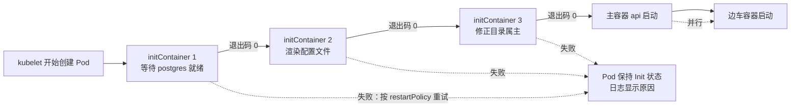
```mermaid
flowchart LR
    START["kubelet 开始创建 Pod"] --> I1["initContainer 1<br/>等待 postgres 就绪"]
    I1 -->|"退出码 0"| I2["initContainer 2<br/>渲染配置文件"]
    I2 -->|"退出码 0"| I3["initContainer 3<br/>修正目录属主"]
    I3 -->|"退出码 0"| MAIN["主容器 api 启动"]
    MAIN --> SIDE["边车容器启动"]
    MAIN -.->|"并行"| SIDE
    I1 -.->|"失败：按 restartPolicy 重试"| RETRY["Pod 保持 Init 状态<br/>日志显示原因"]
    I2 -.->|"失败"| RETRY
    I3 -.->|"失败"| RETRY
```

四条必须记住的规则：

1. **严格串行**：1 号跑完才跑 2 号，2 号跑完才跑 3 号。没有并行。
2. **必须成功退出**：每个 init 容器都要以退出码 `0` 结束。任何一个失败，整个 Pod 都会卡在初始化阶段，并按 `restartPolicy` 重试。
3. **全部成功后才起主容器**：所有 init 容器都成功了，业务容器才会被启动。
4. **主容器启动后，init 容器就永远结束了**：它们不会一直跑着，也不会被重启。

#### init 容器 vs 主容器：一张对比表

| 维度 | init 容器 | 主容器 |
|---|---|---|
| 执行方式 | 串行，一个接一个 | 并行，同时启动 |
| 生命周期 | 跑完就退出，不再运行 | 长期运行（或跑完退出，如 Job） |
| 探针 | **不支持** liveness / readiness / startup 探针 | 支持全部探针 |
| 生命周期钩子 | 不支持 `lifecycle` | 支持 `postStart` / `preStop` |
| 用途 | 准备工作：等待依赖、初始化、渲染配置 | 跑业务 | 
| 资源计算 | 调度时取 **max(所有 init 容器需求)** | 调度时取 **所有主容器需求之和** |

最后一行是个容易忽略的细节，但它解释了 K8s 的一个贴心设计：**因为 init 容器是串行的，它们不会同时占资源，所以调度时只看"最费资源的那个 init 容器"；而主容器是并行的，所以要加起来。**

#### 什么时候该用 init 容器

| 场景 | 例子 |
|---|---|
| 等待依赖就绪 | `until nc -z postgres 5432; do sleep 2; done` |
| 初始化数据库 schema | 跑一次 migration 脚本 |
| 拉取/渲染配置 | 从配置中心拉配置，生成 `app.conf` 到共享卷 |
| 修正文件权限 | `chown -R 1000:1000 /data`（常见于非 root 运行） |
| 下载模型、数据集 | AI 推理服务预热 |

顺带说，`wait-for-dependency` 这类逻辑，在纯 K8s 里也可以由**探针 + 重启**兜底（失败了就重启重试），但用 init 容器更明确、日志更清晰、也不会让主容器反复崩溃。第 11 章讲探针时会对比这两种思路。

---

### <a id="sec-02-2-7"></a>2.7 Pod 的生命周期：从 Pending 到 Terminating

现在讲一个初学者经常困惑的问题：**为什么我的 Pod 状态一会儿 Pending、一会儿 ContainerCreating、一会儿 Running？**

#### 五个阶段（phase）

Pod 的 `status.phase` 只有五个可能值：

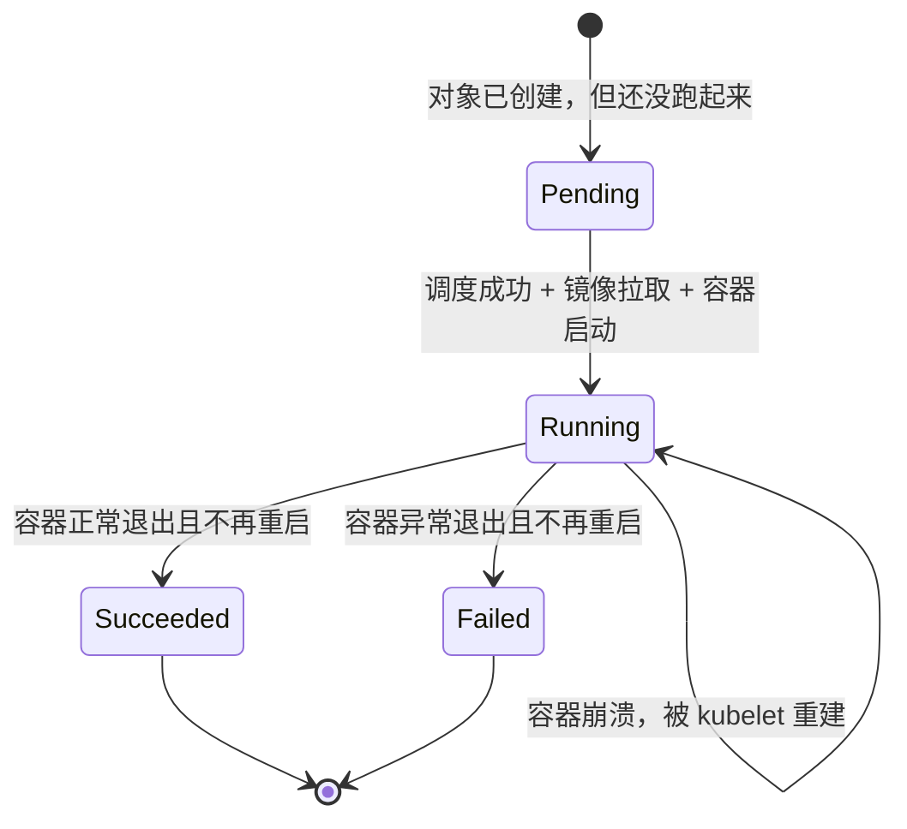
```mermaid
stateDiagram-v2
    [*] --> Pending: 对象已创建，但还没跑起来
    Pending --> Running: 调度成功 + 镜像拉取 + 容器启动
    Running --> Succeeded: 容器正常退出且不再重启
    Running --> Failed: 容器异常退出且不再重启
    Running --> Running: 容器崩溃，被 kubelet 重建
    Succeeded --> [*]
    Failed --> [*]
```

| phase | 含义 | 常见原因 |
|---|---|---|
| **Pending** | 对象已存在于 etcd，但还没有容器真正跑起来 | ① 调度器还没分配节点 ② init 容器正在跑 ③ 正在拉镜像（ContainerCreating） |
| **Running** | 至少一个容器在运行（或有容器正在启动/重启） | 正常状态 |
| **Succeeded** | 所有容器都成功退出，且不会被重启 | Job 类任务完成 |
| **Failed** | 所有容器都结束了，且至少一个是非正常退出 | 应用启动即崩、restartPolicy=Never |
| **Unknown** | 拿不到 Pod 状态，通常是节点失联 | 节点宕机、网络分区 |

**重点**：`Pending` 不代表"坏了"。它可能是正常的中间态。要判断原因，看 `kubectl describe pod` 的 **Events** 区域。

#### 单个容器的状态（更细一层）

每个容器还有自己的 `state`：

| 容器状态 | 含义 | 排查入口 |
|---|---|---|
| `Waiting` | 还没开始跑（正在拉镜像、init 没跑完、或用 `kubectl get pods` 看到 `ContainerCreating`） | `describe` 的 Events |
| `Running` | 正在跑 | `logs` / `exec` 看里面 |
| `Terminated` | 跑完了（不论成功失败） | 看 `exitCode` 和 `reason`（`OOMKilled` 是熟面孔） |

#### restartPolicy：谁来负责重启容器

| 值 | 行为 | 适用 |
|---|---|---|
| **Always**（默认） | 容器退出就重启，不论退出码 | 长期服务。**Deployment/ReplicaSet 管理的 Pod 必须是 Always** |
| **OnFailure** | 只有非 0 退出才重启 | 批处理任务（Job） |
| **Never** | 从不重启 | 一次性任务、调试 |

注意：**`restartPolicy` 是 Pod 级别的，作用于 Pod 内的所有容器。**而且它管的是"容器重启"，不是"Pod 重建"——Pod 重建是控制器（Deployment/ReplicaSet）的事。

#### 一个必须扭转的观念：Pod 是一次性的

传统运维的思维是：服务器是一头**宠物（pet）**——给它起名字、精心喂养、病了要治。

K8s 的思维是：Pod 是一头**牲口（cattle）**——它没有"名字"这个概念（或者说名字是由控制器给的序号），病了就换一头，**你从来不去修一个 Pod**。

这句话有很多推论，每一条都很实用：

| 推论 | 具体表现 |
|---|---|
| Pod 被删除是**正常现象** | 滚动更新、节点缩容、驱逐，都会删 Pod |
| Pod IP **不稳定** | 重建的 Pod 会拿到新 IP，所以绝不能把 Pod IP 写死在配置里（→ 第 6 章 Service） |
| Pod 名**通常不稳定** | Deployment 的 Pod 名带随机后缀。需要稳定名字 → 第 13 章 StatefulSet |
| 对 Pod 的**手动改动会丢** | 改了 Deployment 会触发新 Pod，你的改动就没了。**要改就改上层的控制器** |
| Pod 只能被**限制性修改** | 创建后只有少数字段可以原地改（如容器镜像、部分资源字段）；大多数改动会被 API Server 拒绝，只能重建 |

第 4 章讲的"调和循环"在这里体现得非常明显：**Pod 是"实际状态"，Deployment 里的 `replicas: 3` 才是"期望状态"。你删掉一个 Pod，控制器发现实际比期望少了一个，立刻补一个。**你手动改 Pod 叫"和控制器对抗"，改的永远是最上面的控制器才对。

---

### <a id="sec-02-2-8"></a>2.8 动手：写一个多容器 Pod，亲手验证"共享"

理论讲够了，跑一遍。

本节实验需要一个集群，搭建方式见第 1.10 节。没有集群时，只读命令与输出也能理解。

#### 第一步：准备命名空间

```bash
kubectl apply -f cases/cloudnote/00-namespace.yaml
```

这一步只是创建了一个叫 `cloudnote` 的逻辑抽屉。第 8 章会详细讲 Namespace。

#### 第二步：创建演示 Pod

```bash
kubectl apply -f cases/cloudnote/15-pod-demo.yaml
```

这个 Pod 里有**三个容器**，结构如下：

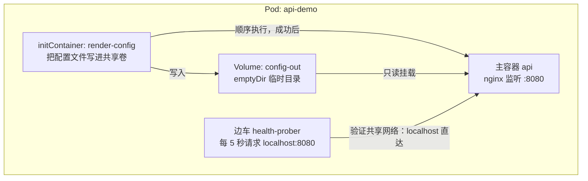
```mermaid
flowchart TB
    subgraph P["Pod: api-demo"]
        I1["initContainer: render-config<br/>把配置文件写进共享卷"]
        V["Volume: config-out<br/>emptyDir 临时目录"]
        M["主容器 api<br/>nginx 监听 :8080"]
        S["边车 health-prober<br/>每 5 秒请求 localhost:8080"]
    end
    I1 -->|"顺序执行，成功后"| M
    I1 -->|"写入"| V
    V -->|"只读挂载"| M
    S -->|"验证共享网络：localhost 直达"| M
```

#### 第三步：观察它的一生

```bash
# 实时盯着状态变化，你会看到 STATUS 从 Init:0/1 变到 Running
kubectl get pod api-demo -n cloudnote -w
```

典型输出演进：

```
NAME       READY   STATUS     RESTARTS   AGE
api-demo   0/2     Init:0/1   0          0s     ← init 容器在跑
api-demo   0/2     PodInitializing   0     1s     ← init 成功了
api-demo   2/2     Running    0          3s     ← 两个业务容器都起来了
```

注意 `READY` 那一列是 `2/2`——**因为这是双容器 Pod，分母是 2。**这个细节后面讲探针和滚动更新时非常重要。

#### 第四步：验证"共享网络"

```bash
# 看边车容器的日志：它用 localhost 请求主容器的 8080，成功了
kubectl logs api-demo -n cloudnote -c health-prober --tail=5
```

预期输出：

```
api 健康
api 健康
api 健康
```

**这个边车容器在自己的代码里写的是 `http://localhost:8080`，而 8080 是主容器监听的端口。它们能通，就因为共享了同一个网络命名空间。**

#### 第五步：验证"端口空间也是共享的"

```bash
# 进入主容器，看里面能访问什么
kubectl exec -it api-demo -n cloudnote -c api -- sh

# 容器内执行：访问本机 8080，应该拿到 nginx 页面
wget -qO- http://localhost:8080 | head -5
exit
```

现在故意制造**端口冲突**，加深印象。把边车容器也改成监听 8080：

```bash
kubectl patch pod api-demo -n cloudnote --type=json -p='[{"op":"replace","path":"/spec/containers/1/command","value":["sh","-c","nc -l -p 8080"]}]'
```

你会看到类似这样的报错：

```
The Pod "api-demo" is invalid: ... field is immutable
```

**这也是个知识点**：Pod 的大部分字段创建后不可修改。要改就得删掉重建——这就是 K8s 的哲学：**Pod 是一次性的，改不了的。**

如果你确实想体验端口冲突，可以临时把 YAML 里边车的命令改成监听 8080，删掉重建：

```bash
kubectl delete pod api-demo -n cloudnote
# 编辑 15-pod-demo.yaml，把 health-prober 的 command 改成 nc -l -p 8080
kubectl apply -f cases/cloudnote/15-pod-demo.yaml
kubectl get pod api-demo -n cloudnote
kubectl logs api-demo -n cloudnote -c health-prober
```

你会看到 `address already in use`，边车容器反复崩溃重启，`RESTARTS` 数字一直涨。

#### 第六步：看看那些"看不见"的东西

```bash
# 只显示容器，注意没有 pause 容器（它是 sandbox，不算 Pod 的容器）
kubectl get pod api-demo -n cloudnote -o jsonpath='{.spec.containers[*].name}'; echo

# 看 Pod IP —— 这个 IP 实际挂在 pause 容器的网络命名空间上
kubectl get pod api-demo -n cloudnote -o wide

# 看初始化过程的事件，能清楚看到 init 容器是先跑的
kubectl describe pod api-demo -n cloudnote | sed -n '/Events/,$p'
```

#### 第七步：删掉它，观察"没有控制器"的后果

```bash
kubectl delete pod api-demo -n cloudnote
kubectl get pods -n cloudnote
```

输出是 `No resources found`。

**Pod 不会自动回来。**

这个"什么都没发生"的结果，是本章最重要的实验结论：**裸 Pod 没有自愈能力。**因为没有任何控制器在盯着"应该有 1 个 api-demo 在跑"这个期望状态。

这正是第 5 章 Deployment 要解决的问题。**你刚刚亲手制造了"故障无人接管"这个地狱。**

#### 附带技巧：打开进程命名空间，看穿一切

Pod 里想看到"所有容器"的进程，可以开启共享 PID 命名空间。创建时加上：

```yaml
spec:
  shareProcessNamespace: true
  containers:
    - name: api
      image: nginx:1.27-alpine
    - name: sidecar
      image: busybox:1.36
      command: ["sh", "-c", "sleep 3600"]
```

然后：

```bash
kubectl exec -it <pod> -c sidecar -- ps aux
```

**你会看到 nginx 的进程号。**在默认配置下这是看不到的——这就是 PID 命名空间隔离的效果。这个技巧在排错"容器莫名挂掉"时非常有用，因为它能让你在一个容器里看到全 Pod 的进程视图。

---

### <a id="sec-02-2-9"></a>2.9 对应到 CloudNote：api 的 Pod 长什么样

回到贯穿案例。CloudNote 的 `api` 在生产环境的标准形态如下：

```yaml
apiVersion: v1
kind: Pod                    # 生产环境这里会是 Deployment（第 5 章）
metadata:
  name: api
  namespace: cloudnote
  labels:
    app: cloudnote           # 标签是 K8s 里"建立关系"的方式
    component: api
spec:
  initContainers:
    # ① 等数据库就绪，避免主容器反复崩溃刷日志
    - name: wait-for-postgres
      image: busybox:1.36
      command: ["sh", "-c", "until nc -z postgres 5432; do sleep 2; done"]
  containers:
    # ② 主容器：业务逻辑
    - name: api
      image: registry.example.com/cloudnote/api:1.2.3
      ports:
        - name: http
          containerPort: 8080
      volumeMounts:
        - name: shared-logs
          mountPath: /var/log/app
      resources:
        requests: { cpu: 100m, memory: 128Mi }
        limits:   { cpu: 500m, memory: 512Mi }
    # ③ 边车：把日志目录转发到日志平台
    - name: log-shipper
      image: registry.example.com/cloudnote/log-shipper:0.4.1
      volumeMounts:
        - name: shared-logs
          mountPath: /var/log/app
          readOnly: true
  volumes:
    - name: shared-logs
      emptyDir: {}
  restartPolicy: Always
```

注意三个设计选择，都对应前面讲的知识点：

1. **`wait-for-postgres` 用 init 容器而不是写在主容器启动脚本里**——日志清晰、不污染业务镜像、不会让 api 反复崩溃刷屏。
2. **日志目录用 `emptyDir` 共享给边车**——典型的 Sidecar 模式。注意 `emptyDir` 的生命周期是"随 Pod"：Pod 删了目录就清空。**这对日志来说正合适**（日志已经被转发走了），但对数据来说是灾难（→ 第 9 章讲持久化）。
3. **主容器和边车都挂载了同一个卷**——一个读写、一个只读，这是最小权限的好习惯。

---

### <a id="sec-02-2-10"></a>2.10 本章要点

1. **Pod 是"一台逻辑小机器"，不是一个"容器包"**。它有自己的 IP、端口空间、主机名和共享磁盘；容器是被部署到这台机器上的进程。
2. **共享靠 pause 容器**：pause 容器持有网络命名空间，业务容器"加入"它。这让容器可以随便重启，而 **Pod IP 保持不变**。
3. **Pod 是一次性的、不可修复的**。它没有自愈能力，改不了的字段只能重建；保证"要几个 Pod"是上层控制器（Deployment）的职责。

#### 本章全景图

```
                    ┌─── Pod（一台逻辑小机器）───────────────┐
                    │                                        │
   调度器给的最小    │  ┌──────────────┐                      │
   单位就是这一个 → │  │ pause 容器    │ ← 持有 net ns         │
                    │  │ Pod IP 在这   │   Pod IP 不变         │
                    │  └──────┬───────┘                       │
                    │         │ 共享                          │
                    │    ┌────┴────┐                          │
                    │    ▼         ▼                          │
                    │ ┌──────┐  ┌──────┐   ┌──────────────┐   │
                    │ │ 主容器│  │ 边车 │   │ emptyDir 卷  │   │
                    │ │ api  │◄─┤ 日志 │   │ 挂进两者     │   │
                    │ └──────┘  └──────┘   └──────────────┘   │
                    │  localhost 互通  端口空间共用             │
                    └────────────────────────────────────────┘
                       一个 Pod 永远只在一台节点上
```

### <a id="sec-02-2-11"></a>2.11 练习题

1. 为什么 K8s 的最小调度单位是 Pod 而不是容器？举出至少两个理由。
2. pause 容器的唯一作用是什么？如果没有它，容器重启会发生什么严重后果？
3. 同一个 Pod 里两个容器都想监听 8080 端口，会发生什么？为什么？
4. Sidecar、Ambassador、Adapter 三种模式各自解决什么问题？用一句话说清区别。
5. init 容器和主容器在"执行顺序"和"生命周期"上有哪三点本质区别？
6. 一个 Pod 有 3 个主容器和 1 个 init 容器，调度时资源需求怎么算？
7. 为什么说 "Pod IP 是稳定的，但 Pod 是易失的"？这两句话矛盾吗？
8. 你手动 `kubectl edit` 改了一个由 Deployment 管理的 Pod，为什么改动很快就"消失"了？
9. `emptyDir` 的数据什么时候会丢？什么场景适合用它？


---

## <a id="ch-03-cluster-anatomy"></a>第 3 章　集群的解剖学：控制平面与工作节点

第 1 章给出了集群的全景图，第 2 章钻进了 Pod 内部。本章退回到整机视角，把这台"分布式操作系统"拆成零件，逐个说明它们的职责边界。

拆解遵循一条主线：先把集群劈成控制面与数据面两半，再沿着"入口—存储—决策—执行"的顺序，依次说明 kube-apiserver、etcd、kube-scheduler、kube-controller-manager、kubelet、kube-proxy 与容器运行时各自负责什么、不负责什么。最后用一组"杀掉某个组件"的实验，把每个组件的失效半径量出来。

读完之后，`kubectl get pods -n kube-system` 输出的那一堆名字应当不再陌生——每一个都能对应到本章的一个职责。

---

### <a id="sec-03-3-1"></a>3.1 先把集群劈成两半：控制面与数据面

这是理解整个 K8s 架构的**第一把钥匙**。任何分布式系统都可以这样切：

| 平面 | 干什么 | 类比 | 挂了会怎样 |
|---|---|---|---|
| **控制面（Control Plane）** | 做决策、存状态、下发指令 | 公司总部：战略、审批、台账 | 不能**改**东西，但**已经在跑的业务不受影响** |
| **数据面（Data Plane）** | 真正处理用户流量、跑业务进程 | 门店：接待客户、干活 | 业务直接中断，用户立刻感知 |

这个分层是 Kubernetes 高可用的根基。第 1 章把 Kubernetes 类比为分布式操作系统，现在可以给这句类比补上细节：

| 单机 Linux | K8s 控制面 | K8s 数据面 |
|---|---|---|
| 内核调度器 | kube-scheduler | — |
| `/proc` 文件系统 | kube-apiserver + etcd | — |
| 内核驱动子系统 | kube-controller-manager | kubelet |
| 进程实际执行 | — | containerd + 业务进程 |
| 内核网络栈 | — | kube-proxy + CNI |

**关键结论先给出来**：

**控制面挂了 → 集群"冻结"：不能新建、不能删除、不能扩容，但已经在跑的容器照跑，用户无感知。**
**数据面挂了 → 业务真的中断。**

记住这句话，第 3.7 节会专门验证它。

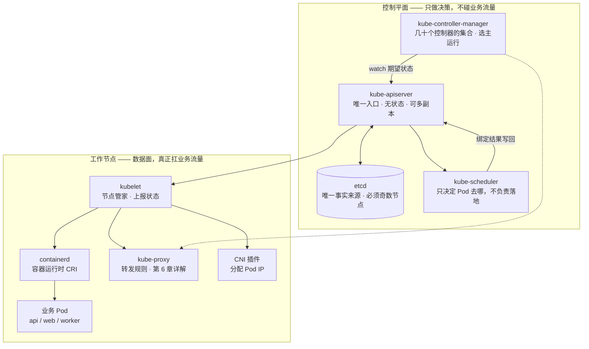
```mermaid
flowchart TB
    subgraph CP["控制平面 —— 只做决策，不碰业务流量"]
        API["kube-apiserver<br/>唯一入口 · 无状态 · 可多副本"]
        ETCD[("etcd<br/>唯一事实来源 · 必须奇数节点")]
        SCH["kube-scheduler<br/>只决定 Pod 去哪，不负责落地"]
        CM["kube-controller-manager<br/>几十个控制器的集合 · 选主运行"]
    end

    subgraph W["工作节点 —— 数据面，真正扛业务流量"]
        KL["kubelet<br/>节点管家 · 上报状态"]
        RT["containerd<br/>容器运行时 CRI"]
        KP["kube-proxy<br/>转发规则 · 第 6 章详解"]
        CNI["CNI 插件<br/>分配 Pod IP"]
        P["业务 Pod<br/>api / web / worker"]
    end

    API <--> ETCD
    API --> SCH
    SCH -->|"绑定结果写回"| API
    CM -->|"watch 期望状态"| API
    API --> KL
    KL --> RT
    RT --> P
    KL --> CNI
    KL --> KP
    CM -.-> KP
```

图里有个细节值得先注意：**控制面和数据面之间只有一条路——kubelet 从 API Server 拉取"分给我的 Pod"。**API Server 从不主动去连接节点上的任何东西。这个方向上的单向性，是后面所有"节点失联"行为的原因。

#### 追问一下：数据面到底"在哪"？

这一段是专门写给"没看懂"的人的。因为"数据面"是本章最容易卡住的一个词。

你在 `kubectl get pods -n kube-system` 里永远找不到一个叫 `data-plane` 的东西。**因为数据面不是一个组件，而是一条路径。**

| | 控制面 | 数据面 |
|---|---|---|
| 它是什么 | 一组**进程** | 一组**机制**，它不是一个软件 |
| 它在哪 | 跑在控制面机器上 | 散落在**每个节点的内核**里、**每个 Pod 的网卡**上、**每个容器的进程**里 |
| 什么时候参与 | **只在"要变更"的那一刻**（建 Pod、扩容、改配置） | **每一毫秒**，每个用户请求都要走一遍 |

数据面具体由三样东西构成：

1. **节点内核里的转发规则**（iptables / IPVS）——负责"把包送到对的地方"
2. **节点之间的网络通路**（CNI 铺的 veth、路由、VXLAN/BGP）——负责"跨机器把包送过去"
3. **真正在处理的进程**（nginx、api 二进制）——负责"把请求变成响应"

##### 跟着一个请求走一遍

场景：用户在浏览器里打开 `https://note.example.com/api/notes`。

**第 1 跳：请求到达节点网卡**

DNS 把域名解析到集群入口地址（LoadBalancer 的公网 IP，或某个节点的 IP）。数据包到达 **Node-1 的物理网卡 eth0**。

注意：这一跳和 K8s 完全无关，就是普通的 TCP/IP。

**第 2 跳：内核规则接住了它**

包进入 Node-1 的**内核网络栈**。内核查 iptables/IPVS 规则，命中一条：

```
目的端口 443 的包  →  DNAT  改写成 10.244.2.5:8443
```

**这条规则是 kube-proxy 在 Service 被创建的那一刻写进去的。**用户请求到达时，kube-proxy 早就写完规则、退出路径了——**它根本不在转发链路上。**

这是最反直觉的一点，值得单独记：**kube-proxy 不是"代理"，它是"规则写入器"。**流量是内核在转发的，不是 kube-proxy 在转发。

**第 3 跳：跨节点送包**

`10.244.2.5` 那个 Ingress Controller Pod 在 **Node-2** 上。包怎么过去的？靠**CNI 插件**建立的节点间网络（VXLAN 隧道，或者 BGP 宣告的路由）。

这一段是 CNI 插件的战场，也是第 6 章会专门讲的。

**第 4 跳：Ingress 看 HTTP 头，再转一次**

包到达 Node-2，落入 Ingress Controller Pod 的网络命名空间。nginx 读 HTTP 请求，看到 `Host: note.example.com`、路径 `/api`，于是按 Ingress 规则决定转发给 `api` 这个 Service。

它连的是什么地址？**Service 的 ClusterIP**，比如 `10.96.14.7:8080`。

ClusterIP 是个"虚拟 IP"——**没有任何一块网卡拥有它**，全世界只有内核的 iptables 规则认识它。这是第 6 章的重头戏。

**第 5 跳：内核再 DNAT 一次，落到真正的 Pod**

Node-2 的内核又是查规则，`10.96.14.7:8080` → `10.244.1.9:8080`（api Pod）。

**第 6 跳：业务进程干活**

api 容器里的进程收到 HTTP 请求，查 redis、读 postgres，拼出 JSON，原路返回。

##### 从这条路径里能读出的三件事

**第一，从头到尾没有控制面。**没有 API Server、没有 etcd、没有 scheduler、没有 controller-manager，**连 kube-proxy 都不在路径上**。

这就是第 3.1 节那句"控制面挂了业务照跑"的物理原因——不是"设计得好"，而是**业务流量的路径上压根就没有它们**。

**第二，数据面的关键角色是"内核"，不是"K8s"。**
真正转发字节的是 Linux 内核的 netfilter 子系统。K8s 做的事情是**往内核里写规则**，写完之后就交给内核了。这也是为什么 K8s 的网络性能问题，最后往往要回到内核参数上来调。

**第三，"数据面"这个词在不同语境下指代的东西不一样**，读文档时要留意：

| 语境 | "数据面"指的是 |
|---|---|
| 本节（K8s 集群视角） | 节点内核规则 + CNI 网络 + 容器进程 |
| 服务网格（Istio 视角） | 每个 Pod 里的 Envoy 代理（对比"控制面" Istiod） |
| 网络设备（路由器视角） | 转发芯片上跑的快路径（对比管理 CPU 上的控制协议） |
| 存储（Ceph 等） | 真正搬运数据块的 OSD（对比 MON 元数据集群） |

**共同点是一致的：控制面负责"决定"，数据面负责"执行"。**决定可以慢、可以挂、可以重来；执行必须快、必须一直在线。这条分界线,是几乎所有基础设施系统的通用设计。

##### 一个类比帮你收尾

- **控制面 = 交通指挥中心**：规划哪条路单行、哪个路口禁止左转、设置红绿灯的配时。
- **数据面 = 马路本身 + 红绿灯 + 正在路上跑的车**。

指挥中心停电了，马路上的车照样在开——因为**红绿灯的规则早就设好了，规则一旦写进去，就不需要指挥中心了**。

只有当你**要改规则**的时候（新增一个 Service、扩容、节点故障），指挥中心才需要重新介入。

---

### <a id="sec-03-3-2"></a>3.2 kube-apiserver：唯一的门，也是全集群的咽喉

在第 1 章的 30 秒时间线里，几乎每一步都有它。它是整个集群里**唯一一个所有组件都必须经过的组件**。

#### 它到底在做三件事

所有请求进来，都要过三道关卡，顺序不可颠倒：

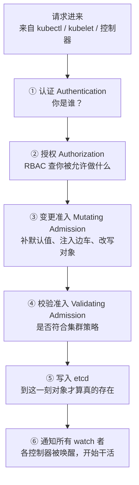
```mermaid
flowchart TB
    REQ["请求进来<br/>来自 kubectl / kubelet / 控制器"] --> A["① 认证 Authentication<br/>你是谁？"]
    A --> B["② 授权 Authorization<br/>RBAC 查你被允许做什么"]
    B --> C["③ 变更准入 Mutating Admission<br/>补默认值、注入边车、改写对象"]
    C --> D["④ 校验准入 Validating Admission<br/>是否符合集群策略"]
    D --> E["⑤ 写入 etcd<br/>到这一刻对象才算真的存在"]
    E --> F["⑥ 通知所有 watch 者<br/>各控制器被唤醒，开始干活"]
```

逐条说：

| 步骤 | 做什么 | 典型实现 | 失败结果 |
|---|---|---|---|
| **认证** | 判断"你是谁" | 客户端证书、ServiceAccount Token、OIDC | `401 Unauthorized` |
| **授权** | 判断"你能不能做这件事" | RBAC（第 15 章详解） | `403 Forbidden` |
| **变更准入** | **改写**对象：补默认值、注入边车 | 内置默认值、LimitRanger、Istio sidecar 注入 | — |
| **校验准入** | **拒绝**不合规对象 | PodSecurity、ResourceQuota、自定义 Webhook | 报错，对象不落库 |
| **持久化** | 写 etcd | — | `500`，操作失败 |
| **通知** | 通过 watch 长连接推送变更 | — | 后续控制器不动作，表现为"卡住" |

**第 3 步是个隐藏的宝藏**。你有没有想过：为什么你 YAML 里明明没写 `strategy: RollingUpdate`，`kubectl get deploy -o yaml` 里却能看到它？

**因为变更准入阶段帮你补上了。**K8s 里绝大多数"默认值"都是在这道关卡注入的。这也是为什么 `kubectl apply` 之后 `get` 出来的东西总比你写的多——**API Server 会"丰富"你的对象。**

#### 为什么它能扛住整个集群

如果每个组件都直接读写 etcd，etcd 会被打爆，鉴权逻辑也会散落各处。API Server 用三个设计解决了这个问题：

| 设计 | 作用 |
|---|---|
| **唯一入口** | 所有校验、鉴权、审计只做一次，逻辑集中 |
| **无状态（stateless）** | 它自己不存任何东西，全在 etcd 里。**所以可以随便起 3 个副本、随便重启** |
| **watch + 本地缓存** | 组件不是轮询它，而是建立长连接订阅变更；SDK（client-go）在本地维护一份缓存（informer），绝大多数读操作根本不到 API Server |

最后一条是性能关键。`kubectl get pods` 看起来是"查了一次 API Server"，实际上：

```
kubectl → API Server → 读 etcd（或用它的 watch 缓存）→ 返回
                            ↑
        控制器 / kubelet / scheduler 都在本地缓存里读，
        它们 99% 的读操作压根不碰 etcd
```

这也解释了一个常见误解：**"K8s 集群大了 etcd 会被读爆"。**现实恰恰相反——etcd 的读压力主要来自 API Server 的缓存失效，真正的写压力才是瓶颈。这也是为什么 K8s 对对象数量、ConfigMap 大小（1MB 上限）都有硬限制。

#### 一个高频误解：它是"调度者"吗？

学到这里，很多人会得出一个结论：

"apiserver 就是集群的调度者吧？所有请求都通过它发送和接收。"

**这句话对了一半，而错的那一半会引发连锁困惑。**

对的那一半（而且很关键）：

**所有请求都必须经过它，没有例外。**读也好、写也好，kubectl 也好、kubelet 也好、控制器也好——全集群只有这一个地址能读写状态。

错的那一半：**它不"调度"，它不决定任何事。**

中文里"调度"这个词有两个意思，容易混在一起：

| "调度"的含义 | 对应 K8s 里的谁 |
|---|---|
| 分配任务、安排资源（scheduling） | **kube-scheduler**——这才是真正的"调度者" |
| 统一收发、中转（dispatching） | apiserver，但更准确的说法是**唯一入口 / 中枢**，不是"调度者" |

精确的一句话应该是：

> **kube-apiserver 是"唯一的事实入口 + 广播站"。它负责"收、验、存、播"四件事，唯独不负责"决定"。**

| 它做 | 它不做 |
|---|---|
| **收**：接收所有读写请求 | 不决定 Pod 该去哪个节点（→ scheduler） |
| **验**：认证、授权、准入改写与校验 | 不决定要不要补副本（→ controller-manager） |
| **存**：写入 etcd，对象此刻才算存在 | 不决定容器怎么启动（→ kubelet） |
| **播**：通过 watch 把变更推给所有订阅者 | 不决定 Service 该怎么转发（→ kube-proxy 写内核规则） |

有个细节最能说明这一点：**scheduler 的决策结果，也是"交给 apiserver 去记录"的。**

scheduler 决出节点后，它做的事情是调用 apiserver 的一个子资源接口：

```
POST /api/v1/namespaces/<ns>/pods/<name>/binding
```

apiserver 收到后，只是把 `spec.nodeName` 这个字段写进对象里。**它不理解、也不校验"为什么选这个节点"——它只是登记。**

##### 亲手验证：apiserver 真的不调度

K8s 里有一个很好玩的实验：**手动指定 `nodeName`，就能完全绕过 scheduler。**

```bash
# 先在节点上打一个标签，方便挑节点
kubectl get nodes

# 直接创建一个 Pod，并在 spec 里写死 nodeName
cat <<'EOF' | kubectl apply -f -
apiVersion: v1
kind: Pod
metadata:
  name: bypass-scheduler
  namespace: cloudnote
spec:
  nodeName: k8s-study-worker    # 把这里换成你集群里真实的 worker 节点名
  containers:
    - name: web
      image: nginx:1.27-alpine
EOF

kubectl get pod bypass-scheduler -n cloudnote -o wide
```

**这个 Pod 会正常跑起来**，尽管 scheduler 从头到尾没有参与——因为 scheduler 只处理"`nodeName` 为空"的 Pod，你填上了，它就无权干涉；而目标节点的 kubelet 发现"这个 Pod 归我管"，直接开干。

反过来说：**把 scheduler 停掉，只要 `nodeName` 写死，Pod 照样能被创建和运行。**这就证明了"调度"是一个**可选的外部决策者**，而不是 apiserver 的功能。

顺带一个隐藏知识点：**`spec.nodeName` 是 Pod 创建后少数几个"不可修改"却"可在创建时指定"的字段之一。**它一旦被写入，就代表"这个 Pod 属于这台节点了"，改不了——只能删掉重建（回到第 2 章"Pod 是一次性的"）。

##### 那"看起来像决策"的准入控制怎么解释

你可能会反驳：apiserver 里的**准入控制**明明会改写对象（比如补 `strategy: RollingUpdate`），这不就是"做决定"吗？

区别在于**性质**：

| | 准入控制（apiserver 内） | 调度（scheduler） |
|---|---|---|
| 做的事 | 应用**既定策略**：补默认值、校验合法性 | 做**动态选择**：在多个合法选项中挑一个 |
| 依赖什么 | 只依赖请求本身和静态策略 | 依赖**全集群的实时状态**（各节点剩余资源、污点、亲和性） |
| 结果确定吗 | 对同一个对象，**结果永远一样** | 同一个 Pod，**不同时间可能调度到不同节点** |
| 输出 | 改写后的对象 | 一个绑定决策 |

**"应用固定策略"和"做动态选择"是两回事。**apiserver 只做前者：你给它一个对象，它按规则整理好、存起来、广播出去——**它从不比较"哪个方案更好"**。

#### 一个冷知识：它监听哪个端口

```bash
kubectl cluster-info
# Kubernetes control plane is running at https://127.0.0.1:6443
```

**6443 是 API Server 的默认端口。**你 `~/.kube/config` 里那串 `server:` 地址，指的就是它。**集群里其他所有组件用的也是这个地址**——包括 kubelet 上报状态、scheduler 绑定 Pod、控制器调谐，全部走这一个端口。

---

### <a id="sec-03-3-3"></a>3.3 etcd：唯一的事实来源，也是唯一的"单点"

如果说 API Server 是门，那 etcd 就是**门后面那间唯一的档案室**。

#### 它存的是什么

**全部。**整个集群里所有对象——你写的 Deployment、每个 Pod 的实际状态、Service、ConfigMap、Secret、节点的状态……**全部存在 etcd 里，没有例外**。

```bash
# 看一眼真实存在 etcd 里的 key（kind 环境需要先 docker exec 进 etcd 容器）
etcdctl get /registry/deployments/cloudnote/api --keys-only
```

路径规律是 `/registry/<资源类型复数>/<命名空间>/<名字>`。**这就是"一切皆对象"的物理证据**：K8s 里没有"运行时状态"这个概念，一切都是存在 etcd 里的一个 JSON 对象。

#### 一个高频误解：etcd 会"按规范处理"吗？

学到这里，很自然会形成一个模型：

"我在 YAML 里写了期望状态 → 它被记录到 etcd → 然后 etcd 按规范去处理。"

**这个模型有三分之二是对的，但有一处偏差会连锁地带偏后面的理解。**

对的部分：

- YAML 确实是**期望状态**
- 它确实**最终存在 etcd 里**
- etcd 确实是全集群**唯一的共识点**——所有组件的认知都以它为准（如果你说的"唯一规范"是这个意思，那你理解得没错）

偏差在这几点：

##### 偏差一：etcd 不会"处理"，它连 Pod 是什么都不知道

etcd 是一个**通用键值数据库**。你往它里面存什么，对它来说毫无区别：

```
/registry/deployments/cloudnote/api   →  {"spec":{"replicas":3}, ...}
/foo/bar                              →  {"hello":"world"}
```

对 etcd 而言，这两条记录**在结构上完全一样**——都是一个 key 对应一段字节。

它不知道什么是 Pod、什么是副本、什么是"不一致"。**它不校验你的 YAML、不做决策、不调谐。**它只会干两件事：

1. **存**：你给什么，原样存下
2. **通知**：这个 key 变了，告诉订阅它的人

##### 偏差二：etcd 里存的远不止你的"期望状态"

同一个对象里，`spec`（你写的）和 `status`（系统上报的）**存在一起**：

```yaml
spec:
  replicas: 3          # 你写的：期望状态
status:
  readyReplicas: 2     # 控制器和 kubelet 上报的：实际状态
```

除此之外，etcd 里还塞着大量**你从来没写过**的东西：节点心跳租约（Lease）、事件（Event）、Service 的后端列表（EndpointSlice）、集群证书、ServiceAccount 令牌、控制面的选主记录……

所以更准确的说法是：**etcd 存的是"整个集群的一切状态"，不只是你的 YAML。**

##### 修正后的完整链路

```
① 你的 YAML（期望状态）
        ↓
② apiserver 加工：认证 · 授权 · 准入 · 补默认值 · 规范化成完整对象
        ↓
③ etcd 存下来          ← 只存，不思考。它不理解 Pod，也不做任何业务判断
        ↓ 变更事件
④ apiserver 把变更广播出去（通过 watch 长连接推给所有订阅者）
        ↓
⑤ 控制器 / kubelet 各自行动   ←「处理」真正发生的地方
        ↓
⑥ 新的实际状态写回 etcd（status 与 spec 同处一个对象）
        └──────────── 回到 ③，闭环
```

**三个角色的分工一句话说清**：

| 角色 | 干什么 | 会不会"思考" |
|---|---|---|
| 你的 YAML | 表达**期望** | 是（人的思考） |
| apiserver | 翻译、校验、登记、广播 | 不思考，只应用固定策略 |
| **etcd** | **存下来、通知变更** | **完全不思考** |
| 控制器 / kubelet | 对比期望与实际，**决定做什么** | **思考发生在这里** |

##### 一个类比

**etcd 像"账本"，不像"会计"。**

账本负责如实记下每一笔，但它不会帮你算税，也不会提醒你"这笔有问题"。**会计（控制器）才是那个翻账本、发现不对就去纠正的人。**

而 apiserver 是那个**记账员**：他把你说的话翻译成规范的条目、检查格式、写进账本，然后喊一声"账目更新了"。**至于该不该做点什么，他不管。**

**记住这条分界线**：etcd 只负责"记"和"说"，"想"和"做"永远是别人的事。后面第 4 章要讲的调谐循环，就是这些"会思考的人"共同遵循的做事方式。


#### 为什么必须是奇数个节点

etcd 用 **Raft 共识算法**，靠"多数派（quorum）"来决定数据是否算写成功：

```
quorum = 节点总数 / 2 + 1   （向下取整后加一）
```

| 集群规模 | quorum | 能容忍几个节点挂 | 说明 |
|---|---|---|---|
| 1 节点 | 1 | **0** | 挂了集群就冻结，只能用于学习 |
| 2 节点 | 2 | **0** | 比 1 节点还差！任意一个挂了都凑不齐多数派 |
| 3 节点 | 2 | **1** | 生产最小可用规模 |
| 4 节点 | 3 | **1** | 和 3 节点容忍度一样，却多花一台机器——**浪费** |
| 5 节点 | 3 | **2** | 大型集群常用 |
| 6 节点 | 4 | **2** | 又是浪费 |

**看清规律了吗**：偶数节点不会带来任何额外的容错能力，只会多花钱、多增加一次网络往返。这就是"etcd 必须奇数节点"的全部理由。

顺便记住一个反直觉结论：**2 节点的 etcd 比 1 节点更不可靠。**因为 1 节点至少自己就是多数派，而 2 节点时任意一个挂掉，剩下的那个就孤掌难鸣了。

#### etcd 挂了会怎样

这是最值得记住的一个场景。etcd 不可用时，API Server 还能"读一小会儿"（它有内存缓存），但：

| 会发生 | 不会发生 |
|---|---|
| 不能创建/修改/删除任何对象 | **已经在跑的 Pod 继续跑** |
| `kubectl apply` 全部失败 | 已经建立的 Service 转发规则继续生效（kube-proxy 的规则已在本地） |
| kubelet 上报状态全部失败 | 用户流量完全不受影响（数据面独立） |
| 控制器全部停在原地 | 容器不会莫名退出 |

这就是第 3.1 节说的"**集群冻结**"：**它变成了只读的、不能自愈的，但业务活着。**

#### 因此，etcd 备份是生产第一优先级

K8s 里所有东西都能从代码仓库重建，**只有 etcd 里的状态不能**。所以你会在生产规范里看到：

```bash
# 定期快照备份（在 etcd 节点上执行）
ETCDCTL_API=3 etcdctl snapshot save /backup/etcd-$(date +%F).db \
  --endpoints=https://127.0.0.1:2379 \
  --cacert=/etc/kubernetes/pki/etcd/ca.crt \
  --cert=/etc/kubernetes/pki/etcd/server.crt \
  --key=/etc/kubernetes/pki/etcd/server.key
```

> 排查 K8s 问题时有一条铁律：**如果"所有组件都表现异常"，先去看 etcd 和 API Server，不要在业务 Pod 上浪费时间。**第 15 章会给你完整的故障树。

---

### <a id="sec-03-3-4"></a>3.4 kube-scheduler：只做一件事，就是"选址"

Scheduler 是控制面里**职责范围最窄**的组件，窄到可以用一句话说清：

**给它一个没有 `nodeName` 的 Pod，它还你一个 `nodeName`。**

它**不创建容器、不拉镜像、不碰节点**。它只做决策，然后通过 API Server 写一个"绑定（Binding）"。

#### 决策分两阶段

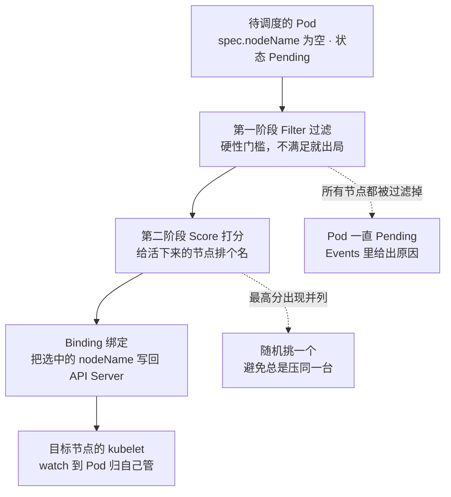
```mermaid
flowchart TB
    P["待调度的 Pod<br/>spec.nodeName 为空 · 状态 Pending"] --> F["第一阶段 Filter 过滤<br/>硬性门槛，不满足就出局"]
    F --> S["第二阶段 Score 打分<br/>给活下来的节点排个名"]
    S --> B["Binding 绑定<br/>把选中的 nodeName 写回 API Server"]
    B --> K["目标节点的 kubelet<br/>watch 到 Pod 归自己管"]
    F -.->|"所有节点都被过滤掉"| X["Pod 一直 Pending<br/>Events 里给出原因"]
    S -.->|"最高分出现并列"| Y["随机挑一个<br/>避免总是压同一台"]
```

**Filter（过滤）= 硬性条件，一票否决**：

| 过滤条件 | 检查什么 | Events 里的关键词 |
|---|---|---|
| 资源是否够 | 节点的可分配 CPU/内存 ≥ Pod 的 requests 之和 | `Insufficient cpu` / `Insufficient memory` |
| 污点与容忍 | 节点有污点，Pod 没有对应的容忍 | `node(s) had untolerated taint` |
| 节点亲和性 | `nodeAffinity` / `nodeSelector` 是否满足 | `didn't match node selector` |
| 节点状态 | 节点是否 Ready | `node(s) were unschedulable` |
| 端口冲突 | `hostPort` 是否被占用 | `node(s) didn't have free ports` |
| 卷拓扑 | PV 是否挂在这个可用区 | `node(s) had volume node affinity conflict` |

**Score（打分）= 软性偏好，分高者胜**：

| 打分维度 | 倾向 |
|---|---|
| `LeastAllocated`（默认） | 资源使用率**低**的节点得分高，让负载更均衡 |
| `ImageLocality` | **本地已有这个镜像**的节点得分高（省一次拉取） |
| `PodTopologySpread` | 让副本**分散到不同可用区/主机**的节点得分高 |
| `InterPodAffinity` | 满足 Pod 间亲和性的节点得分高 |

**"Filter 全灭"是初学者最常遇到的 Pending 原因。**记住排查命令：
```bash
kubectl describe pod <name> | sed -n '/Events/,$p'
```
最后几行会直接告诉你"被谁拒绝了"。

#### 一个高频误解：它的候选池是"节点"，不是"Pod"

初学 scheduler 时最常见的错误理解是：

"scheduler 就是返回匹配度最高的空闲的 Pod 吧？"

这里有两处偏差，其中第一处是方向性的。

##### 偏差一：它在"挑机器"，不是"挑 Pod"

| | 待安排的**对象** | 从哪个池子里**挑** | 决策频率 |
|---|---|---|---|
| **kube-scheduler** | 一个**还没安排住的 Pod** | 从一批 **Node** 里挑一个 | 每个 Pod 一生只选一次 |
| **Service 负载均衡** | 一个**到来的请求** | 从一批 **Pod** 里挑一个 | 每个请求都要重挑 |

被混淆的两件事其实是：

- **给 Pod 找节点**（scheduler）——挑的是**机器**
- **给请求找 Pod**（Service/kube-proxy）——挑的是**副本**（第 6 章）

一个用来记住的推理：你的集群里 Node 可能只有 3 台，Pod 却有 300 个。**如果 scheduler 是从 300 个 Pod 里挑，那它挑出来给谁用？**它要产出的结果只能是"这个 Pod 去哪个 Node"，所以候选池必须是 Node。

##### 偏差二："匹配度最高"只描述了后半段

scheduler 的决策由两个**性质完全不同**的阶段组成，笼统说成"匹配度"会丢掉最关键的一层：

| 阶段 | 性质 | 有"匹配度"吗 | 类比 |
|---|---|---|---|
| **Filter** | 硬性门槛，一票否决 | **没有**——只有通过/出局 | 招聘要求"本科以上"，不满足的简历根本进不了面试 |
| **Score** | 软性偏好，加权求和 | **有**——这才是你说的"匹配度" | 进入面试后综合打分排名 |

所以精确的表述是：

**scheduler 先 Filter 掉不合格的节点（此时谈不上匹配度），再对活下来的节点 Score 打分，选总分最高的那个。**

##### 偏差三：它挑的不是"最空闲的节点"，也不是"全局最优"

`LeastAllocated` 只是**默认打分策略之一**，而且它只是"倾向"空闲节点，不是唯一维度——最终得分是**多个打分项加权求和**的结果。

更重要的一个认知：**scheduler 是个"贪心 + 启发式"算法，不是全局最优求解器。**

- 它**一个一个 Pod 独立决策**，完全不考虑"后面还有 50 个 Pod 要调度"
- 分数是各维度加权的近似值，不是真值
- 所以**调度顺序不同，最终分布就可能不同**

这意味着一个反直觉的结论：**scheduler 的目标是"够用且均衡"，不是"数学最优"。**也正因为如此，社区里才会有 `descheduler`（重新调度器）这类项目——它的作用就是**事后纠正**那些因为贪心决策而变得不均衡的分布。

**一句话记住**：scheduler 是个"当下做局部最优、事后可能被纠正"的决策者，不是一个会做全局规划的大脑。

#### 一个重要的设计选择：Scheduler 不负责落地

如果让 Scheduler 直接去节点上"创建容器"，那它就成了一个沉重的有状态组件。K8s 的选择是：

**Scheduler 只写一个字段（`nodeName`），剩下的交给节点上的 kubelet。**

这个"决策与执行分离"的设计，让 Scheduler 变成**完全无状态**的——它可以随时重启，甚至挂掉几秒钟都不影响已在运行的业务。**这就是 K8s 高可用的通用套路：把组件做成无状态的决策者。**

---

### <a id="sec-03-3-5"></a>3.5 kube-controller-manager：一群"监工"的集合

这个组件名字里有 "manager"，但它其实**不是"一个"管理器，而是几十个控制器的集合**。

#### 为什么塞在一个进程里

每个控制器本质上就是第 1.3 节讲的调谐循环：

```
for {
    读期望状态
    读实际状态
    if 不一致 { 采取行动 }
}
```

如果每个控制器都独立进程，几十个进程都要建立 watch 连接、都要维护缓存、都要经历一遍 leader 选举——**资源浪费得离谱**。所以 K8s 把它们**打包进一个进程**（`kube-controller-manager`），共享同一套 client-go 缓存。

#### 里面有哪些控制器

```bash
# 看看它启动时都加载了哪些控制器
kubectl logs -n kube-system -l component=kube-controller-manager | grep -i "Starting controller" | head -30
```

你会看到一大串。挑几个重要的记住：

| 控制器 | 负责的事情 | 什么情况下你会遇到它 |
|---|---|---|
| `deployment-controller` | 管理 Deployment 的滚动更新 | 每次发布（第 5 章） |
| `replicaset-controller` | 保证 Pod 副本数 | **Pod 挂了自动补一个**（自愈） |
| `node-controller` | 监控节点心跳、打污点、驱逐 | 节点宕机时 |
| `endpointslice-controller` | 把就绪 Pod 的 IP 写进 Service 后端 | 第 6 章 |
| `serviceaccount-controller` | 给命名空间创建默认 ServiceAccount | 每个 namespace 都有一个 `default` |
| `job-controller` / `cronjob-controller` | 批处理任务 | 第 13 章 |
| `pv-controller` / `pvc-protection` | 存储卷的绑定与保护 | 第 9 章 |
| `namespace-controller` | 删除命名空间时清理里面的所有资源 | `kubectl delete ns` 会卡住的原因 |

**注意 `deployment-controller` → `replicaset-controller` 这个链条**：你创建 Deployment，它创建 ReplicaSet，ReplicaSet 才创建 Pod。**三个对象、三个控制器、三层调谐。**第 5 章会把这条链拆开讲。

#### 选主（Leader Election）：多副本但只有一个在干活

controller-manager 通常部署 3 个副本。但同一个控制器被 3 个实例同时调谐，会打架（比如都去补 Pod，结果补了 3 个）。

解决办法是**选主**：

```
3 个 controller-manager 实例
       ↓  通过一个 Lease 对象抢锁
  只有一个成为 Leader，真正干活
  另外两个是"待命"，不做任何事，只是盯着 Leader 的心跳
       ↓  Leader 挂了（默认 15 秒内没续约）
  立刻有一个待命者接管
```

这个"抢锁对象"就存在 etcd 里，你可以看到：

```bash
kubectl get lease -n kube-system
```

**这就是 K8s 的第二个高可用套路：无状态的组件 + 选主。**scheduler 也是同样的机制。**凡是"同时只能有一个实例干活"的组件，都用选主；凡是能并行处理的（比如 API Server），就直接多副本负载均衡。**

---

### <a id="sec-03-3-6"></a>3.6 工作节点三件套：kubelet / 容器运行时 / kube-proxy

控制面都在"想"，节点上这些在"做"。每个节点上必装三样东西（外加一个网络插件）。

#### kubelet：节点上的管家

**它的自我定位非常清楚：我只管分派给我的 Pod。**

| kubelet 做 | kubelet 不做 |
|---|---|
| watch API Server，找到 `nodeName` 是自己的 Pod | 不决定 Pod 该不该来（那是 Scheduler 的事） |
| 通过 CRI 调 containerd 创建/删除容器 | 不创建 Pod 对象（那是控制器的事） |
| 跑探针（liveness/readiness） | 不处理 Service 转发（那是 kube-proxy 的事） |
| 定期上报节点和 Pod 状态 | 不管理其他节点上的 Pod |

这个"只管自己名下"的边界有个直接后果：**当 kubelet 挂了，它名下的 Pod 不会被任何其他节点接管**——因为没有任何其他组件知道该怎么"接手"已经运行的容器。这就是第 3.8 节那个故障故事的起点。

**kubelet 的心跳节奏**（这些默认值值得记）：

| 参数 | 默认值 | 含义 |
|---|---|---|
| `nodeStatusUpdateFrequency` | 10 秒 | 多久上报一次节点状态 |
| `nodeLeaseDurationSeconds` | 40 秒 | 租约时长（轻量心跳，默认 10 秒续一次） |
| `nodeMonitorGracePeriod` | 40 秒 | 超过这么久没收到心跳，把节点标记为 `NotReady` |

#### 容器运行时：真正动手的人

kubelet 不直接操作容器，它通过 **CRI（Container Runtime Interface）** 这个标准接口调用运行时：

```
kubelet ──gRPC──> CRI ──> containerd ──> runc ──> 真正的容器进程
```

| 运行时 | 说明 |
|---|---|
| **containerd** | 当前最主流，从 Docker 中剥离出来 |
| **CRI-O** | 专为 K8s 打造，轻量 |
| ~~dockershim~~ | 曾用于兼容 Docker，**已在 1.24 移除** |

**这就是"K8s 抛弃 Docker"的真相**：K8s 没有抛弃 Docker 镜像（OCI 镜像照样用），只是不再需要一个叫 dockershim 的转接层了——因为 containerd 本来就在 Docker 内部，直接用它更简洁。

#### CNI 插件：给 Pod 发门牌号

kubelet 创建 Pod sandbox 后，会调用 **CNI（Container Network Interface）** 插件，让它给网络命名空间分配一个 IP。常见插件：

| 插件 | 特点 |
|---|---|
| Calico | 用 BGP 或 IPIP 打通节点间网络，支持 NetworkPolicy，最常用 |
| Cilium | 基于 eBPF，性能好，可替代 kube-proxy |
| Flannel | 简单，适合学习环境 |

第 6 章会详细讲 Pod 之间到底怎么通。

#### kube-proxy：Service 的数据面

它 watch Service 和 EndpointSlice 的变更，在本机写入转发规则（iptables 或 IPVS 模式）。

**重点记住一点**：kube-proxy 不是"一个代理进程在转发流量"。它是**规则写入器**——规则写进内核后，流量由内核直接转发，kube-proxy 本身不参与转发路径。所以它挂了，**已有规则照样工作**。

这是第 6 章的主角，这里先混个脸熟。

---

### <a id="sec-03-3-7"></a>3.7 为什么除了 etcd，其他组件都能挂

下面把每个组件挨个停掉，观察集群的反应。组件的失效半径，只有这样才量得准。

| 挂掉的组件 | 立刻发生 | 业务受影响吗 | 为什么 |
|---|---|---|---|
| **kube-apiserver** | 不能读也不能写对象，kubectl 全部超时 | **不受影响** | 业务流量根本不经过 API Server |
| **etcd** | 同上，且不能自愈 | **不受影响** | 同上 |
| **kube-scheduler** | 新 Pod 全部 Pending，不会被调度 | **不受影响** | 已运行的 Pod 不需要重新调度 |
| **controller-manager** | Pod 挂了不会自动补，滚动更新停住 | **短期不受影响，长期脆弱** | 已运行的 Pod 继续跑，但失去自愈 |
| **kubelet（单个节点）** | 该节点被标记 NotReady，其 Pod 最终被驱逐重建 | **短暂受影响** | 容器还在跑，但状态上报中断 |
| **kube-proxy（单个节点）** | 已有转发规则仍生效，新的 Service 变更不生效 | **基本不受影响** | 规则在内核里，不依赖进程 |
| **containerd（单个节点）** | 该节点容器全部停止 | **受影响，但会被其他节点接管** | 容器真的死了，控制器会重建 |
| **CNI 插件（单个节点）** | 该节点新 Pod 起不来（拿不到 IP） | 部分受影响 | 已有 Pod 的网络已配好 |

#### 从这张表里提炼出的三条设计原则

**原则一：控制面与数据面分离。**
这是最重要的一条。**API Server 和 etcd 双双宕机，你的网站照样能访问。**因为用户请求走的是 Ingress → Service → Pod 这条纯数据面路径，一个控制面组件都不经过。

**原则二：组件无状态化 + 多副本。**
API Server 不存东西，scheduler 不存东西，controller-manager 靠选主共享一份逻辑。**全部可以随意重启。**

**原则三：把状态集中到唯一一个地方，然后重点保护它。**
etcd 是唯一有状态的组件，所以它需要：奇数节点、SSD 磁盘、定期快照、独立部署（生产上常与 API Server 分开机器）。

**这三条原则不只在 K8s 里成立，是所有高可用系统的通用套路。**你以后设计任何分布式系统，都可以拿这三条来对照。

---

### <a id="sec-03-3-8"></a>3.8 一个完整的故障故事：节点宕机之后

理论讲完了，来看一个具体的、你一定会在生产上遇到的场景。

#### 场景

CloudNote 的集群有 3 个工作节点，`api` 有 2 个副本，分别跑在 Node-1 和 Node-2 上。

**晚上 21:30，Node-1 的网卡坏了。**

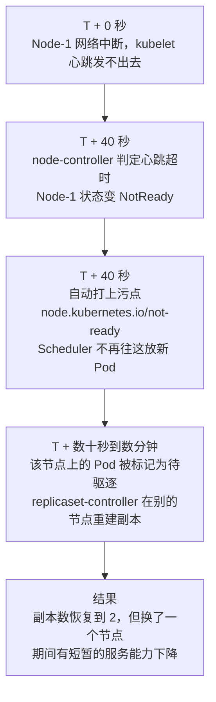
```mermaid
flowchart TB
    T0["T + 0 秒<br/>Node-1 网络中断，kubelet 心跳发不出去"] --> T1["T + 40 秒<br/>node-controller 判定心跳超时<br/>Node-1 状态变 NotReady"]
    T1 --> T2["T + 40 秒<br/>自动打上污点<br/>node.kubernetes.io/not-ready<br/>Scheduler 不再往这放新 Pod"]
    T2 --> T3["T + 数十秒到数分钟<br/>该节点上的 Pod 被标记为待驱逐<br/>replicaset-controller 在别的节点重建副本"]
    T3 --> T4["结果<br/>副本数恢复到 2，但换了一个节点<br/>期间有短暂的服务能力下降"]
```

#### 逐步拆解

**第一步：心跳断了（T+0）**

kubelet 每 10 秒通过 `NodeLease` 对象续一次租约。网络一断，续约失败。

**注意：此刻 Node-1 上的 Pod 还在跑！**容器没死，只是"没人能联系上这个节点了"。

**第二步：判定失联（T+40s）**

`node-controller` 发现有租约超过 40 秒没续，把 Node 对象的 `status` 改成：

```yaml
status:
  conditions:
    - type: Ready
      status: "False"         # 这就是 kubectl get nodes 里那个 NotReady
      reason: NodeStatusUnknown
```

顺手给它打上污点：

```yaml
spec:
  taints:
    - key: node.kubernetes.io/not-ready
      effect: NoExecute       # 已有的 Pod 也会被驱逐
```

**两个效果**：① Scheduler 的 Filter 阶段会把 Node-1 过滤掉，新 Pod 不再往这里放；② 满足条件的已有 Pod 会被驱逐。

**第三步：重建副本（T+数十秒）**

这才是关键的一步，而且它**并不发生在 Node-1 上**：

- `replicaset-controller` 在 watch Pod 状态时发现：期望 2 个 Ready 的 Pod，实际只有 1 个
- 于是它**在 etcd 里创建了一个新的 Pod 对象**
- Scheduler 把它调度到 Node-3
- Node-3 的 kubelet 起来干活，新的 api 容器开始运行

**第四步：Node-1 复活（可能几小时后）**

网络恢复了，kubelet 重新连上 API Server。它上报自己的状态，发现自己的 Pod 名字早就不在"期望列表"里了（那些 Pod 对象已经被删除，新的 Pod 有新的名字）。于是它**把自己名下的孤儿容器全部清理掉**。

这个"复活后清理"的机制叫 **Pod GC**，是防止资源泄漏的重要设计。

#### 从这个故事里学到的三件事

1. **节点故障的恢复不是"修复节点"，而是"放弃节点上的 Pod，在别处重建"。**这又是"牲口不是宠物"的思想——只不过这次是"节点"这头牲口。
2. **`>1 个工作节点`是自愈的前提。**如果集群只有 1 个节点，它挂了就没有"别处"可以重建，Pod 会一直 Pending。这也是为什么生产集群至少 3 个工作节点。
3. **副本数 ≠ 可用性。**Node-1 出事的这几分钟里，`api` 只有 1 个副本在扛流量。所以关键服务的副本数要 ≥3，并且要用反亲和性（第 10 章）把它们**强制打散到不同节点**。

一个常见的误区：**"我有 2 个副本，所以挂一个节点没关系。"** 如果这 2 个副本恰好都在 Node-1 上（没配反亲和性就可能发生），那挂一个节点就等于全挂。这是第 10 章要解决的重点问题。

---

### <a id="sec-03-3-9"></a>3.9 动手：把集群翻过来看

概念之外，再透视一遍真实集群。

我写了个脚本把下面这些命令打包了，你也可以一条条自己跑：

```bash
bash cases/cloudnote/tools/inspect-cluster.sh
```

#### ① 看有哪些控制面组件在跑

```bash
kubectl get pods -n kube-system -o wide
```

在 kind / kubeadm 集群里你会看到：

```
NAME                                  READY   STATUS    NODE
etcd-k8s-study-control-plane          1/1     Running   control-plane
kube-apiserver-k8s-study-control-plane 1/1    Running   control-plane
kube-controller-manager-k8s-study-...  1/1    Running   control-plane
kube-scheduler-k8s-study-...           1/1    Running   control-plane
kube-proxy-xxxxx                       1/1     Running   node-1
kube-proxy-yyyyy                       1/1     Running   node-2
kindnet-zzzzz                          1/1     Running   node-1
```

**两个值得注意的现象**：

1. **控制面组件在 kind/kubeadm 里是"静态 Pod"**——由 kubelet 直接读磁盘上的 YAML 启动，**不走 API Server 的调度**。你可以看到它们的名字后面带着节点名。这是"先有鸡还是先有蛋"的解法：API Server 还没起来时，谁来启动 API Server？答案是 kubelet 读本地文件。
2. **只有 kube-proxy 和 CNI 插件以 DaemonSet 形式跑在每个节点上**（第 13 章讲 DaemonSet）。

#### ② 看 API Server 都暴露了哪些资源

```bash
kubectl api-resources | head -40
kubectl api-versions
```

这一长串就是 K8s 的"对象字典"。`api-versions` 里的 `apps/v1`、`batch/v1` 等就是 YAML 第一行 `apiVersion` 的来源。

#### ③ 直接和 API Server 对话

```bash
# 起一个本地代理，用 curl 直接裸访 API（跳过 kubectl 的封装）
kubectl proxy --port=8001 &
curl -s http://localhost:8001/api/v1/nodes | head -30
curl -s http://localhost:8001/healthz
curl -s http://localhost:8001/livez
curl -s http://localhost:8001/readyz?verbose
kill %1
```

**这是理解"API Server 就是一个 REST 服务"最直观的方式。**`kubectl get pods` 本质上就是 `GET /api/v1/namespaces/<ns>/pods`。看完这组命令，你以后再看到 K8s 的报错，就知道它是从哪一层来的了。

#### ④ 亲自看一次选主

```bash
kubectl get lease -n kube-system
```

输出里会有 `kube-controller-manager` 和 `kube-scheduler` 的两条租约记录，`HOLDER` 那一列就是当前在干活的实例。如果你的集群只有一个 controller-manager，它当然就是 holder。

#### ⑤ 杀掉一个组件，观察后果（破坏性实验）

在 kind 集群里，控制面组件是容器，可以这样"制造故障"：

```bash
# 找到 scheduler 容器
docker exec k8s-study-control-plane ps aux | grep kube-scheduler

# 停掉 scheduler 的进程（会短暂影响新 Pod 调度）
docker exec k8s-study-control-plane sh -c "pkill -f kube-scheduler"

# 观察：kubectl get pods 还能用！（因为 API Server 和 etcd 活着）
kubectl get pods -n cloudnote

# 试着创建新 Pod —— 它会一直 Pending
kubectl run stuck --image=nginx:1.27-alpine -n cloudnote
kubectl get pod stuck -n cloudnote -w
# 然后 Ctrl+C，删掉它
kubectl delete pod stuck -n cloudnote --wait=false
```

**你会亲眼看到**：`kubectl get` 正常工作，但新建的 Pod 永远停在 Pending，`describe` 的 Events 里写着 `no nodes available to schedule pods`。

**这就是"控制面挂了一个组件"的真实体感**：读还行，写废了，但业务没事。

实验完记得把 scheduler 恢复（kind 会自动重启容器里的进程，或者直接 `kind delete cluster` 重建）。

---

### <a id="sec-03-3-10"></a>3.10 本章要点

1. **集群分成控制面和数据面**：控制面只做决策和记账（API Server、etcd、Scheduler、Controller Manager），数据面才真正扛流量（kubelet、containerd、kube-proxy、业务容器）。**只读分离**，是 K8s 高可用的根基。
2. **API Server 是唯一的门**，六道处理（认证→授权→变更准入→校验准入→写 etcd→通知 watch）；**etcd 是唯一有状态的组件**，必须奇数节点，是唯一必须重点保护的"单点"。
3. **Scheduler 只做决策不做落地（只写 `nodeName`）**，Controller Manager 是一堆调谐循环的集合靠选主运行，kubelet 只管自己名下的 Pod。

#### 本章全景图

```
                            你怎么改集群
                                 │
                                 ▼
                        ┌─────────────────┐
   你能改的 ───────────> │  kube-apiserver │ ← 无状态，挂了不能改
   （期望状态）           └────────┬────────┘
                                   │
                        ┌──────────▼──────────┐
                        │        etcd         │ ← 唯一有状态，挂了集群冻结
                        │  （奇数节点 + 备份）  │
                        └──────────┬──────────┘
                                   │ watch
              ┌────────────────────┼────────────────────┐
              ▼                    ▼                    ▼
      kube-scheduler     controller-manager      kubelet（每节点）
      只写 nodeName       一堆调谐循环            只管自己名下的 Pod
              │                    │                    │
              └────────────────────┴────────────────────┘
                                   │
                        ┌──────────▼──────────┐
                        │    数据面（真扛流量） │ ← 全部挂掉才会影响用户
                        │  containerd · CNI ·  │
                        │  kube-proxy · 业务    │
                        └─────────────────────┘
```

### <a id="sec-03-3-11"></a>3.11 练习题

1. 控制面全部宕机，为什么用户的 HTTPS 请求还能正常返回？
2. 数据面到底是"什么"？它由哪三部分构成？为什么在 `kube-system` 里找不到它？
3. 为什么说 kube-proxy 是"规则写入器"而不是"代理"？用户请求的路径上有它吗？
4. API Server 的六道处理链里，哪一步负责给 `strategy: RollingUpdate` 这类默认值？
5. apiserver 为什么不是"调度者"？scheduler 的决策结果又是怎么落到 etcd 里的？
6. 手动在 YAML 里写死 `spec.nodeName` 会发生什么？这个实验证明了什么？
7. etcd 会不会"按规范处理"？它到底只做哪两件事？
8. 为什么说"2 个 etcd 节点比 1 个更不可靠"？3 节点能容忍几个挂？
9. Scheduler 的候选池是"节点"还是"Pod"？Filter 和 Score 分别是什么性质的条件？它是不是在做全局最优？
10. Controller Manager 有 3 个副本，为什么不会出现"3 个都去补 Pod"的混乱？
11. kubelet 挂了，节点上正在跑的容器会立刻停止吗？为什么？
12. 节点宕机后，Pod 的"重建"具体发生在哪里？是谁做的？
13. 为什么生产集群至少要有 3 个工作节点？只有 1 个会怎样？
14. 控制面组件在 kind 集群里为什么是"静态 Pod"而不是普通 Deployment？


---

## <a id="ch-04-declarative-controller"></a>第 4 章　声明式 API 与控制器模式：K8s 的灵魂

前三章反复出现同一个词：**调和循环（Reconciliation Loop）**。第 1 章称它为 Kubernetes 的核心思想，第 3 章说控制器不过是一堆调和循环的集合。但这个循环内部究竟怎么运转，一直没有展开。

本章补上这一课。切入点是一个足以让事件驱动系统崩溃的问题：如果那条"Pod 被删除"的通知丢了，副本数还能恢复吗？答案牵出水平触发与边缘触发的分野，进而引出幂等性、`resourceVersion` 与乐观并发、Informer 与本地缓存、`ownerReference` 与级联删除，最后落到 CRD 与 Operator——Kubernetes 把同一套机制开放给了使用者。

这一章讲的不是某个对象怎么用，而是 Kubernetes 凭什么能在组件不断崩溃、消息不断丢失的前提下依然收敛。

---

### <a id="sec-04-4-1"></a>4.1 先问一个让事件驱动系统崩溃的问题

回到第 2 章结尾那个实验：你删掉了 `api-demo` 这个裸 Pod，它没有回来。

换一个场景。假设这个 Pod 由 Deployment 管理，删掉它会发生这样的事：

```
你：kubectl delete pod api-xxxx
       ↓ （大约 1 秒后）
你：kubectl get pods
NAME                    READY   STATUS    AGE
api-yyyy                1/1     Running   3s      ← 新的来了
```

**这个"补回来"的动作，是怎么触发的？**

最容易想到的答案是："Deployment 控制器收到了一个'Pod 被删除'的事件，于是它补一个。"

这个答案听起来没问题，但**它有一个致命缺陷**。请顺着往下想：

**如果那条"Pod 被删除"的事件通知丢了呢？**

- 网络抖了一下，通知没送到
- 控制器进程正好在那一刻重启，没收到
- 控制器太忙，队列里的这条被覆盖了

**在传统的"事件驱动"系统里，这就是一次永久性数据不一致**——控制器永远不知道少了一个 Pod，你那个 Pod 就永远回不来了，除非有人手动干预。

而这种"偶尔丢一条通知"的事，在分布式系统里是**必然会发生**的（不是"可能"，是"必然"，只是概率问题）。

**但 K8s 不会因为这个丢 Pod。**为什么？

因为 K8s 的控制器的实现方式，跟"事件驱动"根本不是一个思路。这是本章的第一个、也是最重要的认知。

---

### <a id="sec-04-4-2"></a>4.2 两套根本不同的哲学：边缘触发 vs 水平触发

这个概念借自操作系统里的**中断处理**，但理解它之后，你会看穿一大类分布式系统的设计。

#### 边缘触发（Edge-triggered）：只告诉你"发生了变化"

```
事件：Pod api-xxxx 被删除了
```

**这种通知描述的是"一次状态变化（一个边缘）"。**它的致命问题是：

- 如果你错过了这个事件，**你无从知道"现在一共有几个 Pod"**
- 事件本身不携带"当前完整状态"这个信息
- 消息丢了 = 永久失忆

类比：家里的**火灾报警器**。它只在起火的那一刻响一声。你不在家，它就白响了，你回家后看不出"刚才是否着过火"。

#### 水平触发（Level-triggered）：随时告诉你"当前是什么状态"

```
查询：现在集群里符合 app=cloudnote,component=api 的 Ready Pod 有几个？
回答：2 个
```

**这种通知描述的是"某个时刻的完整状态（一个水平面）"。**它的关键优势是：

- **你可以错过任何一次通知，只要你在下一次查询时重新对齐状态**
- 同一个状态你查 100 次，答案一样
- **丢失通知不会导致永久不一致，最多导致"纠正得晚一点"**

类比：**温度计**。你什么时候看，它都告诉你当前温度。你错过了一小时的读数，当前温度依然准确。

#### K8s 的选择

**K8s 的控制器全部是水平触发的。**确切地说：

控制器**不关心"发生了什么变化"**，它只关心**"现在是什么状态"**。

对比一下同一个场景在两种范式下的差异：

| | 事件驱动（边缘触发） | 状态驱动（水平触发，K8s） |
|---|---|---|
| 控制器收到的信息 | "Pod 被删了" | "现在有 2 个 Ready 的 Pod" |
| 丢失通知的后果 | **永久不一致** | 暂时不一致，下次对齐就好 |
| 重复通知的后果 | 可能重复执行（要额外去重） | **无害**（看到状态一致就什么都不做） |
| 重启后的行为 | 丢失重启期间的所有事件 | **重新读一次状态，立刻恢复正确** |
| 对顺序的依赖 | 强依赖事件顺序 | **完全不依赖顺序** |

**最后三行就是 K8s 敢说"控制器可以随便重启"的全部理由。**

现在回头看第 4.1 节的问题——"如果通知丢了怎么办？"

**答案是：K8s 不依赖通知。**通知只是"提醒你去看看"的闹钟，只是一个**优化**（让你不必一直轮询）。真正的事实判断，每次都来自"读当前状态"。

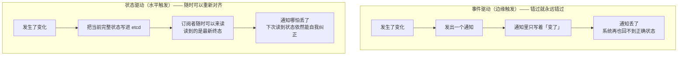
```mermaid
flowchart TB
    subgraph EDGE["事件驱动（边缘触发）—— 错过就永远错过"]
        E1["发生了变化"] --> E2["发出一个通知"]
        E2 --> E3["通知里只写着「变了」"]
        E3 --> E4["通知丢了<br/>系统再也回不到正确状态"]
    end

    subgraph LEVEL["状态驱动（水平触发）—— 随时可以重新对齐"]
        L1["发生了变化"] --> L2["把当前完整状态写进 etcd"]
        L2 --> L3["订阅者随时可以来读<br/>读到的是最新终态"]
        L3 --> L4["通知哪怕丢了<br/>下次读到状态依然能自我纠正"]
    end
```

> **记住这句话**：K8s 里的事件通知是**性能优化**，不是**正确性依赖**。这个区分，是理解一切控制器行为的地基。

---

### <a id="sec-04-4-3"></a>4.3 把调和循环真正拆开

现在可以精确地描述这个循环了。

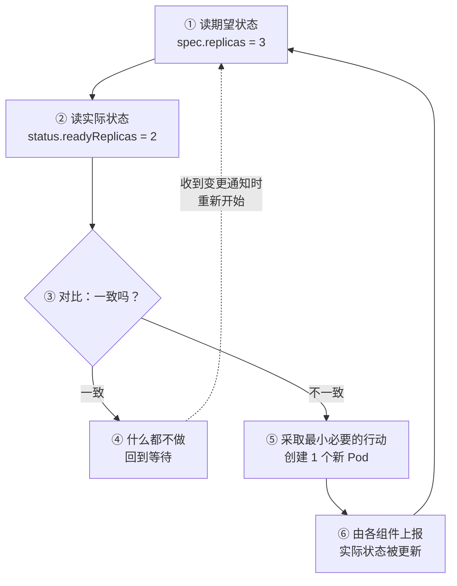
```mermaid
flowchart TB
    A["① 读期望状态<br/>spec.replicas = 3"] --> B["② 读实际状态<br/>status.readyReplicas = 2"]
    B --> C{"③ 对比：一致吗？"}
    C -->|"一致"| D["④ 什么都不做<br/>回到等待"]
    C -->|"不一致"| E["⑤ 采取最小必要的行动<br/>创建 1 个新 Pod"]
    E --> F["⑥ 由各组件上报<br/>实际状态被更新"]
    F --> A
    D -.->|"收到变更通知时<br/>重新开始"| A
```

写成伪代码：

```python
def reconcile(key):                    # key = 对象的 namespace/name
    while True:
        desired = read_desired(key)    # ① 读期望
        actual  = read_actual(key)     # ② 读实际
        if is_equal(desired, actual):  # ③ 对比
            return                     # ④ 一致 → 什么都不做，退出
        take_minimal_action()          # ⑤ 不一致 → 做最小的修正
        # ⑥ 不假设结果，下一轮重新读一遍
```

这里有三个细节，每一个都对应一条工程纪律：

#### 细节一：循环里没有"记忆"

注意代码里**没有任何变量保存上一轮的状态**。每一轮都**从头重新读**。

这不是偷懒，这是刻意的设计。原因：

- 缓存的状态可能是过期的（别人可能在你没看见的时候改了）
- 保存状态就意味着要处理"我的缓存和 etcd 不一致"的问题
- **不记状态，就不存在"状态不一致"**

对比很多人的直觉写法：`if not exists then create`。这种写法依赖于"上次我看到它不存在"这个**陈旧记忆**。K8s 的写法是 `ensure exactly 3 exist`——**不依赖记忆，只看当下**。

#### 细节二：行动是"最小的"，不是"整套重建"

K8s 的控制器发现"要 3 个、只有 2 个"时，它**只创建 1 个**，而不是删掉重来。

这保证了：**循环跑得越频繁，代价越小**。一个健康的集群里，绝大部分调谐循环的结果是"什么都不做"（③ 直接走到 ④），几乎零成本。

#### 细节三：判断依据是"数量匹配"，不是"对象身份"

ReplicaSet 控制器**不关心**"哪个具体的 Pod 存在"。它只关心"**符合标签选择器的 Ready Pod 有几个**"。

这个细节有一个反直觉的推论，第 4.10 节的实验会验证它：**如果你把一个 Pod 的标签改掉，它会瞬间"脱离"这个 ReplicaSet 的统计，然后控制器会立刻补一个新的 Pod——而你改标签的那个 Pod 还活着，变成了孤儿。**

#### 关于"最终一致"

调和循环不保证"立刻一致"，它保证的是**"最终一致（eventual consistency）"**：

```
不一致 → 纠正 → 再对比 → （可能又被人改坏）→ 再纠正 →……→ 最终稳定在期望状态
```

**K8s 从不承诺"任何时刻都符合期望"，它只承诺"会持续朝期望收敛"。**这个承诺弱一些，但它是**可以被工程上真正兑现的**——而"始终强一致"在分布式系统里做不到。

---

### <a id="sec-04-4-4"></a>4.4 控制器怎么"知道"状态变了：List、Watch 与 WorkQueue

到这里，你可能会问一个问题：

"既然是水平触发、每次都读完整状态，那控制器岂不是要**每秒钟轮询一次**？集群里有几万个对象，API Server 早就被打爆了。"

**对，纯轮询不可行。**K8s 的答案是：**用"事件"来知道"该去看一眼了"，用"读状态"来决定"该做什么"。**

这两件事分工明确：

- **事件**：负责唤醒（性能优化）
- **状态读取**：负责判断（正确性保证）

具体实现是 client-go 里的一套标准机制：

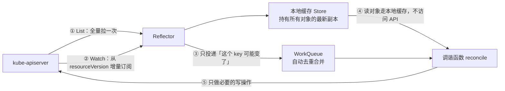
```mermaid
flowchart LR
    API["kube-apiserver"] -->|"① List：全量拉一次"| REF["Reflector"]
    API -->|"② Watch：从 resourceVersion 增量订阅"| REF
    REF --> STORE["本地缓存 Store<br/>持有所有对象的最新副本"]
    REF -->|"③ 只投递「这个 key 可能变了」"| WQ["WorkQueue<br/>自动去重合并"]
    STORE -->|"④ 读对象走本地缓存，不访问 API"| CTRL["调谐函数 reconcile"]
    WQ --> CTRL
    CTRL -->|"⑤ 只做必要的写操作"| API
```

逐步解释这套机制：

#### 第一层：List + Watch（由 Reflector 完成）

1. **先 List**：全量拉取一次所有关心的对象，拿到一个**版本号 `resourceVersion`**
2. **再 Watch**：从那个版本号开始，建立长连接订阅后续的变更
3. **断线了怎么办**：从上次收到的 `resourceVersion` 重新 Watch
4. **如果需要的历史版本已经被 etcd 压缩掉了**（etcd 会定期压缩旧版本）：**重新 List 一次**，从头对齐

**注意第 4 步——这就是"永远不会永久失忆"的技术兜底。**哪怕 Watch 断了一整天，回来重新 List 一次就完全对齐了。

#### 第二层：本地缓存（Store / Indexer）

Watch 到的对象被存进本地的内存缓存。控制器要读对象时，**读的是本地缓存，不是 API Server**。

这带来一个数量级的性能差异：假设你要遍历 1000 个 Pod 做判断，走 API Server 就是 1000 次网络请求（或者一次大请求），走本地缓存就是 1000 次内存读取。

这也是为什么 K8s 集群能承载大量对象：**真正的读压力被分散到了每个组件自己的内存里。**etcd 只承担写和版本推送。

#### 第三层：WorkQueue（工作队列）

变更事件不会直接调用调谐函数，而是被丢进一个队列。这个队列有两个关键设计：

| 设计 | 作用 |
|---|---|
| **去重（dedup）** | 同一个对象在 1 秒内变了 100 次，队列里**只保留一个 key**。控制器只调谐一次，读到的却是最新状态——**这正是水平触发的威力** |
| **限速重试（rate limiting）** | 调谐失败时，按指数退避重新入队（1s、2s、4s……），避免打爆集群 |

**去重这一条特别值得琢磨**：100 次变更合并成 1 次处理，为什么不会漏掉中间的某个状态？

**因为控制器根本不关心中间状态。**它只关心"最终读到的状态是不是期望的"。**这就是水平触发范式带来的简化。**

---

### <a id="sec-04-4-5"></a>4.5 幂等性：为什么跑 1 次和跑 1000 次结果一样

现在回答导读里的第二个问题。

**幂等（Idempotent）**的定义：一个操作执行 1 次和执行 N 次，对系统产生的影响相同。

为什么控制器必须是幂等的？因为**这几种情况都会导致重复调用**：

- WorkQueue 去重后仍可能因为重试而重复投递
- 一次变更可能触发多个控制器链路，同一个对象的调谐被触发多次
- 控制器重启后会重新 List，所有对象都会被"重新调谐"一遍

#### 一个不幂等的控制器长什么样

```python
# 反面教材
def reconcile():
    if not exists("backup-job"):
        create("backup-job")          # 看起来没问题？
```

问题在哪？**如果这个判断依赖于一份过期的读取**（比如本地缓存还停留在"不存在"的状态），或者**创建请求发出去了但响应丢了**，那么下一次调谐时：

- 它读到"不存在"（实际已经存在）→ 又创建一次
- 结果：创建了两个备份任务，重复备份

**根因是它做的是"执行一个动作"，而不是"让状态符合目标"。**

#### 幂等的写法长什么样

```python
# 正确写法
def reconcile():
    desired = 3
    actual = count_ready_pods(label_selector="app=api")   # 每次都真实地数一遍
    if actual < desired:
        create(desired - actual)      # 只补差额
    elif actual > desired:
        delete(actual - desired)      # 只删多余的
    # 相等 → 什么都不做
```

对照一下：

| 维度 | 不幂等的写法 | 幂等的写法 |
|---|---|---|
| 判断依据 | "上次我看到什么" | "现在实际是什么" |
| 行动 | 执行一个动作 | 让状态逼近目标 |
| 重复执行 | 副作用累积 | **无副作用** |
| 断点恢复 | 可能重复或遗漏 | **自动正确** |

#### 延伸辨析：幂等性和原子性是一回事吗？

**不是，而且它们根本不在同一个维度上。**

| | 幂等性（Idempotency） | 原子性（Atomicity） |
|---|---|---|
| 回答的问题 | **重复执行会怎样？** | **会不会做一半？** |
| 关注点 | 重复的安全性 | 不可分割性 |
| 好的形态 | 跑 N 次 == 跑 1 次 | 要么全成，要么全败 |
| 坏的形态 | 后果累加（跑 2 次加 200） | 留下中间脏状态（做了一半） |
| 一句话记忆 | **"可以重复"** | **"不可拆分"** |

**两者彼此正交**，可以组合出四种情况：

| | 原子 | 非原子 |
|---|---|---|
| **幂等** | `SET 余额 = 100`：跑 100 次余额都是 100，且单条语句不会做一半 | `docker pull nginx`：跑 100 次结果都一样，但可能中断在下载到一半 |
| **非幂等** | `余额 = 余额 + 100`：单条语句是原子的，但跑 2 次就是加 200 | 手工运维脚本：改配置 → 重启 → 发通知；中断留脏状态，重跑还会重复发通知 |

##### 一个容易记错的知识点：幂等性不在 ACID 里

ACID 里的 **A 是 Atomicity（原子性）**，另外三个是 Consistency（一致性）、Isolation（隔离性）、Durability（持久性）。

**幂等性（Idempotency）不属于 ACID**——它来自 HTTP 语义和分布式系统实践，讨论的是"操作重复执行的安全性"。所以当你看到有人把幂等和 ACID 混在一起谈时，可以知道对方把两个不同范畴的概念搅在一起了。

顺带补一句：HTTP 方法里，`GET` / `PUT` / `DELETE` 是**幂等**的，`POST` 是**非幂等**的。这也解释了为什么支付接口几乎都要你在请求头里带一个 `Idempotency-Key`——**那是用额外的机制，把一个非幂等的 `POST` 硬掰成幂等。**

##### 那么 K8s 用哪一个？

这是本节最有价值的推论。K8s 的选择是：

> **在"单个对象"的层面保证原子性；在"跨多个对象"的层面放弃原子性，改用幂等性 + 调和循环来兜底。**

具体到三层：

| 范围 | K8s 给了什么保证 | 靠什么实现 |
|---|---|---|
| **单个对象的写入** | **原子** | etcd 的事务：要么这个对象写成功，要么完全没写 |
| **单个对象的"读-改-写"** | **不丢失更新** | `resourceVersion` 乐观并发（相当于 CAS） |
| **跨多个对象的操作** | **没有任何原子性保证** | 靠**幂等 + 调和循环 + 最终一致**兜底 |

第三行是关键。回到第 4.7 节那条链：你创建一个 Deployment，它会依次产生 **Deployment → ReplicaSet → 3 个 Pod → 3 个容器**，这中间有**七八次独立的写入**。

**如果第 2 个 Pod 创建失败了怎么办？**

- **没有事务**：不会"回滚"掉整个 Deployment
- **不需要事务**：控制器下一轮调谐会发现"期望 3 个、实际 2 个"，**再补 1 个就好**

**这就是为什么 K8s 根本不需要分布式事务。**分布式事务（两阶段提交那类）代价极高、性能差、还容易在协调者故障时卡死；而"幂等 + 最终一致"用更低的成本达到了工程上够用的效果。

**一句话总结这个取舍**：K8s 不追求"任何时刻都正确"，它追求"**错了会自己纠正**"。这两条路都能到达正确状态，但后者的实现代价低一个数量级——**前提是每一步都必须幂等。**

##### 实用对照：你要的保证，谁来提供

| 你的需求 | 谁能提供 | 你要做什么 |
|---|---|---|
| 改一个对象的字段，不能只改一半 | **API Server / etcd**（已提供） | 什么都不用做 |
| 两个控制器同时改一个对象，不能丢更新 | **API Server**（`resourceVersion`） | 冲突时整轮重来 |
| 保证集群里始终有 3 个 Pod | **你的控制器** | `reconcile` 必须幂等 |
| 建 Deployment + ConfigMap + Secret，要"要么全成要么全不成" | **没有人** | 自己设计补偿或先决检查（例如用 init 容器校验前置条件） |

最后一行是个真实的工程痛点：**K8s 里没有"跨对象事务"，所以"一套资源要么全成要么全不成"这种需求，必须由你自己设计。**常见做法有两种：

1. **让操作天然幂等**：`kubectl apply -f dir/` 本身就是幂等的，多跑几次无害，失败就重跑。
2. **加前置校验**：让主容器用 init 容器去检查"依赖的资源都齐了吗"，不齐就卡住等，而不是带着残缺状态启动。

#### 一条非常重要的实践纪律

**在 `reconcile` 里不要做不可逆的、有外部副作用的操作。**例如：

- 不要直接发通知邮件、发短信
- 不要直接扣款、下单
- 不要直接调用外部 API 做破坏性操作

如果确实要做，**必须自带幂等保护**：比如先写一条"这件事已经做过了"的记录（K8s 里常见做法是创建一个带特定名字的 Job 或写一个 Annotation，用"创建是否成功"来天然去重——**因为对象名重复创建会失败**，这本身就是一种幂等锁）。

记住这个顺序：**先看状态，再决定动作；宁可多跑几轮，也不要重复产生副作用。**

---

### <a id="sec-04-4-6"></a>4.6 resourceVersion 与乐观并发：两个控制器怎么不打架

导读里的第三个问题。

#### 问题场景

假设 HPA（自动扩缩容控制器，第 12 章）和你同时在操作同一个 Deployment：

```
T0: 你      读取 Deployment，看到 replicas = 3
T0: HPA     读取 Deployment，看到 replicas = 3
T1: 你      计算后决定改成 5，写回
T2: HPA     计算后决定改成 4，写回
     ↓
     结果 = 4。你的改动被无声无息地覆盖了。
```

这个场景在分布式系统里叫**丢失更新（Lost Update）**。传统解法是**悲观锁**（改之前先锁住），但分布式锁代价高、容易死锁、锁持有者挂了还得处理超时。

#### K8s 的解法：乐观并发 + resourceVersion

`resourceVersion` 是 etcd 给**每个对象的每一次修改**打的版本号，随修改单调递增。

规则很简单：

**写回的时候，要带上你读到的那个 `resourceVersion`。如果这个对象在你读完之后被别人改过（版本号变了），API Server 直接拒绝你的写入，返回 `409 Conflict`。**

流程变成：

```
T0: 你  读取，拿到 resourceVersion = 1234
T0: HPA 读取，拿到 resourceVersion = 1234
T1: 你  写回（带 rv=1234）→ 成功，版本号变成 1235
T2: HPA 写回（带 rv=1234）→  409 Conflict！因为现在是 1235 了
T3: HPA 收到冲突 → 重新读取（拿到 rv=1235）→ 重新计算 → 写回（带 rv=1235）→ 成功
```

**没有任何锁，冲突被发现了，双方的数据都没丢。**这就是**乐观并发（Optimistic Concurrency）**：假设冲突很少发生，先干活，写的时候检查一下。

#### 你可能已经见过它

```bash
kubectl apply -f api-deployment.yaml
# error: the object has been modified; please apply your changes to the latest version
```

**这个报错就是乐观并发在起作用。**它意味着：在你读取和写入之间，有别人（可能是 HPA、可能是另一个人的 kubectl）改过这个对象。

处理方式也很简单：**重新读一遍，再改。**

#### 一个重要的推论：控制器必须能"重来"

因为冲突是**正常现象**，控制器的调谐函数必须写成"失败了就整轮重来"：

```python
def reconcile(key):
    while True:
        obj = get(key)                     # 读（含 resourceVersion）
        obj.spec.replicas = compute(obj)   # 算
        try:
            update(obj)                    # 写（带 resourceVersion）
            return                         # 成功
        except ConflictError:
            continue                       # 冲突 → 整轮重来（回到 while 顶部）
```

client-go 把这个模式封装成了 `retry.RetryOnConflict`，几乎所有官方控制器都在用。

#### 顺带说清 patch 和 update 的区别

| | Update | Patch |
|---|---|---|
| 语义 | **全量替换**：你给什么，对象就是什么 | **部分修改**：只动你指定的字段 |
| 风险 | 你没写的字段可能被清掉 | 只影响你声明的部分 |
| 冲突检测 | 必带 `resourceVersion` | 可选 |
| 谁在用 | 控制器（它手上通常有完整对象） | `kubectl`、HPA 这类"只想改一两个字段"的场景 |

这就解释了一个现象：**为什么 `kubectl edit` 有时会报冲突，而 `kubectl scale` 几乎不报？**因为 `scale` 用的是 patch（只改 `replicas` 一个字段），而 `edit` 通常是全量 update。

---

### <a id="sec-04-4-7"></a>4.7 对象图：为什么 Deployment 要转一手 ReplicaSet

现在看一个 K8s 里最经典的"控制器链"。

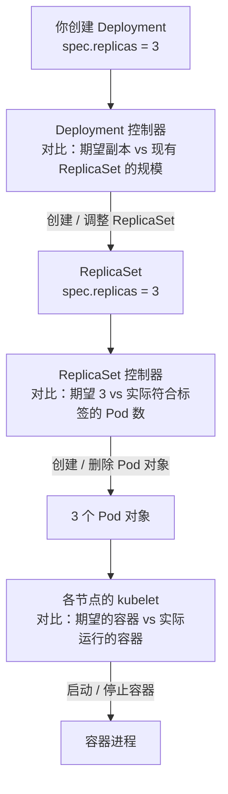
```mermaid
flowchart TB
    YOU["你创建 Deployment<br/>spec.replicas = 3"] --> DC["Deployment 控制器<br/>对比：期望副本 vs 现有 ReplicaSet 的规模"]
    DC -->|"创建 / 调整 ReplicaSet"| RS["ReplicaSet<br/>spec.replicas = 3"]
    RS --> RC["ReplicaSet 控制器<br/>对比：期望 3 vs 实际符合标签的 Pod 数"]
    RC -->|"创建 / 删除 Pod 对象"| P["3 个 Pod 对象"]
    P --> KL["各节点的 kubelet<br/>对比：期望的容器 vs 实际运行的容器"]
    KL -->|"启动 / 停止容器"| C["容器进程"]
```

**四层，三个控制器，一个 kubelet。**每一层都只会：
1. 读自己关心的那个对象的 `spec`
2. 对比实际
3. 调整**下一层**对象的数量或内容

#### 为什么不直接一步到位：Deployment 直接管 Pod？

这是经典面试题。答案是：**ReplicaSet 提供了一次"版本快照"的载体。**

滚动更新的本质是什么？第 5 章会详细讲，但这里可以先给结论：

```
滚动更新 = 新建一个 ReplicaSet（v2，副本数从 0 开始）
         + 旧 ReplicaSet（v1，副本数降到 0）
         两者的副本数此消彼长
```

所以 Deployment 管理的其实是**一组 ReplicaSet**，它要保证的核心不变量是：

**所有 ReplicaSet 的副本数之和 = 期望副本数**，且新版本的比例逐步升高。

**Deployment 管"版本与规模的比例"，ReplicaSet 管"数量准确"。**职责分开了，回滚也自然成立——回滚就是把 v1 的副本数调回去，v2 的降下来。

你可以用一个命令验证这个结构：
```bash
kubectl get rs -n cloudnote --show-labels
kubectl describe deploy api -n cloudnote | grep -A2 Events
```

#### 附带一个必知的机制：OwnerReference 与级联删除

控制器创建下一层对象时，会在子对象里写一条"我的主人是谁"：

```yaml
metadata:
  ownerReferences:
    - apiVersion: apps/v1
      kind: ReplicaSet
      name: api-7d4b9c8f5
      uid: 8f2c...
```

这条引用带来了三个你可能天天在用、但不知道为什么的功能：

| 现象 | 背后的机制 |
|---|---|
| `kubectl delete deploy api` 会把 Pod 也删掉 | **级联删除**：垃圾回收器（GC）沿着 ownerReference 往下清理 |
| `kubectl delete deploy api --cascade=orphan` 会留下 Pod | 显式告诉 GC "只删主人，别管子对象" |
| `kubectl get pod api-xxxx -o yaml` 里能看到 `ownerReferences` | 这就是"这个 Pod 是谁生的"的证明 |

**K8s 里对象之间的"从属关系"是靠 `ownerReferences` 表达的，"引用关系"（Service 找 Pod、Deployment 找 RS）则是靠 `labels` + `selector` 表达的。**这两套机制要分清楚：

| 机制 | 用途 | 例子 |
|---|---|---|
| **ownerReferences** | **所有权与生命周期**（谁生谁、删谁连带删谁） | RS → Pod |
| **labels / selector** | **查询与匹配**（谁是"我这一类"） | Service → Pod |

第 1 章把标签称作 Kubernetes 的关系型数据库外键，现在可以补上后半句：**标签管"找得到"，ownerReference 管"管得着"。**

---

### <a id="sec-04-4-8"></a>4.8 控制器的完整形态，以及 Operator 的由来

把前面所有零件拼起来，一个"K8s 味道"的控制器长这样：

```
① 定义你要关心什么
   - 哪些资源类型（Deployment？Pod？还是你自己定义的 CRD？）
   - 用什么条件筛选

② 建立 informer（List + Watch + 本地缓存）

③ 变更事件进入 WorkQueue（去重 + 限速）

④ 从队列取出一个 key → 从缓存读出对象

⑤ 执行 reconcile：
   - 幂等
   - 每次重新读状态
   - 只做最小必要的写操作
   - 冲突了就整轮重来
   - 不做有副作用的不可逆操作

⑥ 写回 API Server（这会触发别人的 informer，形成下一环）
```

#### 三种写控制器的方式

| 方式 | 适用 | 说明 |
|---|---|---|
| **client-go 手写** | 学习、定制化极高的场景 | 要自己搭 informer、queue、重试 |
| **controller-runtime / kubebuilder** | 生产主流 | 把上面 ①~⑥ 的模板都封好了，你只写 reconcile 函数体 |
| **Operator SDK / kubebuilder 脚手架** | 生态项目 | 生成骨架 + 打包分发 |

#### Operator 到底是什么

现在可以给出一个非常精确的定义了：

**CRD（自定义资源）+ 控制器 = Operator。**

拆开说：

- **CRD（Custom Resource Definition）**：你告诉 K8s"我要定义一种新的对象类型"，比如 `kind: MySQLCluster`。定义完之后，你就能像写 Deployment 一样写 `MySQLCluster` 的 YAML 了。
- **控制器**：你写一段代码，告诉 K8s"当有人创建了 `MySQLCluster` 时，应该把实际的 MySQL 集群调谐成什么样"。

**于是你就把"运维一个 MySQL 集群"这件事，变成了一个"声明式的对象"。**

这就是为什么会有 Prometheus Operator、Kafka Operator、Cert-Manager 这些东西——它们把各自领域的复杂运维知识，封装成了"你写一个 YAML，剩下交给控制器"。

**这也是第 1 章"原则三：松耦合 + 可扩展"的兑现方式。**K8s 没有把"什么是一个应用"写死在代码里，它给了你一个框架，让你自己去定义。

---

### <a id="sec-04-4-9"></a>4.9 "声明式"的适用边界：什么时候不该用它

课程讲到这里，容易产生一种"声明式什么都能干"的错觉。这里必须泼一盆冷水。

#### 声明式擅长什么

**"稳定状态"类需求**——你希望系统**持续处于**某个状态：

- 要有 3 个副本，且一直保持
- 数据库要有 100GB 存储，且一直可用
- 证书要一直有效（过期前自动续）
- 域名要一直指向某个地址

**特征：目标是"一个状态"，而不是"一次动作"。**

#### 声明式不擅长什么

**"一次性动作"类需求**——你只希望它**发生一次**：

- 给所有用户发一封通知邮件
- 执行一次数据库 schema 迁移
- 生成一份昨天为止的报表

**特征：目标是"一个已完成的事实"，而不是"一个持续的状态"。**

如果你硬要用声明式表达"发一次邮件"，会立刻遇到尴尬的问题：**"期望状态"是什么？**"邮件已发出"这个状态是没法持续维持的——你无法让系统"保持邮件已发出"，因为它已经发出去了，再调谐一次就会再发一次。

#### K8s 怎么处理这类需求

它提供了两个"半声明式"的折中工具（第 13 章详讲）：

| 对象 | 语义 | 为什么算半个声明式 |
|---|---|---|
| **Job** | "这个任务要成功完成一次" | 期望状态是"成功完成数 = 1"，控制器保证**至少有一个 Pod 成功退出**，成功后就不再动作 |
| **CronJob** | "按时间表产生 Job" | 期望状态是"该产生的 Job 都产生了" |

**注意 Job 的巧妙之处**：它把"执行一次动作"**转换成了**"保持一个计数器 = 1"。这仍然是状态，而不是动作——**这是把命令式需求塞进声明式框架的标准手法**，你自己写控制器时也可以借用这个思路。

#### 一个实用判断表

| 你的需求 | 该用什么 |
|---|---|
| 保持 3 个副本在跑 | Deployment（声明式） |
| 跑一次数据迁移 | Job（半声明式） |
| 每天凌晨跑一次备份 | CronJob（半声明式） |
| 给用户发一封邮件 | **不要用 K8s 的资源对象**，用你的应用逻辑 + 消息队列 |
| 重启一下某个服务 | `kubectl rollout restart`（这是命令，但结果是"让 Pod 重建"这个状态） |

**一条实用准则**：如果一个需求**天然有"做完"这个属性**，就别硬把它声明化。强行声明化的代价通常是"需要额外发明一套去重机制"，反而更脆。

---

### <a id="sec-04-4-10"></a>4.10 动手：亲眼看见调和循环在工作

理论讲完了。这一节的实验会让你**第一次真正"看见"调和循环**。

配套脚本已经写好：

```bash
bash cases/cloudnote/tools/reconcile-lab.sh
```

如果你想手动一步步做，下面是完整流程。**每一步都请仔细看输出的时间戳和 Pod 名字的变化。**

#### 实验一：删掉一个 Pod，看它被补回来

```bash
# 先准备一个 3 副本的 Deployment（第 5 章会详细讲，这里先用）
kubectl create deployment api-lab -n cloudnote \
  --image=nginx:1.27-alpine --replicas=3

kubectl get pods -n cloudnote -l app=api-lab
```

你会看到 3 个 Pod。现在删掉其中一个：

```bash
# 先记下被删的 Pod 名，最后对比用
VICTIM=$(kubectl get pods -n cloudnote -l app=api-lab -o jsonpath='{.items[0].metadata.name}')
echo "即将删除：$VICTIM"

kubectl delete pod "$VICTIM" -n cloudnote

# 立刻看（可能需要多试几次才能抓到中间态）
kubectl get pods -n cloudnote -l app=api-lab
```

**观察点**：

1. `$VICTIM` 那个名字**永远不会再出现**了
2. 有一个**全新的名字**出现了（Deployment 生成的 Pod 名带随机后缀）
3. 整个过程**大约 1 秒**——这就是调和循环的响应速度

**关键问题**：控制器是怎么知道要补的？

**它不需要知道。**它只是收到了一个"有个 key 可能变了"的通知（Pod 列表变了），于是**重新数了一遍**："期望 3，实际 2，那补 1 个。"

#### 实验二：把 Pod 的标签改掉，制造"孤儿"

这是最能说明问题的实验。ReplicaSet 是靠**标签选择器**来统计 Pod 的：

```bash
# 挑一个 Pod，把它的标签改掉，让它"脱离"选择器
ORPHAN=$(kubectl get pods -n cloudnote -l app=api-lab -o jsonpath='{.items[0].metadata.name}')
kubectl label pod "$ORPHAN" -n cloudnote app=somebody-else --overwrite

# 立刻观察
kubectl get pods -n cloudnote -l app=api-lab
kubectl get pod "$ORPHAN" -n cloudnote --show-labels
```

**你会看到惊人的一幕**：

1. ReplicaSet 立刻数出"符合 `app=api-lab` 的 Pod 只有 2 个"→ **补了第 3 个**
2. 而那个被你改标签的 `$ORPHAN` **还活着**（Running），但它现在不属于任何 ReplicaSet 了
3. 于是你拥有了 **4 个 Pod**：3 个在 RS 名下 + 1 个孤儿

**这个实验证明了三件事**：

- 控制器的判断依据是**"数量匹配"**，不是"具体哪个 Pod"
- 控制器**完全不管"谁是谁"**，它只数数
- **标签是 K8s 里对象之间"关系"的唯一凭据**——改了标签，关系就断了

清理一下：

```bash
kubectl delete pod "$ORPHAN" -n cloudnote
kubectl delete deployment api-lab -n cloudnote
```

#### 实验三：看它如何"收敛"到任意目标值

```bash
kubectl create deployment api-lab -n cloudnote --image=nginx:1.27-alpine --replicas=1
kubectl get pods -n cloudnote -l app=api-lab

# 扩到 5
kubectl scale deployment api-lab -n cloudnote --replicas=5
kubectl get pods -n cloudnote -l app=api-lab -w
# 按 Ctrl+C 退出

# 缩到 2（观察它是"按数量删"，而不是"删掉某个特定 Pod"）
kubectl scale deployment api-lab -n cloudnote --replicas=2
kubectl get pods -n cloudnote -l app=api-lab
```

**重复 `scale` 到同一个数字 100 次，结果完全一样——这就是幂等。**

#### 实验四：捕捉一次"冲突"

这个实验有点"手快"的要求，但值得一试：

```bash
# 开两个终端，几乎同时对这个 Deployment 做不同的修改
# 终端 A：
kubectl patch deployment api-lab -n cloudnote --type=merge -p '{"spec":{"replicas":4}}'

# 终端 B（同时执行）：
kubectl patch deployment api-lab -n cloudnote --type=merge -p '{"spec":{"replicas":6}}'
```

用 `patch` 很难复现冲突（因为 patch 是部分更新，且默认不带 `resourceVersion`）。想稳定复现，用全量 `update`：

```bash
# 拿到完整对象，改掉副本数，再写回
kubectl get deployment api-lab -n cloudnote -o json > /tmp/d.json
# 手动把 /tmp/d.json 里的 replicas 改一下，然后：
kubectl replace -f /tmp/d.json
```

如果你在"读取"和"写回"之间用另一个终端改了这个对象，就会看到：

```
Error from server (Conflict): Operation cannot be fulfilled on deployments.apps "api-lab":
the object has been modified; please apply your changes to the latest version and try again
```

**这个错误信息就是第 4.6 节讲的乐观并发的实体。**

#### 实验五：把"控制器的眼睛"蒙上

最后一个实验很直观。先把 Deployment 的副本数固定：

```bash
kubectl scale deployment api-lab -n cloudnote --replicas=3
```

然后**快速连续删除两个 Pod**：

```bash
PODS=$(kubectl get pods -n cloudnote -l app=api-lab -o jsonpath='{.items[*].metadata.name}')
for p in $PODS; do kubectl delete pod "$p" -n cloudnote & done
wait
kubectl get pods -n cloudnote -l app=api-lab
```

**结果依然会收敛到 3 个。**

这里发生的事很值得琢磨：多个删除事件几乎同时到达，WorkQueue 可能把它们**去重合并成一次**（或几次）调谐。但无论合并与否，控制器每次都会**重新数一遍**——只要最终数出来不是 3，就继续补。

**这就是"水平触发 + 去重队列"组合起来的威力：它不依赖任何一个事件被完整送达。**

清理：

```bash
kubectl delete deployment api-lab -n cloudnote
```

---

### <a id="sec-04-4-11"></a>4.11 本章要点

1. **K8s 的控制器是水平触发（状态驱动）的，不是边缘触发（事件驱动）的。**它不关心"发生了什么变化"，只关心"现在是什么状态"。**所以丢事件不会导致永久不一致**——这是所有其他特性的地基。
2. **调和循环不记状态、不假设结果、只做最小必要的修正**，因此天然幂等，允许重复执行；它保证的是**最终一致**，而不是任何时刻的强一致。
3. **Watch 是优化，读状态才是正确性来源**。List + Watch 负责唤醒，本地缓存负责高效读取，WorkQueue 负责去重与限速重试。
4. **`resourceVersion` 实现乐观并发**：写回时带上读到的版本号，被别人改过就返回 409，控制器整轮重来。**冲突是正常现象，不是异常。**

#### 本章全景图

```
   ┌─────────────────────────────────────────────────────────┐
   │                    K8s 的做事方式                        │
   └─────────────────────────────────────────────────────────┘

   你只写「期望状态」                              spec: replicas = 3
          │                                              ▲
          │ 存进 etcd                                     │ 写回
          ▼                                              │
   ┌─────────────┐   变更通知（只是闹钟）          ┌───────┴────────┐
   │    etcd     │ ─────────────────────────────► │  控制器 / kubelet │
   │ （只存不思考）│                                │  （真正会思考）   │
   └─────────────┘ ◄───────────────────────────── └───────┬────────┘
          完整状态（才是判断依据）                          │
                                                          │
                                          ┌───────────────┴──────────────┐
                                          │  每次重新读状态，不依赖记忆    │
                                          │  幂等：跑 1 次和 1000 次一样   │
                                          │  冲突就重来，保证最终收敛      │
                                          └──────────────────────────────┘
```

### <a id="sec-04-4-12"></a>4.12 练习题

1. 什么是"边缘触发"和"水平触发"？为什么 K8s 选后者？
2. 假设一条"Pod 被删除"的通知彻底丢了，K8s 会怎样？为什么？
3. 调和循环里为什么**不保存上一轮的状态**？这样做换来了什么？
4. WorkQueue 把 100 次变更去重成 1 次处理，为什么不会漏掉中间状态？
5. 判断下面这句话是否幂等：`if not exists(x) then create(x)`。为什么？
6. 幂等性和原子性各回答什么问题？它们互相排斥吗？为什么说幂等性不属于 ACID？
7. K8s 在"单个对象"和"跨多个对象"上分别给了什么保证？为什么它不需要分布式事务？
8. `resourceVersion` 的作用是什么？为什么 K8s 不直接用悲观锁？
9. `kubectl apply` 报 `the object has been modified` 是什么意思？正确做法是什么？
10. Deployment 为什么不直接管 Pod，中间要加一层 ReplicaSet？
11. `ownerReferences` 和 `labels/selector` 分别表达什么关系？各举一个例子。
12. "给用户发一封邮件"适合用声明式表达吗？Job 是怎么把"一次性动作"塞进声明式框架的？


---

# <a id="part-2"></a>第二篇　部署与网络

---

## <a id="ch-05-deployment"></a>第 5 章　把应用跑起来：Deployment 与滚动更新

第 4 章说明了控制器如何思考。从本章开始，原理要落成可执行的操作：把一个真实应用发布出去，观察它滚动更新，再故意发布一个坏版本并回滚。

Deployment 是 Kubernetes 中使用频率最高的对象，也是最容易"会写但不理解"的对象。本章沿着它的工作方式展开：它为什么不直接创建 Pod，而要经过 ReplicaSet；`maxSurge` 与 `maxUnavailable` 这两个数字如何决定发布的节奏与风险；就绪探针在其中扮演什么角色；以及 `kubectl rollout undo` 回滚的究竟是什么。

所需的前置结论已经具备：

| 第 2 章的结论 | 第 4 章的结论 |
|---|---|
| 裸 Pod 删了不会回来 | ReplicaSet 保证"数量"准确 |
| Pod 是一次性的，改不了就重建 | 控制器靠"数数"来决定做什么 |
| Pod IP 不稳定 | 冲突是正常的，重来就行 |

还缺的只有一样东西：**版本**。

---

### <a id="sec-05-5-1"></a>5.1 Deployment 到底多做了哪两件事

先看 ReplicaSet 已经能做什么。如果直接用 ReplicaSet 管理应用，你得到的是：

- 副本数保证（Pod 挂了自动补）
- 手动改 `spec.template` 时，它会把**所有旧 Pod 全部删掉，再全部建新的**——因为它只管数量，不管"过渡"

这个"全删全建"的过程叫 **Recreate**，它有一个致命问题：**中间有几十秒到几分钟的完全不可用**。

Deployment 在 ReplicaSet 之上补了两件事：

| 能力 | 说明 |
|---|---|
| **滚动更新（Rolling Update）** | 逐批替换，过程中始终保留足够多的可用副本，**用户无感知** |
| **版本历史与回滚** | 每次更新留下一个"版本快照"，出问题可以秒级切回去 |

再加上它继承自 ReplicaSet 的副本保证，Deployment 一共提供四件事：

**副本保证 + 滚动更新 + 版本历史 + 回滚。**

所以一句话定义：

> **Deployment 是"无状态应用的版本管理器"。**它管理的是"某个镜像的某个版本，应该有多少份同时在跑"。

关键词是**无状态**。如果你的应用需要"稳定的身份 + 独立的存储 + 有序启停"（数据库、消息队列），那要用第 13 章的 **StatefulSet**。Deployment 建立的假设是：**所有副本完全对等、可以随便替换任何一个。**

---

### <a id="sec-05-5-2"></a>5.2 把一个真实的 Deployment 逐行看懂

下面是 CloudNote 的 `api` 服务在生产环境的 Deployment。每一行都有理由，逐个说明。

文件位置：`cases/cloudnote/20-api-deployment.yaml`

**一个说明**：CloudNote 真实的 `api` 镜像监听 **8080**。但为了让本章实验在**任何机器上都能直接跑起来**（不需要私有镜像仓库），下面这份清单用公开的 `nginx` 镜像代替——它默认监听 **80**。

等你换成真实镜像时，把 `containerPort`、探针端口、以及后面 Service 的 `targetPort` 一起改成 `8080` 即可。**除此之外的每一个字段，都是生产可直接照抄的。**

```yaml
apiVersion: apps/v1
kind: Deployment
metadata:
  name: api
  namespace: cloudnote
  labels:
    app: api
    app.kubernetes.io/name: api
    app.kubernetes.io/part-of: cloudnote
  annotations:
    # 每次发布都更新它，rollout history 里才会显示人能看懂的原因
    kubernetes.io/change-cause: "初始发布 v1"
spec:
  # ① 要几个副本
  #    生产上无状态服务建议 >= 2，否则发布期间会短暂中断
  replicas: 2

  # ② 标签选择器：Deployment 用它「认领」属于自己的 Pod
  selector:
    matchLabels:
      app: api

  # ③ 更新策略
  strategy:
    type: RollingUpdate
    rollingUpdate:
      maxSurge: 1
      maxUnavailable: 0

  # ④ 保留多少个历史版本
  revisionHistoryLimit: 10

  # ⑤ 进度停滞多久算失败
  progressDeadlineSeconds: 600

  # ⑥ Pod 模板：新 Pod 长什么样
  template:
    metadata:
      labels:
        app: api                    # ← 必须能被上面的 selector 匹配到！
    spec:
      containers:
        - name: api
          image: nginx:1.27-alpine  # ← 换成 CloudNote 的真实镜像（监听 8080）
          ports:
            - name: http            # 给端口起名字，Service 可以用 targetPort: http 引用
              containerPort: 80
          env:
            - name: VERSION
              value: "v1"           # 实验中靠改它来触发一次「发布」
          resources:
            requests: { cpu: 50m, memory: 64Mi }
            limits:   { cpu: 200m, memory: 128Mi }
          readinessProbe:
            httpGet: { path: /, port: http }
            initialDelaySeconds: 2
            periodSeconds: 3
          livenessProbe:
            httpGet: { path: /, port: http }
            initialDelaySeconds: 5
            periodSeconds: 10
```

#### ① `selector` 和 `template.labels` 的关系是硬约束

这是新手最容易踩的坑，而且**报错信息不友好**。规则是：

**`spec.selector.matchLabels` 必须能匹配到 `spec.template.metadata.labels`。否则 API Server 直接拒绝创建。**

为什么？回到第 4 章那个实验——ReplicaSet 是靠标签"数数"的。如果 `selector` 认领不到自己的 Pod，会发生两件灾难性的事：

1. 它数出"符合条件的是 0 个"，于是疯狂创建新 Pod —— **无限增长**
2. 或者它把所有别人的 Pod 都算成自己的，然后**去删别人的 Pod**

所以 K8s 在入口就把这个错误拦住了。报错长这样：

```
The Deployment "api" is invalid: spec.template.metadata.labels: Invalid value:
`map[string]string{"app":"api"}` does not match `map[string]string{"app":"web"}`:
`selector` does not match template `labels`
```

**还有一个更隐蔽的坑：`selector` 创建后不可修改。**它是 **immutable** 的。

```bash
kubectl patch deployment api -n cloudnote \
  -p '{"spec":{"selector":{"matchLabels":{"app":"api2"}}}}'
# The Deployment "api" is invalid: spec.selector: Invalid value: ... field is immutable
```

为什么不让改？因为改了选择器，意味着"这个 Deployment 从此认领另外一批 Pod"。K8s 无法安全地判断"那原来那批 Pod 该怎么办"，所以干脆禁止，让你删掉重建。

#### ② `strategy` 里的两个数字，是本章的核心

```yaml
strategy:
  type: RollingUpdate
  rollingUpdate:
    maxSurge: 1
    maxUnavailable: 0
```

- `maxSurge: 1`：滚动过程中，**最多允许多出 1 个** Pod（超出 `replicas` 的部分）
- `maxUnavailable: 0`：滚动过程中，**最多允许 0 个** Pod 不可用

这两个值组合起来的效果是：**先建新的，等它就绪，再删旧的——全程可用副本数不低于 replicas。**这是最保守、最安全、最适合面向用户服务的配置。代价是**发布时需要额外的资源**（峰值 5 个 Pod 而不是 4 个）。

第 5.4 节会把这个过程走一遍。

#### ③ `revisionHistoryLimit` 决定了"能回滚多远"

默认 10。它的物理含义是：**保留多少个旧 ReplicaSet。**

**旧 ReplicaSet 不是"日志"，它是能直接复活的实体**——这就是回滚能秒级完成的原因。

如果把它设成 `0`，那你就**失去了回滚能力**（旧 RS 会被立即清理）。这是一个非常危险的"优化"。

#### ④ `progressDeadlineSeconds` 决定了"卡住多久算失败"

默认 600 秒。它不"杀死"任何东西，只是**给 Deployment 打一个标记**：

```
Progressing   False   ProgressDeadlineExceeded
```

**注意：它不会自动回滚。**第 5.8 节会专门讲这个坑。

---

### <a id="sec-05-5-3"></a>5.3 发布时，三层是怎么接力的

第 4 章给出过 Deployment → ReplicaSet → Pod 的链条。下面看它在**发布时**的具体分工：

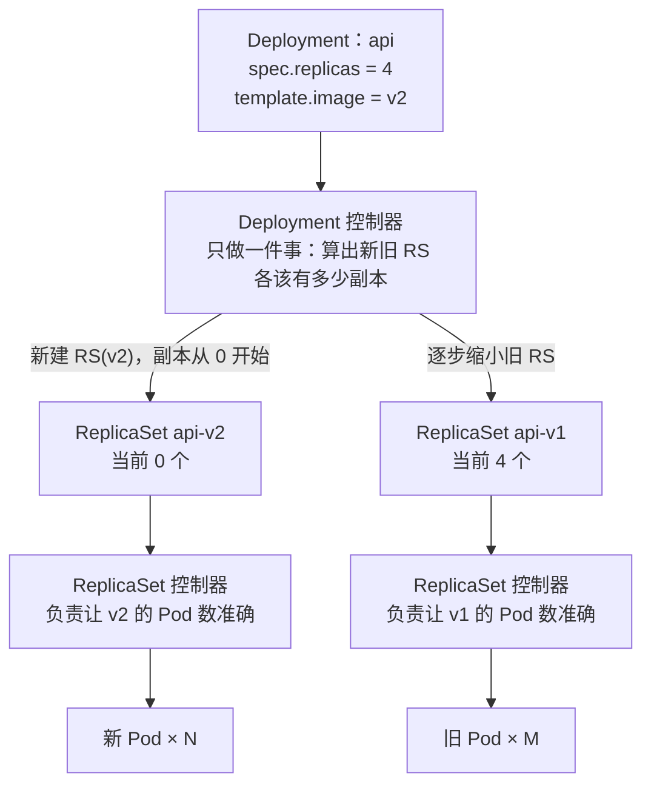
```mermaid
flowchart TB
    D["Deployment：api<br/>spec.replicas = 4<br/>template.image = v2"] --> DC["Deployment 控制器<br/>只做一件事：算出新旧 RS 各该有多少副本"]
    DC -->|"新建 RS(v2)，副本从 0 开始"| RS2["ReplicaSet api-v2<br/>当前 0 个"]
    DC -->|"逐步缩小旧 RS"| RS1["ReplicaSet api-v1<br/>当前 4 个"]
    RS2 --> RC2["ReplicaSet 控制器<br/>负责让 v2 的 Pod 数准确"]
    RS1 --> RC1["ReplicaSet 控制器<br/>负责让 v1 的 Pod 数准确"]
    RC2 --> P2["新 Pod × N"]
    RC1 --> P1["旧 Pod × M"]
```

**关键洞察**：

- **Deployment 控制器从来不直接管 Pod。**它只管**两个 ReplicaSet 的副本数之和与比例**。
- **ReplicaSet 控制器也不管版本。**它只负责"我名下要有 M 个 Pod"。
- 两者通过**各管一层**实现了解耦。

所以滚动更新的本质，可以浓缩成一句：

> **新建一个 ReplicaSet（新版本，副本从 0 开始），然后让新旧两个 ReplicaSet 的副本数此消彼长。**

你可以用这个命令亲眼看到那两个 RS：

```bash
kubectl get rs -n cloudnote -o wide
# NAME              DESIRED   CURRENT   READY
# api-6b8c9d7f4     4         4         4        ← 新的
# api-5a7f2c8e1     0         0         0        ← 旧的（留着，随时能复活）

kubectl get rs -n cloudnote -o jsonpath='{range .items[*]}{.metadata.name}{"\t"}{.spec.template.spec.containers[0].image}{"\n"}{end}'
```

**RS 的名字不是随机的**：`api-6b8c9d7f4` 里的 `6b8c9d7f4` 是 Pod 模板的哈希值。**模板一变，哈希就变，就是一个新 RS。**这也是 K8s 判断"要不要新建 RS"的依据——它算哈希，不比较字段。

---

### <a id="sec-05-5-4"></a>5.4 滚动更新的节奏：maxSurge 与 maxUnavailable

现在把第 5.2 节的 `maxSurge: 1` / `maxUnavailable: 0` 和 4 个副本走一遍完整过程。

#### 先把两条不变量写清楚

```
允许的 Pod 总数上限  = replicas + maxSurge        = 4 + 1 = 5
允许的可用 Pod 数下限 = replicas - maxUnavailable  = 4 - 0 = 4
```

**Deployment 控制器每做一步，都要检查这两条不变量。**这是理解整个滚动过程的钥匙——**它不是"按固定脚本走"，而是"在约束内尽可能地推进"。**

#### 循环：每换一个副本，走三步

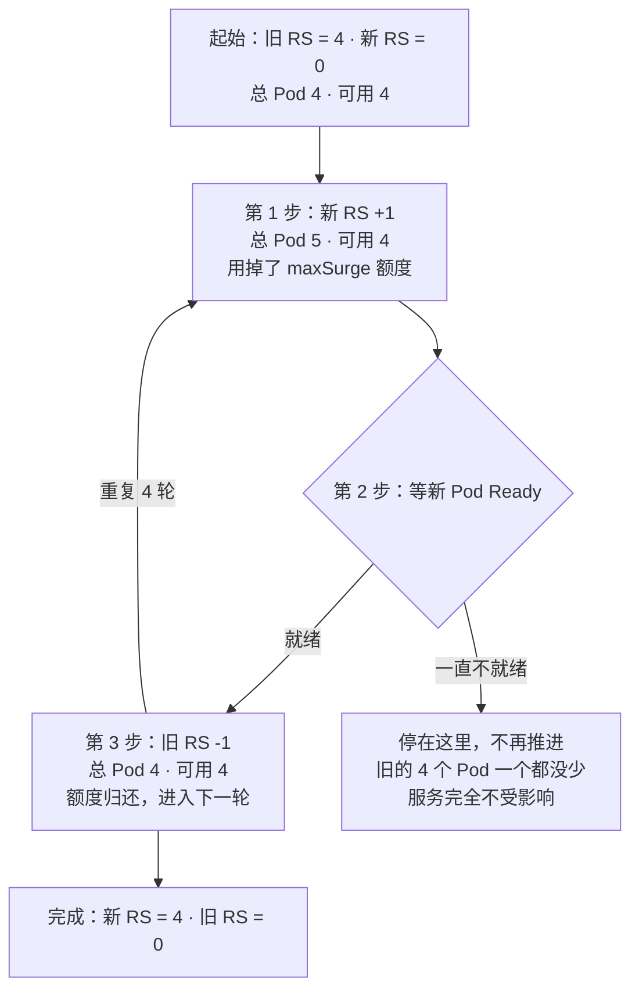
```mermaid
flowchart TB
    A["起始：旧 RS = 4 · 新 RS = 0<br/>总 Pod 4 · 可用 4"] --> B["第 1 步：新 RS +1<br/>总 Pod 5 · 可用 4<br/>用掉了 maxSurge 额度"]
    B --> C{"第 2 步：等新 Pod Ready"}
    C -->|"就绪"| D["第 3 步：旧 RS -1<br/>总 Pod 4 · 可用 4<br/>额度归还，进入下一轮"]
    C -->|"一直不就绪"| X["停在这里，不再推进<br/>旧的 4 个 Pod 一个都没少<br/>服务完全不受影响"]
    D -->|"重复 4 轮"| B
    D --> E["完成：新 RS = 4 · 旧 RS = 0"]
```

完整展开一遍（4 个副本）：

| 时刻 | 旧 RS | 新 RS | 总 Pod | 可用 Pod | 动作 | 检查 |
|---|---|---|---|---|---|---|
| T0 | 4 | 0 | 4 | 4 | 开始 | — |
| T1 | 4 | 1 | 5 | 4 | 扩新 RS | 总 5 ≤ 5  |
| T2 | 4 | 1 | 5 | **5** | 新 Pod 就绪 | — |
| T3 | 3 | 1 | 4 | 4 | 缩旧 RS | 可用 4 ≥ 4  |
| T4 | 3 | 2 | 5 | 4 | 扩新 RS | 总 5 ≤ 5  |
| T5 | 3 | 2 | 5 | 5 | 新 Pod 就绪 | — |
| T6 | 2 | 2 | 4 | 4 | 缩旧 RS | 可用 4 ≥ 4  |
| T7 | 2 | 3 | 5 | 4 | 扩新 RS | 总 5 ≤ 5  |
| T8 | 2 | 3 | 5 | 5 | 新 Pod 就绪 | — |
| T9 | 1 | 3 | 4 | 4 | 缩旧 RS | 可用 4 ≥ 4  |
| T10 | 1 | 4 | 5 | 4 | 扩新 RS | 总 5 ≤ 5  |
| T11 | 1 | 4 | 5 | 5 | 新 Pod 就绪 | — |
| T12 | 0 | 4 | 4 | 4 | 缩旧 RS，**完成** | — |

**注意 T2 那一刻**：可用 Pod 数是 **5**，比期望的 4 还多。这就是 `maxSurge` 换来的"缓冲"——**永远多一个已在线的，才敢删旧的。**

#### 换一组参数会怎样

`maxSurge: 0` / `maxUnavailable: 1`（适合资源紧张的集群）：

| 时刻 | 旧 RS | 新 RS | 总 Pod | 可用 Pod |
|---|---|---|---|---|
| T0 | 4 | 0 | 4 | 4 |
| T1 | 3 | 0 | **3** | 3 | ← 先删旧的腾位置 |
| T2 | 3 | 1 | 4 | 4 | ← 新 Pod 就绪 |

**代价是发布期间只有 3 个副本在扛流量。**集群资源快满了、加不出第 5 个 Pod 时，这是唯一的选择。

#### 四个参数速查

| maxSurge | maxUnavailable | 效果 | 适用 |
|---|---|---|---|
| `1`（或 25%） | `0` | 先建后删，全程满容量 | **默认推荐**，面向用户的在线服务 |
| `0` | `1`（或 25%） | 先删后建，省资源 | 集群资源紧张 |
| `25%` | `25%` | K8s 默认值，两者并行推进 | 通用 |
| `100%` | `100%` | 等于全删全建 | 不如直接用 Recreate |
| `0` | `0` | **非法**！API Server 会拒绝 | — |

**最后一行要记住**：`maxSurge` 和 `maxUnavailable` **不能同时为 0**。
逻辑上很好理解：两个都锁死，控制器既不能多建一个、也不能少一个，那它就**永远无法推进**，只能死锁。

#### 并且：什么时候用 `Recreate`

```yaml
strategy:
  type: Recreate
```

它会**先删掉所有旧 Pod，再建新的**。中间有明确的服务中断。

**什么时候该用它？**

| 场景 | 为什么必须 Recreate |
|---|---|
| 应用不支持多版本并存（比如数据库 schema 不兼容） | 新旧版本同时跑会写坏数据 |
| 独占资源（挂载了同一个 RWO 卷，或者要绑固定主机端口） | 新旧 Pod 争抢同一份资源，新 Pod 起不来 |
| 有严格顺序要求的初始化 | 并发启动会互相干扰 |

**判断准则：如果你的应用"不能有两个版本同时存在"，就必须用 Recreate，并接受停机。**

---

### <a id="sec-05-5-5"></a>5.5 真正的"刹车"是就绪探针

上面那个循环里，第 2 步是"**等新 Pod Ready**"。这里有个容易被忽略的关键点：

**"Ready" 是谁说了算？**

**不是"容器启动了"，而是"就绪探针通过了"。**

这个区别非常致命。看两种配置的差别：

| 配置 | "Ready" 的判断 | 后果 |
|---|---|---|
| **没配 readinessProbe** | 容器进程起来了就算 Ready | 对象存储连接还没建立、缓存还没预热、JVM 还在编译…… **流量已经打进来了，用户看到 502** |
| **配了 readinessProbe** | 探针连续成功 N 次才算 Ready | **只有真正能干活了才接流量** |

**所以滚动更新的速度，实际上是由你的就绪探针决定的：**

- 探针太宽松 → 发布很快，但可能把没准备好的 Pod 加进负载均衡
- 探针太严格 → 发布很慢，甚至卡住

一个实用的默认配置：
```yaml
readinessProbe:
  httpGet: { path: /healthz, port: http }
  initialDelaySeconds: 2    # 起容器后先等 2 秒再探
  periodSeconds: 3          # 之后每 3 秒探一次
  failureThreshold: 3       # 连续失败 3 次才算"不健康"
  successThreshold: 1       # 成功 1 次就算"恢复健康"
```
第 11 章会把三种探针（liveness / readiness / startup）彻底讲清，并告诉你**探针配错会怎样把整个服务搞挂**。这里先记住一句：**滚动更新能不能顺利推进，取决于 readinessProbe。**

---

### <a id="sec-05-5-6"></a>5.6 动手：发布、观察、搞坏、回滚

本节实验需要一个集群，搭建方式见第 1.10 节。**这个实验不依赖任何外部镜像仓库**——它用同一个镜像改环境变量来触发发布，用不存在的镜像标签来制造故障。

配套脚本：

```bash
bash cases/cloudnote/tools/rollout-lab.sh
```

下面是可以手动一步步做的完整流程。

#### 第一步：发布 v1

```bash
kubectl apply -f cases/cloudnote/00-namespace.yaml
kubectl apply -f cases/cloudnote/20-api-deployment.yaml

kubectl rollout status deployment/api -n cloudnote
kubectl get pods -n cloudnote -l app=api -o wide
kubectl get rs -n cloudnote
```

你会看到 **1 个 ReplicaSet**（名字是 `api-<哈希>`）。

#### 第二步：改一个环境变量，触发一次发布

```bash
# 注意时间：记录这一刻
date +%H:%M:%S
kubectl set env deployment/api -n cloudnote VERSION=v2

# 实时盯着整个滚动过程（这是本章最值得看的画面）
kubectl get pods -n cloudnote -l app=api -w

# 同时开另一个终端看 RS 的副本数此消彼长
watch -n1 'kubectl get rs -n cloudnote'
```

**你会看到**：

- 新的 Pod 名字带有新的哈希前缀（同一批 Pod 的哈希是一致的）
- `kubectl get rs` 里出现了**第二个 ReplicaSet**，旧的副本数逐步降到 0（**但不会被删除**）

#### 第三步：验证"旧的 ReplicaSet 还活着"

```bash
# 两个 RS，一个新的有副本、一个 0 副本
kubectl get rs -n cloudnote

# 看它们各自用的是哪个模板
kubectl get rs -n cloudnote -o jsonpath='{range .items[*]}{.metadata.name}{"\t"}{.spec.replicas}{"\t"}{.spec.template.spec.containers[0].env[0].value}{"\n"}{end}'
```

**关键观察：旧的 ReplicaSet 仍然存在，副本数为 0。**它不是被删除了，只是"下班了"。**这就是回滚能秒级完成的物理基础。**

#### 第四步：查看版本历史

```bash
kubectl rollout history deployment/api -n cloudnote
```

预期输出：

```
REVISION  CHANGE-CAUSE
1         <none>
2         <none>
```

`CHANGE-CAUSE` 默认是空的，除非你在 `kubectl` 命令里加上 `--record`（已弃用）或者给它打注解：
```bash
kubectl annotate deployment/api -n cloudnote \
  kubernetes.io/change-cause="升级到 v2" --overwrite
```
**生产上强烈建议每次都写 change-cause。**半年后的你，会感谢现在的你。

#### 第五步：制造一个坏版本

```bash
# 用一个不存在的镜像标签 —— 效果等同于"CI 推错了 tag"
kubectl set image deployment/api -n cloudnote api=nginx:1.27-does-not-exist

# 观察发生了什么
kubectl get pods -n cloudnote -l app=api -w
```

**注意看这几件事**：

1. 新的 Pod 卡在 `ImagePullBackOff` 或 `ErrImagePull`，**永远不会 Ready**
2. 但 `kubectl get pods` 里**旧的那些 Pod 一个都没少**——它们还在 Running
3. `kubectl get deploy/api -n cloudnote` 里可以看到 `READY` 仍然是 `2/2`

**这就是 `maxUnavailable: 0` 在保护你。**滚动更新走到"第 1 步"就停住了，因为新 Pod 一直不就绪，**旧 RS 一个副本都没敢缩**。

再验证一下服务的可用性——**完全不受影响**：

```bash
kubectl get endpoints api -n cloudnote
# 后端列表里仍然是那 2 个健康的旧 Pod
```

#### 第六步：看一眼"卡住的标记"

```bash
kubectl describe deploy api -n cloudnote | sed -n '/Conditions/,$p'
```

你会看到：

```
Conditions:
  Type           Status  Reason
  ----           ------  ------
  Available      True    MinimumReplicasAvailable
  Progressing    False   ProgressDeadlineExceeded
```

`Progressing: False` 就是"我卡住了"的正式标记。

> **重要提醒：`ProgressDeadlineExceeded` 不会自动回滚！**它只是打个标记给你看。这是无数人踩过的坑——"我以为它会自己回滚，结果它卡了一整夜"。
>
> **必须手动 `kubectl rollout undo`。**

#### 第七步：回滚（感受一下有多快）

```bash
# 先记时间
date +%H:%M:%S

kubectl rollout undo deployment/api -n cloudnote

# 观察收敛
kubectl rollout status deployment/api -n cloudnote
date +%H:%M:%S
```

**你会发现它几乎瞬间就完成了**——因为"回滚"其实只是：

1. 把有 bug 的那个 RS 缩到 0
2. 把旧 RS 从 0 扩回 2

**不需要重新拉镜像、不需要重跑 CI、不需要重新构建。**镜像层可能都还在节点本地缓存里。

```bash
# 确认版本回去了
kubectl get rs -n cloudnote
kubectl rollout history deployment/api -n cloudnote
```

**注意历史记录的变化**：回滚**不是**产生第 3 个 revision，而是**把 revision 1 重新激活**。所以 `history` 里可能只剩 2 条，但 `REVISION` 编号会变成 3 —— **因为 K8s 把这次"回滚"记录为一次新的版本事件。**

#### 第八步：回滚到指定版本

```bash
# 看看有哪些版本
kubectl rollout history deployment/api -n cloudnote

# 回到第 1 版
kubectl rollout undo deployment/api -n cloudnote --to-revision=1
```

#### 第九步：验证 `revisionHistoryLimit` 真的在起作用

```bash
# 连续改 5 次环境变量，产生多个 RS
for i in 3 4 5 6 7; do
  kubectl set env deployment/api -n cloudnote VERSION=v$i
  kubectl rollout status deployment/api -n cloudnote --timeout=60s
done

# 把限制改成 2
kubectl patch deployment/api -n cloudnote \
  -p '{"spec":{"revisionHistoryLimit":2}}'

# 等一下，再看 RS（多余的旧 RS 会被清理掉）
sleep 10
kubectl get rs -n cloudnote
```

**你会看到旧的 ReplicaSet 被删除了**，只剩下最近 2 个。**这也意味着：你再也回不到更早的版本了。**

#### 第十步：观察 `maxSurge` 的作用

```bash
kubectl patch deployment/api -n cloudnote -p '{"spec":{"replicas":4}}'
kubectl rollout status deployment/api -n cloudnote

# 把 maxSurge 改成 3，然后触发发布，观察总 Pod 数的峰值
kubectl patch deployment/api -n cloudnote \
  -p '{"spec":{"strategy":{"type":"RollingUpdate","rollingUpdate":{"maxSurge":3,"maxUnavailable":0}}}}'

kubectl set env deployment/api -n cloudnote VERSION=v8

# 盯着总 Pod 数：你应该能看到它一度涨到 7（4 + 3）
watch -n1 'kubectl get pods -n cloudnote -l app=api --no-headers | wc -l'
```

**这就是 `maxSurge` 的代价与价值**：数字越大，发布越快（并行替换的窗口越大），但峰值资源消耗越高。

清理：

```bash
kubectl delete deployment api -n cloudnote
```

---

### <a id="sec-05-5-7"></a>5.7 为什么回滚能这么快：一次彻底的机制拆解

上面实验里最震撼的一点，值得单独拿出来讲清楚。

#### 传统发布 vs K8s 发布

| 步骤 | 传统运维 | K8s |
|---|---|---|
| 回滚需要什么 | 找到旧版本的构建产物 / 重新构建 | **什么都不需要** |
| 回滚耗时 | 几分钟到几十分钟 | **秒级** |
| 回滚的风险 | 构建环境可能已经变了，构建失败 | **几乎为零** |

**为什么？因为旧版本的"完整实体"一直躺在那儿。**

```
                      出问题时                      rollout undo 之后
              ┌──────────────────────┐      ┌──────────────────────┐
              │ RS api-v1   副本 0   │      │ RS api-v1   副本 4   │  ← 复活
              │ RS api-v2   副本 4   │      │ RS api-v2   副本 0   │  ← 下班
              └──────────────────────┘      └──────────────────────┘
                        │                              ▲
                        └──────── 只是改两个数字 ──────┘
```

**"回滚"在 K8s 里不是一次"部署"，而是两个数字的调整。**而第 4 章讲过，调整数字正是调和循环最擅长的事——**幂等、瞬间、可重复。**

#### 三个必须知道的限制

**限制一：回滚只能回到"还在历史里的版本"。**

`revisionHistoryLimit` 之外的老 RS 已经被删了，回不去。**别为了"省几个 RS 对象"把这个值设小。**

**限制二：回滚不会回滚数据。**

如果你的 v2 版本已经跑了数据库迁移（`ALTER TABLE` 加了列、改了字段类型），**回滚到 v1 的代码照样会面对 v2 的数据库结构**。这是发布流程里最凶险的一类问题，解决办法在应用层：**数据库变更必须向前兼容（expand-contract 模式）**，让新旧两个版本的代码都能读写同一个 schema。

**限制三：回滚不会回滚 ConfigMap / Secret。**

如果你在同一次发布里既改了镜像又改了配置，`rollout undo` **只回滚 Deployment 的模板**。ConfigMap 的变更不会跟着回退——**它们是独立的对象**。

**实践建议**：把"应用版本"和"配置版本"分开管理（比如都给 ConfigMap 名字带上版本号 `app-config-v3`），这样回滚 Deployment 时，配置也跟着换回去。

---

### <a id="sec-05-5-8"></a>5.8 为什么 Deployment 会"卡住十分钟不动"

现在正面回答导读的第四个问题。

#### 卡住的三种典型原因

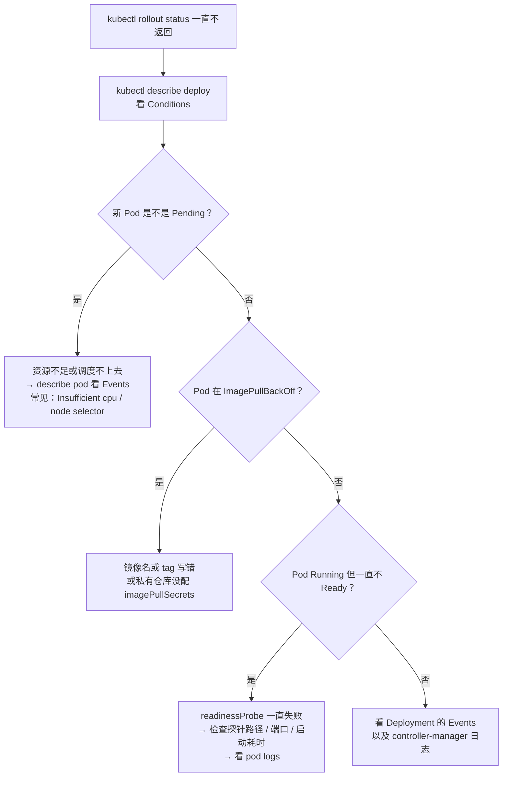
```mermaid
flowchart TB
    A["kubectl rollout status 一直不返回"] --> B["kubectl describe deploy<br/>看 Conditions"]
    B --> C{"新 Pod 是不是 Pending？"}
    C -->|"是"| D["资源不足或调度不上去<br/>→ describe pod 看 Events<br/>常见：Insufficient cpu / node selector"]
    C -->|"否"| E{"Pod 在 ImagePullBackOff？"}
    E -->|"是"| F["镜像名或 tag 写错<br/>或私有仓库没配 imagePullSecrets"]
    E -->|"否"| G{"Pod Running 但一直不 Ready？"}
    G -->|"是"| H["readinessProbe 一直失败<br/>→ 检查探针路径 / 端口 / 启动耗时<br/>→ 看 pod logs"]
    G -->|"否"| I["看 Deployment 的 Events<br/>以及 controller-manager 日志"]
```

#### 一张排错命令表

```bash
# ① 看 Deployment 的状态与 Conditions
kubectl describe deploy api -n cloudnote | sed -n '/Conditions/,$p'

# ② 看它管理的那两个 ReplicaSet 各自想要多少副本
kubectl get rs -n cloudnote -o wide

# ③ 找出没就绪的 Pod
kubectl get pods -n cloudnote -l app=api \
  -o custom-columns='NAME:.metadata.name,READY:.status.containerStatuses[0].ready,REASON:.status.containerStatuses[0].state.waiting.reason'

# ④ 看这个 Pod 到底怎么了
kubectl describe pod <没就绪的Pod名> -n cloudnote | sed -n '/Events/,$p'

# ⑤ 看应用自己说了什么
kubectl logs <没就绪的Pod名> -n cloudnote --tail=50
```

#### 卡住时，服务还可用吗

**这是最关键的问题，答案是：正常情况下可用。**

因为 `maxUnavailable` 在保护你：

| 配置 | 卡住时的可用副本数 |
|---|---|
| `maxUnavailable: 0` | **仍然是完整的 replicas**（旧的一个都没删） |
| `maxUnavailable: 1`，replicas=4 | 至少 3 个 |
| `maxUnavailable: 100%` | **可能全部不可用**（全删了，新的又起不来） |

**所以 `maxUnavailable: 0` 的第二个价值就是：发布失败时它是"安全气囊"。**你损失的是时间（没发成），不是可用性。

**反过来说，`maxUnavailable: 100%` 是生产事故的常见配方**——它等于"先全删再全建"，只要有一步出问题就是全站不可用。

#### 卡住之后怎么办

1. **修好根因**（改镜像 tag、加资源、修探针），滚动更新会自动继续——**不需要重新触发**
2. **或者放弃，直接回滚**：`kubectl rollout undo deployment/api`
3. **紧急暂停**：`kubectl rollout pause deployment/api` 会让控制器停止推进（连副本数调整都停）。恢复用 `kubectl rollout resume`

**第 3 点很有用**：如果你发现正在滚动更新，想先"按住"它（比如同时要改好几个字段，不想每改一个就触发一轮发布），可以：

```bash
kubectl rollout pause deployment/api -n cloudnote
kubectl set image deployment/api -n cloudnote api=nginx:1.27-alpine
kubectl set env  deployment/api -n cloudnote VERSION=v3
kubectl set resources deployment/api -n cloudnote -c=api --limits=cpu=1
kubectl rollout resume deployment/api -n cloudnote   # 一次性触发一轮发布
```

**比起改四次字段触发四轮滚动，这样只发一次。**

---

### <a id="sec-05-5-9"></a>5.9 生产上的 Deployment 该怎么写

最后一节，把经验直接给你。

#### 必备字段清单

| 字段 | 为什么必须有 | 缺了会怎样 |
|---|---|---|
| `resources.requests` | 调度依据 + QoS 等级的依据 | 调度器只能瞎猜，节点可能被挤爆 |
| `resources.limits` | 防止一个 Pod 吃光节点 | 一个内存泄漏的 Pod 拖垮整台机器 |
| `readinessProbe` | 决定了什么时候接流量 | **滚动更新时会把未就绪的 Pod 加进负载均衡** |
| `livenessProbe` | 决定了什么时候重启容器 | 进程假死（死锁、死循环）永远不被救 |
| `strategy.rollingUpdate` | 显式控制发布节奏 | 用默认 25%/25%，可能一次删掉四分之一的容量 |
| `revisionHistoryLimit` | 保证能回滚 | 设成 0 就失去回滚能力 |
| `annotations.kubernetes.io/change-cause` | 版本历史可读 | 半年后你看着 revision 3 不知道是什么 |
| 多副本（`replicas ≥ 2`） | 单副本发布时会短暂中断 | 发布期间 100% 不可用 |

#### 五个常见反模式

| 反模式 | 后果 | 正确做法 |
|---|---|---|
| `image: xxx:latest` | 每次拉到的可能不是你以为的那个版本，**回滚失去意义** | 用不可变 tag（`v1.2.3`）或镜像 digest |
| `maxUnavailable: 100%` | 发布 = 全站停机 | 用 `maxSurge: 1, maxUnavailable: 0` |
| 只写 `limits` 不写 `requests` | `requests` 会默认等于 `limits`，导致调度过度保守、QoS 变差 | 两者都写 |
| 没有 `readinessProbe` | 发布期间用户看到 502 | 必须配 |
| 用 Deployment 跑数据库 | Pod 重建后 IP 和身份全变、数据可能丢 | 用 StatefulSet（第 13 章） |

#### 和邻居的关系

Deployment 从来不单独工作。它在 CloudNote 里的位置是：

```
Ingress（第 7 章）
   ↓ 按域名/路径转发
Service（第 6 章）
   ↓ 按 label 找到后端
Deployment（本章）→ ReplicaSet → Pod
   ↑ 按 CPU 指标调整副本数
HPA（第 12 章）
```

**四个对象，各管一件事**：Ingress 管入口路由，Service 管稳定地址，Deployment 管版本与数量，HPA 管数量随负载变化。这就是 K8s 里"职责单一"的典型体现。

---

### <a id="sec-05-5-10"></a>5.10 本章要点

1. **Deployment = 副本保证 + 滚动更新 + 版本历史 + 回滚**，它管的是"某个版本的镜像该有多少份在跑"，前提是应用**无状态**。
2. **滚动更新的本质是新旧两个 ReplicaSet 的副本数此消彼长**，而 `maxSurge` / `maxUnavailable` 定义了这场此消彼长的两条边界：总 Pod ≤ `replicas + maxSurge`，可用 Pod ≥ `replicas - maxUnavailable`。
3. **回滚之所以秒级完成，是因为旧 ReplicaSet 一直存在（副本为 0），"回滚"只是把两个数字对调**——不需要重新构建、不需要重跑 CI。但它**不回滚数据、不回滚 ConfigMap**。
4. **`progressDeadlineSeconds` 超时只是打个标记，绝不自动回滚**。而且因为有 `maxUnavailable` 保护，**卡住时服务通常仍然可用**——你损失的是时间，不是可用性。

#### 本章全景图

```
                 kubectl set image deployment/api api=v2
                                  │
                                  ▼
                     ┌────────────────────────┐
                     │  Deployment 控制器      │
                     │  算出：新 RS 该有几个    │
                     └───────┬────────────────┘
                             │ 在两条边界内推进
              ┌──────────────┴──────────────┐
              │  总 Pod  ≤  replicas+surge   │
              │  可用    ≥  replicas-unavail │
              └──────────────┬──────────────┘
                             │
              ┌──────────────┴──────────────┐
              │  三步循环 ×N：               │
              │  ① 新 RS +1                  │
              │  ② 等就绪探针通过 ← 真正的刹车 │
              │  ③ 旧 RS -1                  │
              └──────────────┬──────────────┘
                             │
                 ┌───────────┴───────────┐
                 ▼                       ▼
         全部就绪 → 完成          卡住不动 → 旧 Pod 一个没少
         (旧 RS 保留，副本 0)      (rollout undo 秒级回去)
```

### <a id="sec-05-5-11"></a>5.11 练习题

1. Deployment 相比 ReplicaSet，多提供了哪两件事？
2. `spec.selector` 和 `spec.template.metadata.labels` 之间是什么关系？为什么 `selector` 被设计成不可修改？
3. 滚动更新时，Deployment 控制器**直接**管理的是什么？
4. ReplicaSet 名字里的那串随机字符是什么？它有什么用？
5. `replicas=4, maxSurge=1, maxUnavailable=0` 时，滚动过程中总 Pod 数最多几个？可用 Pod 数最少几个？
6. 为什么 `maxSurge` 和 `maxUnavailable` 不能同时为 0？
7. 什么场景应该用 `Recreate` 而不是 `RollingUpdate`？
8. 没有 `readinessProbe` 时，Pod 什么时候会被认为 Ready？会造成什么后果？
9. 为什么 `kubectl rollout undo` 不需要重新构建镜像？
10. 回滚不能挽回哪些东西？举两个例子。
11. `ProgressDeadlineExceeded` 出现后，K8s 会自动回滚吗？会导致服务不可用吗？
12. `kubectl rollout pause` 在什么场景下有用？


---

## <a id="ch-06-service-network"></a>第 6 章　Pod 之间怎么说话：Service、DNS 与数据面

第 5 章结束时，CloudNote 的 `api` 已经在跑：

```bash
kubectl get pods -n cloudnote -l app=api -o wide
# NAME                   READY   STATUS    IP
# api-6b8c9d7f4-9x2k7    1/1     Running   10.244.1.7
# api-6b8c9d7f4-p4m8n    1/1     Running   10.244.2.9
```

前端 `web` 需要调用它，问题随之而来：这两个 Pod 的 IP 会随重建而改变，`web` 应该连哪一个。

本章回答的就是这个问题。Service 是 Kubernetes 中最具"魔法"色彩的一层——它提供一个永不改变的地址，背后的 Pod 却可以随时来去。本章的任务是把这层魔法拆开：ClusterIP 为什么 ping 不通、EndpointSlice 如何维护后端列表、kube-proxy 为什么不转发任何流量、DNS 的 `ndots:5` 又埋了什么坑。

---

### <a id="sec-06-6-1"></a>6.1 三个死结：为什么 Pod IP 不能直接用

在引入 Service 之前，先看"直接连 Pod IP"会撞上什么。

#### 死结一：Pod IP 会变

第 2 章讲过，Pod 是一次性的。滚动更新、节点故障、手动删除——任何一种情况都会让 Pod 换一个 IP。

```bash
# 你写死在 web 的配置文件里：
API_URL=http://10.244.1.7:8080

# 三天后 api 滚动更新，那个 Pod 被换掉了
kubectl get pods -n cloudnote -l app=api -o wide
# api-7f3a2b1c8-qq9zz   1/1   Running   10.244.2.31   ← IP 变了，你的配置过期了
```

**配置一旦指向具体 IP，就等于给自己埋了个定时炸弹。**

#### 死结二：副本不止一个

`api` 有 2 个副本。写 `10.244.1.7`，那就只有 1 个 Pod 在干活，另一个闲置；而且这个 Pod 一挂，整个服务就 502。

你想自己写个客户端负载均衡？那还得自己维护"当前有哪些 Pod IP"的列表——**这不就是把 K8s 已经帮你做好的事又做了一遍吗？**

#### 死结三：谁来做健康检查的过滤

如果 api 的 2 个副本里，有 1 个因为数据库连不上而无法工作（但进程还活着），**你希望流量别打到它身上**。

**这需要有人持续地盯着"哪些副本现在是好的"，然后动态调整转发目标。**让业务代码自己干，成本太高。

#### 所以需要一个新角色

> **Service 的职责：给一组"短暂的、会变的、可能不健康的" Pod，提供一个"持久的、单一的、只包含健康副本的"访问入口。**

三个词对应解决上面三个死结：

| Service 提供 | 解决 |
|---|---|
| **稳定的虚拟 IP（ClusterIP）** | Pod IP 会变 |
| **自动负载均衡** | 副本有多个 |
| **只转发给 Ready 的 Pod** | 需要健康过滤 |

用一句类比概括：

**Pod 是流水线上的工人，今天来明天走；Service 是车间门口那块写着"业务办理处"的牌子——牌子不动，牌子后面站的是谁，随时可以换。**

---

### <a id="sec-06-6-2"></a>6.2 Service 由四部分构成

拆开一个 Service，它其实是四个东西的组合：

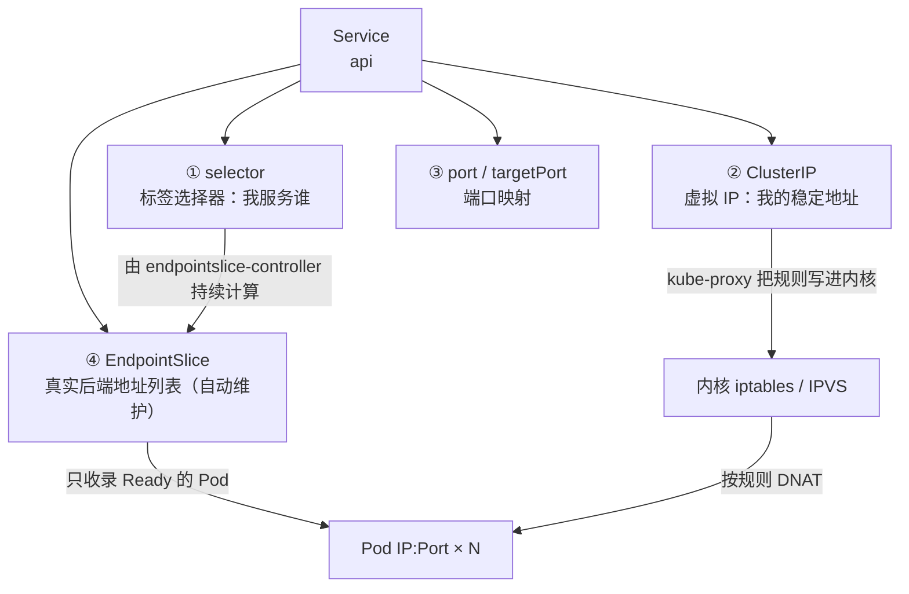
```mermaid
flowchart TB
    SVC["Service<br/>api"] --> A["① selector<br/>标签选择器：我服务谁"]
    SVC --> B["② ClusterIP<br/>虚拟 IP：我的稳定地址"]
    SVC --> C["③ port / targetPort<br/>端口映射"]
    SVC --> D["④ EndpointSlice<br/>真实后端地址列表（自动维护）"]
    A -->|"由 endpointslice-controller 持续计算"| D
    D -->|"只收录 Ready 的 Pod"| P["Pod IP:Port × N"]
    B -->|"kube-proxy 把规则写进内核"| K["内核 iptables / IPVS"]
    K -->|"按规则 DNAT"| P
```

四个部分逐个说清：

| 部分 | 谁写的 | 作用 |
|---|---|---|
| **`selector`** | **你写** | 决定"我服务哪些 Pod" |
| **`ClusterIP`** | **系统分配**（你也可以指定） | 稳定地址，从 service CIDR 里取 |
| **`ports`** | **你写** | 对外端口 → 容器端口的映射 |
| **`EndpointSlice`** | **控制器自动维护** | 真实的 `IP:Port` 列表 |

**注意第 4 项——你从来不手写它。**它是由 `endpointslice-controller`（第 3 章讲的那个控制器集合里的一员）持续计算出来的。这就是第 4 章"调和循环"的又一个实例。

---

### <a id="sec-06-6-3"></a>6.3 EndpointSlice：Service 背后那本"地址簿"

这是本章第一个必须建立的概念，**也是排查 Service 问题时的第一站**。

#### 它从哪来

`endpointslice-controller` 在持续做一件很简单的事：

```
每时每刻：
    找出所有符合 Service.selector 的 Pod
    过滤掉其中没有 Ready 的
    把剩下的 (PodIP, targetPort) 写进 EndpointSlice 对象
    如果和上次不一样，就更新它
```

**又是一个"读期望、读实际、对比、修正"的循环。**只不过这里的"期望"是你写的 selector，"实际"是集群里 Pod 的当前状态。

#### 怎么看

```bash
# 老命令（依然好用）
kubectl get endpoints api -n cloudnote -o wide

# 新命令（EndpointSlice 是更细粒度的设计）
kubectl get endpointslices -n cloudnote
kubectl get endpointslices -n cloudnote -o yaml
```

输出长这样：

```
NAME        ENDPOINTS                          AGE
api         10.244.1.7:80,10.244.2.9:80        3m
```

**这两个 `IP:Port`，就是此刻真实的、健康的、可以被转发的后端。**

#### 最重要的一条排查经验

**Service 连不通，第一个要看的就是 `kubectl get endpoints`。**

因为这里是"Service 世界"和"Pod 世界"的交界处。它能立刻告诉你是哪一侧出了问题：

| Endpoints 的状态 | 说明什么 | 该去查什么 |
|---|---|---|
| **`<none>` 或空** | Service 找不到任何后端 | `selector` 写错了？Pod 标签不对？Pod 全都没 Ready？ |
| 有地址，但数量不对 | 有 Pod 没被算进来 | 那些 Pod 的 `Ready` 状态是什么？ |
| 有地址，但连不上 | 问题在 Service 之后的网络 | NetworkPolicy？容器没监听？端口错了？ |

**一个超高频的错误配置**——`selector` 和 Pod 的标签差一个字符：

```yaml
# Deployment 里 pod 的标签是
labels:
  app: api

# Service 里却写成
spec:
  selector:
    app: api-service      # ← 差一个词，Endpoints 就是空的
```

**这种情况下 `kubectl get svc` 一切正常，`ClusterIP` 也分配了，就是连不上。**所有"Service 明明创建成功了却访问不通"的问题，十有八九在这里。

顺带一个冷知识：**`Endpoints` 这个老对象从 Kubernetes 1.33 起被标记为弃用**，官方推荐用 `EndpointSlice`。原因是 `Endpoints` 在服务规模大时单个对象过于庞大（一个 Service 有几千个 Pod 时，这个对象会有几十 MB），而 `EndpointSlice` 会把它切成多片（默认每片最多 100 个后端）。**排查时两个都可以看，但记住未来的方向是 EndpointSlice。**

---

### <a id="sec-06-6-4"></a>6.4 一个 Service 的 YAML 逐字段拆解

文件位置：`cases/cloudnote/22-api-service.yaml`

```yaml
apiVersion: v1
kind: Service
metadata:
  name: api
  namespace: cloudnote
spec:
  # ① 类型：默认就是 ClusterIP，只有集群内部能访问
  type: ClusterIP

  # ② 我服务谁 —— 靠标签找 Pod
  selector:
    app: api                 # ← 必须与 Pod 的标签一致

  # ③ 端口映射
  ports:
    - name: http             # 多个端口时必须有名字
      port: 8080             # Service 对外暴露的端口（集群内别人访问这个）
      targetPort: http       # 转发到容器的哪个端口（可以是数字，也可以是端口名）
      protocol: TCP

  # ④ 会话保持（默认关闭）
  sessionAffinity: None
```

#### 三个值得单独讲的点

**第一：`targetPort` 可以写名字，这是个解耦神器。**

```yaml
targetPort: http    # ← 引用 Deployment 里 containerPort 的 name: http
```

好处是：**当容器监听的端口变了（比如从 80 改成 8080），只要 `containerPort` 的 `name` 不变，Service 完全不用改。**这是移动端 App 版本号、数据库连接串的同类思想——**引用"逻辑名"，而不是"物理值"。**

**第二：`port` 和 `targetPort` 是两个不同的东西，不要混。**

```
客户端 → Service 的 port（8080）→ 内核 DNAT → Pod 的 targetPort（80）
              ↑                                  ↑
        集群内访问用这个                    容器真正监听的
```

在本案例里 `port: 8080` 而 `targetPort: http`（即 80）——**正好演示了端口映射**。将来你换成真实的 CloudNote 镜像（监听 8080），只需要把 `containerPort` 改成 8080，**`targetPort: http` 这个名字引用完全不用动。**

**第三：`selector` 里的字段不需要和 Deployment "对齐"，只需要和 Pod 的标签对齐。**

第 1 章讲过这一点，这里再强化一次：**Service 完全不知道 Deployment 的存在。**你可以把一个 Service 指向一批由 `kubectl run` 手搓的裸 Pod，只要标签对，它照样工作；反过来，一个 Deployment 的 Pod 也可以同时被三个不同的 Service 选中（比如一个给内部用、一个给外部用、一个用于监控采集）。

---

### <a id="sec-06-6-5"></a>6.5 ClusterIP 的真相：一个"谎言的集合"

现在进入本章最核心、也最反直觉的部分。

#### 先做个小实验（提前剧透结论）

```bash
kubectl apply -f cases/cloudnote/22-api-service.yaml
kubectl get svc api -n cloudnote
# NAME   TYPE        CLUSTER-IP     PORT(S)
# api    ClusterIP   10.96.14.7     8080/TCP
```

拿到这个 `10.96.14.7` 之后：

```bash
# 在一个 Pod 里执行：ping 它
kubectl run -it --rm probe --image=busybox:1.36 -n cloudnote --restart=Never -- \
  ping -c 2 -W 2 10.96.14.7
# → 100% packet loss（超时）

# 但 curl 它
kubectl run -it --rm probe --image=busybox:1.36 -n cloudnote --restart=Never -- \
  wget -qO- http://10.96.14.7:8080
# → 正常返回 nginx 页面！
```

**同一个 IP，`ping` 不通，`curl` 却通。**为什么？

#### 真相：这个 IP 压根不存在

```
$ ip addr | grep 10.96
（什么都没有）
```

**没有任何一张网卡拥有 `10.96.14.7` 这个地址。**你在任何节点、任何 Pod 里都找不到它。

那数据包是怎么到达 Pod 的？答案回到第 3 章第 3.1 节那条数据面链路：

```
应用发起 TCP 连接，目标 10.96.14.7:8080
        ↓
内核的 netfilter 收到这个包（在 nat 表 OUTPUT/PREROUTING 链上）
        ↓
命中一条 kube-proxy 早先写好的规则：
    匹配 "目标 10.96.14.7:8080"
    → DNAT 改写成 "10.244.1.7:80"（或 10.244.2.9:80）
        ↓
改头换面之后，这个包才真正有了一个存在的目的地
        ↓
按正常路由到达目标 Pod
```

**所以 ClusterIP 是一个"约定"，不是一台"主机"。**它的全部实现就是"内核里一条会改写目标地址的规则"。

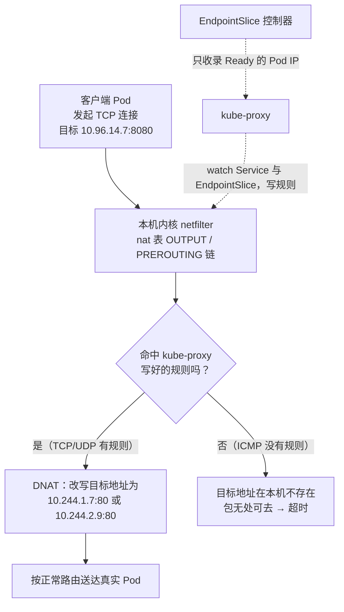
```mermaid
flowchart TB
    C["客户端 Pod<br/>发起 TCP 连接<br/>目标 10.96.14.7:8080"] --> K["本机内核 netfilter<br/>nat 表 OUTPUT / PREROUTING 链"]
    K --> R{"命中 kube-proxy<br/>写好的规则吗？"}
    R -->|"是（TCP/UDP 有规则）"| D["DNAT：改写目标地址为<br/>10.244.1.7:80 或 10.244.2.9:80"]
    D --> P["按正常路由送达真实 Pod"]
    R -->|"否（ICMP 没有规则）"| X["目标地址在本机不存在<br/>包无处可去 → 超时"]
    KP["kube-proxy"] -.->|"watch Service 与 EndpointSlice，写规则"| K
    EDS["EndpointSlice 控制器"] -.->|"只收录 Ready 的 Pod IP"| KP
```

**所以 ClusterIP 是一个"约定"，不是一台"主机"。**它的全部实现就是"内核里一条会改写目标地址的规则"。

#### 那为什么 ping 不通

关键区别在**协议**：

| 你发的包 | 内核里有没有对应的规则 | 结果 |
|---|---|---|
| **TCP / UDP** 发往 ClusterIP | **有**（kube-proxy 为每个 Service 的每个端口都写了规则） | 被 DNAT，正常到达 Pod |
| **ICMP（ping）** 发往 ClusterIP | **没有**（kube-proxy 不处理 ICMP） | 没有规则改写目标地址 → 这个地址在本机上不存在 → **超时** |

**这是理解 ClusterIP 最锋利的一刀：**

**ClusterIP 不是"地址"，而是"一组针对 TCP/UDP 的地址改写规则"。**

所以 `ping` 不通完全正常，**它不是故障**。想测 Service 通不通，**永远用 TCP 工具**：`curl`、`wget`、`nc -zv`，而不是 `ping`。

这个知识点能帮你避开一个超常见的误判：**"我 ping 不通 Service，肯定是网络坏了"——不，你只是用错了工具。**

---

### <a id="sec-06-6-6"></a>6.6 kube-proxy 到底写了什么规则

既然 ClusterIP 的实现是"内核规则"，那就直接去看那些规则长什么样。

#### 三种模式

| 模式 | 说明 | 现状 |
|---|---|---|
| **iptables** | 用 netfilter 的 nat 表做 DNAT，规则是**线性链表** | 经典模式，中小集群够用 |
| **IPVS** | 用内核的 LVS，**哈希表**查找 | 大规模集群推荐，性能更好 |
| userspace | 早期模式，kube-proxy 进程自己转发流量 | **已废弃** |

查你集群用的是哪个：

```bash
kubectl logs -n kube-system -l k8s-app=kube-proxy | grep -i "Using.*proxy"
# 或
kubectl get ds kube-proxy -n kube-system -o yaml | grep -A3 mode
```

#### iptables 模式的规则链长什么样

这是最有教育意义的部分。kube-proxy 会写这样一条链：

```bash
# 在有 kube-proxy 的节点上执行（kind 集群需要 docker exec 进节点）
iptables -t nat -L KUBE-SERVICES -n | head -20
```

你会看到类似这样的结构：

```
Chain KUBE-SERVICES (2 references)
target            prot opt source     destination
KUBE-SVC-XXXXXXXX tcp  --  0.0.0.0/0  10.96.14.7  /* cloudnote/api:http cluster IP */
KUBE-SVC-YYYYYYYY tcp  --  0.0.0.0/0  10.96.0.10  /* kube-system/kube-dns:dns */
...

Chain KUBE-SVC-XXXXXXXX (1 references)
target                     prot opt source     destination
KUBE-SEP-AAAAAAA  tcp  --  0.0.0.0/0  0.0.0.0/0  /* statistic mode random probability */ 0.5
KUBE-SEP-BBBBBBB  tcp  --  0.0.0.0/0  0.0.0.0/0                                       0.5

Chain KUBE-SEP-AAAAAAA (1 references)
target        prot opt source     destination
DNAT          tcp  --  0.0.0.0/0  0.0.0.0/0  to:10.244.1.7:80
```

**三层结构，一目了然**：

| 链 | 作用 | 命名规律 |
|---|---|---|
| `KUBE-SERVICES` | 总入口：按"目标 IP:端口"匹配是哪个 Service | — |
| `KUBE-SVC-<哈希>` | 一个 Service 一条：**在这一组后端之间做选择** | `SVC` = Service |
| `KUBE-SEP-<哈希>` | 一个后端一条：**执行 DNAT，改写成真实的 Pod IP:Port** | `SEP` = Service EndPoint |

#### 负载均衡是怎么做的：一个"概率游戏"

看 `KUBE-SVC-XXXX` 那两条规则：

```
KUBE-SEP-AAA  /* statistic mode random probability */ 0.5
KUBE-SEP-BBB                                            0.5
```

**这就是 iptables 模式的负载均衡实现：按概率随机。**

有 2 个后端，第一条规则的命中概率是 `1/2`，第二条是 `1/1`（因为走到第二条说明第一条没中）。有 3 个后端就是 `1/3`、`1/2`、`1/1`。

**注意它不是轮询（round-robin）。**它是**统计意义上的均匀**——连续发 1000 个请求，两个 Pod 大约各收到 500 个，但**顺序是随机的**。

| 模式 | 负载均衡算法 | 特点 |
|---|---|---|
| iptables | `statistic mode random probability`（随机概率） | 规则线性遍历，Service 多了会变慢 |
| IPVS | 默认 `rr`（轮询），还支持 `lc` / `wrr` / `sh` 等多种 | 哈希查找，O(1)，支持会话保持 |

**这就是为什么大规模集群推荐 IPVS**：假设你有 5000 个 Service，每个都有 10 条 iptables 规则，那就是 5 万条规则。每个包都要**从上往下遍历**一遍——这是 O(n) 的复杂度。而 IPVS 用哈希表，是 O(1)。

#### 再次强调那个反直觉的定位

第 3 章就说过，这里再钉一遍，因为它是理解数据面的关键：

> **kube-proxy 不是代理。它不转发任何流量。**
>
> 它的全部工作是：**watch Service 和 EndpointSlice 的变化，然后把规则写进内核。**写完就退场。真正转发数据的是 Linux 内核。

所以：

- **kube-proxy 挂了** → 已有规则仍然生效（流量照跑），只是**新的** Service 变更不会生效
- **流量路径上永远没有 kube-proxy 这个进程**

---

### <a id="sec-06-6-7"></a>6.7 四种 Service 类型：从集群内到公网

`type` 字段决定这个 Service 的"可达范围"。

#### ① ClusterIP（默认）：只在集群内可达

```yaml
spec:
  type: ClusterIP
```

分配一个虚拟 IP，**只有集群内的 Pod / 节点能访问**。适合内部服务（`api`、`redis`、`postgres`）。

**CloudNote 里 api、redis、postgres 之间的互相调用，全都用 ClusterIP。**

#### ② NodePort：在每个节点上开一个端口

```yaml
spec:
  type: NodePort
  ports:
    - port: 8080
      targetPort: http
      nodePort: 30080        # 可选；不写就在 30000-32767 里随机分配
```

效果：**集群里每一台节点的 `30080` 端口，都会转发到这个 Service。**

```bash
# 于是你可以从集群外这样访问
curl http://<任意一个节点的IP>:30080
```

| 优点 | 缺点 |
|---|---|
| 不需要云厂商，裸金属也能用 | 端口范围受限（30000–32767） |
| 实现简单 | **客户端要记住"节点 IP + 端口"** |
| 常用于本地开发和测试 | 节点宕机时，那个 IP 就不通了 |

**NodePort 通常不是最终方案**，而是"过渡形态"——因为没人愿意把 `http://1.2.3.4:30080` 给用户。实践中常见的是：NodePort + 前面的负载均衡器（云 LB、Nginx、HAProxy）。**第 7 章的 Ingress 就是干这个的。**

#### ③ LoadBalancer：让云厂商给你一个公网 IP

```yaml
spec:
  type: LoadBalancer
  ports:
    - port: 443
      targetPort: http
```

**注意它的实现方式**：`LoadBalancer` 类型的 Service **底层仍然是 NodePort + ClusterIP**，只是额外触发了云厂商的控制器（cloud-controller-manager）去创建一个外部负载均衡器，把流量打到各节点的 NodePort 上。

```
用户 → 云 LB（有公网 IP）→ 任意节点的 NodePort → Service → Pod
                              ↑
                    这一步仍然是 NodePort 在干活
```

**所以"LoadBalancer 类型的 Service 一直 Pending"是本地集群的经典现象**——因为没有云控制器来给你分配 IP。kind / minikube 上要么用 `MetalLB` 这类工具，要么用 `kubectl port-forward` 顶着。

#### ④ ExternalName：一个 DNS 别名

```yaml
spec:
  type: ExternalName
  externalName: db.prod.example.com    # 没有 selector，也没有 ClusterIP
```

它不代理任何流量，只是让集群内的 DNS 查询 `postgres.cloudnote.svc.cluster.local` 时，返回一个 **CNAME 记录**指向 `db.prod.example.com`。

**用途**：把"迁移到集群内"这件事变成一次 DNS 变更。比如你的应用连的是 `postgres`，将来把外部的数据库迁到集群里，**应用代码一行都不用改，只需把 ExternalName 换成真正的 Service**。

#### 四种类型对比表

| 类型 | 可达范围 | 有没有 ClusterIP | 典型场景 | 谁来实现 |
|---|---|---|---|---|
| **ClusterIP** | 仅集群内 | 有 | 内部服务互调 | kube-proxy |
| **NodePort** | 集群外（节点 IP + 高位端口） | 有 | 开发测试、裸金属 | kube-proxy |
| **LoadBalancer** | 公网 | 有 | 生产对外入口 | **云厂商** |
| **ExternalName** | —（只做 DNS 别名） | **无** | 平滑迁移、访问外部依赖 | CoreDNS |

---

### <a id="sec-06-6-8"></a>6.8 DNS：真正让服务发现变好用的那一层

有了 ClusterIP，你终于不用写 Pod IP 了。但写 `10.96.14.7` 也很难看、很难记——而且**跨环境时这个 IP 会变**（测试集群和生产集群分配的 ClusterIP 不同）。

所以 K8s 还给了你一层 DNS。

#### 谁在提供 DNS

```bash
kubectl get pods -n kube-system -l k8s-app=kube-dns
# coredns-xxxxxxxxx   1/1   Running

kubectl get svc -n kube-system kube-dns
# NAME       TYPE        CLUSTER-IP   PORT(S)
# kube-dns   ClusterIP   10.96.0.10   53/UDP,53/TCP,9153/TCP
```

**CoreDNS 就是一个跑在集群里的 DNS 服务器**，只不过它是个 Deployment（第 5 章的对象），用 ClusterIP 暴露自己，通过 kubelet 配置进每个 Pod 的 `/etc/resolv.conf`。

有趣的是：**CoreDNS 自己也是通过 Service 暴露的**——这是一个"用 Service 支撑 Service 发现"的自举结构。

#### 完整的 DNS 名字

每个 Service 都会自动获得一条 DNS 记录，格式是：

```
<service>.<namespace>.svc.cluster.local
```

以 CloudNote 为例：

| 你在哪 | 可以怎么写 | 实际解析成 |
|---|---|---|
| 同 namespace（cloudnote）的 Pod 里 | `api` | `api.cloudnote.svc.cluster.local` |
| 别的 namespace | `api.cloudnote` | 同上 |
| 任何地方，最完整写法 | `api.cloudnote.svc.cluster.local` | 同上 |

**为什么同 namespace 下写个 `api` 就能通？**这靠的是 Pod 里 `/etc/resolv.conf` 的 `search` 域：

```bash
kubectl exec -it <任意Pod> -n cloudnote -- cat /etc/resolv.conf
```

```
search cloudnote.svc.cluster.local svc.cluster.local cluster.local
nameserver 10.96.0.10
options ndots:5
```

`search` 那行是**按顺序尝试的域名后缀列表**。当你查 `api` 时，解析器会依次尝试：

```
api.cloudnote.svc.cluster.local   ← 命中！返回 ClusterIP
api.svc.cluster.local
api.cluster.local
api.                                ← 最后才当公网域名查
```

**`ndots:5` 是个值得知道的坑**：它表示"如果域名里的点少于 5 个，就先试 search 域"。所以查 `api.example.com` 时，解析器会**先尝试** `api.example.com.cloudnote.svc.cluster.local`（失败），再尝试真实地址——**多了一次无用的 DNS 查询，轻微增加延迟**。

如果你发现应用的 DNS 解析特别慢，可以在 Deployment 里给 Pod 加 `dnsConfig`，调小 `ndots`。

#### Headless Service：一个特殊但重要的变体

```yaml
spec:
  clusterIP: None        # ← 关键：显式不要 ClusterIP
  selector:
    app: postgres
```

**`clusterIP: None` 就是 headless Service。**它有两个关键差异：

| | 普通 Service | Headless Service |
|---|---|---|
| 有 ClusterIP 吗 | 有 | **没有** |
| DNS 返回什么 | **一个** ClusterIP（然后被负载均衡） | **所有** 就绪 Pod 的 IP 列表（A 记录） |
| 有负载均衡吗 | 有 | **没有**（客户端自己选） |

**什么时候需要它？**

| 场景 | 为什么必须 headless |
|---|---|
| **StatefulSet**（数据库、消息队列） | 客户端需要知道"哪个 IP 是一号节点"，比如 MySQL 主从、Kafka partition leader |
| 客户端自己做负载均衡 | 比如 gRPC 的长连接负载均衡，需要拿到全部后端自己选 |
| 需要稳定的 Pod 域名 | `pod-name.service-name.namespace.svc.cluster.local` 这种形式 |

**注意最后一行的地址格式**：有了 headless Service，**每个 Pod 都会获得自己的 DNS 名**：

```
postgres-0.postgres.cloudnote.svc.cluster.local
postgres-1.postgres.cloudnote.svc.cluster.local
```

**这是 StatefulSet 能提供"稳定网络身份"的基础。**第 13 章会详细讲。

顺带：headless Service 还有一个"半无头"用法——**不写 selector**，然后**手动创建 EndpointSlice** 指向集群外的地址。这是把外部数据库（比如 RDS）伪装成集群内 Service 的经典手法。

---

### <a id="sec-06-6-9"></a>6.9 动手：把 Service 的每一层都验一遍

配套脚本：

```bash
bash cases/cloudnote/tools/service-lab.sh
```

手动流程如下。

#### 第一步：创建 Service

```bash
kubectl apply -f cases/cloudnote/00-namespace.yaml
kubectl apply -f cases/cloudnote/20-api-deployment.yaml
kubectl apply -f cases/cloudnote/22-api-service.yaml

kubectl rollout status deployment/api -n cloudnote
kubectl get svc api -n cloudnote
```

记下 `CLUSTER-IP`，下文称它为 `$VIP`。

#### 第二步：看背后的地址簿

```bash
kubectl get endpoints api -n cloudnote
kubectl get endpointslices -n cloudnote -o wide
```

**应该有两个 `IP:80`**（因为 Deployment 有 2 个副本）。

#### 第三步：验证 DNS

```bash
kubectl run -it --rm probe --image=busybox:1.36 -n cloudnote --restart=Never -- sh
```

进去之后依次执行：

```sh
# ① 短名（同 namespace）—— 靠 search 域生效
nslookup api

# ② 全名
nslookup api.cloudnote.svc.cluster.local

# ③ 看解析器的配置
cat /etc/resolv.conf

# ④ 直接访问域名
wget -qO- http://api:8080 | head -3
```

**注意 `nslookup api` 返回的就是 `$VIP`——DNS 这一层只负责让你"找到 Service"，不负责"找到某个 Pod"。**

#### 第四步：验证"ping 不通但 curl 通"

```sh
# 失败：ICMP 没有 NAT 规则
ping -c 2 -W 2 api

# 成功：TCP 会被 DNAT
wget -qO- http://api:8080 | head -3
nc -zv api 8080
```

**这个对比请亲手做一遍**，它比任何文字都更能说明 ClusterIP 的本质。同时记住排查纪律：**永远别用 ping 测 Service。**

#### 第五步：观察负载均衡

```sh
# 连续请求 10 次，看返回内容是否有变化
for i in $(seq 1 10); do wget -qO- http://api:8080 | grep -o '<title>.*</title>'; done
```

想看更明显的效果，可以让每个 Pod 返回自己的主机名。因为默认 nginx 页面不包含 Pod 名，这里只能看"是否都成功"。**要观察分流细节，看第六步。**

#### 第六步：删一个 Pod，看地址簿自动更新

在**另一个终端**盯着 Endpoints：

```bash
kubectl get endpoints api -n cloudnote -w
```

再开一个终端删 Pod：

```bash
kubectl delete pod -n cloudnote -l app=api --wait=false
```

**你会看到**：

1. 被删的 Pod 的 IP **立刻从 Endpoints 里消失**
2. 新的 Pod 起来并 Ready 之后，新的 IP 被**自动加进去**

**全程你没有碰过 Service 对象。**这就是 `endpointslice-controller` 在工作，也就是第 4 章的调和循环。

#### 第七步：制造"所有 Pod 都不 Ready"，看 Endpoints 变空

这是最能说明"Service 只转发给健康副本"的实验。用探针故意失败：

```bash
# 把就绪探针指到一个不存在的路径
kubectl patch deployment api -n cloudnote --type=json -p='[
  {"op":"replace","path":"/spec/template/spec/containers/0/readinessProbe/httpGet/path","value":"/does-not-exist"}
]'
```

等 10~20 秒后：

```bash
kubectl get pods -n cloudnote -l app=api
# 注意 READY 列：1/1 变成了 0/1（Running 但未就绪）

kubectl get endpoints api -n cloudnote
# NAME   ENDPOINTS
# api    <none>          ← 地址簿空了！
```

**此时在 probe 容器里访问，会直接连接被拒绝**：

```sh
wget -qO- --timeout=3 http://api:8080 ; echo "exit=$?"
# 连接失败
```

**这个实验完整地展示了一条链**：

```
readinessProbe 失败 → Pod 变成 NotReady → EndpointSlice 把它移除
   → 内核规则更新 → 流量不再打向它
```

恢复：

```bash
kubectl patch deployment api -n cloudnote --type=json -p='[
  {"op":"replace","path":"/spec/template/spec/containers/0/readinessProbe/httpGet/path","value":"/"}
]'
```

**这就是第 5 章"就绪探针是滚动更新的刹车"的完整解释**：探针不只是控制发布节奏，它**直接决定了这个 Pod 会不会出现在 Service 的转发列表里**。

#### 第八步：看内核规则（有权限的话）

在 kind 集群里可以进节点看：

```bash
docker exec k8s-study-worker iptables -t nat -L KUBE-SERVICES -n | grep -A1 cloudnote
docker exec k8s-study-worker iptables -t nat -L -n | grep -E "KUBE-SVC|KUBE-SEP" | head -20
```

**你会亲眼看到那些 DNAT 规则。**这就是 ClusterIP 的"真身"——一堆存在于内核里的地址改写规则。

#### 第九步：试一下 NodePort

```bash
cat <<'EOF' | kubectl apply -f -
apiVersion: v1
kind: Service
metadata:
  name: api-nodeport
  namespace: cloudnote
spec:
  type: NodePort
  selector:
    app: api
  ports:
    - port: 8080
      targetPort: http
      nodePort: 30080
EOF

kubectl get svc api-nodeport -n cloudnote
# PORT(S) 那一列会显示 8080:30080/TCP
```

在 kind 里可以直接从宿主机访问（kind 把节点端口映射出来了）：

```bash
curl -s http://localhost:30080 | head -3
```

清理：

```bash
kubectl delete svc api-nodeport -n cloudnote
```

#### 第十步：Headless Service 的 DNS 长什么样

```bash
cat <<'EOF' | kubectl apply -f -
apiVersion: v1
kind: Service
metadata:
  name: api-headless
  namespace: cloudnote
spec:
  clusterIP: None
  selector:
    app: api
  ports:
    - port: 8080
      targetPort: http
EOF

kubectl get svc api-headless -n cloudnote
# CLUSTER-IP 那一列显示 None
```

进 probe 容器查它：

```sh
nslookup api-headless
# 返回的是两个真实的 Pod IP，而不是一个 ClusterIP！
```

**这就是"无头"的含义**：DNS 不再给你一个虚拟 IP，而是把所有后端 IP 交给你，让你自己决定怎么用。

清理：

```bash
kubectl delete svc api-headless -n cloudnote
kubectl delete svc api -n cloudnote
kubectl delete deployment api -n cloudnote
```

---

### <a id="sec-06-6-10"></a>6.10 几个必须知道的边界与坑

#### 坑一：Service 是四层的，不认 HTTP

Service 只认识 `IP:Port`，**它看不懂 HTTP 请求里的域名和路径**。

你**不能**这样写：

```yaml
# 做不到：根据路径转发
matchPath: /api       # ← Service 里根本没有这个字段
matchHost: note.example.com
```

**这是 Ingress 存在的原因**（第 7 章）：

| 层 | 对象 | 能看什么 | 能做什么 |
|---|---|---|---|
| **四层（L4）** | Service | IP、端口、协议 | 转发到后端，负载均衡 |
| **七层（L7）** | Ingress | 域名、路径、Header、Cookie | 按规则路由、TLS 终止、重写 |

##### 一个必须纠正的直觉：分界线不是"内部 vs 外部"

很多人会得出这样一个简化结论：

"Service 负责集群**内部**互通，Ingress 负责与**外部**互通。"

**这个说法方向对了一半，但分界线画错了**，而且会导致后面理解 Ingress 时处处别扭。两处需要纠正：

**纠正一：Service 本身就能对外。**

"能不能对外"不是 Service 的本质限制，而是 `type` 字段的一个取值：

| `type` | 作用域 |
|---|---|
| `ClusterIP` | 仅集群内部 |
| **`NodePort`** | **集群外可达**——每个节点开放一个高位端口 |
| **`LoadBalancer`** | **公网可达**——云厂商分配一个公网 IP |
| `ExternalName` | 只做 DNS 别名 |

上一节第 6.7 节讲的 `NodePort` / `LoadBalancer` 就是**专门用来对外的 Service**。所以"Service 只做内部"这句话不成立。

**纠正二：Ingress 不能绕过 Service。**

Ingress 的 `backend` 字段**必须指向一个 Service**，它没有办法直接指向 Pod。所以 Ingress 不是"另一条通向 Pod 的路"，而是**在 Service 前面再加一层**：

```
外部用户
    │
    ▼
Ingress（七层：域名 / 路径 / TLS 终止）   ← 可选，但生产上必备
    │  backend 必须指向一个 Service
    ▼
Service（四层：稳定虚拟 IP + 负载均衡）   ← 必须
    │
    ▼
Pod × N
```

**真正的分界线是「四层 vs 七层」，不是「内部 vs 外部」。**更准确的两句话是：

**Service 回答："我这一组 Pod，用什么地址被访问？"**——作用范围由 `type` 决定。

**Ingress 回答："来自外部的一个 HTTP 请求，应该按什么规则转给哪个 Service？"**——它天生面向外部，但**必须依赖 Service** 才能触达 Pod。

**一个能彻底说明问题的例子（也是新手最大的坑）**：

Ingress Controller（比如 Nginx Ingress Controller）**自己也是跑在集群里的 Pod**，而它要被外部访问到，**也得靠一个 `NodePort` 或 `LoadBalancer` 类型的 Service 暴露自己**。

```
外部流量 → ① LoadBalancer Service（暴露 Ingress Controller 自己）
              ↓
           ② Ingress Controller Pod（七层代理，真正做路由）
              ↓ 按 Ingress 规则转发
           ③ 业务 Service（ClusterIP）
              ↓
           ④ 业务 Pod
```

**所以"Ingress 负责对外"这个说法是循环的——它自己对外还得靠 Service。**这也顺便解释了那个最常见的困惑：

**只创建 `Ingress` 对象是没有任何效果的。**`Ingress` 只是一个"声明"，它需要有一个 **Ingress Controller** 去 watch 它、并生成实际的代理配置。**没装 Controller，`Ingress` 就是一纸空文**——这和第 4 章讲的"控制器模式"是同一套逻辑。

第 7 章会把这条链路完整走一遍。

#### 坑二：ClusterIP 只在集群内可达

`10.96.x.x` 这个网段**只在集群内部有意义**。你的笔记本、你的手机、公司内网——都访问不到它。

想在集群外访问，必须走 NodePort / LoadBalancer / Ingress。

#### 坑三：同一个 Service 里的多个 port 必须有名字

```yaml
ports:
  - name: http        # ← 有多个端口时，name 是必填的
    port: 80
  - name: metrics
    port: 9090
```

因为 Service 内部要靠名字区分这些端口（也因为这正是给 Pod 的 `containerPort` 起名的意义）。

#### 坑四：Service 的 `port` 在同一个 ClusterIP 上不能重复

同一个 Service 内部，两个 `port` 不能一样。但**不同的 Service 可以用相同的 port**——因为它们有不同的 ClusterIP。

```
Service A: 10.96.14.7:8080  
Service B: 10.96.20.3:8080     ← 不冲突，因为 IP 不同
```

#### 坑五：`sessionAffinity` 的取舍

默认 `None`——每个 TCP 连接独立选后端。改成 `ClientIP` 后，**同一个客户端 IP 的连接会被固定到同一个 Pod**。

```yaml
sessionAffinity: ClientIP
sessionAffinityConfig:
  clientIP:
    timeoutSeconds: 10800    # 默认 3 小时
```

**什么时候需要？**应用没有把会话状态外置（比如用了本地内存存 session）。

**但更好的做法是：把状态挪到 redis，让应用真正无状态，然后用默认的 `None`。**

##### 先把一个容易漏掉的前提说清楚：负载均衡是"每连接"的，不是"每包"的

这一点能消除一半的困惑。第 6 章开头讲过，DNAT 只发生在**连接建立的那一刻**：

```
TCP 三次握手时，内核查规则 → 选中 Pod A → DNAT → 建立连接
            │
            ▼
    这条连接的映射被记进 conntrack 表
            │
            ▼
    之后这条连接的所有数据包，直接按 conntrack 的记录走，
    不再查 KUBE-SVC 规则，也就不会再重新选后端
```

**所以准确的说法是**：

| 场景 | 会不会被分到不同 Pod |
|---|---|
| 同一个 TCP 连接里的多个请求（HTTP keep-alive、gRPC、WebSocket） | **不会**，永远走同一个 Pod |
| 用户刷新页面 / 每次新建 TCP 连接 | **会**，每次重新随机选 |

**这带来一个重要推论**：如果你的应用是 **WebSocket 或 gRPC 长连接**，那**业务上根本不需要粘性**——一条连接建好之后就固定在那个 Pod 上了。真正会"丢会话"的，是那种**每个请求都新建连接**的短连接场景（普通 HTTP 轮询、表单提交）。

##### 如果你想在这个基础上再做粘性，K8s 给了什么

```yaml
sessionAffinity: ClientIP
sessionAffinityConfig:
  clientIP:
    timeoutSeconds: 10800    # 默认 3 小时
```

它的**实现方式依模式而不同**：

| 模式 | 实现 | 说明 |
|---|---|---|
| iptables | 用内核的 `recent` 模块记录"这个源 IP 上次去了哪个后端"，然后在 `KUBE-SVC-*` 链里**优先匹配**这条记录 | 本质是"查一下历史，命中就走老路" |
| IPVS | 把调度算法从默认的 `rr`（轮询）换成 **`sh`（source hashing，源地址哈希）** | 同一个源 IP 哈希到同一个后端，更干净 |

想亲眼看到它，可以给 Service 加上 `sessionAffinity: ClientIP` 之后再看规则：

```bash
kubectl patch svc api -n cloudnote -p '{"spec":{"sessionAffinity":"ClientIP"}}'
# 在节点上对比加之前和加之后的规则差异
iptables -t nat -S | grep -E "recent|KUBE-SVC"
```

##### 但 `ClientIP` 有四个坑，第一个是致命的

| # | 局限 | 后果 |
|---|---|---|
| **1** | **NAT 出口下会塌陷** | 公司 / 学校 / 运营商出口的几百个用户共用**一个公网 IP**，全部被判定为"同一个客户端" → **请求全压到一个 Pod 上，负载均衡彻底失效**，而且那个 Pod 极易被打挂 |
| **2** | **只认 IP，不认用户** | 同一个办公室里的张三和李四被当成一个人；同一个人从家里切到 4G，源 IP 变了，会话又丢了 |
| **3** | **Pod 重建 / 缩容时会话丢失** | 那个"粘"住的 Pod 一旦被换掉（滚动更新、故障重建），旧会话就找不回来了 |
| **4** | **超时窗口是拍脑袋的** | 3 小时太短会在长会话场景丢，太长会让流量长时间偏斜到少数 Pod |

**坑 1 的严重程度值得单独强调**：这是一个"平时看不出问题、一到上班高峰就出事"的配置。测试时你自己一个人访问，觉得很正常；上线后整个公司的流量全砸到一个 Pod 上。

##### 三层解法，按优先级排序

| 优先级 | 做法 | 说明 |
|---|---|---|
| **首选** | **把会话状态外置** | session 存 redis / 数据库；或者干脆用**无状态令牌（JWT）**——客户端持有签名令牌，服务端不存任何会话。**这样 Pod 才是真正无状态的，才能随便扩缩容、随便滚动更新** |
| **次选** | **用七层（L7）的 Cookie 粘性** | 让 Ingress Controller / 七层代理按 **Cookie** 而不是源 IP 做粘性。**Cookie 是每个浏览器独立携带的，完全不受 NAT 影响**，也不受"换网络"影响 |
| **最后手段** | `sessionAffinity: ClientIP` | 只有在前两条都做不到、且你确认**不存在 NAT 集中出口**的场景下才用 |

**L4 IP 粘性 vs L7 Cookie 粘性，本质区别在这**：

```
L4 源 IP 粘性：看"你从哪来"（网络层属性，会被 NAT 抹平）
L7 Cookie 粘性：看"你是谁"（应用层属性，可以随用户走）
```

**判据很简单**：如果你的服务是"给不确定的网络环境下的真人用户"用的，**永远选 L7**。第 7 章的 Ingress Controller（Traefik、Contour、Envoy Gateway 等）都支持基于 Cookie 的粘性配置。

顺带提醒：曾经最流行的 `ingress-nginx` **已于 2026 年 3 月退役**（不再有安全补丁），选型时不要再新装它。第 7 章会详细讲这件事的来龙去脉。

##### 那 StatefulSet 那种"必须连特定节点"的需求怎么解

这是另一类问题——不是"会话粘性"，而是"**我需要精确地连到某一个特定实例**"（比如 MySQL 主库、Kafka partition leader）。

**这种情况不要用 `sessionAffinity`，应该用 [headless Service](#headless-service一个特殊但重要的变体)**：让 DNS 把**所有** Pod 的地址都返回给客户端，由**客户端自己**决定连哪个。

因为粘性的前提是"无所谓连哪个，只要别来回换"；而 StatefulSet 场景的前提是"**我就是要连那一个**"。两者的需求方向正好相反。

#### 坑六：`externalTrafficPolicy`（只有 NodePort / LoadBalancer 才有）

| 值 | 行为 | 代价 |
|---|---|---|
| `Cluster`（默认） | 外部流量可以转发到**任意节点**上的 Pod | 多一次跨节点跳转，**客户端源 IP 会丢失** |
| `Local` | 只转发到**本节点**上的 Pod | 保留客户端源 IP，但**该节点没有 Pod 时连接会被丢弃** |

**什么时候必须用 `Local`？**当你需要真实客户端 IP 的时候（风控、限流、访问日志审计）。

**用了 `Local` 要注意**：必须保证每个节点上都有 Pod（通常配合 DaemonSet 或把副本数设得足够多 + 反亲和性），否则流量打到"没有副本的节点"上会直接失败。

---

### <a id="sec-06-6-11"></a>6.11 本章要点

1. **Service 解决的是"Pod IP 不可靠"这个根本问题**：给一组短暂的、会变的、可能不健康的 Pod，一个持久的、单一的、只含健康副本的访问入口。
2. **ClusterIP 不是一个真实地址，而是一组内核里的 TCP/UDP 地址改写规则。**所以它 `ping` 不通却 `curl` 得通——**排查 Service 永远用 TCP 工具，不要用 ping**。
3. **kube-proxy 是规则写入器，不是代理**。iptables 模式下用 `KUBE-SERVICES → KUBE-SVC-* → KUBE-SEP-*` 三层链做"随机概率"负载均衡；IPVS 模式改用哈希表，性能更好。
4. **`Endpoints` / `EndpointSlice` 是排查 Service 问题的第一站**——它直接告诉你"Service 到底找到后端了没有"，十有八九的问题都在 `selector` 和 Pod 的 `Ready` 状态上。

#### 本章全景图

```
   客户端（另一个 Pod）
        │  ① 查 DNS：api → 10.96.14.7      ┌─────────────────────┐
        ├─────────────────────────────────►│ CoreDNS             │
        │                                  │ api.cloudnote.svc…  │
        │  ② 拿到 ClusterIP                 └─────────────────────┘
        ▼
   连接 10.96.14.7:8080
        │
        ▼
   内核 iptables / IPVS  ──── DNAT ────►  10.244.1.7:80  （Pod A）
        ▲                                  10.244.2.9:80  （Pod B）
        │                                        ▲
        │ 规则是谁写的？                          │ 名单是谁给的？
   kube-proxy                          EndpointSlice 控制器
        ▲                                        ▲
        │ watch                                  │ 过滤出 Ready 的 Pod
        └──────────── kube-apiserver ────────────┘
                            ▲
                            │ 你的 selector: app=api
                        Service 对象
```

### <a id="sec-06-6-12"></a>6.12 练习题

1. 为什么不能直接把 Pod IP 写进前端配置？说出三个理由。
2. Service 由哪四部分构成？其中哪一部分是**你从来不手写**的？
3. `selector` 写错一个字符会有什么现象？`kubectl get svc` 会报错吗？
4. Service 连不通，第一个该查什么命令？Endpoints 为 `<none>` 意味着什么？
5. `port` 和 `targetPort` 分别是谁对谁？为什么 `targetPort` 推荐写端口名？
6. 为什么 `ping` ClusterIP 不通，`curl` 却通？这说明了 ClusterIP 的本质是什么？
7. iptables 模式下，`KUBE-SERVICES` / `KUBE-SVC-*` / `KUBE-SEP-*` 三层各负责什么？
8. iptables 模式的负载均衡是轮询吗？为什么大规模集群推荐 IPVS？
9. `LoadBalancer` 类型的底层实现是什么？为什么在本地 kind 集群里它一直 `Pending`？
10. 同 namespace 下为什么写个 `api` 就能解析？`ndots:5` 有什么副作用？
11. Headless Service 的 DNS 返回什么？什么场景必须用它？
12. 一个 Pod `Running` 但 `NotReady` 时，它还在 Service 的转发列表里吗？为什么？（第 6.9 节、第 5 章）
13. 为什么不能用 Service 按 HTTP 路径做路由？那该用什么？
14. 默认的随机负载均衡下，同一个用户的两次请求会到同一个 Pod 吗？"同一个 TCP 连接里的多个请求"呢？
15. `sessionAffinity: ClientIP` 在什么场景下会**彻底失效甚至变成故障**？为什么说 L7 的 Cookie 粘性比它好？
16. 需要"精确连到某一个特定 Pod"（比如 MySQL 主库）时，该用什么？为什么不能用粘性来解决？
17. "Service 负责内部、Ingress 负责外部"这个说法错在哪？请说出两处纠正。
18. Ingress Controller 自己是怎么被外部访问到的？"只创建 Ingress 对象"为什么没有效果？（第 6.10 节、第 4 章控制器模式）


---

## <a id="ch-07-ingress"></a>第 7 章　让世界访问你：Ingress 与南北向流量

第 6 章末尾给出了这条链路：

```
外部用户 → Ingress（七层）→ Service（四层）→ Pod
```

本章把 Ingress 这一层讲透：路由规则怎么写、TLS 证书怎么自动签发、控制器之间的注解为什么不通用。

但在进入配置细节之前，有一件正在发生、且直接影响技术选型的事必须先说明。

---

### <a id="sec-07-7-1"></a>7.1 先讲一个刚发生的行业事件

#### 2026 年 3 月，Ingress NGINX 退役了

如果你搜索"Kubernetes Ingress 教程"，十篇里有九篇会让你装 **ingress-nginx**。它是这个领域事实上的标准，据 Datadog 的调研，**大约 50% 的云原生环境在用它**。

**它已经在 2026 年 3 月正式退役。**

| 时间 | 事件 |
|---|---|
| 2025-11-11 | SIG Network 发布退役公告：进入"尽力而为的维护模式" |
| 2026-01 | Steering Committee 与 Security Response Committee 联合发声明，要求用户立即规划迁移 |
| **2026-03** | **维护正式停止。不再有任何版本发布、bug 修复、安全补丁。GitHub 仓库转为只读** |

退役后的具体后果：

- **已部署的实例不会立刻坏掉**，现有制品（Helm chart、镜像）仍然可用
- 但**没有安全补丁了**——之后发现的 CVE 永远不会被修
- 官方原话很重："**在 Ingress NGINX 退役后继续使用，将使你和你的用户面临攻击风险。**"

**为什么会走到这一步？**官方给出的原因非常值得一读：

这个项目一直只有**一到两个人在业余时间维护**。它当年的"灵活性"（比如允许通过 snippets 注解注入任意 NGINX 配置）如今变成了无法解决的技术债务——那些"方便的功能"后来被认定为严重的安全缺陷。**昨天的灵活性成了今天的负担。**

#### 但有一个重要的澄清，很多人搞错了

退役的消息传开后，一个常见的误解是：

"Ingress 要淘汰了，以后不能用 Ingress 了。"

**这是错的。**准确的说法是：

| 对象 | 状态 |
|---|---|
| **Ingress API**（`networking.k8s.io/v1`） | **仍然受支持、被广泛使用**，只是**功能冻结**（不再加新特性） |
| **ingress-nginx**（社区维护的那个控制器） | **2026 年 3 月退役** |
| 其他 Ingress Controller（Traefik、Contour、云厂商的……） | **多数仍在积极维护** |

**所以你有两条路**：

1. **平移**：继续用 Ingress API，只换一个仍在维护的控制器（YAML 基本不动，但 `nginx.ingress.kubernetes.io/*` 那类注解会失效）
2. **演进**：迁移到 **Gateway API**——Ingress 的官方后继者

这一章会先讲清楚 Ingress 本身（因为它是理解 Gateway API 的必经之路，而且存量系统里到处都是），再讲 Gateway API 解决了什么、怎么选。

**现在就可以查一下你的集群有没有中招**：
```bash
kubectl get pods -A --selector app.kubernetes.io/name=ingress-nginx
```
有输出的话，你就在那受影响的"50%"里，该开始规划迁移了。

---

### <a id="sec-07-7-2"></a>7.2 Ingress 与 Ingress Controller：声明与实现

这是本章最核心的一对概念，也是新手最普遍的困惑点。

#### 一句话区分

> **`Ingress` 是一张"路由表"（声明），`Ingress Controller` 是"路由器"（实现）。**

| | Ingress | Ingress Controller |
|---|---|---|
| 是什么 | 一个 **API 对象**（YAML） | 一套**运行中的程序** |
| 谁写 | **你** | 安装控制器时由它自己创建 |
| 存在哪 | etcd 里的一条记录 | 集群里的 Deployment + Service + RBAC |
| 会做什么 | **什么都不做** | watch Ingress 对象，生成实际代理配置 |
| 类比 | 写在纸上的交通规则 | 实际在路口指挥的交警 |
| 查它 | `kubectl get ingress` | `kubectl get pods -n <controller-ns>` |

#### 关键结论：没有 Controller，Ingress 就是一纸空文

```bash
# 没装控制器时
kubectl apply -f 40-ingress.yaml
kubectl get ingress -n cloudnote
# NAME   CLASS   HOSTS                ADDRESS   PORTS
# api    <none>  note.example.com              80      ← ADDRESS 是空的
```

**对象创建成功了，但没有任何东西在监听它、实现它。**流量不会因为你在 etcd 里写了一段 YAML 就自动流起来。

这正是第 4 章"控制器模式"的又一次体现：**声明只是数据，必须有控制器去调谐它。**Ingress 是最典型的"对象+控制器"配对——只不过这个控制器不由 K8s 自带，而是**需要你自己部署**。

#### 集群里怎么看控制器

```bash
# ① 有哪些控制器类（IngressClass）
kubectl get ingressclass
# NAME      CONTROLLER             PARAMETERS   AGE
# traefik   traefik.io/ingress-controller          5m

# ② 控制器本身跑在哪
kubectl get pods -A | grep -iE "ingress|traefik|envoy|contour|nginx"

# ③ 看它的 Service（还记得第 6 章那个自举结构吗）
kubectl get svc -A | grep -iE "ingress|traefik|envoy|contour"
```

第 3 条命令会给你一个漂亮的印证：**Ingress Controller 自己就是靠一个 `LoadBalancer` 或 `NodePort` 类型的 Service 暴露给外部的**——所以第 6 章那句"说 Ingress 负责对外是循环的"在这里有了实物证据。

#### 控制器生态与维护状态（2026 年 9 月）

| 控制器 | 类型 | 支持 Gateway API | 维护状态 |
|---|---|---|---|
| **ingress-nginx** | Nginx | 否 | **已于 2026-03 退役** |
| **Traefik** | 自研（Go） | **是** | 活跃 |
| **Contour** | Envoy | **是** | 活跃 |
| **Envoy Gateway** | Envoy | **是**（Gateway API 原生） | 活跃，CNCF |
| **Istio Gateway** | Envoy | **是** | 活跃（适合已用 Istio 的场景） |
| **Cilium Ingress** | eBPF | 部分 | 活跃（已在用 Cilium CNI 时顺带可用） |
| 云厂商（ALB / CLB / AGIC…） | 各家 | 部分 | 跟着云平台走 |

**选型建议（2026 年）**：

- **新项目**：直接上 **Gateway API** + Envoy Gateway / Traefik / Contour
- **存量用 ingress-nginx**：优先考虑**直接迁 Gateway API**（而不是先平移到另一个 Ingress 控制器再迁一次）
- **时间特别紧、只想先止血**：平移到 Traefik 或 Contour，但仍要规划后续迁移
- **已经在用 Istio / Cilium**：用它们自带的入口能力，少引入一个组件

---

### <a id="sec-07-7-3"></a>7.3 先分清两个词：南北向与东西向

在讲流量之前，先把这两个术语钉死——读云原生文档时会高频出现。

```mermaid
flowchart TB
    USER["外部用户 / 公网"] -->|"南北向流量<br/>North-South"| EDGE["集群边缘<br/>Ingress / Gateway"]
    EDGE --> SVC1["Service A"]
    EDGE --> SVC2["Service B"]
    SVC1 <-->|"东西向流量<br/>East-West"| SVC2
    SVC1 --> PA["Pod A"]
    SVC2 --> PB["Pod B"]
```

| 术语 | 方向 | 典型对象 | 回答的问题 |
|---|---|---|---|
| **南北向（North-South）** | 进出集群 | **Ingress / Gateway**、LoadBalancer Service | "外部怎么访问进来？" |
| **东西向（East-West）** | 集群内部之间 | **Service**、NetworkPolicy、Service Mesh | "内部服务之间怎么互相调用？" |

**名字的来历**：习惯上把拓扑图画成"外部在上、内部在下"，进出集群的流量就是"上下走"（北↔南）；而集群内部服务之间的流量是"左右走"（东↔西）。

**但要小心别把它当成硬边界**——第 6 章已经讲过：

- Service 的 `type` 可以是 `NodePort` / `LoadBalancer`，**它自己也能跑南北向**
- Ingress 也可以被集群内部的服务访问（内部客户端走一条内部路径打到 Ingress）

**这两个词描述的是"典型的流量方向"，不是"对象的职责边界"。**真正的职责划分还是那句话：**Service 看 IP:端口（L4），Ingress 看 HTTP 内容（L7）。**

---

### <a id="sec-07-7-4"></a>7.4 一个 Ingress 的 YAML 逐字段拆解

现在看 CloudNote 的真实需求：

| 用户访问 | 应该去哪 |
|---|---|
| `https://note.example.com/` | `web`（前端静态资源） |
| `https://note.example.com/api/...` | `api`（后端接口） |

文件位置：`cases/cloudnote/40-ingress.yaml`

```yaml
apiVersion: networking.k8s.io/v1
kind: Ingress
metadata:
  name: cloudnote
  namespace: cloudnote
  annotations:
    #  这里是最容易出问题的地方：不同控制器用的注解完全不同
    # 下面这行是 Traefik 的写法；换成 Nginx 就是 nginx.ingress.kubernetes.io/...
    # 这正是 Ingress 可移植性差的根源（第 7.7 节详讲）
    traefik.ingress.kubernetes.io/router.entrypoints: web
spec:
  # ① 用哪个控制器来实现我
  #    不写的话，依赖集群里被标记为「默认」的那个 IngressClass
  # ingressClassName: traefik

  # ② TLS 配置（可选）
  tls:
    - hosts:
        - note.example.com
      secretName: cloudnote-tls     # 指向一个 kubernetes.io/tls 类型的 Secret

  # ③ 路由规则
  rules:
    - host: note.example.com        # 按域名匹配
      http:
        paths:
          # 规则 A：/api 开头 → api 服务
          - path: /api
            pathType: Prefix
            backend:
              service:
                name: api
                port:
                  name: http        # 也可以用 number: 8080

          # 规则 B：其余一切 → web 服务
          - path: /
            pathType: Prefix
            backend:
              service:
                name: web
                port:
                  number: 80
```

#### 三个字段值得单独讲

**① `spec.rules[].host` 与 `spec.tls[].hosts` 必须一致。**规则里写了 `note.example.com`，TLS 那里也要写，否则证书不会对这条规则生效。

**② `backend.service.port` 可以用名字或数字。**用名字（`name: http`）的好处和第 6 章讲的一样——**解耦**。代价是名字必须能在目标 Service 的 `ports[].name` 里找到，拼错了会 404 而不是报错。

**③ 规则是有顺序意识的，但不要依赖书写顺序。**大多数控制器按**最长前缀优先**来匹配，而不是按 YAML 里的先后顺序。所以 `/api` 一定会赢过 `/`，不管你把谁写在前面。（但这是个"实现行为"，不是 API 规范强制的，换个控制器可能有细微差异——**所以不要设计出依赖模糊顺序的规则集**。）

---

### <a id="sec-07-7-5"></a>7.5 `pathType` 的门道：一个真实的坑

`pathType` 是 Ingress API 里少数几个**必须理解**的字段，因为它的默认行为和你的直觉可能不一样。

#### 三种取值

| 值 | 匹配方式 | 例子 |
|---|---|---|
| **`Exact`** | **完全相等**（且大小写敏感） | `path: /api` 只匹配 `/api`，**不匹配** `/api/` 或 `/api/v1` |
| **`Prefix`** | **按"路径元素"逐段匹配** | `path: /api` 匹配 `/api`、`/api/`、`/api/v1`、`/api/v1/users` |
| **`ImplementationSpecific`** | 交给控制器自己决定 | 不推荐用 |

#### 关键细节：`Prefix` 是"按路径元素"，不是"按字符串前缀"

这是最容易搞错的一点。看这个对比：

```
path: /api     pathType: Prefix

匹配 /api          
匹配 /api/v1       
匹配 /api/v1/users 
匹配 /api/         
匹配 /apifoo       ✗  ← 注意这里！
```

**`/apifoo` 不会被匹配到**，因为 `Prefix` 的分割依据是 **`/` 分隔的路径段**，不是字符：

```
/api      →  ["api"]
/apifoo   →  ["apifoo"]        ← 和 "api" 不是同一个元素，不匹配
/api/v1   →  ["api", "v1"]     ← 第一段就是 "api"，匹配
```

**这个设计是刻意的**：如果按字符前缀匹配，`/api` 的规则就会意外吃掉 `/apifoo` 的请求——这是一种很难排查的路由污染。按元素匹配就没这个问题。

#### 一个必须遵守的纪律：永远显式写 `pathType`

老版本的 Ingress 允许不写 `pathType`，但：

- **`networking.k8s.io/v1` 里 `pathType` 是必填字段**（不写会被 API Server 拒绝）
- 在某些控制器里，缺失时会被当成"你随便实现"的模糊语义，导致行为不一致

**所以：每一条 path 都写清楚 `pathType`。**选不准就用 `Prefix`，它是最符合"我要匹配这个目录下所有东西"直觉的那个。

#### 顺带说 `path: /` 的特殊性

```yaml
- path: /
  pathType: Prefix
```

**这一条会匹配所有请求**（因为空路径段是任何路径的前缀）。所以它通常作为**兜底规则**放在最后。

也正因为如此，一个常见的配置事故是：**兜底规则的 backend 指向的服务根本不存在**，于是一半流量打到 502，而你还在纳闷"为什么访问首页是好的，点某个按钮就报错"。

---

### <a id="sec-07-7-6"></a>7.6 TLS 在哪里终止：一次把证书问题讲清

#### 证书存在哪：Secret

K8s 里有一个专门的 Secret 类型 `kubernetes.io/tls`，它**必须包含两个 key**：

```yaml
apiVersion: v1
kind: Secret
metadata:
  name: cloudnote-tls
  namespace: cloudnote
type: kubernetes.io/tls
data:
  tls.crt: <base64 编码的证书链>
  tls.key: <base64 编码的私钥>
```

用命令从文件直接创建（它会自动帮你 base64 编码）：

```bash
kubectl create secret tls cloudnote-tls -n cloudnote \
  --cert=note.example.com.crt \
  --key=note.example.com.key
```

#### 终止点在哪：Ingress Controller

```mermaid
flowchart LR
    U["用户浏览器<br/>https://note.example.com"] -->|"① 加密的 HTTPS"| IC["Ingress Controller<br/>用 Secret 里的证书解密<br/>← TLS 在这里终止"]
    IC -->|"② 集群内部：明文 HTTP"| S["Service"]
    S --> P["Pod<br/>只处理 HTTP，完全不知道有 HTTPS"]
```

**拆开看每一段的协议状态**：

| 区段 | 协议 | 谁持有证书 |
|---|---|---|
| 用户 → Ingress Controller | **HTTPS（加密）** | Controller（证书来自 Secret） |
| Ingress Controller → Service → Pod | **默认是明文 HTTP** | **没有证书** |

**这就是"TLS 终止（TLS Termination）"的含义**：加密连接在入口处"终止"，解密后的请求在集群内部以明文转发。

#### 为什么要把证书放在入口，而不是每个 Pod

| 方案 | 后果 |
|---|---|
| **每个 Pod 装证书** | 证书要在每个容器里挂载、每个应用的代码都要写 HTTPS 监听、轮转时要重启全部 Pod、私钥散落在几十个地方 |
| **集中在 Ingress Controller（推荐）** | 证书只有一份、轮转只改一个 Secret、应用代码里只有 HTTP、**运维复杂度下降一个数量级** |

**"应用侧只写 HTTP，加密在边缘做掉"是现代架构的通用做法。**

**那集群内部要不要也加密？**这取决于你的威胁模型：
- 单租户、网络可信（比如云上 VPC 内）→ 内部明文很常见，够用
- 多租户、有合规要求、跨可用区传输敏感数据 → 用 **Service Mesh（Istio / Linkerd）做 mTLS**，由 sidecar 自动加密，应用代码依然不用改

有些控制器也支持"重新加密到后端"（re-encrypt）：Ingress → 后端的这一段也用 HTTPS。这时后端 Service 需要能接受 HTTPS，配置会复杂一些。

#### 证书轮转：别手动续期

Let's Encrypt 的证书只有 90 天有效期，手动续期是运维事故的常见来源。标准做法是 **cert-manager**：

```yaml
# 给 Ingress 加一行注解，cert-manager 就会自动申请证书、写进 Secret、到期前自动续
metadata:
  annotations:
    cert-manager.io/cluster-issuer: letsencrypt-prod
```

它的工作流程是：

```
cert-manager 看到 Ingress 上有这个注解
    → 向 Let's Encrypt 发起 ACME 挑战（通常是 HTTP-01）
    → 验证域名归你所有
    → 拿到证书，写进你指定的 Secret
    → 到期前 30 天自动续期，Secret 更新后 Controller 自动重载
```

**注意它是一个"控制器"——又是第 4 章的调和循环**：它持续 watch 证书对象，发现"期望有效期内、实际快过期了"就去续期。**声明式的思路可以套在任何地方。**

---

### <a id="sec-07-7-7"></a>7.7 Ingress 的天花板：为什么它会被冻结

现在回答导读里的第四个问题。理解了 Ingress 的**结构性缺陷**，你就能同时理解两件看似无关的事：

1. 为什么**最流行的控制器会无人维护到退役**
2. 为什么**官方要另起炉灶做 Gateway API**

#### 缺陷一：功能太弱，只能说"谁去哪"

Ingress 能表达的规则几乎是"最小公约数"：

| 你想做的 | Ingress 能表达吗 |
|---|---|
| 按域名分流 | **能**（`host`） |
| 按路径分流 | **能**（`paths`） |
| TLS 终止 | **能**（`tls`） |
| **按请求头分流** | **不能** |
| **按 HTTP 方法分流**（GET / POST 分开） | **不能** |
| **按权重分流**（灰度 10% 流量到 v2） | **不能**（只能靠注解硬凑） |
| **按查询参数分流** | **不能** |
| **对内部/外部流量分别配置** | **不能** |

**而"灰度发布"是生产的刚需。**Ingress API 表达不了，于是所有人都去用各家控制器的**私有注解**。

#### 缺陷二：靠 annotation 扩展 → 彻底失去可移植性

这是最致命的问题。因为在标准 API 里表达不了，所有控制器都用注解（annotation）来扩展：

```yaml
metadata:
  annotations:
    # Nginx 的写法
    nginx.ingress.kubernetes.io/rewrite-target: /
    nginx.ingress.kubernetes.io/proxy-body-size: "10m"
    nginx.ingress.kubernetes.io/canary: "true"
    nginx.ingress.kubernetes.io/canary-weight: "10"

    # Traefik 的写法（完全不一样）
    traefik.ingress.kubernetes.io/router.middlewares: default-stripprefix@kubernetescrd

    # Contour 的写法（又不一样）
    projectcontour.io/websocket-routes: "/"
```

**结果**：一份 Ingress YAML 在 Nginx 上能跑，换到 Traefik 上**注解全部失效**，功能静默丢失。

> **注解失效最危险的地方在于"它不报错"。**你把 Ingress 从 Nginx 迁到 Traefik，`kubectl apply` 成功、路由看起来正常，但"限流""灰度权重""请求体大小限制"这些注解全部被忽略——**直到出事故你才发现策略没了。**

#### 缺陷三：多租户隔离很弱

Ingress 是**命名空间级别**的对象，但它引用的域名、TLS 证书是**集群级别**的资源。所以在共享集群里，A 团队的 Ingress 可以声明 `host: b-team.example.com`，把 B 团队的域名抢走——**没有任何机制阻止它**。

#### 缺陷四：不支持四层

Ingress **只管 HTTP/HTTPS**。要让 TCP/UDP 流量（数据库端口、MQTT 等）进来，得靠控制器私有的 ConfigMap 或 CRD——**又是一次不可移植**。

#### 于是，官方的选择是"冻结并重做"

Ingress API 进入 **feature freeze**（不再加新特性），官方把精力投向 **Gateway API**。

**现在回头看那个退役事件**：Ingress NGINX 为什么只剩一两个人在维护？因为它的"灵活性"（那些 snippets 注解能注入任意 Nginx 指令）既是它流行的原因，也是它最大的技术债来源——**那些"方便的能力"后来被认定为严重的安全缺陷**（可以注入任意配置 = 可以绕过所有安全边界）。

**一个 API 设计得不够表达，就会逼所有人去用私有扩展；私有扩展越强，安全和可维护性就越差。**这就是 Ingress 这一代设计的宿命，也是 Gateway API 要解决的根本问题。

---

### <a id="sec-07-7-8"></a>7.8 Gateway API：角色分离与更强表达力

#### 三个对象，对应三种角色

Gateway API 最重要的设计思想是**按角色拆分对象**：

```mermaid
flowchart TB
    GC["GatewayClass<br/>由「基础设施提供方」定义<br/>比如：Envoy / Traefik / 云厂商的负载均衡实现"] --> GW["Gateway<br/>由「集群运维」管理<br/>比如：我自己这个集群的路口在哪、开哪些端口、用谁的证书"]
    GW --> R1["HTTPRoute<br/>由「应用开发者」管理<br/>比如：/api 走哪个 Service"]
    GW --> R2["HTTPRoute（另一个团队）<br/>互不干扰"]
    R1 --> S1["Service A"]
    R2 --> S2["Service B"]
```

| 对象 | 谁管 | 类比 |
|---|---|---|
| **GatewayClass** | 基础设施提供方（云厂商 / 平台团队） | "用的是哪个牌子的大门" |
| **Gateway** | 集群运维 | "这个大门开在哪、开几个口、挂什么证书" |
| **HTTPRoute / GRPCRoute / TLSRoute / TCPRoute…** | **应用开发者** | "哪个路径进哪个门" |

**这个拆分直接解决了 Ingress 的三个老问题**：

| Ingress 的问题 | Gateway API 怎么解 |
|---|---|
| 应用开发者要动集群级资源（域名、证书） | 应用只写 `HTTPRoute`（命名空间级），`Gateway` 由运维控制，**应用想抢别人的域名抢不到** |
| 灰度/头匹配表达不了 | **原生支持** `weight`（权重）、`headers`、`method`、`queryParams` |
| 扩展靠不可移植的注解 | 在 CRD 里表达，**各家实现遵循同一套规范** |

#### 对比：同一个"金丝雀发布"需求

**Ingress 的写法（靠私有注解，换控制器就失效）**：

```yaml
metadata:
  annotations:
    nginx.ingress.kubernetes.io/canary: "true"
    nginx.ingress.kubernetes.io/canary-weight: "10"
```

**Gateway API 的写法（标准字段，换实现也能用）**：

```yaml
apiVersion: gateway.networking.k8s.io/v1
kind: HTTPRoute
metadata:
  name: api-canary
spec:
  parentRefs:
    - name: cloudnote-gateway
  rules:
    - backendRefs:
        - name: api            # 稳定版
          port: 8080
          weight: 90
        - name: api-canary     # 灰度版
          port: 8080
          weight: 10
```

**`weight` 是规范里的字段，不是某个控制器的私有发明。**这就是根本差别。

#### 现状与选型建议（2026 年 9 月）

| 维度 | 现状 |
|---|---|
| Gateway API 成熟度 | `HTTPRoute` / `Gateway` / `GatewayClass` 已经是 **v1（GA）**；gRPC / TLS / TCP / UDP 路由陆续跟进 |
| 实现可用性 | Envoy Gateway、Traefik、Contour、Istio、Cilium、各云厂商都有实现 |
| 迁移工具 | 官方提供 **`ingress2gateway`**，能把现有 Ingress 转成 HTTPRoute 骨架 |
| 主要阻力 | 概念更多（三个对象 vs 一个）、团队要重新学、部分实现的功能覆盖仍有差异 |

**三条实用建议**：

1. **新项目直接上 Gateway API**，不要再新装 Ingress Controller（尤其别新装已退役的 ingress-nginx）
2. **存量 ingress-nginx**：抓紧迁移。如果工程量允许，**直接迁 Gateway API**，别先平移到另一个 Ingress 控制器再迁第二次
3. **迁移工具**：用 `ingress2gateway` 生成骨架，但**注解必须手工逐条翻译**（工具不会帮你猜各家注解的语义）

**一个特别容易忽略的迁移清单项**：迁移前先把自己集群里所有 `nginx.ingress.kubernetes.io/*` 注解**列出来**，逐条确认它在目标实现里对应什么。因为注解失效是**静默**的——路由还能通，但策略（限流、超时、请求体大小、灰度）悄无声息地没了。

```bash
kubectl get ingress -A -o json \
  | jq -r '.items[].metadata.annotations | keys[]' \
  | grep -E "^nginx\.ingress" | sort | uniq -c | sort -rn
```

---

### <a id="sec-07-7-9"></a>7.9 动手：搭一个七层入口

配套脚本：

```bash
bash cases/cloudnote/tools/ingress-lab.sh
```

#### 第一步：先确认集群里有没有控制器

```bash
kubectl get ingressclass
kubectl get pods -A | grep -iE "traefik|contour|envoy|ingress-nginx"
```

**如果什么都没有，先装一个。**脚本会引导你，手动装的话，2026 年的推荐是 **Traefik**（一个 Helm 命令搞定）：

```bash
helm repo add traefik https://traefik.github.io/charts
helm repo update
helm install traefik traefik/traefik \
  --namespace traefik --create-namespace \
  --set ingressClass.enabled=true \
  --set ingressClass.isDefaultClass=true \
  --set providers.kubernetesIngress.enabled=true \
  --set providers.kubernetesGateway.enabled=true
```

**注意**：`--set ingressClass.isDefaultClass=true` 让 Traefik 成为默认控制器，这样 Ingress YAML 里不写 `ingressClassName` 也能工作（方便学习）。生产上建议**显式写类名**，避免依赖"默认"这种隐式约定。

#### 第二步：部署两个应用（web 和 api）

路径分流需要两个 Service 才看得出效果：

```bash
kubectl apply -f cases/cloudnote/00-namespace.yaml
kubectl apply -f cases/cloudnote/20-api-deployment.yaml
kubectl apply -f cases/cloudnote/22-api-service.yaml
kubectl apply -f cases/cloudnote/30-web.yaml

kubectl get pods,svc -n cloudnote
```

#### 第三步：创建 Ingress

```bash
kubectl apply -f cases/cloudnote/40-ingress.yaml
kubectl get ingress -n cloudnote
```

**重点看 `ADDRESS` 那一列**：

- 有地址 → 控制器已经接手，入口可用
- **空的 `<none>`** → 控制器没装、或没匹配上（类名不对 / 没有默认类）

```bash
# 详细看它被解析成了什么
kubectl describe ingress cloudnote -n cloudnote
```

`Events` 里通常会写明"Ingress 已被某某控制器接管"。

#### 第四步：测试路径分流

因为本地 kind 集群不一定把 80 端口映射出来，**最通用的测试方式是用 port-forward**：

```bash
# 把控制器的 Service 转发到本地 8080
kubectl port-forward -n traefik svc/traefik 8080:80
# （如果装在别的命名空间/名字，先 kubectl get svc -A | grep -i traefik 找到它）
```

**另开一个终端**，用 `Host` 头模拟真实域名访问：

```bash
# 访问根路径 → 应该到 web
curl -s -H "Host: note.example.com" http://localhost:8080/ | head -5

# 访问 /api → 应该到 api
curl -s -H "Host: note.example.com" http://localhost:8080/api | head -5

# 用错域名 → 应该 404（说明 host 规则生效了）
curl -s -o /dev/null -w "%{http_code}\n" -H "Host: wrong.example.com" http://localhost:8080/
```

**怎么确认真的分流到了不同的 Pod？**看两个应用的日志：

```bash
# web 和 api 用的都是 nginx，日志能区分
kubectl logs -n cloudnote -l app=web --tail=5
kubectl logs -n cloudnote -l app=api --tail=5
```

**只有 api 的日志里出现了 `/api` 的请求记录，web 的日志里出现的是 `/`** —— 分流成功。

#### 第五步：验证 `Prefix` 的匹配边界

```bash
# 这些都应该到 api（第一段是 api）
curl -s -o /dev/null -w "/api      → %{http_code}\n" -H "Host: note.example.com" http://localhost:8080/api
curl -s -o /dev/null -w "/api/v1   → %{http_code}\n" -H "Host: note.example.com" http://localhost:8080/api/v1
curl -s -o /dev/null -w "/api/     → %{http_code}\n" -H "Host: note.example.com" http://localhost:8080/api/

# 这个应该到 web（不是 api！）
curl -s -o /dev/null -w "/apifoo   → %{http_code}\n" -H "Host: note.example.com" http://localhost:8080/apifoo
```

**最后一条最能说明 `Prefix` 的语义**：`/apifoo` 不会被 `/api` 的规则吃掉。去对比两边日志确认。

#### 第六步：配上 TLS

```bash
# ① 生成一张自签证书（学习中用；生产用 cert-manager 自动申请）
openssl req -x509 -nodes -days 365 -newkey rsa:2048 \
  -keyout /tmp/tls.key -out /tmp/tls.crt \
  -subj "/CN=note.example.com" \
  -addext "subjectAltName=DNS:note.example.com"

# ② 存成 TLS 类型的 Secret
kubectl create secret tls cloudnote-tls -n cloudnote \
  --key=/tmp/tls.key --cert=/tmp/tls.crt

kubectl get secret cloudnote-tls -n cloudnote
# TYPE 那一列应该是 kubernetes.io/tls
```

**重新 apply Ingress**（`40-ingress.yaml` 里 `tls` 那段已经写好了）：

```bash
kubectl apply -f cases/cloudnote/40-ingress.yaml
kubectl describe ingress cloudnote -n cloudnote | grep -A3 TLS
```

再用 443 测试（用 `-k` 跳过自签证书校验）：

```bash
kubectl port-forward -n traefik svc/traefik 8443:443
# 另一个终端
curl -sk --resolve note.example.com:8443:127.0.0.1 \
  https://note.example.com:8443/api | head -3

# 看看证书是谁签的
curl -skv --resolve note.example.com:8443:127.0.0.1 \
  https://note.example.com:8443/api 2>&1 | grep -E "subject|issuer"
```

**看到了吗**：应用 Pod 里没有任何证书，`web` 和 `api` 都只是普通的 HTTP nginx，**但外部访问已经是 HTTPS**。这就是 TLS 终止的价值。

清理：脚本会自动删除 web/api 相关资源；证书 Secret 也一并清理。

---

### <a id="sec-07-7-10"></a>7.10 本章要点

1. **`Ingress` 是声明（路由表），`Ingress Controller` 是实现（路由器）。**只创建 Ingress 对象没有任何效果——必须有控制器去 watch 它并生成代理配置。这是"控制器模式"的又一实例。
2. **真正的分界线是 L4 vs L7**（第 6 章已建立）：Service 看 IP:端口，Ingress 看域名/路径/Header，但 **Ingress 必须经由 Service 才能到达 Pod**。
3. **TLS 在 Ingress Controller 处终止**，证书存在 `kubernetes.io/tls` 类型的 Secret 里。**应用侧只写 HTTP**，运维复杂度和证书轮转风险都下降一个数量级。
4. **Ingress 的下一代是 Gateway API**，而 **2026 年 3 月 ingress-nginx 的退役**是"API 表达能力不足 → 逼所有人用私有扩展 → 技术债与安全问题累积"这条链的必然结局。

#### 本章全景图

```
   用户 https://note.example.com/api/notes
        │
        ▼
┌──────────────────────────────────────────────────────┐
│  Ingress Controller（自己是 Deployment + Service）    │
│  ┌────────────────────────────────────────────────┐  │
│  │ ① TLS 终止：用 Secret 里的证书解密              │  │
│  │ ② 读 HTTP 请求，按 Ingress 规则匹配             │  │
│  │    host=note.example.com + path=/api → api     │  │
│  └────────────────────────────────────────────────┘  │
└──────────────────────────┬───────────────────────────┘
                           │ 集群内部：明文 HTTP
                           ▼
                    Service: api（L4 负载均衡）
                           │
                           ▼
                    Pod × N（只处理 HTTP）
```

### <a id="sec-07-7-11"></a>7.11 练习题

1. `Ingress` 和 `Ingress Controller` 分别是什么？为什么只创建 Ingress 对象没有效果？
2. 怎么快速检查你的集群是否在用已退役的 ingress-nginx？
3. ingress-nginx 退役**不**代表 Ingress API 被淘汰，为什么？两者状态分别是什么？
4. 南北向和东西向流量分别指什么？为什么说这不是"对象的职责边界"？
5. `path: /api` + `pathType: Prefix` 会匹配 `/apifoo` 吗？为什么？
6. `Exact` 和 `Prefix` 的区别是什么？`path: /` 配 `Prefix` 会匹配什么？
7. TLS 在哪里终止？终止之后集群内部是明文还是加密？想内部也加密该用什么？
8. `kubernetes.io/tls` 类型的 Secret 必须包含哪两个 key？证书轮转该用什么工具？
9. 为什么说"每个 Pod 装证书"是坏做法？列出至少两个理由。
10. Ingress API 表达不了哪三类常见需求？由此导致了什么问题？
11. 为什么注解失效比"配置报错"更危险？
12. Gateway API 的三个角色和三个对象分别是什么？它怎么解决 Ingress 的多租户问题？
13. 用 Gateway API 表达"10% 流量给灰度版本"，和用 Ingress 注解表达，本质差别在哪？


---

# <a id="part-3"></a>第三篇　配置、存储与调度

---

## <a id="ch-08-configmap-secret"></a>第 8 章　配置与密钥：ConfigMap 与 Secret

配置与镜像的耦合，是容器化过程中最先暴露、也最容易被凑合过去的问题。

第 5 章那份 Deployment 里，`image` 写死没有问题——镜像本就该是确定的。但紧接着的这几行不同：

```yaml
env:
  - name: DB_HOST
    value: postgres.cloudnote.svc.cluster.local   # 写死？测试环境地址不一样怎么办
  - name: DB_PASSWORD
    value: SuperSecret123                          # 写死？这个 YAML 要提交进 Git 的
  - name: LOG_LEVEL
    value: debug                                   # 生产要临时改成 info，难道重新发一版镜像？
```

**三个代价，一个比一个贵：**

| 代价 | 具体表现 |
|---|---|
| **构建成本** | 改一个日志级别，要重跑一遍 CI、构建镜像、推送、再滚动更新 |
| **镜像失去意义** | 镜像本该是**不可变**的（第 1 章讲过），但一旦塞进环境相关配置，同一份镜像在测试和生产行为不同——**"在我机器上是好的"又回来了** |
| **凭据泄漏** | 密码进了 Git 历史。**从这一刻起，你必须假设它已经泄露了**——删掉文件也没用，它在历史提交里 |

本章的核心原则只有一句：

> **镜像应该只描述"程序是什么"，配置描述"程序在这个环境里怎么跑"。两者必须分离。**

ConfigMap 与 Secret 正是为此存在。本章会说明两者在结构层几乎完全相同、差异全部落在策略层，并把注入方式（环境变量、卷挂载、`subPath`）各自的更新语义讲清楚——其中 `subPath` 的行为是配置类故障最常见的来源。

---

### <a id="sec-08-8-1"></a>8.1 ConfigMap：把配置从镜像里抠出来

#### 是什么

一个**命名空间级别**的键值对集合。就这么简单。

```yaml
apiVersion: v1
kind: ConfigMap
metadata:
  name: api-config
  namespace: cloudnote
data:
  # ① 简单的键值对
  log.level: "info"
  server.port: "8080"
  db.host: postgres.cloudnote.svc.cluster.local
  db.port: "5432"

  # ② 也可以放整个文件的内容（key 是文件名，value 是文件内容）
  nginx.conf: |
    server {
        listen 8080;
        location / { return 200 "ok\n"; }
    }
```

#### 三种创建方式

```bash
# 方式一：字面量
kubectl create configmap app-config -n cloudnote \
  --from-literal=log.level=info \
  --from-literal=server.port=8080

# 方式二：从文件（key = 文件名）
kubectl create configmap app-config -n cloudnote --from-file=./app.conf

# 方式三：从整个目录（每个文件变成一个 key）
kubectl create configmap app-config -n cloudnote --from-file=./config-dir/

# 看看生成了什么
kubectl get configmap app-config -n cloudnote -o yaml
```

**"从目录创建"这一条很实用**：它把"一个目录里的配置文件"整体变成 ConfigMap。这也是第 2 章那个 init 容器渲染配置的另一种做法。

#### 一个容易忽略的点：它不只给 Pod 用

ConfigMap 是**通用的配置对象**。除了 Pod，这些地方也会用它：

- Ingress Controller 的全局配置
- CoreDNS 的 Corefile
- 各种 Operator 的配置

```bash
# 举个例子：集群 DNS 的配置就是一个 ConfigMap
kubectl get configmap coredns -n kube-system -o yaml
```

---

### <a id="sec-08-8-2"></a>8.2 Secret 与 ConfigMap 的本质区别（纠正最大误解）

这是本章最重要的一块。**网上大多数说法都是错的。**

#### 先说错误说法

"ConfigMap 存不敏感的配置，Secret 存加密的敏感信息。"

**后半句是错的。** Secret **默认不做任何加密**，它只是把值做了 **base64 编码**：

```bash
kubectl create secret generic db-secret -n cloudnote \
  --from-literal=password=SuperSecret123

# 看它的内容
kubectl get secret db-secret -n cloudnote -o yaml
# data:
#   password: U3VwZXJTZWNyZXQxMjM=

# 一行命令就解出来了
echo U3VwZXJTZWNyZXQxMjM= | base64 -d
# SuperSecret123
```

**base64 不是加密，是编码。**它的目的只是让二进制安全地在文本协议里传输。**任何人拿到这串字符都能解出原文。**

#### 那它到底"保护"了什么

Secret 相比 ConfigMap 的**真实差异**只有这些：

| 维度 | ConfigMap | Secret |
|---|---|---|
| **用途语义** | 非敏感配置 | **声明"这东西敏感"** |
| **`kubectl describe` 输出** | 直接显示内容 | **只显示字节数**，不显示值 |
| **RBAC 可单独授权** | 通常一起给 | **可以做到"能读 ConfigMap 但不能读 Secret"** |
| **etcd 静态加密** | 默认不加密 | **可以启用 `EncryptionConfiguration` 加密落盘** |
| **节点上的存储** | 普通文件 | **kubelet 写在 tmpfs（内存）里，不落磁盘** |
| **专用类型** | 无 | `kubernetes.io/tls`、`dockerconfigjson`、`basic-auth` 等 |

**所以准确的说法是**：

> **Secret 不是"加密的配置"，而是"被系统标记为敏感、并会获得额外保护措施"的配置容器。**
>
> 这些额外保护**默认大多没开**（etcd 静态加密要手动配），所以 **Secret 默认并不安全**。

#### `kubectl describe` 的差异（动手验证一下）

```bash
kubectl describe configmap app-config -n cloudnote   # 直接看到所有值
kubectl describe secret db-secret -n cloudnote       # 只看到字节数
```

**这个差异会造成一种虚假的安全感**——"看不到内容，应该安全的"。但 `-o yaml` 一敲，`base64 -d` 一解，密码就在眼前。

#### 真正让密码安全的四层做法

| 层次 | 手段 | 解决什么 |
|---|---|---|
| **① 不进 Git** | 用 **Sealed Secrets** / **SOPS** / **External Secrets Operator** 把密文或引用提交进仓库 | 源码仓库里的凭据泄漏 |
| **② 落盘加密** | 给 etcd 配 `EncryptionConfiguration` | 磁盘被拿走 / etcd 备份泄漏 |
| **③ 最小权限** | RBAC 只给需要的人 `get secret` 权限（第 15 章） | 内部越权读取 |
| **④ 外部密钥管理** | 用 Vault / 云 KMS + **Secrets Store CSI Driver** | 凭据生命周期、轮转、审计 |

**一个可立即执行的纪律**：

> **任何 Secret 的 YAML 都不要提交进 Git。**提交进 Git 就等于公开——即使仓库是私有的，历史记录、fork、CI 日志都可能泄漏。
>
> 如果你在 Git 历史里提交过密码，**改密码是第一优先级**，清理历史是第二优先级。因为从提交那一刻起，你就必须假设它已经泄露了。

---

#### 更准确的一句话：它们是"同一个东西的两种身份"

到这里可以给一个比"一个存配置、一个存密码"精确得多的结论：

**ConfigMap 和 Secret 在结构层几乎完全一样，差异全部在"策略层"。**

**它们是同一个数据结构，被分成两个对象，用来承载不同敏感级别的数据。**

**结构层（完全一样）**：

| 维度 | 两者 |
|---|---|
| 作用域 | 命名空间级 |
| 数据类型 | `map[string]string` |
| 大小上限 | 1 MiB |
| 注入方式 | `env` / `envFrom` / `volume` 三种，写法对称 |
| 挂载行为 | 目录挂载自动更新、`subPath` 不更新——**机制完全一致** |
| 其他特性 | 都支持 `immutable`、都支持 `optional` |

**策略层（真正的差异）**：

| 维度 | ConfigMap | Secret |
|---|---|---|
| 值的表示 | `data` 明文 + `binaryData`（base64） | `data` base64 + `stringData`（只写） |
| `kubectl describe` | 显示内容 | 只显示字节数 |
| RBAC | 通常与配置一起授权 | **可以单独授权** |
| etcd 静态加密 | 不参与 | **可被单独加密** |
| 节点上的存放 | 普通文件 | kubelet 放在 **tmpfs（内存）** |

##### 那为什么不做成一个对象、加个 `sensitive: true` 字段？

这是个很好的设计问题，答案能让你理解 K8s 的取舍逻辑：

| 理由 | 说明 |
|---|---|
| **权限控制需要"对象级"边界** | RBAC 是按"资源类型 + 对象"授权的。**合成一个对象，就永远做不到"能读配置、但不能读密码"** |
| **加密策略需要"对象级"边界** | `EncryptionConfiguration` 是按资源类型（`secrets` / `configmaps`）配置的，无法按字段粒度加密 |
| **配套机制需要一个"类型"抓手** | `imagePullSecrets`、`kubernetes.io/tls`、ServiceAccount Token 这些都是 Secret 专属——如果只有一种对象，就无从区分 |

**结论**：K8s 用"两个对象"换来了**权限与加密的粒度**。这是一个典型的"多一个对象、换一层控制能力"的取舍。

##### 实用判据：怎么归类

问自己一个问题：

**这个值如果泄漏出去，会造成损失吗？**

会 → **Secret**；不会 → **ConfigMap**

**两个方向都要小心**：

| 错误方向 | 后果 |
|---|---|
| 该用 Secret 却放进了 ConfigMap | **永久丢失**"能单独授权"和"能单独加密"这两个能力（除非重建对象） |
| 过度把什么都塞进 Secret | 权限粒度变粗——为了读一个日志级别，得给你整个 Secret 的读权限 |

**判断标准是"是否敏感"，不是"是否重要"。**一个非常重要的、但公开也不会造成损失的值（比如功能开关、路由表），应该放 ConfigMap——放 Secret 反而会让权限管理变糟。

### <a id="sec-08-8-3"></a>8.3 Secret 的几种类型

`type` 字段决定了这个 Secret 的用途和**必须包含哪些 key**。

| 类型 | 用途 | 必须包含的 key |
|---|---|---|
| **`Opaque`**（默认） | 任意键值对 | 无 |
| **`kubernetes.io/tls`** | 第 7 章的 HTTPS 证书 | `tls.crt`、`tls.key` |
| **`kubernetes.io/dockerconfigjson`** | **拉私有镜像的凭据** | `.dockerconfigjson` |
| `kubernetes.io/basic-auth` | 基础认证 | `username`、`password` |
| `kubernetes.io/ssh-auth` | SSH 密钥 | `ssh-privatekey` |
| `kubernetes.io/service-account-token` | ServiceAccount 令牌 | 由系统管理 |

#### 顺带讲清一个高频实际问题：私有镜像仓库怎么拉

```yaml
apiVersion: v1
kind: Secret
metadata:
  name: regcred
  namespace: cloudnote
type: kubernetes.io/dockerconfigjson
data:
  .dockerconfigjson: <base64 编码的 docker config json>
```

**用命令生成最省事**（它会自动处理编码）：

```bash
kubectl create secret docker-registry regcred -n cloudnote \
  --docker-server=registry.example.com \
  --docker-username=ci-user \
  --docker-password='<password>'
```

然后在 Pod 里引用：

```yaml
spec:
  imagePullSecrets:
    - name: regcred
  containers:
    - name: api
      image: registry.example.com/cloudnote/api:1.2.3   # 现在是私有镜像了
```

**这条命令能解决一类很典型的故障**：Pod 一直 `ImagePullBackOff`，`describe` 里写着 `401 Unauthorized`——那就是缺了 `imagePullSecrets`。

#### `data` 和 `stringData` 的区别

| 字段 | 值的形式 | 说明 |
|---|---|---|
| `data` | **base64 编码** | 读取时的实际存储形式 |
| `stringData` | **明文** | **只写字段**：写入时 API Server 自动转成 base64 存进 `data`，读出来只会看到 `data` |

```yaml
apiVersion: v1
kind: Secret
metadata:
  name: db-secret
  namespace: cloudnote
type: Opaque
stringData:              # 写明文更方便，API Server 自动编码
  DB_PASSWORD: SuperSecret123
```

**`stringData` 方便，但要小心**：你写的明文会出现在 `kubectl apply` 的命令历史、CI 日志、以及编辑器缓存里。

---

### <a id="sec-08-8-4"></a>8.4 注入到 Pod 的两种方式

配置有了，怎么送进容器？两条路。

```mermaid
flowchart TB
    CM["ConfigMap<br/>api-config"] --> ENV["① 环境变量<br/>env / envFrom"]
    SEC["Secret<br/>db-secret"] --> ENV
    CM --> VOL["② 卷挂载<br/>volume + volumeMount"]
    SEC --> VOL
    ENV --> P["容器进程启动"]
    VOL --> P
    ENV --> N1["改动不会生效<br/>环境变量属于进程启动参数"]
    VOL --> N2{"挂载方式"}
    N2 -->|"目录挂载"| N3["约 1 分钟自动更新文件"]
    N2 -->|"subPath 单文件"| N4["永不更新"]
```

#### 方式一：环境变量

```yaml
spec:
  containers:
    - name: api
      image: nginx:1.27-alpine
      env:
        # 逐个引用
        - name: DB_HOST
          valueFrom:
            configMapKeyRef:
              name: api-config
              key: db.host
        - name: DB_PASSWORD
          valueFrom:
            secretKeyRef:
              name: api-secret
              key: DB_PASSWORD
      envFrom:
        # 或者把整个 ConfigMap 的所有 key 变成环境变量
        - configMapRef:
            name: api-config
          prefix: APP_        # 加前缀避免命名冲突（推荐！）
```

**优点**：写法简单，符合 12-Factor App 的习惯，几乎所有语言都原生支持读环境变量。

**缺点（这是关键）**：**Pod 启动后就固定了。**

环境变量是在**容器创建时**注入进程的。改 ConfigMap **不会**改变已经在运行的容器里的环境变量——因为环境变量属于进程的启动参数，进程不重启就改不了。

#### 方式二：卷挂载

```yaml
spec:
  containers:
    - name: api
      image: nginx:1.27-alpine
      volumeMounts:
        - name: config-vol
          mountPath: /etc/app          # 挂载到目录
          readOnly: true
        - name: secret-vol
          mountPath: /etc/app/secrets  # Secret 也一样
          readOnly: true
  volumes:
    - name: config-vol
      configMap:
        name: api-config
    - name: secret-vol
      secret:
        secretName: api-secret
        defaultMode: 0400              # Secret 建议收紧权限
```

**每个 key 会变成一个文件**：

```
/etc/app/
├── log.level      （内容：info）
├── server.port    （内容：8080）
├── db.host        （内容：postgres...）
└── nginx.conf     （内容：那个多行配置）
```

**优点**：**改 ConfigMap 后，挂载的文件会在约 1 分钟内自动更新**（kubelet 定期从 API Server 同步，然后**原子替换**软链接）。

**代价**：应用得自己**监听文件变化**才会重新加载。很多程序启动时读一次配置就再也不看了——**这时候"文件更新了"和"配置生效了"是两件事。**

#### 对比表（这一张表值得记住）

| 维度 | 环境变量 | 卷挂载 |
|---|---|---|
| 注入时机 | 容器创建时 | 挂载时 + **持续同步** |
| 改动 ConfigMap 后 | **不更新** | **约 1 分钟内自动更新文件** |
| 应用是否需要配合 | 不需要（但必须重启 Pod） | **需要**（要自己监听文件变化） |
| 支持多行内容 | 不支持（换行很麻烦） | **支持**（整份配置文件都能放） |
| 出问题时可见性 | `kubectl exec env` 一看就明白 | 要进容器看文件 |
| 典型用途 | 少量标量（日志级别、连接地址） | 配置文件（nginx.conf、application.yml） |

**实践建议**：

- **能用环境变量就用环境变量**（简单、跨语言、可观测性好）
- **需要放整份配置文件时用卷挂载**
- **两者混用时想清楚"改了要不要重启"**

---

### <a id="sec-08-8-5"></a>8.5 最大的坑：改了 ConfigMap，Pod 不会重启

这是导读点名的那个经典陷阱。绝大多数"配置改了没生效"都源于它。

#### 为什么会这样

回想第 4 章讲的调和循环。Deployment 控制器关注的是什么？

**`spec.template` 有没有变。**

你改的是 **ConfigMap 对象**，不是 Deployment 的 `spec.template`。**从 Deployment 的视角看，什么都没发生**——期望副本数还是 2，Pod 模板的哈希还是原来那个，旧 RS 不用动，新 RS 不用建。

```
你改了 ConfigMap
      ↓
kubelet 发现挂载的卷变了 → 更新文件（约 1 分钟）
      ↓
但如果应用启动时只读了一次配置 → 它还在用旧值
      ↓
而且 Pod 完全没重启 → 环境变量那一路根本没变
```

**所以"改配置不生效"其实有四种可能的组合**，你要能分清：

| 注入方式 | 文件/环境变量会变吗 | 应用会自动重载吗 |
|---|---|---|
| **环境变量** | **不会**（进程启动后固定） | 不适用 |
| **卷挂载（目录）** | **会**（约 1 分钟） | **看应用**：多数不会 |
| **卷挂载（subPath）** | **不会**（见第 8.6 节） | 不适用 |
| **`envFrom`** | 不会 | 不适用 |

#### 四种根治方案

| 方案 | 做法 | 适用 |
|---|---|---|
| **① 手动触发滚动重启** | `kubectl rollout restart deployment/api` | 最简单，适合低频变更 |
| **② 把版本号写进名字** | ConfigMap 叫 `api-config-v3`，Deployment 引用它；改配置就建 `-v4` 并改引用 | **最稳**，配合 `immutable: true` |
| **③ 用 checksum 注解** | 模板引擎（Helm）把 ConfigMap 内容的哈希写进 Pod 模板的 annotation | **Helm 项目的标准做法**，改配置自动触发滚动更新 |
| **④ 装一个 Reloader** | 部署 `stakater/Reloader`，它 watch ConfigMap/Secret 并自动触发引用了它们的 Deployment 重启 | 环境里对象很多时省心 |

**方案 ③ 的原理值得单独理解**，因为它把"配置变更"翻译成了 Deployment 能感知的"模板变更"：

```yaml
# Helm 里常见写法
spec:
  template:
    metadata:
      annotations:
        checksum/config: {{ include (print $.Template.BasePath "/configmap.yaml") . | sha256sum }}
```

**ConfigMap 内容一变，哈希就变，Pod 模板就"变"了 → 调和循环自然发起一次滚动更新。**这是把"配置"和"部署"两个世界接起来的巧妙手法。

#### 一个顺带的提醒：`kubectl rollout restart` 做了什么

它给 `spec.template.metadata.annotations` 加了一个带时间戳的注解（`kubectl.kubernetes.io/restartedAt`），于是模板哈希变了，触发一次标准的滚动更新。**和第 5 章学的发布流程完全一样**——`maxSurge` / `maxUnavailable` 依然在保护你。

---

### <a id="sec-08-8-6"></a>8.6 `subPath` 与目录覆盖：两个真实的血案

这两个坑造成的生产事故，比本章前面各节加起来都多。

#### 血案一：把整个目录挂空了

```yaml
# 看起来没问题
volumeMounts:
  - name: nginx-conf
    mountPath: /etc/nginx        # ← 灾难
```

**挂载会"覆盖"目标目录，而不是"合并"。**所以镜像里 `/etc/nginx/` 下原有的 `mime.types`、`fastcgi_params`、`modules/` 等等**全部被藏起来了**（不是删除，是被遮住）。nginx 一起来就报：

```
nginx: [emerg] open() "/etc/nginx/mime.types" failed (2: No such file or directory)
```

**正确做法：挂到具体的子路径，别覆盖整个目录。**

```yaml
volumeMounts:
  - name: nginx-conf
    mountPath: /etc/nginx/conf.d      # 只挂 conf.d，镜像里其他东西还在
```

或者用 **`items`** 精确控制挂哪些 key、挂成什么文件名：

```yaml
volumes:
  - name: nginx-conf
    configMap:
      name: api-config
      items:
        - key: nginx.conf          # ConfigMap 里的哪个 key
          path: default.conf       # 挂成什么文件名
```

#### 血案二：`subPath` 挂了单文件，但改了永远不生效

如果你想"只覆盖一个文件，不动同目录其他文件"，标准做法是 `subPath`：

```yaml
volumeMounts:
  - name: cfg
    mountPath: /etc/nginx/nginx.conf    # 只覆盖这一个文件
    subPath: nginx.conf                 # 取自 ConfigMap 的这个 key
```

**它能解决"覆盖整个目录"的问题，但引入了一个更隐蔽的问题：**

**`subPath` 挂载的文件永远不会被更新。**

原因是实现机制不同：

| 挂载方式 | 实现 | 更新行为 |
|---|---|---|
| **目录挂载** | kubelet 把整个 ConfigMap 渲染到一个新目录，然后**原子替换软链接** | **会更新**（约 1 分钟） |
| **`subPath` 挂载** | 用 bind mount 直接绑到**那一个具体文件** | **永不更新**（官方文档明确说明这是设计如此） |

**所以你会遇到这样的场景**：

```
你改了 ConfigMap 里的 nginx.conf
    ↓
等了两分钟，kubectl exec 进去看文件 —— 还是旧的
    ↓
以为是 kubelet 出问题了，重启 kubelet，还是旧的
    ↓
排查两小时，最后发现是 subPath
```

##### "永不更新"的准确含义（一个常见误读）

上面那张表容易被读成"subPath 挂载就算重启 Pod 也不更新"。**不是这样。**把时间维度拆开就清楚了：

| 挂载方式 | **不重建 Pod（运行期间）** | **重建 Pod 之后** |
|---|---|---|
| **目录挂载** | 约 1 分钟**自动更新**（kubelet 主动同步） | 新值 |
| **`subPath` 挂载** | **永久停在旧值** | **新值**  |

**两句话说的是两个不同的时间点**：

- "`subPath` 永不更新" = **在同一个 Pod 实例运行期间**，没人会去动那个挂载
- "改完重启 Pod" = **重建之后当然会拿到新值**

**为什么重建后会变？机制在这里：**

```
ConfigMap 更新时，kubelet 做了什么：
  ① 把新内容渲染到一个新目录
  ② 原子地把 ..data 这个「软链接」指过去
  ③ 卷目录里的 log.level 是个软链接 → 指向 ..data/log.level
     → 所以它「跟着走」了，读到新内容

subPath 挂载时，kubelet 做了什么：
  ① 把 <卷目录>/log.level 这个路径 解析成一个具体文件
  ② bind mount 那个文件到容器里的路径
  ③ bind mount 会「锁」在解析出来的那个文件上
     → ..data 被换掉后，那个具体文件成了「孤儿」，但 bind mount 还指着它
     → 容器永远读到旧内容
```

**所以重建 Pod 时，bind mount 被销毁、挂载流程重新执行一遍**——重新解析路径、绑到新文件，自然就是新值了。

**这个澄清带来一个很实用的推论：**

**只要你能接受"改配置 → 手动重启 Pod"这个流程，那 `subPath` 和目录挂载在"重启之后"的行为完全一样。**

`subPath` 唯一的额外风险是：**你忘了重启时，它会静默地什么都不发生**——而目录挂载至少文件已经变新了，还给你留了"应用可能自己会重载"的机会。

##### 决策建议

| 你的需求 | 用什么 | 说明 |
|---|---|---|
| 只覆盖一个文件，不污染目录，且**能接受手动重启流程** | **`subPath`** | 重启后会拿到新值；但要建立"改完必须重启"的规矩 |
| 一份配置文件，希望**不重启**也能自动更新 | **目录挂载**（挂到 `conf.d` 这类专用子目录，别挂父目录） | 文件会自动变；能否生效还看应用会不会重载 |
| 多个文件，希望自动更新 | **目录挂载 + 专门的挂载点目录** | — |

**一句话记忆**：**`subPath` 的代价不是"永远拿不到新值"，而是"必须靠重启才能拿到"。**

所以如果你用了 `subPath`，就必须把"改配置"和"重启 Pod"绑成一个动作——第 8.5 节那四种方案（`rollout restart` / 版本号命名 + immutable / checksum 注解 / Reloader）随便选一个即可。

**动手验证**：本章第 8.8 节的实验第四步会看到 `subPath` 挂载停在旧值；第五步重建 Pod 后再看，**它就会变成新值**。这两步连着做，这个知识点就再也不会混了。

#### 还有一个小坑：缺失的 ConfigMap 会阻止 Pod 启动

```yaml
envFrom:
  - configMapRef:
      name: api-config      # 如果这个 ConfigMap 不存在…
```

Pod 会卡在 `CreateContainerConfigError`，无法启动。日志里写着 `configmap "api-config" not found`。

**如果你希望"配置缺失时用代码里的默认值"**，加上 `optional: true`：

```yaml
volumes:
  - name: cfg
    configMap:
      name: api-config
      optional: true          # 不存在也不阻塞启动
```

**这是个很实用的开关**：能让配置对象和应用的部署**解耦**——应用先起来、配置后补上也不会卡住。

---

### <a id="sec-08-8-7"></a>8.7 边界与限制：什么不该放进去

#### 三条硬限制

| 限制 | 数值/行为 | 影响 |
|---|---|---|
| **大小上限** | **1 MiB** | 放不了大文件、数据集、模型权重 |
| **命名空间隔离** | Pod **只能**引用同命名空间的 ConfigMap/Secret | 跨环境共享配置要各建一份 |
| **总量** | 都在 etcd 里，计入 etcd 的容量 | 别把 ConfigMap 当小型数据库用 |

#### `immutable: true`：一个被低估的好东西

```yaml
apiVersion: v1
kind: ConfigMap
metadata:
  name: api-config-v3
data:
  log.level: "info"
immutable: true      # ← 创建后内容不能再改
```

它带来三个好处：

| 好处 | 原因 |
|---|---|
| **性能更好** | kubelet **不用再 watch** 这个 ConfigMap 的变化，API Server 也不用推送更新 |
| **防误改** | 谁都不能"顺手改一下生产配置"，必须走"新建 + 改引用"的流程 |
| **天然配合版本号命名** | `api-config-v3` 这种命名和 immutable 是绝配 |

**代价是**：改了要新建一个对象并更新 Deployment 的引用，**流程变重了**。但对生产环境来说，这个"重"恰恰是好事——它逼你走正规的变更流程。

#### 什么不该放进 ConfigMap/Secret

| 不该放 | 该用什么 |
|---|---|
| 大于 1 MiB 的文件、二进制、模型 | 对象存储 + 启动时下载，或专门的卷 |
| 频繁动态变化、要求秒级生效的配置 | 配置中心（Apollo / Nacos / Consul） |
| 需要复杂校验、版本回滚的配置 | 配置中心 |
| 高敏感、要求轮转与审计的凭据 | **Vault / 云 KMS** + Secrets Store CSI Driver |
| 应用自己的运行时状态 | 数据库 / redis |

**最后一行值得强调**：ConfigMap 是**只读输入**，不是可写存储。把它当"可以读写的小数据库"用（比如让应用往里面写进度），会立刻撞上 `immutable`、并发冲突（第 4 章的乐观并发）、以及"谁在改我的配置"的混乱。**要写状态就写数据库。**

---

### <a id="sec-08-8-8"></a>8.8 动手：一次实验看清全部三种行为

这一个实验把前面所有知识点串起来——**在同一个 Pod 里同时用三种注入方式，改一次 ConfigMap，看哪一路变了**。

配套脚本：

```bash
bash cases/cloudnote/tools/config-lab.sh
```

手动流程如下。

#### 第一步：创建 ConfigMap 和 Secret

```bash
kubectl apply -f cases/cloudnote/00-namespace.yaml
kubectl apply -f cases/cloudnote/10-config.yaml

kubectl get configmap,secret -n cloudnote
```

先仔细看一下 Secret 到底"加密"了没有：

```bash
# kubectl describe：只显示字节数
kubectl describe secret api-secret -n cloudnote

# -o yaml：看到 base64
kubectl get secret api-secret -n cloudnote -o yaml

# 解开它
kubectl get secret api-secret -n cloudnote -o jsonpath='{.data.DB_PASSWORD}' | base64 -d; echo
```

**看到明文了吗？这就是"Secret 默认不是加密"的实证。**记住这个感受——它比任何文字都有说服力。

#### 第二步：创建三种注入方式并存的 Pod

```bash
kubectl apply -f cases/cloudnote/18-config-demo.yaml
kubectl get pod config-demo -n cloudnote
```

这个 Pod 里同时有：

| 注入方式 | 在 Pod 里的位置 |
|---|---|
| **环境变量**（`configMapKeyRef`） | `$LOG_LEVEL` |
| **目录卷挂载** | `/etc/app/` 下的文件 |
| **`subPath` 单文件挂载** | `/etc/app-single/log.level` |

**先看初始状态**：

```bash
kubectl logs config-demo -n cloudnote --tail=3

kubectl exec config-demo -n cloudnote -- sh -c '
echo "① 环境变量      LOG_LEVEL = $LOG_LEVEL"
echo "② 目录挂载      /etc/app/log.level        = $(cat /etc/app/log.level)"
echo "③ subPath 挂载  /etc/app-single/log.level = $(cat /etc/app-single/log.level)"
'
```

三路都应该是初始值。

#### 第三步：改 ConfigMap，然后等 90 秒

```bash
kubectl patch configmap api-config -n cloudnote \
  --type merge -p '{"data":{"log.level":"error"}}'

date +%H:%M:%S
echo "等待 kubelet 同步（约 1-2 分钟）..."
sleep 90
```

#### 第四步：对比三路的结果（本章最关键的一次观察）

```bash
kubectl exec config-demo -n cloudnote -- sh -c '
echo "① 环境变量      LOG_LEVEL = $LOG_LEVEL"
echo "② 目录挂载      /etc/app/log.level        = $(cat /etc/app/log.level)"
echo "③ subPath 挂载  /etc/app-single/log.level = $(cat /etc/app-single/log.level)"
'
```

**预期结果（请自己跑一遍确认）**：

| 注入方式 | 值 | 结论 |
|---|---|---|
| ① 环境变量 | **还是旧值** | **永远不会更新**，必须重建 Pod |
| ② 目录挂载 | **变成新值**  | **会自动更新**（kubelet 同步） |
| ③ `subPath` 挂载 | **还是旧值** | **永不更新**，这是设计如此 |

**这三行结果，就是本章 80% 的知识点。**

还有一个细节值得看——kubelet 是用**原子替换软链接**的方式更新的：

```bash
kubectl exec config-demo -n cloudnote -- ls -la /etc/app/
# 你会看到 log.level 是一个指向 ..data/ 下真实文件的软链接
# 而 ..data 本身也是一个软链接
# 更新时 kubelet 新建一个 ..data_tmp 目录，再原子地把 ..data 指过去
```

**为什么要这么麻烦？**因为**原子性**——应用要么看到全部旧值，要么看到全部新值，**不会看到"改了一半"的中间状态**。这是第 4 章"原子性 vs 幂等性"里"单对象原子"的一次工程体现。

#### 第五步：用滚动重启让配置真正生效

```bash
# 应用不会自己重载配置，所以要让 Pod 重建
kubectl rollout restart deployment/api -n cloudnote
kubectl rollout status deployment/api -n cloudnote

# demo Pod 是裸 Pod，直接删了重建
kubectl delete pod config-demo -n cloudnote
kubectl apply -f cases/cloudnote/18-config-demo.yaml
sleep 8
kubectl exec config-demo -n cloudnote -- sh -c 'echo "重建后的环境变量 LOG_LEVEL=$LOG_LEVEL"'
```

**重建后环境变量才变成新的值。**这就解释了那个超高频的疑问——"我改了配置，为什么服务行为没变？"

#### 第六步：验证"目录覆盖"这个坑

```bash
# 故意把整个 /etc/nginx 挂空
cat <<'EOF' | kubectl apply -f -
apiVersion: v1
kind: Pod
metadata:
  name: nginx-broken
  namespace: cloudnote
spec:
  containers:
    - name: nginx
      image: nginx:1.27-alpine
      volumeMounts:
        - name: cfg
          mountPath: /etc/nginx          # ← 覆盖整个目录
  volumes:
    - name: cfg
      configMap:
        name: api-config
EOF

sleep 10
kubectl get pod nginx-broken -n cloudnote
kubectl logs nginx-broken -n cloudnote
```

**你会看到 nginx 因为找不到 `mime.types` 而起不来。**这就是"挂载是覆盖而不是合并"的实证。

```bash
kubectl delete pod nginx-broken -n cloudnote
```

#### 第七步：验证 `optional` 的作用

```bash
cat <<'EOF' | kubectl apply -f -
apiVersion: v1
kind: Pod
metadata:
  name: opt-cm
  namespace: cloudnote
spec:
  containers:
    - name: demo
      image: busybox:1.36
      command: ["sh","-c","echo 'Pod 正常启动了（配置缺失但不阻塞）'; sleep 3600"]
      envFrom:
        - configMapRef:
            name: not-exist-config
            optional: true      # ← 关键
EOF

sleep 8
kubectl get pod opt-cm -n cloudnote
kubectl logs opt-cm -n cloudnote
```

**正常启动。**这个开关在"应用和配置解耦部署"的场景里非常有用。

**作为对照**，把 `optional: true` 去掉再创建，Pod 会卡在 `CreateContainerConfigError`：

```bash
kubectl delete pod opt-cm -n cloudnote
# 手动把上面 YAML 里的 optional: true 删掉再 apply，观察状态
```

清理：

```bash
kubectl delete pod config-demo opt-cm -n cloudnote --ignore-not-found
kubectl delete -f cases/cloudnote/10-config.yaml
```

---

### <a id="sec-08-8-9"></a>8.9 速查：四步流程 + 四种写法 + 常见报错

前面讲的都是"为什么"。这一节是"怎么做"——可以直接照着抄。

#### 第 1 步：创建对象

```bash
# ConfigMap：三种来源
kubectl create configmap api-config -n cloudnote \
  --from-literal=log.level=info \
  --from-literal=db.host=postgres

# Secret：从字面量（key 自动大写转义要注意）
kubectl create secret generic api-secret -n cloudnote \
  --from-literal=DB_USER=cloudnote \
  --from-literal=DB_PASSWORD='<password>'

# Secret：从文件
kubectl create secret generic tls-secret -n cloudnote \
  --from-file=cert.pem --from-file=key.pem

# Secret：TLS 证书（专用类型，自动设置正确的 key 名）
kubectl create secret tls cloudnote-tls -n cloudnote \
  --cert=note.example.com.crt --key=note.example.com.key

# Secret：私有镜像仓库凭据
kubectl create secret docker-registry regcred -n cloudnote \
  --docker-server=registry.example.com \
  --docker-username=ci-user --docker-password='<password>'

# 验证
kubectl get configmap,secret -n cloudnote
kubectl get configmap api-config -n cloudnote -o jsonpath='{.data}'    # 看 key 有哪些
```

#### 第 2 步：在 Pod 里引用（四种写法，语法完全对称）

**① ConfigMap → 环境变量**

```yaml
spec:
  containers:
    - name: api
      env:
        # 单个 key：显式指定环境变量名
        - name: LOG_LEVEL
          valueFrom:
            configMapKeyRef:
              name: api-config
              key: log.level
              optional: false          # 不存在则 Pod 不启动；true 则用默认值
      envFrom:
        # 全部 key → 环境变量，加前缀避免污染
        - configMapRef:
            name: api-config
          prefix: APP_                 # APP_LOG_LEVEL、APP_DB_HOST...
```

**② ConfigMap → 文件**

```yaml
spec:
  containers:
    - name: api
      volumeMounts:
        - name: cfg
          mountPath: /etc/app         # 每个 key 变成一个文件
          readOnly: true
  volumes:
    - name: cfg
      configMap:
        name: api-config
        optional: false
        defaultMode: 0644
        # 想精确控制挂哪些 key、挂成什么文件名，用 items：
        # items:
        #   - key: app.properties
        #     path: application.properties
```

**③ Secret → 环境变量**

```yaml
spec:
  containers:
    - name: api
      env:
        - name: DB_PASSWORD
          valueFrom:
            secretKeyRef:                # ← 只把 configMapKeyRef 换成 secretKeyRef
              name: api-secret
              key: DB_PASSWORD
      envFrom:
        - secretRef:                     # ← 只把 configMapRef 换成 secretRef
            name: api-secret
```

**④ Secret → 文件**

```yaml
spec:
  containers:
    - name: api
      volumeMounts:
        - name: sec
          mountPath: /etc/secrets
          readOnly: true
  volumes:
    - name: sec
      secret:
        secretName: api-secret           # ← 注意这里字段名是 secretName，不是 name
        defaultMode: 0400                # Secret 建议收紧权限
```

**记忆窍门**：把 `configMap` 换成 `secret`、`configMapKeyRef` 换成 `secretKeyRef`、`configMapRef` 换成 `secretRef` 就是另一种。只有一个字段名不规则：**Secret 卷用的是 `secretName` 而不是 `name`**。

#### 第 3 步：验证真的注入进去了

```bash
# 环境变量进去了吗
kubectl exec deploy/api -n cloudnote -- env | grep -E "LOG_LEVEL|DB_"

# 文件挂进去了吗
kubectl exec deploy/api -n cloudnote -- ls -l /etc/app/
kubectl exec deploy/api -n cloudnote -- cat /etc/app/log.level

# 挂载点长什么样（能看到软链接结构）
kubectl exec deploy/api -n cloudnote -- ls -la /etc/app/
```

#### 第 4 步：变更配置的标准流程

```
① 改 ConfigMap / Secret
        ↓
② 确认要不要重启（关键问题）
     · 环境变量  → 必须重启
     · subPath  → 必须重启
     · 目录挂载  → 看应用会不会重载配置；不确定就当必须重启
        ↓
③ 触发滚动重启
     kubectl rollout restart deployment/api -n cloudnote
     kubectl rollout status  deployment/api -n cloudnote
        ↓
④ 验证配置已经生效
     kubectl exec deploy/api -n cloudnote -- env | grep LOG_LEVEL
```

**更稳的做法**（推荐生产用）：**ConfigMap 名字带版本号 + `immutable: true`**，改配置 = 新建对象 + 改 Deployment 引用。这样"配置变更"和"发布"始终一起发生，不会有人忘记重启。

#### 一个完整的集成示例（CloudNote api）

把本章所有零件拼起来，`api` 的 Deployment 该长这样：

```yaml
apiVersion: apps/v1
kind: Deployment
metadata:
  name: api
  namespace: cloudnote
spec:
  replicas: 2
  selector:
    matchLabels:
      app: api
  template:
    metadata:
      labels:
        app: api
      annotations:
        # 关键：把配置的哈希写进模板，配置一改就自动触发滚动更新（Helm 里常用）
        # checksum/config: <configmap 内容的 sha256>
    spec:
      imagePullSecrets:              # 私有镜像仓库凭据（只认 Secret）
        - name: regcred
      containers:
        - name: api
          image: registry.example.com/cloudnote/api:1.2.3
          ports:
            - name: http
              containerPort: 8080

          # ① 少量标量走环境变量
          env:
            - name: LOG_LEVEL
              valueFrom:
                configMapKeyRef: { name: api-config, key: log.level }
            - name: DB_HOST
              valueFrom:
                configMapKeyRef: { name: api-config, key: db.host }
            - name: DB_PASSWORD
              valueFrom:
                secretKeyRef: { name: api-secret, key: DB_PASSWORD }

          # ② 整份配置文件走卷挂载（挂到专用子目录，别覆盖父目录）
          volumeMounts:
            - name: app-config
              mountPath: /etc/app
              readOnly: true
            - name: db-creds
              mountPath: /etc/secrets
              readOnly: true

          readinessProbe:
            httpGet: { path: /healthz, port: http }
            initialDelaySeconds: 3
            periodSeconds: 5
          resources:
            requests: { cpu: 100m, memory: 128Mi }
            limits:   { cpu: 500m, memory: 256Mi }

      volumes:
        - name: app-config
          configMap:
            name: api-config
        - name: db-creds
          secret:
            secretName: api-secret
            defaultMode: 0400
```

**这个清单里每一行的来历**：

| 片段 | 来自 |
|---|---|
| `env` 里用 `configMapKeyRef` / `secretKeyRef` | 第 8.4 节方式一 |
| `volumeMounts` 挂到 `/etc/app`（专用子目录） | 第 8.6 节血案一（不要挂父目录） |
| `defaultMode: 0400` | 第 8.4 节的 Secret 收紧权限 |
| `imagePullSecrets` | 第 8.3 节（只认 Secret） |
| `checksum` 注解（注释掉的那行） | 第 8.5 节方案 ③（根治"改配置不生效"） |
| `readinessProbe` + `resources` | 第 5 章的生产必备字段清单 |

#### 常见报错对照表

| 现象 | 原因 | 怎么查 / 怎么修 |
|---|---|---|
| Pod 卡在 `CreateContainerConfigError` | 引用的 ConfigMap/Secret **不存在** | `kubectl describe pod` 看 Events；确认名字和命名空间；或加 `optional: true` |
| `could not find key XXX in configmap` | **key 名拼错**（常见于大小写） | `kubectl get cm api-config -o jsonpath='{.data}'` 核对 |
| Pod `ImagePullBackOff` + `401 Unauthorized` | 私有仓库**缺 `imagePullSecrets`** | 创建 `docker-registry` Secret 并在 Pod 里引用 |
| 改了配置**完全没生效** | 你用的是环境变量（永不更新） | `kubectl rollout restart` |
| 挂了文件的配置改了没生效 | `subPath` 挂载（永不更新） | 改成目录挂载，或接受重启 |
| 文件更新了但应用行为没变 | 应用启动时只读了一次配置 | 让应用监听文件变化，或重启 Pod |
| nginx 起不来，报 `mime.types not found` | 挂载**覆盖了整个 `/etc/nginx`** | 改挂到 `/etc/nginx/conf.d` |
| 挂进去的文件**权限不对**、非 root 容器读不了 | `defaultMode` 默认 0644，属主是 root | 设 `defaultMode`，配合 Pod 级 `securityContext.fsGroup` |
| `kubectl describe cm` 能看到值，`describe secret` 看不到 | 这是**设计如此**，不是故障 | 用 `-o yaml` + `base64 -d` 看 Secret 内容 |

**一条排查主线**：出现配置类故障时，按这个顺序走——

**① 对象存在吗 → ② key 名对吗 → ③ 注入方式是什么（决定要不要重启）→ ④ 挂载路径对不对（有没有覆盖父目录）→ ⑤ 应用会自己重载吗**

### <a id="sec-08-8-10"></a>8.10 本章要点

1. **Secret 不是"加密的 ConfigMap"。**它默认只是 base64 **编码**，真正多出来的保护是"语义标记 + describe 不显示内容 + 可单独 RBAC + 可选 etcd 静态加密 + 节点上用 tmpfs"。**默认状态下它不安全。**
2. **配置注入的两条路各有硬约束**：环境变量简单但**永不更新**；目录卷挂载会**自动更新**但需要应用配合监听文件。
3. **改 ConfigMap 不会触发 Pod 重建**——因为 Deployment 只关心 `spec.template`。根治办法是 `rollout restart`、版本号命名 + immutable、或 checksum 注解。
4. **`subPath` 挂载在 Pod 运行期间永不更新**（设计如此），**但重建 Pod 后会拿到新值**；**目录挂载是覆盖而非合并**。这两个坑造成的故障，比这一章其他内容加起来都多。

#### 本章全景图

```mermaid
flowchart TB
    SRC["ConfigMap / Secret（存在 etcd 里）"] --> A["注入方式一：环境变量"]
    SRC --> B["注入方式二：卷挂载"]
    A --> A1["容器创建时快照进进程<br/>改了就永不更新"] --> R
    B --> B1{"是目录挂载还是 subPath？"}
    B1 -->|"目录挂载"| B2["约 1 分钟自动更新文件"] --> R
    B1 -->|"subPath 单文件"| B3["永不更新"] --> R
    R{"应用会自己重载配置吗？"}
    R -->|"会"| OK["配置生效"]
    R -->|"不会"| NEED["停在旧行为<br/>需要滚动重启 Pod"]
    NEED --> FIX["rollout restart<br/>或版本号命名 + immutable<br/>或 checksum 注解"]
```

### <a id="sec-08-8-11"></a>8.11 练习题

1. Secret 和 ConfigMap 的本质区别是什么？为什么说"Secret 是加密的"是错的？
2. 用一条命令把 Secret 里的密码解出来。
3. 为什么"`kubectl describe` 看不到 Secret 内容"会带来虚假的安全感？
4. 让密码真正安全的四层做法分别是什么？
5. ConfigMap 和 Secret 在"结构层"有哪些相同点？为什么 K8s 不把它们合成一个对象？
6. 判断一个值该放 ConfigMap 还是 Secret 的准绳是什么？"过度用 Secret"有什么副作用？
7. `data` 和 `stringData` 有什么区别？哪个是只写字段？
8. 环境变量注入和卷挂载注入，改 ConfigMap 后行为有什么不同？
9. 为什么改了 ConfigMap，Deployment **不会**自动滚动更新？
10. 让"改配置自动触发发布"的三种做法是什么？checksum 注解的原理是什么？
11. 把 ConfigMap 挂到 `/etc/nginx` 会发生什么？为什么？
12. `subPath` 挂载为什么在运行期间永不更新？**重建 Pod 之后会更新吗？**为什么？
13. `optional: true` 解决什么问题？
14. ConfigMap 的大小上限是多少？哪些东西不该放进去？
15. `immutable: true` 有什么好处和代价？
16. 私有镜像仓库的凭据该怎么配？Pod 报 `ImagePullBackOff` + `401` 时先看什么？
17. ConfigMap 转成 Secret 引用，需要改哪三个字段名？**哪个字段名不规则？**
18. Pod 卡在 `CreateContainerConfigError` 时，你的排查顺序是什么？


---

## <a id="ch-09-storage"></a>第 9 章　数据要持久：Volume、PV、PVC、StorageClass

配置问题解决之后，CloudNote 还有一个更要命的问题悬而未决：`postgres` 里的用户笔记究竟存在哪里。

第 2 章说明过，`emptyDir` 的生命周期跟随 Pod，Pod 一删，里面的数据随之消失。而用户笔记不能丢。容器天生是易失的、会漂移的，持久化因此不能交给容器自己，必须由集群提供一层与 Pod 生命周期解耦的抽象。

本章沿着这层抽象自下而上展开：从 Volume 的几种类型，到 PV 与 PVC 的"供给—申请"模型，再到 StorageClass 的动态供给，最后给出把有状态服务放上 Kubernetes 时的两条红线。

---

### <a id="sec-09-9-1"></a>9.1 先看清容器文件系统的三层"寿命"

要理解为什么需要一套复杂的存储抽象，先把"数据能活多久"这件事拆成三层。

```mermaid
flowchart TB
    L1["① 容器可写层<br/>容器重启就清空"] --> L2["② Pod 级卷（emptyDir）<br/>Pod 重建就清空"]
    L2 --> L3["③ 节点级目录（hostPath）<br/>Pod 漂到别的节点就找不到"]
    L3 --> L4["④ 真正需要的形态<br/>与 Pod 和节点都无关"]
```

| 层次 | 数据的寿命 | 什么时候丢 |
|---|---|---|
| **容器可写层**（第 2 章讲过） | 跟随**容器** | 容器重启就没了 |
| **`emptyDir`** | 跟随 **Pod** | Pod 被删除 / 重建 / 驱逐就没了 |
| **`hostPath`** | 跟随**节点** | Pod 被调度到别的节点，就找不到数据了 |
| **真正需要的形态** | **独立于 Pod 和节点** | 只有主动删才没 |

**核心矛盾在这里**：

**Pod 是"易失的、会漂移的"**（第 2 章：Pod 是一次性的；第 10 章会讲调度到哪台机器是不确定的）

**而数据必须是"不易失的、位置固定的"**

**两个性质相反的东西，怎么接起来？**

K8s 的答案不是"让 Pod 别漂"，而是**把存储抽出来，做成一个独立的、有自己生命周期的对象**，然后让 Pod 去"认领"它。

这就是 Volume → PV → PVC 这一套抽象的由来。**它不是设计得复杂，而是这个问题本身就复杂。**

---

### <a id="sec-09-9-2"></a>9.2 Volume：一个被误解的名字

先纠正一个常见的直觉。**K8s 里的 Volume 不是"一块磁盘"，而是"一个可以被挂载到容器里的目录"。**

它可能来自很多地方：

| Volume 类型 | 数据实际在哪 | 生命周期 |
|---|---|---|
| `emptyDir` | 节点的临时目录（或内存） | **随 Pod** |
| `configMap` / `secret` | etcd 里的对象 | 随对象 |
| `downwardAPI` | API Server 里的 Pod 元数据 | 随 Pod |
| `hostPath` | **某个节点的固定目录** | 随节点 |
| `persistentVolumeClaim` | **由 PV 决定（通常在集群外的存储）** | **独立** |
| `nfs` / `csi` / `cephfs` | 外部存储系统 | 独立 |

**这张表最关键的一列是"数据实际在哪"。**因为"卷"只是个挂载点，数据的位置决定了它的命运：

```
数据在 Pod 里   → Pod 死了就没了
数据在节点上   → 节点换了就没了
数据在外部存储 → 只有你主动删才没   ← 目标形态
```

按用途可以分成三类：

| 类别 | 卷类型 | 典型用途 |
|---|---|---|
| **配置注入** | `configMap` / `secret` / `downwardAPI` | 第 8 章讲的那些 |
| **临时交换** | `emptyDir` | 多容器共享、init 容器传数据、临时缓存 |
| **持久数据** | **`persistentVolumeClaim`** | **数据库、上传的文件、任何不能丢的东西** |

---

### <a id="sec-09-9-3"></a>9.3 `emptyDir`：用对了很好，用错了很惨

第 2 章用它给主容器和边车共享日志目录。但它的边界必须记牢。

```yaml
volumes:
  - name: scratch
    emptyDir:
      sizeLimit: 500Mi        # 建议设上限，否则可能写满节点磁盘
```

#### 它适合什么

| 场景 | 为什么合适 |
|---|---|
| 多容器共享目录（边车读日志） | 数据只需要活在 Pod 生命周期内 |
| init 容器给主容器传数据 | 同上 |
| 临时缓存 / 中间计算结果 | 丢了可以重算 |
| 做内存盘加速（`medium: Memory`） | 高速临时存储 |

```yaml
# 把 emptyDir 放进内存（tmpfs），速度极快
volumes:
  - name: fast-scratch
    emptyDir:
      medium: Memory          #  占用的是内存限额，会算进 Pod 的 memory limit
      sizeLimit: 256Mi
```

**注意**：`medium: Memory` 的 emptyDir **会计入容器的内存用量**。用得不好会直接把 Pod 撑到 `OOMKilled`——这是个隐蔽的坑。

#### 它绝对不适合什么

| 场景 | 后果 |
|---|---|
| 数据库数据目录 | Pod 一重建，**全部用户数据消失** |
| 用户上传的文件 | 同上 |
| 任何"重新生成代价很高"的东西 | 一次节点驱逐就全没了 |

**一句话判据**：**问自己"如果这份数据明天早上消失，我能接受吗？"**
能接受 → `emptyDir`；不能 → 必须用 PVC。

#### 一个容易被忽略的行为

`emptyDir` 的默认存储介质是**节点磁盘**（不是内存）。但它有个微妙之处：

- **容器崩溃重启** → emptyDir 的数据**还在**（因为 Pod 没重建）
- **Pod 被删除或重建** → 数据**没了**

这解释了为什么"容器重启，但数据还在"——回到第 2 章那句"**容器重启不等于 Pod 重启**"。

---

### <a id="sec-09-9-4"></a>9.4 `hostPath`：为什么它是"反模式"

新手最自然的想法是："Pod 换节点找不到数据？那我挂到**某台固定节点**的目录上不就行了？"

```yaml
volumes:
  - name: data
    hostPath:
      path: /data/cloudnote     # ← 反模式
      type: DirectoryOrCreate
```

**它确实能工作**——在单节点集群上、在你自己的笔记本上。但一旦上生产，会同时踩五个坑：

| 坑 | 后果 |
|---|---|
| **调度不可控** | Pod 被调度到别的节点，**数据凭空消失**（而调度器完全不知道这个约束） |
| **多副本冲突** | 2 个副本在同一节点会同时写同一个目录 → 数据错乱；在不同节点又各写各的 → 数据分裂 |
| **权限与安全** | 挂 `/var/run/docker.sock`、挂 `/etc` 这类操作可以**直接逃逸出容器** |
| **节点故障** | 节点坏了，数据也跟着坏，没有冗余 |
| **无法声明容量** | 没法限制用多少，也没法感知还剩多少 |

**它是"把节点当成存储"的思路，而 K8s 的核心假设恰恰是"节点是会坏的、可替换的"。**

#### 什么时候它还能用

| 场景 | 说明 |
|---|---|
| **DaemonSet 读节点日志 / 指标** | 本来就是"每个节点处理自己的东西"，且只读（`type: File`） |
| **单节点学习环境** | 明确知道只有一台机器 |
| **CNI / CSI 插件自己的配置目录** | 系统组件的特殊需求 |

#### 比它好的替代：Local PV

如果你确实需要"高性能 + 数据留在这台机器"（比如本地 SSD 上的数据库），用 **`local` 类型的 PV**：

```yaml
apiVersion: v1
kind: PersistentVolume
metadata:
  name: local-pv-1
spec:
  capacity:
    storage: 100Gi
  accessModes: ["ReadWriteOnce"]
  storageClassName: local-storage
  local:
    path: /mnt/ssd/cloudnote
  nodeAffinity:                          # ← 关键：声明"我在这台节点上"
    required:
      nodeSelectorTerms:
        - matchExpressions:
            - key: kubernetes.io/hostname
              operator: In
              values: ["node-1"]
```

**关键差别**：`hostPath` 的节点绑定是**隐式**的（调度器不知道），而 local PV 通过 `nodeAffinity` **显式声明**——调度器会把 Pod 调度到正确的节点，或者干脆不调度（而不是调过去之后才发现没数据）。

**这体现了一个通用的设计原则**：**约束必须"显式声明"给系统，而不是藏在宿主机目录里。**这也是整章都在重复的主题。

---

### <a id="sec-09-9-5"></a>9.5 三层抽象：PV 和 PVC 到底是谁写给谁的

这是本章的核心。用**租房**来类比最清楚。

#### 三个角色

```mermaid
flowchart TB
    subgraph APP["应用开发者的世界"]
        PVC["PVC · PersistentVolumeClaim<br/>「我要一间 20 平米、能住人的房」<br/>只声明需求，不说从哪里来"]
    end
    subgraph SUP["供给方的世界"]
        STORAGECLASS["StorageClass<br/>「房源模板 / 中介」<br/>从这个池子里按需生成"]
        PV["PV · PersistentVolume<br/>「一套真实存在的房子」<br/>20 平米 · 位于某栋楼 · 已建好"]
    end
    PVC -->|"① 按容量 / 访问模式匹配已有 PV"| PV
    PVC -->|"② 或让 StorageClass 现场建一套"| STORAGECLASS
    STORAGECLASS -->|"③ provisioner 自动创建底层存储与 PV"| PV
    PV -->|"④ 绑定（Binding）"| PVC
```

| 对象 | 谁写 | 类比 | 作用域 |
|---|---|---|---|
| **Volume** | 应用开发者（写在 Pod 里） | 「把房子接上水电」 | Pod |
| **PVC** | **应用开发者** | 「我的租房需求单」 | **命名空间级** |
| **PV** | **存储管理员 / 自动创建** | 「一套真实的房子」 | **集群级** |
| **StorageClass** | **集群管理员** | 「房源模板 / 中介」 | 集群级 |

#### 为什么要"需求"和"供给"分开

这是 K8s 存储设计最关键的一步。想想如果不分开会怎样：

```
如果 Pod 里直接写「挂载 10.0.3.7:/export/cloudnote-nfs」：
   → 应用 YAML 里塞进了存储系统的细节
   → 换个环境（测试集群用 Ceph、生产用云盘）就要改应用 YAML
   → 应用的 YAML 会变成"环境配置清单"
```

分开之后：

```yaml
# 应用侧（任何环境都一样）
volumes:
  - name: data
    persistentVolumeClaim:
      claimName: postgres-data      # ← 我只说"用这个认领"
```

```yaml
# 存储侧（由环境决定）
apiVersion: storage.k8s.io/v1
kind: StorageClass
metadata:
  name: fast-ssd
provisioner: driver.longhorn.io     # 或 ebs.csi.aws.com / diskplugin.csi.alibabacloud.com
```

**应用只认 PVC 的名字，完全不知道底层是 NFS、Ceph、云盘还是本地 SSD。**这是第 6 章"Service 解耦 Pod IP"的同一个思路：

> **在"使用者"和"实现"之间插一层抽象，让使用者只声明"我要什么"，而不是"用哪个"。**

#### 绑定（Binding）是怎么发生的

```
① PVC 创建 → 状态 Pending
② 控制器开始找匹配的 PV
     容量 ≥ PVC 请求的容量
     accessModes 兼容
     storageClassName 一致
     （可选）selector 匹配
③ 找到 → 双向绑定，状态变 Bound
④ 找不到 → 一直 Pending，Pod 也调度不上去
```

**"PVC 一直 Pending"是存储类故障里最常见的一种**，第 9.7 节会讲两种典型原因。

---

### <a id="sec-09-9-6"></a>9.6 `accessModes` 的真相：`ReadWriteOnce` 不是"一个 Pod"

**这是 K8s 存储里最普遍的误解，没有之一。**

很多资料（包括不少正式教程）都会告诉你：

"`ReadWriteOnce` = 只能被一个 Pod 挂载。"

**这是错的。**准确的含义是：

| accessMode | 缩写 | **真实含义** |
|---|---|---|
| `ReadWriteOnce` | **RWO** | **只能被"一个节点"以读写方式挂载** |
| `ReadOnlyMany` | ROX | 可以被"多个节点"以只读方式挂载 |
| `ReadWriteMany` | RWX | 可以被"多个节点"以读写方式挂载 |
| `ReadWriteOncePod` | **RWOP** | **只能被"一个 Pod"挂载**（这才是"单 Pod"） |

#### 关键差异：节点的粒度 vs Pod 的粒度

```
        ReadWriteOnce（RWO）：按「节点」限制
  ┌──────────────────────────────────────────┐
  │  Node-1                                  │
  │   ├─ Pod A  ─┐                           │
  │   ├─ Pod B  ─┼─► 都挂同一个 RWO 卷      │
  │   └─ Pod C  ─┘    （同一节点，允许）      │
  └──────────────────────────────────────────┘
  ┌──────────────────────────────────────────┐
  │  Node-2                                  │
  │   └─ Pod D  ────►  不允许（跨节点）      │
  └──────────────────────────────────────────┘


    ReadWriteOncePod（RWOP）：按「Pod」限制
      只有指定的那一个 Pod 能挂，其他 Pod 一律不行
```

**所以"RWO 看起来像一个 Pod"的错觉，是因为在典型的"一个 Pod 一个节点"部署里，这两者恰好重合了。**

#### 一个真实的踩坑场景

```yaml
# 你以为：滚动更新时新 Pod 起了、旧 Pod 还没删 → 两个 Pod 抢同一个 RWO 卷会失败
# 实际上：如果新 Pod 被调度到同一节点，它是可以挂上的
#          如果被调度到别的节点，才会卡在 ContainerCreating
```

**而如果用了 `RWOP`**，这种情况下新 Pod **一定**会一直等旧 Pod 释放——这反而可能是你想要的保护（避免两个进程同时写同一份数据）。

**实践建议**：
- 数据库这类"同时只能有一个进程写"的场景，用 **`ReadWriteOnce`** 就够了，因为你有意让它单副本
- 需要严格"单 Pod 独占"（比如某些文件系统不允许同机多挂载），用 **`ReadWriteOncePod`**
- 需要多副本同时读写（共享上传目录、多副本缓存），**必须用 `ReadWriteMany`——而且要先确认你的存储后端支持它**

#### RWX 的现实限制

**块存储（云盘、EBS、云硬盘）不支持 RWX。**这是很多人的期望落差来源：

| 后端类型 | 支持的模式 |
|---|---|
| 云厂商块存储（EBS / 云硬盘 / 云盘） | **只支持 RWO / RWOP** |
| NFS / CephFS / 云文件存储（EFS、NAS） | 支持 RWO / ROX / **RWX** |
| 本地磁盘（local PV） | **只支持 RWO**，且绑死节点 |

**所以"我想让 web 的两个副本共享上传目录"这个需求，如果底层是云盘，是做不到的。**要么换成文件存储类后端，要么改用对象存储（S3 / OSS / COS），要么让应用自己走数据库。

顺带说明：`accessModes` 是**存储能力声明**，不是 K8s 主动施加的限制。也就是说：**声明 RWO 并不代表 K8s 会阻止两个 Pod 挂载它**（那取决于底层存储驱动）。把它理解为"我对这个卷的访问需求说明"更准确。

---

### <a id="sec-09-9-7"></a>9.7 StorageClass：让存储"动态供给"

#### 静态供给 vs 动态供给

**静态供给（老方式）**：

```
① 管理员先建好一堆 PV（100Gi 的、500Gi 的、SSD 的、HDD 的……）
② 用户建 PVC 去匹配
③ 匹配不上 → PVC 一直 Pending，需要人工介入
```

**问题很明显**：容量要预先规划、匹配规则很脆、新需求要等管理员。

**动态供给（现在的标准做法）**：

```
① 管理员只需要建一个 StorageClass（"从这个池子里按需给我"）
② 用户建 PVC 并指定 storageClassName
③ provisioner 收到请求 → 现场创建底层存储 → 自动创建 PV → 绑定
④ 用户删 PVC → 按 reclaimPolicy 决定是否回收底层存储
```

**这一步的意义和 Deployment 取代"手工建 Pod"是一模一样的：**

**从"预分配资源"变成"按需声明 + 自动供给"。**

#### 一个 StorageClass 的关键字段

```yaml
apiVersion: storage.k8s.io/v1
kind: StorageClass
metadata:
  name: fast-ssd
  annotations:
    storageclass.kubernetes.io/is-default-class: "true"   # 设为默认
provisioner: ebs.csi.aws.com        # 谁来真正创建存储
parameters:                         # 传给 provisioner 的参数
  type: gp3
  fsType: ext4
reclaimPolicy: Delete               #  删除 PVC 时怎么处理底层存储
volumeBindingMode: WaitForFirstConsumer   #  重要，见下
allowVolumeExpansion: true          # 允许在线扩容
```

####  `volumeBindingMode`：一个字段解决一类经典故障

| 值 | 行为 | 问题 |
|---|---|---|
| `Immediate` | PVC 一创建**立刻**创建卷 |  卷被创建在**某个可用区**，但 Pod 可能被调度到**另一个可用区** → **Pod 卡在 `ContainerCreating`，永远起不来** |
| **`WaitForFirstConsumer`**（推荐） | **等第一个用到它的 Pod 被调度后**，再在**该 Pod 所在的拓扑位置**创建卷 | 自然对齐，不会跨可用区 |

**这就是那个经典故障的根因**：

```
PVC（Immediate）→ 卷创建在 us-east-1a
                    ↓
Pod 被调度到 us-east-1b（调度器不知道卷的可用区）
                    ↓
kubelet 挂不上卷 → Pod 卡在 ContainerCreating
                    ↓
报错：volume node affinity conflict
```

**用 `WaitForFirstConsumer` 就彻底不会发生**——它让"卷的位置"跟着"Pod 的位置"走。

**现在就可以看看自己集群的默认 StorageClass 用的是哪个模式**：
```bash
kubectl get storageclass -o custom-columns='NAME:.metadata.name,PROVISIONER:.provisioner,RECLAIM:.reclaimPolicy,BINDING:.volumeBindingMode,DEFAULT:.metadata.annotations.storageclass\.kubernetes\.io/is-default-class'
```
kind / minikube 里的 `standard`（`rancher.io/local-path`）用的就是 `WaitForFirstConsumer`——因为它本质是本地磁盘，必须知道 Pod 落在哪个节点。

#### `reclaimPolicy`：这一行值不值得你记住？

**值得。因为它是数据丢失的头号原因。**

| 值 | 删除 PVC 时 | 适用 |
|---|---|---|
| **`Delete`**（动态供给的默认值） | **底层存储一起被删除** | 无状态应用的临时数据、可以重新生成的数据 |
| `Retain` | **只解绑，底层存储和数据保留** | **数据库、任何不能丢的数据** |

> ** 这是本章最需要记住的一句话**：
>
> **动态供给的 StorageClass 默认 `reclaimPolicy: Delete`。这意味着"删掉一个 PVC 对象"会真的删掉你的数据。**
>
> 而 `kubectl delete pvc` 看起来和 `kubectl delete configmap` 一样平常——**但后果完全不同**。

**该怎么防护**：

| 手段 | 说明 |
|---|---|
| 数据库用 `Retain` 策略的 StorageClass | 删 PVC 后数据还在，需要人工清理 |
| **RBAC 限制 `delete pvc` 权限** | 让删除 PVC 变成一个需要特批的动作（第 15 章） |
| **有独立于 K8s 的备份** | 第 9.9 节会讲——这是最后一道防线 |

#### PVC 的"保护锁"：finalizer

好消息是 K8s 内置了防误删机制：

```bash
kubectl describe pvc postgres-data -n cloudnote | grep Finalizers
# Finalizers:  [kubernetes.io/pvc-protection]
```

**`kubernetes.io/pvc-protection` 保证：只要还有 Pod 在用这个 PVC，删除操作会被挂起**，直到 Pod 消失。这防止了"手一抖删了 PVC，运行中的数据库直接崩掉"。

**但它保护不了"没有 Pod 在用"的情况**——比如你把 Deployment 删了再删 PVC，finalizer 就不拦你了。

---

### <a id="sec-09-9-8"></a>9.8 一个完整的 PVC 用法

现在把零件拼起来。CloudNote 的 `postgres` 需要一份持久存储：

```yaml
# ① 声明需求：我要 10Gi，能读写，用默认的存储类
apiVersion: v1
kind: PersistentVolumeClaim
metadata:
  name: postgres-data
  namespace: cloudnote
spec:
  accessModes:
    - ReadWriteOnce
  resources:
    requests:
      storage: 10Gi
  # storageClassName: standard    # 不写则用默认 StorageClass
---
# ② 在 Pod 里引用它（应用侧只知道 PVC 的名字）
apiVersion: v1
kind: Pod
metadata:
  name: postgres
  namespace: cloudnote
spec:
  containers:
    - name: postgres
      image: postgres:16-alpine
      env:
        - name: PGDATA
          value: /var/lib/postgresql/data/pgdata   #  必须放在子目录，原因见下
        - name: POSTGRES_PASSWORD
          valueFrom:
            secretKeyRef:
              name: api-secret
              key: DB_PASSWORD
      volumeMounts:
        - name: data
          mountPath: /var/lib/postgresql/data
  volumes:
    - name: data
      persistentVolumeClaim:
        claimName: postgres-data      # ← 引用 PVC，不关心底层是什么
```

#### 三个值得单独讲的细节

**① 观察它从 Pending 到 Bound**

```bash
kubectl apply -f postgres.yaml
kubectl get pvc postgres-data -n cloudnote -w
# NAME            STATUS    VOLUME                                     CAPACITY
# postgres-data   Pending
# postgres-data   Bound     pvc-3f2a...                                10Gi
```

**同时会看到一个自动创建的 PV**：

```bash
kubectl get pv
# NAME                          CAPACITY   ACCESS MODES   RECLAIM POLICY   STATUS
# pvc-3f2a8b1c-...              10Gi       RWO            Delete           Bound
```

**注意 PV 的名字是 `pvc-<PVC的uid>`**——这是动态供给的标志（provisioner 现场建的）。而 `RECLAIM POLICY` 是 `Delete`——**记住这个值意味着什么**。

**② `PGDATA` 为什么要放到子目录**

这是 postgres 在 K8s 上最经典的坑：

```
挂载点 /var/lib/postgresql/data 是一个挂载卷
  ↓
postgres 初始化时要求这个目录是「空的」
  ↓
但很多存储驱动会在挂载点创建丢失目录（如 lost+found）
  ↓
postgres 报错：data directory is not empty
```

**解法就是设 `PGDATA=/var/lib/postgresql/data/pgdata`**——让 postgres 用挂载卷里的一个子目录，父目录非空就不影响了。

这是个通用的经验：**数据库挂载持久卷时，永远给数据目录留一层子目录。**MySQL、MongoDB 都有类似的坑。

**③ 删 Pod 不会删 PVC**

```bash
kubectl delete pod postgres -n cloudnote
kubectl get pvc postgres-data -n cloudnote
# postgres-data   Bound   pvc-3f2a...   10Gi   RWO   ...
```

**PVC 还在，数据还在。**重建 Pod、重新挂载，数据就回来了。

这个行为和 ConfigMap 不同：**PVC 不是 Pod 的"附属物"，它是一个独立生命周期的对象。**这正是它能跨越 Pod 重建的原因。

（而如果你用 Deployment 管有状态服务，Pod 模板里的 `claimName` 是固定的，所以所有副本会抢同一个 PVC——这是第 13 章要引入 StatefulSet 的原因。）

#### 扩容

```bash
# 前提：StorageClass 要 allowVolumeExpansion: true
kubectl patch pvc postgres-data -n cloudnote \
  -p '{"spec":{"resources":{"requests":{"storage":"20Gi"}}}}'

kubectl get pvc postgres-data -n cloudnote -w
```

**注意**：扩容是"只能变大，不能变小"。如果想缩小，只能新建 PVC 再迁移数据。

有些驱动还需要**重启 Pod** 才能让文件系统真正扩容（会看到 `FileSystemResizePending` 状态）。

---

### <a id="sec-09-9-9"></a>9.9 数据安全的三条红线

存储这块是"一失手成千古恨"的重灾区。把红线列清楚。

#### 红线一：`Delete` 是动态供给的默认回收策略

| 你做的事 | 实际发生的事 |
|---|---|
| `kubectl delete pvc postgres-data` | **底层存储被删除，用户数据全部消失** |
| `kubectl delete ns cloudnote` | 命名空间下的 PVC 全被删 → **数据全没** |

**防范**：

```yaml
# 给数据库单独建一个 Retain 的 StorageClass
apiVersion: storage.k8s.io/v1
kind: StorageClass
metadata:
  name: fast-ssd-retain
provisioner: <你的驱动>
reclaimPolicy: Retain          # ← 删 PVC 时只解绑，不删数据
allowVolumeExpansion: true
```

**代价**：删 PVC 后 PV 会变成 `Released` 状态，需要人工清理。但对数据库来说，这个"麻烦"是必要的。

#### 红线二：**持久化不等于备份**

这是最需要纠正的观念：

**PVC 让数据在 Pod 重建、节点故障时活下来，但它完全不能防"人为误删"。**

而且如果 PVC 和它保护的数据在同一个存储系统里，**存储系统本身故障或遭勒索加密时，数据会一起完蛋**。

**备份必须是"独立于 K8s 存储体系"的**：

| 手段 | 说明 |
|---|---|
| 数据库原生工具 | `pg_dump` / `mysqldump` 定期导出到对象存储 |
| **VolumeSnapshot** | K8s 原生快照（需要 CSI 驱动支持），比 `pg_dump` 快，但**要和快照存储分开存** |
| 逻辑复制 / 主从 | 实时性最好，但防不了逻辑错误（误删表会同步过去） |
| 应用级导出 | 最可靠，但最慢 |

**一句话**：**一个只存在于集群内的备份，不算备份。**

#### 红线三：有状态应用"上 K8s"之前先想清楚

| 问题 | 为什么重要 |
|---|---|
| 这个数据库值得跑在 K8s 里吗？ | 云托管数据库（RDS / 云数据库）通常**更省心、更可靠**——除非你有强需求 |
| 存储后端的性能够吗？ | 云盘 IOPS 差别巨大，数据库对 IOPS 极敏感 |
| 副本间怎么复制？ | K8s 不知道你的数据库怎么选主，得靠 Operator 或 StatefulSet + 应用自身 |
| 备份在哪？谁验证过能恢复？ | **没验证过的备份等于没有备份** |

**一个务实的建议**：**先把无状态服务（`web` / `api` / `worker`）迁上 K8s，有状态的部分（数据库、消息队列）优先用云托管服务。**等团队熟悉了 K8s 的存储模型、搞定了备份验证，再考虑把有状态组件迁进来。

这不保守——这是**按风险排序**。

---

### <a id="sec-09-9-10"></a>9.10 动手：一个 A/B 实验看清 PVC 和 emptyDir 的差别

这是本章最值得做的实验：**完全相同的操作，一个用 PVC、一个用 emptyDir，看数据命运的分岔。**

配套脚本：

```bash
bash cases/cloudnote/tools/storage-lab.sh
```

手动流程：

#### 第一步：先看看集群的存储类

```bash
kubectl get storageclass
kubectl get storageclass -o yaml | head -30
```

在 kind / minikube 里你会看到 `standard`，`PROVISIONER` 是 `rancher.io/local-path`。**重点看 `volumeBindingMode` 和 `reclaimPolicy`**。

#### 第二步：创建一个 A/B 对照环境

```bash
kubectl apply -f cases/cloudnote/00-namespace.yaml
kubectl apply -f cases/cloudnote/45-pvc-demo.yaml

kubectl get pvc,pod -n cloudnote
kubectl get pv | grep pvc-
```

现在你有了两个 Pod：

| Pod | 存储 | 挂载点 |
|---|---|---|
| `data-demo-pvc` | **PVC（1Gi，动态供给）** | `/data` |
| `data-demo-emptydir` | **emptyDir** | `/data` |

#### 第三步：往两边写数据

```bash
kubectl exec data-demo-pvc -n cloudnote -- sh -c 'echo "这条数据很重要 - 来自 PVC" > /data/important.txt; ls -l /data/'

kubectl exec data-demo-emptydir -n cloudnote -- sh -c 'echo "这条数据很重要 - 来自 emptyDir" > /data/important.txt; ls -l /data/'
```

**两边都有文件了。**

#### 第四步：把两个 Pod 都删掉

```bash
kubectl delete pod data-demo-pvc data-demo-emptydir -n cloudnote
kubectl get pvc -n cloudnote
```

**关键观察**：`data-demo` 这个 PVC **还在**（Bound 状态），而 emptyDir 背后的东西（节点上的临时目录）**随 Pod 一起消失了**。

#### 第五步：重建两个 Pod，对比结果

```bash
kubectl apply -f cases/cloudnote/45-pvc-demo.yaml
kubectl wait --for=condition=Ready pod/data-demo-pvc pod/data-demo-emptydir -n cloudnote --timeout=90s
```

现在看数据：

```bash
echo "=========== PVC 那边 ==========="
kubectl exec data-demo-pvc -n cloudnote -- sh -c 'ls -l /data/; cat /data/important.txt 2>/dev/null || echo "（文件不存在）"'

echo "=========== emptyDir 那边 ==========="
kubectl exec data-demo-emptydir -n cloudnote -- sh -c 'ls -l /data/; cat /data/important.txt 2>/dev/null || echo "（文件不存在）"'
```

**也可以直接看启动日志**（这两个 Pod 启动时都会列出 `/data`）：

```bash
kubectl logs data-demo-pvc -n cloudnote
kubectl logs data-demo-emptydir -n cloudnote
```

**预期结果**：

| Pod | `/data/important.txt` |
|---|---|
| **`data-demo-pvc`** | **还在！内容完整**  |
| **`data-demo-emptydir`** | **不存在**  |

**这一个对比，就是"持久化"这三个字的全部含义。**

#### 第六步：验证 PVC 是真的被回收了（认识 `Delete` 策略）

```bash
# 记下当前 PV
kubectl get pv | grep pvc-

# 删除 PVC
kubectl delete pvc data-demo -n cloudnote

# 再看 PV —— reclaimPolicy 是 Delete，所以 PV 也消失了
kubectl get pv | grep pvc- || echo "PV 已被删除（reclaimPolicy: Delete）"
```

**如果这是生产库，你的数据在这一刻就没了。**把这个感受记住。

想体验 `Retain` 的差别，可以自己建一个 `reclaimPolicy: Retain` 的 StorageClass，用 `storageClassName` 指定它，再做一遍这个实验——你会看到 PVC 删了，但 **PV 还在、状态变成 `Released`**，而且**数据真的还在**（`Retain` 的 PV 需要人工清理才能重新使用）。

#### 第七步：观察一次"动态供给"

```bash
# 再建一个 PVC，然后盯着事件看 provisioner 干活
kubectl apply -f - <<'EOF'
apiVersion: v1
kind: PersistentVolumeClaim
metadata:
  name: probe-pvc
  namespace: cloudnote
spec:
  accessModes: ["ReadWriteOnce"]
  resources:
    requests:
      storage: 1Gi
EOF

kubectl describe pvc probe-pvc -n cloudnote | sed -n '/Events/,$p'
```

**Events 里你会看到类似的记录**：

```
Waiting for first consumer to be created before binding
Provisioning succeeded
```

**第一行就是 `WaitForFirstConsumer` 在工作**——它在等一个 Pod 来"决定"卷该建在哪里。这也解释了为什么单独建一个 PVC、没有 Pod 用它时，它会一直 `Pending`。

**这是又一个"看起来像故障、实际是设计"的例子。**

#### 第八步：验证扩容

```bash
kubectl patch pvc probe-pvc -n cloudnote \
  -p '{"spec":{"resources":{"requests":{"storage":"2Gi"}}}}' 2>&1 | head -3

kubectl get pvc probe-pvc -n cloudnote
# CAPACITY 应该变成 2Gi（如果 StorageClass 允许扩容）
```

清理：

```bash
kubectl delete pod data-demo-pvc data-demo-emptydir -n cloudnote --ignore-not-found
kubectl delete pvc probe-pvc data-demo -n cloudnote --ignore-not-found
```

---

### <a id="sec-09-9-11"></a>9.11 本章要点

1. **Volume 是"一个可挂载的目录"，不是"一块磁盘"。**判断它的可靠性，只看一件事：**数据实际存在哪**（Pod 内 / 节点上 / 外部存储）。
2. **PV 和 PVC 是"供给"与"需求"的分层**：应用只写 PVC 声明"我要什么"，完全不知道底层是 NFS 还是云盘。这是第 6 章 Service 解耦思路的复用。**StorageClass 让存储可以按需动态供给**，取代了"管理员预先建一堆 PV"的老方式。
3. **`ReadWriteOnce` 是"一个节点"，不是"一个 Pod"。**要严格的单 Pod 独占得用 `ReadWriteOncePod`。而 **`ReadWriteMany` 不是所有后端都支持**（块存储就不支持）。
4. **动态供给的默认 `reclaimPolicy` 是 `Delete`——删 PVC 会删掉真实数据。**而**持久化不等于备份**，真正的备份必须独立于 K8s 存储体系。

#### 本章全景图

```mermaid
flowchart TB
    APP["应用（Pod）<br/>只知道一个 PVC 名字"] --> PVC["PVC<br/>我要 10Gi · RWO<br/>【命名空间级】"]
    PVC -->|"指定 storageClassName"| SC["StorageClass<br/>provisioner + reclaimPolicy<br/>volumeBindingMode"]
    SC -->|"provisioner 现场创建"| PV["PV<br/>真实的存储<br/>【集群级】"]
    PV -->|"Binding"| PVC
    PVC -->|"被 Pod 挂载"| APP
    PV -.->|"reclaimPolicy: Delete 时<br/>删 PVC 一起消失"| X["数据丢失"]
    PV -.->|"reclaimPolicy: Retain 时<br/>只解绑，数据保留"| Y["需要人工清理"]
```

### <a id="sec-09-9-12"></a>9.12 练习题

1. 容器可写层、`emptyDir`、`hostPath` 三者的数据分别在什么时候丢失？
2. K8s 里的 Volume 准确来说是什么？判断它的可靠性看哪一件事？
3. `emptyDir` 的默认存储介质是什么？`medium: Memory` 有什么副作用？
4. `hostPath` 有哪五个坑？
5. Local PV 比 `hostPath` 好在哪一点上？这体现了什么通用设计原则？
6. PV、PVC、StorageClass 分别由谁创建？各自的作用域是什么？
7. 为什么要把"存储需求"和"存储供给"分成两个对象？不分会有什么问题？
8. **`ReadWriteOnce` 的准确含义是什么？同一节点上的两个 Pod 能同时挂同一个 RWO 卷吗？跨节点呢？**
9. 哪种 accessMode 才是真正的"单 Pod 独占"？什么场景需要它？
10. `ReadWriteMany` 有哪些后端能支持？云盘（块存储）支持吗？
11. `volumeBindingMode: Immediate` 会导致什么经典故障？`WaitForFirstConsumer` 怎么避免它？
12. 单独创建一个 PVC、没有 Pod 用它时，为什么它会一直 `Pending`？
13. **删除 PVC 会删除真实数据吗？**取决于哪个字段？
14. `kubernetes.io/pvc-protection` 这个 finalizer 保护了什么？它保护不了什么？
15. postgres 挂载持久卷时为什么要把 `PGDATA` 设成子目录？
16. 为什么说"持久化不等于备份"？一个合格的备份必须满足什么条件？


---

## <a id="ch-10-scheduling"></a>第 10 章　调度与资源管理：requests、limits、QoS 与亲和性

第 3 章介绍过调度器的两个阶段（Filter 与 Score），当时是旁观。本章反过来，讲如何控制它。

本章有两条并行的主线，阅读时需要分清。第一条是**资源维度**（10.1~10.4）：`requests` 与 `limits` 分别写给谁看、CPU 与内存为何一个被限流一个被杀死、QoS 等级由什么推导、节点资源不足时谁先被驱逐——在这条线上，应用是被动承受的一方。第二条是**位置维度**（10.5~10.8）：`nodeSelector`、`nodeAffinity`、`taints` 与 `tolerations`、`topologySpreadConstraints`——在这条线上，应用主动干预调度器的选择。两条线合起来才是完整答案：Pod 被放到哪台机器上，以及在那台机器上能拿到多少资源。

展开之前，先建立本章最重要的一条认知：

> **调度器不是全知的。它所有的判断，都只基于你在 YAML 里写的那两行数字——`requests`。**
>
> **它看不见你的应用"实际会用多少"。**

这意味着：**你在 `resources` 里写什么，直接决定了你的 Pod 会不会被调度、会不会被驱逐、会不会被杀死。**

---

### <a id="sec-10-10-1"></a>10.1 先分清：requests 是"预留"，limits 是"天花板"

这是最基础、也最容易搞错的一组概念。

```yaml
resources:
  requests:      # ← 「我至少需要这么多」——调度器用它做决策
    cpu: 100m
    memory: 128Mi
  limits:        # ← 「我最多用这么多」——kubelet 用它做限制
    cpu: 500m
    memory: 256Mi
```

**两个字段服务于两个完全不同的机制：**

| | requests | limits |
|---|---|---|
| 谁在用 | **kube-scheduler** | **kubelet**（通过 cgroups） |
| 什么时候用 | **调度时**（Filter 阶段） | **运行时**（一直在管） |
| 语义 | **预留**：这台机器给我留出这么多 | **天花板**：我不许超过这个数 |
| 超过的后果 | 不适用（只是预留） | **CPU：被限流** / **内存：被杀死** |
| 类比 | 订酒店时"我要一间大床房" | 房间里"电表最大 3 千瓦" |

#### 组合起来只有四种情况，每种都有不同含义

| requests | limits | 含义 | 风险 |
|---|---|---|---|
| 都写 | 都有 | **最规范**：预留明确，上限明确 | 无 |
| 都写，且 `requests == limits` | | **Guaranteed QoS** | 资源利用率可能偏低 |
| **只写 limits** | |  **requests 会被自动设成等于 limits** | **调度变保守**：明明够用，却因为"预留"太高而调度不上去 |
| **都不写** | | **BestEffort QoS** |  **节点资源紧张时第一个被驱逐**，且调度器只能瞎猜 |

**第三行是关键，很多人不知道**：如果你只写了 `limits`，**K8s 会把 `requests` 默认设成和 `limits` 一样**。

所以那个"我明明留了余量，为什么 Pod 调度不上去"的问题，答案往往是你无意中把 requests 抬高了。

#### 单位：写错一个字母，差 1000 倍

| 资源 | 单位 | 说明 |
|---|---|---|
| **CPU** | `1` = 1 个核；`500m` = 0.5 核；`100m` = 0.1 核 | `m` 是 millicore。**最小建议不小于 10m** |
| **内存** | `Mi` / `Gi`（1024 进制）；`M` / `G`（1000 进制） | **`Mi` 和 `M` 差 4.8%**，别混用 |

```yaml
cpu: 0.5        # 等价于 500m
cpu: 500m       # 推荐写法（可读性好，且支持小于 1 核的精度）
memory: 128Mi   # 128 * 1024 * 1024 字节
memory: 128M    # 128 * 1000 * 1000 字节（少 4.8%）
```

**顺带一个容易被忽略的点**：`resources` 是**每个容器**的，不是每个 Pod 的。

**Pod 的总 requests = 所有容器 requests 之和。**

而如果有 init 容器（第 2 章），调度时取的是：**`max(最大的 init 容器 requests, 所有普通容器 requests 之和)`**——因为 init 是串行执行的，不会同时占资源。

---

### <a id="sec-10-10-2"></a>10.2 CPU 和内存：两种性质完全不同的资源

**这一块解释了 K8s 资源管理里最反直觉的一堆现象。**

#### 核心区别：可压缩 vs 不可压缩

```mermaid
flowchart TB
    OVER["资源用量超过 limits"] --> Q{"是哪种资源？"}
    Q -->|"CPU<br/>可压缩"| C1["CPU 被限流（throttle）<br/>进程变慢，但活着"]
    Q -->|"内存<br/>不可压缩"| M1["超过 limit → OOMKilled<br/>进程被杀死"]
    M1 --> M2["容器按 restartPolicy 重启<br/>RESTARTS 计数 +1"]
    C1 --> C2["应用自己感觉不到<br/>但响应时间变长"]
```

| | CPU | 内存 |
|---|---|---|
| 类型 | **可压缩（compressible）** | **不可压缩（incompressible）** |
| 超限的后果 | **被限流**：拿不到更多时间片，**变慢但活着** | **被杀死**：`OOMKilled` |
| 可控性 | 可以通过"少给一点"来降速 | 给少了就直接死 |
| 观察指标 | `container_cpu_cfs_throttled_seconds_total` | `lastState.terminated.reason: OOMKilled` |

**这个区别的直接推论：**

> **`limits` 对内存来说是"生死线"，对 CPU 来说只是"速度旋钮"。**

#### 于是产生了两个高频困惑

**困惑一："为什么我的服务只是变慢了，没人报警？"**

因为 **CPU 限流是"静默"的**——它不会产生任何 K8s 事件，`kubectl get pods` 也看不出异常，`RESTARTS` 是 0。但你的 P99 延迟可能翻了三倍。

**怎么发现它**：

```bash
# 看 Pod 的 CPU 限制
kubectl get pod <pod> -n cloudnote -o jsonpath='{.spec.containers[0].resources}'

# 在容器里直接看被限流的数据（cgroup v2）
kubectl exec <pod> -n cloudnote -- cat /sys/fs/cgroup/cpu.stat 2>/dev/null | grep throttled

# 生产上更常用的做法：看 Prometheus 指标
#   container_cpu_cfs_throttled_seconds_total / container_cpu_cfs_periods_total
# 这个比值超过 20% 基本可以确定 CPU limit 设小了
```

**困惑二："为什么 Java 服务起来就被 OOMKilled，本地跑得好好的？"**

经典原因：**JVM 默认按"物理机内存"来设堆大小，不认 cgroup 的 limit。**

比如你的容器 limit 是 512Mi，但 JVM 看到的是宿主机的 64GB，于是把 `-Xmx` 设成 16GB——**一启动就撞上 512Mi 的天花板，被杀。**

**解法**（现代 JDK 默认已开启容器感知）：

```yaml
env:
  # JDK 10+ 默认启用容器支持；老版本需要显式打开
  - name: JAVA_OPTS
    value: "-XX:+UseContainerSupport -XX:MaxRAMPercentage=75.0"
```

**关键是把堆上限设成 limit 的 70%~80%**，给 JVM 的堆外内存（Metaspace、线程栈、DirectBuffer、GC 结构）留出空间。设成 100% 一定会被 OOMKilled。

#### 两种"OOM"要分清

这是个值得单独澄清的点：

| 现象 | 谁杀的 | 什么时候发生 | `kubectl get pod` 里的表现 |
|---|---|---|---|
| **容器被 OOMKilled** | **内核的 OOM killer**（因为 cgroup 内存超限） | 单个容器超过自己的 `limits.memory` | `RESTARTS` +1，`lastState.terminated.reason: OOMKilled` |
| **Pod 被驱逐（Evicted）** | **kubelet**（因为节点内存压力） | 节点整体内存不足 | Pod 状态变 `Failed`，`reason: Evicted`，然后**被重建** |

**前者是"你自己超了自己的额度"，后者是"节点整体撑不住了"。**排查方向完全不同。

---

### <a id="sec-10-10-3"></a>10.3 QoS 等级：谁决定的、决定了什么

#### 三个等级怎么来的

**你不用手写 QoS，它是 K8s 根据你的 `requests` / `limits` 自动推导出来的：**

| QoS 等级 | 判定条件 | 例子 |
|---|---|---|
| **`Guaranteed`** | **每个容器**的 CPU 和内存都写了 `requests`，**且等于 `limits`** | `requests: {cpu: 100m, memory: 128Mi}` 且 `limits` 完全相同 |
| **`Burstable`** | 至少一个容器写了 `requests` 或 `limits`，但**不满足 Guaranteed** | 写了 requests 但没写 limits；或 requests < limits |
| **`BestEffort`** | **所有容器都没写**任何 requests / limits | `containers: [{name: a, image: b}]` 完事 |

```bash
# 看一个 Pod 的 QoS 等级
kubectl get pod <pod> -n cloudnote -o jsonpath='{.status.qosClass}'
```

#### QoS 决定了什么：**被驱逐的顺序**

这是最重要的一环。当节点资源不足时（第 10.4 节会讲），kubelet 要挑一些 Pod 杀掉来保住节点。**它按 QoS 等级从低到高杀**：

```
优先被杀 ←──────────────────────────────→ 最后被杀

  BestEffort  →  Burstable  →  Guaranteed
  （没写任何      （写了但        （requests
   requests/       不满足          == limits）
   limits）        Guaranteed）
```

**还有一个更细的机制**：即使同为 `Burstable`，**"实际用量相对 requests 超出得越多"的越先被杀**。

**同时，内核的 OOM score 也按 QoS 设置**：

| QoS | `oom_score_adj` | 含义 |
|---|---|---|
| `Guaranteed` | **-997** | 几乎不会被内核 OOM killer 选中 |
| `Burstable` | 2 ~ 999 | 按用量比例 |
| `BestEffort` | **1000** | **第一个被杀** |

#### 一个需要纠正的认知

> **QoS 不是"服务质量"的意思，它不是性能保证，而是"被驱逐的优先级"。**

很多人的误解是"Guaranteed 就是性能最好"，其实：

- **`Guaranteed` 保证的是"不会被优先驱逐"，不是"跑得更快"**
- 它同时也意味着**资源利用率更低**——因为你把 requests 抬到了 limits，调度器会按这个更高值预留资源

**所以"全都设成 Guaranteed"不是好策略。**合理的做法是：

| 服务类型 | 建议 | 理由 |
|---|---|---|
| **核心在线服务**（api、web） | `Burstable`，requests 压实（按实际用量 P95 设），limits 留 2~3 倍余量 | 兼顾调度效率与安全 |
| **数据库 / 关键中间件** | **`Guaranteed`** | 绝不希望它被驱逐 |
| **批处理 / 离线任务** | **`BestEffort` 或低 requests 的 `Burstable`** | **故意让它成为"可牺牲的"**，把资源让给在线服务 |
| **监控 / 日志采集（DaemonSet）** | `Burstable` 小 requests | 它必须活着，但不需要大资源 |

**把"可被牺牲"这件事显式表达出来，本身就是一种设计。**让离线任务的 QoS 最低，是让它"在资源紧张时主动让路"——这比事后人工干预可靠得多。

---

### <a id="sec-10-10-4"></a>10.4 节点资源不足时会发生什么

#### kubelet 的驱逐机制

kubelet 会持续监控几种"压力信号"：

| 信号 | 含义 |
|---|---|
| `memory.available` | 节点可用内存 |
| `nodefs.available` / `nodefs.inodesFree` | 节点根文件系统空间 / inode |
| `imagefs.available` | 镜像文件系统空间 |
| `pid.available` | 可用进程数 |

**当某个信号低于阈值，节点进入压力状态**，会：

```
① 给 Node 对象打上污点
     node.kubernetes.io/memory-pressure
     node.kubernetes.io/disk-pressure
② 状态变成 MemoryPressure / DiskPressure
③ Scheduler 不再往这个节点放新 Pod（污点 + node-condition filter）
④ kubelet 开始驱逐 Pod 腾空间（按 QoS 顺序）
⑤ 被驱逐的 Pod 由控制器在别的节点重建
```

```bash
# 看节点有没有压力
kubectl describe node <node> | grep -A6 Conditions
```

#### 软驱逐 vs 硬驱逐

| 类型 | 行为 | 默认 |
|---|---|---|
| **硬驱逐（hard）** | 立刻杀 Pod，**不给宽限期** | kubeadm 默认：`memory.available<100Mi`、`nodefs.available<10%`、`imagefs.available<15%` |
| **软驱逐（soft）** | 先超时观察，再驱逐，**尊重 `terminationGracePeriodSeconds`** | **默认关闭**，可配 `--eviction-soft` 与 `--eviction-soft-grace-period` |

**实践要点**：

- **`emptyDir` 的 `sizeLimit`（第 9 章）和硬驱逐阈值是两个不同的保护**，建议都设
- **不要让节点跑满**：`requests` 之和应该控制在节点可分配资源的 **70%~80%**，给突发留余量
- 容器里的日志**必须限制大小**，否则写满 `nodefs` 会导致整节点被驱逐（这是很常见的事故）

#### 一个重要的认知

**Pod 被驱逐，不代表节点坏了。它是节点在自保。**

```
节点内存不够
    ↓
kubelet 挑最"可牺牲"的 Pod（BestEffort → Burstable）杀掉
    ↓
被驱逐的 Pod 在别的节点重建（如果还有余量）
    ↓
如果所有节点都没余量 → 新 Pod 一直 Pending
```

**所以"Pod 频繁被驱逐"的排查方向是两个**：① 是不是某个 Pod 用超了自己声明的量？② 是不是节点整体规划的 requests 之和太接近容量了？

---

### <a id="sec-10-10-5"></a>10.5 控制 Pod 落在哪：四个工具，两个方向

#### 为什么需要主动干预调度

因为**调度器的默认行为是"你不指定，它就自己挑"**——按第 3 章讲的 `LeastAllocated`（资源使用率低的节点得分高）尽量均衡。**大多数时候这样是对的**，你什么都不用配。

但有些情况你**不敢让它自己挑**：

| 场景 | 如果让调度器自己挑会怎样 |
|---|---|
| 3 台 GPU 机器 + 10 台普通机器 | 普通业务可能把 GPU 机器占满，AI 服务反而调度不上去 |
| 数据库和日志采集放一起 | 日志刷盘把磁盘 IO 吃满，数据库性能暴跌 |
| 数据合规要求不能出某区域 | 调度器不知道这条规则，会把 Pod 放到违规的可用区 |
| 有许可证限制的商业软件 | 只能装在指定机器上，装错了直接违规 |
| 你想让副本分散到不同机器 | 调度器只看资源余额，**可能把 3 个副本全放在同一台机器上**（第 2 章埋的坑） |

**最后一行特别重要**：调度器**没有"我的副本要分散"这个概念**——除非你告诉它。这是第 10.6 节要解决的问题。

#### 补上第 3 章 Filter 阶段的配置方法

第 3 章讲 Filter 阶段时列过这样一张表：

| 过滤条件 | 检查什么 | Events 里的关键词 |
|---|---|---|
| 节点亲和性 | `nodeAffinity` / `nodeSelector` 是否满足 | `didn't match node selector` |
| 污点与容忍 | 节点有污点，Pod 没有对应的容忍 | `node(s) had untolerated taint` |

当时只说明了这些条件的存在。本节给出它们的配置方法：这几行 YAML 会直接变成调度器的过滤规则。

#### 三个诉求，两套写法

有四个工具，**但它们分成两个相反的方向**——这是理解它们的关键。

```mermaid
flowchart TB
    subgraph P2N["方向一：Pod 主动挑节点"]
        NS["nodeSelector<br/>最简：精确匹配标签"]
        NA["nodeAffinity<br/>表达力强：In / NotIn / Exists<br/>分 required 和 preferred"]
    end
    subgraph N2P["方向二：节点主动拒绝 Pod"]
        TAINT["taints 污点<br/>节点说「别把我这当默认去处」"]
        TOL["tolerations 容忍<br/>Pod 说「我能接受那种污点」"]
    end
    subgraph P2P["方向三：Pod 之间互相吸引/排斥"]
        PA["podAffinity<br/>尽量和某类 Pod 在一起"]
        PAA["podAntiAffinity<br/>尽量不和某类 Pod 在一起"]
    end
```

**最需要记住的一点**：

**`nodeAffinity` 是 Pod 在"挑"节点（你写在 Pod 的 YAML 里）；`taint` 是节点在"拒绝"Pod（你写在节点上）。**

**方向完全相反。**

这不是文字游戏，而是**团队治理上的分工**：`taint` 是**平台团队的权力**（保护专用资源，应用团队改自己的 YAML 也抢不走）；`affinity` 是**应用团队的权力**（表达自己的需求，不需要求平台团队改节点）。

#### ① `nodeSelector`：最简单，只能精确匹配

```yaml
spec:
  nodeSelector:
    disktype: ssd          # 节点必须有 disktype=ssd 这个标签
```

**优点**：一行搞定，直观。
**缺点**：只能"等于"，表达不了"在这几个值里选一个"、"必须不存在"。

```bash
# 先给节点打标签
kubectl label node <node-name> disktype=ssd
```

#### ② `nodeAffinity`：表达力强，且分硬软

```yaml
spec:
  affinity:
    nodeAffinity:
      # 硬性要求：不满足就不调度（Filter 阶段一票否决）
      requiredDuringSchedulingIgnoredDuringExecution:
        nodeSelectorTerms:
          - matchExpressions:
              - key: topology.kubernetes.io/zone
                operator: In
                values: ["zone-a", "zone-b"]
              - key: node-type
                operator: NotIn
                values: ["spot"]              # 不要抢占式实例
      # 软性偏好：满足更好，不满足也能调（Score 阶段加分）
      preferredDuringSchedulingIgnoredDuringExecution:
        - weight: 80
          preference:
            matchExpressions:
              - key: disktype
                operator: In
                values: ["ssd"]
```

**支持的 operator**：`In` / `NotIn` / `Exists` / `DoesNotExist` / `Gt` / `Lt`

**"IgnoredDuringExecution"是什么意思？**

**它指的是"调度之后如果标签变了，不驱逐已运行的 Pod"。**

也就是说：**亲和性只在调度那一刻生效，之后节点标签被改动不会把 Pod 赶走。**

这个细节很重要——不要以为改了节点标签就能把 Pod "推走"，那要配合 `taint` + `NoExecute`（下面讲）。

#### ③ `podAffinity` / `podAntiAffinity`：Pod 之间的相互位置

```yaml
spec:
  affinity:
    podAntiAffinity:
      # 硬性：绝不同意和另一个 app=api 的 Pod 在同一节点
      requiredDuringSchedulingIgnoredDuringExecution:
        - labelSelector:
            matchLabels:
              app: api
          topologyKey: kubernetes.io/hostname    # ← 必填："同一节点"的定义
```

**`topologyKey` 是这块最容易忽略的必填字段**，它定义了"什么算在一起"：

| `topologyKey` | 含义 |
|---|---|
| `kubernetes.io/hostname` | **同一节点**（最常用，用来打散副本） |
| `topology.kubernetes.io/zone` | **同一可用区** |
| `topology.kubernetes.io/region` | 同一地域 |

**注意：`podAntiAffinity` 的 `required` 版本有个真实的陷阱**——如果集群只有 2 个节点，而你要 3 个副本，第 3 个会**永远 Pending**（因为找不到第三个"没有同类 Pod 的节点"）。

用 `preferred` 版本会更好，或者用下面的 `topologySpreadConstraints`。

#### ④ `taints` 与 `tolerations`：方向相反的那个

**污点是"节点主动排斥"**：

```bash
# 给节点打污点：普通 Pod 不要来，只有能容忍的才来
kubectl taint nodes <node-name> gpu=true:NoSchedule
```

```yaml
# Pod 声明"我能容忍这个污点"
spec:
  tolerations:
    - key: gpu
      operator: Equal
      value: "true"
      effect: NoSchedule
```

**三种 effect**：

| effect | 行为 |
|---|---|
| `NoSchedule` | **不调度**新 Pod 上来（已运行的不管） |
| `PreferNoSchedule` | **尽量不调度**（软性） |
| **`NoExecute`** | **不调度 + 驱逐已有 Pod**（最狠，节点故障时用的就是它） |

**内建的污点**你其实已经见过：

| 污点 | 打在哪 | 作用 |
|---|---|---|
| `node.kubernetes.io/not-ready` | 失联的节点 | 第 3 章那个故障故事里就是这个 |
| `node.kubernetes.io/unreachable` | 网络不通的节点 | 同上 |
| `node-role.kubernetes.io/control-plane` | **控制平面节点** | **所以你的业务 Pod 不会跑到控制平面上** |
| `node.kubernetes.io/memory-pressure` | 内存紧张的节点 | 第 10.4 节 |

```bash
# 看看你集群里的节点都有什么污点
kubectl get nodes -o custom-columns='NAME:.metadata.name,TAINTS:.spec.taints[*].key'
```

#### 五个工具对比表

| 工具 | 方向 | 表达力 | 强制性 | 典型场景 |
|---|---|---|---|---|
| `nodeSelector` | Pod → 节点 | 低（只等于） | 硬性 | 简单的机型选择 |
| `nodeAffinity.required` | Pod → 节点 | 高 | **硬性** | 可用区、机型、架构 |
| `nodeAffinity.preferred` | Pod → 节点 | 高 | 软性（只加分） | "尽量用 SSD" |
| `podAffinity` / `podAntiAffinity` | Pod → Pod | 中 | 可选硬/软 | 打散副本、就近访问 |
| **`taints` + `tolerations`** | **节点 → Pod** | 中 | 硬/软 | **专用节点池（GPU、控制平面）、故障隔离** |

**选择顺序建议**：

```
只是想"选特定机型"          → nodeSelector 就够
需要"多选一 / 排除 / 软偏好"  → nodeAffinity
需要"打散副本"               → topologySpreadConstraints（下一节，比 antiAffinity 好）
需要"把这台机器留给特定用途"   → taints + tolerations
```

**一个关键的心智模型**：

- **`nodeAffinity` 是 Pod 在"挑"节点** —— 你在 Pod 的 YAML 里写
- **`taint` 是节点在"拒绝"Pod** —— 你在节点的配置里写

**方向相反。**所以团队治理上：**`taint` 是平台团队的权力（保护专用资源），`affinity` 是应用团队的权力（表达自己的需求）。**这个分工很实用。

---

### <a id="sec-10-10-6"></a>10.6 `topologySpreadConstraints`：比反亲和性更好的打散方式

#### 副本分散为什么不能交给调度器默认行为

"我有 2 个副本，所以挂一个节点没关系。"——**如果这 2 个副本恰好都在同一台机器上，挂一个节点就等于全挂。**

怎么保证它们分散？`podAntiAffinity` 能用，但它在**节点数量少**的时候会失效（`required` 会直接让 Pod 卡在 Pending）。

**更好的工具是 `topologySpreadConstraints`**：

```yaml
spec:
  topologySpreadConstraints:
    - maxSkew: 1                              # 各拓扑域之间最多差 1 个
      topologyKey: kubernetes.io/hostname     # 按节点打散
      whenUnsatisfiable: DoNotSchedule        # 硬性
      labelSelector:
        matchLabels:
          app: api
```

**读法是**：

"按 `hostname` 这个维度分组，各组之间 `app=api` 的 Pod 数量**最多相差 1 个**。做不到就别调度。"

**它的优点**：不要求"必须没有同类"，只要求"**尽量均衡**"。所以：

| 场景 | `podAntiAffinity`（required） | `topologySpreadConstraints` |
|---|---|---|
| 3 副本 / 3 节点 | 完美分散 | 完美分散 |
| **3 副本 / 2 节点** | **第 3 个永远 Pending**  | **合理安排成 2+1**  |
| 需要跨可用区均衡 | 要写两层 | 写一条就够 |

**三个关键字段**：

| 字段 | 说明 |
|---|---|
| `maxSkew` | 允许的最大不均衡度。**设 1 最均衡**；设 3 意味着允许某域比其他域多 3 个 |
| `topologyKey` | 按什么维度分组（`hostname` / `zone` / 自定义标签） |
| `whenUnsatisfiable` | **`DoNotSchedule`**（硬性，做不到就不调度）/ **`ScheduleAnyway`**（软性，尽量均衡但不阻塞调度） |

#### 生产上的推荐写法：硬软结合

```yaml
spec:
  topologySpreadConstraints:
    # 硬性：先保证跨可用区均衡（这是"机房级"的高可用）
    - maxSkew: 1
      topologyKey: topology.kubernetes.io/zone
      whenUnsatisfiable: DoNotSchedule
      labelSelector:
        matchLabels:
          app: api
    # 软性：再尽量跨节点分散（这是"机器级"的高可用）
    - maxSkew: 1
      topologyKey: kubernetes.io/hostname
      whenUnsatisfiable: ScheduleAnyway
      labelSelector:
        matchLabels:
          app: api
```

**为什么这样分？**

- **可用区**是"硬"的：一个可用区整体故障很常见，必须强制均衡
- **节点**是"软"的：集群扩容 / 缩容时节点数会变，硬性要求可能导致调度不上

**一个务实的建议**：**至少做到"同一个应用的副本不在同一个节点上"。**如果节点数 ≥ 副本数，用 `DoNotSchedule`；否则用 `ScheduleAnyway`。**但不要忘了，`ScheduleAnyway` 在节点不足时仍然会把两个副本放在一起**——所以根子上还是要保证节点数够。

---

### <a id="sec-10-10-7"></a>10.7 把资源与调度写进生产配置

现在把这一章的东西拼进 CloudNote 的 `api`：

```yaml
apiVersion: apps/v1
kind: Deployment
metadata:
  name: api
  namespace: cloudnote
spec:
  replicas: 3
  selector:
    matchLabels:
      app: api
  template:
    metadata:
      labels:
        app: api
    spec:
      # ① 打散：同一节点上不要有第二个 api
      topologySpreadConstraints:
        - maxSkew: 1
          topologyKey: kubernetes.io/hostname
          whenUnsatisfiable: ScheduleAnyway     # 节点不足时不阻塞调度
          labelSelector:
            matchLabels:
              app: api

      # ② 尽量用 SSD 节点（软性偏好）
      affinity:
        nodeAffinity:
          preferredDuringSchedulingIgnoredDuringExecution:
            - weight: 50
              preference:
                matchExpressions:
                  - key: disktype
                    operator: In
                    values: ["ssd"]

      containers:
        - name: api
          image: registry.example.com/cloudnote/api:1.2.3
          # ③ 资源：requests 压实（按实际 P95 设），limits 留 2~3 倍余量
          resources:
            requests:
              cpu: 100m
              memory: 128Mi
            limits:
              cpu: 500m
              memory: 384Mi
          # 这个组合是 Burstable，且内存 limits 是 requests 的 3 倍
          # 兼顾了调度效率（requests 小、装得多）与安全性（有天花板）
```

#### 五个必须避免的反模式

| 反模式 | 后果 | 正确做法 |
|---|---|---|
| **完全没写 resources** | BestEffort，节点紧张时第一个被杀；调度器瞎猜 | 至少写 requests |
| **只写 limits** | requests 被默认设成 limits，调度过度保守 | 两者都写 |
| **`limits.memory` 设得和实际峰值一样** | 任何波动都 OOMKilled | 留 2~3 倍并做压测 |
| **`limits.cpu` 设得过小** | 静默的 CPU 限流，P99 延迟暴涨且无人报警 | 监控 throttled 比例，控制在 20% 以内 |
| **`replicas: 1` 且没配打散** | 单副本 = 单点；多副本但同节点 = 假高可用 | 副本数 ≥ 2 + topologySpread |

**第 4 条特别值得强调**：**CPU 限流是这一章最隐蔽的问题**——它不产生事件、不增加 `RESTARTS`、不影响 Pod 状态，只是让你的服务变慢。**唯一可靠的发现方式是监控 `container_cpu_cfs_throttled_seconds_total`。**

#### 顺带认识两个"批量兜底"的对象

除了在 Pod 里逐个写，还有两个命名空间级别的策略对象（第 15 章会细讲）：

| 对象 | 作用 | 一句话 |
|---|---|---|
| **`LimitRange`** | 给"没写 resources 的 Pod"**设默认值**，并限制单 Pod 的最大值 | **兜底**：忘了写的 Pod 也会拿到合理默认值 |
| **`ResourceQuota`** | 限制**整个命名空间**的资源总量 | **限额**：防止某个团队把集群吃光 |

```yaml
apiVersion: v1
kind: LimitRange
metadata:
  name: default-limits
  namespace: cloudnote
spec:
  limits:
    - type: Container
      default:                     # 没写 limits 时的默认值
        cpu: 500m
        memory: 256Mi
      defaultRequest:              # 没写 requests 时的默认值
        cpu: 100m
        memory: 128Mi
      max:                         # 单个容器不允许超过
        cpu: "2"
        memory: 2Gi
```

**在多人共用的集群里，`LimitRange` 几乎是必需品**——它能防住"新手忘了写 resources 导致节点被吃光"这类事故。

---

### <a id="sec-10-10-8"></a>10.8 动手：把资源与调度的行为都看一遍

配套脚本：

```bash
bash cases/cloudnote/tools/scheduling-lab.sh
```

#### 第一步：看看节点的"可分配资源"和当前分配情况

```bash
# 节点的可分配资源（去掉系统组件占用后的）
kubectl get nodes -o custom-columns='NAME:.metadata.name,CPU:.status.allocatable.cpu,MEM:.status.allocatable.memory,PODS:.status.allocatable.pods'

# 已经分配出去多少（这是 requests 之和，不是实际用量！）
kubectl describe node <node-name> | sed -n '/Allocated resources/,/Events/p'
```

**第二段输出非常关键**，它长这样：

```
Allocated resources:
  Resource           Requests      Limits
  --------           --------      ------
  cpu                1250m (62%)   3500m (175%)
  memory             1Gi (25%)     3Gi (78%)
```

**两个要点**：

- **`Requests` 那一列才是调度的依据**（百分比超过 100% 就再也放不下新 Pod）
- **`Limits` 可以超卖**（175% 很正常），因为不是所有 Pod 会同时打满

#### 第二步：观察一次"因为 requests 太高而调度不上去"

```bash
cat <<'EOF' | kubectl apply -f -
apiVersion: v1
kind: Pod
metadata:
  name: too-big
  namespace: cloudnote
spec:
  containers:
    - name: demo
      image: busybox:1.36
      command: ["sh","-c","sleep 3600"]
      resources:
        requests:
          cpu: "100"        # ← 100 个核，肯定没有节点装得下
          memory: 100Gi
EOF

sleep 5
kubectl get pod too-big -n cloudnote
kubectl describe pod too-big -n cloudnote | sed -n '/Events/,$p'
```

**你会看到**：

```
STATUS: Pending
Events:
  Warning  FailedScheduling  ...  0/3 nodes are available:
    3 Insufficient cpu, 3 Insufficient memory.
```

**这就是第 3 章 Filter 阶段的真实报错。**注意：`requests` 就是唯一的判断依据——**哪怕容器实际只用 1m CPU，只要 requests 写了 100，它就永远调度不上去。**

```bash
kubectl delete pod too-big -n cloudnote
```

#### 第三步：观察 CPU 限流（静默的变慢）

```bash
cat <<'EOF' | kubectl apply -f -
apiVersion: v1
kind: Pod
metadata:
  name: cpu-throttle
  namespace: cloudnote
spec:
  containers:
    - name: busy
      image: busybox:1.36
      # 死循环烧 CPU，但只给它 50m 的额度
      command: ["sh","-c","while true; do :; done"]
      resources:
        requests:
          cpu: 10m
          memory: 16Mi
        limits:
          cpu: 50m             # ← 只有 50m，会被狠狠限流
          memory: 32Mi
EOF

sleep 20

echo "=== Pod 状态（注意 RESTARTS 是 0，看起来一切正常）==="
kubectl get pod cpu-throttle -n cloudnote

echo "=== 被限流的数据（cgroup v2）==="
kubectl exec cpu-throttle -n cloudnote -- cat /sys/fs/cgroup/cpu.stat 2>/dev/null | head -5

echo "=== CPU 使用量：被死死压在 limit 附近 ==="
kubectl top pod cpu-throttle -n cloudnote 2>/dev/null || echo "（需要 metrics-server，本地集群可能没装）"
```

**关键观察**：Pod **完全正常**——`STATUS: Running`、`RESTARTS: 0`、没有任何 Events。**但它的 CPU 被限制在 50m，任务会跑得极慢。**

**这就是"CPU 限流是静默的"的实证。**生产上如果没有监控 `throttled` 指标，你只会看到"服务变慢了"，然后去查代码、查数据库、查网络——**永远想不到是 `limits.cpu` 设小了。**

```bash
kubectl delete pod cpu-throttle -n cloudnote
```

#### 第四步：观察 OOMKilled（内存的不可压缩性）

```bash
kubectl apply -f cases/cloudnote/28-scheduling-demo.yaml
sleep 30

echo "=== Pod 状态：注意 RESTARTS 在涨 ==="
kubectl get pod oom-demo -n cloudnote

echo "=== 上一次退出的原因 ==="
kubectl get pod oom-demo -n cloudnote \
  -o jsonpath='{.status.containerStatuses[0].lastState.terminated.reason}{"\n"}'
# 预期输出：OOMKilled

echo "=== 退出码（137 = 128 + 9，即被 SIGKILL 杀死）==="
kubectl get pod oom-demo -n cloudnote \
  -o jsonpath='{.status.containerStatuses[0].lastState.terminated.exitCode}{"\n"}'
```

**对比第三步和第四步**：

| | CPU 超限 | 内存超限 |
|---|---|---|
| Pod 状态 | **Running，RESTARTS: 0** | **RESTARTS 不断增长** |
| 应用感受 | 变慢 | **被杀掉重启** |
| 有 Event 吗 | **没有** | 有（`OOMKilling`） |

**这两步的对比，就是"可压缩 vs 不可压缩"最直观的证明。**

#### 第五步：看三个 QoS 等级长什么样

```bash
kubectl get pods -n cloudnote -l purpose=chapter-10-demo \
  -o custom-columns='NAME:.metadata.name,QOS:.status.qosClass'

for p in qos-guaranteed qos-burstable qos-besteffort; do
  echo "--- $p ---"
  kubectl get pod $p -n cloudnote -o jsonpath='{.spec.containers[0].resources}{"\n"}'
done
```

**预期**：

| Pod | QoS |
|---|---|
| `qos-guaranteed` | **Guaranteed** |
| `qos-burstable` | **Burstable** |
| `qos-besteffort` | **BestEffort** |

#### 第六步：观察打散是否生效

```bash
# 看 api 的副本分别落在哪些节点
kubectl get pods -n cloudnote -l app=api -o custom-columns='NAME:.metadata.name,NODE:.spec.nodeName'

# 统计每个节点上有几个 api 副本
kubectl get pods -n cloudnote -l app=api -o jsonpath='{range .items[*]}{.spec.nodeName}{"\n"}{end}' | sort | uniq -c
```

**如果打散生效，每个节点上最多 1 个**（前提是节点数 ≥ 副本数）。

再做一个"强制打散"的对比实验：

```bash
kubectl apply -f cases/cloudnote/28-scheduling-demo.yaml
sleep 15
kubectl get pods -n cloudnote -l app=spread-hard -o custom-columns='NAME:.metadata.name,STATUS:.status.phase,NODE:.spec.nodeName'
```

**如果你只有 1 个工作节点**，会看到第 2、3 个副本**永远 Pending**，`describe` 里写着：

```
Warning  FailedScheduling  ...  3 node(s) didn't match pod topology spread constraints
```

**这就是"硬性打散"的代价**：它保证了不均衡就绝不调度。**所以在节点数少于副本数时，必须改用 `ScheduleAnyway`**——这是第 10.6 节那个建议的实证。

#### 第七步：体验 taint 如何阻止调度

```bash
# 给你集群里的某个节点打个污点（换成真实节点名）
NODE=$(kubectl get nodes -o jsonpath='{.items[*].metadata.name}' | tr ' ' '\n' | grep -v control-plane | head -1)
echo "选中节点：$NODE"

kubectl taint nodes "$NODE" purpose=reserved:NoSchedule

# 现在建一个 Pod，观察它是否会避开这个节点
kubectl run taint-test -n cloudnote --image=busybox:1.36 --restart=Never \
  --overrides='{"spec":{"containers":[{"name":"c","image":"busybox:1.36","command":["sh","-c","sleep 3600"],"resources":{"requests":{"cpu":"10m","memory":"16Mi"}}}]}}'

sleep 8
kubectl get pod taint-test -n cloudnote -o custom-columns='NAME:.metadata.name,STATUS:.status.phase,NODE:.spec.nodeName'
```

**结果取决于你的节点数**：

- **节点数 ≥ 2**：Pod 会被调度到**没有污点的那个节点**
- **只有 1 个节点**：Pod 会 `Pending`，`describe` 里写着 `node(s) had untolerated taint {purpose: reserved}`

再给 Pod 加上 toleration：

```bash
kubectl delete pod taint-test -n cloudnote
cat <<'EOF' | kubectl apply -f -
apiVersion: v1
kind: Pod
metadata:
  name: taint-tolerated
  namespace: cloudnote
spec:
  tolerations:
    - key: purpose
      operator: Equal
      value: reserved
      effect: NoSchedule
  containers:
    - name: demo
      image: busybox:1.36
      command: ["sh","-c","sleep 3600"]
      resources:
        requests: {cpu: 10m, memory: 16Mi}
EOF
sleep 8
kubectl get pod taint-tolerated -n cloudnote -o custom-columns='NAME:.metadata.name,STATUS:.status.phase,NODE:.spec.nodeName'
```

**这次它就可以跑到那个带污点的节点上了。**

**收尾——一定要记得移除污点，否则会影响后续实验：**

```bash
kubectl taint nodes "$NODE" purpose=reserved:NoSchedule-
```

**这就是 `taint` 的典型用法：把一台机器"保留"给特定用途**（GPU 节点、专用数据库节点、控制平面）。它是**平台团队的治理工具**——应用团队没法通过改自己的 YAML 来"抢"这些资源，因为默认情况下它们根本调度不上去。

#### 第八步：清理

```bash
kubectl delete pods -n cloudnote -l purpose=chapter-10-demo --ignore-not-found
kubectl delete pod taint-tolerated -n cloudnote --ignore-not-found
```

---

### <a id="sec-10-10-9"></a>10.9 本章要点

1. **`requests` 是"预留"（调度器用它），`limits` 是"天花板"（kubelet 用它）。**只写 `limits` 会让 `requests` 被默认设成同样的值，导致调度过度保守。
2. **CPU 是可压缩资源，内存是不可压缩资源。**所以 CPU 超限只是**被限流变慢**（静默、无事件、`RESTARTS` 不变），内存超限会被 **OOMKilled** 直接杀掉。**CPU 限流是这一章最隐蔽的问题。**
3. **QoS 等级由 `requests` / `limits` 的关系自动推导，它决定的不是"性能"，而是"被驱逐的优先级"**：`BestEffort` → `Burstable` → `Guaranteed`。**故意让离线任务成为 BestEffort，是一种设计。**
4. **控制 Pod 位置有四个工具、两个方向**：`nodeSelector` / `nodeAffinity` 是 **Pod 挑节点**；`taints` + `tolerations` 是**节点拒绝 Pod**；`podAffinity` 管 Pod 之间的关系。**而打散副本，优先用 `topologySpreadConstraints`**——它比 `podAntiAffinity.required` 优雅得多。

#### 本章全景图

```
 你在 YAML 里写的一行数字                    K8s 用它做三件事
 ┌──────────────────────┐
 │ resources.requests   │──────► ① 调度器决定去哪台机器（Filter 阶段）
 │ cpu / memory         │──────► ② 推导 QoS 等级 → 决定驱逐顺序
 └──────────────────────┘
 ┌──────────────────────┐
 │ resources.limits     │──────► ③ kubelet 通过 cgroups 强制执行
 │ cpu（可压缩）         │          └─ 超限 → 限流：变慢，活着
 │ memory（不可压缩）     │          └─ 超限 → OOMKilled：被杀
 └──────────────────────┘

 调度位置由四个工具决定（两个方向相反）
   Pod 挑节点：nodeSelector · nodeAffinity
   节点拒 Pod：taints + tolerations
   Pod 之间：podAffinity · podAntiAffinity · topologySpreadConstraints
```

### <a id="sec-10-10-10"></a>10.10 练习题

1. `requests` 和 `limits` 分别被谁使用、在什么时候使用？
2. **只写 `limits` 会发生什么？**会带来什么后果？
3. `resources` 是每个 Pod 的还是每个容器的？有 init 容器时调度怎么算？
4. 为什么 CPU 超限只是变慢，内存超限却会被杀死？
5. CPU 限流为什么"很难被发现"？该监控什么指标？
6. Java 服务"本地跑得好好的，进容器就 OOMKilled"，最可能的原因是什么？怎么修？
7. "容器被 OOMKilled"和"Pod 被 Evicted"有什么本质区别？
8. QoS 三个等级的判定条件分别是什么？它决定了什么？
9. 为什么"把所有服务都设成 Guaranteed"不是好策略？
10. 节点内存压力上升时，kubelet 按什么顺序驱逐 Pod？
11. `nodeAffinity` 里的 `IgnoredDuringExecution` 是什么意思？改了节点标签能把 Pod 推走吗？
12. `nodeSelector` 和 `taints` 在"方向"上有什么本质区别？这个区别在团队分工上意味着什么？
13. `podAntiAffinity` 里的 `topologyKey` 是干什么的？不写会怎样？
14. **3 个副本、只有 2 个节点时，`podAntiAffinity.required` 和 `topologySpreadConstraints` 分别会怎样？**
15. `maxSkew` 和 `whenUnsatisfiable` 分别控制什么？
16. 为什么推荐"可用区用 `DoNotSchedule`、节点用 `ScheduleAnyway`"？
17. `LimitRange` 和 `ResourceQuota` 分别解决什么问题？为什么多人集群里前者几乎是必需品？


---

# <a id="part-4"></a>第四篇　稳定性与弹性

---

## <a id="ch-11-self-healing"></a>第 11 章　自愈的真相：探针与故障恢复

"自愈"这个词在前 10 章反复出现：第 1 章把它归功于调和循环，第 2 章指出裸 Pod 没有自愈能力，第 5 章称就绪探针是滚动更新的刹车，第 6 章说明 Pod 不 Ready 会被移出 Service 后端。但有一个问题始终没有正面回答：Kubernetes 到底能修什么、不能修什么。

本章把这条边界划清楚，并说明三种探针各自的适用范围——其中 `livenessProbe` 是配错之后唯一能把整个服务一次性搞挂的配置项。结论先行：

> **K8s 的"自愈"不是"修好你的程序"，而是"把不健康的东西换掉"。**
>
> **它修的是"进程和容器的存在性"，不是"业务的正确性"。**

这条边界一旦模糊，就会在最需要它的时候发现它帮不上忙。

---

### <a id="sec-11-11-1"></a>11.1 先把"自愈"拆成三层

K8s 的自愈不是一个机制，而是**三个层次、三套机制**在协同：

```mermaid
flowchart TB
    L1["① 容器级：kubelet 重启容器<br/>机制：restartPolicy + 退避<br/>耗时：秒级<br/>Pod 不变 · IP 不变"] --> L2["② Pod 级：控制器补副本<br/>机制：调和循环发现数量不对<br/>耗时：秒级<br/>Pod 重建 · IP 变化"]
    L2 --> L3["③ 节点级：驱逐 + 异地重建<br/>机制：节点控制器打污点 + 驱逐<br/>耗时：分钟级<br/>Pod 换节点"]
```

| 层次 | 谁在修 | 修什么 | Pod 变了吗 | 典型耗时 |
|---|---|---|---|---|
| **容器级** | **kubelet** | 容器进程挂了 / 被探针判死 | **不变**（IP 不变） | 秒级 |
| **Pod 级** | **控制器**（RS / Deployment） | Pod 对象被删了 / 数量不对 | **重建**（IP 变） | 秒级 |
| **节点级** | **节点控制器 + 控制器** | 整台机器失联 | **换节点重建** | 分钟级（第 3 章讲过 40 秒判定） |

**三个层次的关键差别**：

- **容器级重启**是"同一个 Pod 里换个容器"——**Pod IP 不变**（第 2 章 pause 容器的作用）
- **Pod 级重建**是"换一个新 Pod"——**IP 变、名字变、节点可能变**
- **节点级**是"放弃这台机器上的 Pod，去别处重建"

**记住这条**：**`kubectl get pod` 里的 `RESTARTS` 那一列，统计的是"容器级重启"的次数。**它和 Pod 被重建是两回事——Pod 重建后 `RESTARTS` 会从 0 开始。

这也是为什么"Pod 重建了但 RESTARTS 是 0"看起来会让人困惑。

---

### <a id="sec-11-11-2"></a>11.2 `restartPolicy` 与 CrashLoopBackOff 的由来

#### 谁来重启容器

**是 kubelet，不是控制器。**这一点很重要：

```
kubelet watch 到「我名下这个 Pod 的容器退出了」
    ↓
查这个 Pod 的 restartPolicy
    ↓
Always / OnFailure（且退出码非 0）→ 重启这个容器
Never → 什么都不做
```

| `restartPolicy` | 行为 | 适用 |
|---|---|---|
| **`Always`**（默认） | 无论退出码都重启 | 长期服务。**Deployment 管理的 Pod 必须是 Always** |
| `OnFailure` | 只有非 0 退出才重启 | 批处理任务（Job） |
| `Never` | 从不重启 | 一次性任务、调试 |

**注意**：`restartPolicy` 是 **Pod 级别**的，作用于 Pod 内所有容器。而且它管的是**容器重启**，不管 Pod 重建——Pod 重建是控制器的事（第 4 章）。

#### 退避重启：`CrashLoopBackOff` 到底是什么

如果容器一起来就崩，kubelet 不会"疯狂重启"，而是**指数退避**：

```
第 1 次崩溃 → 等 10 秒
第 2 次崩溃 → 等 20 秒
第 3 次崩溃 → 等 40 秒
第 4 次崩溃 → 等 80 秒
...
上限 5 分钟
（如果容器连续正常运行 10 分钟，退避计时器重置）
```

**状态里那个 `CrashLoopBackOff` 不是错误，而是"正在退避等待"的意思。**

```bash
kubectl get pod <pod> -n cloudnote
# NAME       READY   STATUS             RESTARTS   AGE
# api-xxx    0/1     CrashLoopBackOff   5          3m
#                          ↑ 正在等下一次重启，不是"崩了"
```

**这个机制的设计意图**：如果容器永远起不来，密集重启会浪费节点资源、把日志刷爆。**退避是一种"礼貌的重试"。**

**看到 `CrashLoopBackOff` 时的排查顺序**：
```bash
# ① 看它为什么退出
kubectl logs <pod> -n cloudnote --previous      # ← --previous 看上一次崩溃的日志
# ② 看退出码与原因
kubectl get pod <pod> -n cloudnote -o jsonpath='{.status.containerStatuses[0].lastState.terminated}'
# ③ 看事件
kubectl describe pod <pod> -n cloudnote | sed -n '/Events/,$p'
```

**`--previous` 这个参数极其有用**——因为 Pod 一崩溃就重启了，你看 `logs` 拿到的是新容器的日志（可能还没输出什么），**必须用 `--previous` 才能看到崩溃前的现场。**

---

### <a id="sec-11-11-3"></a>11.3 三种探针：各解决什么问题、触发什么动作

这是本章的核心。**三种探针的"动作"完全不同**——这是理解它们的关键。

```mermaid
flowchart TB
    LIVE["livenessProbe<br/>「你还活着吗？」"] -->|"探测失败"| LA["kubelet 杀死容器<br/>→ 按 restartPolicy 重启"]
    READY["readinessProbe<br/>「你能接活吗？」"] -->|"探测失败"| RA["从 EndpointSlice 摘除<br/>→ 不再收流量<br/>容器不重启！"]
    START["startupProbe<br/>「你启动完了吗？」"] -->|"探测成功前"| SA["暂时禁用另外两种探针<br/>失败则杀死容器"]
```

| 探针 | 回答的问题 | 失败时发生什么 | 成功时发生什么 |
|---|---|---|---|
| **`livenessProbe`** | "进程还活着吗？"（**能不能救活**） | **杀死容器并重启** | 什么都不做 |
| **`readinessProbe`** | "现在能处理请求吗？" | **从 Service 后端摘除**（流量不再进来） | **加进 Service 后端**（开始收流量） |
| **`startupProbe`** | "启动完成了没？" | 杀死容器并重启 | **启用 liveness 和 readiness** |

**三个必须记住的要点**：

1. **`readinessProbe` 失败不会重启容器。**它只是"暂时不给你流量"——这对"正在预热"或"依赖暂时不可用"的场景是**正确的行为**。
2. **`livenessProbe` 失败会杀死容器**——这是**破坏性**的，所以它必须谨慎设计（第 11.5 节会讲配错的后果）。
3. **`startupProbe` 一旦成功就不再执行。**它的唯一作用是"给慢启动的应用争取时间"。

#### 一张"我该配哪个"的决策表

| 你的问题 | 该用哪个 | 为什么 |
|---|---|---|
| 应用启动要 2 分钟，但 liveness 30 秒就杀 | **`startupProbe`** | 专门解决慢启动 |
| 进程会死锁 / 假死，需要自动救 | **`livenessProbe`** | 只有它能重启容器 |
| 应用依赖数据库，数据库抖动时不想收流量 | **`readinessProbe`** | 摘流量即可，**不该重启** |
| 滚动更新时不想让没准备好的 Pod 接流量 | **`readinessProbe`** | 第 5 章讲过，它是发布的刹车 |
| 应用本身很健壮，从不假死 | **都不配也行** | **见第 11.5 节的观点** |

**最后一行值得强调**：**不是所有服务都需要 `livenessProbe`。**

一个进程崩溃就退出、由 kubelet 自动重启的服务（大多数 Go / Node 服务），**`restartPolicy: Always` 已经够了**——进程真死了 kubelet 会重启它，不需要 liveness 探针。**liveness 探针真正要解决的只有一种情况：进程还在、但已经不干活了（死锁、无限循环、内部状态损坏）。**

**如果你的应用不存在这种"假死"模式，配 liveness 探针的风险大于收益。**

---

### <a id="sec-11-11-4"></a>11.4 探针的四种检查方式与参数

#### 四种检查方式

```yaml
# ① HTTP GET：最常用。2xx 和 3xx 算成功
livenessProbe:
  httpGet:
    path: /healthz
    port: 8080
    httpHeaders:
      - name: Custom-Header
        value: health-check

# ② TCP：能建立连接就算成功（适合非 HTTP 服务）
livenessProbe:
  tcpSocket:
    port: 3306

# ③ exec：命令退出码为 0 算成功（最灵活，但会消耗资源）
livenessProbe:
  exec:
    command: ["sh", "-c", "pg_isready -U postgres"]

# ④ gRPC（1.27 GA）：返回 SERVING 状态算成功
livenessProbe:
  grpc:
    port: 50051
```

| 方式 | 适合 | 缺点 |
|---|---|---|
| `httpGet` | HTTP 服务 | 只能看状态码，看不了具体内容 |
| `tcpSocket` | 数据库、MQ 等非 HTTP 服务 | **只验证端口在监听**——进程活着但业务卡死时，它照样"成功" |
| `exec` | 需要复杂判断的场景 | **每次探测都要起进程**，开销大，频繁探测会拖慢容器 |
| `grpc` | gRPC 服务 | 需要服务实现标准健康检查协议 |

**`tcpSocket` 的陷阱值得单独说**：它只能证明"端口有人监听"。**一个已经死锁、无法处理请求的进程，端口照样是打开的。**所以用它做 `liveness` 时，你其实只防住了"进程完全退出"这一种情况——而那种情况 `restartPolicy` 本来就会处理。

#### 五个关键参数

```yaml
livenessProbe:
  httpGet: { path: /healthz, port: 8080 }
  initialDelaySeconds: 10    # 容器启动后先等 10 秒再开始探
  periodSeconds: 10          # 之后每 10 秒探一次
  timeoutSeconds: 3          # 单次探测超过 3 秒算失败
  failureThreshold: 3        # 连续失败 3 次才判定为失败
  successThreshold: 1        # 成功 1 次就算恢复（liveness 必须是 1）
```

**算一下"从故障到被杀"的时间**：

```
initialDelaySeconds + (failureThreshold × periodSeconds)
= 10 + (3 × 10) = 40 秒
```

**也就是说：容器在"假死"之后，最多 40 秒后会被重启。**这个数字你必须心里有数——**它决定了你的服务在出问题后有多少恢复时间**。

#### `startupProbe` 的独特算术

```yaml
startupProbe:
  httpGet: { path: /healthz, port: 8080 }
  periodSeconds: 10
  failureThreshold: 30        # ← 关键
```

**最大允许启动时间 = `failureThreshold × periodSeconds` = 30 × 10 = 300 秒（5 分钟）。**

**在这个时间内，liveness 和 readiness 都被禁用**——所以你可以放心地把 `liveness.initialDelaySeconds` 设得很小，因为启动阶段根本不会执行它。

**这是个非常优雅的设计**：

| 没有 startupProbe | 有 startupProbe |
|---|---|
| 启动要 2 分钟，就得把 `initialDelaySeconds` 设成 120 | `liveness` 可以配得很灵敏（启动后立即生效） |
| 但那 120 秒里，**假死也不会被发现** | 启动阶段由 `startupProbe` 兜底，启动后由 `liveness` 兜底 |
| 结果：为了不误杀，牺牲了故障发现速度 | **两者都拿到了** |

---

### <a id="sec-11-11-5"></a>11.5 配错探针的三种典型事故

**这一节是本章最有价值的部分。**因为探针配错是最容易**自己制造全站故障**的原因之一。

#### 事故一：`liveness` 探针检查了外部依赖

```yaml
#  灾难配置
livenessProbe:
  httpGet:
    path: /healthz        # 这个端点的实现里查了数据库
    port: 8080
```

**推演一下会发生什么**：

```
数据库短暂抖动（1 秒）
    ↓
所有副本的 /healthz 开始返回 500
    ↓
liveness 探测失败
    ↓
40 秒后，kubelet 把所有副本的容器全部杀死
    ↓
容器重启，启动过程又要连数据库
    ↓
数据库还在抖动 → 新容器启动后健康检查继续失败
    ↓
被再次杀死 → 进入 CrashLoopBackOff
    ↓
【服务完全不可用】原本只是一个 1 秒的数据库抖动
```

**这就是"连锁故障（cascading failure）"**：**一个短暂的下游抖动，被 liveness 探针放大成了整个服务的雪崩。**

**核心原则**：

**`livenessProbe` 只能反映"我自己还能不能干活"，绝对不能反映"我的依赖是否健康"。**

#### 事故二：`initialDelaySeconds` 太短 → 永远起不来

```yaml
#  一个 Java 服务的典型错误配置
livenessProbe:
  httpGet: { path: /healthz, port: 8080 }
  initialDelaySeconds: 5      # ← JVM 光启动就要 40 秒
  periodSeconds: 5
  failureThreshold: 3
```

**推演**：

```
容器启动 → 第 5 秒开始探测
    ↓
JVM 还在加载类，8080 端口根本没监听 → 探测失败（第 1 次）
第 10 秒 → 失败（第 2 次）
第 15 秒 → 失败（第 3 次）→ 判定失败
    ↓
kubelet 杀死容器
    ↓
新容器重启，又走一遍同样的流程
    ↓
【永远 CrashLoopBackOff，服务永远起不来】
```

**这个配置的可怕之处**：应用代码完全正确，只是因为**探针比应用启动快**，就永远跑不起来。

**解法**：用 `startupProbe`，而不是把 `initialDelaySeconds` 调大。

#### 事故三：`readiness` 和 `liveness` 用了同一个端点

```yaml
# 
livenessProbe:
  httpGet: { path: /healthz, port: 8080 }
readinessProbe:
  httpGet: { path: /healthz, port: 8080 }     # ← 同一个
```

**问题在于两者的语义完全不同**：

- `readiness` 失败是**软性**的（"先别给我流量"）——依赖抖动时这样处理**是对的**
- `liveness` 失败是**硬性**的（"杀了它"）——依赖抖动时这样处理**是灾难**

**用同一个端点，就等于把软性的问题升级成了硬性的处理。**

####  正确的健康检查端点设计

| 端点 | 谁来探 | 该检查什么 | 不该检查什么 |
|---|---|---|---|
| **`/healthz`** | `livenessProbe` | **只检查进程自身**：主循环还在跑吗？关键 goroutine / 线程活着吗？ | 数据库、redis、下游 API、磁盘空间 |
| **`/readyz`** | `readinessProbe` | **"我现在能不能处理请求"**：依赖可用吗？缓存预热完了吗？连接池满了吗？ | 不需要检查"我还能不能恢复" |
| **`/startupz`** | `startupProbe` | 初始化完成了吗？（通常等价于 readyz） | — |

**一个判断"liveness 端点该写什么"的实用方法**：

问自己：**"如果这个检查失败了，重启容器真的能解决问题吗？"**

- 能（比如内部死锁、状态损坏）→ **适合做 liveness**
- 不能（比如数据库挂了，重启我也连不上）→ **不该做 liveness，应该做 readiness**

**这个问句能挡掉 90% 的探针配置错误。**

#### 三态健康模型：比布尔值更好的做法

成熟的做法是把健康状态分成三态，而不是简单的"好/坏"：

| 状态 | `/healthz`（liveness） | `/readyz`（readiness） | 含义 |
|---|---|---|---|
| **健康** | 200 | 200 | 一切正常 |
| **降级（degraded）** | **200** | **503** | 我活着，但**暂时不能好好服务**（依赖抖动、过载） |
| **不健康（unhealthy）** | **503** | 503 | 我死了，**重启我** |

**"降级"这个状态是精髓**：它让服务在依赖抖动时**主动退出负载均衡，但保留自己的进程**——等依赖恢复，readiness 自己就变绿了，**流量自动回来，全程没有任何重启**。

---

### <a id="sec-11-11-6"></a>11.6 完整推演：一次探针配错如何造成全站故障

把第 11.5 节的事故一完整走一遍，看看每一个环节：

```mermaid
flowchart TB
    A["T+0s<br/>数据库连接池短暂打满（1 秒）<br/>只是一个小抖动"] --> B["T+1s<br/>所有 api 副本的 /healthz 返回 500<br/>因为端点里查了数据库"]
    B --> C["T+1s ~ T+40s<br/>liveness 连续失败 3 次<br/>Service 后端已被摘除，流量已中断"]
    C --> D["T+40s<br/>kubelet 同时杀死所有副本的容器"]
    D --> E["T+41s<br/>全部副本同时进入启动流程<br/>可用副本数归零"]
    E --> F["T+41s ~ T+2min<br/>启动要连数据库<br/>启动期间 readiness 未通过<br/>依然没有任何副本接流量"]
    F --> G["T+2min<br/>数据库已恢复则服务恢复<br/>数据库还在抖动则再次被杀"]
    G --> H["进入 CrashLoopBackOff<br/>服务持续不可用"]
```

**这个推演里有两个可被利用的教训**：

#### 教训一：**"同时重启所有副本"是最坏的情况**

```
n 个副本同时重启 = 服务可用性从 100% 直接掉到 0%
```

而如果是**分批重启**（比如滚动更新那样），至少还有副本在服务。

**liveness 探针的失败判定是"每副本独立的"**，但因为它检查的是**同一个共享依赖**，所以会**同时失败、同时被杀**——效果上等于"一次全量重启"。

**这就是为什么 liveness 探针绝不能检查共享依赖。**

#### 教训二：**`readiness` 探针会先摘流量，这其实给了你缓冲**

注意推演里的 T+1s 到 T+40s 这 40 秒：**Service 后端已经被摘除了，但容器还没死。**

如果配置正确（`readiness` 查依赖、`liveness` 不查），这个过程会是这样：

```
数据库抖动 → readiness 失败 → 摘除流量（保护用户，不返回 500）
    ↓
数据库恢复 → readiness 成功 → 流量自动回来
    ↓
【全程没有任何容器被重启】
```

**这就是"降级"状态的价值：用"暂时不服务"换取"不用重启"。**

#### 防护清单

| 措施 | 作用 |
|---|---|
| **`liveness` 不检查任何外部依赖** | 从根上避免连锁故障 |
| **配 `startupProbe`** | 防止"启动慢被误杀"的死循环 |
| **`failureThreshold` 不要太小** | 给瞬时抖动留出容忍空间（建议 ≥ 3） |
| **`periodSeconds` 不要太小** | 减少无谓的探测压力 |
| **`readiness` 加超时和降级** | 依赖超时时快速返回 503，而不是拖到探针超时 |
| **副本数 ≥ 2 且做了打散** | 即便真的发生重启，也不是同时全挂（第 10 章） |
| **不要配 `liveness`（如果你不确定）** | **什么都不做，比配错强得多** |

**最后一条值得展开**：Kubernetes 官方文档本身就警告过 liveness 探针的风险。**很多成熟团队的做法是——除了少数确实有"假死"模式的应用，其余一律不配 `livenessProbe`，只配 `readinessProbe`。**

因为：**`readiness` 配错的后果是"流量暂时少了"；`liveness` 配错的后果是"服务全挂"。两者的风险不对称。**

---

### <a id="sec-11-11-7"></a>11.7 自愈能力的完整边界：K8s 能修什么、不能修什么

现在正面回答导读的第一个问题。这张表建议存下来。

| 故障类型 | 谁在修 | 机制 | 耗时 | 服务受影响吗 |
|---|---|---|---|---|
| **容器进程崩溃退出** | **kubelet** | `restartPolicy: Always` | **秒级** | 该副本短暂不可用 |
| **容器假死（死锁）** | **kubelet** | `livenessProbe` 触发重启 | 数十秒 | 该副本不可用 |
| **Pod 对象被删除** | **控制器** | 调和循环补副本 | **秒级** | 短暂副本数不足 |
| **Pod 被驱逐（节点压力）** | **kubelet + 控制器** | 驱逐 + 异地重建 | 秒到分钟 | 短暂副本数不足 |
| **节点整机失联** | **节点控制器 + 控制器** | 打污点 → 驱逐 → 重建 | **分钟级**（40s 判定） | 副本会少一段时间 |
| **副本数不足** | **控制器** | 调和循环 | 秒级 | 无（补齐即可） |
| **镜像拉取失败** | **没人修**（会一直重试） | — | — | 需要人工介入 |
| **应用代码有 bug** | **没人修** | — | — | **会一直崩溃重启** |
| **依赖服务故障** | **没人修**（探针只能摘流量） | — | — | 需要依赖方恢复 |
| **配置错误** | **没人修** | — | — | **会 CrashLoopBackOff** |
| **数据损坏 / 误删** | **没人修** | — | — | 只能靠备份（第 9 章） |
| **流量突增导致过载** | **没人修**（除非配了 HPA） | — | — | 第 12 章 |

**把上面这段浓缩成一句话**：

> **K8s 修的是"进程和容器的存在性"，不是"业务的正确性"。**
>
> 它能让"应该跑着的东西"一直跑着，但它不能判断"跑着的东西有没有做对事"。

**这个边界带来的实践启示**：

| 你可能期待 K8s 帮你做的 | 实际上要靠 |
|---|---|
| 服务返回 500 时自动恢复 | **代码质量 + 监控告警** |
| 数据库连不上时自动恢复 | **依赖方 + 降级策略** |
| 配置写错了自动回滚 | **CI 校验 + 灰度发布 + `rollout undo`**（第 5 章） |
| 数据被误删后恢复 | **独立备份**（第 9 章） |
| 流量涨了自动扩容 | **HPA**（第 12 章） |
| 业务指标异常时报警 | **监控体系 + 探针设计**（第 14 章） |

---

### <a id="sec-11-11-8"></a>11.8 动手：把每一种自愈都亲眼看一遍

配套脚本：

```bash
bash cases/cloudnote/tools/probes-lab.sh
```

#### 实验一：观察"容器重启"与"Pod 重建"的差别

```bash
kubectl apply -f cases/cloudnote/00-namespace.yaml
kubectl apply -f cases/cloudnote/20-api-deployment.yaml

# 记下当前 Pod 的 IP 和名字
kubectl get pods -n cloudnote -l app=api -o custom-columns='NAME:.metadata.name,IP:.status.podIP,RESTARTS:.status.containerStatuses[0].restartCount'

# ① 进容器把主进程干掉（模拟进程崩溃）
POD=$(kubectl get pods -n cloudnote -l app=api -o jsonpath='{.items[0].metadata.name}')
kubectl exec "$POD" -n cloudnote -- sh -c 'kill 1' 2>/dev/null || true

sleep 10
echo "===== 容器级重启后 ====="
kubectl get pods -n cloudnote -l app=api -o custom-columns='NAME:.metadata.name,IP:.status.podIP,RESTARTS:.status.containerStatuses[0].restartCount'
```

**关键观察**：

| | 容器级重启后 |
|---|---|
| Pod 名字 | **不变** |
| **Pod IP** | **不变** ← 第 2 章 pause 容器的功劳 |
| `RESTARTS` | **+1** |

现在对比 Pod 重建：

```bash
# ② 删掉整个 Pod（模拟 Pod 级故障）
kubectl delete pod "$POD" -n cloudnote

sleep 10
echo "===== Pod 重建后 ====="
kubectl get pods -n cloudnote -l app=api -o custom-columns='NAME:.metadata.name,IP:.status.podIP,RESTARTS:.status.containerStatuses[0].restartCount'
```

**关键观察**：

| | Pod 重建后 |
|---|---|
| Pod 名字 | **变了**（新的随机后缀） |
| **Pod IP** | **变了** |
| `RESTARTS` | **归 0**（新容器） |

**这两步的对比，就是"容器重启 ≠ Pod 重建"最直观的实证。**也顺便解释了为什么 `RESTARTS` 不能用来判断"Pod 是否稳定"——Pod 重建后它会清零。

#### 实验二：`readiness` 失败只摘流量，不重启

这个实验第 6 章做过，这里做**对比强化**：

```bash
kubectl apply -f cases/cloudnote/22-api-service.yaml

# 把 readiness 探针指向一个不存在的路径
kubectl patch deployment api -n cloudnote --type=json -p='[
  {"op":"replace","path":"/spec/template/spec/containers/0/readinessProbe/httpGet/path","value":"/does-not-exist"}
]'

sleep 30
echo "===== Pod 状态 ====="
kubectl get pods -n cloudnote -l app=api
# 注意 READY 列变成 0/1，但 STATUS 还是 Running

echo "===== RESTARTS 有没有增加？ ====="
kubectl get pods -n cloudnote -l app=api -o custom-columns='NAME:.metadata.name,RESTARTS:.status.containerStatuses[0].restartCount'

echo "===== Service 后端 ====="
kubectl get endpoints api -n cloudnote
# ENDPOINTS 应该是 <none>
```

**三个关键观察**：

1. `READY` 变成 `0/1`
2. **`RESTARTS` 完全没变** ← 容器没有被重启
3. **`ENDPOINTS` 变空** ← 流量被摘除了

**这就是 `readiness` 的正确行为**：它**只摘流量，不动容器**。所以依赖抖动时，用它是安全的。

恢复：

```bash
kubectl patch deployment api -n cloudnote --type=json -p='[
  {"op":"replace","path":"/spec/template/spec/containers/0/readinessProbe/httpGet/path","value":"/"}
]'
kubectl rollout status deployment/api -n cloudnote
```

#### 实验三：制造一次 CrashLoopBackOff 并观察退避

```bash
kubectl apply -f cases/cloudnote/70-probes-demo.yaml
kubectl get pod crash-demo -n cloudnote

# 连续观察 3 分钟，注意 RESTARTS 的增长速度和 STATUS 的变化
bash cases/cloudnote/tools/probes-lab.sh 3
```

**你会观察到的现象**：

| 时间 | STATUS | RESTARTS | 说明 |
|---|---|---|---|
| T+0 | `Error` | 1 | 立刻崩了 |
| T+10s | `CrashLoopBackOff` | 1 | **开始第一次退避（10 秒）** |
| T+30s | `CrashLoopBackOff` | 2 | 退避 20 秒 |
| T+1m | `CrashLoopBackOff` | 3 | 退避 40 秒 |
| T+2m | `CrashLoopBackOff` | 4 | 退避 80 秒 |
| …… | | | 最终上限 5 分钟 |

**关键观察**：**RESTARTS 的增长是"越来越慢"的**——这就是指数退避在起作用。

**也顺便看一下崩溃现场**：

```bash
# 看上一次崩溃的日志（当前容器可能刚启动还没输出）
kubectl logs crash-demo -n cloudnote --previous

# 看退出码
kubectl get pod crash-demo -n cloudnote -o jsonpath='{.status.containerStatuses[0].lastState.terminated}{"\n"}'
# 预期：{"exitCode":1,"reason":"Error",...}
```

**`kubectl logs --previous` 是排查 CrashLoopBackOff 的第一把钥匙。**因为当前容器可能刚启动还没输出，或者已经又崩了——**你要看的是"上一次"的现场。**

#### 实验四：制造"启动慢 + liveness 太急"的死循环，然后用 startupProbe 修复

这是本章最有教育意义的实验。两个 Pod 都在 `70-probes-demo.yaml` 里：

| Pod | 配置 | 预期结果 |
|---|---|---|
| `slow-start-broken` | 启动要 40 秒，但 liveness 从第 5 秒开始探 | **永远 CrashLoopBackOff** |
| `slow-start-fixed` | 多了一个 `startupProbe`（`10 × 30 = 300` 秒窗口） | **40 秒后正常 Running，RESTARTS = 0** |

```bash
kubectl apply -f cases/cloudnote/70-probes-demo.yaml

# 观察 2 分钟
bash cases/cloudnote/tools/probes-lab.sh 4
```

**`slow-start-broken` 你会看到**：

```
[xx:xx:xx] 开始启动，需要 40 秒……
（liveness 在 15 秒时判定失败 → 容器被杀）
[xx:xx:xx] 开始启动，需要 40 秒……   ← 又开始一遍
（又被杀）
……
RESTARTS 一直涨，STATUS 一直 CrashLoopBackOff
```

**看事件确认原因**：

```bash
kubectl describe pod slow-start-broken -n cloudnote | sed -n '/Events/,$p' | grep -iE "liveness|unhealthy|killing"
# 预期：Liveness probe failed: ...  然后  Killing container
```

**`slow-start-fixed` 你会看到**：

```
STATUS=Running  RESTARTS=0
```

| | 修复前（broken） | 修复后（fixed） |
|---|---|---|
| `RESTARTS` | 一直增长 | **0** |
| 启动能否完成 | **永远不能** | **40 秒后完成** |
| `liveness` 配置 | 被迫很保守（`initialDelaySeconds: 5`） | **灵敏（`periodSeconds: 10`，启动后立即生效）** |

**这就是 `startupProbe` 的价值：它让"启动宽容"和"运行敏感"这两个矛盾的需求**同时**得到满足。**

#### 清理

```bash
bash cases/cloudnote/tools/probes-lab.sh --cleanup
```

---

### <a id="sec-11-11-9"></a>11.9 本章要点

1. **自愈分三层**：容器级（kubelet 重启容器，**IP 不变**）、Pod 级（控制器重建 Pod，**IP 变、`RESTARTS` 归零**）、节点级（驱逐换节点重建，分钟级）。
2. **三种探针触发三种完全不同的动作**：`liveness` 失败**杀容器**、`readiness` 失败**只摘流量**、`startup` 失败杀容器但成功后退出。**动作的风险差别巨大。**
3. **`liveness` 探针是危险工具**：它绝不能检查外部依赖（否则 1 秒的下游抖动会雪崩成全站不可用），也不能配得比启动还急。**配错 `readiness` 只是流量少了，配错 `liveness` 是服务全挂。**
4. **K8s 修的是"进程和容器的存在性"，不是"业务的正确性"。**代码 bug、依赖故障、配置错误、数据损坏、流量过载——**这些它都修不了**，只能靠你自建的能力（CI 校验、监控、备份、HPA）。

#### 本章全景图

```
          一个请求到了 Pod，但 Pod 不健康，会怎样？

  ┌─────────────────────────────────────────────────────────┐
  │  readinessProbe 失败                                    │
  │    → 从 EndpointSlice 摘除                              │
  │    → 流量不再进来（用户看到的是"没有这个副本"而非 500）    │
  │    → 容器继续运行，等恢复                                │
  │    【软性 · 可恢复 · 推荐用于依赖检查】                    │
  └─────────────────────────────────────────────────────────┘

  ┌─────────────────────────────────────────────────────────┐
  │  livenessProbe 失败                                     │
  │    → kubelet 杀死容器                                    │
  │    → 按 restartPolicy 重启（带指数退避）                  │
  │    → 若失败原因是"外部依赖"，重启解决不了，反而雪崩         │
  │    【硬性 · 破坏性 · 只该用于"我死了重启能好"的场景】       │
  └─────────────────────────────────────────────────────────┘

  ┌─────────────────────────────────────────────────────────┐
  │  startupProbe                                            │
  │    → 成功前：禁用上面两种探针，给慢启动留时间              │
  │    → 成功后：永久退出，交棒给上面的探针                    │
  │    【让"启动宽容"与"运行敏感"共存】                        │
  └─────────────────────────────────────────────────────────┘
```

### <a id="sec-11-11-10"></a>11.10 练习题

1. 自愈的三个层次分别是谁在修、修什么、Pod IP 会不会变？
2. `RESTARTS` 统计的是什么？为什么 Pod 重建后它是 0？
3. 谁负责重启容器？`restartPolicy` 是 Pod 级还是容器级？
4. 指数退避的起始值和上限分别是多少？为什么要退避？
5. `CrashLoopBackOff` 是什么意思？排查它的第一把钥匙是什么命令？
6. 三种探针失败时**分别触发什么动作**？哪个是破坏性的？
7. 为什么说"不是所有服务都需要 `livenessProbe`"？
8. `tcpSocket` 探针有什么陷阱？
9. 一个 liveness 配置是 `initialDelaySeconds: 10, periodSeconds: 10, failureThreshold: 3`，从假死到被杀最久要多久？
10. `startupProbe` 的"最大允许启动时间"怎么算？它成功后会发生什么？
11. **为什么 `liveness` 探针检查外部依赖会造成"连锁故障"？**完整推演一遍。
12. `initialDelaySeconds` 太短会导致什么死循环？正确解法是什么？
13. `liveness` 和 `readiness` 用同一个端点有什么问题？
14. 判断一个检查该不该放进 `liveness` 的实用问句是什么？
15. "降级（degraded）"状态是什么？它比"直接重启"好在哪？
16. 列出至少五种 **K8s 修不了**的故障，并各说出一个应对手段。
17. 为什么 `readiness` 探针失败不会增加 `RESTARTS`？


---

## <a id="ch-12-autoscaling"></a>第 12 章　弹性伸缩：HPA、VPA 与 Cluster Autoscaler

第 1 章列出的第二种失效方式是**人肉扩容**：

每天晚上 20:00 是笔记同步高峰，`api` 需要从 2 个副本扩到 10 个。

最朴素的做法是写个 crontab：

```bash
# 19:50 扩到 10 个，23:00 缩回 2 个
50 19 * * * kubectl scale deployment/api -n cloudnote --replicas=10
0  23 * * * kubectl scale deployment/api -n cloudnote --replicas=2
```

**它有三个致命问题**：

| 问题 | 后果 |
|---|---|
| **它猜的是时间，不是负载** | 大促提前到 18:00？或者那天没人来？**脚本照跑，结果不是过载就是浪费** |
| **扩了就不敢缩** | 万一缩的时候流量还在，就是事故。所以大家倾向于"只扩不缩"——**成本浪费** |
| **突发流量完全反应不过来** | 流量是 19:47 突然起来的，脚本 19:50 才动，而且**不知道该扩多少** |

本章要解决的，就是把"猜"换成"根据实际负载自动调整"。伸缩有三个层次——HPA 调副本数、VPA 调单副本的资源、Cluster Autoscaler 调节点数——它们各自解决问题的一段，也各自有独特的失效方式。其中最常见的报障"HPA 不工作"，多数情况下是这三层没有接上，而不是某一层坏了。

---

### <a id="sec-12-12-1"></a>12.1 弹性的三个层次

K8s 的弹性不是一个机制，而是**三个层次**，各管一件事：

```mermaid
flowchart TB
    HPA["① HPA · Horizontal Pod Autoscaler<br/>管「Pod 要几个」<br/>横向：加减 Pod 数量"] --> Q{"Pod 变多了，<br/>节点装得下吗？"}
    Q -->|"装得下"| OK["一切正常"]
    Q -->|"装不下（Pod 一直 Pending）"| CA["③ Cluster Autoscaler<br/>管「要有几台机器」<br/>加节点"]
    VPA["② VPA · Vertical Pod Autoscaler<br/>管「每个 Pod 要多少资源」<br/>纵向：调大调小 requests"] -.->|"与 HPA 会有冲突"| HPA
```

| 层次 | 对象 | 调整什么 | 方向 | 生效速度 |
|---|---|---|---|---|
| **① Pod 数量** | **HPA** | `replicas` | **横向**（加 Pod） | **15 秒 ~ 几分钟** |
| **② Pod 资源** | **VPA** | `requests` / `limits` | **纵向**（加资源） | **需要重启 Pod** |
| **③ 机器数量** | **Cluster Autoscaler** / Karpenter | 节点数 | 基础设施 | **1 ~ 3 分钟** |

**三者的依赖链**（这是理解它们关系的关键）：

```
流量涨了
  → HPA 说"要 10 个副本"（管数量）
  → 但集群只有 3 台机器，装不下 10 个 Pod
  → 新的 Pod 卡在 Pending
  → Cluster Autoscaler 发现"有 Pod 没地方住"
  → 加机器（1~3 分钟）
  → Pod 终于被调度上去
```

**注意这条链的最后一环**：**HPA 扩容到 Pod 真正能接流量，可能要 3~5 分钟**（HPA 决策 + 加节点 + 拉镜像 + 启动 + 就绪探针）。

**这个数字决定了一个重要的架构选择**：如果你的流量在 30 秒内可能翻 10 倍，**自动扩容是救不了你的**——必须靠预留容量或者限流降级。**自动伸缩是"应对趋势"，不是"应对尖峰"。**

---

### <a id="sec-12-12-2"></a>12.2 HPA 的第一原理：它不看 QPS，它看"比例"

**这是全章最重要的一节。**

大部分人以为 HPA 是这样工作的："CPU 超过 80% 就扩容"。**不是。**

HPA 的实际算法是一个**比例公式**：

```
desiredReplicas = ceil[ currentReplicas × (currentMetricValue / desiredMetricValue) ]
```

把它翻译成人话：

> **"当前每个 Pod 的平均负载，是目标值的几倍，就乘几倍副本数。"**

**它不是"超阈值就加一个"，而是"超出多少倍，就扩多少倍"。**

#### 走一遍具体计算

假设：

```
当前副本数             = 2
当前平均 CPU 利用率     = 70%
目标 CPU 利用率（你设的）= 50%
```

计算：

```
desiredReplicas = ceil[ 2 × (70 / 50) ] = ceil[2.8] = 3
```

**扩到 3 个。**再验证一下：3 个 Pod 分摊 2 个 Pod 的负载 → 每个 Pod 的利用率降到 `70 × 2/3 ≈ 47%`，**低于目标 50%**。收敛。

**这就是"比例"的含义**：它算的是"要让利用率回到目标值，需要几个 Pod"。

#### 关键推论：`requests` 是 HPA 的地基

现在看那个被忽略的核心问题：

**"CPU 利用率 70%"，这个 70% 是相对于什么的？**

**是相对于 `requests`，不是相对于 `limits`，更不是相对于节点 CPU。**

```yaml
resources:
  requests:
    cpu: 100m        # ← HPA 的分母就在这里
  limits:
    cpu: 500m
```

```
HPA 看到的 CPU 利用率 = 容器实际 CPU 用量 / requests.cpu
                      = 实际用量 / 100m
```

**所以 `requests` 写错，HPA 会彻底失灵，而且以两种相反的方式失灵**：

| `requests` 写错了 | HPA 看到什么 | 后果 |
|---|---|---|
| **写得太小**（比如实际需要 500m，写了 50m） | 利用率**虚高**（永远 100%+） | **一直扩，扩到 `maxReplicas` 还在扩**，Pod 一堆但都不够用 |
| **写得太大**（比如实际 50m，写了 500m） | 利用率**虚低**（永远 5%） | **永远不扩**，哪怕已经过载（真实的 CPU 不够用但显示很低） |

> **一句话记住**：**HPA 的 CPU 利用率 = 实际用量 ÷ requests。**
>
> 所以第 10 章那句"requests 是调度依据"要补一句：**它同时是自动伸缩的依据。**
>
> **实践结论**：**用 HPA 之前，必须先做容量规划，把 `requests` 按真实用量（P95）设准。**HPA 是建立在"requests 已经对了"这个前提之上的。前提错了，自动伸缩只会把错误放大。

#### 那个 `ceil` 和"容差"为什么重要

你可能已经注意到两个细节：

**① `ceil`（向上取整）** —— 保证扩出来的 Pod 数**足够**（宁可多一个）。

**② 容差（tolerance，默认 10%）** —— 如果计算出的比例接近 1（在 `0.9 ~ 1.1` 之间），**就不动了**。

假设利用率是 53%，目标是 50%：`53/50 = 1.06`，在 10% 容差内 → **不扩**。

**为什么需要容差？** 因为指标是时刻波动的。没有容差，利用率在 50% 上下抖一下就会导致 `Pod 数 3 → 4 → 3 → 4` 来回震荡。**容差是防止"抖动式扩缩"的第一道闸。**

---

### <a id="sec-12-12-3"></a>12.3 HPA 工作的三个前置条件

HPA **不是装上就能用的**，它有三条硬性前提。

| 前提 | 为什么需要 | 缺了会怎样 |
|---|---|---|
| **① 装了 `metrics-server`** | 它提供 CPU / 内存指标 | `kubectl get hpa` 的 `TARGETS` 列显示 **`<unknown>/50%`**，HPA 完全不动 |
| **② 每个容器都写了 `requests`** | 利用率要除以 requests，没有分母算不出 | HPA 报 `missing request for cpu`，不工作 |
| **③ 目标对象有 `scale` 子资源** | HPA 靠调用它的 scale 接口来改副本数 | 裸 Pod 不能用 HPA（必须用 Deployment / RS / StatefulSet 这类控制器） |

**逐条验证一下**：

```bash
# ① metrics-server 装了吗
kubectl get pods -n kube-system | grep metrics-server
kubectl top nodes          # 能出数据说明它工作正常

# ② 容器有 requests 吗
kubectl get deploy api -n cloudnote -o jsonpath='{.spec.template.spec.containers[*].resources.requests}'

# ③ 看看 HPA 的状态
kubectl get hpa -n cloudnote
# NAME   REFERENCE        TARGETS         MINPODS   MAXPODS   REPLICAS
# api    Deployment/api   12%/50%         2         10        2
#                        ↑ 这个位置显示 <unknown> 就是指标有问题

# 看 HPA 的详细决策过程（排查利器）
kubectl describe hpa api -n cloudnote
```

**`kubectl describe hpa` 会打印 HPA 的"计算过程"**，包括它当前读到的指标值、算出的期望副本数、以及为什么没有动。**排查 HPA 问题，第一条命令就是它。**

---

### <a id="sec-12-12-4"></a>12.4 三种指标源：从 CPU 到"队列里积压了多少个任务"

HPA 支持的指标分三类，**能力递增、配置成本也递增**：

| 指标类型 | 数据来源 | 怎么配 | 典型用途 |
|---|---|---|---|
| **`Resource`** | **`metrics-server`** | 内置，写 `cpu` / `memory` 就行 | 大多数 Web 服务 |
| **`Pods`** | 自定义指标 adapter（如 `prometheus-adapter`） | 需要部署 adapter + 写 PromQL | **按业务指标扩缩** |
| **`External`** | 集群外指标 adapter | 同上 | **按队列长度、外部系统指标扩缩** |

#### 什么时候"只按 CPU 扩缩"是不够的

**这是 CloudNote 里一个真实的痛点**，也是本节的精华。

看 CloudNote 的 `worker`（PDF 导出任务）：

```
worker 的工作模式：
    从队列取一个任务
    → 调外部服务生成 PDF（等 3 秒，CPU 几乎为 0）
    → 存文件（IO，CPU 几乎为 0）
    → 取下一个任务
```

**问题**：worker 是**典型的 IO 密集 + 等待型**服务，**它的 CPU 利用率永远很低**。

```
队列里积压了 10000 个任务
        ↓
worker 的 CPU 利用率：5%
        ↓
如果按 CPU 扩缩（目标 50%）：
    5/50 = 0.1 < 1 → 【不扩】
        ↓
任务越积越多，用户等了半小时
        ↓
而 HPA 认为"很闲，甚至想缩容"
```

**这就是"指标选错"的典型事故**：**你希望它按"队列积压量"扩缩，却让它按 CPU 扩缩。**

**正确的做法**是用自定义指标（`External` 类型）：

```yaml
metrics:
  - type: External
    external:
      metric:
        name: rabbitmq_queue_messages_ready     # 队列里待处理的消息数
        selector:
          matchLabels:
            queue: pdf-export
      target:
        type: AverageValue
        averageValue: "30"    # 每个 worker 平均消化 30 个积压任务
```

**判据（什么时候必须用自定义指标）**：

| 你的服务特征 | 该用的指标 |
|---|---|
| CPU 随负载线性上升（Web API、计算型） | **CPU 就够** |
| IO 密集 / 大量等待 / 异步消费 | **必须用业务指标**（队列长度、待处理请求数） |
| 内存随连接数上升（有状态的缓存） | 内存，或者连接数 |
| 有明确的业务"积压"概念 | 积压量（最直接） |

**一个通用的思维模型**：

**扩缩容的指标，应该是"反映系统压力的那个量"**，而不是"顺便能拿到的那个量"。

**CPU 之所以被当成默认指标，只是因为它是唯一一个"开箱即用"的指标**——不是因为它总是最好的。

---

### <a id="sec-12-12-5"></a>12.5 HPA 的震荡抑制：为什么它不会疯狂扩缩

如果没有抑制机制，HPA 会像一个神经过敏的空调：人一进门就开最大，人一走就关掉。**K8s 用了"不对称"的设计来解这个问题**：

| 方向 | 默认行为 | 为什么 |
|---|---|---|
| **扩容** | **立即执行** | **保守方向**：宁可多给资源，不能让用户等待 |
| **缩容** | **先观察 300 秒**（`stabilizationWindowSeconds`） | **谨慎方向**：万一流量马上回来，缩了就很惨 |

**这个不对称解释了一个高频困惑**：

**"为什么流量降下来了，Pod 半天不缩？"**

因为它在**观察窗口内**。"观察 5 分钟，如果这 5 分钟内计算出的期望副本数一直是小的，才真的缩。"

#### `behavior` 字段：把这套规则写出来

```yaml
spec:
  behavior:
    scaleUp:
      stabilizationWindowSeconds: 0        # 扩容不等待，立即执行
      policies:
        - type: Percent
          value: 100                       # 每 15 秒最多翻一倍
          periodSeconds: 15
        - type: Pods
          value: 4                         # 或者每 15 秒最多加 4 个（取两者中较大的）
          periodSeconds: 15
      selectPolicy: Max

    scaleDown:
      stabilizationWindowSeconds: 300      # 缩容先观察 5 分钟
      policies:
        - type: Percent
          value: 10                        # 每 60 秒最多缩 10%
          periodSeconds: 60
      selectPolicy: Max
```

**为什么扩容也要限速（`value: 100` / `value: 4`）？**

因为**无限制扩容可能瞬间打爆后端**：`api` 从 2 个扩到 200 个，每个都要连数据库——**数据库连接被打满，整个系统崩了**。

**限速保护的是下游。**所以生产上常见的是：

```
扩容：快但有限速（每 15 秒最多翻倍 / 最多加 4 个）
缩容：慢且更保守（观察 5 分钟，每 60 秒最多缩 10%）
```

**一个反直觉的建议**：**缩容要做得比扩容更慢。**因为：

- 扩慢了 → 用户等待（可感知的体验问题）
- 缩快了 → 流量一回来就雪崩（不可逆的事故）

**两者的风险不对称，所以策略也不该对称。**

---

### <a id="sec-12-12-6"></a>12.6 HPA 扩不上去的五个原因

**这一节是最实用的排查清单。**

```mermaid
flowchart TB
    A["HPA 没有扩容"] --> B{"kubectl get hpa<br/>TARGETS 显示什么？"}
    B -->|"<unknown>"| C["① metrics-server 没装<br/>或不工作"]
    B -->|"有指标值"| D{"replicas 到 maxReplicas 了吗？"}
    D -->|"到了"| E["② 到上限了，调大 maxReplicas"]
    D -->|"没到"| F{"指标超过目标值了吗？<br/>（注意 10% 容差）"}
    F -->|"没超过"| G["③ 不是故障 —— 负载确实不够<br/>HPA 判断不需要扩"]
    F -->|"超过了"| H{"kubectl get pods<br/>新 Pod 是什么状态？"}
    H -->|"Pending"| I["④ 节点资源不够<br/>→ 需要 Cluster Autoscaler"]
    H -->|"ContainerCreating"| J["⑤ 正在拉镜像 / 挂载卷"]
    H -->|"Running 但不 Ready"| K["就绪探针没过<br/>→ 第 11 章"]
```

#### 逐条对应的验证命令

| # | 原因 | 怎么确认 | 怎么修 |
|---|---|---|---|
| **1** | `metrics-server` 没装 / 挂了 | `kubectl top pods` 报错；`TARGETS` 是 `<unknown>` | 装 metrics-server |
| **2** | 容器**没写 `requests`** | `kubectl describe hpa` 里有 `missing request for cpu` | 补上 requests |
| **3** | 指标**没超过目标**（含 10% 容差） | `TARGETS` 显示 `45%/50%` | **不是故障**，不需要修 |
| **4** | 到 `maxReplicas` 了 | `kubectl get hpa` 的 `REPLICAS` = `MAXPODS` | 调大 `maxReplicas` |
| **5** | **扩了但 `Pending`** | `kubectl get pods` 看到 Pending；`describe` 里 `Insufficient cpu` | **需要 Cluster Autoscaler**（下一节） |

**第 3 条值得单独强调**：**很多"HPA 不工作"的报障，其实是"HPA 工作正常，只是它判断不需要扩"。**

先看 `TARGETS` 那一列的实际数值，再决定要不要排查。**不要一上来就怀疑 HPA 坏了。**

**第 5 条是"两个层次的伸缩没接上"的典型症状**：HPA 只管"要几个 Pod"，它**完全不管"节点装不装得下"**。这就是下一节要补的那一环。

---

### <a id="sec-12-12-7"></a>12.7 Cluster Autoscaler：当节点不够时

#### 它做什么

**Cluster Autoscaler（CA）是集群层面的伸缩器**，它盯着两件事：

| 它观察到的现象 | 它的动作 |
|---|---|
| **有 Pod 因为资源不足而 `Pending`** | **增加节点** |
| **某个节点长时间利用率很低，且它上面的 Pod 都能搬到别处** | **减少节点** |

**和 HPA 的分工非常清晰**：

```
HPA：要几个 Pod？（应用层）
CA ：要几台机器？（基础设施层）
```

#### 它的工作方式：依赖"节点组"

CA 通常和云厂商的**节点池 / 自动伸缩组**配合：

```
CA 发现 Pending Pod 需要 4 核 8G
    ↓
它去看有哪些"节点组"
    ↓
选一个能装下的节点组，把期望数量 +1
    ↓
云厂商的控制面去创建这台机器（1~3 分钟）
    ↓
新节点加入集群 → Pod 被调度上去
```

**这就是为什么扩容要 1~3 分钟**：**大部分时间花在"创建一台真实的机器"上**（分配资源、启动、加入集群、拉镜像）。

**记住这个时间量级，因为它是架构决策的依据**（回到第 12.1 节那句话：**自动伸缩应对趋势，不应对尖峰**）。

#### CA 缩容的五个条件（很严格，是好事）

CA **不会随便缩节点**——它必须确认"缩掉这台不会出问题"。条件是：

| 条件 | 说明 |
|---|---|
| 节点利用率**低于阈值**（默认 50%），且**持续 10 分钟** | 避免抖动式缩容 |
| **节点上所有 Pod 都能被"搬"到别处** | 别的节点要有余量 |
| **没有本地存储**（`emptyDir`、`hostPath`） | 缩了数据就没了（第 9 章） |
| **没有禁止缩容的注解** | 见下面的注解 |
| **没有"裸 Pod"**（没被控制器管理的 Pod） | 裸 Pod 搬不走，会丢（第 2 章） |

**一个实用的注解**：

```yaml
metadata:
  annotations:
    # 阻止 CA 缩掉我所在的节点（比如这个 Pod 必须在特定节点）
    cluster-autoscaler.kubernetes.io/safe-to-evict: "false"
```

#### Karpenter：更快的新一代方案

云厂商推出的 **Karpenter**（AWS 开源，Azure / GCP 也有类似方案）改变了这个模式：

| | Cluster Autoscaler | Karpenter |
|---|---|---|
| 工作方式 | 调整**预定义的节点组**的期望数量 | **直接创建最合适的单台机器** |
| 机型灵活性 | 受节点组限制（每组一个机型） | **每次按 Pod 需求挑机型** |
| 扩容速度 | 1~3 分钟 | 通常更快 |
| 装箱效率 | 一般 | **按 Pod 需求装箱，成本更低** |

**趋势上 Karpenter 是方向**，但如果你的云平台已经跑着 CA，**没必要为了这个专门迁移**。

#### 三个实践建议

| 建议 | 理由 |
|---|---|
| **`minReplicas` 不要设太小** | 从 1 扩到 100 要几分钟；**留一点 baseline 容量，扛住突发的头几十秒** |
| **CA 的 `min` 节点数留一点 buffer** | 别让它缩到"刚好装下当前 Pod"，那下一次扩容又要等 3 分钟 |
| **给关键服务做"容量预留"而不是纯靠自动伸缩** | 自动伸缩是**成本优化**手段，不是**可用性保障**手段 |

---

### <a id="sec-12-12-8"></a>12.8 VPA：纵向伸缩，以及它和 HPA 的尴尬关系

#### 它做什么

**VPA 调整的是 Pod 的 `requests` / `limits`，不是数量。**

```yaml
apiVersion: autoscaling.k8s.io/v1
kind: VerticalPodAutoscaler
metadata:
  name: api-vpa
  namespace: cloudnote
spec:
  targetRef:
    apiVersion: apps/v1
    kind: Deployment
    name: api
  updatePolicy:
    updateMode: "Off"        #  只给建议，不动手（最实用的模式）
```

#### 三种 `updateMode`，代价完全不同

| 模式 | 行为 | 代价 |
|---|---|---|
| **`Off`** | **只计算建议，不改任何东西** | 无。**推荐用它来"做容量规划"** |
| **`Initial`** | 只在**创建新 Pod** 时应用建议 | 已有 Pod 不变，所以**需要重启才生效** |
| **`Recreate`** | 修改已有 Pod 的 requests |  **会驱逐并重建 Pod**——**这是 VPA 的最大代价** |

**`Recreate` 模式的风险值得单独讲**：VPA 会**主动驱逐你的 Pod** 来调整资源。

如果它判断"你需要的资源变少了"，就会把 Pod 重建一遍。**在流量高峰期被 VPA 驱逐重建，后果可能比资源不准更严重。**

#### VPA 与 HPA 的尴尬关系

**能一起用吗？** 答案要分情况：

| 组合 | 能用吗 | 为什么 |
|---|---|---|
| **HPA 按 CPU + VPA 也管 CPU** | **不能**  | **两者打架**：HPA 想加 Pod，VPA 想加 CPU——它们都在尝试解决同一个问题（CPU 不够），会互相干扰 |
| **HPA 按自定义指标 + VPA 管 CPU** | 可以  | 管的是不同维度：一个管数量，一个管单 Pod 资源 |
| **HPA 按 CPU + VPA 用 `Off` 模式** | 可以  | VPA 只看不动，不产生冲突 |

**官方立场是"谨慎"**：因为 VPA 改 requests 会**改变 HPA 的分母**，两个控制器在互相影响对方的输入。

#### 那 VPA 到底该用来干什么（最实用的用法）

**VPA 最有价值的用法不是"让它自动调"，而是"让它告诉你该设多少"。**

```bash
# 1. 用 Off 模式部署 VPA，让它观察一到两周
kubectl apply -f cases/cloudnote/60-hpa.yaml

# 2. 读它给出的建议
kubectl describe vpa api-vpa -n cloudnote | sed -n '/Recommendation/,$p'
```

**输出长这样**：

```
Recommendation:
  Container Recommendations:
    Container Name:  api
    Lower Bound:     Cpu: 87m    Memory: 118Mi     ← 低于这个会不稳
    Target:          Cpu: 132m   Memory: 176Mi     ← 建议值
    Uncapped Target: Cpu: 132m   Memory: 176Mi
    Upper Bound:     Cpu: 421m   Memory: 512Mi     ← 高于这个基本是浪费
```

**`Target` 那一行就是你要写进 Deployment 的 `requests`。**

**这个用法解决了两个真实问题**：

| 问题 | VPA Off 模式怎么帮 |
|---|---|
| 团队不知道 requests 该设多少，只能拍脑袋 | **用真实数据给出建议**，而且有上下界（判断区间，不是单点） |
| 服务改版后资源画像变了，没人注意 | **每周看一次建议，和当前 requests 对比**（比如现在写 100m，建议 500m → 说明该调了） |

**这才是 VPA 在生产上的主流用法**：**当"资源顾问"，而不是"自动调节器"。**

因为自动调节的代价（重建 Pod）和风险（与 HPA 冲突）都不小，而"给建议"这个用法的收益（把 requests 调准）恰恰是 HPA 能否工作的**前提**。**两者刚好接上。**

---

### <a id="sec-12-12-9"></a>12.9 CloudNote 的完整弹性伸缩配置

把这一章的东西拼起来。

#### `api`：按 CPU 扩缩（有明确的计算 / 请求处理压力）

```yaml
apiVersion: autoscaling/v2
kind: HorizontalPodAutoscaler
metadata:
  name: api
  namespace: cloudnote
spec:
  scaleTargetRef:
    apiVersion: apps/v1
    kind: Deployment
    name: api
  minReplicas: 2               # 不要设 1：扛住突发的头几十秒
  maxReplicas: 10
  metrics:
    - type: Resource
      resource:
        name: cpu
        target:
          type: Utilization
          averageUtilization: 50     # ← 注意：这是「占 requests 的百分比」
  behavior:
    scaleUp:
      stabilizationWindowSeconds: 0
      policies:
        - type: Percent
          value: 100
          periodSeconds: 15
        - type: Pods
          value: 4
          periodSeconds: 15
      selectPolicy: Max
    scaleDown:
      stabilizationWindowSeconds: 300
      policies:
        - type: Percent
          value: 10
          periodSeconds: 60
      selectPolicy: Max
```

**前提检查清单**（缺一个 HPA 就不工作）：

| 检查项 | 状态 |
|---|---|
| `metrics-server` 已部署 | 必须 |
| `api` 的容器写了 `requests.cpu` | 必须（分母） |
| `requests` 是按真实用量校准过的 | 强烈建议（用 VPA Off 验证） |
| 有 `readinessProbe` | 必须（未就绪的 Pod 不计入指标） |
| 有 `topologySpreadConstraints` | 建议（扩出来的 Pod 别全挤一个节点，第 10 章） |
| `maxReplicas` ≤ 集群能承载的数量 | 必须，否则扩到一半卡 Pending |

#### `worker`：按队列长度扩缩（必须用自定义指标）

```yaml
apiVersion: autoscaling/v2
kind: HorizontalPodAutoscaler
metadata:
  name: worker
  namespace: cloudnote
spec:
  scaleTargetRef:
    apiVersion: apps/v1
    kind: Deployment
    name: worker
  minReplicas: 1
  maxReplicas: 20
  metrics:
    # 关键：不用 CPU，用「队列积压量」
    - type: External
      external:
        metric:
          name: rabbitmq_queue_messages_ready
          selector:
            matchLabels:
              queue: pdf-export
        target:
          type: AverageValue
          averageValue: "30"        # 每个 worker 平均消化 30 个积压任务
```

**为什么这个必须用自定义指标**：回到第 12.4 节那个推演——**worker 等 IO 时 CPU 只有 5%，按 CPU 扩缩它永远不动，而队列已经积压了 10000 个任务。**

#### 与前面章节的配合

```
第 10 章：requests 校准        → HPA 能算对
第 10 章：topologySpread      → 扩出来的 Pod 打散（真高可用）
第 11 章：readinessProbe      → 未就绪的 Pod 不计入指标
第 5 章 ：滚动更新策略         → 扩缩过程中不中断服务
第 12 章：HPA + CA + VPA Off  → 弹性
```

**这五章合起来，才是"一个能在生产上跑的服务"的完整形态。**

---

### <a id="sec-12-12-10"></a>12.10 动手：看着 Pod 自己变多

配套脚本：

```bash
bash cases/cloudnote/tools/autoscaling-lab.sh
```

#### 第一步：装上 `metrics-server`（HPA 的前提）

kind / minikube 默认**不带** metrics-server，需要手动装：

```bash
# 官方清单
kubectl apply -f https://github.com/kubernetes-sigs/metrics-server/releases/latest/download/components.yaml

# kind 环境需要额外跳过一次 TLS 校验（因为 kubelet 用的是自签证书）
kubectl patch deployment metrics-server -n kube-system --type=json -p='[
  {"op":"add","path":"/spec/template/spec/containers/0/args/-","value":"--kubelet-insecure-tls"}
]'

kubectl rollout status deployment/metrics-server -n kube-system
kubectl top nodes
kubectl top pods -n cloudnote
```

**如果 `kubectl top` 能出数据，就说明指标链路通了。**

#### 第二步：创建 HPA

```bash
kubectl apply -f cases/cloudnote/60-hpa.yaml

kubectl get hpa -n cloudnote -w
```

**初始状态应该长这样**：

```
NAME   REFERENCE        TARGETS    MINPODS   MAXPODS   REPLICAS
api    Deployment/api   1%/50%     2         10        2
```

**重点看 `TARGETS` 那一列**：

- 有数值（`1%/50%`）→ 指标链路正常
- **`<unknown>/50%`** → `metrics-server` 有问题，或者容器没写 `requests`

#### 第三步：打流量，看它自己扩容

```bash
# 开一个终端盯住 HPA
kubectl get hpa api -n cloudnote -w
```

**另开终端，把负载打起来**：

```bash
kubectl run load-generator -n cloudnote --image=busybox:1.36 --restart=Never \
  --command -- sh -c 'while true; do wget -q -O- http://api:8080/ >/dev/null 2>&1; done'

# 或者更直接：在 api 的容器里跑 CPU 密集操作
kubectl exec -it deploy/api -n cloudnote -- sh -c 'while true; do :; done'
```

**观察 HPA 的变化**：

```
NAME   REFERENCE        TARGETS     MINPODS   MAXPODS   REPLICAS
api    Deployment/api   1%/50%      2         10        2
api    Deployment/api   42%/50%     2         10        2
api    Deployment/api   118%/50%    2         10        3     ← 开始扩
api    Deployment/api   89%/50%     2         10        4
api    Deployment/api   61%/50%     2         10        5
api    Deployment/api   48%/50%     2         10        5     ← 收敛到目标附近
```

**验证一下第 12.2 节那个公式**：

```
当 TARGETS 是 118% 而当前是 2 个副本时：
desiredReplicas = ceil[ 2 × (118 / 50) ] = ceil[4.72] = 5
```

**但实际只扩到了 3** —— 因为 `behavior.scaleUp` 里的限速（每 15 秒最多加 4 个、最多翻倍）。**HPA 是逐步逼近目标，不是一步到位。**

**看它的决策过程**：

```bash
kubectl describe hpa api -n cloudnote | sed -n '/Events/,$p'
# 会看到类似：
#   SuccessfulRescale  New size: 5; reason: cpu resource utilization above target
```

#### 第四步：停掉流量，观察"缩容延迟"

```bash
# 停掉压力
kubectl delete pod load-generator -n cloudnote

# 继续盯 HPA
kubectl get hpa api -n cloudnote -w
```

**你会观察到**：

| 时间 | 现象 |
|---|---|
| T+0 | 压力停了，`TARGETS` 立刻降到 `3%/50%` |
| **T+0 ~ T+5min** | **`REPLICAS` 一直不变！** ← 这就是 `stabilizationWindowSeconds: 300` |
| T+5min 之后 | 开始逐步缩（每 60 秒缩 10%） |

**关键观察**：**指标立刻就降了，但副本数要等 5 分钟才开始缩。**

**这就是"扩容立即、缩容延迟"的实证。**如果你不知道这个设计，会以为"HPA 坏了"或者"缩容不工作"。

#### 第五步：观察"扩了但 Pending"（没有 CA 的世界）

这一步要在**本地集群**体会——因为 kind 没有 Cluster Autoscaler：

```bash
# 把 maxReplicas 调得很高，然后打流量
kubectl patch hpa api -n cloudnote -p '{"spec":{"maxReplicas":50}}'

# 打流量（同上），让它尽力扩
kubectl get pods -n cloudnote -l app=api -w
```

**你会看到**：

```
NAME                   READY   STATUS    NODE
api-xxx-1              1/1     Running   k8s-study-worker
api-xxx-2              1/1     Running   k8s-study-worker2
api-xxx-3              0/1     Pending   <none>          ← 卡住了
api-xxx-4              0/1     Pending   <none>
```

`describe` 里写着 `0/2 nodes are available: 2 Insufficient cpu`。

**这就是"两个层次的伸缩没接上"的典型症状**：

**HPA 说"要 8 个"，但集群只有 2 个节点，装不下第 3 个。**

**HPA 完全不管节点够不够**——那是 Cluster Autoscaler 的活。而在本地集群里没有 CA，所以 Pod 就永远 Pending。

**在云上，这时候 CA 会开始加机器（1~3 分钟）。在本地，你需要手动加节点或者调小 `maxReplicas`。**

#### 第六步：用 VPA 的 `Off` 模式拿到资源建议

```bash
# 60-hpa.yaml 里已经包含了一个 updateMode: Off 的 VPA
kubectl get vpa -n cloudnote

# 等几分钟让它收集数据
sleep 180

# 读建议
kubectl describe vpa api-vpa -n cloudnote | sed -n '/Recommendation/,$p'
```

**你会看到 `Target` / `Lower Bound` / `Upper Bound` 三行**——这就是"该给多少 requests"的实测答案。

**对比一下你现在写的是什么**：

```bash
echo "当前 Deployment 里的 requests："
kubectl get deploy api -n cloudnote -o jsonpath='{.spec.template.spec.containers[0].resources.requests}{"\n"}'

echo "VPA 的建议："
kubectl get vpa api-vpa -n cloudnote -o jsonpath='{.status.recommendation.containerRecommendations[0].target}{"\n"}'
```

**两者差得多，就说明你的 requests 没设准** —— 而 `requests` 不准，HPA 就算不对。

**这就是 VPA 最有价值的用法：当"资源顾问"，而不是"自动调节器"。**

#### 清理

```bash
bash cases/cloudnote/tools/autoscaling-lab.sh --cleanup
```

 **注意**：`metrics-server` 是集群级组件，清理脚本**不会**删除它（属于整个集群，不属于本章实验）。

---

### <a id="sec-12-12-11"></a>12.11 本章要点

1. **弹性分三层**：`HPA` 管 Pod 数量（横向）、`VPA` 管单 Pod 资源（纵向）、`Cluster Autoscaler` 管机器数量。**三者有依赖链**：HPA 扩出 Pod → 节点装不下 → 需要 CA 加机器。**完整链路要 3~5 分钟**，所以自动伸缩应对趋势、不应对尖峰。
2. **HPA 的核心是一个比例公式**：`期望副本数 = ceil(当前副本数 × 当前指标 / 目标指标)`。它不是"超阈值就加一个"，而是"超出多少倍就扩多少倍"。
3. **`requests` 是 HPA 的地基**：CPU 利用率 = **实际用量 ÷ requests**。写小了会一直扩到上限，写大了永远不扩。**用 HPA 之前必须先把 requests 校准。**
4. **`VPA` 和 `HPA` 在同一指标上会打架**，而 VPA 的 `Recreate` 模式会**驱逐重建 Pod**。所以 VPA 最有价值的用法是 **`Off` 模式当"资源顾问"**——它给出的建议恰好就是 HPA 需要的那份正确 requests。

#### 本章全景图

```
                      流量上涨
                         │

   ┌─────────────────────┴─────────────────────┐
   │  HPA：该有几个 Pod？                       │
   │    公式 = ceil(当前副本 × 当前指标/目标指标) │
   │    分母是 requests ──► requests 错 = 全错  │
   │    扩容立即 / 缩容观察 5 分钟                │
   └─────────────────────┬─────────────────────┘
                         │ 扩出了 Pod
                         ▼
   ┌───────────────────────────────────────────┐
   │  节点装得下吗？                              │
   └───────┬───────────────────────┬───────────┘
           │ 装得下                 │ 装不下 → Pod Pending
           ▼                       ▼
   ┌───────────────┐   ┌───────────────────────────┐
   │   正常接流量    │   │ Cluster Autoscaler 加机器  │
   └───────────────┘   │  1~3 分钟（创建真实机器）    │
                       └───────────────────────────┘

   VPA（Off 模式）：只输出建议 ──► 用来校准 requests ──► 喂回给 HPA
```

### <a id="sec-12-12-12"></a>12.12 练习题

1. 弹性的三个层次分别管什么？它们之间的依赖链是什么？
2. 为什么"自动伸缩应对趋势、不应对尖峰"？完整扩缩链路大概要多久？
3. **写出 HPA 的期望副本数公式**，并用"2 副本、当前 70%、目标 50%"算一遍。
4. **HPA 说的"CPU 利用率 70%"，分母是什么？**不是 limits 吗？
5. `requests` 写得太小和太大，分别会让 HPA 怎么失灵？
6. HPA 的"容差（tolerance）"默认是多少？它是干什么用的？
7. HPA 工作的三个前置条件是什么？缺了各会怎样？
8. `kubectl get hpa` 的 `TARGETS` 显示 `<unknown>/50%` 意味着什么？
9. **为什么 `worker` 这类 IO 密集型服务不能用 CPU 做扩缩指标？**该用什么？
10. HPA 扩容和缩容的默认行为有什么不对称？为什么这样设计？
11. 为什么"缩容要做得比扩容更慢"？两者的风险怎么不对称？
12. 为什么扩容也要限速（`scaleUp` 的 policies）？
13. HPA 扩不上去的五个原因分别是什么？各怎么确认？
14. "扩了但 Pod 一直 Pending"说明什么？该找谁解决？
15. Cluster Autoscaler 缩容有哪五个条件？为什么要这么严格？
16. VPA 的三种 `updateMode` 分别做什么？哪个代价最大？
17. VPA 和 HPA 能在同一指标上一起用吗？为什么？
18. **VPA 最有价值的用法是什么？**它和 HPA 怎么接上？


---

## <a id="ch-13-workloads"></a>第 13 章　工作负载全景：StatefulSet、DaemonSet、Job 与 CronJob

前 12 章几乎只用到一个工作负载：**Deployment**。`api`、`web`、`worker` 都由它管理，这也够用，因为它们都是**无状态**的。

但 CloudNote 里还有三个需求，`Deployment` 全都解决不了：

| 需求 | Deployment 为什么不行 |
|---|---|
| **`postgres` 数据库** | 每个副本需要**自己的存储**、**自己的身份**、**有启动顺序**——Deployment 的 Pod 是完全对等的、可以随便替换的（第 9 章埋的伏笔：所有副本会抢同一个 PVC） |
| **每个节点上都要跑的日志采集器** | Deployment 管的是"**总数**"，它不知道"每个节点一个"是什么概念 |
| **一次性的数据迁移任务** | Job 要的是"**跑完就结束**"，而 Deployment 会**一直重启**它 |

本章补齐剩下的四个工作负载——StatefulSet、DaemonSet、Job 与 CronJob——并给出在它们之间做选择的判断准则。需要预先说明的是，StatefulSet 让"每个副本有自己的身份和存储"成为可能，但它并不理解数据库，更不负责主从切换；这条边界在 13.4 节会单独展开。

---

### <a id="sec-13-13-1"></a>13.1 五种工作负载的总纲

```mermaid
flowchart TB
    Q1{"这个进程要一直跑，<br/>还是跑完就结束？"}
    Q1 -->|"跑完就结束"| Q2{"要定时重复触发吗？"}
    Q2 -->|"不用，跑一次"| JOB["Job"]
    Q2 -->|"要，按时间表"| CRON["CronJob"]
    Q1 -->|"一直跑"| Q3{"每个副本是完全对等的吗？"}
    Q3 -->|"是，随便替换"| DEP["Deployment"]
    Q3 -->|"不是，需要稳定身份与存储"| STS["StatefulSet"]
    Q1 -->|"一直跑"| Q4{"是「每个节点一个」吗？"}
    Q4 -->|"是"| DS["DaemonSet"]
```

| 工作负载 | 一句话定位 | Pod 名字 | 存储 | 启动顺序 |
|---|---|---|---|---|
| **Deployment** | **无状态应用**，副本完全对等 | 随机后缀 | 通常不需要（或共享） | 无要求 |
| **StatefulSet** | **有状态应用**，每个副本有身份 | **有序编号** `<name>-0/1/2` | **各自独立的 PVC** | **有序**（可配） |
| **DaemonSet** | **每个节点一个** | 随机后缀 | 常用 `hostPath` | 无要求 |
| **Job** | **跑完就结束**（要成功 N 次） | 随机后缀 | 视任务而定 | 无要求 |
| **CronJob** | **按时间表产生 Job** | 随机后缀 | 视任务而定 | 无要求 |

**两个判断问题就够了**：

1. **这个进程要一直跑，还是跑完就结束？** → 决定是 Deployment/StatefulSet/DaemonSet 这一族，还是 Job/CronJob 这一族
2. **每个副本是完全对等的，还是需要自己的身份和存储？** → 决定是 Deployment 还是 StatefulSet

**第三块判断**（补充）：**是"每个节点一个"吗？** → DaemonSet。这一条容易被忽略，因为它不由应用需求驱动，而由**基础设施需求**驱动（日志、监控、网络插件）。

---

### <a id="sec-13-13-2"></a>13.2 StatefulSet 的三个"稳定"

先把第 9 章那个伏笔收掉。

**用 Deployment 管 postgres 会发生什么？**

```yaml
#  用 Deployment 管数据库
spec:
  replicas: 3
  template:
    spec:
      volumes:
        - name: data
          persistentVolumeClaim:
            claimName: postgres-data     # ← 三个副本都指向同一个 PVC
```

**三个 Pod 会争抢同一个 PVC**（第 9 章讲过：`ReadWriteOnce` 是"一个节点"，如果它们在同一节点上甚至能挂上，然后**三个进程同时写同一份数据**）。而且：

- Pod 名字是随机的 → **你无法知道哪个是主库**
- 重建后名字变、IP 变 → **从库的配置全部失效**
- 三个副本同时启动 → **它们不知道谁先谁后、谁是老大**

**StatefulSet 提供三个"稳定"来解决这些问题**：

```mermaid
flowchart TB
    STS["StatefulSet<br/>postgres"] --> S1["① 稳定网络身份<br/>postgres-0 / postgres-1 / postgres-2<br/>每个 Pod 有自己的 DNS 名"]
    STS --> S2["② 稳定存储<br/>volumeClaimTemplates<br/>每个 Pod 自动获得自己的 PVC"]
    STS --> S3["③ 有序启停<br/>默认 0 → 1 → 2 启动<br/>2 → 1 → 0 终止"]
    S1 --> R["数据库主从、Kafka partition、<br/>集群成员逐个加入"]
    S2 --> R
    S3 --> R
```

#### ① 稳定网络身份

| | Deployment | StatefulSet |
|---|---|---|
| Pod 名字 | `api-7d4b9c8f5-9x2k7`（**随机**） | `postgres-0`、`postgres-1`（**有序、稳定**） |
| 重建后 | 名字变 | **名字不变**（`postgres-1` 永远是 `postgres-1`） |
| DNS 名 | 没有单个 Pod 的 DNS | **`postgres-1.postgres.cloudnote.svc.cluster.local`** |

**那个 DNS 名怎么来的？** 靠一个 **headless Service**（第 6 章那个终于派上用场）：

```yaml
apiVersion: v1
kind: Service
metadata:
  name: postgres          # ← StatefulSet 的 serviceName 指向它
  namespace: cloudnote
spec:
  clusterIP: None         # ← headless：DNS 返回所有 Pod IP，而不是一个虚拟 IP
  selector:
    app: postgres
  ports:
    - port: 5432
```

有了它，StatefulSet 的每个 Pod 都会获得两个 DNS 记录：

| DNS 名 | 解析到 | 用途 |
|---|---|---|
| `postgres-1.postgres` | **那一个** Pod 的 IP | **精确寻址**（"我要连 1 号节点"） |
| `postgres`（headless） | **所有** Pod 的 IP 列表 | 客户端自己选（第 6 章讲过） |

**这就是第 6 章那个 Headless Service 存在的理由。**当时说的是"用于 StatefulSet"，现在你看到实物了：**没有它，Pod 就没有自己的稳定域名，主从配置就写不出来。**

#### ② 稳定存储：`volumeClaimTemplates`

这是 StatefulSet 最优雅的设计——**它把"PVC 模板"写进 StatefulSet，由它给每个 Pod 自动创建一个独立的 PVC**：

```yaml
volumeClaimTemplates:
  - metadata:
      name: data
    spec:
      accessModes: ["ReadWriteOnce"]
      resources:
        requests:
          storage: 10Gi
```

**结果**：3 个副本会得到 **3 个独立的 PVC**：

```
data-postgres-0      ← 命名规则：<claimName>-<statefulsetName>-<ordinal>
data-postgres-1
data-postgres-2
```

**关键特性（这是 StatefulSet 存储和 Deployment 最本质的差别）**：

**每个 Pod 被重建时，会挂回它原来那个 PVC。**

```
postgres-1 挂了
    ↓
StatefulSet 控制器重建它，名字仍然是 postgres-1
    ↓
它去挂 data-postgres-1 这个 PVC —— 【还是原来那份数据】
    ↓
数据没丢，身份没变
```

**这是 Deployment 做不到的**：Deployment 的 Pod 重建后是"随便一个新 Pod"，它不知道"我原来用哪块盘"。

** 一个必须记住的行为**：**删除 StatefulSet 默认不会删除它创建的 PVC。**

```bash
kubectl delete statefulset postgres -n cloudnote
kubectl get pvc -n cloudnote
# data-postgres-0 / -1 / -2  【还在】
```

**这是刻意的保护**（防止手一抖删了 StatefulSet 顺便把数据库数据删了），但也意味着：**你以为删干净了，其实数据盘还占着、还在计费。**要清理必须手动删 PVC。

#### ③ 有序启停

默认 `podManagementPolicy: OrderedReady`，行为是：

```
创建时：
    postgres-0 启动 → 等它就绪（readinessProbe 通过）→ 才启动 postgres-1
    postgres-1 就绪 → 才启动 postgres-2

删除时（缩容）：
    postgres-2 先终止 → 确认终止 → 再终止 postgres-1 → 再 0

扩容时同理：只会在前一个就绪后才创建下一个
```

**为什么需要有序？** 因为很多分布式系统的集群成员是"逐个加入"的：

| 系统 | 为什么必须有序 |
|---|---|
| **数据库主从** | 0 号必须先起来成为主库，1/2 号才能作为从库去同步 |
| **Kafka** | partition leader 的分配依赖启动顺序 |
| **ZooKeeper / etcd** | 集群成员需要逐个加入并完成选举 |
| **Elasticsearch** | 主节点要先形成 quorum |

**如果你的应用不需要有序**（比如一个"每个副本独立处理一批数据"的分片任务），可以改成并行：

```yaml
spec:
  podManagementPolicy: Parallel    # 所有 Pod 同时创建，不等前一个就绪
```

**注意**：`Parallel` 只影响**创建/删除的顺序**，**不影响身份的稳定性**——Pod 仍然叫 `-0/-1/-2`、仍然各有自己的 PVC。**这两个保证是独立的。**

---

### <a id="sec-13-13-3"></a>13.3 一个完整的 StatefulSet：CloudNote 的 postgres

文件位置：`cases/cloudnote/50-postgres.yaml`

```yaml
apiVersion: v1
kind: Service
metadata:
  name: postgres
  namespace: cloudnote
spec:
  clusterIP: None              # ← headless，为每个 Pod 提供稳定 DNS
  selector:
    app: postgres
  ports:
    - port: 5432
      name: postgres
---
apiVersion: apps/v1
kind: StatefulSet
metadata:
  name: postgres
  namespace: cloudnote
spec:
  serviceName: postgres        # ← 必须指向上面的 headless Service
  replicas: 3
  podManagementPolicy: OrderedReady
  selector:
    matchLabels:
      app: postgres
  template:
    metadata:
      labels:
        app: postgres
    spec:
      containers:
        - name: postgres
          image: postgres:16-alpine
          ports:
            - name: postgres
              containerPort: 5432
          env:
            - name: PGDATA
              value: /var/lib/postgresql/data/pgdata    # ← 第 9 章那个经典坑
            - name: POSTGRES_PASSWORD
              valueFrom:
                secretKeyRef:
                  name: api-secret
                  key: DB_PASSWORD
          volumeMounts:
            - name: data
              mountPath: /var/lib/postgresql/data
          resources:
            requests: { cpu: 100m, memory: 256Mi }
            limits:   { cpu: 1000m, memory: 1Gi }
          readinessProbe:
            exec:
              command: ["pg_isready", "-U", "postgres"]
            initialDelaySeconds: 10
            periodSeconds: 5
  # 每个 Pod 拿到自己独立的 PVC
  volumeClaimTemplates:
    - metadata:
        name: data
      spec:
        accessModes: ["ReadWriteOnce"]
        resources:
          requests:
            storage: 10Gi
```

#### 逐块拆解

| 片段 | 作用 | 漏了会怎样 |
|---|---|---|
| `serviceName: postgres` | 绑定 headless Service，给每个 Pod 稳定 DNS | **必填**。没有它 StatefulSet 创建失败 |
| `clusterIP: None` | 让 DNS 返回所有 Pod IP 而不是一个虚拟 IP | 拿不到单个 Pod 的域名 |
| `podManagementPolicy: OrderedReady` | 有序启停（默认值，写出来更明确） | 用默认值也能工作 |
| **`volumeClaimTemplates`** | **给每个 Pod 自动创建独立 PVC** | **所有副本共享一个 PVC** → 数据互相覆盖 |
| `PGDATA` 子目录 | 避开挂载点非空导致的初始化失败（第 9 章） | postgres 起不来，报 `data directory is not empty` |
| `readinessProbe: pg_isready` | **有序启动的判据**——前一个就绪才起下一个 | 有序启动退化成"起了就算"，主从可能错乱 |
| `terminationGracePeriodSeconds`（默认 30s） | 缩容时给数据库时间落盘 | 数据可能损坏 |

#### 观察它的行为

```bash
kubectl apply -f cases/cloudnote/50-postgres.yaml

# ① 观察有序启动（注意顺序和间隔）
kubectl get pods -n cloudnote -l app=postgres -w
# postgres-0   0/1   Pending → ContainerCreating → Running (就绪后才出现下一个)
# postgres-1   ...
# postgres-2   ...

# ② 每个 Pod 都有自己的 PVC
kubectl get pvc -n cloudnote -l app=postgres
# data-postgres-0   Bound   ...   10Gi
# data-postgres-1   Bound   ...   10Gi
# data-postgres-2   Bound   ...   10Gi

# ③ 每个 Pod 都有自己的稳定 DNS 名
kubectl run -it --rm dns-probe -n cloudnote --image=busybox:1.36 --restart=Never -- \
  nslookup postgres-0.postgres.cloudnote.svc.cluster.local

# ④ 删掉 1 号，看它重建后名字和存储都不变
kubectl delete pod postgres-1 -n cloudnote
sleep 15
kubectl get pods -n cloudnote -l app=postgres
# postgres-1 又回来了，而且挂的还是 data-postgres-1
```

**第 ④ 步是本章最关键的一次观察**：**名字回来了、数据也回来了**——这是 StatefulSet 与 Deployment 最本质的差别。

---

### <a id="sec-13-13-4"></a>13.4 StatefulSet 的边界：它只给了地基，没给房子

**这一节必须讲清楚，否则你会对 StatefulSet 产生过高的期待。**

StatefulSet 提供的**只有**三块地基：

| 它给了什么 | 它**没有**给什么 |
|---|---|
| 稳定网络身份（`-0/-1/-2` + DNS） |  **不管数据复制**（主从同步要应用自己或 Operator 做） |
| 稳定存储（每个 Pod 自己的 PVC） |  **不管选主 / 故障转移**（谁是新主库？它不知道） |
| 有序启停 |  **不管备份**（第 9 章那条红线） |
| — |  **不管版本升级**（数据库大版本升级怎么滚动？） |
| — |  **不管扩缩容的数据再平衡**（加一个分片，数据怎么迁？） |

**换句话说**：

**StatefulSet 让"每个副本有自己的身份和存储"这件事成为可能，但它完全不知道 PostgreSQL 是什么、更不知道主从该怎么配。**

**它提供的是**编排原语**，不是**数据库运维能力**。

#### 那生产上该怎么办：Operator

**这正是第 4 章那个"CRD + 控制器 = Operator"的用武之地。**

以 PostgreSQL 为例，常见的 Operator：

| Operator | 它封装的运维知识 |
|---|---|
| **CloudNativePG** | 主从拓扑、自动故障转移、备份到对象存储、PITR、滚动升级 |
| **Zalando postgres-operator** | 同上（更早的方案） |
| **Percona Operator for PostgreSQL** | 同上 |
| 各云厂商的托管数据库 Operator | 与云平台深度集成 |

**用了 Operator 之后，你的 YAML 变成这样**：

```yaml
apiVersion: postgresql.cnpg.io/v1     # ← 自定义资源（CRD）
kind: Cluster
metadata:
  name: cloudnote-db
spec:
  instances: 3
  storage:
    size: 10Gi
  backup:
    barmanObjectStore:
      destinationPath: s3://cloudnote-backups/
```

**注意：上面没有一个字提到 StatefulSet、Service、PVC。**Operator 会在背后创建它们，并且**持续调谐**：主库挂了它会提升从库、备份失败了它会重试、你要扩容它会加实例。

**对比一下"手写 StatefulSet"要自己做的事**：

| 事项 | 手写 StatefulSet | Operator |
|---|---|---|
| 创建 StatefulSet + headless Service + PVC | 你写 | 自动 |
| 主从复制配置 | **你写脚本 / 让应用自己搞** | 自动 |
| 主库故障时提升从库 | **你写监控 + 自动化** | 自动 |
| 定期备份 + 验证可恢复 | **你写 CronJob + 自己验证** | 自动 |
| 版本升级（含数据目录升级） | **你查文档 + 手工操作** | 自动 |
| 扩容后数据再平衡 | **基本做不到** | 视 Operator 而定 |

#### 三条务实建议

| 优先级 | 做法 | 理由 |
|---|---|---|
| **首选** | **用云托管数据库**（RDS / 云数据库） | 别把数据库运维当成 K8s 的练习题。省心、可靠、有 SLA |
| **次选** | **用 Operator** | 需要跑在集群内时的标准做法 |
| **最后** | 手写 StatefulSet | 只适合"我完全清楚每一步在做什么"的场景，且必须自己解决备份验证 |

> **一句话**：**StatefulSet 是"能跑数据库"的前提，不是"能运维数据库"的答案。**

---

### <a id="sec-13-13-5"></a>13.5 DaemonSet：每个节点跑一个

#### 它解决什么问题

有一类程序的需求不是"跑 N 个副本"，而是"**每个节点上都要有一个**"：

| 场景 | 为什么必须"每节点一个" |
|---|---|
| **日志采集**（Fluent Bit / Filebeat） | 要读**本节点**上所有容器的日志文件 |
| **监控 agent**（node-exporter / Datadog agent） | 要采集**本节点**的 CPU / 内存 / 磁盘 / 网络指标 |
| **CNI 网络插件**（Calico / Cilium 的 agent） | 要管**本节点**的网络规则、veth、路由 |
| **kube-proxy** | 要写**本节点**内核的转发规则（第 3 章、第 6 章讲过） |
| **节点级安全 agent** | 要监控**本节点**的进程与系统调用 |
| **存储插件**（CSI node plugin） | 要挂载**本节点**上的卷 |

**它们有个共同点**：**必须在本地，跨节点就没意义了。**

#### 为什么不能用 Deployment + 固定副本数代替

因为**节点数是会变的**：

```
Deployment replicas: 5
    ↓
集群从 5 个节点扩到 20 个节点
    ↓
新加进来的 15 个节点上没有日志采集器
    ↓
【那 15 个节点的日志全丢了】
```

**DaemonSet 的语义是"每个符合条件的节点一个"，它会自动跟随节点数变化**：新节点加入 → 自动部署；节点下线 → 自动清理。

**"N 个副本"和"每节点一个"是完全不同的两种需求**——这就是为什么需要另一个工作负载类型。

#### 关键特性

```yaml
apiVersion: apps/v1
kind: DaemonSet
metadata:
  name: fluent-bit
  namespace: logging
spec:
  selector:
    matchLabels:
      app: fluent-bit
  updateStrategy:
    type: RollingUpdate
    rollingUpdate:
      maxUnavailable: 1          # 一次最多更新一个节点的 agent
  template:
    metadata:
      labels:
        app: fluent-bit
    spec:
      # ① 容忍节点的各种"系统污点"，否则根本调度不上去
      tolerations:
        - operator: Exists        # 容忍所有污点（谨慎使用）
        # 更精细的写法：只容忍这几类
        # - key: node-role.kubernetes.io/control-plane
        #   operator: Exists
        # - key: node.kubernetes.io/not-ready
        #   operator: Exists
        #   effect: NoExecute
      containers:
        - name: fluent-bit
          image: fluent/fluent-bit:3.1
          # ② 常挂宿主机目录（读节点上的日志文件）
          volumeMounts:
            - name: varlog
              mountPath: /var/log
              readOnly: true
            - name: containers
              mountPath: /var/lib/docker/containers
              readOnly: true
          resources:
            requests: { cpu: 50m, memory: 64Mi }
            limits:   { cpu: 200m, memory: 256Mi }
      volumes:
        - name: varlog
          hostPath:
            path: /var/log
            type: Directory
        - name: containers
          hostPath:
            path: /var/lib/docker/containers
            type: Directory
```

**三个必须注意的点**：

| 点 | 说明 |
|---|---|
| **① 必须配 `tolerations`** | 控制平面节点默认有 `NoSchedule` 污点。**如果你希望 agent 也跑在控制平面上，就必须容忍它**；如果不想，就别配 |
| **② 常用 `hostPath`** | 因为它要读宿主机的文件。**注意：`hostPath` 是第 9 章说的反模式，但这里恰恰是正当用法**——因为"每个节点处理自己的东西"正是它的设计目的 |
| **③ 资源要卡死** | agent 跑在每个节点上，**资源 request 乘以节点数**。一个 request 200m 的 agent 在 100 个节点上就是 20 核 |

**`DaemonSet` 通常还需要 `hostNetwork: true`**（比如 CNI 插件、kube-proxy），让它直接用宿主机的网络栈。

**回顾第 3 章**：那里提到过"kube-proxy 和 CNI 插件以 DaemonSet 形式跑在每个节点上"，原因到这里就清楚了。

---

### <a id="sec-13-13-6"></a>13.6 Job：第 4 章那个问题，终于有答案了

#### 先回顾那个问题

第 4.9 节提过一个问题：

**"给用户发一封通知邮件"这种一次性动作，怎么用声明式表达？**

因为"邮件已发出"这个状态没法持续维持——你无法让系统"保持邮件已发出"，再调谐一次就会再发一次。

当时给了一句提示：

> **Job 的巧妙之处在于：它把"执行一次动作"转换成了"保持一个计数器 = 1"。**

**现在把这件事讲清楚。**

#### Job 的模型：把"动作"转成"计数器"

**Job 的"期望状态"不是"执行某个动作"，而是**：

```
status.succeeded == spec.completions
```

也就是说：

**"我要有 1 个 Pod 成功退出。"**

**这个状态是"可以持续维持"的**——因为一旦 `succeeded` 达到 `completions`，Job 就完成了，**再调谐也不会重新跑**（它不会把自己的计数器归零）。

**关键设计：Pod 成功退出后，Job 不会再创建新的 Pod。**

```
Job（completions: 1）
    ↓
创建一个 Pod → Pod 执行任务 → 成功退出（exit 0）
    ↓
Job 控制器看到 status.succeeded = 1 == completions
    ↓
【Job 标记为 Complete，不再创建 Pod】
    ↓
即使控制器再调谐 100 次，结果也一样（幂等）
```

**这就是"把命令式动作塞进声明式框架"的标准手法**，也是你写自己的控制器时可以借鉴的思路（第 4 章说过）。

#### 关键字段

```yaml
apiVersion: batch/v1
kind: Job
metadata:
  name: db-migrate
  namespace: cloudnote
spec:
  # ① 需要成功几次
  completions: 1
  # ② 同时跑几个 Pod
  parallelism: 1
  # ③ 失败最多重试几次（超过就标记 Failed）
  backoffLimit: 4
  # ④ 最长允许跑多久（秒），超时会被终止
  activeDeadlineSeconds: 600
  # ⑤ 完成后多久自动清理（不设则一直保留，方便看日志）
  ttlSecondsAfterFinished: 3600
  template:
    spec:
      # ⑥ 注意：Job 的 restartPolicy 只能是 OnFailure 或 Never，不能是 Always
      restartPolicy: OnFailure
      containers:
        - name: migrate
          image: registry.example.com/cloudnote/api:1.2.3
          command: ["./migrate", "--to", "v1.2.3"]
          resources:
            requests: { cpu: 100m, memory: 256Mi }
```

| 字段 | 默认 | 说明 |
|---|---|---|
| `completions` | 1 | **需要成功退出的 Pod 总数**。"我要成功 5 次"就设 5 |
| `parallelism` | 1 | **同时允许几个 Pod 在跑**。设 5 就会 5 个一起跑 |
| `backoffLimit` | 6 | 失败重试上限（用的是第 11 章的指数退避） |
| `activeDeadlineSeconds` | 无 | **超时保护**——防止任务卡死一直跑。建议都设上 |
| `ttlSecondsAfterFinished` | 无 | 完成后 N 秒自动删除 Job 及其 Pod（**不设则永远保留**） |
| `restartPolicy` | — | **必须是 `OnFailure` 或 `Never`**（`Always` 会让 Job 永远不结束） |

**`ttlSecondsAfterFinished` 值得单独提醒**：**默认不设的话，Job 和它的 Pod 会一直留着。**

一个每天跑一次的 CronJob，如果每个 Job 都留着完整的 Pod（含日志），**几周后你会发现自己有几千个 Completed 的 Pod 占着 etcd 空间**（第 3 章讲过 etcd 的容量限制）。

#### 两种并行模式

| 模式 | 配置 | 适用 |
|---|---|---|
| **Work Queue（工作队列）** | `completions` 不设，`parallelism: N` | **每个 Pod 从队列取任务**，取完就退出。总完成数由队列内容决定 |
| **Indexed（索引）** | `completions: N` + `completionMode: Indexed` | **每个 Pod 处理第 i 个分片**（通过 `JOB_COMPLETION_INDEX` 环境变量拿到编号） |

**Indexed 模式特别有用**：比如"把 100 个分片的数据迁移任务"，每个 Pod 处理一个分片：

```yaml
spec:
  completions: 10
  parallelism: 5
  completionMode: Indexed
  template:
    spec:
      containers:
        - name: worker
          image: busybox:1.36
          command:
            - sh
            - -c
            - 'echo "我负责第 $JOB_COMPLETION_INDEX 个分片"; sleep 10'
```

#### Job 的状态与排查

```bash
kubectl get job db-migrate -n cloudnote
# NAME         COMPLETIONS   DURATION   AGE
# db-migrate   1/1           12s        1m     ← 1/1 表示成功 1 个，需要 1 个

kubectl describe job db-migrate -n cloudnote | sed -n '/Events/,$p'
kubectl logs job/db-migrate -n cloudnote            # Job 完成后日志还在
```

**注意**：**Job 完成后，Pod 不会被自动删除**（默认行为），状态是 `Completed`。

这是**方便你看日志**（对照 `ttlSecondsAfterFinished` 的取舍）。**但看完了记得清理**，否则会越积越多。

---

### <a id="sec-13-13-7"></a>13.7 CronJob：定时任务

#### 它是什么

**CronJob 不直接跑 Pod，它按时间表"产生 Job"。**

```
CronJob（每秒/每分钟检查一次）
    ↓ 到点了
创建一个 Job
    ↓
Job 创建一个 Pod → 跑完 → Job 标记 Complete
```

```yaml
apiVersion: batch/v1
kind: CronJob
metadata:
  name: nightly-backup
  namespace: cloudnote
spec:
  # ① 标准 cron 格式（5 个字段）：分 时 日 月 周
  schedule: "0 3 * * *"          # 每天凌晨 3 点
  # 注意：默认时区是 UTC！要按本地时区跑得设 timeZone
  timeZone: "Asia/Shanghai"
  # ② 并发策略：上一轮还没跑完时怎么办
  concurrencyPolicy: Forbid
  # ③ 错过时间超过 100 秒就不再补跑
  startingDeadlineSeconds: 100
  # ④ 历史保留
  successfulJobsHistoryLimit: 3
  failedJobsHistoryLimit: 3
  # ⑤ 暂停（临时停掉定时任务，不删配置）
  suspend: false
  jobTemplate:
    spec:
      backoffLimit: 2
      activeDeadlineSeconds: 3600
      ttlSecondsAfterFinished: 7200
      template:
        spec:
          restartPolicy: OnFailure
          containers:
            - name: backup
              image: postgres:16-alpine
              command:
                - sh
                - -c
                - |
                  pg_dump -h postgres -U cloudnote cloudnote \
                    | gzip > /backup/cloudnote-$(date +%F).sql.gz
                  echo "备份完成：$(ls -lh /backup/)"
              env:
                - name: PGPASSWORD
                  valueFrom:
                    secretKeyRef: { name: api-secret, key: DB_PASSWORD }
              volumeMounts:
                - name: backup
                  mountPath: /backup
          volumes:
            - name: backup
              persistentVolumeClaim: { claimName: backup-pvc }
```

#### 五个必须知道的坑

**坑一：默认时区是 UTC**

```yaml
spec:
  schedule: "0 3 * * *"          # 这是 UTC 3 点 = 北京时间 11 点
  timeZone: "Asia/Shanghai"      # ← 想要北京时间 3 点，必须显式写
```

**这是最常见的"定时任务时间不对"的原因。**

**坑二：`concurrencyPolicy` 决定"上一轮没跑完怎么办"**

| 值 | 行为 | 适用 |
|---|---|---|
| `Allow`（默认） | **允许并发**：上一轮还在跑就再起一个 | 任务很短且幂等 |
| **`Forbid`**（推荐） | **跳过这一轮**：上一轮没跑完就不再起 | **备份、报表这类不能重叠的任务** |
| `Replace` | **杀掉上一轮，起新的** | 只需要最新结果的任务（如"同步最新配置"） |

**默认值是 `Allow`，这是危险的默认值。**一个耗时 2 小时的备份任务，如果每分钟触发一次，`Allow` 会让你同时跑着 120 个备份。

**坑三：不保证"精确时刻"**

```
schedule: "0 3 * * *"
        ↓
实际触发时间可能是 3:00:07、3:01:23
        ↓
如果那一刻 kubelet / 控制器在忙、或者集群刚重启
        ↓
可能延迟更久，甚至【被跳过】
```

**所以要设 `startingDeadlineSeconds`**（错过多久之内还补跑）。

**更要紧的是：任务必须幂等**（回到第 4 章）。

**CronJob 可能重复执行同一个任务**（比如控制器重启导致的重复触发、或者配置变更时的补跑）。**所以任何 CronJob 任务都必须是幂等的** —— 这是第 4 章那条"reconcile 里不做不可逆副作用"的同一类纪律在任务侧的体现。

**坑四：可能补跑大量错过的任务**

如果 CronJob 因为集群维护停了 2 小时，恢复后**可能一次性补跑错过的所有轮次**（受 `startingDeadlineSeconds` 约束）。

**坑五：历史 Job 要限制**

`successfulJobsHistoryLimit` / `failedJobsHistoryLimit` 默认值是 **3 和 1**。听起来够用，但**每个"历史 Job"还带着它创建的 Pod 和日志**——真正占空间的是这些 Pod。

**所以：`ttlSecondsAfterFinished` 比 historyLimit 更值得设。**前者会真正清理 Pod。

---

### <a id="sec-13-13-8"></a>13.8 五种工作负载对照表与常见误用

#### 完整对照表（建议存下来）

| | Deployment | StatefulSet | DaemonSet | Job | CronJob |
|---|---|---|---|---|---|
| **语义** | 无状态应用，N 个对等副本 | 有状态应用，每个副本有身份 | **每节点一个** | 成功 N 次就结束 | **按时间表产生 Job** |
| **Pod 名** | 随机后缀 | **有序编号** | 随机后缀 | 随机后缀 | 随机后缀 |
| **扩缩依据** | 你设的 replicas / HPA | 你设的 replicas | **节点数** | completions / parallelism | 触发时间 |
| **存储** | 共享 PVC 或不用 | **各自独立 PVC** | 常用 hostPath | 视任务 | 视任务 |
| **启动顺序** | 无要求 | **有序（默认）** | 无要求 | 无要求 | 无要求 |
| **重启策略** | `Always` | `Always` | `Always` | `OnFailure` / `Never` | `OnFailure` / `Never` |
| **完成后** | 一直运行 | 一直运行 | 一直运行 | **Complete** | Job 完成后清理 |
| **更新方式** | 滚动更新 | 滚动更新（**倒序**） | 逐节点更新 | 一般不更新 | 改模板，新 Job 生效 |
| **典型对象** | api / web / worker | postgres / kafka | fluent-bit / node-exporter | 数据迁移 | 备份 / 报表 |

#### 五个常见误用

| 误用 | 后果 | 应该用什么 |
|---|---|---|
| **用 Deployment 跑数据库** | 所有副本抢同一个 PVC；身份不稳定；无法选主 | **StatefulSet（或 Operator / 托管数据库）** |
| **用 Deployment N 副本代替 DaemonSet** | 节点扩容后新节点没有 agent | **DaemonSet** |
| **用 CronJob 跑长时间任务** | 下一轮触发时上一轮还在跑（`Allow` 策略下会叠加） | **调小频率 + 设 `Forbid`**，或改成常驻的 Deployment + 队列 |
| **用 Job 跑永不结束的服务** | `restartPolicy` 不能是 `Always`；Pod 跑完就 Complete | **Deployment** |
| **StatefulSet 却不配 headless Service** | 创建失败（`serviceName` 是必填） | 补上 headless Service |

#### 判断流程（一个更完整的版本）

```
① 这个进程是要一直运行，还是跑完就退出？
   ├─ 跑完就退出 → ② 要按时间表重复触发吗？
   │                  ├─ 不要 → Job
   │                  └─ 要   → CronJob
   └─ 一直运行  → ③ 是「每个节点一个」的基础设施组件吗？
                     ├─ 是 → DaemonSet
                     └─ 不是 → ④ 每个副本是完全对等的吗？
                                 ├─ 是（无状态）→ Deployment
                                 └─ 不是（有状态）→ StatefulSet
                                                    └─ 生产环境再考虑用 Operator 替代
```

---

### <a id="sec-13-13-9"></a>13.9 动手：把四种工作负载都跑一遍

配套脚本：

```bash
bash cases/cloudnote/tools/workloads-lab.sh
```

#### 实验一：StatefulSet 的三个稳定

```bash
kubectl apply -f cases/cloudnote/00-namespace.yaml
kubectl apply -f cases/cloudnote/50-postgres.yaml

# ① 观察有序启动：postgres-0 就绪后才出现 postgres-1
kubectl get pods -n cloudnote -l app=postgres -w
```

**你会看到明确的顺序**（注意时间戳的间隔）：

```
NAME         READY   STATUS              AGE
postgres-0   0/1     ContainerCreating   0s
postgres-0   1/1     Running             25s
postgres-1   0/1     Pending             0s     ← 0 号就绪后才出现
postgres-1   1/1     Running             30s
postgres-2   0/1     Pending             0s
```

**② 每个 Pod 有自己的 PVC**：

```bash
kubectl get pvc -n cloudnote
# data-postgres-0   Bound   pvc-xxx   10Gi   RWO
# data-postgres-1   Bound   pvc-yyy   10Gi   RWO
# data-postgres-2   Bound   pvc-zzz   10Gi   RWO
```

**命名规则**：`<volumeClaimTemplates里的name>-<StatefulSet名>-<序号>`

**③ 每个 Pod 有自己的稳定 DNS 名**：

```bash
kubectl run -it --rm dns-probe -n cloudnote --image=busybox:1.36 --restart=Never -- \
  sh -c 'nslookup postgres-0.postgres.cloudnote.svc.cluster.local; echo "---"; nslookup postgres.cloudnote.svc.cluster.local'
```

**观察差别**：

| 查哪个 | 返回什么 |
|---|---|
| `postgres-0.postgres...` | **那一个** Pod 的 IP |
| `postgres.cloudnote...`（headless） | **三个** Pod 的 IP |

**④ 删掉 1 号，验证"名字和存储都不变"（最关键的一步）**：

```bash
# 先记下 1 号挂的是哪个 PVC
kubectl get pod postgres-1 -n cloudnote -o jsonpath='{.spec.volumes[0].persistentVolumeClaim.claimName}{"\n"}'
# 输出：data-postgres-1

# 删掉它
kubectl delete pod postgres-1 -n cloudnote

sleep 20
kubectl get pods -n cloudnote -l app=postgres
# postgres-1 又回来了

# 再确认它挂的还是原来那个 PVC
kubectl get pod postgres-1 -n cloudnote -o jsonpath='{.spec.volumes[0].persistentVolumeClaim.claimName}{"\n"}'
# 输出：data-postgres-1   ← 【一样】
```

**对比一下 Deployment 的行为**（可以拿 `api` 做）：

```bash
POD=$(kubectl get pods -n cloudnote -l app=api -o jsonpath='{.items[0].metadata.name}')
echo "删之前：$POD"
kubectl delete pod "$POD" -n cloudnote
sleep 15
kubectl get pods -n cloudnote -l app=api
# 【名字完全变了】，而且是"随便一个新 Pod"
```

| | StatefulSet | Deployment |
|---|---|---|
| Pod 名字 | **不变**（`postgres-1`） | **变了**（随机后缀） |
| 存储 | **挂回原来那个 PVC** | 不知道"原来是哪块盘" |

**⑤ 别忘了：删 StatefulSet 不会删 PVC**

```bash
kubectl delete statefulset postgres -n cloudnote
kubectl get pvc -n cloudnote
# data-postgres-0/1/2 【还在！】

# 要清理必须手动删（这也说明：数据是安全的）
kubectl delete pvc -n cloudnote -l app=postgres
```

#### 实验二：DaemonSet 真的是"每节点一个"

```bash
cat <<'EOF' | kubectl apply -f -
apiVersion: apps/v1
kind: DaemonSet
metadata:
  name: node-info
  namespace: cloudnote
spec:
  selector:
    matchLabels:
      app: node-info
  template:
    metadata:
      labels:
        app: node-info
    spec:
      tolerations:
        - key: node-role.kubernetes.io/control-plane
          operator: Exists
          effect: NoSchedule
      containers:
        - name: info
          image: busybox:1.36
          command:
            - sh
            - -c
            - |
              echo "我运行在节点：$NODE_NAME"
              echo "节点 IP：$NODE_IP"
              sleep 3600
          env:
            - name: NODE_NAME
              valueFrom:
                fieldRef: { fieldPath: spec.nodeName }
            - name: NODE_IP
              valueFrom:
                fieldRef: { fieldPath: status.hostIP }
          resources:
            requests: { cpu: 10m, memory: 16Mi }
EOF

sleep 15
echo "===== DaemonSet 的 Pod 分布 ====="
kubectl get pods -n cloudnote -l app=node-info -o custom-columns='POD:.metadata.name,NODE:.spec.nodeName,STATUS:.status.phase'

echo "===== 集群里有几个节点？====="
kubectl get nodes --no-headers | wc -l

echo "===== 其中一个 Pod 的日志（证明它知道自己跑在哪个节点）====="
P=$(kubectl get pods -n cloudnote -l app=node-info -o jsonpath='{.items[0].metadata.name}')
kubectl logs "$P" -n cloudnote
```

**关键观察**：**DaemonSet 的 Pod 数 = 节点数**（而不是你指定的某个数字）。

**再做一次对比**：数一下 `api` 的 Pod 数——它由 `replicas` 决定，**和节点数无关**。

```bash
echo "DaemonSet 的 Pod 数（=节点数）：$(kubectl get pods -n cloudnote -l app=node-info --no-headers | wc -l)"
echo "Deployment 的 Pod 数（=replicas）：$(kubectl get pods -n cloudnote -l app=api --no-headers | wc -l)"
kubectl get deploy api -n cloudnote -o jsonpath='{.spec.replicas}{"\n"}'
```

**如果你给集群加一个节点，DaemonSet 会自动在新节点上多跑一个 Pod**（Deployment 不会）。

#### 实验三：Job——把"一次性动作"声明化

```bash
cat <<'EOF' | kubectl apply -f -
apiVersion: batch/v1
kind: Job
metadata:
  name: hello-job
  namespace: cloudnote
spec:
  completions: 1
  parallelism: 1
  backoffLimit: 2
  activeDeadlineSeconds: 120
  ttlSecondsAfterFinished: 600
  template:
    spec:
      restartPolicy: OnFailure
      containers:
        - name: task
          image: busybox:1.36
          command: ["sh", "-c", "echo '执行一次性任务（比如发一封邮件）'; sleep 5; echo '任务完成'"]
          resources:
            requests: { cpu: 10m, memory: 16Mi }
EOF

# 观察它从 Running 到 Complete
for i in $(seq 1 10); do
  printf '%s  ' "$(date +%H:%M:%S)"
  kubectl get job hello-job -n cloudnote --no-headers 2>/dev/null | awk '{printf "COMPLETIONS=%-8s DURATION=%s\n", $2, $3}'
  sleep 5
done

echo "===== Job 完成后，Pod 还在（方便看日志）====="
kubectl get pods -n cloudnote -l job-name=hello-job

echo "===== 看它的日志 ====="
kubectl logs job/hello-job -n cloudnote
```

**关键观察**：

| 观察 | 说明 |
|---|---|
| `COMPLETIONS` 从 `0/1` 变 `1/1` | **这就是 Job 的"期望状态达成"** |
| Job 状态变 `Complete` | 控制器**不会再创建新 Pod**（幂等） |
| **Pod 还在（`Completed`）** | 默认不清理，方便看日志 |
| 设了 `ttlSecondsAfterFinished: 600` | 10 分钟后自动清理 |

**再试一个并行 Job**（观察 Indexed 模式）：

```bash
cat <<'EOF' | kubectl apply -f -
apiVersion: batch/v1
kind: Job
metadata:
  name: indexed-job
  namespace: cloudnote
spec:
  completions: 5
  parallelism: 3          # 同时最多跑 3 个
  completionMode: Indexed
  template:
    spec:
      restartPolicy: Never
      containers:
        - name: shard
          image: busybox:1.36
          command:
            - sh
            - -c
            - 'echo "我负责第 $JOB_COMPLETION_INDEX 个分片"; sleep 8'
          resources:
            requests: { cpu: 10m, memory: 16Mi }
EOF

sleep 20
kubectl get pods -n cloudnote -l job-name=indexed-job -o custom-columns='POD:.metadata.name,STATUS:.status.phase'

echo "===== 每个 Pod 处理的分片编号 ====="
for p in $(kubectl get pods -n cloudnote -l job-name=indexed-job -o jsonpath='{.items[*].metadata.name}'); do
  printf '  %-24s ' "$p"
  kubectl logs "$p" -n cloudnote 2>/dev/null | head -1
done
```

**关键观察**：**每个 Pod 通过 `$JOB_COMPLETION_INDEX` 拿到自己的分片编号**（0、1、2、3、4）——这就是"分片任务"的标准做法。

#### 实验四：CronJob

```bash
cat <<'EOF' | kubectl apply -f -
apiVersion: batch/v1
kind: CronJob
metadata:
  name: every-minute
  namespace: cloudnote
spec:
  schedule: "*/1 * * * *"        # 每分钟（演示用；生产上不会这么频）
  concurrencyPolicy: Forbid      # 上一轮没跑完就跳过（推荐）
  successfulJobsHistoryLimit: 3
  failedJobsHistoryLimit: 1
  jobTemplate:
    spec:
      ttlSecondsAfterFinished: 300
      template:
        spec:
          restartPolicy: OnFailure
          containers:
            - name: tick
              image: busybox:1.36
              command: ["sh", "-c", "echo \"定时任务触发于 $(date)\"; sleep 5"]
              resources:
                requests: { cpu: 10m, memory: 16Mi }
EOF

# 看它有没有按时间产生 Job
kubectl get cronjob -n cloudnote
echo "等待触发（最多 2 分钟）……"
sleep 130
kubectl get jobs -n cloudnote -l job-name
kubectl get pods -n cloudnote | grep every-minute
```

**关键观察**：

- **CronJob 自己不跑 Pod**，它**产生 Job**（`kubectl get jobs` 能看到 `every-minute-<时间戳>`）
- **Job 再产生 Pod**

**验证 `concurrencyPolicy: Forbid` 的作用**（把任务改成跑很久，看它是否会重叠）：

```bash
kubectl patch cronjob every-minute -n cloudnote --type=json -p='[
  {"op":"replace","path":"/spec/jobTemplate/spec/template/spec/containers/0/command","value":["sh","-c","echo 长任务开始; sleep 300"]}
]'

sleep 150
echo "===== 观察：即使过了多个触发点，也只有一个 Job ====="
kubectl get jobs -n cloudnote -o name | grep every-minute
```

**因为 `Forbid` 会跳过"上一轮还在跑"的那些触发点。**

#### 清理

```bash
bash cases/cloudnote/tools/workloads-lab.sh --cleanup
```

---

### <a id="sec-13-13-10"></a>13.10 本章要点

1. **五种工作负载回答五个不同的问题**：Deployment（无状态 N 副本）、**StatefulSet（有状态、要身份和独立存储）**、**DaemonSet（每节点一个）**、Job（成功 N 次就结束）、CronJob（按时间表产生 Job）。**两个判断问题就能选对**：要一直跑还是跑完就结束？副本是完全对等的还是需要自己的身份？
2. **StatefulSet 提供三个"稳定"**：**稳定网络身份**（有序编号 + headless Service 给的 Pod 级 DNS）、**稳定存储**（`volumeClaimTemplates` 给每个 Pod 独立 PVC，**重建后挂回原来那份**）、**有序启停**。它**只给地基，不给房子**——数据复制、选主、备份、升级全都要靠应用自己或 **Operator**。
3. **DaemonSet 的语义是"每节点一个"，它会跟随节点数变化**；而 Deployment 的语义是"总共 N 个"，**和节点数无关**。这就是为什么"用 Deployment 代替 DaemonSet"会在节点扩容后丢掉新节点的日志。
4. **Job 用"计数器"把命令式动作装进了声明式框架**——期望状态不是"执行某个动作"，而是 **`status.succeeded == spec.completions`**。这个状态**可以被持续维持**，所以不会重复执行。

#### 本章全景图

```
            这个进程要一直跑吗？
                    │
        ┌───────────┴───────────┐
        │ 要                    │ 不要（跑完就结束）
        ▼                       ▼
  每个节点一个？            要按时间表重复吗？
        │                       │
   ┌────┴────┐          ┌───────┴───────┐
   │是       │否        │是             │否
   ▼         ▼          ▼               ▼
DaemonSet  副本对等？  CronJob          Job
              │
        ┌─────┴─────┐
        │是         │否（有状态）
        ▼           ▼
  Deployment    StatefulSet
                    │
                    └─► 生产环境优先考虑：
                        托管数据库 > Operator > 手写 StatefulSet

  StatefulSet 的三个稳定：
   稳定身份（-0/-1/-2 + Pod DNS）· 稳定存储（各自独立 PVC）· 有序启停
```

### <a id="sec-13-13-11"></a>13.11 练习题

1. 选择工作负载的两个核心判断问题是什么？
2. `StatefulSet` 提供的三个"稳定"分别是什么？
3. 为什么 StatefulSet 必须要配一个 **headless** Service？Pod 级 DNS 名是什么格式？
4. `volumeClaimTemplates` 创建的 PVC 命名规则是什么？3 个副本会产生几个 PVC？
5. **Pod 被删除重建后，StatefulSet 会挂回原来那个 PVC 吗？Deployment 呢？**
6. 删除 StatefulSet 会删除它创建的 PVC 吗？这个行为的利弊各是什么？
7. `podManagementPolicy` 的 `OrderedReady` 和 `Parallel` 有什么区别？后者会影响身份稳定性和独立存储吗？
8. 哪些分布式系统必须依赖"有序启动"？为什么？
9. **StatefulSet 不解决哪些问题？**至少说出四个。
10. 用了 Operator 之后，你的 YAML 会发生什么变化？它替你做了哪些事？
11. **`DaemonSet` 和"Deployment + N 副本"有什么本质区别？**节点扩容后各会发生什么？
12. 为什么 DaemonSet 通常要配 `tolerations`？不配会怎样？
13. `hostPath` 在第 9 章被称为反模式，为什么在 DaemonSet 里是正当用法？
14. **Job 是怎么把"执行一次动作"转换成声明式的？**它的"期望状态"具体是什么表达式？
15. `completions` 和 `parallelism` 分别控制什么？为什么 Job 的 `restartPolicy` 不能是 `Always`？
16. `ttlSecondsAfterFinished` 不设会有什么后果？
17. `completionMode: Indexed` 解决什么问题？Pod 怎么知道自己是第几个分片？
18. CronJob 的默认时区是什么？为什么"定时任务时间不对"是最常见的坑？
19. `concurrencyPolicy` 的三个值分别是什么行为？默认值是哪个、为什么说它危险？
20. **为什么 CronJob 的任务必须是幂等的？**
21. 列出五个常见的工作负载误用。


---

# <a id="part-5"></a>第五篇　实战与生产

---

## <a id="ch-14-capstone"></a>第 14 章　实战总演习：CloudNote 从 0 到 1

前 13 章的零件已经齐备。本章把它们装配成一个完整系统：从空集群开始，按正确的顺序把 CloudNote 部署起来，并说清每一步为什么排在这个位置。

但本章的价值不在于"部署一遍"，而在于随后的**故障演习**。六类故障会被逐一注入，用来观察 Kubernetes 在每一层的自愈表现，以及它力所不及的地方。因为：

> **一个没被打挂过的系统，不算跑过。**

---

### <a id="sec-14-14-1"></a>14.1 部署的顺序原则：为什么不能一把梭

先讲一个看起来很简单、但会真正影响结果的问题：**这十几份 YAML 该按什么顺序 apply？**

**一条最朴素但最容易违反的原则**：

> **先地基，后负载；先下游，后上游。**

展开成四条：

| 原则 | 原因 | 违反的后果 |
|---|---|---|
| **① 命名空间最先** | 其它资源都要放进去 | 报 `namespaces "cloudnote" not found` |
| **② 配置与密钥先于使用它们的负载** | Pod 启动时就要读它们（`CreateContainerConfigError`） | Pod 卡在 `CreateContainerConfigError`（第 8 章） |
| **③ 数据层先于应用层** | `api` 启动时要连数据库 | `api` 反复崩溃（`CrashLoopBackOff`），即使它代码没错 |
| **④ 入口与弹性最后** | Ingress 要指向已存在的 Service；HPA 要指向已存在的 Deployment | Ingress `ADDRESS` 一直空；HPA 报 `unknown` |

**还有一个更隐蔽的顺序问题**：**PVC 和 Pod 谁先？**

```
如果先 apply Pod，Pod 会 Pending（等 PVC 绑定）
    ↓
但 volumeClaimTemplates 是由 StatefulSet 自己管的
    ↓
所以：StatefulSet 必须先创建，它才会「顺便」创建 PVC
```

**以及**：**如果用的是 `WaitForFirstConsumer` 的 StorageClass**（第 9 章，kind 的默认就是），**PVC 会一直 `Pending` 直到有 Pod 用到它**——这是设计，不是故障。

#### 五个阶段

```mermaid
flowchart LR
    P1["① 地基<br/>Namespace<br/>ConfigMap<br/>Secret"] --> P2["② 数据层<br/>headless Service<br/>StatefulSet（含 PVC）"]
    P2 --> P3["③ 应用层<br/>api / web / worker<br/>+ 各自的 Service"]
    P3 --> P4["④ 入口与弹性<br/>Ingress<br/>HPA / VPA"]
    P4 --> P5["⑤ 验收<br/>13 项检查"]
```

**每一阶段都要等上一阶段"就绪"再继续**——不是"apply 完就算"，而是**等 `kubectl rollout status` 或 PVC `Bound`**。

配套脚本已经把这五个阶段和等待逻辑都写好了：

```bash
bash cases/cloudnote/tools/capstone-lab.sh deploy
```

---

### <a id="sec-14-14-2"></a>14.2 阶段一：地基（命名空间 + 配置 + 密钥）

```bash
kubectl apply -f cases/cloudnote/00-namespace.yaml
kubectl get ns cloudnote
```

**为什么命名空间必须最先**：其它所有资源都声明了 `namespace: cloudnote`，命名空间不存在时它们会被拒绝。

```bash
kubectl apply -f cases/cloudnote/10-config.yaml
kubectl get configmap,secret -n cloudnote
```

**这里有一个必须现在就检查的点**：**Secret 里的密码是明文 base64 的**（第 8 章）。

```bash
# 感受一下（教学用的假密码）
kubectl get secret api-secret -n cloudnote -o jsonpath='{.data.DB_PASSWORD}' | base64 -d; echo
```

**如果这是生产环境，你必须：**

| 检查项 | 生产做法 |
|---|---|
| Secret 从哪来 | **不能是提交进 Git 的 YAML**（Sealed Secrets / SOPS / External Secrets Operator） |
| etcd 落盘加密 | 配 `EncryptionConfiguration` |
| 谁能读 | RBAC 只给需要的人 `get secret`（第 15 章） |
| 轮转 | 有明确的轮转流程（Vault / 云 KMS） |

**一个容易被跳过但很重要的动作**：**在部署一开始就确认"密钥的来源是安全的"。**等到上线前再改，成本是十倍。

---

### <a id="sec-14-14-3"></a>14.3 阶段二：数据层（headless Service + StatefulSet）

```bash
kubectl apply -f cases/cloudnote/50-postgres.yaml

# 观察有序启动（第 13 章）
kubectl get pods -n cloudnote -l app=postgres -w
```

**预期看到**：`postgres-0` 就绪 → 才出现 `postgres-1` → 才出现 `postgres-2`。

**同时观察 PVC**：

```bash
kubectl get pvc -n cloudnote
# data-postgres-0   Bound   ...   10Gi
# data-postgres-1   Bound   ...   10Gi
# data-postgres-2   Bound   ...   10Gi
```

**如果 PVC 一直是 `Pending`**，别急着排查——先确认两件事：

```bash
# ① 有默认 StorageClass 吗
kubectl get storageclass
kubectl get sc -o jsonpath='{range .items[*]}{.metadata.name}{" default="}{.metadata.annotations.storageclass\.kubernetes\.io/is-default-class}{"\n"}{end}'

# ② StorageClass 的 volumeBindingMode 是什么
kubectl get sc -o custom-columns='NAME:.metadata.name,BINDING:.volumeBindingMode'
```

**如果 `BINDING` 是 `WaitForFirstConsumer`**（第 9 章），PVC 会等**第一个用到它的 Pod 被调度**才创建卷。而 StatefulSet 是按顺序创建 Pod 的——所以你会看到 **`postgres-0` 先起、它的 PVC 先 `Bound`，然后才是 1、2**。**这是设计，不是故障。**

**这一步为什么必须在应用层之前**：如果先起 `api`，它会因为连不上数据库而崩溃重启（`CrashLoopBackOff`）。**代码完全正确也会崩**。这就是"先下游后上游"的意义。

---

### <a id="sec-14-14-4"></a>14.4 阶段三：应用层（api / web / worker + Service）

```bash
kubectl apply -f cases/cloudnote/20-api-deployment.yaml
kubectl apply -f cases/cloudnote/22-api-service.yaml
kubectl apply -f cases/cloudnote/30-web.yaml
kubectl apply -f cases/cloudnote/35-worker.yaml

kubectl rollout status deployment/api -n cloudnote
kubectl rollout status deployment/web -n cloudnote
kubectl rollout status deployment/worker -n cloudnote
```

**三个关键检查**：

```bash
# ① Endpoints 有后端吗（第 6 章：这是排查 Service 问题的第一站）
kubectl get endpoints api web -n cloudnote

# ② DNS 能解析吗
kubectl run -it --rm dns-probe -n cloudnote --image=busybox:1.36 --restart=Never -- \
  nslookup api.cloudnote.svc.cluster.local

# ③ 真的能通吗
kubectl run -it --rm net-probe -n cloudnote --image=busybox:1.36 --restart=Never -- \
  wget -qO- http://api:8080 | head -3
```

**三层检查的顺序是有讲究的**（这也是第 15 章排错方法论的基础）：

```
Endpoints 有地址吗？      ← 没有 → Service 的 selector 或 Pod 的 Ready 有问题（不看网络）
  ↓ 有
DNS 解析对吗？           ← 不对 → CoreDNS 或命名空间/名字写错
  ↓ 对
TCP 能连上吗？           ← 连不上 → NetworkPolicy、端口、容器没监听
  ↓ 能
返回 200 吗？            ← 不能 → 应用自身的问题（看日志）
```

**注意这里没有一步用 `ping`** —— 第 6 章讲过的：**ClusterIP 永远 ping 不通，它不是真实地址。**测 Service 一律用 TCP 工具。

---

### <a id="sec-14-14-5"></a>14.5 阶段四：入口与弹性

```bash
kubectl apply -f cases/cloudnote/40-ingress.yaml
kubectl get ingress -n cloudnote
```

**检查 `ADDRESS` 那一列**（第 7 章）：

- 有地址 → 控制器接手了
- `<none>` → 没装 Ingress Controller，或者类名不匹配

**然后配弹性**：

```bash
# 前提：先装 metrics-server（第 12 章）
kubectl apply -f cases/cloudnote/60-hpa.yaml
kubectl get hpa,vpa -n cloudnote
```

**看 `TARGETS` 列**：

- `api` 应该显示真实数值（如 `2%/50%`）
- `worker` 会显示 `<unknown>` —— **这是预期行为**（它用的是 External 指标，需要 adapter）

**这就是一个真实的运维状态**：**不是所有配置一开始就"全绿"。**`worker` 的 HPA 会一直是 `<unknown>`，直到你部署了指标 adapter。**你要能分辨"配置缺失"和"配置错误"。**

---

### <a id="sec-14-14-6"></a>14.6 阶段五：验收清单（13 项）

**"部署成功"不等于"Pod 都在 Running"。**以下是真正的验收标准：

| # | 检查项 | 命令 | 期望结果 |
|---|---|---|---|
| 1 | 所有 Pod 就绪 | `kubectl get pods -n cloudnote` | 全部 `Running` 且 `READY` 分子=分母 |
| 2 | 无异常重启 | 同上 | `RESTARTS` **全是 0** |
| 3 | 无 Pending | 同上 | 没有 `Pending` |
| 4 | 所有 Service 有后端 | `kubectl get endpoints -n cloudnote` | **没有一个 `<none>`** |
| 5 | PVC 全部 Bound | `kubectl get pvc -n cloudnote` | 全部 `Bound` |
| 6 | 应用副本打散 | `kubectl get pods -l app=api -o custom-columns=NODE:.spec.nodeName` | **不同节点**（节点数够的话） |
| 7 | 探针就位 | `kubectl get deploy api -o jsonpath='{.spec.template.spec.containers[0].readinessProbe}'` | 有输出 |
| 8 | 资源已声明 | 同上取 `.resources` | requests / limits 都有 |
| 9 | QoS 等级合理 | `kubectl get pod <api-pod> -o jsonpath='{.status.qosClass}'` | `Burstable` 或 `Guaranteed`（**不是 BestEffort**） |
| 10 | HPA 有指标 | `kubectl get hpa` | `TARGETS` 不是 `<unknown>` |
| 11 | Ingress 有地址 | `kubectl get ingress -n cloudnote` | `ADDRESS` 非空 |
| 12 | 内部访问通 | 探针 Pod 里 `wget http://api:8080` | 返回 200 |
| 13 | 无异常事件 | `kubectl get events -n cloudnote --sort-by=.lastTimestamp \| tail -20` | **没有 `Warning`** |

**第 13 项特别值得单独看**：

```bash
kubectl get events -n cloudnote --sort-by=.lastTimestamp | grep -E "Warning|Error" | tail -20
```

**空输出 = 干净。**有 `Warning` 就去查——**事件是 K8s 最直接的"系统在抱怨什么"的地方**，而且**默认只保留 1 小时**（所以要在部署完立刻看）。

一键跑完这 13 项：

```bash
bash cases/cloudnote/tools/capstone-lab.sh verify
```

---

### <a id="sec-14-14-7"></a>14.7 故障演习一：删掉主库 Pod，数据会丢吗？

**这是最该亲手做的一次演习。**

```bash
# ① 先往数据库里写一条数据
kubectl exec -it postgres-0 -n cloudnote -- \
  psql -U cloudnote -d cloudnote -c "CREATE TABLE IF NOT EXISTS t(id int, note text); INSERT INTO t VALUES (1,'这条数据很重要');"

# ② 确认数据在
kubectl exec -it postgres-0 -n cloudnote -- \
  psql -U cloudnote -d cloudnote -c "SELECT * FROM t;"

# ③ 记住它挂的是哪个 PVC
kubectl get pod postgres-0 -n cloudnote -o jsonpath='{.spec.volumes[0].persistentVolumeClaim.claimName}{"\n"}'
# data-postgres-0

# ④ 删掉它
kubectl delete pod postgres-0 -n cloudnote

# ⑤ 等它回来
kubectl get pods -n cloudnote -l app=postgres -w

# ⑥ 再查数据
kubectl exec -it postgres-0 -n cloudnote -- \
  psql -U cloudnote -d cloudnote -c "SELECT * FROM t;"
```

**预期结果**：

| 观察项 | 结果 |
|---|---|
| Pod 名字 | **还是 `postgres-0`**（第 13 章：稳定身份） |
| 挂的 PVC | **还是 `data-postgres-0`**（稳定存储） |
| **数据** | **还在！**  |

**对比一下如果用 Deployment 会怎样**：Pod 名变了、PVC 是共享的、多副本会互相覆盖——**所以第 13 章说"Deployment 不能管数据库"。**

**但注意这里有一个陷阱**：**这个演习成功，不代表你的数据库"高可用"了。**

它只证明了**数据没丢**（PVC 的作用）。而"主库挂了，从库能不能被提升为主"——**StatefulSet 完全不管这件事**（第 13 章）。**那需要 Operator 或者你手写的自动化。**

---

### <a id="sec-14-14-8"></a>14.8 故障演习二：发一个坏版本，然后回滚

```bash
# ① 记下当前版本
kubectl get deploy api -n cloudnote -o jsonpath='{.spec.template.spec.containers[0].image}{"\n"}'
kubectl rollout history deployment/api -n cloudnote

# ② 发一个坏版本（用一个不存在的 tag）
kubectl set image deployment/api -n cloudnote api=nginx:1.27-does-not-exist

# ③ 观察：新 Pod 起不来，但旧副本一个都没少（第 5 章的 maxUnavailable: 0 在保护你）
kubectl get pods -n cloudnote -l app=api
kubectl get deploy api -n cloudnote        # READY 应该还是 2/2

# ④ 服务还通吗？（这是最关键的一问）
kubectl run -it --rm net-probe -n cloudnote --image=busybox:1.36 --restart=Never -- \
  wget -qO- http://api:8080 | head -3

# ⑤ 看"我卡住了"的标记
kubectl describe deploy api -n cloudnote | sed -n '/Conditions/,$p'

# ⑥ 回滚（秒级，第 5 章）
kubectl rollout undo deployment/api -n cloudnote
kubectl rollout status deployment/api -n cloudnote
```

**这一组演习对应的知识点**（全是第 5 章的）：

| 观察 | 对应知识 |
|---|---|
| 新 Pod `ImagePullBackOff`，旧 Pod 一个没少 | **`maxUnavailable: 0` 是安全气囊** |
| `READY` 一直是 `2/2`，服务不受影响 | **发布失败损失的是时间，不是可用性** |
| `ProgressDeadlineExceeded` | **不会自动回滚**（需要手动 `undo`） |
| `rollout undo` 秒级完成 | **旧 ReplicaSet 一直存在，回滚只是改两个数字** |

---

### <a id="sec-14-14-9"></a>14.9 故障演习三：一个探针配置，让全站不可用

**这是第 11 章那个事故的实操版，也是"最容易自己制造的全站故障"。**

```bash
# ① 把 liveness 探针指向一个依赖检查的路径（模拟"探针查了数据库"）
kubectl patch deployment/api -n cloudnote --type=json -p='[
  {"op":"replace","path":"/spec/template/spec/containers/0/livenessProbe/httpGet/path","value":"/does-not-exist"}
]'

# ② 盯住 Pod（注意 RESTARTS 会长，且是【全部副本一起】）
kubectl get pods -n cloudnote -l app=api -w
```

**你会看到**：

```
api-xxx-1   0/1   Running   0
api-xxx-1   0/1   Running   1        ← liveness 失败，容器被杀重启
api-xxx-2   0/1   Running   1        ← 【另一个副本也同时被杀】
api-xxx-1   0/1   CrashLoopBackOff   ← 重启后探针还是失败，进入退避
api-xxx-2   0/1   CrashLoopBackOff
```

**关键观察**：**两个副本"同时"失败、同时重启**——因为 liveness 检查的是同一件事，而它跟外部依赖相关时，**会让所有副本同时不可用**。

```bash
# ③ 服务真的挂了吗
kubectl get endpoints api -n cloudnote
# ENDPOINTS: <none>     ← 全摘了

kubectl run -it --rm net-probe -n cloudnote --image=busybox:1.36 --restart=Never -- \
  wget -qO- --timeout=3 http://api:8080
# 连接失败
```

**④ 恢复**：

```bash
kubectl patch deployment/api -n cloudnote --type=json -p='[
  {"op":"replace","path":"/spec/template/spec/containers/0/livenessProbe/httpGet/path","value":"/"}
]'
kubectl rollout status deployment/api -n cloudnote
```

**这次演习的全部教训**（第 11 章）：

**`liveness` 探针只能反映"我自己还能不能干活"，绝不能反映"我的依赖是否健康"。**

因为它的失败判定虽是每副本独立的，但检查的是**同一个共享依赖** → **会同时失败、同时被杀** → 效果上等于"一次全量重启"。

---

### <a id="sec-14-14-10"></a>14.10 故障演习四：节点故障与污点驱逐

```bash
# ① 选一个节点
NODE=$(kubectl get nodes -o jsonpath='{.items[*].metadata.name}' | tr ' ' '\n' | grep -v control-plane | head -1)
echo "选中：$NODE"

# ② 看它上面跑着什么
kubectl get pods -A -o wide --field-selector spec.nodeName=$NODE | grep -v kube-system

# ③ 模拟节点"不再接收新 Pod"（NoSchedule）
kubectl taint nodes "$NODE" maintenance=true:NoSchedule

# ④ 现在滚动更新一次 api，观察新 Pod 会避开这个节点
kubectl rollout restart deployment/api -n cloudnote
kubectl get pods -n cloudnote -l app=api -o custom-columns='POD:.metadata.name,NODE:.spec.nodeName'
```

**观察**：新 Pod 被调度到**没有污点**的节点上，**原来的 Pod 还在污点节点上跑**（`NoSchedule` 不驱逐已运行的 Pod）。

**如果改成 `NoExecute`**（第 10 章）：

```bash
kubectl taint nodes "$NODE" maintenance=true:NoExecute
sleep 40
kubectl get pods -n cloudnote -l app=api -o custom-columns='POD:.metadata.name,NODE:.spec.nodeName,STATUS:.status.phase'
```

**这次原来的 Pod 会被驱逐**，并在别的节点重建。

**`NoSchedule` 和 `NoExecute` 的区别，就是这个演习的全部价值**：

| effect | 已运行的 Pod |
|---|---|
| `NoSchedule` | **留着不动** |
| `NoExecute` | **驱逐** |

**维护窗口用 `NoSchedule`（不影响在跑的业务），节点故障 / 下线用 `NoExecute`。**

**收尾（一定要做，否则影响后续实验）**：

```bash
kubectl taint nodes "$NODE" maintenance=true:NoExecute-
kubectl taint nodes "$NODE" maintenance=true:NoSchedule-
```

---

### <a id="sec-14-14-11"></a>14.11 故障演习五：把流量打满，看它扩不上去

```bash
# ① 打流量
kubectl run load-gen -n cloudnote --image=busybox:1.36 --restart=Never \
  --command -- sh -c 'while true; do wget -q -O- http://api:8080 >/dev/null 2>&1; done'

# ② 盯住 HPA 和 Pod
kubectl get hpa api -n cloudnote -w
kubectl get pods -n cloudnote -l app=api -w
```

**可能出现的两种结局**：

| 结局 | 说明 | 对应知识 |
|---|---|---|
| **副本数上涨，全部 Running** | 集群资源够 | 弹性正常工作 |
| **副本数上涨，但有 Pod `Pending`** | **HPA 要的数量，节点装不下** | **第 12 章：HPA 不管节点够不够** |

**如果是第二种**：

```bash
# 看它为什么 Pending
P=$(kubectl get pods -n cloudnote -l app=api --no-headers | grep Pending | head -1 | awk '{print $1}')
kubectl describe pod "$P" -n cloudnote | sed -n '/Events/,$p'
# 预期：Insufficient cpu / Insufficient memory
```

**这就是"两个层次的伸缩没接上"**：

**HPA 说"要 8 个"，但集群只有 2 个节点，装不下第 3 个。**

**HPA 完全不管节点够不够** —— 那是 Cluster Autoscaler 的活（第 12 章）。本地集群没有 CA，所以 Pod 就永远 Pending。

**收尾**：

```bash
kubectl delete pod load-gen -n cloudnote
```

---

### <a id="sec-14-14-12"></a>14.12 故障演习六：K8s 救不了的那些故障

**这一节是整门课最重要的一次"祛魅"。**前五个演习都在展示 K8s 的自愈能力，这一个展示它的边界。

**故意制造三类它救不了的故障**：

#### 类型一：配置错误（会一直崩溃，永远不会自己好）

```bash
# 把数据库地址改错
kubectl set env deployment/api -n cloudnote DB_HOST=postgres-wrong-host

sleep 60
kubectl get pods -n cloudnote -l app=api
# CrashLoopBackOff，RESTARTS 一直涨
kubectl logs -n cloudnote -l app=api --tail=10
```

**观察**：**它会永远重启下去**，因为"重启"解决不了"配置错"。

**恢复**：

```bash
kubectl set env deployment/api -n cloudnote DB_HOST-
```

**这就是第 11 章那句"K8s 修的是进程和容器的存在性，不是业务的正确性"的实证。**

#### 类型二：让 Pod 直接挂掉业务逻辑（它会忠实地重启一个坏东西）

```bash
# 用一个"能启动但不干活"的配置（返回 500）
# 这里用探针模拟：探针通过，但业务失败
kubectl exec -it deploy/api -n cloudnote -- sh -c 'echo "模拟业务故障" > /tmp/broken'

# 观察：Pod 一切正常！Ready、Running、RESTARTS=0
kubectl get pods -n cloudnote -l app=api
```

**K8s 的视角**：进程活着、探针通过 → **"这个 Pod 很健康"**。

**用户的视角**：接口全返回错误。

**这就是"就差一个业务指标监控"的经典场景。**探针只能证明"我还能响应 HTTP"，**它证明不了"我返回的结果是对的"**。

**所以你需要**（第 15 章会展开）：**业务指标监控 + 告警**，而不是只依赖 K8s 的探针。

```bash
kubectl exec -it deploy/api -n cloudnote -- sh -c 'rm -f /tmp/broken'
```

#### 类型三：数据误删（PVC 防不住人为操作）

```bash
# 让数据库里的表被误删
kubectl exec -it postgres-0 -n cloudnote -- \
  psql -U cloudnote -d cloudnote -c "DROP TABLE t;"

kubectl exec -it postgres-0 -n cloudnote -- \
  psql -U cloudnote -d cloudnote -c "SELECT * FROM t;"
# ERROR: relation "t" does not exist
```

**K8s 的反应**：**毫无反应。**数据库 Pod 依然健康、Running、Ready。

**PVC 让数据在 Pod 重建、节点故障时活下来，但它完全防不住"人为误删"**（第 9 章红线二）。

**唯一能救你的是：独立于 K8s 存储体系的备份，而且必须是验证过能恢复的备份。**

#### 三类故障的总结

| 故障类型 | K8s 的反应 | 谁能救你 |
|---|---|---|
| **配置错误** | 忠实重启（`CrashLoopBackOff`） | **CI 校验 / 配置中心的 schema 校验 / 灰度发布** |
| **业务逻辑故障** | **认为一切正常** | **业务指标监控 + 告警** |
| **数据误删** | **毫无反应** | **独立备份（并定期演练恢复）** |
| 依赖服务故障 | 探针摘流量 | **依赖方恢复 + 降级策略** |
| 流量过载 | HPA 尽力扩 | **限流 / 熔断 / 预留容量** |
| 代码 bug | 忠实运行 | **测试 + 灰度 + 快速回滚** |

**一句话**：

**K8s 让"运维的机械部分"自动化了，但它一点也不会替你做"判断"。**

判断配置对不对、业务是否正常、数据是否安全——**这些永远是人的责任。**

---

### <a id="sec-14-14-13"></a>14.13 一键部署与一键清理

配套脚本把上面所有阶段和演习都封装好了：

```bash
# 按五个阶段部署 CloudNote（每阶段都等就绪）
bash cases/cloudnote/tools/capstone-lab.sh deploy

# 跑 13 项验收检查
bash cases/cloudnote/tools/capstone-lab.sh verify

# 跑全部六个故障演习（会二次确认）
bash cases/cloudnote/tools/capstone-lab.sh fault

# 只跑某一个演习（1~6）
bash cases/cloudnote/tools/capstone-lab.sh fault 3

# 全部清理
bash cases/cloudnote/tools/capstone-lab.sh cleanup
```

#### 用 Kustomize 一次性部署（可选）

如果只是想要"一条命令装起来"，`cases/cloudnote/kustomization.yaml` 已经准备好了：

```bash
kubectl apply -k cases/cloudnote/
```

**但要注意**：

| Kustomize 帮你做的 | 它不能帮你做的 |
|---|---|
| 一次性聚合所有清单 | **保证应用层的启动顺序**（它是一次性提交的） |
| 统一加标签、前缀、命名空间 | **等待就绪**（不会等 `postgres` 好了再起 `api`） |

**所以**：**`kubectl apply -k` 适合"快速重建一个一模一样的环境"，但"理解部署顺序"还是要按阶段来一遍。**

**`kubectl apply -k` 之后如果 `api` 在 `CrashLoopBackOff`** —— 别慌，等 1~2 分钟。因为它可能先于 `postgres` 起来了，连不上数据库就崩溃；**等 `postgres` 就绪后，它会自己恢复**（第 4 章的调和循环 + `backoffLimit` 式的重试）。

**这也是一个知识点**：**有依赖关系的应用，靠"崩溃-重试"最终也能收敛，但体验很差**（日志刷屏、启动慢）。**这正是"init 容器等依赖"（第 2 章）存在的意义。**

---

### <a id="sec-14-14-14"></a>14.14 本章要点

1. **部署顺序的四条原则**：命名空间最先 → 配置先于使用者 → 数据层先于应用层 → 入口与弹性最后。**违反它们不会报错，只会让你看到一堆"看起来莫名其妙"的 `CrashLoopBackOff`。**
2. **"部署成功"不等于"Pod 在 Running"**：13 项验收清单里，`RESTARTS` 必须为 0、`Endpoints` 不能有空、`QoS` 不能是 `BestEffort`、**事件里不能有 `Warning`**。
3. **六个故障演习演示了 K8s 自愈的完整光谱**：容器重启、Pod 重建、探针摘流量、发布回滚、节点驱逐、弹性扩容——**每一层都有它的职责与边界**。
4. **最该记住的是第六个演习**：**K8s 修的是"进程和容器的存在性"，不是"业务的正确性"。**配置错误、业务逻辑故障、数据误删——**它全都救不了，甚至可能毫无反应。**

#### 本章全景图

```
【五个部署阶段】                  【六个故障演习】         K8s 能救吗
① 地基（ns/config/secret）        ① 删主库 Pod             数据不丢
② 数据层（STS + headless）        ② 坏版本发布             秒级回滚
③ 应用层（api/web/worker）        ③ 探针配错               能救但会全站抖一下
④ 入口与弹性（Ingress/HPA）       ④ 节点故障/污点           驱逐重建（分钟级）
⑤ 验收 13 项                      ⑤ 流量打满               扩不出来会 Pending
                                  ⑥ 配置错/业务错/数据误删   全都救不了
```

### <a id="sec-14-14-15"></a>14.15 练习题

1. 部署顺序的四条原则分别是什么？违反"数据层先于应用层"会看到什么现象？
2. 为什么 PVC 可能一直 `Pending`？这是故障吗？
3. 排查"Service 连不通"的三层顺序是什么？为什么每一步的顺序不能颠倒？
4. 13 项验收清单里，哪三项最容易被忽略？
5. **删掉 `postgres-0`，数据会丢吗？为什么？**
6. "删 Pod 数据没丢"证明了高可用吗？它还缺什么？
7. 发一个坏版本后，为什么服务还能正常？
8. `ProgressDeadlineExceeded` 出现后会怎样？为什么这是"最容易踩的坑"？
9. **为什么一个 liveness 探针配错会让"全部副本同时不可用"？**
10. `NoSchedule` 和 `NoExecute` 对已运行的 Pod 有什么不同？
11. "HPA 扩了但 Pod 一直 Pending" 说明什么？
12. **K8s 救不了哪三类故障？各自该用什么手段应对？**
13. 为什么"Pod 一切正常（Ready、RESTARTS=0）"不代表业务正常？
14. `kubectl apply -k` 和"按阶段 apply"各适合什么场景？它不能帮你做什么？


---

## <a id="ch-15-production"></a>第 15 章　生产实践与排错手册

前 14 章把 Kubernetes 从原理讲到实战。本章做三件事：

1. **把排错经验固化成可查的表**（不是靠记忆）
2. **补上前 14 章刻意简化的生产话题**（权限、网络策略、可观测性、备份）
3. **给一份能直接用的上线检查清单**

---

### <a id="sec-15-15-1"></a>15.1 排错方法论：分层收敛，不要跳步

新手排错的典型方式是**"猜 + 乱试"**：

```
"服务不通了" → 重启 Pod → 还是不通 → 重启节点 → 还是不通
    → 怀疑网络 → 改 CNI 配置 → 【问题扩大】
```

**有效的排错是"分层收敛"**：

> **从最外层（现象）开始，逐层向内确认，每一层只问一个问题，直到定位到出问题的那一层。**

**为什么必须分层？**因为**每一层的"健康标准"不同**，跳层会让你对着正常的东西排查半天。

#### 五层模型

```mermaid
flowchart TB
    L1["第 1 层：节点<br/>「这台机器还活着吗？」"] --> L2["第 2 层：控制面<br/>「集群还能思考吗？」"]
    L2 --> L3["第 3 层：调度<br/>「Pod 被安排到机器上去了吗？」"]
    L3 --> L4["第 4 层：容器运行时与网络<br/>「容器起来了吗？能互相通吗？」"]
    L4 --> L5["第 5 层：应用<br/>「业务逻辑做对了吗？」"]
```

| 层 | 检查什么 | 命令 | 出问题的典型症状 |
|---|---|---|---|
| **1. 节点** | 节点是否 `Ready` | `kubectl get nodes` | 节点 `NotReady` → **所有层都可能受影响** |
| **2. 控制面** | API Server / etcd 是否正常 | `kubectl get --raw /readyz?verbose` | `kubectl` 命令超时、所有对象都改不动 |
| **3. 调度** | Pod 有没有被分到节点 | `kubectl get pod -o wide`（看 `NODE` 列） | `Pending`、`FailedScheduling` 事件 |
| **4. 运行时/网络** | 容器是否启动、能否互通 | `kubectl describe pod` / `logs` | `ImagePullBackOff`、`CrashLoopBackOff`、`Endpoints` 为空 |
| **5. 应用** | 业务逻辑对不对 | 业务日志、业务指标、实际请求 | **Pod 全绿但接口报错** |

**第 5 层是最容易被忽略的一层。**因为前四层全绿时，你会以为"集群没问题"——**而集群确实没问题，是有问题的应用在健康地运行**（第 14 章演习六）。

#### 一条排查的"黄金路径"

**遇到任何问题，先按这个顺序敲三条命令**：

```bash
# ① 现象：现在是什么状态？
kubectl get pods -n <ns> -o wide

# ② 原因：K8s 在抱怨什么？
kubectl describe pod <pod> -n <ns> | sed -n '/Events/,$p'

# ③ 应用说什么？
kubectl logs <pod> -n <ns> --tail=50
# 崩溃过的用 --previous 看上一次的现场（第 11 章）
kubectl logs <pod> -n <ns> --previous
```

**这三条能解决 80% 的问题。**剩下 20% 才需要更深入的排查。

---

### <a id="sec-15-15-2"></a>15.2 症状对照表（Pod 异常状态）

**这一节是本章最该收藏的部分。**

#### 状态类症状

| 状态 | 含义 | 先查什么 | 常见根因 |
|---|---|---|---|
| **`Pending`** | 还没被调度到节点 | `describe pod` 的 **Events** | ① 资源不足（`Insufficient cpu/memory`）② 节点亲和性/污点不满足 ③ PVC 没绑定 ④ 没有可用节点 |
| **`ContainerCreating`（长时间）** | 正在准备容器 | `describe pod` 的 Events | ① 正在拉镜像（大镜像）② **挂载卷失败**（`volume node affinity conflict`）③ CNI 分配 IP 失败 |
| **`ImagePullBackOff` / `ErrImagePull`** | 拉不到镜像 | `describe pod` | ① 镜像名/tag 拼错 ② 私有仓库缺 `imagePullSecrets`（`401`）③ 网络不通 ④ 仓库限流 |
| **`CrashLoopBackOff`** | 容器反复崩溃，正在退避 | **`logs --previous`** | ① 应用启动失败（配置错、依赖连不上）② **探针配得比启动还急**（第 11 章）③ 命令写错 |
| **`OOMKilled`** | 内存超 `limits` 被杀 | `describe pod` / `lastState` | ① `limits.memory` 太小 ② **JVM 未做容器感知**（第 10 章）③ 内存泄漏 |
| **`Evicted`** | 被 kubelet 驱逐 | `describe pod` 的 `reason` | ① 节点内存/磁盘压力 ② `BestEffort` QoS 首当其冲（第 10 章） |
| **`Completed`** | 正常结束（Job 的 Pod） | — | **正常**，但记得用 `ttlSecondsAfterFinished` 清理 |
| **`Terminating`（卡住）** | 删除时卡住 | `describe pod` 的 `deletionGracePeriodSeconds` / `finalizers` | ① 有 finalizer 没被处理 ② 应用不响应 SIGTERM 且宽限期很长 ③ kubelet 失联 |
| **`Unknown`** | 拿不到状态 | `kubectl get nodes` | **节点失联**（第 3 章） |
| **`Running` 但 `READY 0/1`** | 容器跑了但探针不过 | `describe pod` 看探针失败原因 | ① `readinessProbe` 路径/端口错 ② 应用真没准备好 ③ `initialDelaySeconds` 太短 |
| **`Running` 但 `RESTARTS` 一直涨** | 在"启动-崩溃"循环里但还没到退避 | `logs --previous` | 同 `CrashLoopBackOff` |

#### 事件类症状（`kubectl describe` / `get events` 里的关键字）

| 事件关键字 | 含义 | 对应章节 |
|---|---|---|
| `FailedScheduling ... Insufficient cpu` | 没有任何节点装得下 | 第 3 / 10 章 |
| `FailedScheduling ... node(s) had untolerated taint` | 污点没被容忍 | 第 10 章 |
| `FailedScheduling ... didn't match node selector` | 亲和性不满足 | 第 10 章 |
| `FailedScheduling ... volume node affinity conflict` | **卷在 A 可用区，Pod 被调度到 B** | 第 9 章（改 `WaitForFirstConsumer`） |
| `Liveness probe failed` | 存活探针失败 | 第 11 章 |
| `Readiness probe failed` | 就绪探针失败（只摘流量） | 第 11 章 |
| `OOMKilling` | 内存超限被杀 | 第 10 章 |
| `Unhealthy` | 探针失败 | 第 11 章 |
| `BackOff restarting failed container` | 容器反复重启 | 第 11 章 |
| `FailedMount` / `FailedAttachVolume` | 卷挂载失败 | 第 9 章 |
| `FailedCreatePodSandBox` | CNI 分配网络失败 | 第 3 / 6 章 |
| `Evicted` / `The node was low on resource` | 节点压力驱逐 | 第 10 章 |
| `Error: ErrImagePull` | 拉镜像失败 | 第 8 章 |

#### "服务不通"专用对照表（第 6 章那一套的扩展）

| 现象 | 先查 | 常见根因 |
|---|---|---|
| `Endpoints` 是 `<none>` | `kubectl get endpoints <svc>` | ① **selector 与 Pod 标签不一致**（最高频）② Pod 全都没 Ready ③ Service 和 Pod 不在同一命名空间 |
| `Endpoints` 有地址但连不上 | `nc -zv <svc> <port>` | ① `targetPort` 写错 ② 容器没监听那个端口 ③ NetworkPolicy 拦了 |
| DNS 解析不了 | 进 Pod `nslookup <svc>` | ① 名字/命名空间写错 ② CoreDNS 有问题 ③ `dnsPolicy` 被改过 |
| 解析到 IP 但连不上 | `nslookup` 对比 `get endpoints` | **ClusterIP 只是规则，不是地址** → 检查 kube-proxy / iptables 规则（第 6 章） |
| 集群外访问不到 | `kubectl get svc` 看 `TYPE` | ① `ClusterIP` 类型当然访问不到 ② NodePort 端口范围 ③ Ingress 没装 Controller |
| **`ping` 不通** | — | **正常！ClusterIP 永远 ping 不通，用 `nc` / `curl` 测**（第 6 章） |

---

### <a id="sec-15-15-3"></a>15.3 十个高频命令与它们的"适用场景"

`kubectl` 命令很多，但**真正高频的就是这十个**。关键在于**知道每个命令"回答什么问题"**。

| # | 命令 | 回答什么问题 | 什么时候用 |
|---|---|---|---|
| 1 | `kubectl get pods -o wide` | **现在什么状态、在哪台机器** | **永远的第一步** |
| 2 | `kubectl describe pod` | **K8s 在抱怨什么** | 状态异常时 |
| 3 | `kubectl logs [--previous] [--tail]` | **应用说什么** | 崩溃、行为异常 |
| 4 | `kubectl get events --sort-by=.lastTimestamp` | **最近发生了什么** | 大范围异常时 |
| 5 | `kubectl get endpoints` | **Service 找到后端了吗** | 一切"不通"问题 |
| 6 | `kubectl exec -it -- sh` | **容器内部长什么样** | 验证配置、网络、文件 |
| 7 | `kubectl get <obj> -o yaml` | **对象的完整定义**（含 `status`） | 想看系统补了什么、status 什么情况 |
| 8 | `kubectl describe node` | **节点的资源分配情况** | 调度失败、资源不足 |
| 9 | `kubectl top pod/node` | **实际用量的当前快照** | 资源问题、扩容问题 |
| 10 | `kubectl debug` | **给 Pod 插一个调试容器** | 镜像里没有 shell / 工具时 |

#### 几个"进阶但极有用"的

| 命令 | 用途 |
|---|---|
| `kubectl get pod -o jsonpath='{.status.containerStatuses[0].lastState.terminated}'` | 看**上一次退出的原因和退出码**（OOMKilled 就在这） |
| `kubectl get pod -o jsonpath='{.status.qosClass}'` | 看 QoS 等级（第 10 章） |
| `kubectl get deploy -o jsonpath='{.spec.strategy}'` | 看发布策略 |
| `kubectl rollout history / status / undo` | 发布相关（第 5 章） |
| `kubectl explain deploy.spec.strategy` | **不记得字段写什么时，直接查**（比搜文档快） |
| `kubectl api-resources` | 这个集群支持哪些资源类型 |
| `kubectl auth can-i --list -n <ns>` | **我能做什么**（排查权限问题） |
| `kubectl get --raw /readyz?verbose` | 控制面各组件健康检查 |

**`kubectl explain` 是最高效的"文档"**。比如忘了 `topologySpreadConstraints` 有哪些字段：

```bash
kubectl explain pod.spec.topologySpreadConstraints
```

**它来自你集群实际支持的 API 版本**，比网上搜到的文章更准确。

#### 一键诊断脚本

配套脚本把最常见的检查都打包了：

```bash
bash cases/cloudnote/tools/diagnose.sh
```

它会依次检查：节点健康、控制面健康、Pod 状态汇总、异常事件、Endpoints 完整性、PVC 绑定、资源用量、HPA 状态、探针配置——**输出一份"体检报告"**。

---

### <a id="sec-15-15-4"></a>15.4 必须补上的四块：权限、网络策略、可观测性、备份

前 14 章为了聚焦原理，刻意简化了这四块。**但它们在生产上是"不做就不敢上线"的**。

#### ① RBAC 与最小权限

**核心思想**：**任何组件（包括你的应用）只应拥有它真正需要的权限，不多一分。**

```yaml
# 一个「只能读自己命名空间的 Pod 和 ConfigMap」的角色
apiVersion: rbac.authorization.k8s.io/v1
kind: Role
metadata:
  name: app-reader
  namespace: cloudnote
rules:
  - apiGroups: [""]
    resources: ["pods", "configmaps"]
    verbs: ["get", "list", "watch"]        # ← 没有 create / delete / update
---
apiVersion: rbac.authorization.k8s.io/v1
kind: RoleBinding
metadata:
  name: app-reader-binding
  namespace: cloudnote
subjects:
  - kind: ServiceAccount
    name: api-sa
    namespace: cloudnote
roleRef:
  kind: Role
  name: app-reader
  apiGroup: rbac.authorization.k8s.io
```

| 对象 | 作用域 | 说明 |
|---|---|---|
| `Role` / `RoleBinding` | **命名空间级** | 最常用，隔离性好 |
| `ClusterRole` / `ClusterRoleBinding` | **集群级** | 用于节点、PV、命名空间等集群级资源 |

**三条必须遵守的纪律**：

| 纪律 | 为什么 |
|---|---|
| **不给应用 `cluster-admin`** | 一个被攻破的 Pod 就等于整个集群失守 |
| **不用 `default` ServiceAccount** | 它可能被赋予了额外权限；每个应用建自己的 SA |
| **不需要 API 访问的就关掉 token 挂载** | 见下 |

```yaml
spec:
  automountServiceAccountToken: false     # 不需要访问 API 的应用，直接关掉
  serviceAccountName: api-sa
```

**顺带一个 1.24 之后的重大变化**：**ServiceAccount 不再自动创建长期的 Secret Token**。现在默认用 **TokenRequest API**（投影卷，有有效期、可绑定对象、自动轮转）。**这是安全上的巨大改进**——如果你还在依赖 `kubectl get secret <sa>-token-xxx`，那个 Secret 已经不存在了。

#### ② NetworkPolicy：默认拒绝，按需放行

**K8s 默认是"所有 Pod 可以互相访问"**——扁平网络。这在多租户或合规场景下是不够的。

```yaml
# 给命名空间里的所有 Pod 设「默认拒绝所有入站」
apiVersion: networking.k8s.io/v1
kind: NetworkPolicy
metadata:
  name: default-deny-ingress
  namespace: cloudnote
spec:
  podSelector: {}              # ← 选中所有 Pod
  policyTypes:
    - Ingress
  # 没有任何 ingress 规则 = 谁都不许进
---
# 然后按需放行：只允许 web 访问 api 的 8080
apiVersion: networking.k8s.io/v1
kind: NetworkPolicy
metadata:
  name: api-allow-from-web
  namespace: cloudnote
spec:
  podSelector:
    matchLabels:
      app: api
  policyTypes:
    - Ingress
  ingress:
    - from:
        - podSelector:
            matchLabels:
              app: web
      ports:
        - protocol: TCP
          port: 8080
```

**"默认拒绝 + 按需放行"是标准做法**：

```
① 先加一条 default-deny（什么流量都不许）
② 观察：哪些服务开始不通
③ 逐条加放行规则，直到一切正常
```

**这比"默认允许 + 逐条封禁"安全得多**——因为后者你永远不知道漏了什么。

 **一个必须知道的前提**：**NetworkPolicy 需要 CNI 插件支持才会生效。**

| CNI | 是否执行 NetworkPolicy |
|---|---|
| **Calico / Cilium** |  支持 |
| Flannel |  **不支持**（策略会被创建但无效果） |
| kind 默认的 kindnet |  不支持 |

**最坑的地方是"它不报错"**：你 apply 了 NetworkPolicy、`kubectl get netpol` 看着正常、**但流量照样全通**。所以施加策略前先确认 CNI 支持。

#### ③ Pod Security Admission（PSA）

**替代了已移除的 PodSecurityPolicy**（1.25 移除）。**它是命名空间级别的标签**：

```yaml
apiVersion: v1
kind: Namespace
metadata:
  name: cloudnote
  labels:
    # 三档：privileged / baseline / restricted
    pod-security.kubernetes.io/enforce: baseline
    pod-security.kubernetes.io/enforce-version: latest
    pod-security.kubernetes.io/audit: restricted      # 只审计不阻断
    pod-security.kubernetes.io/warn: restricted       # 只警告不阻断
```

| 档位 | 限制 |
|---|---|
| `privileged` | 不限制（系统组件用） |
| **`baseline`** | 禁止特权容器、禁止 hostNetwork/hostPID、限制 hostPath 等 |
| **`restricted`** | 在 baseline 之上还要求：**非 root 运行、禁止提权、drop 所有 capability、只读根文件系统** |

**推荐的落地路径**：

```
① 先只开 audit + warn（观察有哪些 Pod 不合规，但不阻断）
② 逐个修应用（加 securityContext）
③ 确认无违规后，把 enforce 打开
```

**`restricted` 档位对应用开发者的要求**：容器要以非 root 用户跑、不写根文件系统、不要求任何 capability。**这些是好实践，但需要应用镜像配合**（比如用 `nginx-unprivileged` 这类镜像，而不是 `nginx`）。

#### ④ 可观测性：日志、指标、事件

**三者的分工**：

| 类型 | 回答什么 | 在 K8s 里怎么拿 |
|---|---|---|
| **日志** | **刚才发生了什么** | 容器写 stdout/stderr → 节点上的文件 → 采集器（Fluent Bit / Filebeat DaemonSet）→ 日志平台 |
| **指标** | **现在有多忙、趋势如何** | `metrics-server`（资源基础指标）+ **Prometheus**（全量） |
| **事件** | **K8s 在抱怨什么** | `kubectl get events`（**默认只留 1 小时**，生产要专门采集） |

**必须监控的 K8s 指标清单**（这份清单比"装个 Prometheus"重要得多）：

| 指标 | 监控什么 | 为什么重要 |
|---|---|---|
| `kube_pod_container_status_restarts_total` | **容器重启次数** | **异常重启的最直接信号** |
| `kube_pod_container_status_waiting_reason` | 卡在什么原因（ImagePull / CrashLoop） | 定位卡住的原因 |
| **`container_cpu_cfs_throttled_seconds_total`** | **CPU 被限流** | **第 10 章那个"静默的变慢"的唯一发现手段** |
| `container_memory_working_set_bytes` vs limits | 内存离上限还有多远 | 提前发现 OOM 风险 |
| `kube_deployment_status_replicas_unavailable` | 有多少副本不可用 | 发布出问题立刻知道 |
| `kube_pod_status_phase{phase="Pending"}` | 有多少 Pod 卡在 Pending | 调度/容量问题 |
| `kubelet_volume_stats_used_bytes` / `_available_bytes` | **PVC 用量与剩余** | **磁盘写满是最常见的事故之一** |
| `apiserver_request_duration_seconds` | API Server 延迟 | 集群健康的先行指标 |
| `etcd_server_leader_changes_seen_total` | etcd 主切换次数 | 非 0 增长说明 etcd 不稳 |
| `etcd_disk_wal_fsync_duration_seconds` | etcd 磁盘延迟 | **etcd 性能的关键指标**（P99 > 10ms 就要警惕） |

> **一句话**：**Pod 全绿 ≠ 业务正常**（第 14 章演习六）。**业务指标（QPS、错误率、P99 延迟）必须由你自己埋点上报**，K8s 完全不知道你的业务在干什么。

#### ⑤ 备份：必须验证过能恢复

**第 9 章的红线在这里落地**：

```bash
# ① 定期快照（在 etcd 节点上执行）
ETCDCTL_API=3 etcdctl snapshot save /backup/etcd-$(date +%F-%H%M).db \
  --endpoints=https://127.0.0.1:2379 \
  --cacert=/etc/kubernetes/pki/etcd/ca.crt \
  --cert=/etc/kubernetes/pki/etcd/server.crt \
  --key=/etc/kubernetes/pki/etcd/server.key

# ② 【必须】验证快照是好的
ETCDCTL_API=3 etcdctl snapshot status /backup/etcd-2026-09-24-1200.db -w table
# 看 hash 和 revision 是否正常

# ③ 【必须】定期在测试环境演练恢复
#    —— 没演练过的恢复流程，等于没有恢复流程
```

**备份的三条铁律**：

| 铁律 | 说明 |
|---|---|
| **备份要和数据分开存** | 存在同一个存储系统里 = 一起完蛋 |
| **恢复流程必须演练** | 第一次执行恢复流程，不应该是在事故现场 |
| **要有明确的 RPO / RTO** | 能接受丢多少数据、能接受停多久？这决定备份频率与架构 |

---

### <a id="sec-15-15-5"></a>15.5 集群运维：排空、PDB、升级

#### 节点排空（维护窗口的必备操作）

```bash
# ① 先打污点：不再接收新 Pod（但不驱逐已有的）
kubectl taint nodes <node> maintenance=true:NoSchedule

# ② 排空：把已有 Pod 迁走
kubectl drain <node> --ignore-daemonsets --delete-emptydir-data
#                    ↑ DaemonSet 的 Pod 本来就不能迁，必须忽略
#                                              ↑ 明确同意删除 emptyDir 数据

# ③ 维护完成后恢复
kubectl uncordon <node>
```

**`drain` 会遵守 PodDisruptionBudget**：

```yaml
apiVersion: policy/v1
kind: PodDisruptionBudget
metadata:
  name: api-pdb
  namespace: cloudnote
spec:
  minAvailable: 1              # 任何时候至少保留 1 个可用副本
  selector:
    matchLabels:
      app: api
```

**PDB 的作用**：

| 没有 PDB | 有 PDB |
|---|---|
| `drain` 会把节点上的 Pod 一次全赶走 → **服务可能瞬间 0 副本** | `drain` 会发现"再赶就少于 `minAvailable` 了"，**停下来等** |

**PDB 是"主动运维"与"高可用"之间的桥梁**：它保证**你自己**发起的操作（排空、升级）不会把服务搞挂。

**注意 PDB 只保护"自愿中断"**（drain、升级），**不保护"非自愿中断"**（节点宕机、OOM）——后者要靠副本数与打散（第 10 章）。

#### 集群升级的顺序

```
① 读 release notes，确认 API 废弃项（kubectl convert / pluto 可以扫）
② 备份 etcd（并验证快照可用）
③ 升级控制平面（API Server → controller-manager → scheduler）
④ 逐个升级 worker 节点：
     drain → 升级 kubelet/kube-proxy → uncordon → 确认健康 → 下一个
⑤ 升级 CNI / CSI / Ingress Controller 等插件（按各自文档的兼容矩阵）
⑥ 观察一两天，再处理下一批节点
```

**几条硬约束**：

| 约束 | 说明 |
|---|---|
| **不能跳过 minor 版本** | 1.30 → 1.32 必须先经过 1.31 |
| **kubelet 不能比 API Server 新** | 先升控制面，再升节点 |
| **kubelet 最多落后 API Server 3 个 minor 版本** | 所以升级不能拖太久 |
| **发布节奏** | 每年约 3 个 minor 版本，每个版本支持约 14 个月 |

**务实的建议**：**别追最新版**。等一个版本发布 2~3 个月、社区踩过坑了再升。**目标不是"用最新"，而是"用仍在支持期内的版本"。**

---

### <a id="sec-15-15-6"></a>15.6 多环境管理：三种做法

| 做法 | 结构 | 适用 |
|---|---|---|
| **Kustomize（base + overlay）** | 一套 base，各环境 overlay 打补丁 | **纯 YAML，无模板，最推荐入门** |
| **Helm** | 模板 + values 文件 | 需要对外分发（Chart）或有复杂逻辑时 |
| **GitOps（ArgoCD / Flux）** | 声明式同步 Git 仓库到集群 | 团队协作、审计要求高时 |

**Kustomize 的目录结构**：

```
cases/cloudnote/
├── kustomization.yaml          # base：聚合所有基础清单
├── 00-namespace.yaml
├── 20-api-deployment.yaml
└── ...
overlays/
├── staging/
│   ├── kustomization.yaml      # 引用 ../../cases/cloudnote 作为 base
│   └── replicas-patch.yaml     # 只覆盖副本数、镜像 tag、资源
└── production/
    ├── kustomization.yaml
    ├── replicas-patch.yaml
    └── resources-patch.yaml
```

```yaml
# overlays/production/kustomization.yaml
resources:
  - ../../cases/cloudnote
patches:
  - path: replicas-patch.yaml
images:
  - name: nginx
    newTag: "1.27-alpine"
commonLabels:
  env: production
```

**关键原则**：**环境差异只在 overlay 里，base 保持"环境无关"。**

**最常见的反模式**：**复制三份几乎相同的 YAML 分别改**。三个月后你会不知道哪份是"最新的正确版本"。

**判据**：`git diff staging/ production/` 应该**只显示真正的环境差异**（副本数、资源、域名），而不是一大堆无关的行。

---

### <a id="sec-15-15-7"></a>15.7 上线前检查清单（40 项）

**可以直接复制到你的项目里当 PR 模板。**每一项都是前面 14 章里出现过的"必须配"。

#### A. 工作负载（12 项）

- [ ] `resources.requests` 已按真实用量（P95）设置，**不是拍脑袋**
- [ ] `resources.limits` 已设置，且 `limits.memory` 是 requests 的 1.5~3 倍
- [ ] **所有容器的 requests 都写了**（漏一个 HPA 就不工作）
- [ ] `replicas ≥ 2`（单副本 = 单点）
- [ ] `readinessProbe` 已配置，且指向**真正的就绪检查**
- [ ] `startupProbe` 已配置（如果是慢启动应用）
- [ ] **`livenessProbe` 不检查任何外部依赖**（或干脆不配）
- [ ] `image` 用**不可变 tag**（`v1.2.3` 或 digest），**不用 `latest`**
- [ ] `imagePullSecrets` 已配置（如果是私有镜像）
- [ ] `topologySpreadConstraints` 已配置（副本打散）
- [ ] `terminationGracePeriodSeconds` 足够应用优雅退出
- [ ] `securityContext` 已配置（非 root、只读根文件系统、drop capabilities）

#### B. 配置与密钥（5 项）

- [ ] 配置通过 ConfigMap / Secret 注入，**没有硬编码在镜像里**
- [ ] **Secret 不是以明文 YAML 形式提交在仓库里**
- [ ] 不在用的 ConfigMap / Secret 引用已移除
- [ ] 关键配置有 `checksum` 注解或走版本号命名（改配置能触发发布）
- [ ] `kind: Secret` 的敏感项已确认**没有被日志打印出来**

#### C. 网络与入口（6 项）

- [ ] Service 的 `selector` 与 Pod 标签**逐字核对一致**
- [ ] `targetPort` / 端口名与容器实际监听一致
- [ ] 需要对外时，Ingress 或 LoadBalancer 已配置（不是只有 ClusterIP）
- [ ] Ingress 的 `host` 与 `tls.hosts` 一致
- [ ] **TLS 证书来源明确**（cert-manager 自动轮转 / 手动轮转流程）
- [ ] NetworkPolicy 已评估（至少知道当前是"全通"还是"按需放行"）

#### D. 存储（4 项）

- [ ] 需要持久化的数据用 PVC，**没有用 `emptyDir`**
- [ ] **数据库类使用 `reclaimPolicy: Retain` 的 StorageClass**
- [ ] `allowVolumeExpansion: true`（未来能扩容）
- [ ] **有独立于 K8s 的备份，且恢复流程演练过**

#### E. 弹性与自愈（4 项）

- [ ] HPA 的目标指标**能反映真实压力**（不是盲选 CPU）
- [ ] HPA 的 `maxReplicas` ≤ 集群能承载的数量
- [ ] `behavior.scaleDown.stabilizationWindowSeconds` 不要太激进
- [ ] PDB 已配置（如果要经常做节点维护）

#### F. 可观测性（5 项）

- [ ] 应用日志写 **stdout/stderr**（不写容器内的文件）
- [ ] 关键业务指标已埋点（QPS / 错误率 / P99）
- [ ] `container_cpu_cfs_throttled_seconds_total` 已纳入监控
- [ ] 节点/PVC 磁盘用量有告警阈值
- [ ] **告警的接收人与升级路径明确**

#### G. 运维与交付（4 项）

- [ ] 有明确的**回滚方案**，且演练过
- [ ] 发布是**灰度 / 分批**的（不是一次性全量）
- [ ] `kubectl get events` 里**没有 `Warning`**
- [ ] 变更有记录（`change-cause` 注解 / Git commit 关联）

---

### <a id="sec-15-15-8"></a>15.8 本章要点

1. **排错要分层收敛**：节点 → 控制面 → 调度 → 运行时/网络 → 应用。**每一层只问一个问题**，不要跳步猜。**先敲三条命令**：`get pods` → `describe` → `logs --previous`。
2. **症状对照表比记忆更重要**：`Pending` / `CrashLoopBackOff` / `OOMKilled` / `Evicted` 各自的根因与排查入口是固定的，**存下来查比背下来快**。
3. **生产上必须补四块**：**RBAC 最小权限**、**NetworkPolicy（先确认 CNI 支持）**、**可观测性（尤其是 CPU 限流指标与业务指标）**、**验证过能恢复的备份**。
4. **那份 40 项检查清单**是前 14 章所有"必须配"的收拢。**它不保证系统没问题，但它保证你不会犯那些"本可以避免"的错。**

#### 本章全景图

```
【排错】先分层，再收敛
  节点 → 控制面 → 调度 → 运行时/网络 → 应用
    │        │        │         │          │
  NotReady  超时    Pending   拉镜像/崩溃   业务报错
                                     ↑
                          K8s 认为这里"一切正常"

【生产】四块必须补的
  RBAC 最小权限 · NetworkPolicy · 可观测性 · 备份验证

【上线】40 项检查清单
  工作负载 12 · 配置密钥 5 · 网络入口 6 · 存储 4 · 弹性自愈 4 · 可观测性 5 · 运维交付 4
```

### <a id="sec-15-15-9"></a>15.9 练习题

1. 五层排查模型是哪五层？每层只问什么问题？
2. 排查问题的"黄金三条命令"是什么？
3. `Pending` 和 `ContainerCreating` 卡住的常见根因分别有哪些？
4. `CrashLoopBackOff` 时为什么必须用 `logs --previous`？
5. `Running` 但 `READY 0/1` 和 `RESTARTS` 一直涨，分别是哪一层的问题？
6. 排查"Service 连不通"时，为什么第一步是看 `Endpoints`？
7. `ping` 不通 ClusterIP 是不是故障？该用什么测？
8. `kubectl explain` 比搜文档好在哪？
9. **为什么说"不给应用 `cluster-admin`"是底线？**
10. 1.24 之后 ServiceAccount Token 有什么重大变化？
11. NetworkPolicy 有个"不报错但也不生效"的坑，是什么？
12. PSA 的三档分别限制什么？推荐的落地路径是什么？
13. **如果只能监控三个 K8s 指标，你选哪三个？为什么？**
14. 为什么说"Pod 全绿 ≠ 业务正常"？该补什么？
15. 备份的三条铁律是什么？
16. `kubectl drain` 和 PDB 是什么关系？PDB 保护哪类中断、不保护哪类？
17. 集群升级的几步顺序是什么？为什么要先升控制面？
18. Kustomize 多环境管理的核心原则是什么？最常见的反模式是什么？
19. 40 项清单里，你觉得哪三项最容易被团队跳过？跳过后果最严重？

---

## 结语：从"会用"到"敢用"

13 章的技术内容到这里讲完了。最后说三句体会：

**第一句：K8s 的复杂度来自它要解决的问题本身，不是它故意复杂。**

回头看第 1 章那四大地狱——环境漂移、人肉扩容、故障无人接管、发布靠勇气。每一章都在解决其中一个角落：Pod 解决"跑什么"，控制器解决"谁来管"，Service 解决"怎么找到"，存储解决"数据放哪"，探针解决"怎么知道它坏了"，HPA 解决"怎么长大"。

**它们不是一堆炫技的抽象，而是一组针对具体痛点的答案。**当你能把每个机制对应回它解决的痛点时，你就不再需要"记住"它们了。

**第二句：K8s 有一半的价值在"边界"，不在"能力"。**

第 11 章那句"它修的是进程和容器的存在性，不是业务的正确性"，第 14 章那三类它救不了的故障——**这些边界比它的功能更值得记住**。

因为**误把它当万能的人，会在最需要它的时候发现它帮不上忙**；而清楚边界的人，会去补上该补的东西（监控、备份、降级、演练）。

**第三句：能用、好用、想用，是三个不同的层次。**

- **能用**：照着教程把服务跑起来
- **好用**：报了错你知道去哪一层找，知道那几个数字该设多少
- **想用**：你在设计系统的时候，会主动想"这个用 K8s 该怎么落地会最省心"

**本书的目标不是让你背下所有字段（那些查文档就行），而是让你在第三个层次上思考问题。**


---

# <a id="part-6"></a>附录

---

## <a id="ch-appendix-cheatsheet"></a>附录　命令速查表 · YAML 骨架 · 术语中英对照

本附录是工具性内容，不要求通读。按"要做什么"检索即可。

---

## 一、kubectl 命令速查（按场景分组）

### 1. 看状态（最常用）

```bash
kubectl get pods -n <ns> -o wide                    # 状态 + 所在节点 + IP
kubectl get pods -A                                 # 所有命名空间
kubectl get pods -w                                 # 持续观察变化
kubectl get pods --show-labels                      # 看标签（排查 selector 不一致）
kubectl get all -n <ns>                             # 命名空间里的主要资源
kubectl get events -n <ns> --sort-by=.lastTimestamp  # 最近发生了什么
kubectl get events -A --sort-by=.lastTimestamp | tail -30
```

### 2. 排查问题（黄金三条）

```bash
kubectl describe pod <pod> -n <ns>                            # K8s 在抱怨什么
kubectl describe pod <pod> -n <ns> | sed -n '/Events/,$p'      # 只看事件
kubectl logs <pod> -n <ns> --tail=50                          # 应用日志
kubectl logs <pod> -n <ns> --previous                         # 上一次崩溃的现场（CrashLoop 必用）
kubectl logs -l app=api -n <ns> --prefix                      # 一组 Pod 的日志（带 Pod 名前缀）
kubectl logs <pod> -n <ns> -c <container>                     # 多容器时指定容器
```

### 3. 深入容器

```bash
kubectl exec -it <pod> -n <ns> -- sh                          # 进容器
kubectl exec <pod> -n <ns> -- env | grep DB                   # 看环境变量
kubectl exec <pod> -n <ns> -- cat /etc/app/config.yaml        # 看挂载的配置
kubectl exec <pod> -n <ns> -- ls -la /etc/app/                # 看软链接结构
kubectl debug -it <pod> -n <ns> --image=busybox:1.36 --target=<container>
kubectl debug node/<node> -it --image=busybox:1.36            # 进节点排错
```

### 4. 发布与回滚（第 5 章）

```bash
kubectl rollout status deployment/<name> -n <ns>              # 等发布完成
kubectl rollout history deployment/<name> -n <ns>             # 版本历史
kubectl rollout undo deployment/<name> -n <ns>                # 回滚
kubectl rollout undo deployment/<name> -n <ns> --to-revision=2
kubectl rollout restart deployment/<name> -n <ns>             # 重启（改配置后用）
kubectl rollout pause / resume deployment/<name> -n <ns>      # 暂停 / 恢复推进
kubectl set image deployment/<name> -n <ns> <c>=<image>       # 换镜像
kubectl set env deployment/<name> -n <ns> KEY=value           # 改环境变量
kubectl scale deployment/<name> -n <ns> --replicas=5          # 改副本数
kubectl annotate deployment/<name> -n <ns> \
  kubernetes.io/change-cause="升级到 v1.2.3" --overwrite       # 给版本历史写说明
```

### 5. 网络与流量（第 6、7 章）

```bash
kubectl get svc,endpoints -n <ns>                    # Service 与后端列表
kubectl get endpointslices -n <ns>                   # 新式的后端列表
kubectl get ingress -n <ns>                          # 七层入口（看 ADDRESS）
kubectl get ingressclass                             # 有哪些控制器
kubectl get networkpolicy -n <ns>                    # 网络策略
kubectl port-forward svc/<name> 8080:80 -n <ns>      # 端口转发（本地调试）
kubectl port-forward pod/<name> 8080:80 -n <ns>
kubectl proxy --port=8001                            # 直接访问 API Server
curl -s http://localhost:8001/healthz
```

### 6. 存储（第 9 章）

```bash
kubectl get pvc,pv -n <ns>                           # 存储声明与存储对象
kubectl get storageclass                             # 存储类
kubectl get sc -o custom-columns=\
'NAME:.metadata.name,PROVISIONER:.provisioner,RECLAIM:.reclaimPolicy,BINDING:.volumeBindingMode'
kubectl describe pvc <name> -n <ns> | sed -n '/Events/,$p'    # 看绑定过程
kubectl patch pvc <name> -n <ns> -p \
  '{"spec":{"resources":{"requests":{"storage":"20Gi"}}}}'     # 扩容
```

### 7. 资源与调度（第 10 章）

```bash
kubectl top pod -n <ns>                              # 实际用量（需 metrics-server）
kubectl top node
kubectl describe node <node> | sed -n '/Allocated resources/,/Events/p'   # 已分配情况
kubectl get nodes -o custom-columns=\
'NAME:.metadata.name,CPU:.status.allocatable.cpu,MEM:.status.allocatable.memory'
kubectl get nodes -o custom-columns='NAME:.metadata.name,TAINTS:.spec.taints[*].key'
kubectl taint nodes <node> key=value:NoSchedule      # 加污点
kubectl taint nodes <node> key=value:NoSchedule-     # 移除污点（末尾的减号）
kubectl label node <node> disktype=ssd                # 打标签
```

### 8. 弹性（第 12 章）

```bash
kubectl get hpa,vpa -n <ns>                          # 伸缩状态
kubectl describe hpa <name> -n <ns> | sed -n '/Events/,$p'    # 看伸缩决策记录
kubectl patch hpa <name> -n <ns> -p '{"spec":{"maxReplicas":20}}'
kubectl describe vpa <name> -n <ns> | sed -n '/Recommendation/,$p'   # VPA 给的资源建议
```

### 9. 节点维护（第 15 章）

```bash
kubectl cordon <node>                                # 标记不可调度（不驱逐已有 Pod）
kubectl drain <node> --ignore-daemonsets --delete-emptydir-data   # 排空
kubectl uncordon <node>                              # 恢复可调度
kubectl get pdb -n <ns>                              # 中断预算
```

### 10. 权限与集群信息

```bash
kubectl auth can-i --list -n <ns>                    # 我能做什么
kubectl auth can-i delete pods -n <ns> --as=system:serviceaccount:<ns>:<sa>
kubectl api-resources                                # 集群支持哪些资源
kubectl api-versions                                 # 有哪些 API 组
kubectl get --raw /readyz?verbose                    # 控制面健康检查
kubectl cluster-info
kubectl version
kubectl explain pod.spec.containers.resources        # 查字段说明（比搜文档准）
kubectl explain deployment.spec.strategy --recursive # 递归展开
kubectl get <obj> -o json | jq .                     # 需要 jq 时
```

### 11. 修改对象

```bash
kubectl apply -f <file>                              # 声明式（推荐）
kubectl apply -k <dir>                               # 用 Kustomize
kubectl apply -f <file> --dry-run=server             # 【强烈推荐】先试跑，让服务端校验
kubectl diff -f <file>                               # 看会改什么，不改动集群
kubectl edit deployment/<name> -n <ns>               # 交互式编辑（临时救急）
kubectl patch <obj> <name> -n <ns> --type=merge -p '{...}'
kubectl patch <obj> <name> -n <ns> --type=json -p '[{...}]'
kubectl delete -f <file>
kubectl delete pod <pod> -n <ns> --force --grace-period=0   # 卡在 Terminating 时的最后手段
```

**`--dry-run=server` 和 `kubectl diff` 是两个被严重低估的命令**：
- `--dry-run=server` 会**真的送到 API Server 校验**（包括准入控制），但不落库
- `kubectl diff` 告诉你"这次 apply 会改什么"

**每次改生产前先跑一遍这两个，能避免大量事故。**

---

## 二、常用 YAML 骨架（可直接抄）

### 生产级 Deployment

```yaml
apiVersion: apps/v1
kind: Deployment
metadata:
  name: app
  namespace: default
  labels:
    app: app
  annotations:
    kubernetes.io/change-cause: "v1.0.0 初始发布"
spec:
  replicas: 3
  revisionHistoryLimit: 10
  progressDeadlineSeconds: 600
  strategy:
    type: RollingUpdate
    rollingUpdate:
      maxSurge: 1
      maxUnavailable: 0
  selector:
    matchLabels:
      app: app
  template:
    metadata:
      labels:
        app: app
    spec:
      securityContext:
        runAsNonRoot: true
        runAsUser: 1000
        fsGroup: 1000
      automountServiceAccountToken: false
      topologySpreadConstraints:
        - maxSkew: 1
          topologyKey: kubernetes.io/hostname
          whenUnsatisfiable: ScheduleAnyway
          labelSelector:
            matchLabels:
              app: app
      containers:
        - name: app
          image: registry.example.com/app:v1.0.0
          ports:
            - name: http
              containerPort: 8080
          envFrom:
            - configMapRef: { name: app-config }
              prefix: APP_
            - secretRef: { name: app-secret }
          resources:
            requests: { cpu: 100m, memory: 128Mi }
            limits:   { cpu: 500m, memory: 384Mi }
          startupProbe:
            httpGet: { path: /healthz, port: http }
            periodSeconds: 5
            failureThreshold: 30
          readinessProbe:
            httpGet: { path: /readyz, port: http }
            periodSeconds: 5
            failureThreshold: 3
          livenessProbe:
            httpGet: { path: /healthz, port: http }   # 只检查进程自身！
            periodSeconds: 15
            failureThreshold: 3
          securityContext:
            allowPrivilegeEscalation: false
            readOnlyRootFilesystem: true
            capabilities:
              drop: ["ALL"]
          volumeMounts:
            - { name: tmp, mountPath: /tmp }
      volumes:
        - name: tmp
          emptyDir: {}
```

### 生产级 Service

```yaml
apiVersion: v1
kind: Service
metadata:
  name: app
  namespace: default
spec:
  type: ClusterIP
  selector:
    app: app                # ← 必须与 Pod 标签逐字一致
  ports:
    - name: http
      port: 8080
      targetPort: http      # ← 用端口名，解耦
      protocol: TCP
```

### 生产级 StatefulSet（含 headless Service）

```yaml
apiVersion: v1
kind: Service
metadata:
  name: db
spec:
  clusterIP: None           # headless：给每个 Pod 稳定 DNS
  selector:
    app: db
  ports:
    - port: 5432
      name: db
---
apiVersion: apps/v1
kind: StatefulSet
metadata:
  name: db
spec:
  serviceName: db           # 必填
  replicas: 3
  podManagementPolicy: OrderedReady
  selector:
    matchLabels:
      app: db
  template:
    metadata:
      labels:
        app: db
    spec:
      containers:
        - name: db
          image: postgres:16-alpine
          ports:
            - { name: db, containerPort: 5432 }
          env:
            - { name: PGDATA, value: /var/lib/postgresql/data/pgdata }
          volumeMounts:
            - { name: data, mountPath: /var/lib/postgresql/data }
          readinessProbe:
            exec: { command: ["pg_isready", "-U", "postgres"] }
            periodSeconds: 5
  volumeClaimTemplates:     # 每个 Pod 一个独立 PVC
    - metadata:
        name: data
      spec:
        accessModes: ["ReadWriteOnce"]
        resources:
          requests: { storage: 10Gi }
```

### 生产级 HPA

```yaml
apiVersion: autoscaling/v2
kind: HorizontalPodAutoscaler
metadata:
  name: app
spec:
  scaleTargetRef:
    apiVersion: apps/v1
    kind: Deployment
    name: app
  minReplicas: 2
  maxReplicas: 10
  metrics:
    - type: Resource
      resource:
        name: cpu
        target:
          type: Utilization
          averageUtilization: 50
  behavior:
    scaleUp:
      stabilizationWindowSeconds: 0
      policies:
        - { type: Percent, value: 100, periodSeconds: 15 }
        - { type: Pods, value: 4, periodSeconds: 15 }
      selectPolicy: Max
    scaleDown:
      stabilizationWindowSeconds: 300
      policies:
        - { type: Percent, value: 10, periodSeconds: 60 }
      selectPolicy: Max
```

### 生产级 Job / CronJob

```yaml
apiVersion: batch/v1
kind: CronJob
metadata:
  name: backup
spec:
  schedule: "0 3 * * *"
  timeZone: "Asia/Shanghai"       # 默认是 UTC！
  concurrencyPolicy: Forbid       # 默认 Allow 是危险值
  startingDeadlineSeconds: 100
  successfulJobsHistoryLimit: 3
  failedJobsHistoryLimit: 3
  jobTemplate:
    spec:
      backoffLimit: 2
      activeDeadlineSeconds: 3600
      ttlSecondsAfterFinished: 7200
      template:
        spec:
          restartPolicy: OnFailure
          containers:
            - name: backup
              image: postgres:16-alpine
              command: ["sh", "-c", "echo 执行备份; sleep 5"]
```

### NetworkPolicy（默认拒绝 + 按需放行）

```yaml
# ① 默认拒绝所有入站
apiVersion: networking.k8s.io/v1
kind: NetworkPolicy
metadata:
  name: default-deny-ingress
spec:
  podSelector: {}
  policyTypes: ["Ingress"]
---
# ② 放行指定来源
apiVersion: networking.k8s.io/v1
kind: NetworkPolicy
metadata:
  name: app-allow
spec:
  podSelector:
    matchLabels:
      app: app
  policyTypes: ["Ingress"]
  ingress:
    - from:
        - podSelector:
            matchLabels:
              app: web
      ports:
        - { protocol: TCP, port: 8080 }
```

### LimitRange（给没写 resources 的 Pod 设默认值）

```yaml
apiVersion: v1
kind: LimitRange
metadata:
  name: defaults
  namespace: default
spec:
  limits:
    - type: Container
      default:          { cpu: 500m, memory: 256Mi }
      defaultRequest:   { cpu: 100m, memory: 128Mi }
      max:              { cpu: "2",  memory: 2Gi }
```

### ResourceQuota（限制命名空间总量）

```yaml
apiVersion: v1
kind: ResourceQuota
metadata:
  name: team-quota
  namespace: team-a
spec:
  hard:
    requests.cpu: "20"
    requests.memory: 40Gi
    limits.cpu: "40"
    limits.memory: 80Gi
    pods: "50"
    persistentvolumeclaims: "10"
    services.loadbalancers: "2"
```

---

## 三、术语中英对照

### 核心对象

| 英文 | 中文 / 说明 | 首次出现 |
|---|---|---|
| **Pod** | 最小调度单元，"一台逻辑小机器" | 第 2 章 |
| **Deployment** | 无状态应用控制器，管滚动更新与回滚 | 第 5 章 |
| **ReplicaSet** | 保证副本数量的控制器（被 Deployment 管理） | 第 4 章 |
| **StatefulSet** | 有状态应用控制器，提供稳定身份与存储 | 第 13 章 |
| **DaemonSet** | 每个节点一个 | 第 13 章 |
| **Job / CronJob** | 一次性任务 / 定时任务 | 第 13 章 |
| **Service** | 给一组 Pod 提供稳定地址与负载均衡 | 第 6 章 |
| **Ingress** | 七层入口（域名 + 路径路由） | 第 7 章 |
| **ConfigMap / Secret** | 非敏感配置 / 敏感配置 | 第 8 章 |
| **Volume / PV / PVC / StorageClass** | 卷 / 存储对象 / 存储声明 / 存储类 | 第 9 章 |
| **Namespace** | 逻辑隔离的"抽屉" | 第 1 章 |
| **HPA / VPA** | 横向 / 纵向自动伸缩 | 第 12 章 |
| **ServiceAccount** | Pod 访问 API 时的身份 | 第 15 章 |
| **Role / RoleBinding** | 命名空间级权限 | 第 15 章 |
| **ClusterRole / ClusterRoleBinding** | 集群级权限 | 第 15 章 |
| **NetworkPolicy** | 网络访问策略 | 第 15 章 |
| **PodDisruptionBudget (PDB)** | 自愿中断时的可用性下限 | 第 15 章 |
| **LimitRange / ResourceQuota** | 命名空间级的默认值与配额 | 第 10 章 |
| **CustomResourceDefinition (CRD)** | 自定义资源类型 | 第 4 章 |
| **Operator** | CRD + 控制器 = 把运维知识代码化 | 第 4 章 |

### 控制面与组件

| 英文 | 说明 | 首次出现 |
|---|---|---|
| **Control Plane** | 控制面：做决策、存状态 | 第 3 章 |
| **Data Plane** | 数据面：真正搬运流量的那条路径 | 第 3 章 |
| **kube-apiserver** | 唯一入口（收、验、存、播） | 第 3 章 |
| **etcd** | 唯一事实来源（只存不思考） | 第 3 章 |
| **kube-scheduler** | 决定 Pod 去哪台节点（只写 `nodeName`） | 第 3 章 |
| **kube-controller-manager** | 几十个控制器的集合 | 第 3 章 |
| **kubelet** | 节点管家，只管自己名下的 Pod | 第 3 章 |
| **kube-proxy** | 规则写入器（不是代理！） | 第 3、6 章 |
| **containerd / CRI-O** | 容器运行时（通过 CRI 接口） | 第 3 章 |
| **CNI** | 容器网络接口，负责分配 Pod IP | 第 3 章 |
| **CSI** | 容器存储接口 | 第 9 章 |
| **CoreDNS** | 集群内 DNS | 第 6 章 |
| **metrics-server** | 提供资源基础指标（HPA 依赖它） | 第 12 章 |

### 概念与机制

| 英文 | 中文 / 说明 | 首次出现 |
|---|---|---|
| **Desired State** | 期望状态（你写的 `spec`） | 第 1 章 |
| **Actual State** | 实际状态（系统上报的 `status`） | 第 1 章 |
| **Reconciliation Loop** | 调和循环 | 第 1、4 章 |
| **Level-triggered** | 水平触发（状态驱动）—— K8s 的选择 | 第 4 章 |
| **Edge-triggered** | 边缘触发（事件驱动） | 第 4 章 |
| **Declarative** | 声明式（写目标，不写步骤） | 第 1 章 |
| **Imperative** | 命令式（写步骤） | 第 1 章 |
| **Idempotent** | 幂等（跑 N 次 == 跑 1 次） | 第 4 章 |
| **Atomicity** | 原子性（不会做一半）—— 与幂等正交 | 第 4 章 |
| **Eventual Consistency** | 最终一致 | 第 4 章 |
| **Optimistic Concurrency** | 乐观并发（`resourceVersion`） | 第 4 章 |
| **List-Watch** | 先全量拉、再增量订阅 | 第 4 章 |
| **Informer** | 本地缓存 + 事件分发 | 第 4 章 |
| **WorkQueue** | 去重 + 限速重试的队列 | 第 4 章 |
| **OwnerReference** | 所有权（管"管得着"、级联删除） | 第 4 章 |
| **Label / Selector** | 标签 / 选择器（管"找得到"） | 第 1、4 章 |
| **EndpointSlice** | Service 的后端地址列表（自动维护） | 第 6 章 |
| **ClusterIP** | 虚拟 IP（一组 TCP/UDP 地址改写规则） | 第 6 章 |
| **NodePort / LoadBalancer** | 对外的两种 Service 类型 | 第 6 章 |
| **Headless Service** | `clusterIP: None`，DNS 返回所有 Pod IP | 第 6 章 |
| **sessionAffinity** | 会话粘性（ClientIP） | 第 6 章 |
| **TLS Termination** | TLS 终止（在入口解密） | 第 7 章 |
| **Taint / Toleration** | 污点 / 容忍（节点拒绝 Pod） | 第 10 章 |
| **Affinity** | 亲和性（Pod 挑节点 / Pod 之间） | 第 10 章 |
| **Topology Spread** | 拓扑打散（比 antiAffinity 更好） | 第 10 章 |
| **QoS Class** | 服务质量等级（决定驱逐顺序） | 第 10 章 |
| **Compressible / Incompressible** | 可压缩（CPU）/ 不可压缩（内存） | 第 10 章 |
| **Eviction** | 驱逐（kubelet 因节点压力杀 Pod） | 第 10 章 |
| **Probe** | 探针（liveness / readiness / startup） | 第 11 章 |
| **CrashLoopBackOff** | 崩溃退避中（不是"崩了"） | 第 11 章 |
| **Backoff** | 指数退避重启 | 第 11 章 |
| **VolumeSnapshot** | 卷快照 | 第 9 章 |
| **Reclaim Policy** | 回收策略（Delete / Retain） | 第 9 章 |
| **Dynamic Provisioning** | 动态供给（按需创建存储） | 第 9 章 |
| **Access Modes** | 访问模式（RWO / ROX / RWX / RWOP） | 第 9 章 |
| **Scale Subresource** | `scale` 子资源（HPA 依赖它） | 第 12 章 |
| **Stabilization Window** | 稳定窗口（缩容前先观察） | 第 12 章 |
| **North-South / East-West** | 南北向 / 东西向流量 | 第 7 章 |
| **GitOps** | 用 Git 作为唯一事实来源 | 第 15 章 |
| **Pod Security Admission** | Pod 安全准入（替代 PSP） | 第 15 章 |
| **PodDisruptionBudget** | 自愿中断时的可用性下限 | 第 15 章 |

### 易混淆词组（重点区分）

| 容易混的 | 区别 | 章节 |
|---|---|---|
| **容器重启 vs Pod 重建** | 前者 Pod IP 不变、`RESTARTS` +1；后者 IP 变、`RESTARTS` 归零 | 第 11 章 |
| **Deployment vs Service** | 前者管"有没有人在干活"，后者管"怎么找到干活的人" | 第 1 章 |
| **Service vs Ingress** | 前者看 IP:端口（L4），后者看 HTTP 内容（L7） | 第 6、7 章 |
| **Ingress vs Ingress Controller** | 前者是声明（路由表），后者是实现（路由器） | 第 7 章 |
| **ConfigMap vs Secret** | 结构层一样，差异在策略层；Secret 默认**不加密**，只是 base64 | 第 8 章 |
| **requests vs limits** | 前者调度依据（预留），后者运行时天花板 | 第 10 章 |
| **OOMKilled vs Evicted** | 前者自己超了自己的 limits；后者节点整体撑不住 | 第 10 章 |
| **PV vs PVC** | 前者是"一套真实的房子"（集群级），后者是"需求单"（命名空间级） | 第 9 章 |
| **RWO vs RWOP** | 前者是"一个节点可读写"，后者才是"一个 Pod" | 第 9 章 |
| **NoSchedule vs NoExecute** | 前者不赶走已运行的 Pod，后者会驱逐 | 第 10 章 |
| **StatefulSet vs Operator** | 前者只给地基（身份/存储/顺序），后者封装完整运维能力 | 第 13 章 |
| **持久化 vs 备份** | PVC 防不住人为误删；备份必须独立于 K8s 存储 | 第 9 章 |
| **HPA vs VPA vs CA** | 管 Pod 数量 / 管单 Pod 资源 / 管机器数量 | 第 12 章 |

---

## 四、学习路径建议

### 如果你刚看完本书

```
① 动手（最重要）
   bash cases/cloudnote/tools/capstone-lab.sh deploy
   bash cases/cloudnote/tools/capstone-lab.sh verify
   bash cases/cloudnote/tools/capstone-lab.sh fault

② 造一次真实故障
   选一个你自己的测试服务，故意把 liveness 探针配错、把 requests 写错、把镜像 tag 写错
   —— 亲眼看到那些状态，比读一百遍文档有用

③ 做一次完整的发布与回滚
   改一个环境变量 → 观察滚动更新 → 故意发坏版本 → 回滚
```

### 如果你要继续深入

| 方向 | 学什么 | 为什么 |
|---|---|---|
| **网络** | CNI 实现（Calico / Cilium）、Service Mesh、Gateway API | 网络是 K8s 最复杂也最容易出事的一层 |
| **存储** | CSI 驱动原理、快照与克隆、分布式存储（Ceph / Longhorn） | 数据安全是底线 |
| **安全** | RBAC 深入、OPA/Gatekeeper、Falco、供应链安全 | 生产环境的硬要求 |
| **平台工程** | Operator 开发（kubebuilder）、ArgoCD/Flux、多集群管理 | 从"用 K8s"到"做平台" |
| **源码** | client-go、controller-runtime、APIServer 的准入链 | 理解"为什么这样设计"的终极方式 |

### 三个长期习惯

1. **遇到问题先分层，再收敛** —— 不要跳步猜（第 15 章）
2. **把每次事故的根因写下来** —— 你的事故手册比任何教程都值钱
3. **记住 K8s 的边界** —— 它管"存在性"，不管"正确性"（第 11、14 章）
