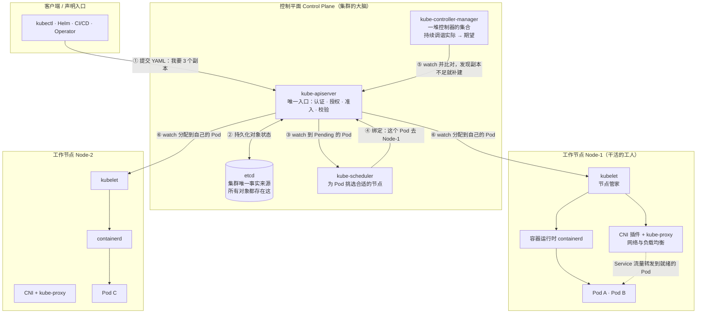
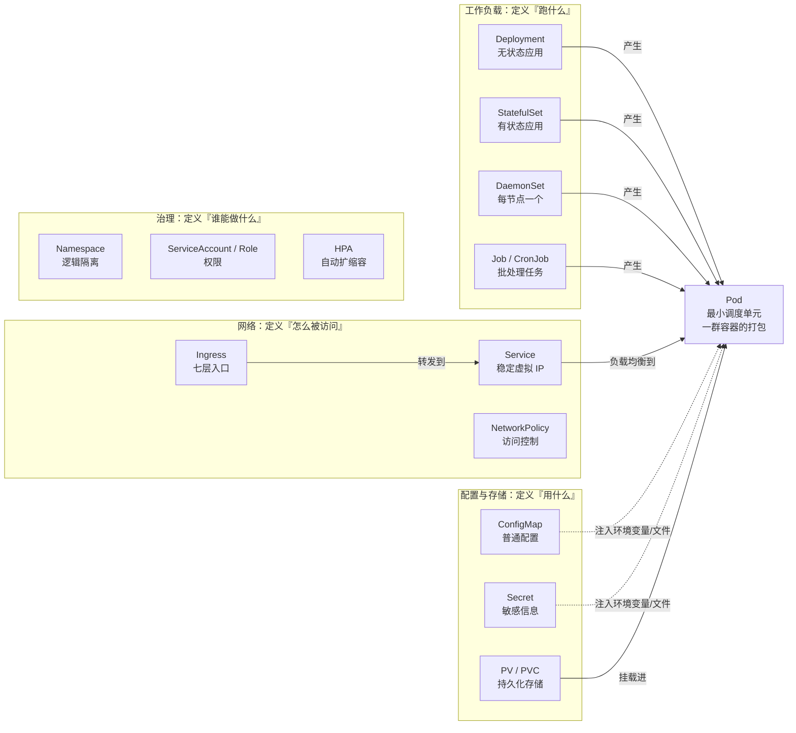
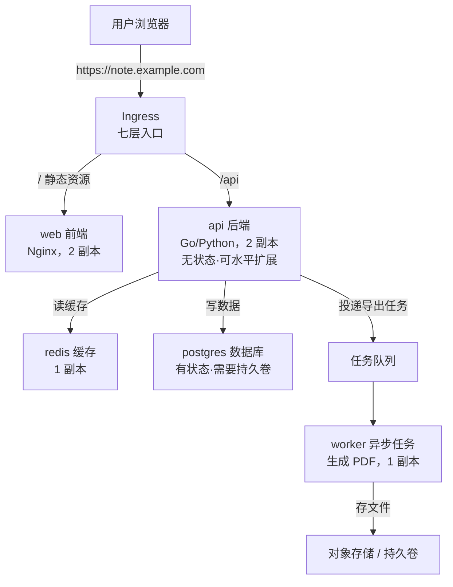

# 第 1 章　一张地图看清 Kubernetes：它到底解决什么问题

Kubernetes 的学习曲线之所以陡峭，不在于命令多，而在于它的每个概念都只有放回整体才讲得通：Pod 为什么不等于容器、Service 为什么 ping 不通、副本数为什么会自己恢复。孤立地看，这些都是需要死记的规则；放进同一张图里看，它们是同一条原理的不同侧面。

本章的任务是先把这张图画出来。叙述从一次凌晨故障开始，归纳手工运维失效的四种典型方式，再依次引入三层解药——容器解决环境一致，声明式 API 解决意图表达，调和循环解决持续收敛——最后把控制平面与工作节点的全部组件挂到一条完整链路上：一次 `kubectl apply` 之后的三十秒里，究竟是谁在依次接手。

本章不要求记住任何字段名，只要求读懂结构。后续各章都是在放大这条链路里的某一段。

---

### 1.1 凌晨两点四十七分的电话

先看一个真实场景。

你是一家公司的后端开发。你们的"云笔记"服务跑在三台物理服务器上：一台跑 Nginx 前端，两台跑 Java 后端，数据库装在第二台的那些机器里。

周五凌晨 2:47，手机响了。值班同事说：**"服务 502 了，用户打不开笔记。"**

你连上 VPN，开始查。第一台机器正常，第二台机器上：

```
$ ps -ef | grep java
（什么都没输出）
```

进程没了。为什么没了？没人知道——可能是半夜 OOM 被系统杀了，可能是有人手滑关了终端窗口把进程带走了。

你决定重启。于是你面对三个问题：

1. **启动脚本在哪？** 在某个同事的 `~/deploy/restart.sh` 里，而他三个月前离职了。
2. **参数对得上吗？** 生产环境和测试环境的 JVM 参数、`-D` 变量，只在部署文档的某个版本的注释里写着。
3. **启动需要多久？** 冷启动 90 秒，而这 90 秒里用户一直在刷新页面看到 502。

等你终于把它拉起来，天亮了。花了两小时,复盘的时候你写下：

"这次故障的根因不是代码 bug，是**没有人管这个进程**。"

这句话，就是 Kubernetes 存在的全部理由。

手工运维的四种典型失效方式如下：

| 编号 | 名字     | 典型症状                | 本质问题             |
| -- | ------ | ------------------- | ---------------- |
| 1  | 环境漂移   | "在我机器上是好的"          | 运行环境没有被打包固化      |
| 2  | 人肉扩容   | 大促前一周开始申请机器、装环境、改配置 | 扩容单位是"人天"，不是"秒"  |
| 3  | 故障无人接管 | 进程挂了没人拉起来，磁盘满了没人清理  | 没有任何东西持续盯着"实际状态" |
| 4  | 发布靠勇气  | 一次性替换全部实例，出错回滚要半小时  | 变更不可描述、不可回退、不可分批 |

请注意，这四个地狱有一个共同点：**它们都是"事后人工反应"，而不是"系统自动收敛"。**

"收敛"是本书出现频率最高的词，它是 Kubernetes 的核心思想。

---

### 1.2 第一层解药：容器 —— 把运行环境装进标准集装箱

针对地狱 1（环境漂移），业界先给出了答案：**容器**。

#### 一个类比

想象你要运 1000 种货物到海外：钢琴、西瓜、散装螺丝。

- **传统部署（裸机）**：全部散装堆进船舱。西瓜被钢琴压烂，螺丝沉进角落找不到。这就是"环境冲突"——同一个操作系统的库版本只能有一个。
- **虚拟机**：给每种货配一个独立小舱室，还各配一台发电机+空调。安全、隔离彻底，但每台虚拟机都要跑一个完整的操作系统内核，**太重**：启动要几十秒，内存开销以 GB 计。
- **容器**：发明**标准集装箱**。箱子尺寸统一，吊装机械通用，箱内装什么都不影响隔壁。集装箱本身不烧油——它共享船的动力系统。

这就是容器的位置：**比虚拟机轻一个数量级，但保留了"箱内互不干扰"的隔离性。**

#### 技术真相（一句话点到）

容器常被误解为"轻量级虚拟机"。其实它根本不是虚拟机，它是：

**一个被 Linux 内核"骗"了、以为自己独占了整台机器的普通进程。**

内核用了两套机制来制造这个幻觉：

| 机制            | 作用      | 通俗解释                                                                 |
| ------------- | ------- | -------------------------------------------------------------------- |
| **Namespace** | 负责"看不见" | 给进程戴上眼罩：看不见别的进程（PID）、别人的网卡（NET）、别人的目录树（MNT）、别人的主机名（UTS）、别人的用户表（USER） |
| **cgroups**   | 负责"用不多" | 给进程套上量化紧箍咒：最多用 1 个 CPU、512MB 内存，超了就杀                                 |

再加上 **Capabilities / seccomp / AppArmor** 等安全特性削减它的权限，一个容器就成型了。

#### 镜像：集装箱的"设计图纸"

容器的"内容"由**镜像（Image）**描述。镜像是一个**分层叠加**的文件系统：

```
┌─────────────────────────────┐  可写层（容器跑起来后的改动，容器删了就没了）
│  Container Layer            │
├─────────────────────────────┤
│  应用层：app.jar + 启动脚本  │  ← 你加的一层
├─────────────────────────────┤
│  JDK 层：openjdk-17         │  ← 官方镜像提供
├─────────────────────────────┤
│  基础层：debian:12-slim     │  ← 别人建的
└─────────────────────────────┘
```

镜像一旦构建完成，**内容永不变**（immutable）。这就是它消灭"环境漂移"的原因：你在测试环境跑的 `myapp:v1.2.3` 和在生产环境跑的，是**逐字节相同**的东西。

#### 但容器解决不了全部问题

容器只解决了"跑起来环境一致"。它**不会**：

- 自己决定该跑到哪台机器上（不会选址）.
- 挂了之后自动重生（不会自愈）
- 流量涨了自动多起几个（不会伸缩）
- 把自己的地址告诉别人、帮别人找到自己（不会服务发现）
- 保证集群里有 3 个实例在跑（没有"数量"这个概念）

一句话：**容器是"被管的对象"，它需要一个"管理者"。**

这个管理者，就叫**容器编排系统（Container Orchestrator）**。

---

### 1.3 第二层解药：从"命令式"到"声明式"

编排系统有好几个（Docker Swarm、Apache Mesos、Nomad、Kubernetes）。为什么最后是 Kubernetes 赢了？因为它做了一个关键的范式选择。

#### 命令式 vs 声明式

想象你坐出租车：

- **命令式（Imperative）**：你说"前面路口左转，然后直行 200 米，再右转，看到红色招牌停"。司机的每个动作都来自你的指令。**中间路上出了任何状况（堵车、封路），你的指令序列就失效了，必须重新下指令。**
- **声明式（Declarative）**：你说"我要去虹桥机场 T2"。司机自己规划路线，遇到堵车自己绕。**你只表达目标，不表达过程。**

Kubernetes 选的是后者。你写一个文件说：

```yaml
# 我要：始终有 3 个 api 容器的副本在运行
spec:
  replicas: 3
```

然后你就不再管了。至于这 3 个副本在哪台机器上、什么时候被重建、用的是哪个镜像层缓存——**都不需要你操心。**

#### 这个文件叫什么

在 K8s 里，这个文件是**期望状态（Desired State）**的声明：

**"我期望集群的样子是这样的。"**

K8s 会持续做一件事：把集群**实际的样子（Actual State）**往你声明的样子上拧，直到两边一致。

```
     期望状态                   实际状态
  （你写的 YAML）           （集群里真实发生）
        │                        │
        └────── 持续对比 ────────┘
                  │
          有差异？→ 采取行动，
          然后再对比，
          再行动，再对比……
```

这个"对比—行动"的循环，叫**调和循环 / 调谐循环（Reconciliation Loop）**。

**这是本书最重要的一张图。**第 4 章会专门把它拆开讲，但你现在就要记住它的形状：**它是一个永远转下去的闭环，不是一个一次性的命令。**

命令式系统里，你要"正确地做每一步"；声明式系统里，你只要"把目标写对"，剩下的交给循环。

---

### 1.4 Kubernetes 是什么：一句话定义 + 一个类比

#### 名字的来历

Kubernetes 来自希腊语 **κυβερνήτης**，意思是**舵手 / 船长**。英语里的 Cybernetics（控制论）和它同源。简写 K8s 的来历是：K + 中间 8 个字母（ubernete）+ s。

看这个字源，你就知道它想做什么了：**站在船头持续调整方向，让船朝着目标走。**——又是"收敛"。

##### 一句话定义

> **Kubernetes 是一个以"容器"为管理单元、以"声明式 API"为交互方式、通过"控制器"持续把实际状态推向期望状态的分布式操作系统。**

注意最后一个词：**分布式操作系统**。这是理解 K8s 的最佳类比：

| 单机操作系统                   | Kubernetes                              |
| ------------------------ | --------------------------------------- |
| 管理进程和线程                  | 管理 Pod（容器组）                             |
| 用 CPU/内存调度器分配时间片         | 用 kube-scheduler 分配节点                   |
| 提供文件系统给程序读写              | 提供 Volume / PV 给容器挂载                    |
| 提供本地回环网络                 | 提供 Service / DNS / CNI 网络               |
| 进程崩了由 shell 或 systemd 重启 | Pod 挂了由控制器重建                            |
| `ps` / `top` 查看状态        | `kubectl get` / `kubectl describe` 查看状态 |

换句话说：**K8s 把"一整个机房的所有机器"虚拟成了一台超级计算机**，你像在单机上写程序一样，把一个 YAML 交给它，它负责让这东西在这台"超级计算机"上跑起来。

#### 第二个类比：一家 24 小时不睡觉的物业管理公司

这个类比更贴 K8s 的组件结构：

| K8s 里的角色                          | 类比成物业         | 职责                                                   |
| --------------------------------- | ------------- | ---------------------------------------------------- |
| **你 / CI 流水线**                    | 业主            | 写订单："我要 3 套两室一厅，配套齐全"                                |
| **kube-apiserver**                | 前台接待处         | **唯一**收单窗口。所有人（内部外部）都只能找它，它负责查证件（认证）、查权限（授权）、查条款（准入） |
| **etcd**                          | 档案室 / 不动产登记中心 | 存放全公司唯一一份"事实台账"。所有订单、所有房子的状态，都在这里                    |
| **kube-scheduler**                | 选址部门          | 拿到新订单，看哪块地皮还有空、水电够不够，然后决定建在哪                         |
| **kube-controller-manager**       | 监理 / 巡逻队      | 天天巡楼，发现"订单要 3 套、现场只有 2 套"，立刻上报再建 1 套                 |
| **kubelet**                       | 每栋楼的驻场管家      | 只负责自己那栋楼：房子真的建好了吗？住户健康吗？按要求上报                        |
| **kube-proxy**                    | 楼内电话交换机       | 别人打"服务中心"这个总机号，它负责转接到某一个在岗的人身上                       |
| **Container Runtime**（containerd） | 施工队           | 真正动手拉材料、砌墙、通水电（创建容器）                                 |
| **CNI 插件**（Calico / Cilium）       | 弱电工程队         | 负责给每套房子拉网线、分配门牌号（Pod IP）                             |

这张表不需要背，第 3 章会逐个拆开。此处只需记住一件事：

> **K8s 的所有组件都不"直接干活"，它们全部通过"读/写 API Server 里的对象"来协作。**

这一点非常关键，后面会反复用到。

---

### 1.5 全局图谱：把上面的名字全部挂到一张图上

这是本章的核心图谱，后续各章都会回到它上面。



看懂这张图的顺序建议：

1. **看形状**：左边是"人"，中间是"大脑"，右边是"手脚"。所有箭头都汇聚到 API Server，**没有任何一条线绕过它**。
2. **看数据流**：etcd 是唯一真相来源。你 `kubectl get pods` 看到的内容，全部来自 etcd 里存的对象的副本。
3. **看方向**：箭头 ③④⑤⑥ 都是 **watch（长连接订阅）**，不是"调用"。  
   这是 K8s 的性能秘诀：**没有人在轮询，也没有人在相互调用。所有人都在订阅 API Server 的变更通知。**

#### 一句话总结这张图

**K8s 本质上是一个"共享数据库 + 一群订阅它并各自干活的守护进程"。**

---

### 1.6 灵魂三问：K8s 的三条核心原则

图谱之外，还有三条原则贯穿全书，后面 14 章都是它们的展开。

#### 原则一：一切皆对象（Everything is an Object）

在 K8s 里，你操作的从来不是"一个进程"或"一台机器"，而是一个**对象（Object）**：

- `Pod` 对象描述"一组容器应该怎么跑"
- `Service` 对象描述"一组 Pod 应该用什么地址被访问"
- `Node` 对象描述"一台机器现在有什么资源、什么状态"

每个对象都有：

```yaml
apiVersion: apps/v1       # 属于哪个 API 组和版本
kind: Deployment          # 是什么类型
metadata:
  name: api               # 叫什么
  labels:                 # 贴什么标签（用于筛选）
    app: cloudnote
spec:                     # 期望状态：我要它变成什么样（你写的）
status:                   # 实际状态：它现在是什么样（K8s 写的）
```

注意最后两行：**`spec` 是你的输入，`status` 是系统的输出。**你改 `spec`，系统负责让 `status` 追上 `spec`。

#### 原则二：通过声明 `spec`，让系统收敛 `status`

这就是第 1.3 节讲的调和循环。它的工程实现非常具体：

```
for {
    读期望状态 (spec)
    读实际状态 (status)
    if 两者不一致 {
        执行最小必要的动作让它一致
    }
    sleep 一小会儿 或 等待下一次事件通知
}
```

**自愈、扩缩容、滚动更新，全都是这一个循环的不同表现。**第 11 章你会看到，所谓"自愈"根本不是魔法，就是这个循环发现"要 3 个、只有 2 个"然后补了一个。

#### 原则三：松耦合 + 可扩展（CRD / Operator）

K8s 没有把"什么是一个应用"写死在代码里。它提供的是**框架**：

- 你可以用 **CRD（Custom Resource Definition）** 定义自己的对象类型，比如 `kind: MySQLCluster`。
- 然后写一个 **控制器**去调谐它，这叫 **Operator**。比如 Prometheus Operator、Kafka Operator。

所以 K8s 的能力边界是**可生长的**。这也是它统治市场的原因之一。

---

### 1.7 一次 `kubectl apply` 之后，30 秒内发生了什么

这条链路是理解全书其余章节的主干道。

假设你执行：

```bash
kubectl apply -f api-deployment.yaml    # 里面写着 replicas: 3
```

#### 时间线

| 时刻      | 谁在动                       | 发生了什么                                                                                                                                             | 对应本书章节  |
| ------- | ------------------------- | ------------------------------------------------------------------------------------------------------------------------------------------------- | ------- |
| T+0.00s | **kubectl**               | 读本地 YAML，做客户端校验与转换，向 API Server 发 `POST /apis/apps/v1/namespaces/cloudnote/deployments`                                                           | —       |
| T+0.02s | **kube-apiserver**        | 三连关卡：① **认证**（你是谁）② **授权**（RBAC：你能否建 Deployment）③ **准入**（Mutating 先补默认值，如 `strategy: RollingUpdate`、`revisionHistoryLimit: 10`；Validating 再校验合法性） | 第 15 章  |
| T+0.05s | **kube-apiserver → etcd** | 校验通过，对象写入 etcd。**此刻这个 Deployment 才算"存在"了**。返回 201，kubectl 打印 `deployment.apps/api created`                                                        | 第 3 章   |
| T+0.06s | **Deployment 控制器**        | 它在 watch Deployment 的变更，收到事件："新建了一个要 3 副本的 Deployment"。于是创建一个 **ReplicaSet** 对象（名字类似 `api-7d4b9c8f5`）。它不直接建 Pod！                                  | 第 4、5 章 |
| T+0.08s | **ReplicaSet 控制器**        | watch 到新 ReplicaSet，发现 `status.replicas=0 < spec.replicas=3`，于是创建 3 个 **Pod 对象**写入 etcd。此时 Pod 的 `spec.nodeName` 是**空的**，`status.phase=Pending`   | 第 4、5 章 |
| T+0.10s | **kube-scheduler**        | watch 到"没有 nodeName 的 Pod"，开始两阶段决策：**Filter**（过滤掉资源不够、有污点、不满足亲和性的节点）→ **Score**（给剩下的节点打分）。选出 Node-1，写回 `spec.nodeName`。这叫**绑定（Binding）**          | 第 10 章  |
| T+0.15s | **Node-1 的 kubelet**      | watch 到自己名下多了 Pod，开始工作：调用 **CRI** 让 containerd 拉镜像 → 创建 **Pod Sandbox**（先起一个 `pause` 容器，用它建网络命名空间，调 **CNI** 分配 Pod IP）→ 起 init 容器 → 起业务容器         | 第 2、3 章 |
| T+5~20s | **kubelet**               | 容器跑起来了。**readinessProbe** 开始探测 `/healthz`。**探针通过之前，这个 Pod 不会接流量**                                                                                 | 第 11 章  |
| T+20s   | **EndpointSlice 控制器**     | 感知到 Pod 变成 Ready，把它的 `IP:port` 写进 Service 的后端列表                                                                                                   | 第 6 章   |
| T+20s+  | **kube-proxy**（每个节点）      | watch 到后端列表变化，在本机 iptables/IPVS 里写上转发规则。**到这一刻，流量才真的能进来**                                                                                         | 第 6 章   |
| 之后      | **kubelet**               | 每隔一段时间（或状态变化时）把 Pod 最新状态上报 API Server → etcd。**这就是 `kubectl get pods` 看到的那份数据**                                                                   | 第 3 章   |

#### 从这条链路里读出的三个重要结论

1. **没有人打电话给谁。** 所有组件都是 watch + 写对象，**没有直接的 RPC 调用**。这带来了极强的解耦与容错。
2. **API Server 是唯一入口。** 想改状态？只能通过它。想读状态？也只能通过它。etcd 从不对外暴露。
3. **"创建"是分层的。** 你建 Deployment，它建 ReplicaSet，ReplicaSet 建 Pod，kubelet 建容器。**每一层只管一件事**。这就是为什么"要 3 个副本"这件事能自动维持——它是 ReplicaSet 的 `spec.replicas` 在起约束作用。

这条链路是全书的主干道，后面每一章都在放大其中的某一段。

---

### 1.8 名词地图：核心对象速查

下面是全书会出现的对象。不必现在记忆，扫一眼即可，知道有这么个东西、它属于哪一类就够了。




| 类别    | 对象                                      | 一句话作用                     | 记忆抓手                       |
| ----- | --------------------------------------- | ------------------------- | -------------------------- |
| 最小单元  | **Pod**                                 | K8s 调度和运行的最小单位，里面跑一个或多个容器 | 豆荚：一粒荚里可以有几颗豆              |
| 无状态应用 | **Deployment**                          | 声明"某个镜像要跑 N 份"，并管理滚动更新与回滚 | 最常用，90% 的服务用它              |
| 中间层   | **ReplicaSet**                          | 只负责"保证恰好有 N 个 Pod"        | 通常由 Deployment 代管，你不用直接写   |
| 有状态应用 | **StatefulSet**                         | 每个 Pod 有稳定名字、稳定存储、有序启停    | 数据库、消息队列                   |
| 每节点一个 | **DaemonSet**                           | 保证每个（或指定的）节点上跑一份          | 日志采集、监控 Agent、CNI          |
| 批处理   | **Job / CronJob**                       | 跑完就结束的任务 / 定时任务           | 数据迁移、报表生成                  |
| 服务发现  | **Service**                             | 给一组 Pod 一个**稳定不变的地址**     | Pod 会死会重建 IP 会变，Service 不会 |
| 七层入口  | **Ingress**                             | 按域名和路径把外部流量分发到不同 Service  | 需要 Ingress Controller 才生效  |
| 配置    | **ConfigMap**                           | 存非敏感的键值配置，注入 Pod          | 配置与镜像解耦                    |
| 密钥    | **Secret**                              | 存密码、Token、证书（base64 编码）   | 别当它是加密的，默认只是编码             |
| 存储    | **PV / PVC**                            | PV 是"一块地皮"，PVC 是"用地申请"    | 声明式存储分配                    |
| 隔离    | **Namespace**                           | 逻辑上把集群切成多个虚拟小集群           | 团队/环境隔离                    |
| 权限    | **ServiceAccount / Role / RoleBinding** | 定义"哪个 Pod 能以什么身份做什么事"     | RBAC 三件套                   |
| 网络策略  | **NetworkPolicy**                       | 控制 Pod 之间能否通信             | 需要 CNI 支持                  |
| 伸缩    | **HPA**                                 | 按 CPU/内存/自定义指标自动调整副本数     | 第 12 章主角                   |
| 机器    | **Node**                                | 一台工作机器                    | 不是 Pod，是"地皮"               |
| 标签    | **Label / Selector**                    | 给对象贴标签，用选择器筛选             | K8s 的"关系型数据库外键"            |
| 注释    | **Annotation**                          | 存非筛选用途的元数据                | 给工具用的便签                    |

标签选择器（Label Selector）值得单独提一句：**K8s 里对象之间的"关系"几乎全靠标签来建立**。Deployment 靠标签找到自己的 Pod，Service 靠标签找到后端 Pod。这是 K8s 解耦的关键设计。

标签**只**用来做筛选；需要记长文本、给工具用、不参与筛选的信息，放 **Annotation**。

---

#### 最容易混淆的一对：Deployment 与 Service

上面那张表里，有两个名字最容易让人误以为是一回事——**因为它们的中文都沾了"服务"两个字**。先把它们彻底分开：

**Deployment 管"有没有人在干活"；Service 管"怎么找到干活的人"。**

| | Deployment | Service |
|---|---|---|
| 类别 | **工作负载（Workload）** | **网络对象（Network）** |
| 管什么 | 跑什么镜像、跑几个副本、怎么更新 | 给这组 Pod 一个**稳定地址**，做负载均衡 |
| 关注的本质 | **进程的存在性** | **地址的稳定性** |
| 同类兄弟 | StatefulSet / DaemonSet / Job / CronJob | Ingress / EndpointSlice / NetworkPolicy |
| 能否对外暴露端口 | **不能** | 能（ClusterIP / NodePort / LoadBalancer） |
| 没有对方会怎样 | 没有它，Pod 挂了不会自动重建 | 没有它，Pod 在跑但外部访问不到 |

**它们是两个平行的对象，不是包含关系。**典型的三层结构是这样的：

```
Deployment（管副本与版本）
      ↓ 创建并维持
   Pod × 3（真正跑进程，监听 :8080）
      ↑ 通过标签匹配
Service（提供稳定 ClusterIP + DNS，把流量分给这 3 个 Pod）
```

##### 最精彩的一点：它们互不认识

**Deployment 里没有任何字段指向 Service，Service 里也没有任何字段指向 Deployment。**它们之间唯一的联系是**标签**：

- Deployment 创建 Pod 时给它贴上 `app: api`
- Service 用 `selector: app: api` 去找后端

这个松耦合带来两个反直觉的推论，你可以亲手验证：

1. **删掉 Service，Deployment 毫不知情**——Pod 照样跑，副本数照样维持，只是外部访问不到了。
2. **把 Deployment 换成 StatefulSet，只要 Pod 的标签不变，Service 完全不需要改动。**

顺便纠正一个常见的错误认知：**Deployment 里的 `containerPort` 并不"开放"任何端口。**它只是**声明性质**的说明（给人和工具看的文档），真正让流量进来的必须是 Service。事实上，`containerPort` 不写也能正常工作——**除非你要用命名端口给 Service 引用**（`targetPort: http`），那时名字就变成必需的了。

一个类比帮你记牢：**Deployment 是后厨的排班表**（要几个厨师在岗，走一个补一个）；**Service 是前台的订餐电话**（客户打这个号码，转给任意一个在岗的厨师）。**排班表不接电话，订餐电话也不做菜。**

### 1.9 贯穿全书的案例：CloudNote 云笔记

下面介绍全书的贯穿案例。从第 2 章到第 14 章，所有例子都围绕它展开。

#### 业务是什么

**CloudNote** 是一个在线笔记服务：用户写笔记、自动同步到云端、可以导出成 PDF。

#### 技术架构



#### 它复刻了第 1.1 节里的四个地狱

| 地狱     | CloudNote 的具体表现                   | 将在哪一章被解决           |
| ------ | --------------------------------- | ------------------ |
| 环境漂移   | 测试环境 Go 1.21、生产 Go 1.20，行为有差异     | 第 2 章（容器镜像固化环境）    |
| 人肉扩容   | 每天晚上 20:00 同步高峰，API 需要 2 → 10 个实例 | 第 12 章（HPA 自动扩缩容）  |
| 故障无人接管 | api 容器 OOM 挂掉，没人拉起；worker 卡死但进程还在 | 第 11 章（探针 + 控制器自愈） |
| 发布靠勇气  | 全量替换导致 2 分钟不可用                    | 第 5 章（滚动更新 + 回滚）   |

再加两个新问题，正好对应另外几章：

- **配置散落**：数据库密码硬编码在镜像里，改一次要重新构建镜像 → 第 8 章
- **数据丢失**：容器重启后上传的附件全没了 → 第 9 章

#### 全书的推进路线

```
第 2-4 章：认识工具（Pod / 集群 / 控制器）      ← 打地基
第 5-9 章：把 CloudNote 完整搭起来              ← 建房子
第 10-13 章：让它稳、让它快、让它省             ← 精装修
第 14 章：把它从零部署一遍，然后亲手打挂它      ← 实战演习
第 15 章：生产上线检查清单与排错手册            ← 出师
```

案例的完整 YAML 清单会随章节逐步添加到本书配套仓库的 `cases/cloudnote/` 目录下。到第 14 章时，你会拿到一套可以直接 `kubectl apply -f` 跑起来的完整配置。

---

### 1.10 动手：三种零成本起一个集群

概念看得再多，也不如亲手起一个集群。以下三种方式任选其一，都不花钱。

#### 方案 A：kind（推荐给动手党）

**kind = Kubernetes in Docker**。用 Docker 容器模拟 Kubernetes 节点，几十秒起一个多节点集群，最适合学习。

```bash
# macOS
brew install kind kubectl

# 起一个 1 控制平面 + 2 工作节点的集群
cat > kind-config.yaml <<'EOF'
kind: Cluster
apiVersion: kind.x-k8s.io/v1alpha4
nodes:
  - role: control-plane
  - role: worker
  - role: worker
EOF

kind create cluster --name k8s-study --config kind-config.yaml
```

#### 方案 B：minikube

```bash
brew install minikube kubectl
minikube start --nodes 2 --cpus 2 --memory 4096
```

#### 方案 C：k3s（最轻量，一条命令）

```bash
curl -sfL https://get.k3s.io | sh -
```

#### 或者：干脆不搭本地集群

- **Docker Desktop 自带**：设置里勾选 "Enable Kubernetes"，点应用就行。
- **云托管**：腾讯云 TKE / 阿里云 ACK / AWS EKS 都有免费试用额度，生产形态最接近真实。

#### 起好之后的三个验证命令

```bash
# 1. 看节点，状态应该是 Ready
kubectl get nodes -o wide

# 2. 看集群的系统组件都跑在哪
kubectl get pods -n kube-system

# 3. 看 API Server 暴露了哪些资源类型（这就是"一切皆对象"的证据）
kubectl api-resources | head -30
```

第 3 个命令很值得跑一下。你会看到一长串资源类型——**这个列表就是 K8s 的"对象字典"**，也是后续各章要逐个攻克的清单。

如果你暂时不想装环境也没关系。第 1-4 章是概念章，纯读也能懂；到第 5 章开始动手时再搭，也来得及。

---

### 1.11 本章要点

1. **容器**解决了"环境一致"，但没有解决"谁来管"。
2. **Kubernetes** 是一个分布式操作系统，它用**声明式 API** 让你描述期望状态，用**控制器循环**把实际状态持续拧向期望状态。
3. **所有组件都通过 API Server 读写对象来协作**，etcd 是唯一事实来源，没有任何组件在轮询或直接互相调用。

#### 本章全景图

```
     你写 YAML                      K8s 持续干活
   （期望状态）          ┌──────────────────────────────┐
        │                │  调和循环 Reconciliation     │
        │                │                              │
        ▼                │   比对 spec 与 status         │
   ┌─────────┐           │        │                     │
   │  spec   │───────────┼────────┤ 一致 → 什么都不做     │
   └─────────┘           │        │ 不一致 → 采取行动      │
                         │        ▼                     │
   ┌─────────┐           │   创建/删除/重启/迁移         │
   │ status  │◄──────────┼────────┘                     │
   └─────────┘           └──────────────────────────────┘
        ▲
        └── 由各组件真实上报
```

### 1.12 练习题


1. 用一个比喻解释"容器"和"虚拟机"的区别。
2. 为什么说容器不是"轻量虚拟机"？它到底用了 Linux 的哪两套机制？
3. "命令式"和"声明式"的区别是什么？为什么 K8s 选声明式？
4. 调和循环在做什么？它为什么能实现"自愈"？
5. 一次 `kubectl apply` 后，是**谁**把 Pod 分配到节点上的？它依据什么？
6. 为什么 `kubectl get pods` 能看到最新状态？数据从哪来？
7. Deployment 为什么不直接建 Pod，而要先建一个 ReplicaSet？（第 1.7 节，第 5 章会详细讲）
8. `spec` 和 `status` 分别是谁写的？
