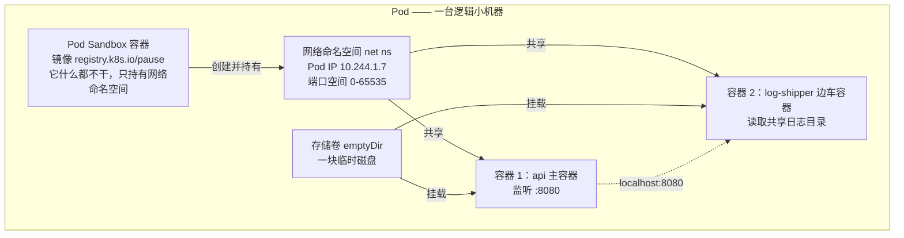
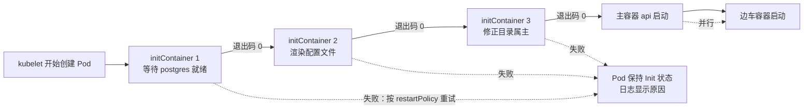
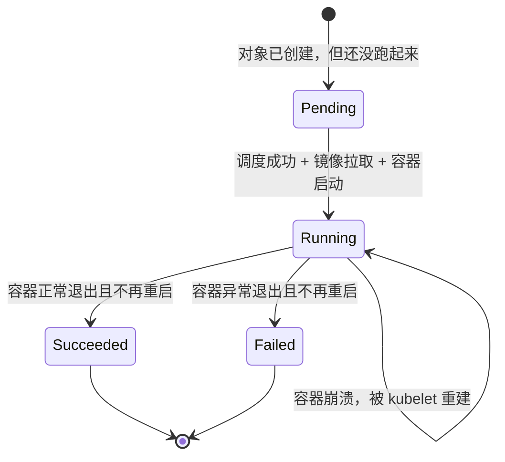
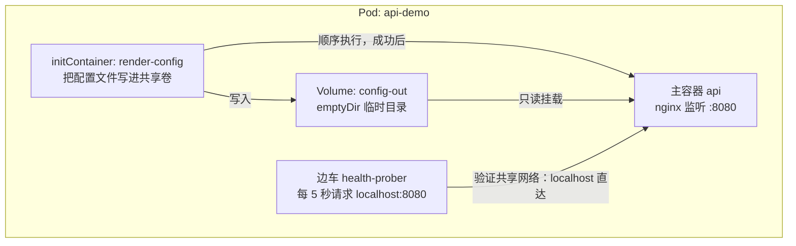

# 第 2 章　容器与 Pod：最小调度单元的秘密

第 1 章已说明，容器是被管的对象。但真去翻 Kubernetes 的文档，会发现一件奇怪的事：

**K8s 里根本没有 `kind: Container` 这种东西。**

你永远找不到一个叫 `Container` 的对象去创建它。你能创建的最小东西叫 **Pod**。

这就像你去餐厅点菜，菜单上最小的单位不是"一颗鸡蛋"，而是"一份蛋炒饭"——你要么要一整份，要么不要。为什么 K8s 要做这个设计？这一章就回答它。

---

### 2.1 先想清楚：为什么不直接管容器？

先做个思想实验。假设你是 K8s 的设计者，你决定"最小单位就是容器"，简单直接。然后你遇到三个问题。

#### 问题一：有些进程天生"同生共死"

CloudNote 的 `api` 服务上线后，你需要一个日志采集器把它写到 stdout 的日志收走。

- 如果日志采集器是**独立的容器**、独立调度：它可能被调度到 Node-5，而 api 在 Node-1。它得跨节点去捞日志，还得自己维护"我要跟着哪个 api"的逻辑。api 挂了重建、换了节点，采集器要重新找。**复杂度爆炸。**
- 如果日志采集器**和 api 在一个单位里**：它们永远在一起，共享一块磁盘目录，采集器直接读文件。**简单。**

再想想：这两个进程的生命周期是不是该绑定？api 重建了，采集器还守着旧文件有意义吗？没有。**它们应该一起生、一起死。**

#### 问题二：有些进程需要"本地回环"级别的贴近

微服务里常见一种做法：主容器调用外部的数据库/缓存，中间夹一个本地代理（比如 Envoy sidecar、Cloud SQL Proxy）。

这个代理必须在**主容器的 localhost 上**。如果它俩在各自独立的网络命名空间里（也就是各自独立的容器），主容器就得拿代理的 IP 去连——IP 会变、要注册、要发现。而如果它们**共享一个网络命名空间**，主容器只要连 `localhost:3306` 就行了，**永远不变**。

#### 问题三：调度要有个"合理的粒度"

如果最小单位是容器，调度器要为每个容器单独算一遍资源、单独选一次节点。一个应用拆成 10 个容器，就是 10 次调度决策，还得保证它们尽量靠在一起（否则网络延迟爆炸）。

**粒度太细，调度器会累死，一致性也没法保证。**

#### 结论

上面三个问题指向同一个答案：

**"容器的管理粒度太细了，需要一个更大的、能表达'这几个东西必须在一起'的单位。"**

这个单位，就是 **Pod**。

顺便说一句，Pod 这个名字来自**鲸鱼群（a pod of whales）**——Docker 的 logo 是鲸鱼，所以 K8s 用"一群鲸鱼"来命名它的最小单位。一"群"里可以是一头，也可以是好几头。

---

### 2.2 Pod 不是"容器组"，而是"一台逻辑小机器"

这是本章最重要的一句话，请反复读：

> **Pod 不是"把几个容器装在一起"，Pod 本身是一台逻辑上的小机器（a logical host）。容器是被部署到这台小机器上运行的进程。**

这个视角切换非常关键。对比一下就明白了：

| | 把 Pod 理解成"容器组" | 把 Pod 理解成"逻辑小机器" |
|---|---|---|
| 你关心的东西 | 有几个容器 | 这台机器有什么资源：一个 IP、一个端口空间、一块共享磁盘、一个主机名 |
| 为什么容器能互通 | 因为"打包在一起了" | 因为**它们跑在同一台机器上**，就像你在自己电脑上开两个进程 |
| 为什么端口会冲突 | 想不通 | 同一台机器上当然不能有两个进程听同一个端口 |
| 为什么能共享磁盘 | 因为配置了 | 因为**它们挂载的是同一块盘** |

用"合租房"来类比更直白：

- **Pod = 一套合租房**：有一个门牌号（Pod IP）、一个厨房（端口空间）、一个公共阳台（共享卷）。
- **容器 = 住进来的室友**：每人有自己独立的房间（独立文件系统 rootfs）、自己的行李。室友之间可以互相喊话（localhost 互通），但**不能两个人同时占用厨房的同一条灶**（端口冲突）。

再看一张正式定义：

**Pod 是一组容器的集合，这些容器共享网络命名空间、IPC 命名空间，以及可选的存储卷，并且总是被调度到同一台节点上一起运行。**

四个要点，一个都不能少：

1. **一组**：可以 1 个（最常见），也可以多个。
2. **共享网络 + IPC**：同一个 IP、同一个端口空间、可以用 localhost 互相访问。
3. **可选共享存储**：通过 Volume 实现，不是强制的。文件系统本身**不共享**。
4. **总是同节点**：**一个 Pod 永远不会跨机器。**这是原子性保证。

---

### 2.3 解剖一个 Pod：那个你看不见的 pause 容器

下面拆开一个双容器 Pod，看 kubelet 实际创建了几个容器。

**答案是三个。**



#### 那个 sandbox 容器是什么

它叫 **pause 容器**（也叫 infra 容器、sandbox 容器）。它的镜像只有几百 KB，里面就一个程序，干的事是这样的：

```c
// 伪代码：pause 容器的全部人生
for (;;) {
    pause();   // 挂起，什么都不做，等信号
}
```

**它不跑业务，不占资源，你 `kubectl get pods` 也看不到它。** 那它存在的意义是什么？

**它存在的唯一意义是：创建并持有这个 Pod 的网络命名空间。**

#### 为什么不把网络命名空间挂在业务容器上？

因为**业务容器会死，pause 容器不会。**

想一想：如果网络命名空间挂在 api 容器上，那么 api 容器因为 OOM 被重启时——

1. 网络命名空间跟着容器一起销毁
2. 新的 api 容器起来，创建新的网络命名空间
3. **CNI 重新分配一个新的 Pod IP**
4. 所有指向旧 IP 的东西全部失效

而有了 pause 容器做"锚点"：

1. api 容器死了 → 只有它自己的进程和文件系统消失
2. pause 容器还活着 → **网络命名空间原封不动**
3. 新的 api 容器被创建，**直接加入这个已有的网络命名空间**
4. **Pod IP 不变**，端口空间不变

这就是「容器重启，但 Pod 不重启」的秘密。**在 K8s 里，"Pod 重启"从来都不是真的重启 Pod，而是重建它里面的容器。**

#### 完整创建顺序

所以 kubelet 创建一个 Pod 的实际顺序是：

```
① kubelet 收到指令：这个 Pod 归我管
       ↓
② 调用 CRI（containerd）：先起 pause 容器
       ↓
③ 调用 CNI 插件（Calico/Cilium）：给 pause 容器的 net ns 分配 IP
       ↓
④ 挂载 Volume，准备共享目录
       ↓
⑤ 依次运行 init 容器（见第 2.6 节）
       ↓
⑥ 并行启动所有业务容器，并把它们的 net ns 指向 pause 容器
```

第 5 步之后的业务容器，都会带上类似这样的参数（由容器运行时处理）：

```
--net=container:<pause容器ID>
```

**这就是"共享网络"的物理实现：不是魔法，是让后来者加入同一个 net ns。**

---

### 2.4 共享什么，不共享什么（含一个必踩的坑）

这一节最容易出错，下面把清单列清楚。

| 资源 | 是否共享 | 说明 |
|---|---|---|
| **网络命名空间** | **共享** | 同一个 Pod IP、同一个端口空间、容器间用 `localhost` 互访 |
| **IPC 命名空间** | **共享** | 共享内存、信号量，可以走 System V IPC |
| **存储卷 Volume** | **按需共享** | 只有显式挂载的卷才共享，是"指定目录"级别的共享 |
| **文件系统 rootfs** | **不共享** | 每个容器有自己的镜像层和可写层，看不到别人的 `/etc` |
| **进程命名空间 PID** | **默认不共享** | 默认看不到对方的进程；可用 `shareProcessNamespace: true` 打开（排错神器） |
| **主机名 hostname** | **共享** | 默认是 Pod 名，Pod 内所有容器看到的 hostname 一样 |
| **cgroup 资源限制** | **不共享** | 每个容器各自算 requests/limits，配额是分别施加的 |

#### 那个必踩的坑：端口冲突

既然共享网络命名空间，就意味着：**同一个 Pod 内的所有容器，共用一套端口号。**

```
Pod IP: 10.244.1.7
┌────────────────────────────────────────┐
│  端口空间（所有容器共用）                 │
│                                        │
│  :8080  ← api 容器监听                  │
│  :9000  ← sidecar 容器监听              │
│  :8080  ←  sidecar 也想监听 → 失败！   │
└────────────────────────────────────────┘
```

所以你会看到这种报错：

```
Error: listen tcp :8080: bind: address already in use
```

注意：**这不是"配置错了"，这是物理上做不到**，就像同一台电脑上不能有两个程序占同一个端口。

解决办法：让 sidecar 换一个端口（比如 9090），或者干脆把它做成同一个容器里的两个进程。

记住这条口决：**同一 Pod 内 = 同一台机器。同一台机器上不能重复占端口。**

#### 反过来，两个优势

1. **容器间通信零成本**：直接用 `localhost:端口`，不需要服务发现，不需要知道 Pod IP。
2. **对外只有一个 IP 和一个端口空间**：别的 Pod 要访问这个 Pod 里的任意容器，都用同一个 `PodIP:端口`。

---

### 2.5 多容器 Pod 的三种经典模式

既然一个 Pod 里可以放多个容器，那"什么情况该放多个"就成了一个设计问题。业界总结出三种模式，名字很形象：

#### 模式一：Sidecar（边车）—— 最常用

**主容器负责业务，边车负责"周边事务"。**

经典场景：

| 边车干什么 | 用什么实现 |
|---|---|
| 收集日志并转发 | Fluent Bit、Filebeat |
| 暴露监控指标 | Prometheus exporter |
| 代理进出流量（做 mTLS、限流） | Envoy、Istio 的数据面 |
| 同步配置 / 证书轮转 | Vault Agent、cert-manager |

比如 CloudNote 的 api，日志直接打到 stdout。生产上你可能加一个边车把 `/var/log/app/*.log` 转发到日志平台。

业内趋势提醒：从 K8s 1.28 起，"边车容器"被正式支持为一等公民（`initContainers` 里带 `restartPolicy: Always`），它会**在主容器之后启动、在主容器之前停止**，非常适合代理类边车。这是后面版本的重要演进，先知道有这回事。

#### 模式二：Ambassador（大使）—— 代理对外连接

主容器连数据库时，不直接连，而是连 `localhost:3306`，由大使容器把请求代理到真实数据库。

好处：**主容器的代码里永远写 `localhost`，不用改代码就能切换数据库地址、加密连接、做连接池。**

#### 模式三：Adapter（适配器）—— 统一对外接口

主容器吐出的指标格式是个私有格式，适配器容器读进来，转成 Prometheus 标准格式再暴露出去。

**好处是不用改主容器代码就能对接监控体系。**

#### 一句话总结这三种模式

| 模式 | 方向 | 一句话 |
|---|---|---|
| Sidecar | 主 → 外 | 帮主容器把数据**送出去**（日志、指标、流量） |
| Ambassador | 外 → 主 | 帮主容器把连接**接进来**（代理外部依赖） |
| Adapter | 转换 | 帮主容器把格式**改一下**（适配标准） |

**它们的共同点：都是"在不改动主容器代码的前提下，给它扩展能力"。**

#### 一个重要的反例：什么时候不该用多容器 Pod

- 两个容器**可以独立伸缩**（比如前端要 10 个、后端要 2 个）→ 应该分成两个 Deployment，各自用 Pod。
- 两个容器**不需要 localhost 通信、不需要共享盘** → 分开，别硬凑。
- 只是"想少写一个 YAML" → 这是坏理由。多容器 Pod 的调试成本更高（要指定 `-c <容器名>`）。

> **判断准则：如果两个进程需要"同生共死 + localhost 通信 + 共享本地磁盘"中的任意两项，就放一个 Pod；否则分开。**

---

### 2.6 init 容器：主容器的"先行部队"

现在解决第二个问题：**主容器启动前，如果需要先干点准备工作怎么办？**

比如 CloudNote 的 api 启动前需要：
1. 等数据库（postgres）能连上——不然 api 一起来就崩
2. 渲染一份配置文件到某个目录
3. 修一下数据目录的属主

把这些逻辑塞进主容器的启动脚本里当然也能写，但会污染业务镜像，也不够声明式。K8s 给的答案是 **init 容器（Init Container）**。

#### 核心规则：串行 + 全部成功



四条必须记住的规则：

1. **严格串行**：1 号跑完才跑 2 号，2 号跑完才跑 3 号。没有并行。
2. **必须成功退出**：每个 init 容器都要以退出码 `0` 结束。任何一个失败，整个 Pod 都会卡在初始化阶段，并按 `restartPolicy` 重试。
3. **全部成功后才起主容器**：所有 init 容器都成功了，业务容器才会被启动。
4. **主容器启动后，init 容器就永远结束了**：它们不会一直跑着，也不会被重启。

#### init 容器 vs 主容器：一张对比表

| 维度 | init 容器 | 主容器 |
|---|---|---|
| 执行方式 | 串行，一个接一个 | 并行，同时启动 |
| 生命周期 | 跑完就退出，不再运行 | 长期运行（或跑完退出，如 Job） |
| 探针 | **不支持** liveness / readiness / startup 探针 | 支持全部探针 |
| 生命周期钩子 | 不支持 `lifecycle` | 支持 `postStart` / `preStop` |
| 用途 | 准备工作：等待依赖、初始化、渲染配置 | 跑业务 | 
| 资源计算 | 调度时取 **max(所有 init 容器需求)** | 调度时取 **所有主容器需求之和** |

最后一行是个容易忽略的细节，但它解释了 K8s 的一个贴心设计：**因为 init 容器是串行的，它们不会同时占资源，所以调度时只看"最费资源的那个 init 容器"；而主容器是并行的，所以要加起来。**

#### 什么时候该用 init 容器

| 场景 | 例子 |
|---|---|
| 等待依赖就绪 | `until nc -z postgres 5432; do sleep 2; done` |
| 初始化数据库 schema | 跑一次 migration 脚本 |
| 拉取/渲染配置 | 从配置中心拉配置，生成 `app.conf` 到共享卷 |
| 修正文件权限 | `chown -R 1000:1000 /data`（常见于非 root 运行） |
| 下载模型、数据集 | AI 推理服务预热 |

顺带说，`wait-for-dependency` 这类逻辑，在纯 K8s 里也可以由**探针 + 重启**兜底（失败了就重启重试），但用 init 容器更明确、日志更清晰、也不会让主容器反复崩溃。第 11 章讲探针时会对比这两种思路。

---

### 2.7 Pod 的生命周期：从 Pending 到 Terminating

现在讲一个初学者经常困惑的问题：**为什么我的 Pod 状态一会儿 Pending、一会儿 ContainerCreating、一会儿 Running？**

#### 五个阶段（phase）

Pod 的 `status.phase` 只有五个可能值：



| phase | 含义 | 常见原因 |
|---|---|---|
| **Pending** | 对象已存在于 etcd，但还没有容器真正跑起来 | ① 调度器还没分配节点 ② init 容器正在跑 ③ 正在拉镜像（ContainerCreating） |
| **Running** | 至少一个容器在运行（或有容器正在启动/重启） | 正常状态 |
| **Succeeded** | 所有容器都成功退出，且不会被重启 | Job 类任务完成 |
| **Failed** | 所有容器都结束了，且至少一个是非正常退出 | 应用启动即崩、restartPolicy=Never |
| **Unknown** | 拿不到 Pod 状态，通常是节点失联 | 节点宕机、网络分区 |

**重点**：`Pending` 不代表"坏了"。它可能是正常的中间态。要判断原因，看 `kubectl describe pod` 的 **Events** 区域。

#### 单个容器的状态（更细一层）

每个容器还有自己的 `state`：

| 容器状态 | 含义 | 排查入口 |
|---|---|---|
| `Waiting` | 还没开始跑（正在拉镜像、init 没跑完、或用 `kubectl get pods` 看到 `ContainerCreating`） | `describe` 的 Events |
| `Running` | 正在跑 | `logs` / `exec` 看里面 |
| `Terminated` | 跑完了（不论成功失败） | 看 `exitCode` 和 `reason`（`OOMKilled` 是熟面孔） |

#### restartPolicy：谁来负责重启容器

| 值 | 行为 | 适用 |
|---|---|---|
| **Always**（默认） | 容器退出就重启，不论退出码 | 长期服务。**Deployment/ReplicaSet 管理的 Pod 必须是 Always** |
| **OnFailure** | 只有非 0 退出才重启 | 批处理任务（Job） |
| **Never** | 从不重启 | 一次性任务、调试 |

注意：**`restartPolicy` 是 Pod 级别的，作用于 Pod 内的所有容器。**而且它管的是"容器重启"，不是"Pod 重建"——Pod 重建是控制器（Deployment/ReplicaSet）的事。

#### 一个必须扭转的观念：Pod 是一次性的

传统运维的思维是：服务器是一头**宠物（pet）**——给它起名字、精心喂养、病了要治。

K8s 的思维是：Pod 是一头**牲口（cattle）**——它没有"名字"这个概念（或者说名字是由控制器给的序号），病了就换一头，**你从来不去修一个 Pod**。

这句话有很多推论，每一条都很实用：

| 推论 | 具体表现 |
|---|---|
| Pod 被删除是**正常现象** | 滚动更新、节点缩容、驱逐，都会删 Pod |
| Pod IP **不稳定** | 重建的 Pod 会拿到新 IP，所以绝不能把 Pod IP 写死在配置里（→ 第 6 章 Service） |
| Pod 名**通常不稳定** | Deployment 的 Pod 名带随机后缀。需要稳定名字 → 第 13 章 StatefulSet |
| 对 Pod 的**手动改动会丢** | 改了 Deployment 会触发新 Pod，你的改动就没了。**要改就改上层的控制器** |
| Pod 只能被**限制性修改** | 创建后只有少数字段可以原地改（如容器镜像、部分资源字段）；大多数改动会被 API Server 拒绝，只能重建 |

第 4 章讲的"调和循环"在这里体现得非常明显：**Pod 是"实际状态"，Deployment 里的 `replicas: 3` 才是"期望状态"。你删掉一个 Pod，控制器发现实际比期望少了一个，立刻补一个。**你手动改 Pod 叫"和控制器对抗"，改的永远是最上面的控制器才对。

---

### 2.8 动手：写一个多容器 Pod，亲手验证"共享"

理论讲够了，跑一遍。

本节实验需要一个集群，搭建方式见第 1.10 节。没有集群时，只读命令与输出也能理解。

#### 第一步：准备命名空间

```bash
kubectl apply -f cases/cloudnote/00-namespace.yaml
```

这一步只是创建了一个叫 `cloudnote` 的逻辑抽屉。第 8 章会详细讲 Namespace。

#### 第二步：创建演示 Pod

```bash
kubectl apply -f cases/cloudnote/15-pod-demo.yaml
```

这个 Pod 里有**三个容器**，结构如下：



#### 第三步：观察它的一生

```bash
# 实时盯着状态变化，你会看到 STATUS 从 Init:0/1 变到 Running
kubectl get pod api-demo -n cloudnote -w
```

典型输出演进：

```
NAME       READY   STATUS     RESTARTS   AGE
api-demo   0/2     Init:0/1   0          0s     ← init 容器在跑
api-demo   0/2     PodInitializing   0     1s     ← init 成功了
api-demo   2/2     Running    0          3s     ← 两个业务容器都起来了
```

注意 `READY` 那一列是 `2/2`——**因为这是双容器 Pod，分母是 2。**这个细节后面讲探针和滚动更新时非常重要。

#### 第四步：验证"共享网络"

```bash
# 看边车容器的日志：它用 localhost 请求主容器的 8080，成功了
kubectl logs api-demo -n cloudnote -c health-prober --tail=5
```

预期输出：

```
api 健康
api 健康
api 健康
```

**这个边车容器在自己的代码里写的是 `http://localhost:8080`，而 8080 是主容器监听的端口。它们能通，就因为共享了同一个网络命名空间。**

#### 第五步：验证"端口空间也是共享的"

```bash
# 进入主容器，看里面能访问什么
kubectl exec -it api-demo -n cloudnote -c api -- sh

# 容器内执行：访问本机 8080，应该拿到 nginx 页面
wget -qO- http://localhost:8080 | head -5
exit
```

现在故意制造**端口冲突**，加深印象。把边车容器也改成监听 8080：

```bash
kubectl patch pod api-demo -n cloudnote --type=json -p='[{"op":"replace","path":"/spec/containers/1/command","value":["sh","-c","nc -l -p 8080"]}]'
```

你会看到类似这样的报错：

```
The Pod "api-demo" is invalid: ... field is immutable
```

**这也是个知识点**：Pod 的大部分字段创建后不可修改。要改就得删掉重建——这就是 K8s 的哲学：**Pod 是一次性的，改不了的。**

如果你确实想体验端口冲突，可以临时把 YAML 里边车的命令改成监听 8080，删掉重建：

```bash
kubectl delete pod api-demo -n cloudnote
# 编辑 15-pod-demo.yaml，把 health-prober 的 command 改成 nc -l -p 8080
kubectl apply -f cases/cloudnote/15-pod-demo.yaml
kubectl get pod api-demo -n cloudnote
kubectl logs api-demo -n cloudnote -c health-prober
```

你会看到 `address already in use`，边车容器反复崩溃重启，`RESTARTS` 数字一直涨。

#### 第六步：看看那些"看不见"的东西

```bash
# 只显示容器，注意没有 pause 容器（它是 sandbox，不算 Pod 的容器）
kubectl get pod api-demo -n cloudnote -o jsonpath='{.spec.containers[*].name}'; echo

# 看 Pod IP —— 这个 IP 实际挂在 pause 容器的网络命名空间上
kubectl get pod api-demo -n cloudnote -o wide

# 看初始化过程的事件，能清楚看到 init 容器是先跑的
kubectl describe pod api-demo -n cloudnote | sed -n '/Events/,$p'
```

#### 第七步：删掉它，观察"没有控制器"的后果

```bash
kubectl delete pod api-demo -n cloudnote
kubectl get pods -n cloudnote
```

输出是 `No resources found`。

**Pod 不会自动回来。**

这个"什么都没发生"的结果，是本章最重要的实验结论：**裸 Pod 没有自愈能力。**因为没有任何控制器在盯着"应该有 1 个 api-demo 在跑"这个期望状态。

这正是第 5 章 Deployment 要解决的问题。**你刚刚亲手制造了"故障无人接管"这个地狱。**

#### 附带技巧：打开进程命名空间，看穿一切

Pod 里想看到"所有容器"的进程，可以开启共享 PID 命名空间。创建时加上：

```yaml
spec:
  shareProcessNamespace: true
  containers:
    - name: api
      image: nginx:1.27-alpine
    - name: sidecar
      image: busybox:1.36
      command: ["sh", "-c", "sleep 3600"]
```

然后：

```bash
kubectl exec -it <pod> -c sidecar -- ps aux
```

**你会看到 nginx 的进程号。**在默认配置下这是看不到的——这就是 PID 命名空间隔离的效果。这个技巧在排错"容器莫名挂掉"时非常有用，因为它能让你在一个容器里看到全 Pod 的进程视图。

---

### 2.9 对应到 CloudNote：api 的 Pod 长什么样

回到贯穿案例。CloudNote 的 `api` 在生产环境的标准形态如下：

```yaml
apiVersion: v1
kind: Pod                    # 生产环境这里会是 Deployment（第 5 章）
metadata:
  name: api
  namespace: cloudnote
  labels:
    app: cloudnote           # 标签是 K8s 里"建立关系"的方式
    component: api
spec:
  initContainers:
    # ① 等数据库就绪，避免主容器反复崩溃刷日志
    - name: wait-for-postgres
      image: busybox:1.36
      command: ["sh", "-c", "until nc -z postgres 5432; do sleep 2; done"]
  containers:
    # ② 主容器：业务逻辑
    - name: api
      image: registry.example.com/cloudnote/api:1.2.3
      ports:
        - name: http
          containerPort: 8080
      volumeMounts:
        - name: shared-logs
          mountPath: /var/log/app
      resources:
        requests: { cpu: 100m, memory: 128Mi }
        limits:   { cpu: 500m, memory: 512Mi }
    # ③ 边车：把日志目录转发到日志平台
    - name: log-shipper
      image: registry.example.com/cloudnote/log-shipper:0.4.1
      volumeMounts:
        - name: shared-logs
          mountPath: /var/log/app
          readOnly: true
  volumes:
    - name: shared-logs
      emptyDir: {}
  restartPolicy: Always
```

注意三个设计选择，都对应前面讲的知识点：

1. **`wait-for-postgres` 用 init 容器而不是写在主容器启动脚本里**——日志清晰、不污染业务镜像、不会让 api 反复崩溃刷屏。
2. **日志目录用 `emptyDir` 共享给边车**——典型的 Sidecar 模式。注意 `emptyDir` 的生命周期是"随 Pod"：Pod 删了目录就清空。**这对日志来说正合适**（日志已经被转发走了），但对数据来说是灾难（→ 第 9 章讲持久化）。
3. **主容器和边车都挂载了同一个卷**——一个读写、一个只读，这是最小权限的好习惯。

---

### 2.10 本章要点

1. **Pod 是"一台逻辑小机器"，不是一个"容器包"**。它有自己的 IP、端口空间、主机名和共享磁盘；容器是被部署到这台机器上的进程。
2. **共享靠 pause 容器**：pause 容器持有网络命名空间，业务容器"加入"它。这让容器可以随便重启，而 **Pod IP 保持不变**。
3. **Pod 是一次性的、不可修复的**。它没有自愈能力，改不了的字段只能重建；保证"要几个 Pod"是上层控制器（Deployment）的职责。

#### 本章全景图

```
                    ┌─── Pod（一台逻辑小机器）───────────────┐
                    │                                        │
   调度器给的最小    │  ┌──────────────┐                      │
   单位就是这一个 → │  │ pause 容器    │ ← 持有 net ns         │
                    │  │ Pod IP 在这   │   Pod IP 不变         │
                    │  └──────┬───────┘                       │
                    │         │ 共享                          │
                    │    ┌────┴────┐                          │
                    │    ▼         ▼                          │
                    │ ┌──────┐  ┌──────┐   ┌──────────────┐   │
                    │ │ 主容器│  │ 边车 │   │ emptyDir 卷  │   │
                    │ │ api  │◄─┤ 日志 │   │ 挂进两者     │   │
                    │ └──────┘  └──────┘   └──────────────┘   │
                    │  localhost 互通  端口空间共用             │
                    └────────────────────────────────────────┘
                       一个 Pod 永远只在一台节点上
```

### 2.11 练习题

1. 为什么 K8s 的最小调度单位是 Pod 而不是容器？举出至少两个理由。
2. pause 容器的唯一作用是什么？如果没有它，容器重启会发生什么严重后果？
3. 同一个 Pod 里两个容器都想监听 8080 端口，会发生什么？为什么？
4. Sidecar、Ambassador、Adapter 三种模式各自解决什么问题？用一句话说清区别。
5. init 容器和主容器在"执行顺序"和"生命周期"上有哪三点本质区别？
6. 一个 Pod 有 3 个主容器和 1 个 init 容器，调度时资源需求怎么算？
7. 为什么说 "Pod IP 是稳定的，但 Pod 是易失的"？这两句话矛盾吗？
8. 你手动 `kubectl edit` 改了一个由 Deployment 管理的 Pod，为什么改动很快就"消失"了？
9. `emptyDir` 的数据什么时候会丢？什么场景适合用它？
