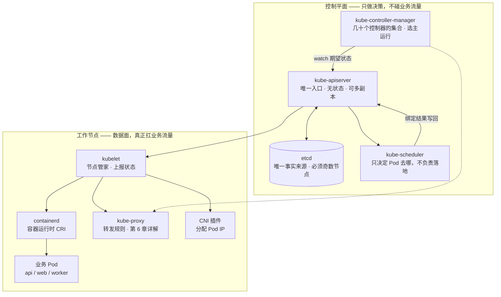
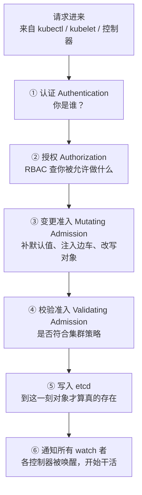
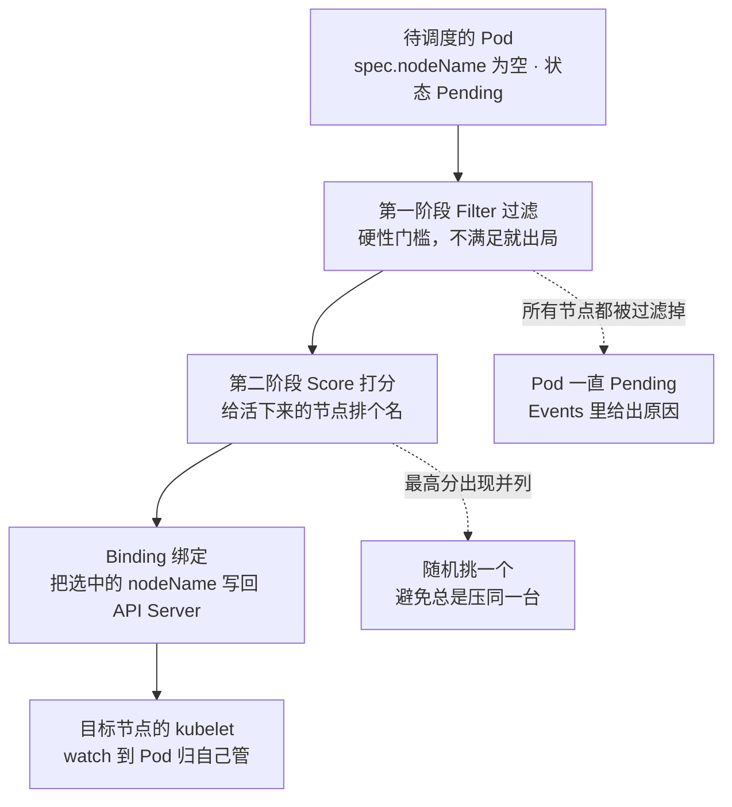
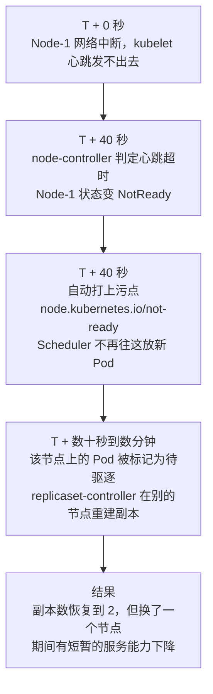

# 第 3 章　集群的解剖学：控制平面与工作节点

> **本章导读**
> - 建议用时：50 分钟（含 15 分钟动手）
> - 前置知识：第 1 章（集群全景图）、第 2 章（Pod 的创建顺序）
> - 读完你应该能回答四个问题：
>   1. 一个请求进到集群，kube-apiserver 要对它做哪六道处理？
>   2. etcd 为什么必须是奇数个节点？它挂了会怎样？
>   3. kube-scheduler 到底怎么给节点"打分"？
>   4. 为什么除了 etcd，几乎所有组件都能挂，集群却还能转？

第 1 章我们画过一张集群全景图，第 2 章我们钻进了 Pod 内部。这一章我们退回来，把整台"分布式操作系统"**大卸八块**，一个零件一个零件看。

目标很明确：看完之后，`kubectl get pods -n kube-system` 输出的那一堆陌生名字，对你来说应该像看着自己家的电表箱一样熟悉。

---

## 【积木 3-1】先把集群劈成两半：控制面与数据面

这是理解整个 K8s 架构的**第一把钥匙**。任何分布式系统都可以这样切：

| 平面 | 干什么 | 类比 | 挂了会怎样 |
|---|---|---|---|
| **控制面（Control Plane）** | 做决策、存状态、下发指令 | 公司总部：战略、审批、台账 | 不能**改**东西，但**已经在跑的业务不受影响** |
| **数据面（Data Plane）** | 真正处理用户流量、跑业务进程 | 门店：接待客户、干活 | 业务直接中断，用户立刻感知 |

**这个分层是 K8s 高可用的根基。**第 1 章我们说"K8s 是分布式操作系统"，现在可以给这句类比补上更多细节：

| 单机 Linux | K8s 控制面 | K8s 数据面 |
|---|---|---|
| 内核调度器 | kube-scheduler | — |
| `/proc` 文件系统 | kube-apiserver + etcd | — |
| 内核驱动子系统 | kube-controller-manager | kubelet |
| 进程实际执行 | — | containerd + 业务进程 |
| 内核网络栈 | — | kube-proxy + CNI |

**关键结论先给出来**：

> **控制面挂了 → 集群"冻结"：不能新建、不能删除、不能扩容，但已经在跑的容器照跑，用户无感知。**
> **数据面挂了 → 业务真的中断。**

记住这句话，积木 3-7 会专门验证它。



图里有个细节值得先注意：**控制面和数据面之间只有一条路——kubelet 从 API Server 拉取"分给我的 Pod"。**API Server 从不主动去连接节点上的任何东西。这个方向上的单向性，是后面所有"节点失联"行为的原因。

### 追问一下：数据面到底"在哪"？

这一段是专门写给"没看懂"的人的。因为"数据面"是本章最容易卡住的一个词。

你在 `kubectl get pods -n kube-system` 里永远找不到一个叫 `data-plane` 的东西。**因为数据面不是一个组件，而是一条路径。**

| | 控制面 | 数据面 |
|---|---|---|
| 它是什么 | 一组**进程** | 一组**机制**，它不是一个软件 |
| 它在哪 | 跑在控制面机器上 | 散落在**每个节点的内核**里、**每个 Pod 的网卡**上、**每个容器的进程**里 |
| 什么时候参与 | **只在"要变更"的那一刻**（建 Pod、扩容、改配置） | **每一毫秒**，每个用户请求都要走一遍 |

数据面具体由三样东西构成：

1. **节点内核里的转发规则**（iptables / IPVS）——负责"把包送到对的地方"
2. **节点之间的网络通路**（CNI 铺的 veth、路由、VXLAN/BGP）——负责"跨机器把包送过去"
3. **真正在处理的进程**（nginx、api 二进制）——负责"把请求变成响应"

#### 跟着一个请求走一遍

场景：用户在浏览器里打开 `https://note.example.com/api/notes`。

**第 1 跳：请求到达节点网卡**

DNS 把域名解析到集群入口地址（LoadBalancer 的公网 IP，或某个节点的 IP）。数据包到达 **Node-1 的物理网卡 eth0**。

> 注意：这一跳和 K8s 完全无关，就是普通的 TCP/IP。

**第 2 跳：内核规则接住了它**

包进入 Node-1 的**内核网络栈**。内核查 iptables/IPVS 规则，命中一条：

```
目的端口 443 的包  →  DNAT  改写成 10.244.2.5:8443
```

**这条规则是 kube-proxy 在 Service 被创建的那一刻写进去的。**用户请求到达时，kube-proxy 早就写完规则、退出路径了——**它根本不在转发链路上。**

> 这是最反直觉的一点，值得单独记：**kube-proxy 不是"代理"，它是"规则写入器"。**流量是内核在转发的，不是 kube-proxy 在转发。

**第 3 跳：跨节点送包**

`10.244.2.5` 那个 Ingress Controller Pod 在 **Node-2** 上。包怎么过去的？靠**CNI 插件**建立的节点间网络（VXLAN 隧道，或者 BGP 宣告的路由）。

> 这一段是 CNI 插件的战场，也是第 6 章会专门讲的。

**第 4 跳：Ingress 看 HTTP 头，再转一次**

包到达 Node-2，落入 Ingress Controller Pod 的网络命名空间。nginx 读 HTTP 请求，看到 `Host: note.example.com`、路径 `/api`，于是按 Ingress 规则决定转发给 `api` 这个 Service。

它连的是什么地址？**Service 的 ClusterIP**，比如 `10.96.14.7:8080`。

> ClusterIP 是个"虚拟 IP"——**没有任何一块网卡拥有它**，全世界只有内核的 iptables 规则认识它。这是第 6 章的重头戏。

**第 5 跳：内核再 DNAT 一次，落到真正的 Pod**

Node-2 的内核又是查规则，`10.96.14.7:8080` → `10.244.1.9:8080`（api Pod）。

**第 6 跳：业务进程干活**

api 容器里的进程收到 HTTP 请求，查 redis、读 postgres，拼出 JSON，原路返回。

#### 从这条路径里能读出的三件事

**第一，从头到尾没有控制面。**没有 API Server、没有 etcd、没有 scheduler、没有 controller-manager，**连 kube-proxy 都不在路径上**。

这就是积木 3-1 那句"控制面挂了业务照跑"的物理原因——不是"设计得好"，而是**业务流量的路径上压根就没有它们**。

**第二，数据面的关键角色是"内核"，不是"K8s"。**
真正转发字节的是 Linux 内核的 netfilter 子系统。K8s 做的事情是**往内核里写规则**，写完之后就交给内核了。这也是为什么 K8s 的网络性能问题，最后往往要回到内核参数上来调。

**第三，"数据面"这个词在不同语境下指代的东西不一样**，读文档时要留意：

| 语境 | "数据面"指的是 |
|---|---|
| 本节（K8s 集群视角） | 节点内核规则 + CNI 网络 + 容器进程 |
| 服务网格（Istio 视角） | 每个 Pod 里的 Envoy 代理（对比"控制面" Istiod） |
| 网络设备（路由器视角） | 转发芯片上跑的快路径（对比管理 CPU 上的控制协议） |
| 存储（Ceph 等） | 真正搬运数据块的 OSD（对比 MON 元数据集群） |

**共同点是一致的：控制面负责"决定"，数据面负责"执行"。**决定可以慢、可以挂、可以重来；执行必须快、必须一直在线。这条分界线,是几乎所有基础设施系统的通用设计。

#### 一个类比帮你收尾

- **控制面 = 交通指挥中心**：规划哪条路单行、哪个路口禁止左转、设置红绿灯的配时。
- **数据面 = 马路本身 + 红绿灯 + 正在路上跑的车**。

指挥中心停电了，马路上的车照样在开——因为**红绿灯的规则早就设好了，规则一旦写进去，就不需要指挥中心了**。

只有当你**要改规则**的时候（新增一个 Service、扩容、节点故障），指挥中心才需要重新介入。

---

## 【积木 3-2】kube-apiserver：唯一的门，也是全集群的咽喉

在第 1 章的 30 秒时间线里，几乎每一步都有它。它是整个集群里**唯一一个所有组件都必须经过的组件**。

### 它到底在做三件事

所有请求进来，都要过三道关卡，顺序不可颠倒：



逐条说：

| 步骤 | 做什么 | 典型实现 | 失败结果 |
|---|---|---|---|
| **认证** | 判断"你是谁" | 客户端证书、ServiceAccount Token、OIDC | `401 Unauthorized` |
| **授权** | 判断"你能不能做这件事" | RBAC（第 15 章详解） | `403 Forbidden` |
| **变更准入** | **改写**对象：补默认值、注入边车 | 内置默认值、LimitRanger、Istio sidecar 注入 | — |
| **校验准入** | **拒绝**不合规对象 | PodSecurity、ResourceQuota、自定义 Webhook | 报错，对象不落库 |
| **持久化** | 写 etcd | — | `500`，操作失败 |
| **通知** | 通过 watch 长连接推送变更 | — | 后续控制器不动作，表现为"卡住" |

**第 3 步是个隐藏的宝藏**。你有没有想过：为什么你 YAML 里明明没写 `strategy: RollingUpdate`，`kubectl get deploy -o yaml` 里却能看到它？

**因为变更准入阶段帮你补上了。**K8s 里绝大多数"默认值"都是在这道关卡注入的。这也是为什么 `kubectl apply` 之后 `get` 出来的东西总比你写的多——**API Server 会"丰富"你的对象。**

### 为什么它能扛住整个集群

如果每个组件都直接读写 etcd，etcd 会被打爆，鉴权逻辑也会散落各处。API Server 用三个设计解决了这个问题：

| 设计 | 作用 |
|---|---|
| **唯一入口** | 所有校验、鉴权、审计只做一次，逻辑集中 |
| **无状态（stateless）** | 它自己不存任何东西，全在 etcd 里。**所以可以随便起 3 个副本、随便重启** |
| **watch + 本地缓存** | 组件不是轮询它，而是建立长连接订阅变更；SDK（client-go）在本地维护一份缓存（informer），绝大多数读操作根本不到 API Server |

最后一条是性能关键。`kubectl get pods` 看起来是"查了一次 API Server"，实际上：

```
kubectl → API Server → 读 etcd（或用它的 watch 缓存）→ 返回
                            ↑
        控制器 / kubelet / scheduler 都在本地缓存里读，
        它们 99% 的读操作压根不碰 etcd
```

> 这也解释了一个常见误解：**"K8s 集群大了 etcd 会被读爆"。**现实恰恰相反——etcd 的读压力主要来自 API Server 的缓存失效，真正的写压力才是瓶颈。这也是为什么 K8s 对对象数量、ConfigMap 大小（1MB 上限）都有硬限制。

### 一个高频误解：它是"调度者"吗？

学到这里，很多人会得出一个结论：

> "apiserver 就是集群的调度者吧？所有请求都通过它发送和接收。"

**这句话对了一半，而错的那一半会引发连锁困惑。**

对的那一半（而且很关键）：

> **所有请求都必须经过它，没有例外。**读也好、写也好，kubectl 也好、kubelet 也好、控制器也好——全集群只有这一个地址能读写状态。

错的那一半：**它不"调度"，它不决定任何事。**

中文里"调度"这个词有两个意思，容易混在一起：

| "调度"的含义 | 对应 K8s 里的谁 |
|---|---|
| 分配任务、安排资源（scheduling） | **kube-scheduler**——这才是真正的"调度者" |
| 统一收发、中转（dispatching） | apiserver，但更准确的说法是**唯一入口 / 中枢**，不是"调度者" |

精确的一句话应该是：

> **kube-apiserver 是"唯一的事实入口 + 广播站"。它负责"收、验、存、播"四件事，唯独不负责"决定"。**

| 它做 | 它不做 |
|---|---|
| **收**：接收所有读写请求 | 不决定 Pod 该去哪个节点（→ scheduler） |
| **验**：认证、授权、准入改写与校验 | 不决定要不要补副本（→ controller-manager） |
| **存**：写入 etcd，对象此刻才算存在 | 不决定容器怎么启动（→ kubelet） |
| **播**：通过 watch 把变更推给所有订阅者 | 不决定 Service 该怎么转发（→ kube-proxy 写内核规则） |

有个细节最能说明这一点：**scheduler 的决策结果，也是"交给 apiserver 去记录"的。**

scheduler 决出节点后，它做的事情是调用 apiserver 的一个子资源接口：

```
POST /api/v1/namespaces/<ns>/pods/<name>/binding
```

apiserver 收到后，只是把 `spec.nodeName` 这个字段写进对象里。**它不理解、也不校验"为什么选这个节点"——它只是登记。**

#### 亲手验证：apiserver 真的不调度

K8s 里有一个很好玩的实验：**手动指定 `nodeName`，就能完全绕过 scheduler。**

```bash
# 先在节点上打一个标签，方便挑节点
kubectl get nodes

# 直接创建一个 Pod，并在 spec 里写死 nodeName
cat <<'EOF' | kubectl apply -f -
apiVersion: v1
kind: Pod
metadata:
  name: bypass-scheduler
  namespace: cloudnote
spec:
  nodeName: k8s-study-worker    # 把这里换成你集群里真实的 worker 节点名
  containers:
    - name: web
      image: nginx:1.27-alpine
EOF

kubectl get pod bypass-scheduler -n cloudnote -o wide
```

**这个 Pod 会正常跑起来**，尽管 scheduler 从头到尾没有参与——因为 scheduler 只处理"`nodeName` 为空"的 Pod，你填上了，它就无权干涉；而目标节点的 kubelet 发现"这个 Pod 归我管"，直接开干。

反过来说：**把 scheduler 停掉，只要 `nodeName` 写死，Pod 照样能被创建和运行。**这就证明了"调度"是一个**可选的外部决策者**，而不是 apiserver 的功能。

> 顺带一个隐藏知识点：**`spec.nodeName` 是 Pod 创建后少数几个"不可修改"却"可在创建时指定"的字段之一。**它一旦被写入，就代表"这个 Pod 属于这台节点了"，改不了——只能删掉重建（回到第 2 章"Pod 是一次性的"）。

#### 那"看起来像决策"的准入控制怎么解释

你可能会反驳：apiserver 里的**准入控制**明明会改写对象（比如补 `strategy: RollingUpdate`），这不就是"做决定"吗？

区别在于**性质**：

| | 准入控制（apiserver 内） | 调度（scheduler） |
|---|---|---|
| 做的事 | 应用**既定策略**：补默认值、校验合法性 | 做**动态选择**：在多个合法选项中挑一个 |
| 依赖什么 | 只依赖请求本身和静态策略 | 依赖**全集群的实时状态**（各节点剩余资源、污点、亲和性） |
| 结果确定吗 | 对同一个对象，**结果永远一样** | 同一个 Pod，**不同时间可能调度到不同节点** |
| 输出 | 改写后的对象 | 一个绑定决策 |

**"应用固定策略"和"做动态选择"是两回事。**apiserver 只做前者：你给它一个对象，它按规则整理好、存起来、广播出去——**它从不比较"哪个方案更好"**。

### 一个冷知识：它监听哪个端口

```bash
kubectl cluster-info
# Kubernetes control plane is running at https://127.0.0.1:6443
```

**6443 是 API Server 的默认端口。**你 `~/.kube/config` 里那串 `server:` 地址，指的就是它。**集群里其他所有组件用的也是这个地址**——包括 kubelet 上报状态、scheduler 绑定 Pod、控制器调谐，全部走这一个端口。

---

## 【积木 3-3】etcd：唯一的事实来源，也是唯一的"单点"

如果说 API Server 是门，那 etcd 就是**门后面那间唯一的档案室**。

### 它存的是什么

**全部。**整个集群里所有对象——你写的 Deployment、每个 Pod 的实际状态、Service、ConfigMap、Secret、节点的状态……**全部存在 etcd 里，没有例外**。

```bash
# 看一眼真实存在 etcd 里的 key（kind 环境需要先 docker exec 进 etcd 容器）
etcdctl get /registry/deployments/cloudnote/api --keys-only
```

路径规律是 `/registry/<资源类型复数>/<命名空间>/<名字>`。**这就是"一切皆对象"的物理证据**：K8s 里没有"运行时状态"这个概念，一切都是存在 etcd 里的一个 JSON 对象。

### 一个高频误解：etcd 会"按规范处理"吗？

学到这里，很自然会形成一个模型：

> "我在 YAML 里写了期望状态 → 它被记录到 etcd → 然后 etcd 按规范去处理。"

**这个模型有三分之二是对的，但有一处偏差会连锁地带偏后面的理解。**

对的部分：

- YAML 确实是**期望状态**
- 它确实**最终存在 etcd 里**
- etcd 确实是全集群**唯一的共识点**——所有组件的认知都以它为准（如果你说的"唯一规范"是这个意思，那你理解得没错）

偏差在这几点：

#### 偏差一：etcd 不会"处理"，它连 Pod 是什么都不知道

etcd 是一个**通用键值数据库**。你往它里面存什么，对它来说毫无区别：

```
/registry/deployments/cloudnote/api   →  {"spec":{"replicas":3}, ...}
/foo/bar                              →  {"hello":"world"}
```

对 etcd 而言，这两条记录**在结构上完全一样**——都是一个 key 对应一段字节。

它不知道什么是 Pod、什么是副本、什么是"不一致"。**它不校验你的 YAML、不做决策、不调谐。**它只会干两件事：

1. **存**：你给什么，原样存下
2. **通知**：这个 key 变了，告诉订阅它的人

#### 偏差二：etcd 里存的远不止你的"期望状态"

同一个对象里，`spec`（你写的）和 `status`（系统上报的）**存在一起**：

```yaml
spec:
  replicas: 3          # 你写的：期望状态
status:
  readyReplicas: 2     # 控制器和 kubelet 上报的：实际状态
```

除此之外，etcd 里还塞着大量**你从来没写过**的东西：节点心跳租约（Lease）、事件（Event）、Service 的后端列表（EndpointSlice）、集群证书、ServiceAccount 令牌、控制面的选主记录……

所以更准确的说法是：**etcd 存的是"整个集群的一切状态"，不只是你的 YAML。**

#### 修正后的完整链路

```
① 你的 YAML（期望状态）
        ↓
② apiserver 加工：认证 · 授权 · 准入 · 补默认值 · 规范化成完整对象
        ↓
③ etcd 存下来          ← 只存，不思考。它不理解 Pod，也不做任何业务判断
        ↓ 变更事件
④ apiserver 把变更广播出去（通过 watch 长连接推给所有订阅者）
        ↓
⑤ 控制器 / kubelet 各自行动   ←「处理」真正发生的地方
        ↓
⑥ 新的实际状态写回 etcd（status 与 spec 同处一个对象）
        └──────────── 回到 ③，闭环
```

**三个角色的分工一句话说清**：

| 角色 | 干什么 | 会不会"思考" |
|---|---|---|
| 你的 YAML | 表达**期望** | 是（人的思考） |
| apiserver | 翻译、校验、登记、广播 | 不思考，只应用固定策略 |
| **etcd** | **存下来、通知变更** | **完全不思考** |
| 控制器 / kubelet | 对比期望与实际，**决定做什么** | **思考发生在这里** |

#### 一个类比

**etcd 像"账本"，不像"会计"。**

账本负责如实记下每一笔，但它不会帮你算税，也不会提醒你"这笔有问题"。**会计（控制器）才是那个翻账本、发现不对就去纠正的人。**

而 apiserver 是那个**记账员**：他把你说的话翻译成规范的条目、检查格式、写进账本，然后喊一声"账目更新了"。**至于该不该做点什么，他不管。**

> **记住这条分界线**：etcd 只负责"记"和"说"，"想"和"做"永远是别人的事。后面第 4 章要讲的调谐循环，就是这些"会思考的人"共同遵循的做事方式。


### 为什么必须是奇数个节点

etcd 用 **Raft 共识算法**，靠"多数派（quorum）"来决定数据是否算写成功：

```
quorum = 节点总数 / 2 + 1   （向下取整后加一）
```

| 集群规模 | quorum | 能容忍几个节点挂 | 说明 |
|---|---|---|---|
| 1 节点 | 1 | **0** | 挂了集群就冻结，只能用于学习 |
| 2 节点 | 2 | **0** | 比 1 节点还差！任意一个挂了都凑不齐多数派 |
| 3 节点 | 2 | **1** | 生产最小可用规模 |
| 4 节点 | 3 | **1** | 和 3 节点容忍度一样，却多花一台机器——**浪费** |
| 5 节点 | 3 | **2** | 大型集群常用 |
| 6 节点 | 4 | **2** | 又是浪费 |

**看清规律了吗**：偶数节点不会带来任何额外的容错能力，只会多花钱、多增加一次网络往返。这就是"etcd 必须奇数节点"的全部理由。

> 顺便记住一个反直觉结论：**2 节点的 etcd 比 1 节点更不可靠。**因为 1 节点至少自己就是多数派，而 2 节点时任意一个挂掉，剩下的那个就孤掌难鸣了。

### etcd 挂了会怎样

这是最值得记住的一个场景。etcd 不可用时，API Server 还能"读一小会儿"（它有内存缓存），但：

| 会发生 | 不会发生 |
|---|---|
| 不能创建/修改/删除任何对象 | **已经在跑的 Pod 继续跑** |
| `kubectl apply` 全部失败 | 已经建立的 Service 转发规则继续生效（kube-proxy 的规则已在本地） |
| kubelet 上报状态全部失败 | 用户流量完全不受影响（数据面独立） |
| 控制器全部停在原地 | 容器不会莫名退出 |

这就是积木 3-1 说的"**集群冻结**"：**它变成了只读的、不能自愈的，但业务活着。**

### 因此，etcd 备份是生产第一优先级

K8s 里所有东西都能从代码仓库重建，**只有 etcd 里的状态不能**。所以你会在生产规范里看到：

```bash
# 定期快照备份（在 etcd 节点上执行）
ETCDCTL_API=3 etcdctl snapshot save /backup/etcd-$(date +%F).db \
  --endpoints=https://127.0.0.1:2379 \
  --cacert=/etc/kubernetes/pki/etcd/ca.crt \
  --cert=/etc/kubernetes/pki/etcd/server.crt \
  --key=/etc/kubernetes/pki/etcd/server.key
```

> 排查 K8s 问题时有一条铁律：**如果"所有组件都表现异常"，先去看 etcd 和 API Server，不要在业务 Pod 上浪费时间。**第 15 章会给你完整的故障树。

---

## 【积木 3-4】kube-scheduler：只做一件事，就是"选址"

Scheduler 是控制面里**职责范围最窄**的组件，窄到可以用一句话说清：

> **给它一个没有 `nodeName` 的 Pod，它还你一个 `nodeName`。**

它**不创建容器、不拉镜像、不碰节点**。它只做决策，然后通过 API Server 写一个"绑定（Binding）"。

### 决策分两阶段



**Filter（过滤）= 硬性条件，一票否决**：

| 过滤条件 | 检查什么 | Events 里的关键词 |
|---|---|---|
| 资源是否够 | 节点的可分配 CPU/内存 ≥ Pod 的 requests 之和 | `Insufficient cpu` / `Insufficient memory` |
| 污点与容忍 | 节点有污点，Pod 没有对应的容忍 | `node(s) had untolerated taint` |
| 节点亲和性 | `nodeAffinity` / `nodeSelector` 是否满足 | `didn't match node selector` |
| 节点状态 | 节点是否 Ready | `node(s) were unschedulable` |
| 端口冲突 | `hostPort` 是否被占用 | `node(s) didn't have free ports` |
| 卷拓扑 | PV 是否挂在这个可用区 | `node(s) had volume node affinity conflict` |

**Score（打分）= 软性偏好，分高者胜**：

| 打分维度 | 倾向 |
|---|---|
| `LeastAllocated`（默认） | 资源使用率**低**的节点得分高，让负载更均衡 |
| `ImageLocality` | **本地已有这个镜像**的节点得分高（省一次拉取） |
| `PodTopologySpread` | 让副本**分散到不同可用区/主机**的节点得分高 |
| `InterPodAffinity` | 满足 Pod 间亲和性的节点得分高 |

> **"Filter 全灭"是初学者最常遇到的 Pending 原因。**记住排查命令：
> ```bash
> kubectl describe pod <name> | sed -n '/Events/,$p'
> ```
> 最后几行会直接告诉你"被谁拒绝了"。

### 一个重要的设计选择：Scheduler 不负责落地

如果让 Scheduler 直接去节点上"创建容器"，那它就成了一个沉重的有状态组件。K8s 的选择是：

> **Scheduler 只写一个字段（`nodeName`），剩下的交给节点上的 kubelet。**

这个"决策与执行分离"的设计，让 Scheduler 变成**完全无状态**的——它可以随时重启，甚至挂掉几秒钟都不影响已在运行的业务。**这就是 K8s 高可用的通用套路：把组件做成无状态的决策者。**

---

## 【积木 3-5】kube-controller-manager：一群"监工"的集合

这个组件名字里有 "manager"，但它其实**不是"一个"管理器，而是几十个控制器的集合**。

### 为什么塞在一个进程里

每个控制器本质上就是积木 1-3 讲的调谐循环：

```
for {
    读期望状态
    读实际状态
    if 不一致 { 采取行动 }
}
```

如果每个控制器都独立进程，几十个进程都要建立 watch 连接、都要维护缓存、都要经历一遍 leader 选举——**资源浪费得离谱**。所以 K8s 把它们**打包进一个进程**（`kube-controller-manager`），共享同一套 client-go 缓存。

### 里面有哪些控制器

```bash
# 看看它启动时都加载了哪些控制器
kubectl logs -n kube-system -l component=kube-controller-manager | grep -i "Starting controller" | head -30
```

你会看到一大串。挑几个重要的记住：

| 控制器 | 负责的事情 | 什么情况下你会遇到它 |
|---|---|---|
| `deployment-controller` | 管理 Deployment 的滚动更新 | 每次发布（第 5 章） |
| `replicaset-controller` | 保证 Pod 副本数 | **Pod 挂了自动补一个**（自愈） |
| `node-controller` | 监控节点心跳、打污点、驱逐 | 节点宕机时（积木 3-8） |
| `endpointslice-controller` | 把就绪 Pod 的 IP 写进 Service 后端 | 第 6 章 |
| `serviceaccount-controller` | 给命名空间创建默认 ServiceAccount | 每个 namespace 都有一个 `default` |
| `job-controller` / `cronjob-controller` | 批处理任务 | 第 13 章 |
| `pv-controller` / `pvc-protection` | 存储卷的绑定与保护 | 第 9 章 |
| `namespace-controller` | 删除命名空间时清理里面的所有资源 | `kubectl delete ns` 会卡住的原因 |

**注意 `deployment-controller` → `replicaset-controller` 这个链条**：你创建 Deployment，它创建 ReplicaSet，ReplicaSet 才创建 Pod。**三个对象、三个控制器、三层调谐。**第 5 章会把这条链拆开讲。

### 选主（Leader Election）：多副本但只有一个在干活

controller-manager 通常部署 3 个副本。但同一个控制器被 3 个实例同时调谐，会打架（比如都去补 Pod，结果补了 3 个）。

解决办法是**选主**：

```
3 个 controller-manager 实例
       ↓  通过一个 Lease 对象抢锁
  只有一个成为 Leader，真正干活
  另外两个是"待命"，不做任何事，只是盯着 Leader 的心跳
       ↓  Leader 挂了（默认 15 秒内没续约）
  立刻有一个待命者接管
```

这个"抢锁对象"就存在 etcd 里，你可以看到：

```bash
kubectl get lease -n kube-system
```

> **这就是 K8s 的第二个高可用套路：无状态的组件 + 选主。**scheduler 也是同样的机制。**凡是"同时只能有一个实例干活"的组件，都用选主；凡是能并行处理的（比如 API Server），就直接多副本负载均衡。**

---

## 【积木 3-6】工作节点三件套：kubelet / 容器运行时 / kube-proxy

控制面都在"想"，节点上这些在"做"。每个节点上必装三样东西（外加一个网络插件）。

### kubelet：节点上的管家

**它的自我定位非常清楚：我只管分派给我的 Pod。**

| kubelet 做 | kubelet 不做 |
|---|---|
| watch API Server，找到 `nodeName` 是自己的 Pod | 不决定 Pod 该不该来（那是 Scheduler 的事） |
| 通过 CRI 调 containerd 创建/删除容器 | 不创建 Pod 对象（那是控制器的事） |
| 跑探针（liveness/readiness） | 不处理 Service 转发（那是 kube-proxy 的事） |
| 定期上报节点和 Pod 状态 | 不管理其他节点上的 Pod |

这个"只管自己名下"的边界有个直接后果：**当 kubelet 挂了，它名下的 Pod 不会被任何其他节点接管**——因为没有任何其他组件知道该怎么"接手"已经运行的容器。这就是积木 3-8 那个故障故事的起点。

**kubelet 的心跳节奏**（这些默认值值得记）：

| 参数 | 默认值 | 含义 |
|---|---|---|
| `nodeStatusUpdateFrequency` | 10 秒 | 多久上报一次节点状态 |
| `nodeLeaseDurationSeconds` | 40 秒 | 租约时长（轻量心跳，默认 10 秒续一次） |
| `nodeMonitorGracePeriod` | 40 秒 | 超过这么久没收到心跳，把节点标记为 `NotReady` |

### 容器运行时：真正动手的人

kubelet 不直接操作容器，它通过 **CRI（Container Runtime Interface）** 这个标准接口调用运行时：

```
kubelet ──gRPC──> CRI ──> containerd ──> runc ──> 真正的容器进程
```

| 运行时 | 说明 |
|---|---|
| **containerd** | 当前最主流，从 Docker 中剥离出来 |
| **CRI-O** | 专为 K8s 打造，轻量 |
| ~~dockershim~~ | 曾用于兼容 Docker，**已在 1.24 移除** |

**这就是"K8s 抛弃 Docker"的真相**：K8s 没有抛弃 Docker 镜像（OCI 镜像照样用），只是不再需要一个叫 dockershim 的转接层了——因为 containerd 本来就在 Docker 内部，直接用它更简洁。

### CNI 插件：给 Pod 发门牌号

kubelet 创建 Pod sandbox 后，会调用 **CNI（Container Network Interface）** 插件，让它给网络命名空间分配一个 IP。常见插件：

| 插件 | 特点 |
|---|---|
| Calico | 用 BGP 或 IPIP 打通节点间网络，支持 NetworkPolicy，最常用 |
| Cilium | 基于 eBPF，性能好，可替代 kube-proxy |
| Flannel | 简单，适合学习环境 |

第 6 章会详细讲 Pod 之间到底怎么通。

### kube-proxy：Service 的数据面

它 watch Service 和 EndpointSlice 的变更，在本机写入转发规则（iptables 或 IPVS 模式）。

**重点记住一点**：kube-proxy 不是"一个代理进程在转发流量"。它是**规则写入器**——规则写进内核后，流量由内核直接转发，kube-proxy 本身不参与转发路径。所以它挂了，**已有规则照样工作**。

这是第 6 章的主角，这里先混个脸熟。

---

## 【积木 3-7】为什么除了 etcd，其他组件都能挂

现在到了本章最"爽"的一块。我们把每个组件挨个"杀掉"，看集群会怎样。

| 挂掉的组件 | 立刻发生 | 业务受影响吗 | 为什么 |
|---|---|---|---|
| **kube-apiserver** | 不能读也不能写对象，kubectl 全部超时 | **不受影响** | 业务流量根本不经过 API Server |
| **etcd** | 同上，且不能自愈 | **不受影响** | 同上 |
| **kube-scheduler** | 新 Pod 全部 Pending，不会被调度 | **不受影响** | 已运行的 Pod 不需要重新调度 |
| **controller-manager** | Pod 挂了不会自动补，滚动更新停住 | **短期不受影响，长期脆弱** | 已运行的 Pod 继续跑，但失去自愈 |
| **kubelet（单个节点）** | 该节点被标记 NotReady，其 Pod 最终被驱逐重建 | **短暂受影响** | 容器还在跑，但状态上报中断 |
| **kube-proxy（单个节点）** | 已有转发规则仍生效，新的 Service 变更不生效 | **基本不受影响** | 规则在内核里，不依赖进程 |
| **containerd（单个节点）** | 该节点容器全部停止 | **受影响，但会被其他节点接管** | 容器真的死了，控制器会重建 |
| **CNI 插件（单个节点）** | 该节点新 Pod 起不来（拿不到 IP） | 部分受影响 | 已有 Pod 的网络已配好 |

### 从这张表里提炼出的三条设计原则

**原则一：控制面与数据面分离。**
这是最重要的一条。**API Server 和 etcd 双双宕机，你的网站照样能访问。**因为用户请求走的是 Ingress → Service → Pod 这条纯数据面路径，一个控制面组件都不经过。

**原则二：组件无状态化 + 多副本。**
API Server 不存东西，scheduler 不存东西，controller-manager 靠选主共享一份逻辑。**全部可以随意重启。**

**原则三：把状态集中到唯一一个地方，然后重点保护它。**
etcd 是唯一有状态的组件，所以它需要：奇数节点、SSD 磁盘、定期快照、独立部署（生产上常与 API Server 分开机器）。

> **这三条原则不只在 K8s 里成立，是所有高可用系统的通用套路。**你以后设计任何分布式系统，都可以拿这三条来对照。

---

## 【积木 3-8】一个完整的故障故事：节点宕机之后

理论讲完了，来看一个具体的、你一定会在生产上遇到的场景。

### 场景

CloudNote 的集群有 3 个工作节点，`api` 有 2 个副本，分别跑在 Node-1 和 Node-2 上。

**晚上 21:30，Node-1 的网卡坏了。**



### 逐步拆解

**第一步：心跳断了（T+0）**

kubelet 每 10 秒通过 `NodeLease` 对象续一次租约。网络一断，续约失败。

**注意：此刻 Node-1 上的 Pod 还在跑！**容器没死，只是"没人能联系上这个节点了"。

**第二步：判定失联（T+40s）**

`node-controller` 发现有租约超过 40 秒没续，把 Node 对象的 `status` 改成：

```yaml
status:
  conditions:
    - type: Ready
      status: "False"         # 这就是 kubectl get nodes 里那个 NotReady
      reason: NodeStatusUnknown
```

顺手给它打上污点：

```yaml
spec:
  taints:
    - key: node.kubernetes.io/not-ready
      effect: NoExecute       # 已有的 Pod 也会被驱逐
```

**两个效果**：① Scheduler 的 Filter 阶段会把 Node-1 过滤掉，新 Pod 不再往这里放；② 满足条件的已有 Pod 会被驱逐。

**第三步：重建副本（T+数十秒）**

这才是关键的一步，而且它**并不发生在 Node-1 上**：

- `replicaset-controller` 在 watch Pod 状态时发现：期望 2 个 Ready 的 Pod，实际只有 1 个
- 于是它**在 etcd 里创建了一个新的 Pod 对象**
- Scheduler 把它调度到 Node-3
- Node-3 的 kubelet 起来干活，新的 api 容器开始运行

**第四步：Node-1 复活（可能几小时后）**

网络恢复了，kubelet 重新连上 API Server。它上报自己的状态，发现自己的 Pod 名字早就不在"期望列表"里了（那些 Pod 对象已经被删除，新的 Pod 有新的名字）。于是它**把自己名下的孤儿容器全部清理掉**。

> 这个"复活后清理"的机制叫 **Pod GC**，是防止资源泄漏的重要设计。

### 从这个故事里学到的三件事

1. **节点故障的恢复不是"修复节点"，而是"放弃节点上的 Pod，在别处重建"。**这又是"牲口不是宠物"的思想——只不过这次是"节点"这头牲口。
2. **`>1 个工作节点`是自愈的前提。**如果集群只有 1 个节点，它挂了就没有"别处"可以重建，Pod 会一直 Pending。这也是为什么生产集群至少 3 个工作节点。
3. **副本数 ≠ 可用性。**Node-1 出事的这几分钟里，`api` 只有 1 个副本在扛流量。所以关键服务的副本数要 ≥3，并且要用反亲和性（第 10 章）把它们**强制打散到不同节点**。

> 一个常见的误区：**"我有 2 个副本，所以挂一个节点没关系。"** 如果这 2 个副本恰好都在 Node-1 上（没配反亲和性就可能发生），那挂一个节点就等于全挂。这是第 10 章要解决的重点问题。

---

## 【积木 3-9】动手：把集群翻过来看

概念讲完了，我们来"透视"一下真实的集群。

我写了个脚本把下面这些命令打包了，你也可以一条条自己跑：

```bash
bash cases/cloudnote/tools/inspect-cluster.sh
```

### ① 看有哪些控制面组件在跑

```bash
kubectl get pods -n kube-system -o wide
```

在 kind / kubeadm 集群里你会看到：

```
NAME                                  READY   STATUS    NODE
etcd-k8s-study-control-plane          1/1     Running   control-plane
kube-apiserver-k8s-study-control-plane 1/1    Running   control-plane
kube-controller-manager-k8s-study-...  1/1    Running   control-plane
kube-scheduler-k8s-study-...           1/1    Running   control-plane
kube-proxy-xxxxx                       1/1     Running   node-1
kube-proxy-yyyyy                       1/1     Running   node-2
kindnet-zzzzz                          1/1     Running   node-1
```

**两个值得注意的现象**：

1. **控制面组件在 kind/kubeadm 里是"静态 Pod"**——由 kubelet 直接读磁盘上的 YAML 启动，**不走 API Server 的调度**。你可以看到它们的名字后面带着节点名。这是"先有鸡还是先有蛋"的解法：API Server 还没起来时，谁来启动 API Server？答案是 kubelet 读本地文件。
2. **只有 kube-proxy 和 CNI 插件以 DaemonSet 形式跑在每个节点上**（第 13 章讲 DaemonSet）。

### ② 看 API Server 都暴露了哪些资源

```bash
kubectl api-resources | head -40
kubectl api-versions
```

这一长串就是 K8s 的"对象字典"。`api-versions` 里的 `apps/v1`、`batch/v1` 等就是 YAML 第一行 `apiVersion` 的来源。

### ③ 直接和 API Server 对话

```bash
# 起一个本地代理，用 curl 直接裸访 API（跳过 kubectl 的封装）
kubectl proxy --port=8001 &
curl -s http://localhost:8001/api/v1/nodes | head -30
curl -s http://localhost:8001/healthz
curl -s http://localhost:8001/livez
curl -s http://localhost:8001/readyz?verbose
kill %1
```

**这是理解"API Server 就是一个 REST 服务"最直观的方式。**`kubectl get pods` 本质上就是 `GET /api/v1/namespaces/<ns>/pods`。看完这组命令，你以后再看到 K8s 的报错，就知道它是从哪一层来的了。

### ④ 亲自看一次选主

```bash
kubectl get lease -n kube-system
```

输出里会有 `kube-controller-manager` 和 `kube-scheduler` 的两条租约记录，`HOLDER` 那一列就是当前在干活的实例。如果你的集群只有一个 controller-manager，它当然就是 holder。

### ⑤ 杀掉一个组件，观察后果（破坏性实验）

在 kind 集群里，控制面组件是容器，可以这样"制造故障"：

```bash
# 找到 scheduler 容器
docker exec k8s-study-control-plane ps aux | grep kube-scheduler

# 停掉 scheduler 的进程（会短暂影响新 Pod 调度）
docker exec k8s-study-control-plane sh -c "pkill -f kube-scheduler"

# 观察：kubectl get pods 还能用！（因为 API Server 和 etcd 活着）
kubectl get pods -n cloudnote

# 试着创建新 Pod —— 它会一直 Pending
kubectl run stuck --image=nginx:1.27-alpine -n cloudnote
kubectl get pod stuck -n cloudnote -w
# 然后 Ctrl+C，删掉它
kubectl delete pod stuck -n cloudnote --wait=false
```

**你会亲眼看到**：`kubectl get` 正常工作，但新建的 Pod 永远停在 Pending，`describe` 的 Events 里写着 `no nodes available to schedule pods`。

**这就是"控制面挂了一个组件"的真实体感**：读还行，写废了，但业务没事。

> 实验完记得把 scheduler 恢复（kind 会自动重启容器里的进程，或者直接 `kind delete cluster` 重建）。

---

## 【本章小结】

### 三句话总结

1. **集群分成控制面和数据面**：控制面只做决策和记账（API Server、etcd、Scheduler、Controller Manager），数据面才真正扛流量（kubelet、containerd、kube-proxy、业务容器）。**只读分离**，是 K8s 高可用的根基。
2. **API Server 是唯一的门**，六道处理（认证→授权→变更准入→校验准入→写 etcd→通知 watch）；**etcd 是唯一有状态的组件**，必须奇数节点，是唯一必须重点保护的"单点"。
3. **Scheduler 只做决策不做落地（只写 `nodeName`）**，Controller Manager 是一堆调谐循环的集合靠选主运行，kubelet 只管自己名下的 Pod。

### 一张图收尾

```
                            你怎么改集群
                                 │
                                 ▼
                        ┌─────────────────┐
   你能改的 ───────────> │  kube-apiserver │ ← 无状态，挂了不能改
   （期望状态）           └────────┬────────┘
                                   │
                        ┌──────────▼──────────┐
                        │        etcd         │ ← 唯一有状态，挂了集群冻结
                        │  （奇数节点 + 备份）  │
                        └──────────┬──────────┘
                                   │ watch
              ┌────────────────────┼────────────────────┐
              ▼                    ▼                    ▼
      kube-scheduler     controller-manager      kubelet（每节点）
      只写 nodeName       一堆调谐循环            只管自己名下的 Pod
              │                    │                    │
              └────────────────────┴────────────────────┘
                                   │
                        ┌──────────▼──────────┐
                        │    数据面（真扛流量） │ ← 全部挂掉才会影响用户
                        │  containerd · CNI ·  │
                        │  kube-proxy · 业务    │
                        └─────────────────────┘
```

### 自测题

1. 控制面全部宕机，为什么用户的 HTTPS 请求还能正常返回？（积木 3-1）
2. 数据面到底是"什么"？它由哪三部分构成？为什么在 `kube-system` 里找不到它？（积木 3-1）
3. 为什么说 kube-proxy 是"规则写入器"而不是"代理"？用户请求的路径上有它吗？（积木 3-1）
4. API Server 的六道处理链里，哪一步负责给 `strategy: RollingUpdate` 这类默认值？（积木 3-2）
5. apiserver 为什么不是"调度者"？scheduler 的决策结果又是怎么落到 etcd 里的？（积木 3-2）
6. 手动在 YAML 里写死 `spec.nodeName` 会发生什么？这个实验证明了什么？（积木 3-2）
7. etcd 会不会"按规范处理"？它到底只做哪两件事？（积木 3-3）
8. 为什么说"2 个 etcd 节点比 1 个更不可靠"？3 节点能容忍几个挂？（积木 3-3）
9. Scheduler 的 Filter 和 Score 分别是什么性质的条件？为什么 `LeastAllocated` 是默认打分策略？（积木 3-4）
10. Controller Manager 有 3 个副本，为什么不会出现"3 个都去补 Pod"的混乱？（积木 3-5）
11. kubelet 挂了，节点上正在跑的容器会立刻停止吗？为什么？（积木 3-6、3-8）
12. 节点宕机后，Pod 的"重建"具体发生在哪里？是谁做的？（积木 3-8）
13. 为什么生产集群至少要有 3 个工作节点？只有 1 个会怎样？（积木 3-8）
14. 控制面组件在 kind 集群里为什么是"静态 Pod"而不是普通 Deployment？（积木 3-9）

### 下一章预告

**第 4 章：声明式 API 与控制器模式 —— K8s 的灵魂**

前三章我们一直在用"调和循环"这个词，但从来没有把它真正拆开。第 4 章我们要彻底搞清楚：

> 控制器是怎么"知道"状态变了的？为什么它不怕"事件丢失"？什么是 `resourceVersion` 和乐观并发？为什么同一个循环跑 1000 次和跑 1 次结果一样（幂等性）？为什么 K8s 敢说"控制器可以随便重启"？

这一章是**从"会用 K8s"到"理解 K8s"的分水岭**。看懂它，你写出来的控制器/Operator 才会是"K8s 味道"的。

---

*学完本章，回到对话里说一句「继续」，我就开讲第 4 章。*
