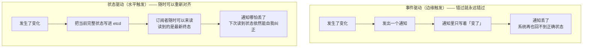
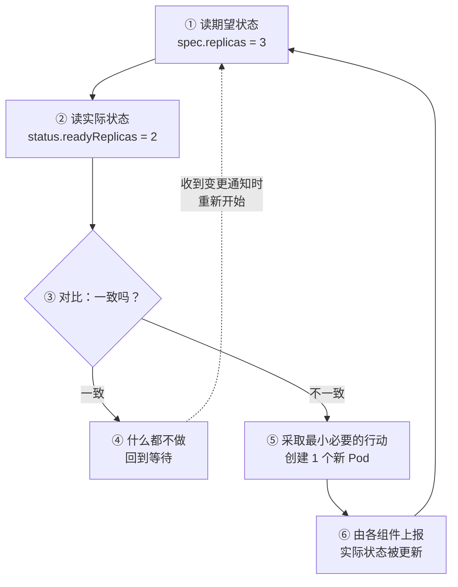
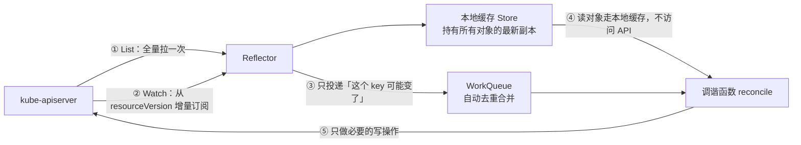
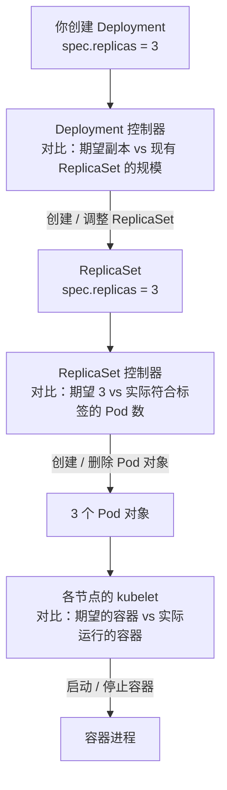

# 第 4 章　声明式 API 与控制器模式：K8s 的灵魂

> **本章导读**
> - 建议用时：60 分钟（含 20 分钟动手）
> - 前置知识：第 3 章（尤其要记得"控制器是调谐循环"和"etcd 只负责存和通知"）
> - 读完你应该能回答四个问题：
>   1. 控制器怎么"知道"状态变了？**如果那条变更通知丢了，会发生什么？**
>   2. 为什么同一个调谐函数跑 1 次和跑 1000 次，结果一模一样？
>   3. `resourceVersion` 是什么？两个控制器同时改一个对象怎么会不打架？
>   4. Deployment 为什么要转一手 ReplicaSet，而不是直接管 Pod？

前三章我们一直在重复一个词：**调和循环（Reconciliation Loop）**。第 1 章说它是"K8s 的核心思想"，第 3 章说"控制器就是一堆调谐循环"。但我们从来没有真正把它拆开过。

这一章就干这件事。**看完之后，你对 K8s 的理解会从"知道它怎么用"升级到"知道它凭什么能这么稳"。**

---

## 【积木 4-1】先问一个让事件驱动系统崩溃的问题

回到第 2 章结尾那个实验：你删掉了 `api-demo` 这个裸 Pod，它没有回来。

现在我们换个场景。假设它是被 Deployment 管的，你删掉它，会发生这样的事：

```
你：kubectl delete pod api-xxxx
       ↓ （大约 1 秒后）
你：kubectl get pods
NAME                    READY   STATUS    AGE
api-yyyy                1/1     Running   3s      ← 新的来了
```

**这个"补回来"的动作，是怎么触发的？**

最容易想到的答案是："Deployment 控制器收到了一个'Pod 被删除'的事件，于是它补一个。"

这个答案听起来没问题，但**它有一个致命缺陷**。请顺着往下想：

> **如果那条"Pod 被删除"的事件通知丢了呢？**

- 网络抖了一下，通知没送到
- 控制器进程正好在那一刻重启，没收到
- 控制器太忙，队列里的这条被覆盖了

**在传统的"事件驱动"系统里，这就是一次永久性数据不一致**——控制器永远不知道少了一个 Pod，你那个 Pod 就永远回不来了，除非有人手动干预。

而这种"偶尔丢一条通知"的事，在分布式系统里是**必然会发生**的（不是"可能"，是"必然"，只是概率问题）。

**但 K8s 不会因为这个丢 Pod。**为什么？

因为 K8s 的控制器的实现方式，跟"事件驱动"根本不是一个思路。这是本章的第一个、也是最重要的认知。

---

## 【积木 4-2】两套根本不同的哲学：边缘触发 vs 水平触发

这个概念借自操作系统里的**中断处理**，但理解它之后，你会看穿一大类分布式系统的设计。

### 边缘触发（Edge-triggered）：只告诉你"发生了变化"

```
事件：Pod api-xxxx 被删除了
```

**这种通知描述的是"一次状态变化（一个边缘）"。**它的致命问题是：

- 如果你错过了这个事件，**你无从知道"现在一共有几个 Pod"**
- 事件本身不携带"当前完整状态"这个信息
- 消息丢了 = 永久失忆

> 类比：家里的**火灾报警器**。它只在起火的那一刻响一声。你不在家，它就白响了，你回家后看不出"刚才是否着过火"。

### 水平触发（Level-triggered）：随时告诉你"当前是什么状态"

```
查询：现在集群里符合 app=cloudnote,component=api 的 Ready Pod 有几个？
回答：2 个
```

**这种通知描述的是"某个时刻的完整状态（一个水平面）"。**它的关键优势是：

- **你可以错过任何一次通知，只要你在下一次查询时重新对齐状态**
- 同一个状态你查 100 次，答案一样
- **丢失通知不会导致永久不一致，最多导致"纠正得晚一点"**

> 类比：**温度计**。你什么时候看，它都告诉你当前温度。你错过了一小时的读数，当前温度依然准确。

### K8s 的选择

**K8s 的控制器全部是水平触发的。**确切地说：

> 控制器**不关心"发生了什么变化"**，它只关心**"现在是什么状态"**。

对比一下同一个场景在两种范式下的差异：

| | 事件驱动（边缘触发） | 状态驱动（水平触发，K8s） |
|---|---|---|
| 控制器收到的信息 | "Pod 被删了" | "现在有 2 个 Ready 的 Pod" |
| 丢失通知的后果 | **永久不一致** | 暂时不一致，下次对齐就好 |
| 重复通知的后果 | 可能重复执行（要额外去重） | **无害**（看到状态一致就什么都不做） |
| 重启后的行为 | 丢失重启期间的所有事件 | **重新读一次状态，立刻恢复正确** |
| 对顺序的依赖 | 强依赖事件顺序 | **完全不依赖顺序** |

**最后三行就是 K8s 敢说"控制器可以随便重启"的全部理由。**

现在回头看积木 4-1 的问题——"如果通知丢了怎么办？"

**答案是：K8s 不依赖通知。**通知只是"提醒你去看看"的闹钟，只是一个**优化**（让你不必一直轮询）。真正的事实判断，每次都来自"读当前状态"。



> **记住这句话**：K8s 里的事件通知是**性能优化**，不是**正确性依赖**。这个区分，是理解一切控制器行为的地基。

---

## 【积木 4-3】把调和循环真正拆开

现在可以精确地描述这个循环了。



写成伪代码：

```python
def reconcile(key):                    # key = 对象的 namespace/name
    while True:
        desired = read_desired(key)    # ① 读期望
        actual  = read_actual(key)     # ② 读实际
        if is_equal(desired, actual):  # ③ 对比
            return                     # ④ 一致 → 什么都不做，退出
        take_minimal_action()          # ⑤ 不一致 → 做最小的修正
        # ⑥ 不假设结果，下一轮重新读一遍
```

这里有三个细节，每一个都对应一条工程纪律：

### 细节一：循环里没有"记忆"

注意代码里**没有任何变量保存上一轮的状态**。每一轮都**从头重新读**。

这不是偷懒，这是刻意的设计。原因：

- 缓存的状态可能是过期的（别人可能在你没看见的时候改了）
- 保存状态就意味着要处理"我的缓存和 etcd 不一致"的问题
- **不记状态，就不存在"状态不一致"**

> 对比很多人的直觉写法：`if not exists then create`。这种写法依赖于"上次我看到它不存在"这个**陈旧记忆**。K8s 的写法是 `ensure exactly 3 exist`——**不依赖记忆，只看当下**。

### 细节二：行动是"最小的"，不是"整套重建"

K8s 的控制器发现"要 3 个、只有 2 个"时，它**只创建 1 个**，而不是删掉重来。

这保证了：**循环跑得越频繁，代价越小**。一个健康的集群里，绝大部分调谐循环的结果是"什么都不做"（③ 直接走到 ④），几乎零成本。

### 细节三：判断依据是"数量匹配"，不是"对象身份"

ReplicaSet 控制器**不关心**"哪个具体的 Pod 存在"。它只关心"**符合标签选择器的 Ready Pod 有几个**"。

这个细节有一个非常反直觉的推论，我们在积木 4-10 的动手实验里会亲眼验证：**如果你把一个 Pod 的标签改掉，它会瞬间"脱离"这个 ReplicaSet 的统计，然后控制器会立刻补一个新的 Pod——而你改标签的那个 Pod 还活着，变成了孤儿。**

### 关于"最终一致"

调和循环不保证"立刻一致"，它保证的是**"最终一致（eventual consistency）"**：

```
不一致 → 纠正 → 再对比 → （可能又被人改坏）→ 再纠正 →……→ 最终稳定在期望状态
```

**K8s 从不承诺"任何时刻都符合期望"，它只承诺"会持续朝期望收敛"。**这个承诺弱一些，但它是**可以被工程上真正兑现的**——而"始终强一致"在分布式系统里做不到。

---

## 【积木 4-4】控制器怎么"知道"状态变了：List、Watch 与 WorkQueue

到这里，你可能会问一个问题：

> "既然是水平触发、每次都读完整状态，那控制器岂不是要**每秒钟轮询一次**？集群里有几万个对象，API Server 早就被打爆了。"

**对，纯轮询不可行。**K8s 的答案是：**用"事件"来知道"该去看一眼了"，用"读状态"来决定"该做什么"。**

这两件事分工明确：

- **事件**：负责唤醒（性能优化）
- **状态读取**：负责判断（正确性保证）

具体实现是 client-go 里的一套标准机制：



逐步解释这套机制：

### 第一层：List + Watch（由 Reflector 完成）

1. **先 List**：全量拉取一次所有关心的对象，拿到一个**版本号 `resourceVersion`**
2. **再 Watch**：从那个版本号开始，建立长连接订阅后续的变更
3. **断线了怎么办**：从上次收到的 `resourceVersion` 重新 Watch
4. **如果需要的历史版本已经被 etcd 压缩掉了**（etcd 会定期压缩旧版本）：**重新 List 一次**，从头对齐

**注意第 4 步——这就是"永远不会永久失忆"的技术兜底。**哪怕 Watch 断了一整天，回来重新 List 一次就完全对齐了。

### 第二层：本地缓存（Store / Indexer）

Watch 到的对象被存进本地的内存缓存。控制器要读对象时，**读的是本地缓存，不是 API Server**。

这带来一个数量级的性能差异：假设你要遍历 1000 个 Pod 做判断，走 API Server 就是 1000 次网络请求（或者一次大请求），走本地缓存就是 1000 次内存读取。

> 这也是为什么 K8s 集群能承载大量对象：**真正的读压力被分散到了每个组件自己的内存里。**etcd 只承担写和版本推送。

### 第三层：WorkQueue（工作队列）

变更事件不会直接调用调谐函数，而是被丢进一个队列。这个队列有两个关键设计：

| 设计 | 作用 |
|---|---|
| **去重（dedup）** | 同一个对象在 1 秒内变了 100 次，队列里**只保留一个 key**。控制器只调谐一次，读到的却是最新状态——**这正是水平触发的威力** |
| **限速重试（rate limiting）** | 调谐失败时，按指数退避重新入队（1s、2s、4s……），避免打爆集群 |

**去重这一条特别值得琢磨**：100 次变更合并成 1 次处理，为什么不会漏掉中间的某个状态？

**因为控制器根本不关心中间状态。**它只关心"最终读到的状态是不是期望的"。**这就是水平触发范式带来的简化。**

---

## 【积木 4-5】幂等性：为什么跑 1 次和跑 1000 次结果一样

现在回答导读里的第二个问题。

**幂等（Idempotent）**的定义：一个操作执行 1 次和执行 N 次，对系统产生的影响相同。

为什么控制器必须是幂等的？因为**这几种情况都会导致重复调用**：

- WorkQueue 去重后仍可能因为重试而重复投递
- 一次变更可能触发多个控制器链路，同一个对象的调谐被触发多次
- 控制器重启后会重新 List，所有对象都会被"重新调谐"一遍

### 一个不幂等的控制器长什么样

```python
# 反面教材
def reconcile():
    if not exists("backup-job"):
        create("backup-job")          # 看起来没问题？
```

问题在哪？**如果这个判断依赖于一份过期的读取**（比如本地缓存还停留在"不存在"的状态），或者**创建请求发出去了但响应丢了**，那么下一次调谐时：

- 它读到"不存在"（实际已经存在）→ 又创建一次
- 结果：创建了两个备份任务，重复备份

**根因是它做的是"执行一个动作"，而不是"让状态符合目标"。**

### 幂等的写法长什么样

```python
# 正确写法
def reconcile():
    desired = 3
    actual = count_ready_pods(label_selector="app=api")   # 每次都真实地数一遍
    if actual < desired:
        create(desired - actual)      # 只补差额
    elif actual > desired:
        delete(actual - desired)      # 只删多余的
    # 相等 → 什么都不做
```

对照一下：

| 维度 | 不幂等的写法 | 幂等的写法 |
|---|---|---|
| 判断依据 | "上次我看到什么" | "现在实际是什么" |
| 行动 | 执行一个动作 | 让状态逼近目标 |
| 重复执行 | 副作用累积 | **无副作用** |
| 断点恢复 | 可能重复或遗漏 | **自动正确** |

### 延伸辨析：幂等性和原子性是一回事吗？

**不是，而且它们根本不在同一个维度上。**

| | 幂等性（Idempotency） | 原子性（Atomicity） |
|---|---|---|
| 回答的问题 | **重复执行会怎样？** | **会不会做一半？** |
| 关注点 | 重复的安全性 | 不可分割性 |
| 好的形态 | 跑 N 次 == 跑 1 次 | 要么全成，要么全败 |
| 坏的形态 | 后果累加（跑 2 次加 200） | 留下中间脏状态（做了一半） |
| 一句话记忆 | **"可以重复"** | **"不可拆分"** |

**两者彼此正交**，可以组合出四种情况：

| | 原子 | 非原子 |
|---|---|---|
| **幂等** | `SET 余额 = 100`：跑 100 次余额都是 100，且单条语句不会做一半 | `docker pull nginx`：跑 100 次结果都一样，但可能中断在下载到一半 |
| **非幂等** | `余额 = 余额 + 100`：单条语句是原子的，但跑 2 次就是加 200 | 手工运维脚本：改配置 → 重启 → 发通知；中断留脏状态，重跑还会重复发通知 |

#### 一个容易记错的知识点：幂等性不在 ACID 里

ACID 里的 **A 是 Atomicity（原子性）**，另外三个是 Consistency（一致性）、Isolation（隔离性）、Durability（持久性）。

**幂等性（Idempotency）不属于 ACID**——它来自 HTTP 语义和分布式系统实践，讨论的是"操作重复执行的安全性"。所以当你看到有人把幂等和 ACID 混在一起谈时，可以知道对方把两个不同范畴的概念搅在一起了。

> 顺带补一句：HTTP 方法里，`GET` / `PUT` / `DELETE` 是**幂等**的，`POST` 是**非幂等**的。这也解释了为什么支付接口几乎都要你在请求头里带一个 `Idempotency-Key`——**那是用额外的机制，把一个非幂等的 `POST` 硬掰成幂等。**

#### 那么 K8s 用哪一个？

这是本节最有价值的推论。K8s 的选择是：

> **在"单个对象"的层面保证原子性；在"跨多个对象"的层面放弃原子性，改用幂等性 + 调和循环来兜底。**

具体到三层：

| 范围 | K8s 给了什么保证 | 靠什么实现 |
|---|---|---|
| **单个对象的写入** | **原子** | etcd 的事务：要么这个对象写成功，要么完全没写 |
| **单个对象的"读-改-写"** | **不丢失更新** | `resourceVersion` 乐观并发（相当于 CAS） |
| **跨多个对象的操作** | **没有任何原子性保证** | 靠**幂等 + 调和循环 + 最终一致**兜底 |

第三行是关键。回到积木 4-7 那条链：你创建一个 Deployment，它会依次产生 **Deployment → ReplicaSet → 3 个 Pod → 3 个容器**，这中间有**七八次独立的写入**。

**如果第 2 个 Pod 创建失败了怎么办？**

- **没有事务**：不会"回滚"掉整个 Deployment
- **不需要事务**：控制器下一轮调谐会发现"期望 3 个、实际 2 个"，**再补 1 个就好**

**这就是为什么 K8s 根本不需要分布式事务。**分布式事务（两阶段提交那类）代价极高、性能差、还容易在协调者故障时卡死；而"幂等 + 最终一致"用更低的成本达到了工程上够用的效果。

> **一句话总结这个取舍**：K8s 不追求"任何时刻都正确"，它追求"**错了会自己纠正**"。这两条路都能到达正确状态，但后者的实现代价低一个数量级——**前提是每一步都必须幂等。**

#### 实用对照：你要的保证，谁来提供

| 你的需求 | 谁能提供 | 你要做什么 |
|---|---|---|
| 改一个对象的字段，不能只改一半 | **API Server / etcd**（已提供） | 什么都不用做 |
| 两个控制器同时改一个对象，不能丢更新 | **API Server**（`resourceVersion`） | 冲突时整轮重来 |
| 保证集群里始终有 3 个 Pod | **你的控制器** | `reconcile` 必须幂等 |
| 建 Deployment + ConfigMap + Secret，要"要么全成要么全不成" | **没有人** | 自己设计补偿或先决检查（例如用 init 容器校验前置条件） |

最后一行是个真实的工程痛点：**K8s 里没有"跨对象事务"，所以"一套资源要么全成要么全不成"这种需求，必须由你自己设计。**常见做法有两种：

1. **让操作天然幂等**：`kubectl apply -f dir/` 本身就是幂等的，多跑几次无害，失败就重跑。
2. **加前置校验**：让主容器用 init 容器去检查"依赖的资源都齐了吗"，不齐就卡住等，而不是带着残缺状态启动。

### 一条非常重要的实践纪律

**在 `reconcile` 里不要做不可逆的、有外部副作用的操作。**例如：

- 不要直接发通知邮件、发短信
- 不要直接扣款、下单
- 不要直接调用外部 API 做破坏性操作

如果确实要做，**必须自带幂等保护**：比如先写一条"这件事已经做过了"的记录（K8s 里常见做法是创建一个带特定名字的 Job 或写一个 Annotation，用"创建是否成功"来天然去重——**因为对象名重复创建会失败**，这本身就是一种幂等锁）。

> 记住这个顺序：**先看状态，再决定动作；宁可多跑几轮，也不要重复产生副作用。**

---

## 【积木 4-6】resourceVersion 与乐观并发：两个控制器怎么不打架

导读里的第三个问题。

### 问题场景

假设 HPA（自动扩缩容控制器，第 12 章）和你同时在操作同一个 Deployment：

```
T0: 你      读取 Deployment，看到 replicas = 3
T0: HPA     读取 Deployment，看到 replicas = 3
T1: 你      计算后决定改成 5，写回
T2: HPA     计算后决定改成 4，写回
     ↓
     结果 = 4。你的改动被无声无息地覆盖了。
```

这个场景在分布式系统里叫**丢失更新（Lost Update）**。传统解法是**悲观锁**（改之前先锁住），但分布式锁代价高、容易死锁、锁持有者挂了还得处理超时。

### K8s 的解法：乐观并发 + resourceVersion

`resourceVersion` 是 etcd 给**每个对象的每一次修改**打的版本号，随修改单调递增。

规则很简单：

> **写回的时候，要带上你读到的那个 `resourceVersion`。如果这个对象在你读完之后被别人改过（版本号变了），API Server 直接拒绝你的写入，返回 `409 Conflict`。**

流程变成：

```
T0: 你  读取，拿到 resourceVersion = 1234
T0: HPA 读取，拿到 resourceVersion = 1234
T1: 你  写回（带 rv=1234）→ 成功，版本号变成 1235
T2: HPA 写回（带 rv=1234）→ ❌ 409 Conflict！因为现在是 1235 了
T3: HPA 收到冲突 → 重新读取（拿到 rv=1235）→ 重新计算 → 写回（带 rv=1235）→ 成功
```

**没有任何锁，冲突被发现了，双方的数据都没丢。**这就是**乐观并发（Optimistic Concurrency）**：假设冲突很少发生，先干活，写的时候检查一下。

### 你可能已经见过它

```bash
kubectl apply -f api-deployment.yaml
# error: the object has been modified; please apply your changes to the latest version
```

**这个报错就是乐观并发在起作用。**它意味着：在你读取和写入之间，有别人（可能是 HPA、可能是另一个人的 kubectl）改过这个对象。

处理方式也很简单：**重新读一遍，再改。**

### 一个重要的推论：控制器必须能"重来"

因为冲突是**正常现象**，控制器的调谐函数必须写成"失败了就整轮重来"：

```python
def reconcile(key):
    while True:
        obj = get(key)                     # 读（含 resourceVersion）
        obj.spec.replicas = compute(obj)   # 算
        try:
            update(obj)                    # 写（带 resourceVersion）
            return                         # 成功
        except ConflictError:
            continue                       # 冲突 → 整轮重来（回到 while 顶部）
```

client-go 把这个模式封装成了 `retry.RetryOnConflict`，几乎所有官方控制器都在用。

### 顺带说清 patch 和 update 的区别

| | Update | Patch |
|---|---|---|
| 语义 | **全量替换**：你给什么，对象就是什么 | **部分修改**：只动你指定的字段 |
| 风险 | 你没写的字段可能被清掉 | 只影响你声明的部分 |
| 冲突检测 | 必带 `resourceVersion` | 可选 |
| 谁在用 | 控制器（它手上通常有完整对象） | `kubectl`、HPA 这类"只想改一两个字段"的场景 |

这就解释了一个现象：**为什么 `kubectl edit` 有时会报冲突，而 `kubectl scale` 几乎不报？**因为 `scale` 用的是 patch（只改 `replicas` 一个字段），而 `edit` 通常是全量 update。

---

## 【积木 4-7】对象图：为什么 Deployment 要转一手 ReplicaSet

现在看一个 K8s 里最经典的"控制器链"。



**四层，三个控制器，一个 kubelet。**每一层都只会：
1. 读自己关心的那个对象的 `spec`
2. 对比实际
3. 调整**下一层**对象的数量或内容

### 为什么不直接一步到位：Deployment 直接管 Pod？

这是经典面试题。答案是：**ReplicaSet 提供了一次"版本快照"的载体。**

滚动更新的本质是什么？第 5 章会详细讲，但这里可以先给结论：

```
滚动更新 = 新建一个 ReplicaSet（v2，副本数从 0 开始）
         + 旧 ReplicaSet（v1，副本数降到 0）
         两者的副本数此消彼长
```

所以 Deployment 管理的其实是**一组 ReplicaSet**，它要保证的核心不变量是：

> **所有 ReplicaSet 的副本数之和 = 期望副本数**，且新版本的比例逐步升高。

**Deployment 管"版本与规模的比例"，ReplicaSet 管"数量准确"。**职责分开了，回滚也自然成立——回滚就是把 v1 的副本数调回去，v2 的降下来。

> 你可以用一个命令验证这个结构：
> ```bash
> kubectl get rs -n cloudnote --show-labels
> kubectl describe deploy api -n cloudnote | grep -A2 Events
> ```

### 附带一个必知的机制：OwnerReference 与级联删除

控制器创建下一层对象时，会在子对象里写一条"我的主人是谁"：

```yaml
metadata:
  ownerReferences:
    - apiVersion: apps/v1
      kind: ReplicaSet
      name: api-7d4b9c8f5
      uid: 8f2c...
```

这条引用带来了三个你可能天天在用、但不知道为什么的功能：

| 现象 | 背后的机制 |
|---|---|
| `kubectl delete deploy api` 会把 Pod 也删掉 | **级联删除**：垃圾回收器（GC）沿着 ownerReference 往下清理 |
| `kubectl delete deploy api --cascade=orphan` 会留下 Pod | 显式告诉 GC "只删主人，别管子对象" |
| `kubectl get pod api-xxxx -o yaml` 里能看到 `ownerReferences` | 这就是"这个 Pod 是谁生的"的证明 |

**K8s 里对象之间的"从属关系"是靠 `ownerReferences` 表达的，"引用关系"（Service 找 Pod、Deployment 找 RS）则是靠 `labels` + `selector` 表达的。**这两套机制要分清楚：

| 机制 | 用途 | 例子 |
|---|---|---|
| **ownerReferences** | **所有权与生命周期**（谁生谁、删谁连带删谁） | RS → Pod |
| **labels / selector** | **查询与匹配**（谁是"我这一类"） | Service → Pod |

> 在第 1 章我们说"标签是 K8s 的关系型数据库外键"，现在可以补上后半句：**标签管"找得到"，ownerReference 管"管得着"。**

---

## 【积木 4-8】控制器的完整形态，以及 Operator 的由来

把前面所有零件拼起来，一个"K8s 味道"的控制器长这样：

```
① 定义你要关心什么
   - 哪些资源类型（Deployment？Pod？还是你自己定义的 CRD？）
   - 用什么条件筛选

② 建立 informer（List + Watch + 本地缓存）

③ 变更事件进入 WorkQueue（去重 + 限速）

④ 从队列取出一个 key → 从缓存读出对象

⑤ 执行 reconcile：
   - 幂等
   - 每次重新读状态
   - 只做最小必要的写操作
   - 冲突了就整轮重来
   - 不做有副作用的不可逆操作

⑥ 写回 API Server（这会触发别人的 informer，形成下一环）
```

### 三种写控制器的方式

| 方式 | 适用 | 说明 |
|---|---|---|
| **client-go 手写** | 学习、定制化极高的场景 | 要自己搭 informer、queue、重试 |
| **controller-runtime / kubebuilder** | 生产主流 | 把上面 ①~⑥ 的模板都封好了，你只写 reconcile 函数体 |
| **Operator SDK / kubebuilder 脚手架** | 生态项目 | 生成骨架 + 打包分发 |

### Operator 到底是什么

现在可以给出一个非常精确的定义了：

> **CRD（自定义资源）+ 控制器 = Operator。**

拆开说：

- **CRD（Custom Resource Definition）**：你告诉 K8s"我要定义一种新的对象类型"，比如 `kind: MySQLCluster`。定义完之后，你就能像写 Deployment 一样写 `MySQLCluster` 的 YAML 了。
- **控制器**：你写一段代码，告诉 K8s"当有人创建了 `MySQLCluster` 时，应该把实际的 MySQL 集群调谐成什么样"。

**于是你就把"运维一个 MySQL 集群"这件事，变成了一个"声明式的对象"。**

这就是为什么会有 Prometheus Operator、Kafka Operator、Cert-Manager 这些东西——它们把各自领域的复杂运维知识，封装成了"你写一个 YAML，剩下交给控制器"。

> **这也是第 1 章"原则三：松耦合 + 可扩展"的兑现方式。**K8s 没有把"什么是一个应用"写死在代码里，它给了你一个框架，让你自己去定义。

---

## 【积木 4-9】"声明式"的适用边界：什么时候不该用它

课程讲到这里，容易产生一种"声明式什么都能干"的错觉。这里必须泼一盆冷水。

### 声明式擅长什么

**"稳定状态"类需求**——你希望系统**持续处于**某个状态：

- 要有 3 个副本，且一直保持
- 数据库要有 100GB 存储，且一直可用
- 证书要一直有效（过期前自动续）
- 域名要一直指向某个地址

**特征：目标是"一个状态"，而不是"一次动作"。**

### 声明式不擅长什么

**"一次性动作"类需求**——你只希望它**发生一次**：

- 给所有用户发一封通知邮件
- 执行一次数据库 schema 迁移
- 生成一份昨天为止的报表

**特征：目标是"一个已完成的事实"，而不是"一个持续的状态"。**

如果你硬要用声明式表达"发一次邮件"，会立刻遇到尴尬的问题：**"期望状态"是什么？**"邮件已发出"这个状态是没法持续维持的——你无法让系统"保持邮件已发出"，因为它已经发出去了，再调谐一次就会再发一次。

### K8s 怎么处理这类需求

它提供了两个"半声明式"的折中工具（第 13 章详讲）：

| 对象 | 语义 | 为什么算半个声明式 |
|---|---|---|
| **Job** | "这个任务要成功完成一次" | 期望状态是"成功完成数 = 1"，控制器保证**至少有一个 Pod 成功退出**，成功后就不再动作 |
| **CronJob** | "按时间表产生 Job" | 期望状态是"该产生的 Job 都产生了" |

**注意 Job 的巧妙之处**：它把"执行一次动作"**转换成了**"保持一个计数器 = 1"。这仍然是状态，而不是动作——**这是把命令式需求塞进声明式框架的标准手法**，你自己写控制器时也可以借用这个思路。

### 一个实用判断表

| 你的需求 | 该用什么 |
|---|---|
| 保持 3 个副本在跑 | Deployment（声明式） |
| 跑一次数据迁移 | Job（半声明式） |
| 每天凌晨跑一次备份 | CronJob（半声明式） |
| 给用户发一封邮件 | **不要用 K8s 的资源对象**，用你的应用逻辑 + 消息队列 |
| 重启一下某个服务 | `kubectl rollout restart`（这是命令，但结果是"让 Pod 重建"这个状态） |

> **一条实用准则**：如果一个需求**天然有"做完"这个属性**，就别硬把它声明化。强行声明化的代价通常是"需要额外发明一套去重机制"，反而更脆。

---

## 【积木 4-10】动手：亲眼看见调和循环在工作

理论讲完了。这一节的实验会让你**第一次真正"看见"调和循环**。

配套脚本已经写好：

```bash
bash cases/cloudnote/tools/reconcile-lab.sh
```

如果你想手动一步步做，下面是完整流程。**每一步都请仔细看输出的时间戳和 Pod 名字的变化。**

### 实验一：删掉一个 Pod，看它被补回来

```bash
# 先准备一个 3 副本的 Deployment（第 5 章会详细讲，这里先用）
kubectl create deployment api-lab -n cloudnote \
  --image=nginx:1.27-alpine --replicas=3

kubectl get pods -n cloudnote -l app=api-lab
```

你会看到 3 个 Pod。现在删掉其中一个：

```bash
# 先记下被删的 Pod 名，最后对比用
VICTIM=$(kubectl get pods -n cloudnote -l app=api-lab -o jsonpath='{.items[0].metadata.name}')
echo "即将删除：$VICTIM"

kubectl delete pod "$VICTIM" -n cloudnote

# 立刻看（可能需要多试几次才能抓到中间态）
kubectl get pods -n cloudnote -l app=api-lab
```

**观察点**：

1. `$VICTIM` 那个名字**永远不会再出现**了
2. 有一个**全新的名字**出现了（Deployment 生成的 Pod 名带随机后缀）
3. 整个过程**大约 1 秒**——这就是调和循环的响应速度

**关键问题**：控制器是怎么知道要补的？

**它不需要知道。**它只是收到了一个"有个 key 可能变了"的通知（Pod 列表变了），于是**重新数了一遍**："期望 3，实际 2，那补 1 个。"

### 实验二：把 Pod 的标签改掉，制造"孤儿"

这是最能说明问题的实验。ReplicaSet 是靠**标签选择器**来统计 Pod 的：

```bash
# 挑一个 Pod，把它的标签改掉，让它"脱离"选择器
ORPHAN=$(kubectl get pods -n cloudnote -l app=api-lab -o jsonpath='{.items[0].metadata.name}')
kubectl label pod "$ORPHAN" -n cloudnote app=somebody-else --overwrite

# 立刻观察
kubectl get pods -n cloudnote -l app=api-lab
kubectl get pod "$ORPHAN" -n cloudnote --show-labels
```

**你会看到惊人的一幕**：

1. ReplicaSet 立刻数出"符合 `app=api-lab` 的 Pod 只有 2 个"→ **补了第 3 个**
2. 而那个被你改标签的 `$ORPHAN` **还活着**（Running），但它现在不属于任何 ReplicaSet 了
3. 于是你拥有了 **4 个 Pod**：3 个在 RS 名下 + 1 个孤儿

**这个实验证明了三件事**：

- 控制器的判断依据是**"数量匹配"**，不是"具体哪个 Pod"
- 控制器**完全不管"谁是谁"**，它只数数
- **标签是 K8s 里对象之间"关系"的唯一凭据**——改了标签，关系就断了

清理一下：

```bash
kubectl delete pod "$ORPHAN" -n cloudnote
kubectl delete deployment api-lab -n cloudnote
```

### 实验三：看它如何"收敛"到任意目标值

```bash
kubectl create deployment api-lab -n cloudnote --image=nginx:1.27-alpine --replicas=1
kubectl get pods -n cloudnote -l app=api-lab

# 扩到 5
kubectl scale deployment api-lab -n cloudnote --replicas=5
kubectl get pods -n cloudnote -l app=api-lab -w
# 按 Ctrl+C 退出

# 缩到 2（观察它是"按数量删"，而不是"删掉某个特定 Pod"）
kubectl scale deployment api-lab -n cloudnote --replicas=2
kubectl get pods -n cloudnote -l app=api-lab
```

**重复 `scale` 到同一个数字 100 次，结果完全一样——这就是幂等。**

### 实验四：捕捉一次"冲突"

这个实验有点"手快"的要求，但值得一试：

```bash
# 开两个终端，几乎同时对这个 Deployment 做不同的修改
# 终端 A：
kubectl patch deployment api-lab -n cloudnote --type=merge -p '{"spec":{"replicas":4}}'

# 终端 B（同时执行）：
kubectl patch deployment api-lab -n cloudnote --type=merge -p '{"spec":{"replicas":6}}'
```

用 `patch` 很难复现冲突（因为 patch 是部分更新，且默认不带 `resourceVersion`）。想稳定复现，用全量 `update`：

```bash
# 拿到完整对象，改掉副本数，再写回
kubectl get deployment api-lab -n cloudnote -o json > /tmp/d.json
# 手动把 /tmp/d.json 里的 replicas 改一下，然后：
kubectl replace -f /tmp/d.json
```

如果你在"读取"和"写回"之间用另一个终端改了这个对象，就会看到：

```
Error from server (Conflict): Operation cannot be fulfilled on deployments.apps "api-lab":
the object has been modified; please apply your changes to the latest version and try again
```

**这个错误信息就是积木 4-6 讲的乐观并发的实体。**

### 实验五：把"控制器的眼睛"蒙上

最后一个实验很直观。先把 Deployment 的副本数固定：

```bash
kubectl scale deployment api-lab -n cloudnote --replicas=3
```

然后**快速连续删除两个 Pod**：

```bash
PODS=$(kubectl get pods -n cloudnote -l app=api-lab -o jsonpath='{.items[*].metadata.name}')
for p in $PODS; do kubectl delete pod "$p" -n cloudnote & done
wait
kubectl get pods -n cloudnote -l app=api-lab
```

**结果依然会收敛到 3 个。**

这里发生的事很值得琢磨：多个删除事件几乎同时到达，WorkQueue 可能把它们**去重合并成一次**（或几次）调谐。但无论合并与否，控制器每次都会**重新数一遍**——只要最终数出来不是 3，就继续补。

**这就是"水平触发 + 去重队列"组合起来的威力：它不依赖任何一个事件被完整送达。**

清理：

```bash
kubectl delete deployment api-lab -n cloudnote
```

---

## 【本章小结】

### 四句话总结

1. **K8s 的控制器是水平触发（状态驱动）的，不是边缘触发（事件驱动）的。**它不关心"发生了什么变化"，只关心"现在是什么状态"。**所以丢事件不会导致永久不一致**——这是所有其他特性的地基。
2. **调和循环不记状态、不假设结果、只做最小必要的修正**，因此天然幂等，允许重复执行；它保证的是**最终一致**，而不是任何时刻的强一致。
3. **Watch 是优化，读状态才是正确性来源**。List + Watch 负责唤醒，本地缓存负责高效读取，WorkQueue 负责去重与限速重试。
4. **`resourceVersion` 实现乐观并发**：写回时带上读到的版本号，被别人改过就返回 409，控制器整轮重来。**冲突是正常现象，不是异常。**

### 一张图收尾

```
   ┌─────────────────────────────────────────────────────────┐
   │                    K8s 的做事方式                        │
   └─────────────────────────────────────────────────────────┘

   你只写「期望状态」                              spec: replicas = 3
          │                                              ▲
          │ 存进 etcd                                     │ 写回
          ▼                                              │
   ┌─────────────┐   变更通知（只是闹钟）          ┌───────┴────────┐
   │    etcd     │ ─────────────────────────────► │  控制器 / kubelet │
   │ （只存不思考）│                                │  （真正会思考）   │
   └─────────────┘ ◄───────────────────────────── └───────┬────────┘
          完整状态（才是判断依据）                          │
                                                          │
                                          ┌───────────────┴──────────────┐
                                          │  每次重新读状态，不依赖记忆    │
                                          │  幂等：跑 1 次和 1000 次一样   │
                                          │  冲突就重来，保证最终收敛      │
                                          └──────────────────────────────┘
```

### 自测题

1. 什么是"边缘触发"和"水平触发"？为什么 K8s 选后者？（积木 4-2）
2. 假设一条"Pod 被删除"的通知彻底丢了，K8s 会怎样？为什么？（积木 4-2、4-4）
3. 调和循环里为什么**不保存上一轮的状态**？这样做换来了什么？（积木 4-3）
4. WorkQueue 把 100 次变更去重成 1 次处理，为什么不会漏掉中间状态？（积木 4-3、4-4）
5. 判断下面这句话是否幂等：`if not exists(x) then create(x)`。为什么？（积木 4-5）
6. 幂等性和原子性各回答什么问题？它们互相排斥吗？为什么说幂等性不属于 ACID？（积木 4-5）
7. K8s 在"单个对象"和"跨多个对象"上分别给了什么保证？为什么它不需要分布式事务？（积木 4-5）
8. `resourceVersion` 的作用是什么？为什么 K8s 不直接用悲观锁？（积木 4-6）
9. `kubectl apply` 报 `the object has been modified` 是什么意思？正确做法是什么？（积木 4-6）
10. Deployment 为什么不直接管 Pod，中间要加一层 ReplicaSet？（积木 4-7）
11. `ownerReferences` 和 `labels/selector` 分别表达什么关系？各举一个例子。（积木 4-7）
12. "给用户发一封邮件"适合用声明式表达吗？Job 是怎么把"一次性动作"塞进声明式框架的？（积木 4-9）

### 下一章预告

**第 5 章：把应用跑起来 —— Deployment 与滚动更新**

有了这一章的基础，第 5 章会变得非常好懂，因为我们会看到**调和循环在一次真实发布中是如何"接力"的**：

> 你改了镜像版本，Deployment 控制器做了什么？那个"新旧 ReplicaSet 此消彼长"的过程，具体是以什么节奏推进的？`maxSurge` 和 `maxUnavailable` 在控什么？为什么滚动更新到一半发现 bug 时，`kubectl rollout undo` 能在几秒内回到旧版本？还有那个让无数人踩坑的 `progressDeadlineSeconds`——为什么 Deployment 会"卡住"十分钟不动？

这一章我们会真正把 CloudNote 的 `api` 服务发布起来，并**故意发布一个坏版本，然后回滚**。

---

*学完本章，回到对话里说一句「继续」，我就开讲第 5 章。*
