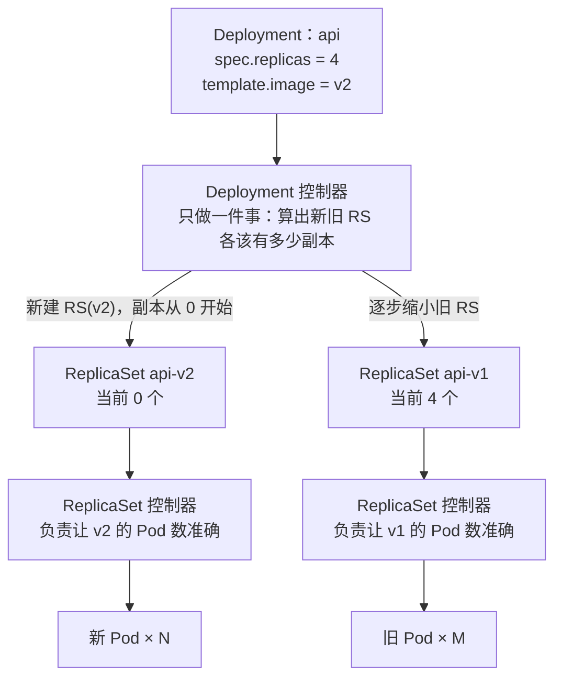
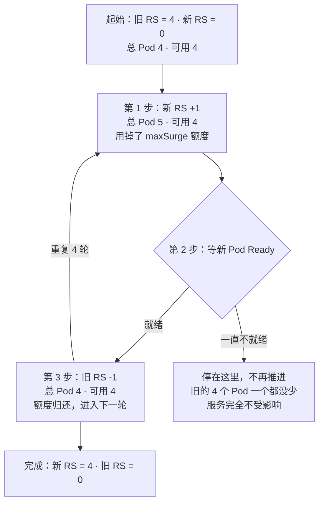
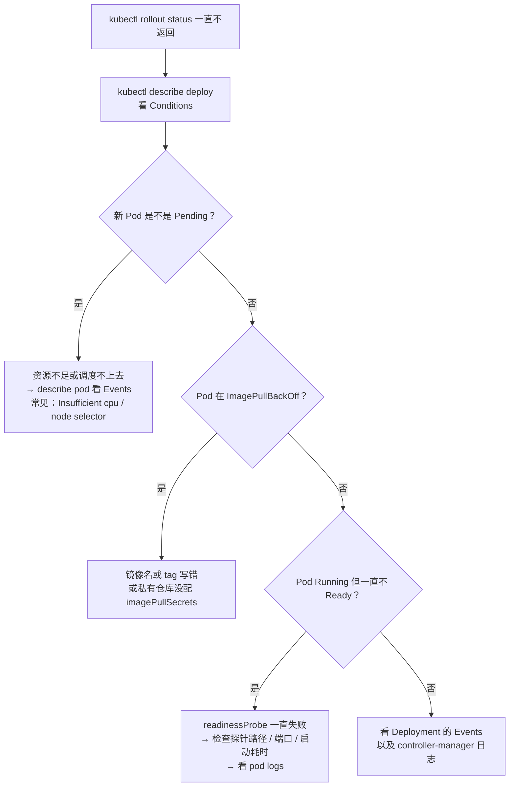

# 第 5 章　把应用跑起来：Deployment 与滚动更新

第 4 章说明了控制器如何思考。从本章开始，原理要落成可执行的操作：把一个真实应用发布出去，观察它滚动更新，再故意发布一个坏版本并回滚。

Deployment 是 Kubernetes 中使用频率最高的对象，也是最容易"会写但不理解"的对象。本章沿着它的工作方式展开：它为什么不直接创建 Pod，而要经过 ReplicaSet；`maxSurge` 与 `maxUnavailable` 这两个数字如何决定发布的节奏与风险；就绪探针在其中扮演什么角色；以及 `kubectl rollout undo` 回滚的究竟是什么。

所需的前置结论已经具备：

| 第 2 章的结论 | 第 4 章的结论 |
|---|---|
| 裸 Pod 删了不会回来 | ReplicaSet 保证"数量"准确 |
| Pod 是一次性的，改不了就重建 | 控制器靠"数数"来决定做什么 |
| Pod IP 不稳定 | 冲突是正常的，重来就行 |

还缺的只有一样东西：**版本**。

---

### 5.1 Deployment 到底多做了哪两件事

先看 ReplicaSet 已经能做什么。如果直接用 ReplicaSet 管理应用，你得到的是：

- 副本数保证（Pod 挂了自动补）
- 手动改 `spec.template` 时，它会把**所有旧 Pod 全部删掉，再全部建新的**——因为它只管数量，不管"过渡"

这个"全删全建"的过程叫 **Recreate**，它有一个致命问题：**中间有几十秒到几分钟的完全不可用**。

Deployment 在 ReplicaSet 之上补了两件事：

| 能力 | 说明 |
|---|---|
| **滚动更新（Rolling Update）** | 逐批替换，过程中始终保留足够多的可用副本，**用户无感知** |
| **版本历史与回滚** | 每次更新留下一个"版本快照"，出问题可以秒级切回去 |

再加上它继承自 ReplicaSet 的副本保证，Deployment 一共提供四件事：

**副本保证 + 滚动更新 + 版本历史 + 回滚。**

所以一句话定义：

> **Deployment 是"无状态应用的版本管理器"。**它管理的是"某个镜像的某个版本，应该有多少份同时在跑"。

关键词是**无状态**。如果你的应用需要"稳定的身份 + 独立的存储 + 有序启停"（数据库、消息队列），那要用第 13 章的 **StatefulSet**。Deployment 建立的假设是：**所有副本完全对等、可以随便替换任何一个。**

---

### 5.2 把一个真实的 Deployment 逐行看懂

下面是 CloudNote 的 `api` 服务在生产环境的 Deployment。每一行都有理由，逐个说明。

文件位置：`cases/cloudnote/20-api-deployment.yaml`

**一个说明**：CloudNote 真实的 `api` 镜像监听 **8080**。但为了让本章实验在**任何机器上都能直接跑起来**（不需要私有镜像仓库），下面这份清单用公开的 `nginx` 镜像代替——它默认监听 **80**。

等你换成真实镜像时，把 `containerPort`、探针端口、以及后面 Service 的 `targetPort` 一起改成 `8080` 即可。**除此之外的每一个字段，都是生产可直接照抄的。**

```yaml
apiVersion: apps/v1
kind: Deployment
metadata:
  name: api
  namespace: cloudnote
  labels:
    app: api
    app.kubernetes.io/name: api
    app.kubernetes.io/part-of: cloudnote
  annotations:
    # 每次发布都更新它，rollout history 里才会显示人能看懂的原因
    kubernetes.io/change-cause: "初始发布 v1"
spec:
  # ① 要几个副本
  #    生产上无状态服务建议 >= 2，否则发布期间会短暂中断
  replicas: 2

  # ② 标签选择器：Deployment 用它「认领」属于自己的 Pod
  selector:
    matchLabels:
      app: api

  # ③ 更新策略
  strategy:
    type: RollingUpdate
    rollingUpdate:
      maxSurge: 1
      maxUnavailable: 0

  # ④ 保留多少个历史版本
  revisionHistoryLimit: 10

  # ⑤ 进度停滞多久算失败
  progressDeadlineSeconds: 600

  # ⑥ Pod 模板：新 Pod 长什么样
  template:
    metadata:
      labels:
        app: api                    # ← 必须能被上面的 selector 匹配到！
    spec:
      containers:
        - name: api
          image: nginx:1.27-alpine  # ← 换成 CloudNote 的真实镜像（监听 8080）
          ports:
            - name: http            # 给端口起名字，Service 可以用 targetPort: http 引用
              containerPort: 80
          env:
            - name: VERSION
              value: "v1"           # 实验中靠改它来触发一次「发布」
          resources:
            requests: { cpu: 50m, memory: 64Mi }
            limits:   { cpu: 200m, memory: 128Mi }
          readinessProbe:
            httpGet: { path: /, port: http }
            initialDelaySeconds: 2
            periodSeconds: 3
          livenessProbe:
            httpGet: { path: /, port: http }
            initialDelaySeconds: 5
            periodSeconds: 10
```

#### ① `selector` 和 `template.labels` 的关系是硬约束

这是新手最容易踩的坑，而且**报错信息不友好**。规则是：

**`spec.selector.matchLabels` 必须能匹配到 `spec.template.metadata.labels`。否则 API Server 直接拒绝创建。**

为什么？回到第 4 章那个实验——ReplicaSet 是靠标签"数数"的。如果 `selector` 认领不到自己的 Pod，会发生两件灾难性的事：

1. 它数出"符合条件的是 0 个"，于是疯狂创建新 Pod —— **无限增长**
2. 或者它把所有别人的 Pod 都算成自己的，然后**去删别人的 Pod**

所以 K8s 在入口就把这个错误拦住了。报错长这样：

```
The Deployment "api" is invalid: spec.template.metadata.labels: Invalid value:
`map[string]string{"app":"api"}` does not match `map[string]string{"app":"web"}`:
`selector` does not match template `labels`
```

**还有一个更隐蔽的坑：`selector` 创建后不可修改。**它是 **immutable** 的。

```bash
kubectl patch deployment api -n cloudnote \
  -p '{"spec":{"selector":{"matchLabels":{"app":"api2"}}}}'
# The Deployment "api" is invalid: spec.selector: Invalid value: ... field is immutable
```

为什么不让改？因为改了选择器，意味着"这个 Deployment 从此认领另外一批 Pod"。K8s 无法安全地判断"那原来那批 Pod 该怎么办"，所以干脆禁止，让你删掉重建。

#### ② `strategy` 里的两个数字，是本章的核心

```yaml
strategy:
  type: RollingUpdate
  rollingUpdate:
    maxSurge: 1
    maxUnavailable: 0
```

- `maxSurge: 1`：滚动过程中，**最多允许多出 1 个** Pod（超出 `replicas` 的部分）
- `maxUnavailable: 0`：滚动过程中，**最多允许 0 个** Pod 不可用

这两个值组合起来的效果是：**先建新的，等它就绪，再删旧的——全程可用副本数不低于 replicas。**这是最保守、最安全、最适合面向用户服务的配置。代价是**发布时需要额外的资源**（峰值 5 个 Pod 而不是 4 个）。

第 5.4 节会把这个过程走一遍。

#### ③ `revisionHistoryLimit` 决定了"能回滚多远"

默认 10。它的物理含义是：**保留多少个旧 ReplicaSet。**

**旧 ReplicaSet 不是"日志"，它是能直接复活的实体**——这就是回滚能秒级完成的原因。

如果把它设成 `0`，那你就**失去了回滚能力**（旧 RS 会被立即清理）。这是一个非常危险的"优化"。

#### ④ `progressDeadlineSeconds` 决定了"卡住多久算失败"

默认 600 秒。它不"杀死"任何东西，只是**给 Deployment 打一个标记**：

```
Progressing   False   ProgressDeadlineExceeded
```

**注意：它不会自动回滚。**第 5.8 节会专门讲这个坑。

---

### 5.3 发布时，三层是怎么接力的

第 4 章给出过 Deployment → ReplicaSet → Pod 的链条。下面看它在**发布时**的具体分工：



**关键洞察**：

- **Deployment 控制器从来不直接管 Pod。**它只管**两个 ReplicaSet 的副本数之和与比例**。
- **ReplicaSet 控制器也不管版本。**它只负责"我名下要有 M 个 Pod"。
- 两者通过**各管一层**实现了解耦。

所以滚动更新的本质，可以浓缩成一句：

> **新建一个 ReplicaSet（新版本，副本从 0 开始），然后让新旧两个 ReplicaSet 的副本数此消彼长。**

你可以用这个命令亲眼看到那两个 RS：

```bash
kubectl get rs -n cloudnote -o wide
# NAME              DESIRED   CURRENT   READY
# api-6b8c9d7f4     4         4         4        ← 新的
# api-5a7f2c8e1     0         0         0        ← 旧的（留着，随时能复活）

kubectl get rs -n cloudnote -o jsonpath='{range .items[*]}{.metadata.name}{"\t"}{.spec.template.spec.containers[0].image}{"\n"}{end}'
```

**RS 的名字不是随机的**：`api-6b8c9d7f4` 里的 `6b8c9d7f4` 是 Pod 模板的哈希值。**模板一变，哈希就变，就是一个新 RS。**这也是 K8s 判断"要不要新建 RS"的依据——它算哈希，不比较字段。

---

### 5.4 滚动更新的节奏：maxSurge 与 maxUnavailable

现在把第 5.2 节的 `maxSurge: 1` / `maxUnavailable: 0` 和 4 个副本走一遍完整过程。

#### 先把两条不变量写清楚

```
允许的 Pod 总数上限  = replicas + maxSurge        = 4 + 1 = 5
允许的可用 Pod 数下限 = replicas - maxUnavailable  = 4 - 0 = 4
```

**Deployment 控制器每做一步，都要检查这两条不变量。**这是理解整个滚动过程的钥匙——**它不是"按固定脚本走"，而是"在约束内尽可能地推进"。**

#### 循环：每换一个副本，走三步



完整展开一遍（4 个副本）：

| 时刻 | 旧 RS | 新 RS | 总 Pod | 可用 Pod | 动作 | 检查 |
|---|---|---|---|---|---|---|
| T0 | 4 | 0 | 4 | 4 | 开始 | — |
| T1 | 4 | 1 | 5 | 4 | 扩新 RS | 总 5 ≤ 5  |
| T2 | 4 | 1 | 5 | **5** | 新 Pod 就绪 | — |
| T3 | 3 | 1 | 4 | 4 | 缩旧 RS | 可用 4 ≥ 4  |
| T4 | 3 | 2 | 5 | 4 | 扩新 RS | 总 5 ≤ 5  |
| T5 | 3 | 2 | 5 | 5 | 新 Pod 就绪 | — |
| T6 | 2 | 2 | 4 | 4 | 缩旧 RS | 可用 4 ≥ 4  |
| T7 | 2 | 3 | 5 | 4 | 扩新 RS | 总 5 ≤ 5  |
| T8 | 2 | 3 | 5 | 5 | 新 Pod 就绪 | — |
| T9 | 1 | 3 | 4 | 4 | 缩旧 RS | 可用 4 ≥ 4  |
| T10 | 1 | 4 | 5 | 4 | 扩新 RS | 总 5 ≤ 5  |
| T11 | 1 | 4 | 5 | 5 | 新 Pod 就绪 | — |
| T12 | 0 | 4 | 4 | 4 | 缩旧 RS，**完成** | — |

**注意 T2 那一刻**：可用 Pod 数是 **5**，比期望的 4 还多。这就是 `maxSurge` 换来的"缓冲"——**永远多一个已在线的，才敢删旧的。**

#### 换一组参数会怎样

`maxSurge: 0` / `maxUnavailable: 1`（适合资源紧张的集群）：

| 时刻 | 旧 RS | 新 RS | 总 Pod | 可用 Pod |
|---|---|---|---|---|
| T0 | 4 | 0 | 4 | 4 |
| T1 | 3 | 0 | **3** | 3 | ← 先删旧的腾位置 |
| T2 | 3 | 1 | 4 | 4 | ← 新 Pod 就绪 |

**代价是发布期间只有 3 个副本在扛流量。**集群资源快满了、加不出第 5 个 Pod 时，这是唯一的选择。

#### 四个参数速查

| maxSurge | maxUnavailable | 效果 | 适用 |
|---|---|---|---|
| `1`（或 25%） | `0` | 先建后删，全程满容量 | **默认推荐**，面向用户的在线服务 |
| `0` | `1`（或 25%） | 先删后建，省资源 | 集群资源紧张 |
| `25%` | `25%` | K8s 默认值，两者并行推进 | 通用 |
| `100%` | `100%` | 等于全删全建 | 不如直接用 Recreate |
| `0` | `0` | **非法**！API Server 会拒绝 | — |

**最后一行要记住**：`maxSurge` 和 `maxUnavailable` **不能同时为 0**。
逻辑上很好理解：两个都锁死，控制器既不能多建一个、也不能少一个，那它就**永远无法推进**，只能死锁。

#### 并且：什么时候用 `Recreate`

```yaml
strategy:
  type: Recreate
```

它会**先删掉所有旧 Pod，再建新的**。中间有明确的服务中断。

**什么时候该用它？**

| 场景 | 为什么必须 Recreate |
|---|---|
| 应用不支持多版本并存（比如数据库 schema 不兼容） | 新旧版本同时跑会写坏数据 |
| 独占资源（挂载了同一个 RWO 卷，或者要绑固定主机端口） | 新旧 Pod 争抢同一份资源，新 Pod 起不来 |
| 有严格顺序要求的初始化 | 并发启动会互相干扰 |

**判断准则：如果你的应用"不能有两个版本同时存在"，就必须用 Recreate，并接受停机。**

---

### 5.5 真正的"刹车"是就绪探针

上面那个循环里，第 2 步是"**等新 Pod Ready**"。这里有个容易被忽略的关键点：

**"Ready" 是谁说了算？**

**不是"容器启动了"，而是"就绪探针通过了"。**

这个区别非常致命。看两种配置的差别：

| 配置 | "Ready" 的判断 | 后果 |
|---|---|---|
| **没配 readinessProbe** | 容器进程起来了就算 Ready | 对象存储连接还没建立、缓存还没预热、JVM 还在编译…… **流量已经打进来了，用户看到 502** |
| **配了 readinessProbe** | 探针连续成功 N 次才算 Ready | **只有真正能干活了才接流量** |

**所以滚动更新的速度，实际上是由你的就绪探针决定的：**

- 探针太宽松 → 发布很快，但可能把没准备好的 Pod 加进负载均衡
- 探针太严格 → 发布很慢，甚至卡住

一个实用的默认配置：
```yaml
readinessProbe:
  httpGet: { path: /healthz, port: http }
  initialDelaySeconds: 2    # 起容器后先等 2 秒再探
  periodSeconds: 3          # 之后每 3 秒探一次
  failureThreshold: 3       # 连续失败 3 次才算"不健康"
  successThreshold: 1       # 成功 1 次就算"恢复健康"
```
第 11 章会把三种探针（liveness / readiness / startup）彻底讲清，并告诉你**探针配错会怎样把整个服务搞挂**。这里先记住一句：**滚动更新能不能顺利推进，取决于 readinessProbe。**

---

### 5.6 动手：发布、观察、搞坏、回滚

本节实验需要一个集群，搭建方式见第 1.10 节。**这个实验不依赖任何外部镜像仓库**——它用同一个镜像改环境变量来触发发布，用不存在的镜像标签来制造故障。

配套脚本：

```bash
bash cases/cloudnote/tools/rollout-lab.sh
```

下面是可以手动一步步做的完整流程。

#### 第一步：发布 v1

```bash
kubectl apply -f cases/cloudnote/00-namespace.yaml
kubectl apply -f cases/cloudnote/20-api-deployment.yaml

kubectl rollout status deployment/api -n cloudnote
kubectl get pods -n cloudnote -l app=api -o wide
kubectl get rs -n cloudnote
```

你会看到 **1 个 ReplicaSet**（名字是 `api-<哈希>`）。

#### 第二步：改一个环境变量，触发一次发布

```bash
# 注意时间：记录这一刻
date +%H:%M:%S
kubectl set env deployment/api -n cloudnote VERSION=v2

# 实时盯着整个滚动过程（这是本章最值得看的画面）
kubectl get pods -n cloudnote -l app=api -w

# 同时开另一个终端看 RS 的副本数此消彼长
watch -n1 'kubectl get rs -n cloudnote'
```

**你会看到**：

- 新的 Pod 名字带有新的哈希前缀（同一批 Pod 的哈希是一致的）
- `kubectl get rs` 里出现了**第二个 ReplicaSet**，旧的副本数逐步降到 0（**但不会被删除**）

#### 第三步：验证"旧的 ReplicaSet 还活着"

```bash
# 两个 RS，一个新的有副本、一个 0 副本
kubectl get rs -n cloudnote

# 看它们各自用的是哪个模板
kubectl get rs -n cloudnote -o jsonpath='{range .items[*]}{.metadata.name}{"\t"}{.spec.replicas}{"\t"}{.spec.template.spec.containers[0].env[0].value}{"\n"}{end}'
```

**关键观察：旧的 ReplicaSet 仍然存在，副本数为 0。**它不是被删除了，只是"下班了"。**这就是回滚能秒级完成的物理基础。**

#### 第四步：查看版本历史

```bash
kubectl rollout history deployment/api -n cloudnote
```

预期输出：

```
REVISION  CHANGE-CAUSE
1         <none>
2         <none>
```

`CHANGE-CAUSE` 默认是空的，除非你在 `kubectl` 命令里加上 `--record`（已弃用）或者给它打注解：
```bash
kubectl annotate deployment/api -n cloudnote \
  kubernetes.io/change-cause="升级到 v2" --overwrite
```
**生产上强烈建议每次都写 change-cause。**半年后的你，会感谢现在的你。

#### 第五步：制造一个坏版本

```bash
# 用一个不存在的镜像标签 —— 效果等同于"CI 推错了 tag"
kubectl set image deployment/api -n cloudnote api=nginx:1.27-does-not-exist

# 观察发生了什么
kubectl get pods -n cloudnote -l app=api -w
```

**注意看这几件事**：

1. 新的 Pod 卡在 `ImagePullBackOff` 或 `ErrImagePull`，**永远不会 Ready**
2. 但 `kubectl get pods` 里**旧的那些 Pod 一个都没少**——它们还在 Running
3. `kubectl get deploy/api -n cloudnote` 里可以看到 `READY` 仍然是 `2/2`

**这就是 `maxUnavailable: 0` 在保护你。**滚动更新走到"第 1 步"就停住了，因为新 Pod 一直不就绪，**旧 RS 一个副本都没敢缩**。

再验证一下服务的可用性——**完全不受影响**：

```bash
kubectl get endpoints api -n cloudnote
# 后端列表里仍然是那 2 个健康的旧 Pod
```

#### 第六步：看一眼"卡住的标记"

```bash
kubectl describe deploy api -n cloudnote | sed -n '/Conditions/,$p'
```

你会看到：

```
Conditions:
  Type           Status  Reason
  ----           ------  ------
  Available      True    MinimumReplicasAvailable
  Progressing    False   ProgressDeadlineExceeded
```

`Progressing: False` 就是"我卡住了"的正式标记。

> **重要提醒：`ProgressDeadlineExceeded` 不会自动回滚！**它只是打个标记给你看。这是无数人踩过的坑——"我以为它会自己回滚，结果它卡了一整夜"。
>
> **必须手动 `kubectl rollout undo`。**

#### 第七步：回滚（感受一下有多快）

```bash
# 先记时间
date +%H:%M:%S

kubectl rollout undo deployment/api -n cloudnote

# 观察收敛
kubectl rollout status deployment/api -n cloudnote
date +%H:%M:%S
```

**你会发现它几乎瞬间就完成了**——因为"回滚"其实只是：

1. 把有 bug 的那个 RS 缩到 0
2. 把旧 RS 从 0 扩回 2

**不需要重新拉镜像、不需要重跑 CI、不需要重新构建。**镜像层可能都还在节点本地缓存里。

```bash
# 确认版本回去了
kubectl get rs -n cloudnote
kubectl rollout history deployment/api -n cloudnote
```

**注意历史记录的变化**：回滚**不是**产生第 3 个 revision，而是**把 revision 1 重新激活**。所以 `history` 里可能只剩 2 条，但 `REVISION` 编号会变成 3 —— **因为 K8s 把这次"回滚"记录为一次新的版本事件。**

#### 第八步：回滚到指定版本

```bash
# 看看有哪些版本
kubectl rollout history deployment/api -n cloudnote

# 回到第 1 版
kubectl rollout undo deployment/api -n cloudnote --to-revision=1
```

#### 第九步：验证 `revisionHistoryLimit` 真的在起作用

```bash
# 连续改 5 次环境变量，产生多个 RS
for i in 3 4 5 6 7; do
  kubectl set env deployment/api -n cloudnote VERSION=v$i
  kubectl rollout status deployment/api -n cloudnote --timeout=60s
done

# 把限制改成 2
kubectl patch deployment/api -n cloudnote \
  -p '{"spec":{"revisionHistoryLimit":2}}'

# 等一下，再看 RS（多余的旧 RS 会被清理掉）
sleep 10
kubectl get rs -n cloudnote
```

**你会看到旧的 ReplicaSet 被删除了**，只剩下最近 2 个。**这也意味着：你再也回不到更早的版本了。**

#### 第十步：观察 `maxSurge` 的作用

```bash
kubectl patch deployment/api -n cloudnote -p '{"spec":{"replicas":4}}'
kubectl rollout status deployment/api -n cloudnote

# 把 maxSurge 改成 3，然后触发发布，观察总 Pod 数的峰值
kubectl patch deployment/api -n cloudnote \
  -p '{"spec":{"strategy":{"type":"RollingUpdate","rollingUpdate":{"maxSurge":3,"maxUnavailable":0}}}}'

kubectl set env deployment/api -n cloudnote VERSION=v8

# 盯着总 Pod 数：你应该能看到它一度涨到 7（4 + 3）
watch -n1 'kubectl get pods -n cloudnote -l app=api --no-headers | wc -l'
```

**这就是 `maxSurge` 的代价与价值**：数字越大，发布越快（并行替换的窗口越大），但峰值资源消耗越高。

清理：

```bash
kubectl delete deployment api -n cloudnote
```

---

### 5.7 为什么回滚能这么快：一次彻底的机制拆解

上面实验里最震撼的一点，值得单独拿出来讲清楚。

#### 传统发布 vs K8s 发布

| 步骤 | 传统运维 | K8s |
|---|---|---|
| 回滚需要什么 | 找到旧版本的构建产物 / 重新构建 | **什么都不需要** |
| 回滚耗时 | 几分钟到几十分钟 | **秒级** |
| 回滚的风险 | 构建环境可能已经变了，构建失败 | **几乎为零** |

**为什么？因为旧版本的"完整实体"一直躺在那儿。**

```
                      出问题时                      rollout undo 之后
              ┌──────────────────────┐      ┌──────────────────────┐
              │ RS api-v1   副本 0   │      │ RS api-v1   副本 4   │  ← 复活
              │ RS api-v2   副本 4   │      │ RS api-v2   副本 0   │  ← 下班
              └──────────────────────┘      └──────────────────────┘
                        │                              ▲
                        └──────── 只是改两个数字 ──────┘
```

**"回滚"在 K8s 里不是一次"部署"，而是两个数字的调整。**而第 4 章讲过，调整数字正是调和循环最擅长的事——**幂等、瞬间、可重复。**

#### 三个必须知道的限制

**限制一：回滚只能回到"还在历史里的版本"。**

`revisionHistoryLimit` 之外的老 RS 已经被删了，回不去。**别为了"省几个 RS 对象"把这个值设小。**

**限制二：回滚不会回滚数据。**

如果你的 v2 版本已经跑了数据库迁移（`ALTER TABLE` 加了列、改了字段类型），**回滚到 v1 的代码照样会面对 v2 的数据库结构**。这是发布流程里最凶险的一类问题，解决办法在应用层：**数据库变更必须向前兼容（expand-contract 模式）**，让新旧两个版本的代码都能读写同一个 schema。

**限制三：回滚不会回滚 ConfigMap / Secret。**

如果你在同一次发布里既改了镜像又改了配置，`rollout undo` **只回滚 Deployment 的模板**。ConfigMap 的变更不会跟着回退——**它们是独立的对象**。

**实践建议**：把"应用版本"和"配置版本"分开管理（比如都给 ConfigMap 名字带上版本号 `app-config-v3`），这样回滚 Deployment 时，配置也跟着换回去。

---

### 5.8 为什么 Deployment 会"卡住十分钟不动"

现在正面回答导读的第四个问题。

#### 卡住的三种典型原因



#### 一张排错命令表

```bash
# ① 看 Deployment 的状态与 Conditions
kubectl describe deploy api -n cloudnote | sed -n '/Conditions/,$p'

# ② 看它管理的那两个 ReplicaSet 各自想要多少副本
kubectl get rs -n cloudnote -o wide

# ③ 找出没就绪的 Pod
kubectl get pods -n cloudnote -l app=api \
  -o custom-columns='NAME:.metadata.name,READY:.status.containerStatuses[0].ready,REASON:.status.containerStatuses[0].state.waiting.reason'

# ④ 看这个 Pod 到底怎么了
kubectl describe pod <没就绪的Pod名> -n cloudnote | sed -n '/Events/,$p'

# ⑤ 看应用自己说了什么
kubectl logs <没就绪的Pod名> -n cloudnote --tail=50
```

#### 卡住时，服务还可用吗

**这是最关键的问题，答案是：正常情况下可用。**

因为 `maxUnavailable` 在保护你：

| 配置 | 卡住时的可用副本数 |
|---|---|
| `maxUnavailable: 0` | **仍然是完整的 replicas**（旧的一个都没删） |
| `maxUnavailable: 1`，replicas=4 | 至少 3 个 |
| `maxUnavailable: 100%` | **可能全部不可用**（全删了，新的又起不来） |

**所以 `maxUnavailable: 0` 的第二个价值就是：发布失败时它是"安全气囊"。**你损失的是时间（没发成），不是可用性。

**反过来说，`maxUnavailable: 100%` 是生产事故的常见配方**——它等于"先全删再全建"，只要有一步出问题就是全站不可用。

#### 卡住之后怎么办

1. **修好根因**（改镜像 tag、加资源、修探针），滚动更新会自动继续——**不需要重新触发**
2. **或者放弃，直接回滚**：`kubectl rollout undo deployment/api`
3. **紧急暂停**：`kubectl rollout pause deployment/api` 会让控制器停止推进（连副本数调整都停）。恢复用 `kubectl rollout resume`

**第 3 点很有用**：如果你发现正在滚动更新，想先"按住"它（比如同时要改好几个字段，不想每改一个就触发一轮发布），可以：

```bash
kubectl rollout pause deployment/api -n cloudnote
kubectl set image deployment/api -n cloudnote api=nginx:1.27-alpine
kubectl set env  deployment/api -n cloudnote VERSION=v3
kubectl set resources deployment/api -n cloudnote -c=api --limits=cpu=1
kubectl rollout resume deployment/api -n cloudnote   # 一次性触发一轮发布
```

**比起改四次字段触发四轮滚动，这样只发一次。**

---

### 5.9 生产上的 Deployment 该怎么写

最后一节，把经验直接给你。

#### 必备字段清单

| 字段 | 为什么必须有 | 缺了会怎样 |
|---|---|---|
| `resources.requests` | 调度依据 + QoS 等级的依据 | 调度器只能瞎猜，节点可能被挤爆 |
| `resources.limits` | 防止一个 Pod 吃光节点 | 一个内存泄漏的 Pod 拖垮整台机器 |
| `readinessProbe` | 决定了什么时候接流量 | **滚动更新时会把未就绪的 Pod 加进负载均衡** |
| `livenessProbe` | 决定了什么时候重启容器 | 进程假死（死锁、死循环）永远不被救 |
| `strategy.rollingUpdate` | 显式控制发布节奏 | 用默认 25%/25%，可能一次删掉四分之一的容量 |
| `revisionHistoryLimit` | 保证能回滚 | 设成 0 就失去回滚能力 |
| `annotations.kubernetes.io/change-cause` | 版本历史可读 | 半年后你看着 revision 3 不知道是什么 |
| 多副本（`replicas ≥ 2`） | 单副本发布时会短暂中断 | 发布期间 100% 不可用 |

#### 五个常见反模式

| 反模式 | 后果 | 正确做法 |
|---|---|---|
| `image: xxx:latest` | 每次拉到的可能不是你以为的那个版本，**回滚失去意义** | 用不可变 tag（`v1.2.3`）或镜像 digest |
| `maxUnavailable: 100%` | 发布 = 全站停机 | 用 `maxSurge: 1, maxUnavailable: 0` |
| 只写 `limits` 不写 `requests` | `requests` 会默认等于 `limits`，导致调度过度保守、QoS 变差 | 两者都写 |
| 没有 `readinessProbe` | 发布期间用户看到 502 | 必须配 |
| 用 Deployment 跑数据库 | Pod 重建后 IP 和身份全变、数据可能丢 | 用 StatefulSet（第 13 章） |

#### 和邻居的关系

Deployment 从来不单独工作。它在 CloudNote 里的位置是：

```
Ingress（第 7 章）
   ↓ 按域名/路径转发
Service（第 6 章）
   ↓ 按 label 找到后端
Deployment（本章）→ ReplicaSet → Pod
   ↑ 按 CPU 指标调整副本数
HPA（第 12 章）
```

**四个对象，各管一件事**：Ingress 管入口路由，Service 管稳定地址，Deployment 管版本与数量，HPA 管数量随负载变化。这就是 K8s 里"职责单一"的典型体现。

---

### 5.10 本章要点

1. **Deployment = 副本保证 + 滚动更新 + 版本历史 + 回滚**，它管的是"某个版本的镜像该有多少份在跑"，前提是应用**无状态**。
2. **滚动更新的本质是新旧两个 ReplicaSet 的副本数此消彼长**，而 `maxSurge` / `maxUnavailable` 定义了这场此消彼长的两条边界：总 Pod ≤ `replicas + maxSurge`，可用 Pod ≥ `replicas - maxUnavailable`。
3. **回滚之所以秒级完成，是因为旧 ReplicaSet 一直存在（副本为 0），"回滚"只是把两个数字对调**——不需要重新构建、不需要重跑 CI。但它**不回滚数据、不回滚 ConfigMap**。
4. **`progressDeadlineSeconds` 超时只是打个标记，绝不自动回滚**。而且因为有 `maxUnavailable` 保护，**卡住时服务通常仍然可用**——你损失的是时间，不是可用性。

#### 本章全景图

```
                 kubectl set image deployment/api api=v2
                                  │
                                  ▼
                     ┌────────────────────────┐
                     │  Deployment 控制器      │
                     │  算出：新 RS 该有几个    │
                     └───────┬────────────────┘
                             │ 在两条边界内推进
              ┌──────────────┴──────────────┐
              │  总 Pod  ≤  replicas+surge   │
              │  可用    ≥  replicas-unavail │
              └──────────────┬──────────────┘
                             │
              ┌──────────────┴──────────────┐
              │  三步循环 ×N：               │
              │  ① 新 RS +1                  │
              │  ② 等就绪探针通过 ← 真正的刹车 │
              │  ③ 旧 RS -1                  │
              └──────────────┬──────────────┘
                             │
                 ┌───────────┴───────────┐
                 ▼                       ▼
         全部就绪 → 完成          卡住不动 → 旧 Pod 一个没少
         (旧 RS 保留，副本 0)      (rollout undo 秒级回去)
```

### 5.11 练习题

1. Deployment 相比 ReplicaSet，多提供了哪两件事？
2. `spec.selector` 和 `spec.template.metadata.labels` 之间是什么关系？为什么 `selector` 被设计成不可修改？
3. 滚动更新时，Deployment 控制器**直接**管理的是什么？
4. ReplicaSet 名字里的那串随机字符是什么？它有什么用？
5. `replicas=4, maxSurge=1, maxUnavailable=0` 时，滚动过程中总 Pod 数最多几个？可用 Pod 数最少几个？
6. 为什么 `maxSurge` 和 `maxUnavailable` 不能同时为 0？
7. 什么场景应该用 `Recreate` 而不是 `RollingUpdate`？
8. 没有 `readinessProbe` 时，Pod 什么时候会被认为 Ready？会造成什么后果？
9. 为什么 `kubectl rollout undo` 不需要重新构建镜像？
10. 回滚不能挽回哪些东西？举两个例子。
11. `ProgressDeadlineExceeded` 出现后，K8s 会自动回滚吗？会导致服务不可用吗？
12. `kubectl rollout pause` 在什么场景下有用？
