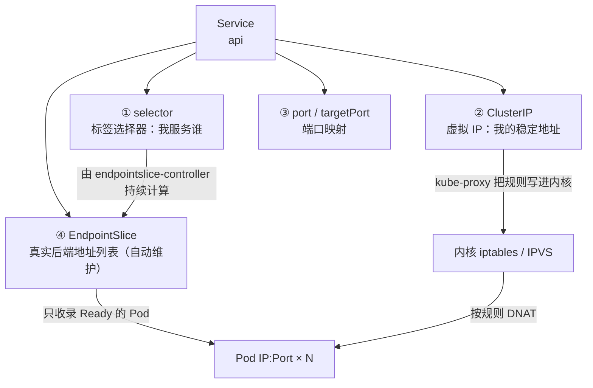
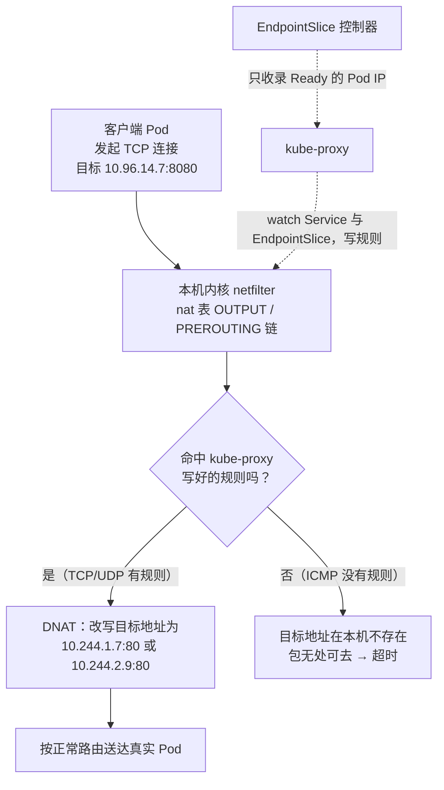

# 第 6 章　Pod 之间怎么说话：Service、DNS 与数据面

> **本章导读**
> - 建议用时：65 分钟（含 25 分钟动手）
> - 前置知识：第 3 章（数据面、kube-proxy 是规则写入器）、第 5 章（Deployment 发布）
> - 读完你应该能回答四个问题：
>   1. `ClusterIP` 是什么？**为什么它 `ping` 不通，却能用 `curl` 连上？**
>   2. kube-proxy 到底在内核里写了什么？流量是怎么被"分"到多个 Pod 的？
>   3. `web` 要调用 `api`，该写 IP 还是写域名？为什么同一个命名空间下写个 `api` 就能通？
>   4. `headless Service` 是什么？什么时候必须用它？

第 5 章结束的时候，CloudNote 的 `api` 已经在跑了：

```bash
kubectl get pods -n cloudnote -l app=api -o wide
# NAME                   READY   STATUS    IP
# api-6b8c9d7f4-9x2k7    1/1     Running   10.244.1.7
# api-6b8c9d7f4-p4m8n    1/1     Running   10.244.2.9
```

现在前端 `web` 要调用它。**怎么调？**这一章就解决这个问题——它是整个 K8s 里最"魔法"的一块，也是面试最爱问的一块。

---

## 【积木 6-1】三个死结：为什么 Pod IP 不能直接用

先别急着上 Service，我们看看"直接连 Pod IP"会撞上什么。

### 死结一：Pod IP 会变

第 2 章讲过，Pod 是一次性的。滚动更新、节点故障、手动删除——任何一种情况都会让 Pod 换一个 IP。

```bash
# 你写死在 web 的配置文件里：
API_URL=http://10.244.1.7:8080

# 三天后 api 滚动更新，那个 Pod 被换掉了
kubectl get pods -n cloudnote -l app=api -o wide
# api-7f3a2b1c8-qq9zz   1/1   Running   10.244.2.31   ← IP 变了，你的配置过期了
```

**配置一旦指向具体 IP，就等于给自己埋了个定时炸弹。**

### 死结二：副本不止一个

`api` 有 2 个副本。写 `10.244.1.7`，那就只有 1 个 Pod 在干活，另一个闲置；而且这个 Pod 一挂，整个服务就 502。

你想自己写个客户端负载均衡？那还得自己维护"当前有哪些 Pod IP"的列表——**这不就是把 K8s 已经帮你做好的事又做了一遍吗？**

### 死结三：谁来做健康检查的过滤

如果 api 的 2 个副本里，有 1 个因为数据库连不上而无法工作（但进程还活着），**你希望流量别打到它身上**。

**这需要有人持续地盯着"哪些副本现在是好的"，然后动态调整转发目标。**让业务代码自己干，成本太高。

### 所以需要一个新角色

> **Service 的职责：给一组"短暂的、会变的、可能不健康的" Pod，提供一个"持久的、单一的、只包含健康副本的"访问入口。**

三个词对应解决上面三个死结：

| Service 提供 | 解决 |
|---|---|
| **稳定的虚拟 IP（ClusterIP）** | Pod IP 会变 |
| **自动负载均衡** | 副本有多个 |
| **只转发给 Ready 的 Pod** | 需要健康过滤 |

用一句类比概括：

> **Pod 是流水线上的工人，今天来明天走；Service 是车间门口那块写着"业务办理处"的牌子——牌子不动，牌子后面站的是谁，随时可以换。**

---

## 【积木 6-2】Service 由四部分构成

拆开一个 Service，它其实是四个东西的组合：



四个部分逐个说清：

| 部分 | 谁写的 | 作用 |
|---|---|---|
| **`selector`** | **你写** | 决定"我服务哪些 Pod" |
| **`ClusterIP`** | **系统分配**（你也可以指定） | 稳定地址，从 service CIDR 里取 |
| **`ports`** | **你写** | 对外端口 → 容器端口的映射 |
| **`EndpointSlice`** | **控制器自动维护** | 真实的 `IP:Port` 列表 |

**注意第 4 项——你从来不手写它。**它是由 `endpointslice-controller`（第 3 章讲的那个控制器集合里的一员）持续计算出来的。这就是第 4 章"调和循环"的又一个实例。

---

## 【积木 6-3】EndpointSlice：Service 背后那本"地址簿"

这是本章第一个必须建立的概念，**也是排查 Service 问题时的第一站**。

### 它从哪来

`endpointslice-controller` 在持续做一件很简单的事：

```
每时每刻：
    找出所有符合 Service.selector 的 Pod
    过滤掉其中没有 Ready 的
    把剩下的 (PodIP, targetPort) 写进 EndpointSlice 对象
    如果和上次不一样，就更新它
```

**又是一个"读期望、读实际、对比、修正"的循环。**只不过这里的"期望"是你写的 selector，"实际"是集群里 Pod 的当前状态。

### 怎么看

```bash
# 老命令（依然好用）
kubectl get endpoints api -n cloudnote -o wide

# 新命令（EndpointSlice 是更细粒度的设计）
kubectl get endpointslices -n cloudnote
kubectl get endpointslices -n cloudnote -o yaml
```

输出长这样：

```
NAME        ENDPOINTS                          AGE
api         10.244.1.7:80,10.244.2.9:80        3m
```

**这两个 `IP:Port`，就是此刻真实的、健康的、可以被转发的后端。**

### 最重要的一条排查经验

> **Service 连不通，第一个要看的就是 `kubectl get endpoints`。**

因为这里是"Service 世界"和"Pod 世界"的交界处。它能立刻告诉你是哪一侧出了问题：

| Endpoints 的状态 | 说明什么 | 该去查什么 |
|---|---|---|
| **`<none>` 或空** | Service 找不到任何后端 | `selector` 写错了？Pod 标签不对？Pod 全都没 Ready？ |
| 有地址，但数量不对 | 有 Pod 没被算进来 | 那些 Pod 的 `Ready` 状态是什么？ |
| 有地址，但连不上 | 问题在 Service 之后的网络 | NetworkPolicy？容器没监听？端口错了？ |

**一个超高频的错误配置**——`selector` 和 Pod 的标签差一个字符：

```yaml
# Deployment 里 pod 的标签是
labels:
  app: api

# Service 里却写成
spec:
  selector:
    app: api-service      # ← 差一个词，Endpoints 就是空的
```

**这种情况下 `kubectl get svc` 一切正常，`ClusterIP` 也分配了，就是连不上。**所有"Service 明明创建成功了却访问不通"的问题，十有八九在这里。

> 顺带一个冷知识：**`Endpoints` 这个老对象从 Kubernetes 1.33 起被标记为弃用**，官方推荐用 `EndpointSlice`。原因是 `Endpoints` 在服务规模大时单个对象过于庞大（一个 Service 有几千个 Pod 时，这个对象会有几十 MB），而 `EndpointSlice` 会把它切成多片（默认每片最多 100 个后端）。**排查时两个都可以看，但记住未来的方向是 EndpointSlice。**

---

## 【积木 6-4】一个 Service 的 YAML 逐字段拆解

文件位置：`cases/cloudnote/22-api-service.yaml`

```yaml
apiVersion: v1
kind: Service
metadata:
  name: api
  namespace: cloudnote
spec:
  # ① 类型：默认就是 ClusterIP，只有集群内部能访问
  type: ClusterIP

  # ② 我服务谁 —— 靠标签找 Pod
  selector:
    app: api                 # ← 必须与 Pod 的标签一致

  # ③ 端口映射
  ports:
    - name: http             # 多个端口时必须有名字
      port: 8080             # Service 对外暴露的端口（集群内别人访问这个）
      targetPort: http       # 转发到容器的哪个端口（可以是数字，也可以是端口名）
      protocol: TCP

  # ④ 会话保持（默认关闭）
  sessionAffinity: None
```

### 三个值得单独讲的点

**第一：`targetPort` 可以写名字，这是个解耦神器。**

```yaml
targetPort: http    # ← 引用 Deployment 里 containerPort 的 name: http
```

好处是：**当容器监听的端口变了（比如从 80 改成 8080），只要 `containerPort` 的 `name` 不变，Service 完全不用改。**这是移动端 App 版本号、数据库连接串的同类思想——**引用"逻辑名"，而不是"物理值"。**

**第二：`port` 和 `targetPort` 是两个不同的东西，不要混。**

```
客户端 → Service 的 port（8080）→ 内核 DNAT → Pod 的 targetPort（80）
              ↑                                  ↑
        集群内访问用这个                    容器真正监听的
```

在本案例里 `port: 8080` 而 `targetPort: http`（即 80）——**正好演示了端口映射**。将来你换成真实的 CloudNote 镜像（监听 8080），只需要把 `containerPort` 改成 8080，**`targetPort: http` 这个名字引用完全不用动。**

**第三：`selector` 里的字段不需要和 Deployment "对齐"，只需要和 Pod 的标签对齐。**

第 1 章讲过这一点，这里再强化一次：**Service 完全不知道 Deployment 的存在。**你可以把一个 Service 指向一批由 `kubectl run` 手搓的裸 Pod，只要标签对，它照样工作；反过来，一个 Deployment 的 Pod 也可以同时被三个不同的 Service 选中（比如一个给内部用、一个给外部用、一个用于监控采集）。

---

## 【积木 6-5】ClusterIP 的真相：一个"谎言的集合"

现在进入本章最核心、也最反直觉的部分。

### 先做个小实验（提前剧透结论）

```bash
kubectl apply -f cases/cloudnote/22-api-service.yaml
kubectl get svc api -n cloudnote
# NAME   TYPE        CLUSTER-IP     PORT(S)
# api    ClusterIP   10.96.14.7     8080/TCP
```

拿到这个 `10.96.14.7` 之后：

```bash
# 在一个 Pod 里执行：ping 它
kubectl run -it --rm probe --image=busybox:1.36 -n cloudnote --restart=Never -- \
  ping -c 2 -W 2 10.96.14.7
# → 100% packet loss（超时）

# 但 curl 它
kubectl run -it --rm probe --image=busybox:1.36 -n cloudnote --restart=Never -- \
  wget -qO- http://10.96.14.7:8080
# → 正常返回 nginx 页面！
```

**同一个 IP，`ping` 不通，`curl` 却通。**为什么？

### 真相：这个 IP 压根不存在

```
$ ip addr | grep 10.96
（什么都没有）
```

**没有任何一张网卡拥有 `10.96.14.7` 这个地址。**你在任何节点、任何 Pod 里都找不到它。

那数据包是怎么到达 Pod 的？答案回到第 3 章【积木 3-1】那条数据面链路：

```
应用发起 TCP 连接，目标 10.96.14.7:8080
        ↓
内核的 netfilter 收到这个包（在 nat 表 OUTPUT/PREROUTING 链上）
        ↓
命中一条 kube-proxy 早先写好的规则：
    匹配 "目标 10.96.14.7:8080"
    → DNAT 改写成 "10.244.1.7:80"（或 10.244.2.9:80）
        ↓
改头换面之后，这个包才真正有了一个存在的目的地
        ↓
按正常路由到达目标 Pod
```

**所以 ClusterIP 是一个"约定"，不是一台"主机"。**它的全部实现就是"内核里一条会改写目标地址的规则"。



**所以 ClusterIP 是一个"约定"，不是一台"主机"。**它的全部实现就是"内核里一条会改写目标地址的规则"。

### 那为什么 ping 不通

关键区别在**协议**：

| 你发的包 | 内核里有没有对应的规则 | 结果 |
|---|---|---|
| **TCP / UDP** 发往 ClusterIP | **有**（kube-proxy 为每个 Service 的每个端口都写了规则） | 被 DNAT，正常到达 Pod |
| **ICMP（ping）** 发往 ClusterIP | **没有**（kube-proxy 不处理 ICMP） | 没有规则改写目标地址 → 这个地址在本机上不存在 → **超时** |

**这是理解 ClusterIP 最锋利的一刀：**

> **ClusterIP 不是"地址"，而是"一组针对 TCP/UDP 的地址改写规则"。**
>
> 所以 `ping` 不通完全正常，**它不是故障**。想测 Service 通不通，**永远用 TCP 工具**：`curl`、`wget`、`nc -zv`，而不是 `ping`。

> 这个知识点能帮你避开一个超常见的误判：**"我 ping 不通 Service，肯定是网络坏了"——不，你只是用错了工具。**

---

## 【积木 6-6】kube-proxy 到底写了什么规则

既然 ClusterIP 的实现是"内核规则"，那我们就去看看那些规则长什么样。

### 三种模式

| 模式 | 说明 | 现状 |
|---|---|---|
| **iptables** | 用 netfilter 的 nat 表做 DNAT，规则是**线性链表** | 经典模式，中小集群够用 |
| **IPVS** | 用内核的 LVS，**哈希表**查找 | 大规模集群推荐，性能更好 |
| userspace | 早期模式，kube-proxy 进程自己转发流量 | **已废弃** |

查你集群用的是哪个：

```bash
kubectl logs -n kube-system -l k8s-app=kube-proxy | grep -i "Using.*proxy"
# 或
kubectl get ds kube-proxy -n kube-system -o yaml | grep -A3 mode
```

### iptables 模式的规则链长什么样

这是最有教育意义的部分。kube-proxy 会写这样一条链：

```bash
# 在有 kube-proxy 的节点上执行（kind 集群需要 docker exec 进节点）
iptables -t nat -L KUBE-SERVICES -n | head -20
```

你会看到类似这样的结构：

```
Chain KUBE-SERVICES (2 references)
target            prot opt source     destination
KUBE-SVC-XXXXXXXX tcp  --  0.0.0.0/0  10.96.14.7  /* cloudnote/api:http cluster IP */
KUBE-SVC-YYYYYYYY tcp  --  0.0.0.0/0  10.96.0.10  /* kube-system/kube-dns:dns */
...

Chain KUBE-SVC-XXXXXXXX (1 references)
target                     prot opt source     destination
KUBE-SEP-AAAAAAA  tcp  --  0.0.0.0/0  0.0.0.0/0  /* statistic mode random probability */ 0.5
KUBE-SEP-BBBBBBB  tcp  --  0.0.0.0/0  0.0.0.0/0                                       0.5

Chain KUBE-SEP-AAAAAAA (1 references)
target        prot opt source     destination
DNAT          tcp  --  0.0.0.0/0  0.0.0.0/0  to:10.244.1.7:80
```

**三层结构，一目了然**：

| 链 | 作用 | 命名规律 |
|---|---|---|
| `KUBE-SERVICES` | 总入口：按"目标 IP:端口"匹配是哪个 Service | — |
| `KUBE-SVC-<哈希>` | 一个 Service 一条：**在这一组后端之间做选择** | `SVC` = Service |
| `KUBE-SEP-<哈希>` | 一个后端一条：**执行 DNAT，改写成真实的 Pod IP:Port** | `SEP` = Service EndPoint |

### 负载均衡是怎么做的：一个"概率游戏"

看 `KUBE-SVC-XXXX` 那两条规则：

```
KUBE-SEP-AAA  /* statistic mode random probability */ 0.5
KUBE-SEP-BBB                                            0.5
```

**这就是 iptables 模式的负载均衡实现：按概率随机。**

有 2 个后端，第一条规则的命中概率是 `1/2`，第二条是 `1/1`（因为走到第二条说明第一条没中）。有 3 个后端就是 `1/3`、`1/2`、`1/1`。

**注意它不是轮询（round-robin）。**它是**统计意义上的均匀**——连续发 1000 个请求，两个 Pod 大约各收到 500 个，但**顺序是随机的**。

| 模式 | 负载均衡算法 | 特点 |
|---|---|---|
| iptables | `statistic mode random probability`（随机概率） | 规则线性遍历，Service 多了会变慢 |
| IPVS | 默认 `rr`（轮询），还支持 `lc` / `wrr` / `sh` 等多种 | 哈希查找，O(1)，支持会话保持 |

> **这就是为什么大规模集群推荐 IPVS**：假设你有 5000 个 Service，每个都有 10 条 iptables 规则，那就是 5 万条规则。每个包都要**从上往下遍历**一遍——这是 O(n) 的复杂度。而 IPVS 用哈希表，是 O(1)。

### 再次强调那个反直觉的定位

第 3 章就说过，这里再钉一遍，因为它是理解数据面的关键：

> **kube-proxy 不是代理。它不转发任何流量。**
>
> 它的全部工作是：**watch Service 和 EndpointSlice 的变化，然后把规则写进内核。**写完就退场。真正转发数据的是 Linux 内核。

所以：

- **kube-proxy 挂了** → 已有规则仍然生效（流量照跑），只是**新的** Service 变更不会生效
- **流量路径上永远没有 kube-proxy 这个进程**

---

## 【积木 6-7】四种 Service 类型：从集群内到公网

`type` 字段决定这个 Service 的"可达范围"。

### ① ClusterIP（默认）：只在集群内可达

```yaml
spec:
  type: ClusterIP
```

分配一个虚拟 IP，**只有集群内的 Pod / 节点能访问**。适合内部服务（`api`、`redis`、`postgres`）。

**CloudNote 里 api、redis、postgres 之间的互相调用，全都用 ClusterIP。**

### ② NodePort：在每个节点上开一个端口

```yaml
spec:
  type: NodePort
  ports:
    - port: 8080
      targetPort: http
      nodePort: 30080        # 可选；不写就在 30000-32767 里随机分配
```

效果：**集群里每一台节点的 `30080` 端口，都会转发到这个 Service。**

```bash
# 于是你可以从集群外这样访问
curl http://<任意一个节点的IP>:30080
```

| 优点 | 缺点 |
|---|---|
| 不需要云厂商，裸金属也能用 | 端口范围受限（30000–32767） |
| 实现简单 | **客户端要记住"节点 IP + 端口"** |
| 常用于本地开发和测试 | 节点宕机时，那个 IP 就不通了 |

> **NodePort 通常不是最终方案**，而是"过渡形态"——因为没人愿意把 `http://1.2.3.4:30080` 给用户。实践中常见的是：NodePort + 前面的负载均衡器（云 LB、Nginx、HAProxy）。**第 7 章的 Ingress 就是干这个的。**

### ③ LoadBalancer：让云厂商给你一个公网 IP

```yaml
spec:
  type: LoadBalancer
  ports:
    - port: 443
      targetPort: http
```

**注意它的实现方式**：`LoadBalancer` 类型的 Service **底层仍然是 NodePort + ClusterIP**，只是额外触发了云厂商的控制器（cloud-controller-manager）去创建一个外部负载均衡器，把流量打到各节点的 NodePort 上。

```
用户 → 云 LB（有公网 IP）→ 任意节点的 NodePort → Service → Pod
                              ↑
                    这一步仍然是 NodePort 在干活
```

**所以"LoadBalancer 类型的 Service 一直 Pending"是本地集群的经典现象**——因为没有云控制器来给你分配 IP。kind / minikube 上要么用 `MetalLB` 这类工具，要么用 `kubectl port-forward` 顶着。

### ④ ExternalName：一个 DNS 别名

```yaml
spec:
  type: ExternalName
  externalName: db.prod.example.com    # 没有 selector，也没有 ClusterIP
```

它不代理任何流量，只是让集群内的 DNS 查询 `postgres.cloudnote.svc.cluster.local` 时，返回一个 **CNAME 记录**指向 `db.prod.example.com`。

**用途**：把"迁移到集群内"这件事变成一次 DNS 变更。比如你的应用连的是 `postgres`，将来把外部的数据库迁到集群里，**应用代码一行都不用改，只需把 ExternalName 换成真正的 Service**。

### 四种类型对比表

| 类型 | 可达范围 | 有没有 ClusterIP | 典型场景 | 谁来实现 |
|---|---|---|---|---|
| **ClusterIP** | 仅集群内 | 有 | 内部服务互调 | kube-proxy |
| **NodePort** | 集群外（节点 IP + 高位端口） | 有 | 开发测试、裸金属 | kube-proxy |
| **LoadBalancer** | 公网 | 有 | 生产对外入口 | **云厂商** |
| **ExternalName** | —（只做 DNS 别名） | **无** | 平滑迁移、访问外部依赖 | CoreDNS |

---

## 【积木 6-8】DNS：真正让服务发现变好用的那一层

有了 ClusterIP，你终于不用写 Pod IP 了。但写 `10.96.14.7` 也很难看、很难记——而且**跨环境时这个 IP 会变**（测试集群和生产集群分配的 ClusterIP 不同）。

所以 K8s 还给了你一层 DNS。

### 谁在提供 DNS

```bash
kubectl get pods -n kube-system -l k8s-app=kube-dns
# coredns-xxxxxxxxx   1/1   Running

kubectl get svc -n kube-system kube-dns
# NAME       TYPE        CLUSTER-IP   PORT(S)
# kube-dns   ClusterIP   10.96.0.10   53/UDP,53/TCP,9153/TCP
```

**CoreDNS 就是一个跑在集群里的 DNS 服务器**，只不过它是个 Deployment（第 5 章的对象），用 ClusterIP 暴露自己，通过 kubelet 配置进每个 Pod 的 `/etc/resolv.conf`。

有趣的是：**CoreDNS 自己也是通过 Service 暴露的**——这是一个"用 Service 支撑 Service 发现"的自举结构。

### 完整的 DNS 名字

每个 Service 都会自动获得一条 DNS 记录，格式是：

```
<service>.<namespace>.svc.cluster.local
```

以 CloudNote 为例：

| 你在哪 | 可以怎么写 | 实际解析成 |
|---|---|---|
| 同 namespace（cloudnote）的 Pod 里 | `api` | `api.cloudnote.svc.cluster.local` |
| 别的 namespace | `api.cloudnote` | 同上 |
| 任何地方，最完整写法 | `api.cloudnote.svc.cluster.local` | 同上 |

**为什么同 namespace 下写个 `api` 就能通？**这靠的是 Pod 里 `/etc/resolv.conf` 的 `search` 域：

```bash
kubectl exec -it <任意Pod> -n cloudnote -- cat /etc/resolv.conf
```

```
search cloudnote.svc.cluster.local svc.cluster.local cluster.local
nameserver 10.96.0.10
options ndots:5
```

`search` 那行是**按顺序尝试的域名后缀列表**。当你查 `api` 时，解析器会依次尝试：

```
api.cloudnote.svc.cluster.local   ← 命中！返回 ClusterIP
api.svc.cluster.local
api.cluster.local
api.                                ← 最后才当公网域名查
```

> **`ndots:5` 是个值得知道的坑**：它表示"如果域名里的点少于 5 个，就先试 search 域"。所以查 `api.example.com` 时，解析器会**先尝试** `api.example.com.cloudnote.svc.cluster.local`（失败），再尝试真实地址——**多了一次无用的 DNS 查询，轻微增加延迟**。
>
> 如果你发现应用的 DNS 解析特别慢，可以在 Deployment 里给 Pod 加 `dnsConfig`，调小 `ndots`。

### Headless Service：一个特殊但重要的变体

```yaml
spec:
  clusterIP: None        # ← 关键：显式不要 ClusterIP
  selector:
    app: postgres
```

**`clusterIP: None` 就是 headless Service。**它有两个关键差异：

| | 普通 Service | Headless Service |
|---|---|---|
| 有 ClusterIP 吗 | 有 | **没有** |
| DNS 返回什么 | **一个** ClusterIP（然后被负载均衡） | **所有** 就绪 Pod 的 IP 列表（A 记录） |
| 有负载均衡吗 | 有 | **没有**（客户端自己选） |

**什么时候需要它？**

| 场景 | 为什么必须 headless |
|---|---|
| **StatefulSet**（数据库、消息队列） | 客户端需要知道"哪个 IP 是一号节点"，比如 MySQL 主从、Kafka partition leader |
| 客户端自己做负载均衡 | 比如 gRPC 的长连接负载均衡，需要拿到全部后端自己选 |
| 需要稳定的 Pod 域名 | `pod-name.service-name.namespace.svc.cluster.local` 这种形式 |

**注意最后一行的地址格式**：有了 headless Service，**每个 Pod 都会获得自己的 DNS 名**：

```
postgres-0.postgres.cloudnote.svc.cluster.local
postgres-1.postgres.cloudnote.svc.cluster.local
```

**这是 StatefulSet 能提供"稳定网络身份"的基础。**第 13 章会详细讲。

> 顺带：headless Service 还有一个"半无头"用法——**不写 selector**，然后**手动创建 EndpointSlice** 指向集群外的地址。这是把外部数据库（比如 RDS）伪装成集群内 Service 的经典手法。

---

## 【积木 6-9】动手：把 Service 的每一层都验一遍

配套脚本：

```bash
bash cases/cloudnote/tools/service-lab.sh
```

手动流程如下。

### 第一步：创建 Service

```bash
kubectl apply -f cases/cloudnote/00-namespace.yaml
kubectl apply -f cases/cloudnote/20-api-deployment.yaml
kubectl apply -f cases/cloudnote/22-api-service.yaml

kubectl rollout status deployment/api -n cloudnote
kubectl get svc api -n cloudnote
```

记下 `CLUSTER-IP`，我们叫它 `$VIP`。

### 第二步：看背后的地址簿

```bash
kubectl get endpoints api -n cloudnote
kubectl get endpointslices -n cloudnote -o wide
```

**应该有两个 `IP:80`**（因为 Deployment 有 2 个副本）。

### 第三步：验证 DNS

```bash
kubectl run -it --rm probe --image=busybox:1.36 -n cloudnote --restart=Never -- sh
```

进去之后依次执行：

```sh
# ① 短名（同 namespace）—— 靠 search 域生效
nslookup api

# ② 全名
nslookup api.cloudnote.svc.cluster.local

# ③ 看解析器的配置
cat /etc/resolv.conf

# ④ 直接访问域名
wget -qO- http://api:8080 | head -3
```

**注意 `nslookup api` 返回的就是 `$VIP`——DNS 这一层只负责让你"找到 Service"，不负责"找到某个 Pod"。**

### 第四步：验证"ping 不通但 curl 通"

```sh
# 失败：ICMP 没有 NAT 规则
ping -c 2 -W 2 api

# 成功：TCP 会被 DNAT
wget -qO- http://api:8080 | head -3
nc -zv api 8080
```

**这个对比请亲手做一遍**，它比任何文字都更能说明 ClusterIP 的本质。同时记住排查纪律：**永远别用 ping 测 Service。**

### 第五步：观察负载均衡

```sh
# 连续请求 10 次，看返回内容是否有变化
for i in $(seq 1 10); do wget -qO- http://api:8080 | grep -o '<title>.*</title>'; done
```

> 想看更明显的效果，可以让每个 Pod 返回自己的主机名。因为默认 nginx 页面不包含 Pod 名，这里只能看"是否都成功"。**要观察分流细节，看第六步。**

### 第六步：删一个 Pod，看地址簿自动更新

在**另一个终端**盯着 Endpoints：

```bash
kubectl get endpoints api -n cloudnote -w
```

再开一个终端删 Pod：

```bash
kubectl delete pod -n cloudnote -l app=api --wait=false
```

**你会看到**：

1. 被删的 Pod 的 IP **立刻从 Endpoints 里消失**
2. 新的 Pod 起来并 Ready 之后，新的 IP 被**自动加进去**

**全程你没有碰过 Service 对象。**这就是 `endpointslice-controller` 在工作，也就是第 4 章的调和循环。

### 第七步：制造"所有 Pod 都不 Ready"，看 Endpoints 变空

这是最能说明"Service 只转发给健康副本"的实验。用探针故意失败：

```bash
# 把就绪探针指到一个不存在的路径
kubectl patch deployment api -n cloudnote --type=json -p='[
  {"op":"replace","path":"/spec/template/spec/containers/0/readinessProbe/httpGet/path","value":"/does-not-exist"}
]'
```

等 10~20 秒后：

```bash
kubectl get pods -n cloudnote -l app=api
# 注意 READY 列：1/1 变成了 0/1（Running 但未就绪）

kubectl get endpoints api -n cloudnote
# NAME   ENDPOINTS
# api    <none>          ← 地址簿空了！
```

**此时在 probe 容器里访问，会直接连接被拒绝**：

```sh
wget -qO- --timeout=3 http://api:8080 ; echo "exit=$?"
# 连接失败
```

**这个实验完整地展示了一条链**：

```
readinessProbe 失败 → Pod 变成 NotReady → EndpointSlice 把它移除
   → 内核规则更新 → 流量不再打向它
```

恢复：

```bash
kubectl patch deployment api -n cloudnote --type=json -p='[
  {"op":"replace","path":"/spec/template/spec/containers/0/readinessProbe/httpGet/path","value":"/"}
]'
```

> **这就是第 5 章"就绪探针是滚动更新的刹车"的完整解释**：探针不只是控制发布节奏，它**直接决定了这个 Pod 会不会出现在 Service 的转发列表里**。

### 第八步：看内核规则（有权限的话）

在 kind 集群里可以进节点看：

```bash
docker exec k8s-study-worker iptables -t nat -L KUBE-SERVICES -n | grep -A1 cloudnote
docker exec k8s-study-worker iptables -t nat -L -n | grep -E "KUBE-SVC|KUBE-SEP" | head -20
```

**你会亲眼看到那些 DNAT 规则。**这就是 ClusterIP 的"真身"——一堆存在于内核里的地址改写规则。

### 第九步：试一下 NodePort

```bash
cat <<'EOF' | kubectl apply -f -
apiVersion: v1
kind: Service
metadata:
  name: api-nodeport
  namespace: cloudnote
spec:
  type: NodePort
  selector:
    app: api
  ports:
    - port: 8080
      targetPort: http
      nodePort: 30080
EOF

kubectl get svc api-nodeport -n cloudnote
# PORT(S) 那一列会显示 8080:30080/TCP
```

在 kind 里可以直接从宿主机访问（kind 把节点端口映射出来了）：

```bash
curl -s http://localhost:30080 | head -3
```

清理：

```bash
kubectl delete svc api-nodeport -n cloudnote
```

### 第十步：Headless Service 的 DNS 长什么样

```bash
cat <<'EOF' | kubectl apply -f -
apiVersion: v1
kind: Service
metadata:
  name: api-headless
  namespace: cloudnote
spec:
  clusterIP: None
  selector:
    app: api
  ports:
    - port: 8080
      targetPort: http
EOF

kubectl get svc api-headless -n cloudnote
# CLUSTER-IP 那一列显示 None
```

进 probe 容器查它：

```sh
nslookup api-headless
# 返回的是两个真实的 Pod IP，而不是一个 ClusterIP！
```

**这就是"无头"的含义**：DNS 不再给你一个虚拟 IP，而是把所有后端 IP 交给你，让你自己决定怎么用。

清理：

```bash
kubectl delete svc api-headless -n cloudnote
kubectl delete svc api -n cloudnote
kubectl delete deployment api -n cloudnote
```

---

## 【积木 6-10】几个必须知道的边界与坑

### 坑一：Service 是四层的，不认 HTTP

Service 只认识 `IP:Port`，**它看不懂 HTTP 请求里的域名和路径**。

你**不能**这样写：

```yaml
# 做不到：根据路径转发
matchPath: /api       # ← Service 里根本没有这个字段
matchHost: note.example.com
```

**这是 Ingress 存在的原因**（第 7 章）：

| 层 | 对象 | 能看什么 | 能做什么 |
|---|---|---|---|
| **四层（L4）** | Service | IP、端口、协议 | 转发到后端，负载均衡 |
| **七层（L7）** | Ingress | 域名、路径、Header、Cookie | 按规则路由、TLS 终止、重写 |

#### 一个必须纠正的直觉：分界线不是"内部 vs 外部"

很多人会得出这样一个简化结论：

> "Service 负责集群**内部**互通，Ingress 负责与**外部**互通。"

**这个说法方向对了一半，但分界线画错了**，而且会导致后面理解 Ingress 时处处别扭。两处需要纠正：

**纠正一：Service 本身就能对外。**

"能不能对外"不是 Service 的本质限制，而是 `type` 字段的一个取值：

| `type` | 作用域 |
|---|---|
| `ClusterIP` | 仅集群内部 |
| **`NodePort`** | **集群外可达**——每个节点开放一个高位端口 |
| **`LoadBalancer`** | **公网可达**——云厂商分配一个公网 IP |
| `ExternalName` | 只做 DNS 别名 |

上一节【积木 6-7】讲的 `NodePort` / `LoadBalancer` 就是**专门用来对外的 Service**。所以"Service 只做内部"这句话不成立。

**纠正二：Ingress 不能绕过 Service。**

Ingress 的 `backend` 字段**必须指向一个 Service**，它没有办法直接指向 Pod。所以 Ingress 不是"另一条通向 Pod 的路"，而是**在 Service 前面再加一层**：

```
外部用户
    │
    ▼
Ingress（七层：域名 / 路径 / TLS 终止）   ← 可选，但生产上必备
    │  backend 必须指向一个 Service
    ▼
Service（四层：稳定虚拟 IP + 负载均衡）   ← 必须
    │
    ▼
Pod × N
```

**真正的分界线是「四层 vs 七层」，不是「内部 vs 外部」。**更准确的两句话是：

> **Service 回答："我这一组 Pod，用什么地址被访问？"**——作用范围由 `type` 决定。
>
> **Ingress 回答："来自外部的一个 HTTP 请求，应该按什么规则转给哪个 Service？"**——它天生面向外部，但**必须依赖 Service** 才能触达 Pod。

**一个能彻底说明问题的例子（也是新手最大的坑）**：

Ingress Controller（比如 Nginx Ingress Controller）**自己也是跑在集群里的 Pod**，而它要被外部访问到，**也得靠一个 `NodePort` 或 `LoadBalancer` 类型的 Service 暴露自己**。

```
外部流量 → ① LoadBalancer Service（暴露 Ingress Controller 自己）
              ↓
           ② Ingress Controller Pod（七层代理，真正做路由）
              ↓ 按 Ingress 规则转发
           ③ 业务 Service（ClusterIP）
              ↓
           ④ 业务 Pod
```

**所以"Ingress 负责对外"这个说法是循环的——它自己对外还得靠 Service。**这也顺便解释了那个最常见的困惑：

> **只创建 `Ingress` 对象是没有任何效果的。**`Ingress` 只是一个"声明"，它需要有一个 **Ingress Controller** 去 watch 它、并生成实际的代理配置。**没装 Controller，`Ingress` 就是一纸空文**——这和第 4 章讲的"控制器模式"是同一套逻辑。

第 7 章会把这条链路完整走一遍。

### 坑二：ClusterIP 只在集群内可达

`10.96.x.x` 这个网段**只在集群内部有意义**。你的笔记本、你的手机、公司内网——都访问不到它。

想在集群外访问，必须走 NodePort / LoadBalancer / Ingress。

### 坑三：同一个 Service 里的多个 port 必须有名字

```yaml
ports:
  - name: http        # ← 有多个端口时，name 是必填的
    port: 80
  - name: metrics
    port: 9090
```

因为 Service 内部要靠名字区分这些端口（也因为这正是给 Pod 的 `containerPort` 起名的意义）。

### 坑四：Service 的 `port` 在同一个 ClusterIP 上不能重复

同一个 Service 内部，两个 `port` 不能一样。但**不同的 Service 可以用相同的 port**——因为它们有不同的 ClusterIP。

```
Service A: 10.96.14.7:8080  ✓
Service B: 10.96.20.3:8080  ✓   ← 不冲突，因为 IP 不同
```

### 坑五：`sessionAffinity` 的取舍

默认 `None`——每个 TCP 连接独立选后端。改成 `ClientIP` 后，**同一个客户端 IP 的连接会被固定到同一个 Pod**。

```yaml
sessionAffinity: ClientIP
sessionAffinityConfig:
  clientIP:
    timeoutSeconds: 10800    # 默认 3 小时
```

**什么时候需要？**应用没有把会话状态外置（比如用了本地内存存 session）。

**但更好的做法是：把状态挪到 redis，让应用真正无状态，然后用默认的 `None`。**

#### 先把一个容易漏掉的前提说清楚：负载均衡是"每连接"的，不是"每包"的

这一点能消除一半的困惑。第 6 章开头讲过，DNAT 只发生在**连接建立的那一刻**：

```
TCP 三次握手时，内核查规则 → 选中 Pod A → DNAT → 建立连接
            │
            ▼
    这条连接的映射被记进 conntrack 表
            │
            ▼
    之后这条连接的所有数据包，直接按 conntrack 的记录走，
    不再查 KUBE-SVC 规则，也就不会再重新选后端
```

**所以准确的说法是**：

| 场景 | 会不会被分到不同 Pod |
|---|---|
| 同一个 TCP 连接里的多个请求（HTTP keep-alive、gRPC、WebSocket） | **不会**，永远走同一个 Pod |
| 用户刷新页面 / 每次新建 TCP 连接 | **会**，每次重新随机选 |

**这带来一个重要推论**：如果你的应用是 **WebSocket 或 gRPC 长连接**，那**业务上根本不需要粘性**——一条连接建好之后就固定在那个 Pod 上了。真正会"丢会话"的，是那种**每个请求都新建连接**的短连接场景（普通 HTTP 轮询、表单提交）。

#### 如果你想在这个基础上再做粘性，K8s 给了什么

```yaml
sessionAffinity: ClientIP
sessionAffinityConfig:
  clientIP:
    timeoutSeconds: 10800    # 默认 3 小时
```

它的**实现方式依模式而不同**：

| 模式 | 实现 | 说明 |
|---|---|---|
| iptables | 用内核的 `recent` 模块记录"这个源 IP 上次去了哪个后端"，然后在 `KUBE-SVC-*` 链里**优先匹配**这条记录 | 本质是"查一下历史，命中就走老路" |
| IPVS | 把调度算法从默认的 `rr`（轮询）换成 **`sh`（source hashing，源地址哈希）** | 同一个源 IP 哈希到同一个后端，更干净 |

想亲眼看到它，可以给 Service 加上 `sessionAffinity: ClientIP` 之后再看规则：

```bash
kubectl patch svc api -n cloudnote -p '{"spec":{"sessionAffinity":"ClientIP"}}'
# 在节点上对比加之前和加之后的规则差异
iptables -t nat -S | grep -E "recent|KUBE-SVC"
```

#### 但 `ClientIP` 有四个坑，第一个是致命的

| # | 局限 | 后果 |
|---|---|---|
| **1** | **NAT 出口下会塌陷** | 公司 / 学校 / 运营商出口的几百个用户共用**一个公网 IP**，全部被判定为"同一个客户端" → **请求全压到一个 Pod 上，负载均衡彻底失效**，而且那个 Pod 极易被打挂 |
| **2** | **只认 IP，不认用户** | 同一个办公室里的张三和李四被当成一个人；同一个人从家里切到 4G，源 IP 变了，会话又丢了 |
| **3** | **Pod 重建 / 缩容时会话丢失** | 那个"粘"住的 Pod 一旦被换掉（滚动更新、故障重建），旧会话就找不回来了 |
| **4** | **超时窗口是拍脑袋的** | 3 小时太短会在长会话场景丢，太长会让流量长时间偏斜到少数 Pod |

**坑 1 的严重程度值得单独强调**：这是一个"平时看不出问题、一到上班高峰就出事"的配置。测试时你自己一个人访问，觉得很正常；上线后整个公司的流量全砸到一个 Pod 上。

#### 三层解法，按优先级排序

| 优先级 | 做法 | 说明 |
|---|---|---|
| **首选** | **把会话状态外置** | session 存 redis / 数据库；或者干脆用**无状态令牌（JWT）**——客户端持有签名令牌，服务端不存任何会话。**这样 Pod 才是真正无状态的，才能随便扩缩容、随便滚动更新** |
| **次选** | **用七层（L7）的 Cookie 粘性** | 让 Ingress Controller / 七层代理按 **Cookie** 而不是源 IP 做粘性。**Cookie 是每个浏览器独立携带的，完全不受 NAT 影响**，也不受"换网络"影响 |
| **最后手段** | `sessionAffinity: ClientIP` | 只有在前两条都做不到、且你确认**不存在 NAT 集中出口**的场景下才用 |

**L4 IP 粘性 vs L7 Cookie 粘性，本质区别在这**：

```
L4 源 IP 粘性：看"你从哪来"（网络层属性，会被 NAT 抹平）
L7 Cookie 粘性：看"你是谁"（应用层属性，可以随用户走）
```

**判据很简单**：如果你的服务是"给不确定的网络环境下的真人用户"用的，**永远选 L7**。第 7 章的 Ingress Controller（Traefik、Contour、Envoy Gateway 等）都支持基于 Cookie 的粘性配置。

> 顺带提醒：曾经最流行的 `ingress-nginx` **已于 2026 年 3 月退役**（不再有安全补丁），选型时不要再新装它。第 7 章会详细讲这件事的来龙去脉。

#### 那 StatefulSet 那种"必须连特定节点"的需求怎么解

这是另一类问题——不是"会话粘性"，而是"**我需要精确地连到某一个特定实例**"（比如 MySQL 主库、Kafka partition leader）。

**这种情况不要用 `sessionAffinity`，应该用 [headless Service](#headless-service一个特殊但重要的变体)**：让 DNS 把**所有** Pod 的地址都返回给客户端，由**客户端自己**决定连哪个。

因为粘性的前提是"无所谓连哪个，只要别来回换"；而 StatefulSet 场景的前提是"**我就是要连那一个**"。两者的需求方向正好相反。

### 坑六：`externalTrafficPolicy`（只有 NodePort / LoadBalancer 才有）

| 值 | 行为 | 代价 |
|---|---|---|
| `Cluster`（默认） | 外部流量可以转发到**任意节点**上的 Pod | 多一次跨节点跳转，**客户端源 IP 会丢失** |
| `Local` | 只转发到**本节点**上的 Pod | 保留客户端源 IP，但**该节点没有 Pod 时连接会被丢弃** |

**什么时候必须用 `Local`？**当你需要真实客户端 IP 的时候（风控、限流、访问日志审计）。

**用了 `Local` 要注意**：必须保证每个节点上都有 Pod（通常配合 DaemonSet 或把副本数设得足够多 + 反亲和性），否则流量打到"没有副本的节点"上会直接失败。

---

## 【本章小结】

### 四句话总结

1. **Service 解决的是"Pod IP 不可靠"这个根本问题**：给一组短暂的、会变的、可能不健康的 Pod，一个持久的、单一的、只含健康副本的访问入口。
2. **ClusterIP 不是一个真实地址，而是一组内核里的 TCP/UDP 地址改写规则。**所以它 `ping` 不通却 `curl` 得通——**排查 Service 永远用 TCP 工具，不要用 ping**。
3. **kube-proxy 是规则写入器，不是代理**。iptables 模式下用 `KUBE-SERVICES → KUBE-SVC-* → KUBE-SEP-*` 三层链做"随机概率"负载均衡；IPVS 模式改用哈希表，性能更好。
4. **`Endpoints` / `EndpointSlice` 是排查 Service 问题的第一站**——它直接告诉你"Service 到底找到后端了没有"，十有八九的问题都在 `selector` 和 Pod 的 `Ready` 状态上。

### 一张图收尾

```
   客户端（另一个 Pod）
        │  ① 查 DNS：api → 10.96.14.7      ┌─────────────────────┐
        ├─────────────────────────────────►│ CoreDNS             │
        │                                  │ api.cloudnote.svc…  │
        │  ② 拿到 ClusterIP                 └─────────────────────┘
        ▼
   连接 10.96.14.7:8080
        │
        ▼
   内核 iptables / IPVS  ──── DNAT ────►  10.244.1.7:80  （Pod A）
        ▲                                  10.244.2.9:80  （Pod B）
        │                                        ▲
        │ 规则是谁写的？                          │ 名单是谁给的？
   kube-proxy                          EndpointSlice 控制器
        ▲                                        ▲
        │ watch                                  │ 过滤出 Ready 的 Pod
        └──────────── kube-apiserver ────────────┘
                            ▲
                            │ 你的 selector: app=api
                        Service 对象
```

### 自测题

1. 为什么不能直接把 Pod IP 写进前端配置？说出三个理由。（积木 6-1）
2. Service 由哪四部分构成？其中哪一部分是**你从来不手写**的？（积木 6-2）
3. `selector` 写错一个字符会有什么现象？`kubectl get svc` 会报错吗？（积木 6-3）
4. Service 连不通，第一个该查什么命令？Endpoints 为 `<none>` 意味着什么？（积木 6-3）
5. `port` 和 `targetPort` 分别是谁对谁？为什么 `targetPort` 推荐写端口名？（积木 6-4）
6. 为什么 `ping` ClusterIP 不通，`curl` 却通？这说明了 ClusterIP 的本质是什么？（积木 6-5）
7. iptables 模式下，`KUBE-SERVICES` / `KUBE-SVC-*` / `KUBE-SEP-*` 三层各负责什么？（积木 6-6）
8. iptables 模式的负载均衡是轮询吗？为什么大规模集群推荐 IPVS？（积木 6-6）
9. `LoadBalancer` 类型的底层实现是什么？为什么在本地 kind 集群里它一直 `Pending`？（积木 6-7）
10. 同 namespace 下为什么写个 `api` 就能解析？`ndots:5` 有什么副作用？（积木 6-8）
11. Headless Service 的 DNS 返回什么？什么场景必须用它？（积木 6-8）
12. 一个 Pod `Running` 但 `NotReady` 时，它还在 Service 的转发列表里吗？为什么？（积木 6-9、第 5 章）
13. 为什么不能用 Service 按 HTTP 路径做路由？那该用什么？（积木 6-10）
14. 默认的随机负载均衡下，同一个用户的两次请求会到同一个 Pod 吗？"同一个 TCP 连接里的多个请求"呢？（积木 6-10）
15. `sessionAffinity: ClientIP` 在什么场景下会**彻底失效甚至变成故障**？为什么说 L7 的 Cookie 粘性比它好？（积木 6-10）
16. 需要"精确连到某一个特定 Pod"（比如 MySQL 主库）时，该用什么？为什么不能用粘性来解决？（积木 6-8、6-10）
17. "Service 负责内部、Ingress 负责外部"这个说法错在哪？请说出两处纠正。（积木 6-10）
18. Ingress Controller 自己是怎么被外部访问到的？"只创建 Ingress 对象"为什么没有效果？（积木 6-10、第 4 章控制器模式）

### 下一章预告

**第 7 章：让世界访问你 —— Ingress 与南北向流量**

现在 CloudNote 内部已经通了：`web` 用域名 `api` 就能调后端。但还有一个问题没解决——**用户怎么访问进来？**

> 你总不能告诉用户"请访问 `http://1.2.3.4:31847`"吧？你要的是 `https://note.example.com`。
>
> 而且路径要分流：`/` 给前端、`/api` 给后端。**Service 是四层的，看不懂路径**，那这一步谁来做？
>
> 还有 HTTPS 证书——总不能让每个 Pod 都装一遍证书吧？

这一章我们会讲 **Ingress 与 Ingress Controller 的区别**（这是新手最大的困惑点）、路径和域名的路由规则、TLS 终止发生在哪里、以及为什么现在社区在往 **Gateway API** 迁移。最后我们会给 CloudNote 配上一个真实的七层入口。

---

*学完本章，回到对话里说一句「继续」，我就开讲第 7 章。*
