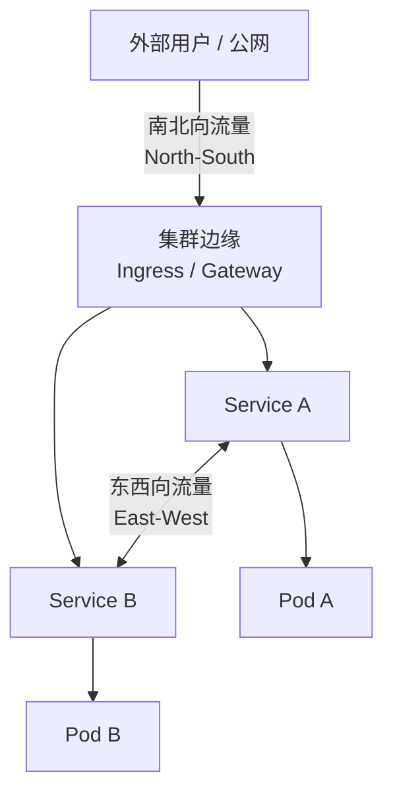
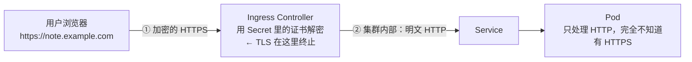
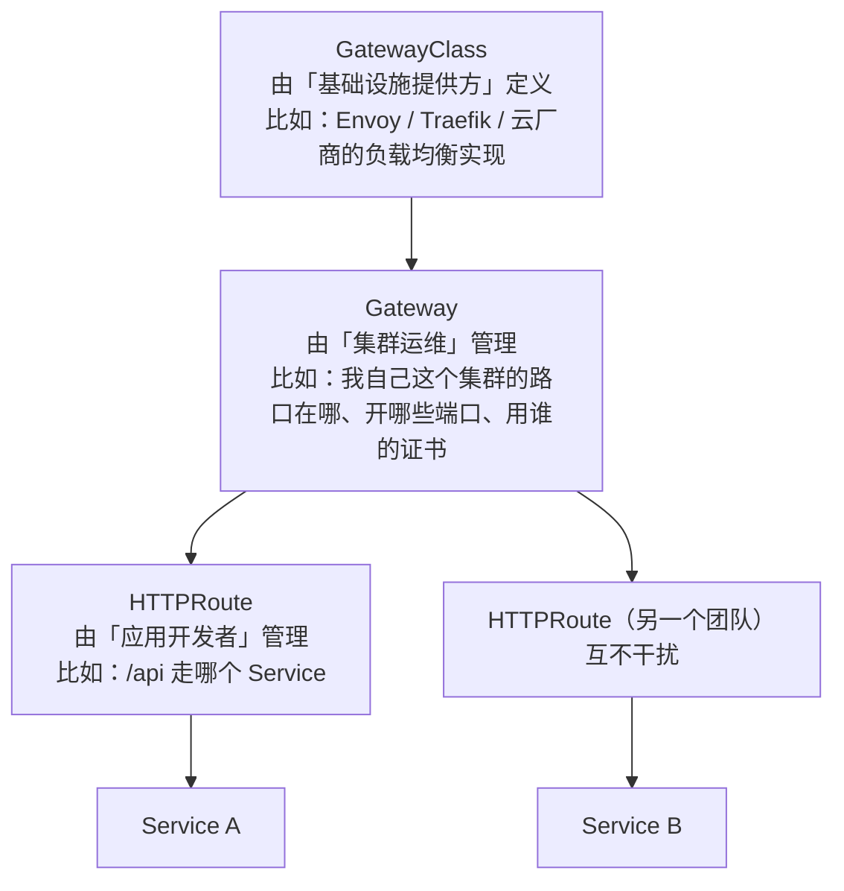

# 第 7 章　让世界访问你：Ingress 与南北向流量

第 6 章末尾给出了这条链路：

```
外部用户 → Ingress（七层）→ Service（四层）→ Pod
```

本章把 Ingress 这一层讲透：路由规则怎么写、TLS 证书怎么自动签发、控制器之间的注解为什么不通用。

但在进入配置细节之前，有一件正在发生、且直接影响技术选型的事必须先说明。

---

### 7.1 先讲一个刚发生的行业事件

#### 2026 年 3 月，Ingress NGINX 退役了

如果你搜索"Kubernetes Ingress 教程"，十篇里有九篇会让你装 **ingress-nginx**。它是这个领域事实上的标准，据 Datadog 的调研，**大约 50% 的云原生环境在用它**。

**它已经在 2026 年 3 月正式退役。**

| 时间 | 事件 |
|---|---|
| 2025-11-11 | SIG Network 发布退役公告：进入"尽力而为的维护模式" |
| 2026-01 | Steering Committee 与 Security Response Committee 联合发声明，要求用户立即规划迁移 |
| **2026-03** | **维护正式停止。不再有任何版本发布、bug 修复、安全补丁。GitHub 仓库转为只读** |

退役后的具体后果：

- **已部署的实例不会立刻坏掉**，现有制品（Helm chart、镜像）仍然可用
- 但**没有安全补丁了**——之后发现的 CVE 永远不会被修
- 官方原话很重："**在 Ingress NGINX 退役后继续使用，将使你和你的用户面临攻击风险。**"

**为什么会走到这一步？**官方给出的原因非常值得一读：

这个项目一直只有**一到两个人在业余时间维护**。它当年的"灵活性"（比如允许通过 snippets 注解注入任意 NGINX 配置）如今变成了无法解决的技术债务——那些"方便的功能"后来被认定为严重的安全缺陷。**昨天的灵活性成了今天的负担。**

#### 但有一个重要的澄清，很多人搞错了

退役的消息传开后，一个常见的误解是：

"Ingress 要淘汰了，以后不能用 Ingress 了。"

**这是错的。**准确的说法是：

| 对象 | 状态 |
|---|---|
| **Ingress API**（`networking.k8s.io/v1`） | **仍然受支持、被广泛使用**，只是**功能冻结**（不再加新特性） |
| **ingress-nginx**（社区维护的那个控制器） | **2026 年 3 月退役** |
| 其他 Ingress Controller（Traefik、Contour、云厂商的……） | **多数仍在积极维护** |

**所以你有两条路**：

1. **平移**：继续用 Ingress API，只换一个仍在维护的控制器（YAML 基本不动，但 `nginx.ingress.kubernetes.io/*` 那类注解会失效）
2. **演进**：迁移到 **Gateway API**——Ingress 的官方后继者

这一章会先讲清楚 Ingress 本身（因为它是理解 Gateway API 的必经之路，而且存量系统里到处都是），再讲 Gateway API 解决了什么、怎么选。

**现在就可以查一下你的集群有没有中招**：
```bash
kubectl get pods -A --selector app.kubernetes.io/name=ingress-nginx
```
有输出的话，你就在那受影响的"50%"里，该开始规划迁移了。

---

### 7.2 Ingress 与 Ingress Controller：声明与实现

这是本章最核心的一对概念，也是新手最普遍的困惑点。

#### 一句话区分

> **`Ingress` 是一张"路由表"（声明），`Ingress Controller` 是"路由器"（实现）。**

| | Ingress | Ingress Controller |
|---|---|---|
| 是什么 | 一个 **API 对象**（YAML） | 一套**运行中的程序** |
| 谁写 | **你** | 安装控制器时由它自己创建 |
| 存在哪 | etcd 里的一条记录 | 集群里的 Deployment + Service + RBAC |
| 会做什么 | **什么都不做** | watch Ingress 对象，生成实际代理配置 |
| 类比 | 写在纸上的交通规则 | 实际在路口指挥的交警 |
| 查它 | `kubectl get ingress` | `kubectl get pods -n <controller-ns>` |

#### 关键结论：没有 Controller，Ingress 就是一纸空文

```bash
# 没装控制器时
kubectl apply -f 40-ingress.yaml
kubectl get ingress -n cloudnote
# NAME   CLASS   HOSTS                ADDRESS   PORTS
# api    <none>  note.example.com              80      ← ADDRESS 是空的
```

**对象创建成功了，但没有任何东西在监听它、实现它。**流量不会因为你在 etcd 里写了一段 YAML 就自动流起来。

这正是第 4 章"控制器模式"的又一次体现：**声明只是数据，必须有控制器去调谐它。**Ingress 是最典型的"对象+控制器"配对——只不过这个控制器不由 K8s 自带，而是**需要你自己部署**。

#### 集群里怎么看控制器

```bash
# ① 有哪些控制器类（IngressClass）
kubectl get ingressclass
# NAME      CONTROLLER             PARAMETERS   AGE
# traefik   traefik.io/ingress-controller          5m

# ② 控制器本身跑在哪
kubectl get pods -A | grep -iE "ingress|traefik|envoy|contour|nginx"

# ③ 看它的 Service（还记得第 6 章那个自举结构吗）
kubectl get svc -A | grep -iE "ingress|traefik|envoy|contour"
```

第 3 条命令会给你一个漂亮的印证：**Ingress Controller 自己就是靠一个 `LoadBalancer` 或 `NodePort` 类型的 Service 暴露给外部的**——所以第 6 章那句"说 Ingress 负责对外是循环的"在这里有了实物证据。

#### 控制器生态与维护状态（2026 年 9 月）

| 控制器 | 类型 | 支持 Gateway API | 维护状态 |
|---|---|---|---|
| **ingress-nginx** | Nginx | 否 | **已于 2026-03 退役** |
| **Traefik** | 自研（Go） | **是** | 活跃 |
| **Contour** | Envoy | **是** | 活跃 |
| **Envoy Gateway** | Envoy | **是**（Gateway API 原生） | 活跃，CNCF |
| **Istio Gateway** | Envoy | **是** | 活跃（适合已用 Istio 的场景） |
| **Cilium Ingress** | eBPF | 部分 | 活跃（已在用 Cilium CNI 时顺带可用） |
| 云厂商（ALB / CLB / AGIC…） | 各家 | 部分 | 跟着云平台走 |

**选型建议（2026 年）**：

- **新项目**：直接上 **Gateway API** + Envoy Gateway / Traefik / Contour
- **存量用 ingress-nginx**：优先考虑**直接迁 Gateway API**（而不是先平移到另一个 Ingress 控制器再迁一次）
- **时间特别紧、只想先止血**：平移到 Traefik 或 Contour，但仍要规划后续迁移
- **已经在用 Istio / Cilium**：用它们自带的入口能力，少引入一个组件

---

### 7.3 先分清两个词：南北向与东西向

在讲流量之前，先把这两个术语钉死——读云原生文档时会高频出现。



| 术语 | 方向 | 典型对象 | 回答的问题 |
|---|---|---|---|
| **南北向（North-South）** | 进出集群 | **Ingress / Gateway**、LoadBalancer Service | "外部怎么访问进来？" |
| **东西向（East-West）** | 集群内部之间 | **Service**、NetworkPolicy、Service Mesh | "内部服务之间怎么互相调用？" |

**名字的来历**：习惯上把拓扑图画成"外部在上、内部在下"，进出集群的流量就是"上下走"（北↔南）；而集群内部服务之间的流量是"左右走"（东↔西）。

**但要小心别把它当成硬边界**——第 6 章已经讲过：

- Service 的 `type` 可以是 `NodePort` / `LoadBalancer`，**它自己也能跑南北向**
- Ingress 也可以被集群内部的服务访问（内部客户端走一条内部路径打到 Ingress）

**这两个词描述的是"典型的流量方向"，不是"对象的职责边界"。**真正的职责划分还是那句话：**Service 看 IP:端口（L4），Ingress 看 HTTP 内容（L7）。**

---

### 7.4 一个 Ingress 的 YAML 逐字段拆解

现在看 CloudNote 的真实需求：

| 用户访问 | 应该去哪 |
|---|---|
| `https://note.example.com/` | `web`（前端静态资源） |
| `https://note.example.com/api/...` | `api`（后端接口） |

文件位置：`cases/cloudnote/40-ingress.yaml`

```yaml
apiVersion: networking.k8s.io/v1
kind: Ingress
metadata:
  name: cloudnote
  namespace: cloudnote
  annotations:
    #  这里是最容易出问题的地方：不同控制器用的注解完全不同
    # 下面这行是 Traefik 的写法；换成 Nginx 就是 nginx.ingress.kubernetes.io/...
    # 这正是 Ingress 可移植性差的根源（第 7.7 节详讲）
    traefik.ingress.kubernetes.io/router.entrypoints: web
spec:
  # ① 用哪个控制器来实现我
  #    不写的话，依赖集群里被标记为「默认」的那个 IngressClass
  # ingressClassName: traefik

  # ② TLS 配置（可选）
  tls:
    - hosts:
        - note.example.com
      secretName: cloudnote-tls     # 指向一个 kubernetes.io/tls 类型的 Secret

  # ③ 路由规则
  rules:
    - host: note.example.com        # 按域名匹配
      http:
        paths:
          # 规则 A：/api 开头 → api 服务
          - path: /api
            pathType: Prefix
            backend:
              service:
                name: api
                port:
                  name: http        # 也可以用 number: 8080

          # 规则 B：其余一切 → web 服务
          - path: /
            pathType: Prefix
            backend:
              service:
                name: web
                port:
                  number: 80
```

#### 三个字段值得单独讲

**① `spec.rules[].host` 与 `spec.tls[].hosts` 必须一致。**规则里写了 `note.example.com`，TLS 那里也要写，否则证书不会对这条规则生效。

**② `backend.service.port` 可以用名字或数字。**用名字（`name: http`）的好处和第 6 章讲的一样——**解耦**。代价是名字必须能在目标 Service 的 `ports[].name` 里找到，拼错了会 404 而不是报错。

**③ 规则是有顺序意识的，但不要依赖书写顺序。**大多数控制器按**最长前缀优先**来匹配，而不是按 YAML 里的先后顺序。所以 `/api` 一定会赢过 `/`，不管你把谁写在前面。（但这是个"实现行为"，不是 API 规范强制的，换个控制器可能有细微差异——**所以不要设计出依赖模糊顺序的规则集**。）

---

### 7.5 `pathType` 的门道：一个真实的坑

`pathType` 是 Ingress API 里少数几个**必须理解**的字段，因为它的默认行为和你的直觉可能不一样。

#### 三种取值

| 值 | 匹配方式 | 例子 |
|---|---|---|
| **`Exact`** | **完全相等**（且大小写敏感） | `path: /api` 只匹配 `/api`，**不匹配** `/api/` 或 `/api/v1` |
| **`Prefix`** | **按"路径元素"逐段匹配** | `path: /api` 匹配 `/api`、`/api/`、`/api/v1`、`/api/v1/users` |
| **`ImplementationSpecific`** | 交给控制器自己决定 | 不推荐用 |

#### 关键细节：`Prefix` 是"按路径元素"，不是"按字符串前缀"

这是最容易搞错的一点。看这个对比：

```
path: /api     pathType: Prefix

匹配 /api          
匹配 /api/v1       
匹配 /api/v1/users 
匹配 /api/         
匹配 /apifoo       ✗  ← 注意这里！
```

**`/apifoo` 不会被匹配到**，因为 `Prefix` 的分割依据是 **`/` 分隔的路径段**，不是字符：

```
/api      →  ["api"]
/apifoo   →  ["apifoo"]        ← 和 "api" 不是同一个元素，不匹配
/api/v1   →  ["api", "v1"]     ← 第一段就是 "api"，匹配
```

**这个设计是刻意的**：如果按字符前缀匹配，`/api` 的规则就会意外吃掉 `/apifoo` 的请求——这是一种很难排查的路由污染。按元素匹配就没这个问题。

#### 一个必须遵守的纪律：永远显式写 `pathType`

老版本的 Ingress 允许不写 `pathType`，但：

- **`networking.k8s.io/v1` 里 `pathType` 是必填字段**（不写会被 API Server 拒绝）
- 在某些控制器里，缺失时会被当成"你随便实现"的模糊语义，导致行为不一致

**所以：每一条 path 都写清楚 `pathType`。**选不准就用 `Prefix`，它是最符合"我要匹配这个目录下所有东西"直觉的那个。

#### 顺带说 `path: /` 的特殊性

```yaml
- path: /
  pathType: Prefix
```

**这一条会匹配所有请求**（因为空路径段是任何路径的前缀）。所以它通常作为**兜底规则**放在最后。

也正因为如此，一个常见的配置事故是：**兜底规则的 backend 指向的服务根本不存在**，于是一半流量打到 502，而你还在纳闷"为什么访问首页是好的，点某个按钮就报错"。

---

### 7.6 TLS 在哪里终止：一次把证书问题讲清

#### 证书存在哪：Secret

K8s 里有一个专门的 Secret 类型 `kubernetes.io/tls`，它**必须包含两个 key**：

```yaml
apiVersion: v1
kind: Secret
metadata:
  name: cloudnote-tls
  namespace: cloudnote
type: kubernetes.io/tls
data:
  tls.crt: <base64 编码的证书链>
  tls.key: <base64 编码的私钥>
```

用命令从文件直接创建（它会自动帮你 base64 编码）：

```bash
kubectl create secret tls cloudnote-tls -n cloudnote \
  --cert=note.example.com.crt \
  --key=note.example.com.key
```

#### 终止点在哪：Ingress Controller



**拆开看每一段的协议状态**：

| 区段 | 协议 | 谁持有证书 |
|---|---|---|
| 用户 → Ingress Controller | **HTTPS（加密）** | Controller（证书来自 Secret） |
| Ingress Controller → Service → Pod | **默认是明文 HTTP** | **没有证书** |

**这就是"TLS 终止（TLS Termination）"的含义**：加密连接在入口处"终止"，解密后的请求在集群内部以明文转发。

#### 为什么要把证书放在入口，而不是每个 Pod

| 方案 | 后果 |
|---|---|
| **每个 Pod 装证书** | 证书要在每个容器里挂载、每个应用的代码都要写 HTTPS 监听、轮转时要重启全部 Pod、私钥散落在几十个地方 |
| **集中在 Ingress Controller（推荐）** | 证书只有一份、轮转只改一个 Secret、应用代码里只有 HTTP、**运维复杂度下降一个数量级** |

**"应用侧只写 HTTP，加密在边缘做掉"是现代架构的通用做法。**

**那集群内部要不要也加密？**这取决于你的威胁模型：
- 单租户、网络可信（比如云上 VPC 内）→ 内部明文很常见，够用
- 多租户、有合规要求、跨可用区传输敏感数据 → 用 **Service Mesh（Istio / Linkerd）做 mTLS**，由 sidecar 自动加密，应用代码依然不用改

有些控制器也支持"重新加密到后端"（re-encrypt）：Ingress → 后端的这一段也用 HTTPS。这时后端 Service 需要能接受 HTTPS，配置会复杂一些。

#### 证书轮转：别手动续期

Let's Encrypt 的证书只有 90 天有效期，手动续期是运维事故的常见来源。标准做法是 **cert-manager**：

```yaml
# 给 Ingress 加一行注解，cert-manager 就会自动申请证书、写进 Secret、到期前自动续
metadata:
  annotations:
    cert-manager.io/cluster-issuer: letsencrypt-prod
```

它的工作流程是：

```
cert-manager 看到 Ingress 上有这个注解
    → 向 Let's Encrypt 发起 ACME 挑战（通常是 HTTP-01）
    → 验证域名归你所有
    → 拿到证书，写进你指定的 Secret
    → 到期前 30 天自动续期，Secret 更新后 Controller 自动重载
```

**注意它是一个"控制器"——又是第 4 章的调和循环**：它持续 watch 证书对象，发现"期望有效期内、实际快过期了"就去续期。**声明式的思路可以套在任何地方。**

---

### 7.7 Ingress 的天花板：为什么它会被冻结

现在回答导读里的第四个问题。理解了 Ingress 的**结构性缺陷**，你就能同时理解两件看似无关的事：

1. 为什么**最流行的控制器会无人维护到退役**
2. 为什么**官方要另起炉灶做 Gateway API**

#### 缺陷一：功能太弱，只能说"谁去哪"

Ingress 能表达的规则几乎是"最小公约数"：

| 你想做的 | Ingress 能表达吗 |
|---|---|
| 按域名分流 | **能**（`host`） |
| 按路径分流 | **能**（`paths`） |
| TLS 终止 | **能**（`tls`） |
| **按请求头分流** | **不能** |
| **按 HTTP 方法分流**（GET / POST 分开） | **不能** |
| **按权重分流**（灰度 10% 流量到 v2） | **不能**（只能靠注解硬凑） |
| **按查询参数分流** | **不能** |
| **对内部/外部流量分别配置** | **不能** |

**而"灰度发布"是生产的刚需。**Ingress API 表达不了，于是所有人都去用各家控制器的**私有注解**。

#### 缺陷二：靠 annotation 扩展 → 彻底失去可移植性

这是最致命的问题。因为在标准 API 里表达不了，所有控制器都用注解（annotation）来扩展：

```yaml
metadata:
  annotations:
    # Nginx 的写法
    nginx.ingress.kubernetes.io/rewrite-target: /
    nginx.ingress.kubernetes.io/proxy-body-size: "10m"
    nginx.ingress.kubernetes.io/canary: "true"
    nginx.ingress.kubernetes.io/canary-weight: "10"

    # Traefik 的写法（完全不一样）
    traefik.ingress.kubernetes.io/router.middlewares: default-stripprefix@kubernetescrd

    # Contour 的写法（又不一样）
    projectcontour.io/websocket-routes: "/"
```

**结果**：一份 Ingress YAML 在 Nginx 上能跑，换到 Traefik 上**注解全部失效**，功能静默丢失。

> **注解失效最危险的地方在于"它不报错"。**你把 Ingress 从 Nginx 迁到 Traefik，`kubectl apply` 成功、路由看起来正常，但"限流""灰度权重""请求体大小限制"这些注解全部被忽略——**直到出事故你才发现策略没了。**

#### 缺陷三：多租户隔离很弱

Ingress 是**命名空间级别**的对象，但它引用的域名、TLS 证书是**集群级别**的资源。所以在共享集群里，A 团队的 Ingress 可以声明 `host: b-team.example.com`，把 B 团队的域名抢走——**没有任何机制阻止它**。

#### 缺陷四：不支持四层

Ingress **只管 HTTP/HTTPS**。要让 TCP/UDP 流量（数据库端口、MQTT 等）进来，得靠控制器私有的 ConfigMap 或 CRD——**又是一次不可移植**。

#### 于是，官方的选择是"冻结并重做"

Ingress API 进入 **feature freeze**（不再加新特性），官方把精力投向 **Gateway API**。

**现在回头看那个退役事件**：Ingress NGINX 为什么只剩一两个人在维护？因为它的"灵活性"（那些 snippets 注解能注入任意 Nginx 指令）既是它流行的原因，也是它最大的技术债来源——**那些"方便的能力"后来被认定为严重的安全缺陷**（可以注入任意配置 = 可以绕过所有安全边界）。

**一个 API 设计得不够表达，就会逼所有人去用私有扩展；私有扩展越强，安全和可维护性就越差。**这就是 Ingress 这一代设计的宿命，也是 Gateway API 要解决的根本问题。

---

### 7.8 Gateway API：角色分离与更强表达力

#### 三个对象，对应三种角色

Gateway API 最重要的设计思想是**按角色拆分对象**：



| 对象 | 谁管 | 类比 |
|---|---|---|
| **GatewayClass** | 基础设施提供方（云厂商 / 平台团队） | "用的是哪个牌子的大门" |
| **Gateway** | 集群运维 | "这个大门开在哪、开几个口、挂什么证书" |
| **HTTPRoute / GRPCRoute / TLSRoute / TCPRoute…** | **应用开发者** | "哪个路径进哪个门" |

**这个拆分直接解决了 Ingress 的三个老问题**：

| Ingress 的问题 | Gateway API 怎么解 |
|---|---|
| 应用开发者要动集群级资源（域名、证书） | 应用只写 `HTTPRoute`（命名空间级），`Gateway` 由运维控制，**应用想抢别人的域名抢不到** |
| 灰度/头匹配表达不了 | **原生支持** `weight`（权重）、`headers`、`method`、`queryParams` |
| 扩展靠不可移植的注解 | 在 CRD 里表达，**各家实现遵循同一套规范** |

#### 对比：同一个"金丝雀发布"需求

**Ingress 的写法（靠私有注解，换控制器就失效）**：

```yaml
metadata:
  annotations:
    nginx.ingress.kubernetes.io/canary: "true"
    nginx.ingress.kubernetes.io/canary-weight: "10"
```

**Gateway API 的写法（标准字段，换实现也能用）**：

```yaml
apiVersion: gateway.networking.k8s.io/v1
kind: HTTPRoute
metadata:
  name: api-canary
spec:
  parentRefs:
    - name: cloudnote-gateway
  rules:
    - backendRefs:
        - name: api            # 稳定版
          port: 8080
          weight: 90
        - name: api-canary     # 灰度版
          port: 8080
          weight: 10
```

**`weight` 是规范里的字段，不是某个控制器的私有发明。**这就是根本差别。

#### 现状与选型建议（2026 年 9 月）

| 维度 | 现状 |
|---|---|
| Gateway API 成熟度 | `HTTPRoute` / `Gateway` / `GatewayClass` 已经是 **v1（GA）**；gRPC / TLS / TCP / UDP 路由陆续跟进 |
| 实现可用性 | Envoy Gateway、Traefik、Contour、Istio、Cilium、各云厂商都有实现 |
| 迁移工具 | 官方提供 **`ingress2gateway`**，能把现有 Ingress 转成 HTTPRoute 骨架 |
| 主要阻力 | 概念更多（三个对象 vs 一个）、团队要重新学、部分实现的功能覆盖仍有差异 |

**三条实用建议**：

1. **新项目直接上 Gateway API**，不要再新装 Ingress Controller（尤其别新装已退役的 ingress-nginx）
2. **存量 ingress-nginx**：抓紧迁移。如果工程量允许，**直接迁 Gateway API**，别先平移到另一个 Ingress 控制器再迁第二次
3. **迁移工具**：用 `ingress2gateway` 生成骨架，但**注解必须手工逐条翻译**（工具不会帮你猜各家注解的语义）

**一个特别容易忽略的迁移清单项**：迁移前先把自己集群里所有 `nginx.ingress.kubernetes.io/*` 注解**列出来**，逐条确认它在目标实现里对应什么。因为注解失效是**静默**的——路由还能通，但策略（限流、超时、请求体大小、灰度）悄无声息地没了。

```bash
kubectl get ingress -A -o json \
  | jq -r '.items[].metadata.annotations | keys[]' \
  | grep -E "^nginx\.ingress" | sort | uniq -c | sort -rn
```

---

### 7.9 动手：搭一个七层入口

配套脚本：

```bash
bash cases/cloudnote/tools/ingress-lab.sh
```

#### 第一步：先确认集群里有没有控制器

```bash
kubectl get ingressclass
kubectl get pods -A | grep -iE "traefik|contour|envoy|ingress-nginx"
```

**如果什么都没有，先装一个。**脚本会引导你，手动装的话，2026 年的推荐是 **Traefik**（一个 Helm 命令搞定）：

```bash
helm repo add traefik https://traefik.github.io/charts
helm repo update
helm install traefik traefik/traefik \
  --namespace traefik --create-namespace \
  --set ingressClass.enabled=true \
  --set ingressClass.isDefaultClass=true \
  --set providers.kubernetesIngress.enabled=true \
  --set providers.kubernetesGateway.enabled=true
```

**注意**：`--set ingressClass.isDefaultClass=true` 让 Traefik 成为默认控制器，这样 Ingress YAML 里不写 `ingressClassName` 也能工作（方便学习）。生产上建议**显式写类名**，避免依赖"默认"这种隐式约定。

#### 第二步：部署两个应用（web 和 api）

路径分流需要两个 Service 才看得出效果：

```bash
kubectl apply -f cases/cloudnote/00-namespace.yaml
kubectl apply -f cases/cloudnote/20-api-deployment.yaml
kubectl apply -f cases/cloudnote/22-api-service.yaml
kubectl apply -f cases/cloudnote/30-web.yaml

kubectl get pods,svc -n cloudnote
```

#### 第三步：创建 Ingress

```bash
kubectl apply -f cases/cloudnote/40-ingress.yaml
kubectl get ingress -n cloudnote
```

**重点看 `ADDRESS` 那一列**：

- 有地址 → 控制器已经接手，入口可用
- **空的 `<none>`** → 控制器没装、或没匹配上（类名不对 / 没有默认类）

```bash
# 详细看它被解析成了什么
kubectl describe ingress cloudnote -n cloudnote
```

`Events` 里通常会写明"Ingress 已被某某控制器接管"。

#### 第四步：测试路径分流

因为本地 kind 集群不一定把 80 端口映射出来，**最通用的测试方式是用 port-forward**：

```bash
# 把控制器的 Service 转发到本地 8080
kubectl port-forward -n traefik svc/traefik 8080:80
# （如果装在别的命名空间/名字，先 kubectl get svc -A | grep -i traefik 找到它）
```

**另开一个终端**，用 `Host` 头模拟真实域名访问：

```bash
# 访问根路径 → 应该到 web
curl -s -H "Host: note.example.com" http://localhost:8080/ | head -5

# 访问 /api → 应该到 api
curl -s -H "Host: note.example.com" http://localhost:8080/api | head -5

# 用错域名 → 应该 404（说明 host 规则生效了）
curl -s -o /dev/null -w "%{http_code}\n" -H "Host: wrong.example.com" http://localhost:8080/
```

**怎么确认真的分流到了不同的 Pod？**看两个应用的日志：

```bash
# web 和 api 用的都是 nginx，日志能区分
kubectl logs -n cloudnote -l app=web --tail=5
kubectl logs -n cloudnote -l app=api --tail=5
```

**只有 api 的日志里出现了 `/api` 的请求记录，web 的日志里出现的是 `/`** —— 分流成功。

#### 第五步：验证 `Prefix` 的匹配边界

```bash
# 这些都应该到 api（第一段是 api）
curl -s -o /dev/null -w "/api      → %{http_code}\n" -H "Host: note.example.com" http://localhost:8080/api
curl -s -o /dev/null -w "/api/v1   → %{http_code}\n" -H "Host: note.example.com" http://localhost:8080/api/v1
curl -s -o /dev/null -w "/api/     → %{http_code}\n" -H "Host: note.example.com" http://localhost:8080/api/

# 这个应该到 web（不是 api！）
curl -s -o /dev/null -w "/apifoo   → %{http_code}\n" -H "Host: note.example.com" http://localhost:8080/apifoo
```

**最后一条最能说明 `Prefix` 的语义**：`/apifoo` 不会被 `/api` 的规则吃掉。去对比两边日志确认。

#### 第六步：配上 TLS

```bash
# ① 生成一张自签证书（学习中用；生产用 cert-manager 自动申请）
openssl req -x509 -nodes -days 365 -newkey rsa:2048 \
  -keyout /tmp/tls.key -out /tmp/tls.crt \
  -subj "/CN=note.example.com" \
  -addext "subjectAltName=DNS:note.example.com"

# ② 存成 TLS 类型的 Secret
kubectl create secret tls cloudnote-tls -n cloudnote \
  --key=/tmp/tls.key --cert=/tmp/tls.crt

kubectl get secret cloudnote-tls -n cloudnote
# TYPE 那一列应该是 kubernetes.io/tls
```

**重新 apply Ingress**（`40-ingress.yaml` 里 `tls` 那段已经写好了）：

```bash
kubectl apply -f cases/cloudnote/40-ingress.yaml
kubectl describe ingress cloudnote -n cloudnote | grep -A3 TLS
```

再用 443 测试（用 `-k` 跳过自签证书校验）：

```bash
kubectl port-forward -n traefik svc/traefik 8443:443
# 另一个终端
curl -sk --resolve note.example.com:8443:127.0.0.1 \
  https://note.example.com:8443/api | head -3

# 看看证书是谁签的
curl -skv --resolve note.example.com:8443:127.0.0.1 \
  https://note.example.com:8443/api 2>&1 | grep -E "subject|issuer"
```

**看到了吗**：应用 Pod 里没有任何证书，`web` 和 `api` 都只是普通的 HTTP nginx，**但外部访问已经是 HTTPS**。这就是 TLS 终止的价值。

清理：脚本会自动删除 web/api 相关资源；证书 Secret 也一并清理。

---

### 7.10 本章要点

1. **`Ingress` 是声明（路由表），`Ingress Controller` 是实现（路由器）。**只创建 Ingress 对象没有任何效果——必须有控制器去 watch 它并生成代理配置。这是"控制器模式"的又一实例。
2. **真正的分界线是 L4 vs L7**（第 6 章已建立）：Service 看 IP:端口，Ingress 看域名/路径/Header，但 **Ingress 必须经由 Service 才能到达 Pod**。
3. **TLS 在 Ingress Controller 处终止**，证书存在 `kubernetes.io/tls` 类型的 Secret 里。**应用侧只写 HTTP**，运维复杂度和证书轮转风险都下降一个数量级。
4. **Ingress 的下一代是 Gateway API**，而 **2026 年 3 月 ingress-nginx 的退役**是"API 表达能力不足 → 逼所有人用私有扩展 → 技术债与安全问题累积"这条链的必然结局。

#### 本章全景图

```
   用户 https://note.example.com/api/notes
        │
        ▼
┌──────────────────────────────────────────────────────┐
│  Ingress Controller（自己是 Deployment + Service）    │
│  ┌────────────────────────────────────────────────┐  │
│  │ ① TLS 终止：用 Secret 里的证书解密              │  │
│  │ ② 读 HTTP 请求，按 Ingress 规则匹配             │  │
│  │    host=note.example.com + path=/api → api     │  │
│  └────────────────────────────────────────────────┘  │
└──────────────────────────┬───────────────────────────┘
                           │ 集群内部：明文 HTTP
                           ▼
                    Service: api（L4 负载均衡）
                           │
                           ▼
                    Pod × N（只处理 HTTP）
```

### 7.11 练习题

1. `Ingress` 和 `Ingress Controller` 分别是什么？为什么只创建 Ingress 对象没有效果？
2. 怎么快速检查你的集群是否在用已退役的 ingress-nginx？
3. ingress-nginx 退役**不**代表 Ingress API 被淘汰，为什么？两者状态分别是什么？
4. 南北向和东西向流量分别指什么？为什么说这不是"对象的职责边界"？
5. `path: /api` + `pathType: Prefix` 会匹配 `/apifoo` 吗？为什么？
6. `Exact` 和 `Prefix` 的区别是什么？`path: /` 配 `Prefix` 会匹配什么？
7. TLS 在哪里终止？终止之后集群内部是明文还是加密？想内部也加密该用什么？
8. `kubernetes.io/tls` 类型的 Secret 必须包含哪两个 key？证书轮转该用什么工具？
9. 为什么说"每个 Pod 装证书"是坏做法？列出至少两个理由。
10. Ingress API 表达不了哪三类常见需求？由此导致了什么问题？
11. 为什么注解失效比"配置报错"更危险？
12. Gateway API 的三个角色和三个对象分别是什么？它怎么解决 Ingress 的多租户问题？
13. 用 Gateway API 表达"10% 流量给灰度版本"，和用 Ingress 注解表达，本质差别在哪？
