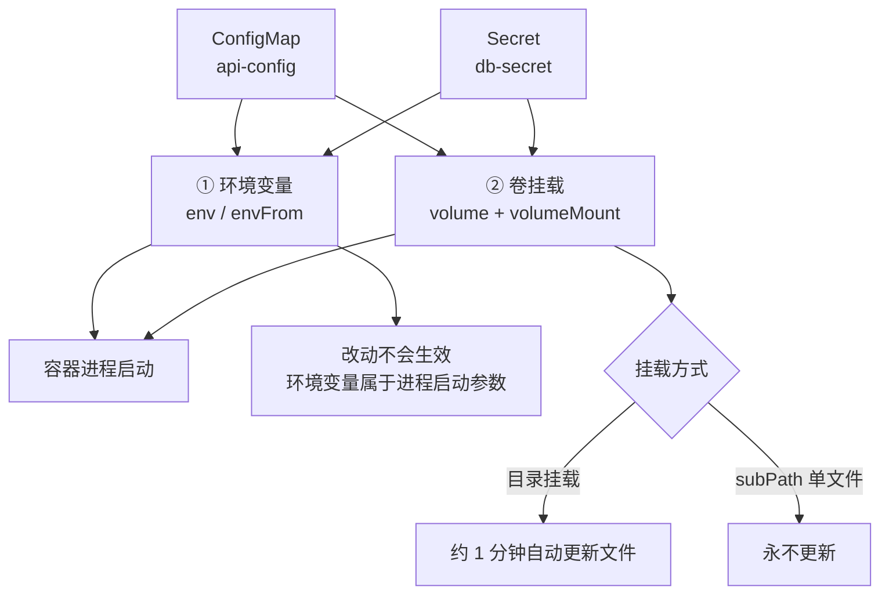
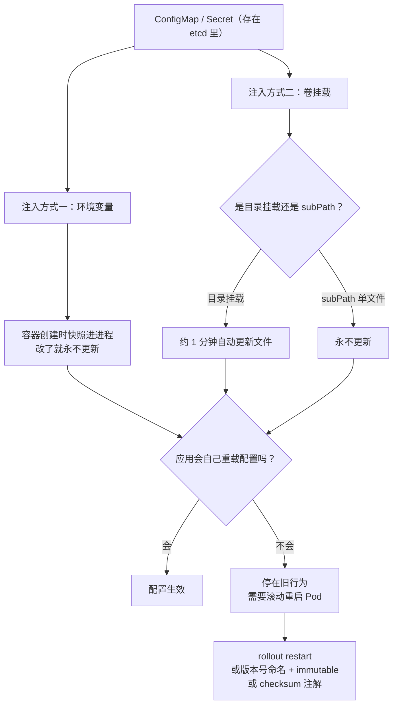

# 第 8 章　配置与密钥：ConfigMap 与 Secret

> **本章导读**
> - 建议用时：55 分钟（含 20 分钟动手）
> - 前置知识：第 4 章（调和循环）、第 5 章（Deployment）
> - 读完你应该能回答四个问题：
>   1. **Secret 和 ConfigMap 的本质区别是什么？**（提示：不是"加密与否"）
>   2. 为什么改了 ConfigMap，Pod 里的值**有时候会变、有时候不会变**？
>   3. 为什么"改完 ConfigMap 服务没生效"是最常见的求助问题？怎么根治？
>   4. `subPath` 挂载为什么会成为"改了不生效"的头号元凶？

先把 CloudNote 现在的问题摆出来。

第 5 章那份 Deployment 里，`image` 是写死的——这没问题。但紧接着这些呢？

```yaml
env:
  - name: DB_HOST
    value: postgres.cloudnote.svc.cluster.local   # 写死？测试环境地址不一样怎么办
  - name: DB_PASSWORD
    value: SuperSecret123                          # 写死？这个 YAML 要提交进 Git 的
  - name: LOG_LEVEL
    value: debug                                   # 生产要临时改成 info，难道重新发一版镜像？
```

**三个代价，一个比一个贵：**

| 代价 | 具体表现 |
|---|---|
| **构建成本** | 改一个日志级别，要重跑一遍 CI、构建镜像、推送、再滚动更新 |
| **镜像失去意义** | 镜像本该是**不可变**的（第 1 章讲过），但一旦塞进环境相关配置，同一份镜像在测试和生产行为不同——**"在我机器上是好的"又回来了** |
| **凭据泄漏** | 密码进了 Git 历史。**从这一刻起，你必须假设它已经泄露了**——删掉文件也没用，它在历史提交里 |

**核心原则一句话**：

> **镜像应该只描述"程序是什么"，配置描述"程序在这个环境里怎么跑"。两者必须分离。**

这就是 ConfigMap 和 Secret 存在的理由。

---

## 【积木 8-1】ConfigMap：把配置从镜像里抠出来

### 是什么

一个**命名空间级别**的键值对集合。就这么简单。

```yaml
apiVersion: v1
kind: ConfigMap
metadata:
  name: api-config
  namespace: cloudnote
data:
  # ① 简单的键值对
  log.level: "info"
  server.port: "8080"
  db.host: postgres.cloudnote.svc.cluster.local
  db.port: "5432"

  # ② 也可以放整个文件的内容（key 是文件名，value 是文件内容）
  nginx.conf: |
    server {
        listen 8080;
        location / { return 200 "ok\n"; }
    }
```

### 三种创建方式

```bash
# 方式一：字面量
kubectl create configmap app-config -n cloudnote \
  --from-literal=log.level=info \
  --from-literal=server.port=8080

# 方式二：从文件（key = 文件名）
kubectl create configmap app-config -n cloudnote --from-file=./app.conf

# 方式三：从整个目录（每个文件变成一个 key）
kubectl create configmap app-config -n cloudnote --from-file=./config-dir/

# 看看生成了什么
kubectl get configmap app-config -n cloudnote -o yaml
```

> **"从目录创建"这一条很实用**：它把"一个目录里的配置文件"整体变成 ConfigMap。这也是第 2 章那个 init 容器渲染配置的另一种做法。

### 一个容易忽略的点：它不只给 Pod 用

ConfigMap 是**通用的配置对象**。除了 Pod，这些地方也会用它：

- Ingress Controller 的全局配置
- CoreDNS 的 Corefile
- 各种 Operator 的配置

```bash
# 举个例子：集群 DNS 的配置就是一个 ConfigMap
kubectl get configmap coredns -n kube-system -o yaml
```

---

## 【积木 8-2】Secret 与 ConfigMap 的本质区别（纠正最大误解）

这是本章最重要的一块。**网上大多数说法都是错的。**

### 先说错误说法

> "ConfigMap 存不敏感的配置，Secret 存加密的敏感信息。"

**后半句是错的。** Secret **默认不做任何加密**，它只是把值做了 **base64 编码**：

```bash
kubectl create secret generic db-secret -n cloudnote \
  --from-literal=password=SuperSecret123

# 看它的内容
kubectl get secret db-secret -n cloudnote -o yaml
# data:
#   password: U3VwZXJTZWNyZXQxMjM=

# 一行命令就解出来了
echo U3VwZXJTZWNyZXQxMjM= | base64 -d
# SuperSecret123
```

**base64 不是加密，是编码。**它的目的只是让二进制安全地在文本协议里传输。**任何人拿到这串字符都能解出原文。**

### 那它到底"保护"了什么

Secret 相比 ConfigMap 的**真实差异**只有这些：

| 维度 | ConfigMap | Secret |
|---|---|---|
| **用途语义** | 非敏感配置 | **声明"这东西敏感"** |
| **`kubectl describe` 输出** | 直接显示内容 | **只显示字节数**，不显示值 |
| **RBAC 可单独授权** | 通常一起给 | **可以做到"能读 ConfigMap 但不能读 Secret"** |
| **etcd 静态加密** | 默认不加密 | **可以启用 `EncryptionConfiguration` 加密落盘** |
| **节点上的存储** | 普通文件 | **kubelet 写在 tmpfs（内存）里，不落磁盘** |
| **专用类型** | 无 | `kubernetes.io/tls`、`dockerconfigjson`、`basic-auth` 等 |

**所以准确的说法是**：

> **Secret 不是"加密的配置"，而是"被系统标记为敏感、并会获得额外保护措施"的配置容器。**
>
> 这些额外保护**默认大多没开**（etcd 静态加密要手动配），所以 **Secret 默认并不安全**。

### `kubectl describe` 的差异（动手验证一下）

```bash
kubectl describe configmap app-config -n cloudnote   # 直接看到所有值
kubectl describe secret db-secret -n cloudnote       # 只看到字节数
```

**这个差异会造成一种虚假的安全感**——"看不到内容，应该安全的"。但 `-o yaml` 一敲，`base64 -d` 一解，密码就在眼前。

### 真正让密码安全的四层做法

| 层次 | 手段 | 解决什么 |
|---|---|---|
| **① 不进 Git** | 用 **Sealed Secrets** / **SOPS** / **External Secrets Operator** 把密文或引用提交进仓库 | 源码仓库里的凭据泄漏 |
| **② 落盘加密** | 给 etcd 配 `EncryptionConfiguration` | 磁盘被拿走 / etcd 备份泄漏 |
| **③ 最小权限** | RBAC 只给需要的人 `get secret` 权限（第 15 章） | 内部越权读取 |
| **④ 外部密钥管理** | 用 Vault / 云 KMS + **Secrets Store CSI Driver** | 凭据生命周期、轮转、审计 |

**一个可立即执行的纪律**：

> **任何 Secret 的 YAML 都不要提交进 Git。**提交进 Git 就等于公开——即使仓库是私有的，历史记录、fork、CI 日志都可能泄漏。
>
> 如果你在 Git 历史里提交过密码，**改密码是第一优先级**，清理历史是第二优先级。因为从提交那一刻起，你就必须假设它已经泄露了。

---

### 更准确的一句话：它们是"同一个东西的两种身份"

到这里可以给一个比"一个存配置、一个存密码"精确得多的结论：

> **ConfigMap 和 Secret 在结构层几乎完全一样，差异全部在"策略层"。**
>
> **它们是同一个数据结构，被分成两个对象，用来承载不同敏感级别的数据。**

**结构层（完全一样）**：

| 维度 | 两者 |
|---|---|
| 作用域 | 命名空间级 |
| 数据类型 | `map[string]string` |
| 大小上限 | 1 MiB |
| 注入方式 | `env` / `envFrom` / `volume` 三种，写法对称 |
| 挂载行为 | 目录挂载自动更新、`subPath` 不更新——**机制完全一致** |
| 其他特性 | 都支持 `immutable`、都支持 `optional` |

**策略层（真正的差异）**：

| 维度 | ConfigMap | Secret |
|---|---|---|
| 值的表示 | `data` 明文 + `binaryData`（base64） | `data` base64 + `stringData`（只写） |
| `kubectl describe` | 显示内容 | 只显示字节数 |
| RBAC | 通常与配置一起授权 | **可以单独授权** |
| etcd 静态加密 | 不参与 | **可被单独加密** |
| 节点上的存放 | 普通文件 | kubelet 放在 **tmpfs（内存）** |

#### 那为什么不做成一个对象、加个 `sensitive: true` 字段？

这是个很好的设计问题，答案能让你理解 K8s 的取舍逻辑：

| 理由 | 说明 |
|---|---|
| **权限控制需要"对象级"边界** | RBAC 是按"资源类型 + 对象"授权的。**合成一个对象，就永远做不到"能读配置、但不能读密码"** |
| **加密策略需要"对象级"边界** | `EncryptionConfiguration` 是按资源类型（`secrets` / `configmaps`）配置的，无法按字段粒度加密 |
| **配套机制需要一个"类型"抓手** | `imagePullSecrets`、`kubernetes.io/tls`、ServiceAccount Token 这些都是 Secret 专属——如果只有一种对象，就无从区分 |

**结论**：K8s 用"两个对象"换来了**权限与加密的粒度**。这是一个典型的"多一个对象、换一层控制能力"的取舍。

#### 实用判据：怎么归类

问自己一个问题：

> **这个值如果泄漏出去，会造成损失吗？**
>
> 会 → **Secret**；不会 → **ConfigMap**

**两个方向都要小心**：

| 错误方向 | 后果 |
|---|---|
| 该用 Secret 却放进了 ConfigMap | **永久丢失**"能单独授权"和"能单独加密"这两个能力（除非重建对象） |
| 过度把什么都塞进 Secret | 权限粒度变粗——为了读一个日志级别，得给你整个 Secret 的读权限 |

**判断标准是"是否敏感"，不是"是否重要"。**一个非常重要的、但公开也不会造成损失的值（比如功能开关、路由表），应该放 ConfigMap——放 Secret 反而会让权限管理变糟。

## 【积木 8-3】Secret 的几种类型

`type` 字段决定了这个 Secret 的用途和**必须包含哪些 key**。

| 类型 | 用途 | 必须包含的 key |
|---|---|---|
| **`Opaque`**（默认） | 任意键值对 | 无 |
| **`kubernetes.io/tls`** | 第 7 章的 HTTPS 证书 | `tls.crt`、`tls.key` |
| **`kubernetes.io/dockerconfigjson`** | **拉私有镜像的凭据** | `.dockerconfigjson` |
| `kubernetes.io/basic-auth` | 基础认证 | `username`、`password` |
| `kubernetes.io/ssh-auth` | SSH 密钥 | `ssh-privatekey` |
| `kubernetes.io/service-account-token` | ServiceAccount 令牌 | 由系统管理 |

### 顺带讲清一个高频实际问题：私有镜像仓库怎么拉

```yaml
apiVersion: v1
kind: Secret
metadata:
  name: regcred
  namespace: cloudnote
type: kubernetes.io/dockerconfigjson
data:
  .dockerconfigjson: <base64 编码的 docker config json>
```

**用命令生成最省事**（它会自动处理编码）：

```bash
kubectl create secret docker-registry regcred -n cloudnote \
  --docker-server=registry.example.com \
  --docker-username=ci-user \
  --docker-password='<password>'
```

然后在 Pod 里引用：

```yaml
spec:
  imagePullSecrets:
    - name: regcred
  containers:
    - name: api
      image: registry.example.com/cloudnote/api:1.2.3   # 现在是私有镜像了
```

**这条命令能解决一类很典型的故障**：Pod 一直 `ImagePullBackOff`，`describe` 里写着 `401 Unauthorized`——那就是缺了 `imagePullSecrets`。

### `data` 和 `stringData` 的区别

| 字段 | 值的形式 | 说明 |
|---|---|---|
| `data` | **base64 编码** | 读取时的实际存储形式 |
| `stringData` | **明文** | **只写字段**：写入时 API Server 自动转成 base64 存进 `data`，读出来只会看到 `data` |

```yaml
apiVersion: v1
kind: Secret
metadata:
  name: db-secret
  namespace: cloudnote
type: Opaque
stringData:              # 写明文更方便，API Server 自动编码
  DB_PASSWORD: SuperSecret123
```

**`stringData` 方便，但要小心**：你写的明文会出现在 `kubectl apply` 的命令历史、CI 日志、以及编辑器缓存里。

---

## 【积木 8-4】注入到 Pod 的两种方式

配置有了，怎么送进容器？两条路。



### 方式一：环境变量

```yaml
spec:
  containers:
    - name: api
      image: nginx:1.27-alpine
      env:
        # 逐个引用
        - name: DB_HOST
          valueFrom:
            configMapKeyRef:
              name: api-config
              key: db.host
        - name: DB_PASSWORD
          valueFrom:
            secretKeyRef:
              name: api-secret
              key: DB_PASSWORD
      envFrom:
        # 或者把整个 ConfigMap 的所有 key 变成环境变量
        - configMapRef:
            name: api-config
          prefix: APP_        # 加前缀避免命名冲突（推荐！）
```

**优点**：写法简单，符合 12-Factor App 的习惯，几乎所有语言都原生支持读环境变量。

**缺点（这是关键）**：**Pod 启动后就固定了。**

环境变量是在**容器创建时**注入进程的。改 ConfigMap **不会**改变已经在运行的容器里的环境变量——因为环境变量属于进程的启动参数，进程不重启就改不了。

### 方式二：卷挂载

```yaml
spec:
  containers:
    - name: api
      image: nginx:1.27-alpine
      volumeMounts:
        - name: config-vol
          mountPath: /etc/app          # 挂载到目录
          readOnly: true
        - name: secret-vol
          mountPath: /etc/app/secrets  # Secret 也一样
          readOnly: true
  volumes:
    - name: config-vol
      configMap:
        name: api-config
    - name: secret-vol
      secret:
        secretName: api-secret
        defaultMode: 0400              # Secret 建议收紧权限
```

**每个 key 会变成一个文件**：

```
/etc/app/
├── log.level      （内容：info）
├── server.port    （内容：8080）
├── db.host        （内容：postgres...）
└── nginx.conf     （内容：那个多行配置）
```

**优点**：**改 ConfigMap 后，挂载的文件会在约 1 分钟内自动更新**（kubelet 定期从 API Server 同步，然后**原子替换**软链接）。

**代价**：应用得自己**监听文件变化**才会重新加载。很多程序启动时读一次配置就再也不看了——**这时候"文件更新了"和"配置生效了"是两件事。**

### 对比表（这一张表值得记住）

| 维度 | 环境变量 | 卷挂载 |
|---|---|---|
| 注入时机 | 容器创建时 | 挂载时 + **持续同步** |
| 改动 ConfigMap 后 | **不更新** | **约 1 分钟内自动更新文件** |
| 应用是否需要配合 | 不需要（但必须重启 Pod） | **需要**（要自己监听文件变化） |
| 支持多行内容 | 不支持（换行很麻烦） | **支持**（整份配置文件都能放） |
| 出问题时可见性 | `kubectl exec env` 一看就明白 | 要进容器看文件 |
| 典型用途 | 少量标量（日志级别、连接地址） | 配置文件（nginx.conf、application.yml） |

**实践建议**：

- **能用环境变量就用环境变量**（简单、跨语言、可观测性好）
- **需要放整份配置文件时用卷挂载**
- **两者混用时想清楚"改了要不要重启"**

---

## 【积木 8-5】最大的坑：改了 ConfigMap，Pod 不会重启

这是导读点名的那个经典陷阱。绝大多数"配置改了没生效"都源于它。

### 为什么会这样

回想第 4 章讲的调和循环。Deployment 控制器关注的是什么？

> **`spec.template` 有没有变。**

你改的是 **ConfigMap 对象**，不是 Deployment 的 `spec.template`。**从 Deployment 的视角看，什么都没发生**——期望副本数还是 2，Pod 模板的哈希还是原来那个，旧 RS 不用动，新 RS 不用建。

```
你改了 ConfigMap
      ↓
kubelet 发现挂载的卷变了 → 更新文件（约 1 分钟）
      ↓
但如果应用启动时只读了一次配置 → 它还在用旧值
      ↓
而且 Pod 完全没重启 → 环境变量那一路根本没变
```

**所以"改配置不生效"其实有四种可能的组合**，你要能分清：

| 注入方式 | 文件/环境变量会变吗 | 应用会自动重载吗 |
|---|---|---|
| **环境变量** | **不会**（进程启动后固定） | 不适用 |
| **卷挂载（目录）** | **会**（约 1 分钟） | **看应用**：多数不会 |
| **卷挂载（subPath）** | **不会**（见积木 8-6） | 不适用 |
| **`envFrom`** | 不会 | 不适用 |

### 四种根治方案

| 方案 | 做法 | 适用 |
|---|---|---|
| **① 手动触发滚动重启** | `kubectl rollout restart deployment/api` | 最简单，适合低频变更 |
| **② 把版本号写进名字** | ConfigMap 叫 `api-config-v3`，Deployment 引用它；改配置就建 `-v4` 并改引用 | **最稳**，配合 `immutable: true`（积木 8-7） |
| **③ 用 checksum 注解** | 模板引擎（Helm）把 ConfigMap 内容的哈希写进 Pod 模板的 annotation | **Helm 项目的标准做法**，改配置自动触发滚动更新 |
| **④ 装一个 Reloader** | 部署 `stakater/Reloader`，它 watch ConfigMap/Secret 并自动触发引用了它们的 Deployment 重启 | 环境里对象很多时省心 |

**方案 ③ 的原理值得单独理解**，因为它把"配置变更"翻译成了 Deployment 能感知的"模板变更"：

```yaml
# Helm 里常见写法
spec:
  template:
    metadata:
      annotations:
        checksum/config: {{ include (print $.Template.BasePath "/configmap.yaml") . | sha256sum }}
```

**ConfigMap 内容一变，哈希就变，Pod 模板就"变"了 → 调和循环自然发起一次滚动更新。**这是把"配置"和"部署"两个世界接起来的巧妙手法。

### 一个顺带的提醒：`kubectl rollout restart` 做了什么

它给 `spec.template.metadata.annotations` 加了一个带时间戳的注解（`kubectl.kubernetes.io/restartedAt`），于是模板哈希变了，触发一次标准的滚动更新。**和第 5 章学的发布流程完全一样**——`maxSurge` / `maxUnavailable` 依然在保护你。

---

## 【积木 8-6】`subPath` 与目录覆盖：两个真实的血案

这两个坑造成的生产事故，比前面积木加起来都多。

### 血案一：把整个目录挂空了

```yaml
# 看起来没问题
volumeMounts:
  - name: nginx-conf
    mountPath: /etc/nginx        # ← 灾难
```

**挂载会"覆盖"目标目录，而不是"合并"。**所以镜像里 `/etc/nginx/` 下原有的 `mime.types`、`fastcgi_params`、`modules/` 等等**全部被藏起来了**（不是删除，是被遮住）。nginx 一起来就报：

```
nginx: [emerg] open() "/etc/nginx/mime.types" failed (2: No such file or directory)
```

**正确做法：挂到具体的子路径，别覆盖整个目录。**

```yaml
volumeMounts:
  - name: nginx-conf
    mountPath: /etc/nginx/conf.d      # 只挂 conf.d，镜像里其他东西还在
```

或者用 **`items`** 精确控制挂哪些 key、挂成什么文件名：

```yaml
volumes:
  - name: nginx-conf
    configMap:
      name: api-config
      items:
        - key: nginx.conf          # ConfigMap 里的哪个 key
          path: default.conf       # 挂成什么文件名
```

### 血案二：`subPath` 挂了单文件，但改了永远不生效

如果你想"只覆盖一个文件，不动同目录其他文件"，标准做法是 `subPath`：

```yaml
volumeMounts:
  - name: cfg
    mountPath: /etc/nginx/nginx.conf    # 只覆盖这一个文件
    subPath: nginx.conf                 # 取自 ConfigMap 的这个 key
```

**它能解决"覆盖整个目录"的问题，但引入了一个更隐蔽的问题：**

> **`subPath` 挂载的文件永远不会被更新。**

原因是实现机制不同：

| 挂载方式 | 实现 | 更新行为 |
|---|---|---|
| **目录挂载** | kubelet 把整个 ConfigMap 渲染到一个新目录，然后**原子替换软链接** | **会更新**（约 1 分钟） |
| **`subPath` 挂载** | 用 bind mount 直接绑到**那一个具体文件** | **永不更新**（官方文档明确说明这是设计如此） |

**所以你会遇到这样的场景**：

```
你改了 ConfigMap 里的 nginx.conf
    ↓
等了两分钟，kubectl exec 进去看文件 —— 还是旧的
    ↓
以为是 kubelet 出问题了，重启 kubelet，还是旧的
    ↓
排查两小时，最后发现是 subPath
```

#### "永不更新"的准确含义（一个常见误读）

上面那张表容易被读成"subPath 挂载就算重启 Pod 也不更新"。**不是这样。**把时间维度拆开就清楚了：

| 挂载方式 | **不重建 Pod（运行期间）** | **重建 Pod 之后** |
|---|---|---|
| **目录挂载** | 约 1 分钟**自动更新**（kubelet 主动同步） | 新值 |
| **`subPath` 挂载** | **永久停在旧值** | **新值** ✅ |

**两句话说的是两个不同的时间点**：

- "`subPath` 永不更新" = **在同一个 Pod 实例运行期间**，没人会去动那个挂载
- "改完重启 Pod" = **重建之后当然会拿到新值**

**为什么重建后会变？机制在这里：**

```
ConfigMap 更新时，kubelet 做了什么：
  ① 把新内容渲染到一个新目录
  ② 原子地把 ..data 这个「软链接」指过去
  ③ 卷目录里的 log.level 是个软链接 → 指向 ..data/log.level
     → 所以它「跟着走」了，读到新内容

subPath 挂载时，kubelet 做了什么：
  ① 把 <卷目录>/log.level 这个路径 解析成一个具体文件
  ② bind mount 那个文件到容器里的路径
  ③ bind mount 会「锁」在解析出来的那个文件上
     → ..data 被换掉后，那个具体文件成了「孤儿」，但 bind mount 还指着它
     → 容器永远读到旧内容
```

**所以重建 Pod 时，bind mount 被销毁、挂载流程重新执行一遍**——重新解析路径、绑到新文件，自然就是新值了。

**这个澄清带来一个很实用的推论：**

> **只要你能接受"改配置 → 手动重启 Pod"这个流程，那 `subPath` 和目录挂载在"重启之后"的行为完全一样。**
>
> `subPath` 唯一的额外风险是：**你忘了重启时，它会静默地什么都不发生**——而目录挂载至少文件已经变新了，还给你留了"应用可能自己会重载"的机会。

#### 决策建议

| 你的需求 | 用什么 | 说明 |
|---|---|---|
| 只覆盖一个文件，不污染目录，且**能接受手动重启流程** | **`subPath`** | 重启后会拿到新值；但要建立"改完必须重启"的规矩 |
| 一份配置文件，希望**不重启**也能自动更新 | **目录挂载**（挂到 `conf.d` 这类专用子目录，别挂父目录） | 文件会自动变；能否生效还看应用会不会重载 |
| 多个文件，希望自动更新 | **目录挂载 + 专门的挂载点目录** | — |

> **一句话记忆**：**`subPath` 的代价不是"永远拿不到新值"，而是"必须靠重启才能拿到"。**
>
> 所以如果你用了 `subPath`，就必须把"改配置"和"重启 Pod"绑成一个动作——积木 8-5 那四种方案（`rollout restart` / 版本号命名 + immutable / checksum 注解 / Reloader）随便选一个即可。

**动手验证**：本章【积木 8-8】的实验第四步会看到 `subPath` 挂载停在旧值；第五步重建 Pod 后再看，**它就会变成新值**。这两步连着做，这个知识点就再也不会混了。

### 还有一个小坑：缺失的 ConfigMap 会阻止 Pod 启动

```yaml
envFrom:
  - configMapRef:
      name: api-config      # 如果这个 ConfigMap 不存在…
```

Pod 会卡在 `CreateContainerConfigError`，无法启动。日志里写着 `configmap "api-config" not found`。

**如果你希望"配置缺失时用代码里的默认值"**，加上 `optional: true`：

```yaml
volumes:
  - name: cfg
    configMap:
      name: api-config
      optional: true          # 不存在也不阻塞启动
```

**这是个很实用的开关**：能让配置对象和应用的部署**解耦**——应用先起来、配置后补上也不会卡住。

---

## 【积木 8-7】边界与限制：什么不该放进去

### 三条硬限制

| 限制 | 数值/行为 | 影响 |
|---|---|---|
| **大小上限** | **1 MiB** | 放不了大文件、数据集、模型权重 |
| **命名空间隔离** | Pod **只能**引用同命名空间的 ConfigMap/Secret | 跨环境共享配置要各建一份 |
| **总量** | 都在 etcd 里，计入 etcd 的容量 | 别把 ConfigMap 当小型数据库用 |

### `immutable: true`：一个被低估的好东西

```yaml
apiVersion: v1
kind: ConfigMap
metadata:
  name: api-config-v3
data:
  log.level: "info"
immutable: true      # ← 创建后内容不能再改
```

它带来三个好处：

| 好处 | 原因 |
|---|---|
| **性能更好** | kubelet **不用再 watch** 这个 ConfigMap 的变化，API Server 也不用推送更新 |
| **防误改** | 谁都不能"顺手改一下生产配置"，必须走"新建 + 改引用"的流程 |
| **天然配合版本号命名** | `api-config-v3` 这种命名和 immutable 是绝配 |

**代价是**：改了要新建一个对象并更新 Deployment 的引用，**流程变重了**。但对生产环境来说，这个"重"恰恰是好事——它逼你走正规的变更流程。

### 什么不该放进 ConfigMap/Secret

| 不该放 | 该用什么 |
|---|---|
| 大于 1 MiB 的文件、二进制、模型 | 对象存储 + 启动时下载，或专门的卷 |
| 频繁动态变化、要求秒级生效的配置 | 配置中心（Apollo / Nacos / Consul） |
| 需要复杂校验、版本回滚的配置 | 配置中心 |
| 高敏感、要求轮转与审计的凭据 | **Vault / 云 KMS** + Secrets Store CSI Driver |
| 应用自己的运行时状态 | 数据库 / redis |

> **最后一行值得强调**：ConfigMap 是**只读输入**，不是可写存储。把它当"可以读写的小数据库"用（比如让应用往里面写进度），会立刻撞上 `immutable`、并发冲突（第 4 章的乐观并发）、以及"谁在改我的配置"的混乱。**要写状态就写数据库。**

---

## 【积木 8-8】动手：一次实验看清全部三种行为

这一个实验把前面所有知识点串起来——**在同一个 Pod 里同时用三种注入方式，改一次 ConfigMap，看哪一路变了**。

配套脚本：

```bash
bash cases/cloudnote/tools/config-lab.sh
```

手动流程如下。

### 第一步：创建 ConfigMap 和 Secret

```bash
kubectl apply -f cases/cloudnote/00-namespace.yaml
kubectl apply -f cases/cloudnote/10-config.yaml

kubectl get configmap,secret -n cloudnote
```

先仔细看一下 Secret 到底"加密"了没有：

```bash
# kubectl describe：只显示字节数
kubectl describe secret api-secret -n cloudnote

# -o yaml：看到 base64
kubectl get secret api-secret -n cloudnote -o yaml

# 解开它
kubectl get secret api-secret -n cloudnote -o jsonpath='{.data.DB_PASSWORD}' | base64 -d; echo
```

**看到明文了吗？这就是"Secret 默认不是加密"的实证。**记住这个感受——它比任何文字都有说服力。

### 第二步：创建三种注入方式并存的 Pod

```bash
kubectl apply -f cases/cloudnote/18-config-demo.yaml
kubectl get pod config-demo -n cloudnote
```

这个 Pod 里同时有：

| 注入方式 | 在 Pod 里的位置 |
|---|---|
| **环境变量**（`configMapKeyRef`） | `$LOG_LEVEL` |
| **目录卷挂载** | `/etc/app/` 下的文件 |
| **`subPath` 单文件挂载** | `/etc/app-single/log.level` |

**先看初始状态**：

```bash
kubectl logs config-demo -n cloudnote --tail=3

kubectl exec config-demo -n cloudnote -- sh -c '
echo "① 环境变量      LOG_LEVEL = $LOG_LEVEL"
echo "② 目录挂载      /etc/app/log.level        = $(cat /etc/app/log.level)"
echo "③ subPath 挂载  /etc/app-single/log.level = $(cat /etc/app-single/log.level)"
'
```

三路都应该是初始值。

### 第三步：改 ConfigMap，然后等 90 秒

```bash
kubectl patch configmap api-config -n cloudnote \
  --type merge -p '{"data":{"log.level":"error"}}'

date +%H:%M:%S
echo "等待 kubelet 同步（约 1-2 分钟）..."
sleep 90
```

### 第四步：对比三路的结果（本章最关键的一次观察）

```bash
kubectl exec config-demo -n cloudnote -- sh -c '
echo "① 环境变量      LOG_LEVEL = $LOG_LEVEL"
echo "② 目录挂载      /etc/app/log.level        = $(cat /etc/app/log.level)"
echo "③ subPath 挂载  /etc/app-single/log.level = $(cat /etc/app-single/log.level)"
'
```

**预期结果（请自己跑一遍确认）**：

| 注入方式 | 值 | 结论 |
|---|---|---|
| ① 环境变量 | **还是旧值** | **永远不会更新**，必须重建 Pod |
| ② 目录挂载 | **变成新值** ✅ | **会自动更新**（kubelet 同步） |
| ③ `subPath` 挂载 | **还是旧值** | **永不更新**，这是设计如此 |

**这三行结果，就是本章 80% 的知识点。**

还有一个细节值得看——kubelet 是用**原子替换软链接**的方式更新的：

```bash
kubectl exec config-demo -n cloudnote -- ls -la /etc/app/
# 你会看到 log.level 是一个指向 ..data/ 下真实文件的软链接
# 而 ..data 本身也是一个软链接
# 更新时 kubelet 新建一个 ..data_tmp 目录，再原子地把 ..data 指过去
```

**为什么要这么麻烦？**因为**原子性**——应用要么看到全部旧值，要么看到全部新值，**不会看到"改了一半"的中间状态**。这是第 4 章"原子性 vs 幂等性"里"单对象原子"的一次工程体现。

### 第五步：用滚动重启让配置真正生效

```bash
# 应用不会自己重载配置，所以要让 Pod 重建
kubectl rollout restart deployment/api -n cloudnote
kubectl rollout status deployment/api -n cloudnote

# demo Pod 是裸 Pod，直接删了重建
kubectl delete pod config-demo -n cloudnote
kubectl apply -f cases/cloudnote/18-config-demo.yaml
sleep 8
kubectl exec config-demo -n cloudnote -- sh -c 'echo "重建后的环境变量 LOG_LEVEL=$LOG_LEVEL"'
```

**重建后环境变量才变成新的值。**这就解释了那个超高频的疑问——"我改了配置，为什么服务行为没变？"

### 第六步：验证"目录覆盖"这个坑

```bash
# 故意把整个 /etc/nginx 挂空
cat <<'EOF' | kubectl apply -f -
apiVersion: v1
kind: Pod
metadata:
  name: nginx-broken
  namespace: cloudnote
spec:
  containers:
    - name: nginx
      image: nginx:1.27-alpine
      volumeMounts:
        - name: cfg
          mountPath: /etc/nginx          # ← 覆盖整个目录
  volumes:
    - name: cfg
      configMap:
        name: api-config
EOF

sleep 10
kubectl get pod nginx-broken -n cloudnote
kubectl logs nginx-broken -n cloudnote
```

**你会看到 nginx 因为找不到 `mime.types` 而起不来。**这就是"挂载是覆盖而不是合并"的实证。

```bash
kubectl delete pod nginx-broken -n cloudnote
```

### 第七步：验证 `optional` 的作用

```bash
cat <<'EOF' | kubectl apply -f -
apiVersion: v1
kind: Pod
metadata:
  name: opt-cm
  namespace: cloudnote
spec:
  containers:
    - name: demo
      image: busybox:1.36
      command: ["sh","-c","echo 'Pod 正常启动了（配置缺失但不阻塞）'; sleep 3600"]
      envFrom:
        - configMapRef:
            name: not-exist-config
            optional: true      # ← 关键
EOF

sleep 8
kubectl get pod opt-cm -n cloudnote
kubectl logs opt-cm -n cloudnote
```

**正常启动。**这个开关在"应用和配置解耦部署"的场景里非常有用。

**作为对照**，把 `optional: true` 去掉再创建，Pod 会卡在 `CreateContainerConfigError`：

```bash
kubectl delete pod opt-cm -n cloudnote
# 手动把上面 YAML 里的 optional: true 删掉再 apply，观察状态
```

清理：

```bash
kubectl delete pod config-demo opt-cm -n cloudnote --ignore-not-found
kubectl delete -f cases/cloudnote/10-config.yaml
```

---

## 【积木 8-9】速查：四步流程 + 四种写法 + 常见报错

前面讲的都是"为什么"。这一节是"怎么做"——可以直接照着抄。

### 第 1 步：创建对象

```bash
# ConfigMap：三种来源
kubectl create configmap api-config -n cloudnote \
  --from-literal=log.level=info \
  --from-literal=db.host=postgres

# Secret：从字面量（key 自动大写转义要注意）
kubectl create secret generic api-secret -n cloudnote \
  --from-literal=DB_USER=cloudnote \
  --from-literal=DB_PASSWORD='<password>'

# Secret：从文件
kubectl create secret generic tls-secret -n cloudnote \
  --from-file=cert.pem --from-file=key.pem

# Secret：TLS 证书（专用类型，自动设置正确的 key 名）
kubectl create secret tls cloudnote-tls -n cloudnote \
  --cert=note.example.com.crt --key=note.example.com.key

# Secret：私有镜像仓库凭据
kubectl create secret docker-registry regcred -n cloudnote \
  --docker-server=registry.example.com \
  --docker-username=ci-user --docker-password='<password>'

# 验证
kubectl get configmap,secret -n cloudnote
kubectl get configmap api-config -n cloudnote -o jsonpath='{.data}'    # 看 key 有哪些
```

### 第 2 步：在 Pod 里引用（四种写法，语法完全对称）

**① ConfigMap → 环境变量**

```yaml
spec:
  containers:
    - name: api
      env:
        # 单个 key：显式指定环境变量名
        - name: LOG_LEVEL
          valueFrom:
            configMapKeyRef:
              name: api-config
              key: log.level
              optional: false          # 不存在则 Pod 不启动；true 则用默认值
      envFrom:
        # 全部 key → 环境变量，加前缀避免污染
        - configMapRef:
            name: api-config
          prefix: APP_                 # APP_LOG_LEVEL、APP_DB_HOST...
```

**② ConfigMap → 文件**

```yaml
spec:
  containers:
    - name: api
      volumeMounts:
        - name: cfg
          mountPath: /etc/app         # 每个 key 变成一个文件
          readOnly: true
  volumes:
    - name: cfg
      configMap:
        name: api-config
        optional: false
        defaultMode: 0644
        # 想精确控制挂哪些 key、挂成什么文件名，用 items：
        # items:
        #   - key: app.properties
        #     path: application.properties
```

**③ Secret → 环境变量**

```yaml
spec:
  containers:
    - name: api
      env:
        - name: DB_PASSWORD
          valueFrom:
            secretKeyRef:                # ← 只把 configMapKeyRef 换成 secretKeyRef
              name: api-secret
              key: DB_PASSWORD
      envFrom:
        - secretRef:                     # ← 只把 configMapRef 换成 secretRef
            name: api-secret
```

**④ Secret → 文件**

```yaml
spec:
  containers:
    - name: api
      volumeMounts:
        - name: sec
          mountPath: /etc/secrets
          readOnly: true
  volumes:
    - name: sec
      secret:
        secretName: api-secret           # ← 注意这里字段名是 secretName，不是 name
        defaultMode: 0400                # Secret 建议收紧权限
```

> **记忆窍门**：把 `configMap` 换成 `secret`、`configMapKeyRef` 换成 `secretKeyRef`、`configMapRef` 换成 `secretRef` 就是另一种。只有一个字段名不规则：**Secret 卷用的是 `secretName` 而不是 `name`**。

### 第 3 步：验证真的注入进去了

```bash
# 环境变量进去了吗
kubectl exec deploy/api -n cloudnote -- env | grep -E "LOG_LEVEL|DB_"

# 文件挂进去了吗
kubectl exec deploy/api -n cloudnote -- ls -l /etc/app/
kubectl exec deploy/api -n cloudnote -- cat /etc/app/log.level

# 挂载点长什么样（能看到软链接结构）
kubectl exec deploy/api -n cloudnote -- ls -la /etc/app/
```

### 第 4 步：变更配置的标准流程

```
① 改 ConfigMap / Secret
        ↓
② 确认要不要重启（关键问题）
     · 环境变量  → 必须重启
     · subPath  → 必须重启
     · 目录挂载  → 看应用会不会重载配置；不确定就当必须重启
        ↓
③ 触发滚动重启
     kubectl rollout restart deployment/api -n cloudnote
     kubectl rollout status  deployment/api -n cloudnote
        ↓
④ 验证配置已经生效
     kubectl exec deploy/api -n cloudnote -- env | grep LOG_LEVEL
```

**更稳的做法**（推荐生产用）：**ConfigMap 名字带版本号 + `immutable: true`**，改配置 = 新建对象 + 改 Deployment 引用。这样"配置变更"和"发布"始终一起发生，不会有人忘记重启。

### 一个完整的集成示例（CloudNote api）

把本章所有零件拼起来，`api` 的 Deployment 该长这样：

```yaml
apiVersion: apps/v1
kind: Deployment
metadata:
  name: api
  namespace: cloudnote
spec:
  replicas: 2
  selector:
    matchLabels:
      app: api
  template:
    metadata:
      labels:
        app: api
      annotations:
        # 关键：把配置的哈希写进模板，配置一改就自动触发滚动更新（Helm 里常用）
        # checksum/config: <configmap 内容的 sha256>
    spec:
      imagePullSecrets:              # 私有镜像仓库凭据（只认 Secret）
        - name: regcred
      containers:
        - name: api
          image: registry.example.com/cloudnote/api:1.2.3
          ports:
            - name: http
              containerPort: 8080

          # ① 少量标量走环境变量
          env:
            - name: LOG_LEVEL
              valueFrom:
                configMapKeyRef: { name: api-config, key: log.level }
            - name: DB_HOST
              valueFrom:
                configMapKeyRef: { name: api-config, key: db.host }
            - name: DB_PASSWORD
              valueFrom:
                secretKeyRef: { name: api-secret, key: DB_PASSWORD }

          # ② 整份配置文件走卷挂载（挂到专用子目录，别覆盖父目录）
          volumeMounts:
            - name: app-config
              mountPath: /etc/app
              readOnly: true
            - name: db-creds
              mountPath: /etc/secrets
              readOnly: true

          readinessProbe:
            httpGet: { path: /healthz, port: http }
            initialDelaySeconds: 3
            periodSeconds: 5
          resources:
            requests: { cpu: 100m, memory: 128Mi }
            limits:   { cpu: 500m, memory: 256Mi }

      volumes:
        - name: app-config
          configMap:
            name: api-config
        - name: db-creds
          secret:
            secretName: api-secret
            defaultMode: 0400
```

**这个清单里每一行的来历**：

| 片段 | 来自 |
|---|---|
| `env` 里用 `configMapKeyRef` / `secretKeyRef` | 积木 8-4 方式一 |
| `volumeMounts` 挂到 `/etc/app`（专用子目录） | 积木 8-6 血案一（不要挂父目录） |
| `defaultMode: 0400` | 积木 8-4 的 Secret 收紧权限 |
| `imagePullSecrets` | 积木 8-3（只认 Secret） |
| `checksum` 注解（注释掉的那行） | 积木 8-5 方案 ③（根治"改配置不生效"） |
| `readinessProbe` + `resources` | 第 5 章的生产必备字段清单 |

### 常见报错对照表

| 现象 | 原因 | 怎么查 / 怎么修 |
|---|---|---|
| Pod 卡在 `CreateContainerConfigError` | 引用的 ConfigMap/Secret **不存在** | `kubectl describe pod` 看 Events；确认名字和命名空间；或加 `optional: true` |
| `could not find key XXX in configmap` | **key 名拼错**（常见于大小写） | `kubectl get cm api-config -o jsonpath='{.data}'` 核对 |
| Pod `ImagePullBackOff` + `401 Unauthorized` | 私有仓库**缺 `imagePullSecrets`** | 创建 `docker-registry` Secret 并在 Pod 里引用 |
| 改了配置**完全没生效** | 你用的是环境变量（永不更新） | `kubectl rollout restart` |
| 挂了文件的配置改了没生效 | `subPath` 挂载（永不更新） | 改成目录挂载，或接受重启 |
| 文件更新了但应用行为没变 | 应用启动时只读了一次配置 | 让应用监听文件变化，或重启 Pod |
| nginx 起不来，报 `mime.types not found` | 挂载**覆盖了整个 `/etc/nginx`** | 改挂到 `/etc/nginx/conf.d` |
| 挂进去的文件**权限不对**、非 root 容器读不了 | `defaultMode` 默认 0644，属主是 root | 设 `defaultMode`，配合 Pod 级 `securityContext.fsGroup` |
| `kubectl describe cm` 能看到值，`describe secret` 看不到 | 这是**设计如此**，不是故障 | 用 `-o yaml` + `base64 -d` 看 Secret 内容 |

> **一条排查主线**：出现配置类故障时，按这个顺序走——
>
> **① 对象存在吗 → ② key 名对吗 → ③ 注入方式是什么（决定要不要重启）→ ④ 挂载路径对不对（有没有覆盖父目录）→ ⑤ 应用会自己重载吗**

## 【本章小结】

### 四句话总结

1. **Secret 不是"加密的 ConfigMap"。**它默认只是 base64 **编码**，真正多出来的保护是"语义标记 + describe 不显示内容 + 可单独 RBAC + 可选 etcd 静态加密 + 节点上用 tmpfs"。**默认状态下它不安全。**
2. **配置注入的两条路各有硬约束**：环境变量简单但**永不更新**；目录卷挂载会**自动更新**但需要应用配合监听文件。
3. **改 ConfigMap 不会触发 Pod 重建**——因为 Deployment 只关心 `spec.template`。根治办法是 `rollout restart`、版本号命名 + immutable、或 checksum 注解。
4. **`subPath` 挂载在 Pod 运行期间永不更新**（设计如此），**但重建 Pod 后会拿到新值**；**目录挂载是覆盖而非合并**。这两个坑造成的故障，比这一章其他内容加起来都多。

### 一张图收尾



### 自测题

1. Secret 和 ConfigMap 的本质区别是什么？为什么说"Secret 是加密的"是错的？（积木 8-2）
2. 用一条命令把 Secret 里的密码解出来。（积木 8-2）
3. 为什么"`kubectl describe` 看不到 Secret 内容"会带来虚假的安全感？（积木 8-2）
4. 让密码真正安全的四层做法分别是什么？（积木 8-2）
5. ConfigMap 和 Secret 在"结构层"有哪些相同点？为什么 K8s 不把它们合成一个对象？（积木 8-2）
6. 判断一个值该放 ConfigMap 还是 Secret 的准绳是什么？"过度用 Secret"有什么副作用？（积木 8-2）
7. `data` 和 `stringData` 有什么区别？哪个是只写字段？（积木 8-3）
8. 环境变量注入和卷挂载注入，改 ConfigMap 后行为有什么不同？（积木 8-4）
9. 为什么改了 ConfigMap，Deployment **不会**自动滚动更新？（积木 8-5）
10. 让"改配置自动触发发布"的三种做法是什么？checksum 注解的原理是什么？（积木 8-5）
11. 把 ConfigMap 挂到 `/etc/nginx` 会发生什么？为什么？（积木 8-6）
12. `subPath` 挂载为什么在运行期间永不更新？**重建 Pod 之后会更新吗？**为什么？（积木 8-6）
13. `optional: true` 解决什么问题？（积木 8-6）
14. ConfigMap 的大小上限是多少？哪些东西不该放进去？（积木 8-7）
15. `immutable: true` 有什么好处和代价？（积木 8-7）
16. 私有镜像仓库的凭据该怎么配？Pod 报 `ImagePullBackOff` + `401` 时先看什么？（积木 8-3）
17. ConfigMap 转成 Secret 引用，需要改哪三个字段名？**哪个字段名不规则？**（积木 8-9）
18. Pod 卡在 `CreateContainerConfigError` 时，你的排查顺序是什么？（积木 8-9）

### 下一章预告

**第 9 章：数据要持久 —— Volume、PV、PVC、StorageClass**

配置解决了。但 CloudNote 还有一个更严重的问题没解决——**数据在哪？**

第 2 章讲过：`emptyDir` 随 Pod 生命周期，**Pod 一删，里面什么都没了**。而 CloudNote 的 `postgres` 是要存用户笔记的。

> 那用 `hostPath` 挂到节点目录上？**Pod 换个节点，数据就找不到了。**
>
> 那怎么办？让存储"跟着 Pod 走"吗？还是让 Pod"跟着存储走"？

这一章会讲清楚 K8s 存储最核心的三层抽象——**Volume、PV、PVC** 各自解决什么问题、为什么要有 `StorageClass`（让存储像 Pod 一样被"动态供给"）、`accessModes`（RWO / ROX / RWX）的真实含义和常见误解、以及 **StatefulSet 为什么必须配 PVC**（为第 13 章铺路）。

---

*学完本章，回到对话里说一句「继续」，我就开讲第 9 章。*
