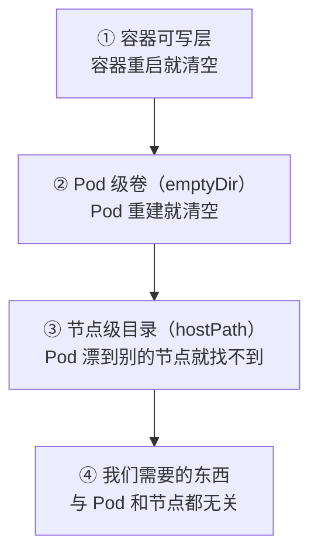
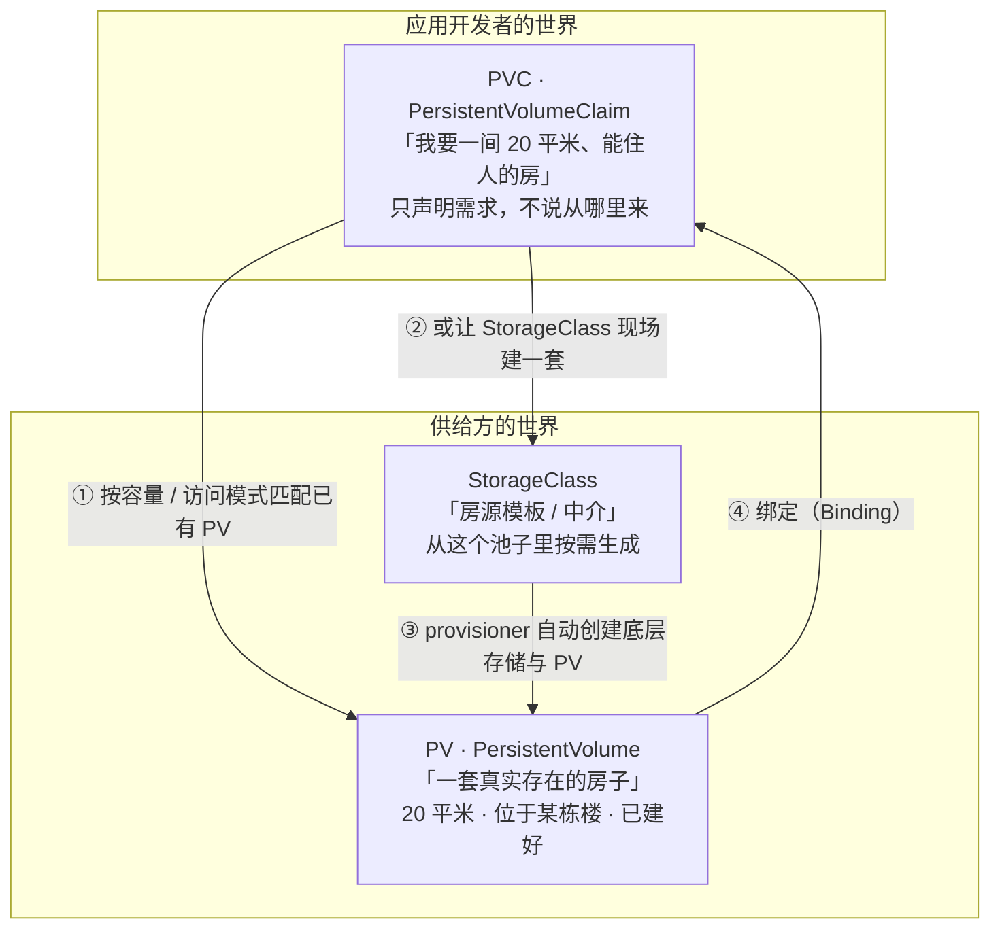

# 第 9 章　数据要持久：Volume、PV、PVC、StorageClass

> **本章导读**
> - 建议用时：60 分钟（含 25 分钟动手）
> - 前置知识：第 2 章（Pod 是一次性的）、第 4 章（ownerReference 与级联删除）、第 8 章（ConfigMap 卷）
> - 读完你应该能回答四个问题：
>   1. **Volume / PV / PVC / StorageClass 各解决什么问题？**为什么要有四层，不能直接挂一个目录吗？
>   2. `accessModes` 里的 **`ReadWriteOnce` 到底是"一个 Pod"还是"一个节点"**？（这是最普遍的误解）
>   3. 为什么会有"PVC 一直是 `Pending`，Pod 调度不上去"这种经典故障？
>   4. **删 PVC 会删掉真实数据吗？**（答案会让你重新审视备份）

配置解决了，但 CloudNote 最要命的问题还悬着——**`postgres` 里的用户笔记存在哪？**

第 2 章我们讲过：`emptyDir` 随 Pod 生命周期，**Pod 一删，里面什么都没了**。而用户笔记不能丢。

---

## 【积木 9-1】先看清容器文件系统的三层"寿命"

要理解为什么需要一套复杂的存储抽象，先把"数据能活多久"这件事拆成三层。



| 层次 | 数据的寿命 | 什么时候丢 |
|---|---|---|
| **容器可写层**（第 2 章讲过） | 跟随**容器** | 容器重启就没了 |
| **`emptyDir`** | 跟随 **Pod** | Pod 被删除 / 重建 / 驱逐就没了 |
| **`hostPath`** | 跟随**节点** | Pod 被调度到别的节点，就找不到数据了 |
| **我们需要的东西** | **独立于 Pod 和节点** | 只有主动删才没 |

**核心矛盾在这里**：

> **Pod 是"易失的、会漂移的"**（第 2 章：Pod 是一次性的；第 10 章会讲调度到哪台机器是不确定的）
>
> **而数据必须是"不易失的、位置固定的"**
>
> **两个性质相反的东西，怎么接起来？**

K8s 的答案不是"让 Pod 别漂"，而是**把存储抽出来，做成一个独立的、有自己生命周期的对象**，然后让 Pod 去"认领"它。

这就是 Volume → PV → PVC 这一套抽象的由来。**它不是设计得复杂，而是这个问题本身就复杂。**

---

## 【积木 9-2】Volume：一个被误解的名字

先纠正一个常见的直觉。**K8s 里的 Volume 不是"一块磁盘"，而是"一个可以被挂载到容器里的目录"。**

它可能来自很多地方：

| Volume 类型 | 数据实际在哪 | 生命周期 |
|---|---|---|
| `emptyDir` | 节点的临时目录（或内存） | **随 Pod** |
| `configMap` / `secret` | etcd 里的对象 | 随对象 |
| `downwardAPI` | API Server 里的 Pod 元数据 | 随 Pod |
| `hostPath` | **某个节点的固定目录** | 随节点 |
| `persistentVolumeClaim` | **由 PV 决定（通常在集群外的存储）** | **独立** |
| `nfs` / `csi` / `cephfs` | 外部存储系统 | 独立 |

**这张表最关键的一列是"数据实际在哪"。**因为"卷"只是个挂载点，数据的位置决定了它的命运：

```
数据在 Pod 里   → Pod 死了就没了
数据在节点上   → 节点换了就没了
数据在外部存储 → 只有你主动删才没   ← 我们要的
```

按用途可以分成三类：

| 类别 | 卷类型 | 典型用途 |
|---|---|---|
| **配置注入** | `configMap` / `secret` / `downwardAPI` | 第 8 章讲的那些 |
| **临时交换** | `emptyDir` | 多容器共享、init 容器传数据、临时缓存 |
| **持久数据** | **`persistentVolumeClaim`** | **数据库、上传的文件、任何不能丢的东西** |

---

## 【积木 9-3】`emptyDir`：用对了很好，用错了很惨

第 2 章我们用它给主容器和边车共享日志目录。但它的边界必须记牢。

```yaml
volumes:
  - name: scratch
    emptyDir:
      sizeLimit: 500Mi        # 建议设上限，否则可能写满节点磁盘
```

### 它适合什么

| 场景 | 为什么合适 |
|---|---|
| 多容器共享目录（边车读日志） | 数据只需要活在 Pod 生命周期内 |
| init 容器给主容器传数据 | 同上 |
| 临时缓存 / 中间计算结果 | 丢了可以重算 |
| 做内存盘加速（`medium: Memory`） | 高速临时存储 |

```yaml
# 把 emptyDir 放进内存（tmpfs），速度极快
volumes:
  - name: fast-scratch
    emptyDir:
      medium: Memory          # ⚠️ 占用的是内存限额，会算进 Pod 的 memory limit
      sizeLimit: 256Mi
```

> **注意**：`medium: Memory` 的 emptyDir **会计入容器的内存用量**。用得不好会直接把 Pod 撑到 `OOMKilled`——这是个隐蔽的坑。

### 它绝对不适合什么

| 场景 | 后果 |
|---|---|
| 数据库数据目录 | Pod 一重建，**全部用户数据消失** |
| 用户上传的文件 | 同上 |
| 任何"重新生成代价很高"的东西 | 一次节点驱逐就全没了 |

> **一句话判据**：**问自己"如果这份数据明天早上消失，我能接受吗？"**
> 能接受 → `emptyDir`；不能 → 必须用 PVC。

### 一个容易被忽略的行为

`emptyDir` 的默认存储介质是**节点磁盘**（不是内存）。但它有个微妙之处：

- **容器崩溃重启** → emptyDir 的数据**还在**（因为 Pod 没重建）
- **Pod 被删除或重建** → 数据**没了**

这解释了为什么"容器重启，但数据还在"——回到第 2 章那句"**容器重启不等于 Pod 重启**"。

---

## 【积木 9-4】`hostPath`：为什么它是"反模式"

新手最自然的想法是："Pod 换节点找不到数据？那我挂到**某台固定节点**的目录上不就行了？"

```yaml
volumes:
  - name: data
    hostPath:
      path: /data/cloudnote     # ← 反模式
      type: DirectoryOrCreate
```

**它确实能工作**——在单节点集群上、在你自己的笔记本上。但一旦上生产，会同时踩五个坑：

| 坑 | 后果 |
|---|---|
| **调度不可控** | Pod 被调度到别的节点，**数据凭空消失**（而调度器完全不知道这个约束） |
| **多副本冲突** | 2 个副本在同一节点会同时写同一个目录 → 数据错乱；在不同节点又各写各的 → 数据分裂 |
| **权限与安全** | 挂 `/var/run/docker.sock`、挂 `/etc` 这类操作可以**直接逃逸出容器** |
| **节点故障** | 节点坏了，数据也跟着坏，没有冗余 |
| **无法声明容量** | 没法限制用多少，也没法感知还剩多少 |

**它是"把节点当成存储"的思路，而 K8s 的核心假设恰恰是"节点是会坏的、可替换的"。**

### 什么时候它还能用

| 场景 | 说明 |
|---|---|
| **DaemonSet 读节点日志 / 指标** | 本来就是"每个节点处理自己的东西"，且只读（`type: File`） |
| **单节点学习环境** | 明确知道只有一台机器 |
| **CNI / CSI 插件自己的配置目录** | 系统组件的特殊需求 |

### 比它好的替代：Local PV

如果你确实需要"高性能 + 数据留在这台机器"（比如本地 SSD 上的数据库），用 **`local` 类型的 PV**：

```yaml
apiVersion: v1
kind: PersistentVolume
metadata:
  name: local-pv-1
spec:
  capacity:
    storage: 100Gi
  accessModes: ["ReadWriteOnce"]
  storageClassName: local-storage
  local:
    path: /mnt/ssd/cloudnote
  nodeAffinity:                          # ← 关键：声明"我在这台节点上"
    required:
      nodeSelectorTerms:
        - matchExpressions:
            - key: kubernetes.io/hostname
              operator: In
              values: ["node-1"]
```

**关键差别**：`hostPath` 的节点绑定是**隐式**的（调度器不知道），而 local PV 通过 `nodeAffinity` **显式声明**——调度器会把 Pod 调度到正确的节点，或者干脆不调度（而不是调过去之后才发现没数据）。

> **这体现了一个通用的设计原则**：**约束必须"显式声明"给系统，而不是藏在宿主机目录里。**这也是整章都在重复的主题。

---

## 【积木 9-5】三层抽象：PV 和 PVC 到底是谁写给谁的

这是本章的核心。用**租房**来类比最清楚。

### 三个角色



| 对象 | 谁写 | 类比 | 作用域 |
|---|---|---|---|
| **Volume** | 应用开发者（写在 Pod 里） | 「把房子接上水电」 | Pod |
| **PVC** | **应用开发者** | 「我的租房需求单」 | **命名空间级** |
| **PV** | **存储管理员 / 自动创建** | 「一套真实的房子」 | **集群级** |
| **StorageClass** | **集群管理员** | 「房源模板 / 中介」 | 集群级 |

### 为什么要"需求"和"供给"分开

这是 K8s 存储设计最关键的一步。想想如果不分开会怎样：

```
如果 Pod 里直接写「挂载 10.0.3.7:/export/cloudnote-nfs」：
   → 应用 YAML 里塞进了存储系统的细节
   → 换个环境（测试集群用 Ceph、生产用云盘）就要改应用 YAML
   → 应用的 YAML 会变成"环境配置清单"
```

分开之后：

```yaml
# 应用侧（任何环境都一样）
volumes:
  - name: data
    persistentVolumeClaim:
      claimName: postgres-data      # ← 我只说"用这个认领"
```

```yaml
# 存储侧（由环境决定）
apiVersion: storage.k8s.io/v1
kind: StorageClass
metadata:
  name: fast-ssd
provisioner: driver.longhorn.io     # 或 ebs.csi.aws.com / diskplugin.csi.alibabacloud.com
```

**应用只认 PVC 的名字，完全不知道底层是 NFS、Ceph、云盘还是本地 SSD。**这是第 6 章"Service 解耦 Pod IP"的同一个思路：

> **在"使用者"和"实现"之间插一层抽象，让使用者只声明"我要什么"，而不是"用哪个"。**

### 绑定（Binding）是怎么发生的

```
① PVC 创建 → 状态 Pending
② 控制器开始找匹配的 PV
     容量 ≥ PVC 请求的容量
     accessModes 兼容
     storageClassName 一致
     （可选）selector 匹配
③ 找到 → 双向绑定，状态变 Bound
④ 找不到 → 一直 Pending，Pod 也调度不上去
```

**"PVC 一直 Pending"是存储类故障里最常见的一种**，积木 9-7 会讲两种典型原因。

---

## 【积木 9-6】`accessModes` 的真相：`ReadWriteOnce` 不是"一个 Pod"

**这是 K8s 存储里最普遍的误解，没有之一。**

很多资料（包括不少正式教程）都会告诉你：

> "`ReadWriteOnce` = 只能被一个 Pod 挂载。"

**这是错的。**准确的含义是：

| accessMode | 缩写 | **真实含义** |
|---|---|---|
| `ReadWriteOnce` | **RWO** | **只能被"一个节点"以读写方式挂载** |
| `ReadOnlyMany` | ROX | 可以被"多个节点"以只读方式挂载 |
| `ReadWriteMany` | RWX | 可以被"多个节点"以读写方式挂载 |
| `ReadWriteOncePod` | **RWOP** | **只能被"一个 Pod"挂载**（这才是"单 Pod"） |

### 关键差异：节点的粒度 vs Pod 的粒度

```
        ReadWriteOnce（RWO）：按「节点」限制
  ┌──────────────────────────────────────────┐
  │  Node-1                                  │
  │   ├─ Pod A  ─┐                           │
  │   ├─ Pod B  ─┼─► 都挂同一个 RWO 卷 ✅     │
  │   └─ Pod C  ─┘    （同一节点，允许）      │
  └──────────────────────────────────────────┘
  ┌──────────────────────────────────────────┐
  │  Node-2                                  │
  │   └─ Pod D  ────► ❌ 不允许（跨节点）      │
  └──────────────────────────────────────────┘


    ReadWriteOncePod（RWOP）：按「Pod」限制
      只有指定的那一个 Pod 能挂，其他 Pod 一律不行
```

**所以"RWO 看起来像一个 Pod"的错觉，是因为在典型的"一个 Pod 一个节点"部署里，这两者恰好重合了。**

### 一个真实的踩坑场景

```yaml
# 你以为：滚动更新时新 Pod 起了、旧 Pod 还没删 → 两个 Pod 抢同一个 RWO 卷会失败
# 实际上：如果新 Pod 被调度到同一节点，它是可以挂上的
#          如果被调度到别的节点，才会卡在 ContainerCreating
```

**而如果用了 `RWOP`**，这种情况下新 Pod **一定**会一直等旧 Pod 释放——这反而可能是你想要的保护（避免两个进程同时写同一份数据）。

> **实践建议**：
> - 数据库这类"同时只能有一个进程写"的场景，用 **`ReadWriteOnce`** 就够了，因为你有意让它单副本
> - 需要严格"单 Pod 独占"（比如某些文件系统不允许同机多挂载），用 **`ReadWriteOncePod`**
> - 需要多副本同时读写（共享上传目录、多副本缓存），**必须用 `ReadWriteMany`——而且要先确认你的存储后端支持它**

### RWX 的现实限制

**块存储（云盘、EBS、云硬盘）不支持 RWX。**这是很多人的期望落差来源：

| 后端类型 | 支持的模式 |
|---|---|
| 云厂商块存储（EBS / 云硬盘 / 云盘） | **只支持 RWO / RWOP** |
| NFS / CephFS / 云文件存储（EFS、NAS） | 支持 RWO / ROX / **RWX** |
| 本地磁盘（local PV） | **只支持 RWO**，且绑死节点 |

**所以"我想让 web 的两个副本共享上传目录"这个需求，如果底层是云盘，是做不到的。**要么换成文件存储类后端，要么改用对象存储（S3 / OSS / COS），要么让应用自己走数据库。

> 顺带说明：`accessModes` 是**存储能力声明**，不是 K8s 主动施加的限制。也就是说：**声明 RWO 并不代表 K8s 会阻止两个 Pod 挂载它**（那取决于底层存储驱动）。把它理解为"我对这个卷的访问需求说明"更准确。

---

## 【积木 9-7】StorageClass：让存储"动态供给"

### 静态供给 vs 动态供给

**静态供给（老方式）**：

```
① 管理员先建好一堆 PV（100Gi 的、500Gi 的、SSD 的、HDD 的……）
② 用户建 PVC 去匹配
③ 匹配不上 → PVC 一直 Pending，需要人工介入
```

**问题很明显**：容量要预先规划、匹配规则很脆、新需求要等管理员。

**动态供给（现在的标准做法）**：

```
① 管理员只需要建一个 StorageClass（"从这个池子里按需给我"）
② 用户建 PVC 并指定 storageClassName
③ provisioner 收到请求 → 现场创建底层存储 → 自动创建 PV → 绑定
④ 用户删 PVC → 按 reclaimPolicy 决定是否回收底层存储
```

**这一步的意义和 Deployment 取代"手工建 Pod"是一模一样的：**

> **从"预分配资源"变成"按需声明 + 自动供给"。**

### 一个 StorageClass 的关键字段

```yaml
apiVersion: storage.k8s.io/v1
kind: StorageClass
metadata:
  name: fast-ssd
  annotations:
    storageclass.kubernetes.io/is-default-class: "true"   # 设为默认
provisioner: ebs.csi.aws.com        # 谁来真正创建存储
parameters:                         # 传给 provisioner 的参数
  type: gp3
  fsType: ext4
reclaimPolicy: Delete               # ⚠️ 删除 PVC 时怎么处理底层存储
volumeBindingMode: WaitForFirstConsumer   # ⭐ 重要，见下
allowVolumeExpansion: true          # 允许在线扩容
```

### ⭐ `volumeBindingMode`：一个字段解决一类经典故障

| 值 | 行为 | 问题 |
|---|---|---|
| `Immediate` | PVC 一创建**立刻**创建卷 | ⚠️ 卷被创建在**某个可用区**，但 Pod 可能被调度到**另一个可用区** → **Pod 卡在 `ContainerCreating`，永远起不来** |
| **`WaitForFirstConsumer`**（推荐） | **等第一个用到它的 Pod 被调度后**，再在**该 Pod 所在的拓扑位置**创建卷 | 自然对齐，不会跨可用区 |

**这就是那个经典故障的根因**：

```
PVC（Immediate）→ 卷创建在 us-east-1a
                    ↓
Pod 被调度到 us-east-1b（调度器不知道卷的可用区）
                    ↓
kubelet 挂不上卷 → Pod 卡在 ContainerCreating
                    ↓
报错：volume node affinity conflict
```

**用 `WaitForFirstConsumer` 就彻底不会发生**——它让"卷的位置"跟着"Pod 的位置"走。

> **现在就可以看看自己集群的默认 StorageClass 用的是哪个模式**：
> ```bash
> kubectl get storageclass -o custom-columns='NAME:.metadata.name,PROVISIONER:.provisioner,RECLAIM:.reclaimPolicy,BINDING:.volumeBindingMode,DEFAULT:.metadata.annotations.storageclass\.kubernetes\.io/is-default-class'
> ```
> kind / minikube 里的 `standard`（`rancher.io/local-path`）用的就是 `WaitForFirstConsumer`——因为它本质是本地磁盘，必须知道 Pod 落在哪个节点。

### `reclaimPolicy`：这一行值不值得你记住？

**值得。因为它是数据丢失的头号原因。**

| 值 | 删除 PVC 时 | 适用 |
|---|---|---|
| **`Delete`**（动态供给的默认值） | **底层存储一起被删除** | 无状态应用的临时数据、可以重新生成的数据 |
| `Retain` | **只解绑，底层存储和数据保留** | **数据库、任何不能丢的数据** |

> **⚠️ 这是本章最需要记住的一句话**：
>
> **动态供给的 StorageClass 默认 `reclaimPolicy: Delete`。这意味着"删掉一个 PVC 对象"会真的删掉你的数据。**
>
> 而 `kubectl delete pvc` 看起来和 `kubectl delete configmap` 一样平常——**但后果完全不同**。

**该怎么防护**：

| 手段 | 说明 |
|---|---|
| 数据库用 `Retain` 策略的 StorageClass | 删 PVC 后数据还在，需要人工清理 |
| **RBAC 限制 `delete pvc` 权限** | 让删除 PVC 变成一个需要特批的动作（第 15 章） |
| **有独立于 K8s 的备份** | 积木 9-9 会讲——这是最后一道防线 |

### PVC 的"保护锁"：finalizer

好消息是 K8s 内置了防误删机制：

```bash
kubectl describe pvc postgres-data -n cloudnote | grep Finalizers
# Finalizers:  [kubernetes.io/pvc-protection]
```

**`kubernetes.io/pvc-protection` 保证：只要还有 Pod 在用这个 PVC，删除操作会被挂起**，直到 Pod 消失。这防止了"手一抖删了 PVC，运行中的数据库直接崩掉"。

**但它保护不了"没有 Pod 在用"的情况**——比如你把 Deployment 删了再删 PVC，finalizer 就不拦你了。

---

## 【积木 9-8】一个完整的 PVC 用法

现在把零件拼起来。CloudNote 的 `postgres` 需要一份持久存储：

```yaml
# ① 声明需求：我要 10Gi，能读写，用默认的存储类
apiVersion: v1
kind: PersistentVolumeClaim
metadata:
  name: postgres-data
  namespace: cloudnote
spec:
  accessModes:
    - ReadWriteOnce
  resources:
    requests:
      storage: 10Gi
  # storageClassName: standard    # 不写则用默认 StorageClass
---
# ② 在 Pod 里引用它（应用侧只知道 PVC 的名字）
apiVersion: v1
kind: Pod
metadata:
  name: postgres
  namespace: cloudnote
spec:
  containers:
    - name: postgres
      image: postgres:16-alpine
      env:
        - name: PGDATA
          value: /var/lib/postgresql/data/pgdata   # ⚠️ 必须放在子目录，原因见下
        - name: POSTGRES_PASSWORD
          valueFrom:
            secretKeyRef:
              name: api-secret
              key: DB_PASSWORD
      volumeMounts:
        - name: data
          mountPath: /var/lib/postgresql/data
  volumes:
    - name: data
      persistentVolumeClaim:
        claimName: postgres-data      # ← 引用 PVC，不关心底层是什么
```

### 三个值得单独讲的细节

**① 观察它从 Pending 到 Bound**

```bash
kubectl apply -f postgres.yaml
kubectl get pvc postgres-data -n cloudnote -w
# NAME            STATUS    VOLUME                                     CAPACITY
# postgres-data   Pending
# postgres-data   Bound     pvc-3f2a...                                10Gi
```

**同时会看到一个自动创建的 PV**：

```bash
kubectl get pv
# NAME                          CAPACITY   ACCESS MODES   RECLAIM POLICY   STATUS
# pvc-3f2a8b1c-...              10Gi       RWO            Delete           Bound
```

**注意 PV 的名字是 `pvc-<PVC的uid>`**——这是动态供给的标志（provisioner 现场建的）。而 `RECLAIM POLICY` 是 `Delete`——**记住这个值意味着什么**。

**② `PGDATA` 为什么要放到子目录**

这是 postgres 在 K8s 上最经典的坑：

```
挂载点 /var/lib/postgresql/data 是一个挂载卷
  ↓
postgres 初始化时要求这个目录是「空的」
  ↓
但很多存储驱动会在挂载点创建丢失目录（如 lost+found）
  ↓
postgres 报错：data directory is not empty
```

**解法就是设 `PGDATA=/var/lib/postgresql/data/pgdata`**——让 postgres 用挂载卷里的一个子目录，父目录非空就不影响了。

> 这是个通用的经验：**数据库挂载持久卷时，永远给数据目录留一层子目录。**MySQL、MongoDB 都有类似的坑。

**③ 删 Pod 不会删 PVC**

```bash
kubectl delete pod postgres -n cloudnote
kubectl get pvc postgres-data -n cloudnote
# postgres-data   Bound   pvc-3f2a...   10Gi   RWO   ...
```

**PVC 还在，数据还在。**重建 Pod、重新挂载，数据就回来了。

> 这个行为和 ConfigMap 不同：**PVC 不是 Pod 的"附属物"，它是一个独立生命周期的对象。**这正是它能跨越 Pod 重建的原因。
>
> （而如果你用 Deployment 管有状态服务，Pod 模板里的 `claimName` 是固定的，所以所有副本会抢同一个 PVC——这是第 13 章要引入 StatefulSet 的原因。）

### 扩容

```bash
# 前提：StorageClass 要 allowVolumeExpansion: true
kubectl patch pvc postgres-data -n cloudnote \
  -p '{"spec":{"resources":{"requests":{"storage":"20Gi"}}}}'

kubectl get pvc postgres-data -n cloudnote -w
```

**注意**：扩容是"只能变大，不能变小"。如果想缩小，只能新建 PVC 再迁移数据。

有些驱动还需要**重启 Pod** 才能让文件系统真正扩容（会看到 `FileSystemResizePending` 状态）。

---

## 【积木 9-9】数据安全的三条红线

存储这块是"一失手成千古恨"的重灾区。把红线列清楚。

### 红线一：`Delete` 是动态供给的默认回收策略

| 你做的事 | 实际发生的事 |
|---|---|
| `kubectl delete pvc postgres-data` | **底层存储被删除，用户数据全部消失** |
| `kubectl delete ns cloudnote` | 命名空间下的 PVC 全被删 → **数据全没** |

**防范**：

```yaml
# 给数据库单独建一个 Retain 的 StorageClass
apiVersion: storage.k8s.io/v1
kind: StorageClass
metadata:
  name: fast-ssd-retain
provisioner: <你的驱动>
reclaimPolicy: Retain          # ← 删 PVC 时只解绑，不删数据
allowVolumeExpansion: true
```

**代价**：删 PVC 后 PV 会变成 `Released` 状态，需要人工清理。但对数据库来说，这个"麻烦"是必要的。

### 红线二：**持久化不等于备份**

这是最需要纠正的观念：

> **PVC 让数据在 Pod 重建、节点故障时活下来，但它完全不能防"人为误删"。**
>
> 而且如果 PVC 和它保护的数据在同一个存储系统里，**存储系统本身故障或遭勒索加密时，数据会一起完蛋**。

**备份必须是"独立于 K8s 存储体系"的**：

| 手段 | 说明 |
|---|---|
| 数据库原生工具 | `pg_dump` / `mysqldump` 定期导出到对象存储 |
| **VolumeSnapshot** | K8s 原生快照（需要 CSI 驱动支持），比 `pg_dump` 快，但**要和快照存储分开存** |
| 逻辑复制 / 主从 | 实时性最好，但防不了逻辑错误（误删表会同步过去） |
| 应用级导出 | 最可靠，但最慢 |

**一句话**：**一个只存在于集群内的备份，不算备份。**

### 红线三：有状态应用"上 K8s"之前先想清楚

| 问题 | 为什么重要 |
|---|---|
| 这个数据库值得跑在 K8s 里吗？ | 云托管数据库（RDS / 云数据库）通常**更省心、更可靠**——除非你有强需求 |
| 存储后端的性能够吗？ | 云盘 IOPS 差别巨大，数据库对 IOPS 极敏感 |
| 副本间怎么复制？ | K8s 不知道你的数据库怎么选主，得靠 Operator 或 StatefulSet + 应用自身 |
| 备份在哪？谁验证过能恢复？ | **没验证过的备份等于没有备份** |

> **一个务实的建议**：**先把无状态服务（`web` / `api` / `worker`）迁上 K8s，有状态的部分（数据库、消息队列）优先用云托管服务。**等团队熟悉了 K8s 的存储模型、搞定了备份验证，再考虑把有状态组件迁进来。
>
> 这不保守——这是**按风险排序**。

---

## 【积木 9-10】动手：一个 A/B 实验看清 PVC 和 emptyDir 的差别

这是本章最值得做的实验：**完全相同的操作，一个用 PVC、一个用 emptyDir，看数据命运的分岔。**

配套脚本：

```bash
bash cases/cloudnote/tools/storage-lab.sh
```

手动流程：

### 第一步：先看看集群的存储类

```bash
kubectl get storageclass
kubectl get storageclass -o yaml | head -30
```

在 kind / minikube 里你会看到 `standard`，`PROVISIONER` 是 `rancher.io/local-path`。**重点看 `volumeBindingMode` 和 `reclaimPolicy`**。

### 第二步：创建一个 A/B 对照环境

```bash
kubectl apply -f cases/cloudnote/00-namespace.yaml
kubectl apply -f cases/cloudnote/45-pvc-demo.yaml

kubectl get pvc,pod -n cloudnote
kubectl get pv | grep pvc-
```

现在你有了两个 Pod：

| Pod | 存储 | 挂载点 |
|---|---|---|
| `data-demo-pvc` | **PVC（1Gi，动态供给）** | `/data` |
| `data-demo-emptydir` | **emptyDir** | `/data` |

### 第三步：往两边写数据

```bash
kubectl exec data-demo-pvc -n cloudnote -- sh -c 'echo "这条数据很重要 - 来自 PVC" > /data/important.txt; ls -l /data/'

kubectl exec data-demo-emptydir -n cloudnote -- sh -c 'echo "这条数据很重要 - 来自 emptyDir" > /data/important.txt; ls -l /data/'
```

**两边都有文件了。**

### 第四步：把两个 Pod 都删掉

```bash
kubectl delete pod data-demo-pvc data-demo-emptydir -n cloudnote
kubectl get pvc -n cloudnote
```

**关键观察**：`data-demo` 这个 PVC **还在**（Bound 状态），而 emptyDir 背后的东西（节点上的临时目录）**随 Pod 一起消失了**。

### 第五步：重建两个 Pod，对比结果

```bash
kubectl apply -f cases/cloudnote/45-pvc-demo.yaml
kubectl wait --for=condition=Ready pod/data-demo-pvc pod/data-demo-emptydir -n cloudnote --timeout=90s
```

现在看数据：

```bash
echo "=========== PVC 那边 ==========="
kubectl exec data-demo-pvc -n cloudnote -- sh -c 'ls -l /data/; cat /data/important.txt 2>/dev/null || echo "（文件不存在）"'

echo "=========== emptyDir 那边 ==========="
kubectl exec data-demo-emptydir -n cloudnote -- sh -c 'ls -l /data/; cat /data/important.txt 2>/dev/null || echo "（文件不存在）"'
```

**也可以直接看启动日志**（这两个 Pod 启动时都会列出 `/data`）：

```bash
kubectl logs data-demo-pvc -n cloudnote
kubectl logs data-demo-emptydir -n cloudnote
```

**预期结果**：

| Pod | `/data/important.txt` |
|---|---|
| **`data-demo-pvc`** | **还在！内容完整** ✅ |
| **`data-demo-emptydir`** | **不存在** ❌ |

**这一个对比，就是"持久化"这三个字的全部含义。**

### 第六步：验证 PVC 是真的被回收了（认识 `Delete` 策略）

```bash
# 记下当前 PV
kubectl get pv | grep pvc-

# 删除 PVC
kubectl delete pvc data-demo -n cloudnote

# 再看 PV —— reclaimPolicy 是 Delete，所以 PV 也消失了
kubectl get pv | grep pvc- || echo "PV 已被删除（reclaimPolicy: Delete）"
```

**如果这是生产库，你的数据在这一刻就没了。**把这个感受记住。

> 想体验 `Retain` 的差别，可以自己建一个 `reclaimPolicy: Retain` 的 StorageClass，用 `storageClassName` 指定它，再做一遍这个实验——你会看到 PVC 删了，但 **PV 还在、状态变成 `Released`**，而且**数据真的还在**（`Retain` 的 PV 需要人工清理才能重新使用）。

### 第七步：观察一次"动态供给"

```bash
# 再建一个 PVC，然后盯着事件看 provisioner 干活
kubectl apply -f - <<'EOF'
apiVersion: v1
kind: PersistentVolumeClaim
metadata:
  name: probe-pvc
  namespace: cloudnote
spec:
  accessModes: ["ReadWriteOnce"]
  resources:
    requests:
      storage: 1Gi
EOF

kubectl describe pvc probe-pvc -n cloudnote | sed -n '/Events/,$p'
```

**Events 里你会看到类似的记录**：

```
Waiting for first consumer to be created before binding
Provisioning succeeded
```

**第一行就是 `WaitForFirstConsumer` 在工作**——它在等一个 Pod 来"决定"卷该建在哪里。这也解释了为什么单独建一个 PVC、没有 Pod 用它时，它会一直 `Pending`。

**这是又一个"看起来像故障、实际是设计"的例子。**

### 第八步：验证扩容

```bash
kubectl patch pvc probe-pvc -n cloudnote \
  -p '{"spec":{"resources":{"requests":{"storage":"2Gi"}}}}' 2>&1 | head -3

kubectl get pvc probe-pvc -n cloudnote
# CAPACITY 应该变成 2Gi（如果 StorageClass 允许扩容）
```

清理：

```bash
kubectl delete pod data-demo-pvc data-demo-emptydir -n cloudnote --ignore-not-found
kubectl delete pvc probe-pvc data-demo -n cloudnote --ignore-not-found
```

---

## 【本章小结】

### 四句话总结

1. **Volume 是"一个可挂载的目录"，不是"一块磁盘"。**判断它的可靠性，只看一件事：**数据实际存在哪**（Pod 内 / 节点上 / 外部存储）。
2. **PV 和 PVC 是"供给"与"需求"的分层**：应用只写 PVC 声明"我要什么"，完全不知道底层是 NFS 还是云盘。这是第 6 章 Service 解耦思路的复用。**StorageClass 让存储可以按需动态供给**，取代了"管理员预先建一堆 PV"的老方式。
3. **`ReadWriteOnce` 是"一个节点"，不是"一个 Pod"。**要严格的单 Pod 独占得用 `ReadWriteOncePod`。而 **`ReadWriteMany` 不是所有后端都支持**（块存储就不支持）。
4. **动态供给的默认 `reclaimPolicy` 是 `Delete`——删 PVC 会删掉真实数据。**而**持久化不等于备份**，真正的备份必须独立于 K8s 存储体系。

### 一张图收尾

```mermaid
flowchart TB
    APP["应用（Pod）<br/>只知道一个 PVC 名字"] --> PVC["PVC<br/>我要 10Gi · RWO<br/>【命名空间级】"]
    PVC -->|"指定 storageClassName"| SC["StorageClass<br/>provisioner + reclaimPolicy<br/>volumeBindingMode"]
    SC -->|"provisioner 现场创建"| PV["PV<br/>真实的存储<br/>【集群级】"]
    PV -->|"Binding"| PVC
    PVC -->|"被 Pod 挂载"| APP
    PV -.->|"reclaimPolicy: Delete 时<br/>删 PVC 一起消失"| X["数据丢失"]
    PV -.->|"reclaimPolicy: Retain 时<br/>只解绑，数据保留"| Y["需要人工清理"]
```



### 自测题

1. 容器可写层、`emptyDir`、`hostPath` 三者的数据分别在什么时候丢失？（积木 9-1）
2. K8s 里的 Volume 准确来说是什么？判断它的可靠性看哪一件事？（积木 9-2）
3. `emptyDir` 的默认存储介质是什么？`medium: Memory` 有什么副作用？（积木 9-3）
4. `hostPath` 有哪五个坑？（积木 9-4）
5. Local PV 比 `hostPath` 好在哪一点上？这体现了什么通用设计原则？（积木 9-4）
6. PV、PVC、StorageClass 分别由谁创建？各自的作用域是什么？（积木 9-5）
7. 为什么要把"存储需求"和"存储供给"分成两个对象？不分会有什么问题？（积木 9-5）
8. **`ReadWriteOnce` 的准确含义是什么？同一节点上的两个 Pod 能同时挂同一个 RWO 卷吗？跨节点呢？**（积木 9-6）
9. 哪种 accessMode 才是真正的"单 Pod 独占"？什么场景需要它？（积木 9-6）
10. `ReadWriteMany` 有哪些后端能支持？云盘（块存储）支持吗？（积木 9-6）
11. `volumeBindingMode: Immediate` 会导致什么经典故障？`WaitForFirstConsumer` 怎么避免它？（积木 9-7）
12. 单独创建一个 PVC、没有 Pod 用它时，为什么它会一直 `Pending`？（积木 9-7、9-10）
13. **删除 PVC 会删除真实数据吗？**取决于哪个字段？（积木 9-7、9-9）
14. `kubernetes.io/pvc-protection` 这个 finalizer 保护了什么？它保护不了什么？（积木 9-7）
15. postgres 挂载持久卷时为什么要把 `PGDATA` 设成子目录？（积木 9-8）
16. 为什么说"持久化不等于备份"？一个合格的备份必须满足什么条件？（积木 9-9）

### 下一章预告

**第 10 章：调度与资源管理 —— requests、limits、QoS、亲和性**

存储解决了。现在回头看一个被我们跳过很久的问题——**调度器凭什么决定 Pod 去哪个节点？**

第 3 章讲过 Scheduler 的两个阶段（Filter / Score），但当时是"看别人干活"。这一章我们要**反过来控制它**：

> `requests` 和 `limits` 到底有什么区别？**为什么只写 `limits` 会让调度器瞎猜，甚至让整个服务崩掉？**
>
> 什么情况下 Pod 会被 **OOMKilled**？`QoS` 的三个等级（Guaranteed / Burstable / BestEffort）是谁决定的、决定了什么？
>
> 怎么让两个副本**强制分散到不同节点**（第 2 章埋的那个"两个副本都在同一台机器上，挂一个节点就全挂"的坑）？
>
> `nodeSelector` / `nodeAffinity` / `podAntiAffinity` / `taints & tolerations` 分别解决什么问题、什么时候该用哪个？

---

*学完本章，回到对话里说一句「继续」，我就开讲第 10 章。*
