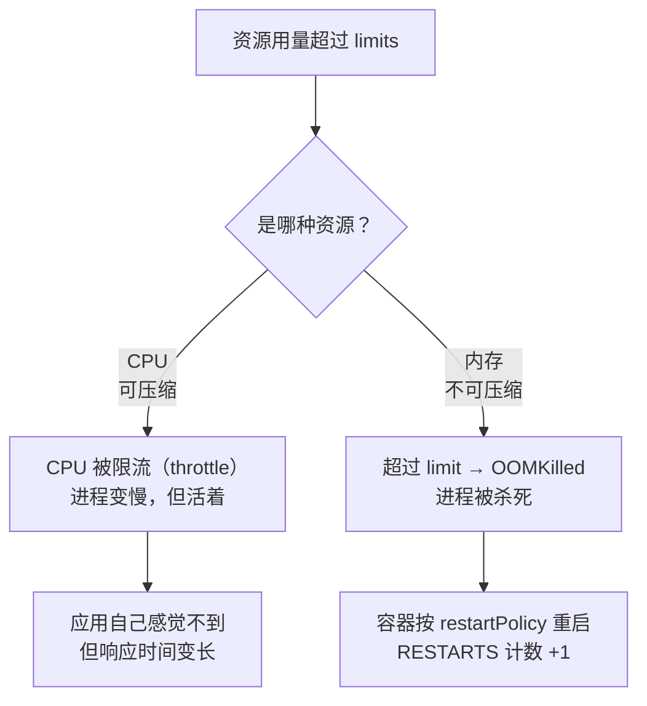
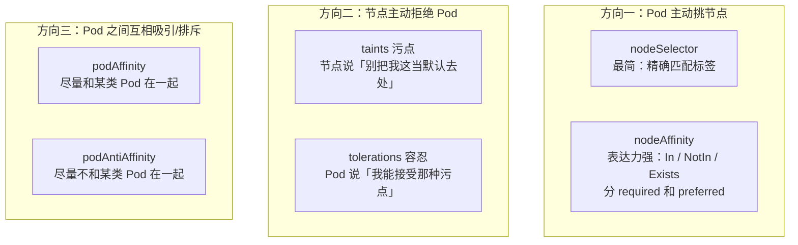

# 第 10 章　调度与资源管理：requests、limits、QoS 与亲和性

> **本章导读**
> - 建议用时：65 分钟（含 25 分钟动手）
> - 前置知识：第 2 章（容器重启 vs Pod 重启）、第 3 章（Filter / Score 两阶段）
> - 读完你应该能回答四个问题：
>   1. `requests` 和 `limits` 到底有什么区别？**只写 `limits` 会发生什么？**
>   2. 为什么 CPU 超了只是变慢，**内存超了却直接被杀死**？
>   3. `QoS` 三个等级是谁决定的、**决定了什么**？（提示：不是"服务质量"的字面意思）
>   4. 怎么让两个副本**强制分散到不同节点**？为什么 `podAntiAffinity` 不总是好选择？

第 3 章我们看过调度器的两个阶段（Filter / Score），当时是"看别人干活"。这一章**反过来——我们要控制它**。

但在开始之前，先建立本章最重要的一条认知：

> **调度器不是全知的。它所有的判断，都只基于你在 YAML 里写的那两行数字——`requests`。**
>
> **它看不见你的应用"实际会用多少"。**

这意味着：**你在 `resources` 里写什么，直接决定了你的 Pod 会不会被调度、会不会被驱逐、会不会被杀死。**

---

## 【积木 10-1】先分清：requests 是"预留"，limits 是"天花板"

这是最基础、也最容易搞错的一组概念。

```yaml
resources:
  requests:      # ← 「我至少需要这么多」——调度器用它做决策
    cpu: 100m
    memory: 128Mi
  limits:        # ← 「我最多用这么多」——kubelet 用它做限制
    cpu: 500m
    memory: 256Mi
```

**两个字段服务于两个完全不同的机制：**

| | requests | limits |
|---|---|---|
| 谁在用 | **kube-scheduler** | **kubelet**（通过 cgroups） |
| 什么时候用 | **调度时**（Filter 阶段） | **运行时**（一直在管） |
| 语义 | **预留**：这台机器给我留出这么多 | **天花板**：我不许超过这个数 |
| 超过的后果 | 不适用（只是预留） | **CPU：被限流** / **内存：被杀死** |
| 类比 | 订酒店时"我要一间大床房" | 房间里"电表最大 3 千瓦" |

### 组合起来只有四种情况，每种都有不同含义

| requests | limits | 含义 | 风险 |
|---|---|---|---|
| 都写 | 都有 | **最规范**：预留明确，上限明确 | 无 |
| 都写，且 `requests == limits` | | **Guaranteed QoS**（积木 10-3） | 资源利用率可能偏低 |
| **只写 limits** | | ⚠️ **requests 会被自动设成等于 limits** | **调度变保守**：明明够用，却因为"预留"太高而调度不上去 |
| **都不写** | | **BestEffort QoS** | ⚠️ **节点资源紧张时第一个被驱逐**，且调度器只能瞎猜 |

> **第三行是关键，很多人不知道**：如果你只写了 `limits`，**K8s 会把 `requests` 默认设成和 `limits` 一样**。
>
> 所以那个"我明明留了余量，为什么 Pod 调度不上去"的问题，答案往往是你无意中把 requests 抬高了。

### 单位：写错一个字母，差 1000 倍

| 资源 | 单位 | 说明 |
|---|---|---|
| **CPU** | `1` = 1 个核；`500m` = 0.5 核；`100m` = 0.1 核 | `m` 是 millicore。**最小建议不小于 10m** |
| **内存** | `Mi` / `Gi`（1024 进制）；`M` / `G`（1000 进制） | **`Mi` 和 `M` 差 4.8%**，别混用 |

```yaml
cpu: 0.5        # 等价于 500m
cpu: 500m       # 推荐写法（可读性好，且支持小于 1 核的精度）
memory: 128Mi   # 128 * 1024 * 1024 字节
memory: 128M    # 128 * 1000 * 1000 字节（少 4.8%）
```

> **顺带一个容易被忽略的点**：`resources` 是**每个容器**的，不是每个 Pod 的。
>
> **Pod 的总 requests = 所有容器 requests 之和。**
>
> 而如果有 init 容器（第 2 章），调度时取的是：**`max(最大的 init 容器 requests, 所有普通容器 requests 之和)`**——因为 init 是串行执行的，不会同时占资源。

---

## 【积木 10-2】CPU 和内存：两种性质完全不同的资源

**这一块解释了 K8s 资源管理里最反直觉的一堆现象。**

### 核心区别：可压缩 vs 不可压缩



| | CPU | 内存 |
|---|---|---|
| 类型 | **可压缩（compressible）** | **不可压缩（incompressible）** |
| 超限的后果 | **被限流**：拿不到更多时间片，**变慢但活着** | **被杀死**：`OOMKilled` |
| 可控性 | 可以通过"少给一点"来降速 | 给少了就直接死 |
| 观察指标 | `container_cpu_cfs_throttled_seconds_total` | `lastState.terminated.reason: OOMKilled` |

**这个区别的直接推论：**

> **`limits` 对内存来说是"生死线"，对 CPU 来说只是"速度旋钮"。**

### 于是产生了两个高频困惑

**困惑一："为什么我的服务只是变慢了，没人报警？"**

因为 **CPU 限流是"静默"的**——它不会产生任何 K8s 事件，`kubectl get pods` 也看不出异常，`RESTARTS` 是 0。但你的 P99 延迟可能翻了三倍。

**怎么发现它**：

```bash
# 看 Pod 的 CPU 限制
kubectl get pod <pod> -n cloudnote -o jsonpath='{.spec.containers[0].resources}'

# 在容器里直接看被限流的数据（cgroup v2）
kubectl exec <pod> -n cloudnote -- cat /sys/fs/cgroup/cpu.stat 2>/dev/null | grep throttled

# 生产上更常用的做法：看 Prometheus 指标
#   container_cpu_cfs_throttled_seconds_total / container_cpu_cfs_periods_total
# 这个比值超过 20% 基本可以确定 CPU limit 设小了
```

**困惑二："为什么 Java 服务起来就被 OOMKilled，本地跑得好好的？"**

经典原因：**JVM 默认按"物理机内存"来设堆大小，不认 cgroup 的 limit。**

比如你的容器 limit 是 512Mi，但 JVM 看到的是宿主机的 64GB，于是把 `-Xmx` 设成 16GB——**一启动就撞上 512Mi 的天花板，被杀。**

**解法**（现代 JDK 默认已开启容器感知）：

```yaml
env:
  # JDK 10+ 默认启用容器支持；老版本需要显式打开
  - name: JAVA_OPTS
    value: "-XX:+UseContainerSupport -XX:MaxRAMPercentage=75.0"
```

**关键是把堆上限设成 limit 的 70%~80%**，给 JVM 的堆外内存（Metaspace、线程栈、DirectBuffer、GC 结构）留出空间。设成 100% 一定会被 OOMKilled。

### 两种"OOM"要分清

这是个值得单独澄清的点：

| 现象 | 谁杀的 | 什么时候发生 | `kubectl get pod` 里的表现 |
|---|---|---|---|
| **容器被 OOMKilled** | **内核的 OOM killer**（因为 cgroup 内存超限） | 单个容器超过自己的 `limits.memory` | `RESTARTS` +1，`lastState.terminated.reason: OOMKilled` |
| **Pod 被驱逐（Evicted）** | **kubelet**（因为节点内存压力） | 节点整体内存不足 | Pod 状态变 `Failed`，`reason: Evicted`，然后**被重建** |

**前者是"你自己超了自己的额度"，后者是"节点整体撑不住了"。**排查方向完全不同。

---

## 【积木 10-3】QoS 等级：谁决定的、决定了什么

### 三个等级怎么来的

**你不用手写 QoS，它是 K8s 根据你的 `requests` / `limits` 自动推导出来的：**

| QoS 等级 | 判定条件 | 例子 |
|---|---|---|
| **`Guaranteed`** | **每个容器**的 CPU 和内存都写了 `requests`，**且等于 `limits`** | `requests: {cpu: 100m, memory: 128Mi}` 且 `limits` 完全相同 |
| **`Burstable`** | 至少一个容器写了 `requests` 或 `limits`，但**不满足 Guaranteed** | 写了 requests 但没写 limits；或 requests < limits |
| **`BestEffort`** | **所有容器都没写**任何 requests / limits | `containers: [{name: a, image: b}]` 完事 |

```bash
# 看一个 Pod 的 QoS 等级
kubectl get pod <pod> -n cloudnote -o jsonpath='{.status.qosClass}'
```

### QoS 决定了什么：**被驱逐的顺序**

这是最重要的一环。当节点资源不足时（积木 10-4 会讲），kubelet 要挑一些 Pod 杀掉来保住节点。**它按 QoS 等级从低到高杀**：

```
优先被杀 ←──────────────────────────────→ 最后被杀

  BestEffort  →  Burstable  →  Guaranteed
  （没写任何      （写了但        （requests
   requests/       不满足          == limits）
   limits）        Guaranteed）
```

**还有一个更细的机制**：即使同为 `Burstable`，**"实际用量相对 requests 超出得越多"的越先被杀**。

**同时，内核的 OOM score 也按 QoS 设置**：

| QoS | `oom_score_adj` | 含义 |
|---|---|---|
| `Guaranteed` | **-997** | 几乎不会被内核 OOM killer 选中 |
| `Burstable` | 2 ~ 999 | 按用量比例 |
| `BestEffort` | **1000** | **第一个被杀** |

### 一个需要纠正的认知

> **QoS 不是"服务质量"的意思，它不是性能保证，而是"被驱逐的优先级"。**

很多人的误解是"Guaranteed 就是性能最好"，其实：

- **`Guaranteed` 保证的是"不会被优先驱逐"，不是"跑得更快"**
- 它同时也意味着**资源利用率更低**——因为你把 requests 抬到了 limits，调度器会按这个更高值预留资源

**所以"全都设成 Guaranteed"不是好策略。**合理的做法是：

| 服务类型 | 建议 | 理由 |
|---|---|---|
| **核心在线服务**（api、web） | `Burstable`，requests 压实（按实际用量 P95 设），limits 留 2~3 倍余量 | 兼顾调度效率与安全 |
| **数据库 / 关键中间件** | **`Guaranteed`** | 绝不希望它被驱逐 |
| **批处理 / 离线任务** | **`BestEffort` 或低 requests 的 `Burstable`** | **故意让它成为"可牺牲的"**，把资源让给在线服务 |
| **监控 / 日志采集（DaemonSet）** | `Burstable` 小 requests | 它必须活着，但不需要大资源 |

> **把"可被牺牲"这件事显式表达出来，本身就是一种设计。**让离线任务的 QoS 最低，是让它"在资源紧张时主动让路"——这比事后人工干预可靠得多。

---

## 【积木 10-4】节点资源不足时会发生什么

### kubelet 的驱逐机制

kubelet 会持续监控几种"压力信号"：

| 信号 | 含义 |
|---|---|
| `memory.available` | 节点可用内存 |
| `nodefs.available` / `nodefs.inodesFree` | 节点根文件系统空间 / inode |
| `imagefs.available` | 镜像文件系统空间 |
| `pid.available` | 可用进程数 |

**当某个信号低于阈值，节点进入压力状态**，会：

```
① 给 Node 对象打上污点
     node.kubernetes.io/memory-pressure
     node.kubernetes.io/disk-pressure
② 状态变成 MemoryPressure / DiskPressure
③ Scheduler 不再往这个节点放新 Pod（污点 + node-condition filter）
④ kubelet 开始驱逐 Pod 腾空间（按 QoS 顺序）
⑤ 被驱逐的 Pod 由控制器在别的节点重建
```

```bash
# 看节点有没有压力
kubectl describe node <node> | grep -A6 Conditions
```

### 软驱逐 vs 硬驱逐

| 类型 | 行为 | 默认 |
|---|---|---|
| **硬驱逐（hard）** | 立刻杀 Pod，**不给宽限期** | kubeadm 默认：`memory.available<100Mi`、`nodefs.available<10%`、`imagefs.available<15%` |
| **软驱逐（soft）** | 先超时观察，再驱逐，**尊重 `terminationGracePeriodSeconds`** | **默认关闭**，可配 `--eviction-soft` 与 `--eviction-soft-grace-period` |

**实践要点**：

- **`emptyDir` 的 `sizeLimit`（第 9 章）和硬驱逐阈值是两个不同的保护**，建议都设
- **不要让节点跑满**：`requests` 之和应该控制在节点可分配资源的 **70%~80%**，给突发留余量
- 容器里的日志**必须限制大小**，否则写满 `nodefs` 会导致整节点被驱逐（这是很常见的事故）

### 一个重要的认知

> **Pod 被驱逐，不代表节点坏了。它是节点在自保。**

```
节点内存不够
    ↓
kubelet 挑最"可牺牲"的 Pod（BestEffort → Burstable）杀掉
    ↓
被驱逐的 Pod 在别的节点重建（如果还有余量）
    ↓
如果所有节点都没余量 → 新 Pod 一直 Pending
```

**所以"Pod 频繁被驱逐"的排查方向是两个**：① 是不是某个 Pod 用超了自己声明的量？② 是不是节点整体规划的 requests 之和太接近容量了？

---

## 【积木 10-5】控制 Pod 落在哪：四个工具，两个方向

现在进入"主动控制调度"。有四个工具，**但它们分成两个相反的方向**——这是理解它们的关键。



### ① `nodeSelector`：最简单，只能精确匹配

```yaml
spec:
  nodeSelector:
    disktype: ssd          # 节点必须有 disktype=ssd 这个标签
```

**优点**：一行搞定，直观。
**缺点**：只能"等于"，表达不了"在这几个值里选一个"、"必须不存在"。

```bash
# 先给节点打标签
kubectl label node <node-name> disktype=ssd
```

### ② `nodeAffinity`：表达力强，且分硬软

```yaml
spec:
  affinity:
    nodeAffinity:
      # 硬性要求：不满足就不调度（Filter 阶段一票否决）
      requiredDuringSchedulingIgnoredDuringExecution:
        nodeSelectorTerms:
          - matchExpressions:
              - key: topology.kubernetes.io/zone
                operator: In
                values: ["zone-a", "zone-b"]
              - key: node-type
                operator: NotIn
                values: ["spot"]              # 不要抢占式实例
      # 软性偏好：满足更好，不满足也能调（Score 阶段加分）
      preferredDuringSchedulingIgnoredDuringExecution:
        - weight: 80
          preference:
            matchExpressions:
              - key: disktype
                operator: In
                values: ["ssd"]
```

**支持的 operator**：`In` / `NotIn` / `Exists` / `DoesNotExist` / `Gt` / `Lt`

**"IgnoredDuringExecution"是什么意思？**

> **它指的是"调度之后如果标签变了，不驱逐已运行的 Pod"。**
>
> 也就是说：**亲和性只在调度那一刻生效，之后节点标签被改动不会把 Pod 赶走。**
>
> 这个细节很重要——不要以为改了节点标签就能把 Pod "推走"，那要配合 `taint` + `NoExecute`（下面讲）。

### ③ `podAffinity` / `podAntiAffinity`：Pod 之间的相互位置

```yaml
spec:
  affinity:
    podAntiAffinity:
      # 硬性：绝不同意和另一个 app=api 的 Pod 在同一节点
      requiredDuringSchedulingIgnoredDuringExecution:
        - labelSelector:
            matchLabels:
              app: api
          topologyKey: kubernetes.io/hostname    # ← 必填："同一节点"的定义
```

**`topologyKey` 是这块最容易忽略的必填字段**，它定义了"什么算在一起"：

| `topologyKey` | 含义 |
|---|---|
| `kubernetes.io/hostname` | **同一节点**（最常用，用来打散副本） |
| `topology.kubernetes.io/zone` | **同一可用区** |
| `topology.kubernetes.io/region` | 同一地域 |

> **注意：`podAntiAffinity` 的 `required` 版本有个真实的陷阱**——如果集群只有 2 个节点，而你要 3 个副本，第 3 个会**永远 Pending**（因为找不到第三个"没有同类 Pod 的节点"）。
>
> 用 `preferred` 版本会更好，或者用下面的 `topologySpreadConstraints`。

### ④ `taints` 与 `tolerations`：方向相反的那个

**污点是"节点主动排斥"**：

```bash
# 给节点打污点：普通 Pod 不要来，只有能容忍的才来
kubectl taint nodes <node-name> gpu=true:NoSchedule
```

```yaml
# Pod 声明"我能容忍这个污点"
spec:
  tolerations:
    - key: gpu
      operator: Equal
      value: "true"
      effect: NoSchedule
```

**三种 effect**：

| effect | 行为 |
|---|---|
| `NoSchedule` | **不调度**新 Pod 上来（已运行的不管） |
| `PreferNoSchedule` | **尽量不调度**（软性） |
| **`NoExecute`** | **不调度 + 驱逐已有 Pod**（最狠，节点故障时用的就是它） |

**内建的污点**你其实已经见过：

| 污点 | 打在哪 | 作用 |
|---|---|---|
| `node.kubernetes.io/not-ready` | 失联的节点 | 第 3 章那个故障故事里就是这个 |
| `node.kubernetes.io/unreachable` | 网络不通的节点 | 同上 |
| `node-role.kubernetes.io/control-plane` | **控制平面节点** | **所以你的业务 Pod 不会跑到控制平面上** |
| `node.kubernetes.io/memory-pressure` | 内存紧张的节点 | 积木 10-4 |

```bash
# 看看你集群里的节点都有什么污点
kubectl get nodes -o custom-columns='NAME:.metadata.name,TAINTS:.spec.taints[*].key'
```

### 五个工具对比表

| 工具 | 方向 | 表达力 | 强制性 | 典型场景 |
|---|---|---|---|---|
| `nodeSelector` | Pod → 节点 | 低（只等于） | 硬性 | 简单的机型选择 |
| `nodeAffinity.required` | Pod → 节点 | 高 | **硬性** | 可用区、机型、架构 |
| `nodeAffinity.preferred` | Pod → 节点 | 高 | 软性（只加分） | "尽量用 SSD" |
| `podAffinity` / `podAntiAffinity` | Pod → Pod | 中 | 可选硬/软 | 打散副本、就近访问 |
| **`taints` + `tolerations`** | **节点 → Pod** | 中 | 硬/软 | **专用节点池（GPU、控制平面）、故障隔离** |

**选择顺序建议**：

```
只是想"选特定机型"          → nodeSelector 就够
需要"多选一 / 排除 / 软偏好"  → nodeAffinity
需要"打散副本"               → topologySpreadConstraints（下一节，比 antiAffinity 好）
需要"把这台机器留给特定用途"   → taints + tolerations
```

> **一个关键的心智模型**：
>
> - **`nodeAffinity` 是 Pod 在"挑"节点** —— 你在 Pod 的 YAML 里写
> - **`taint` 是节点在"拒绝"Pod** —— 你在节点的配置里写
>
> **方向相反。**所以团队治理上：**`taint` 是平台团队的权力（保护专用资源），`affinity` 是应用团队的权力（表达自己的需求）。**这个分工很实用。

---

## 【积木 10-6】`topologySpreadConstraints`：比反亲和性更好的打散方式

### 先回顾第 2 章埋的那个坑

> "我有 2 个副本，所以挂一个节点没关系。"——**如果这 2 个副本恰好都在同一台机器上，挂一个节点就等于全挂。**

怎么保证它们分散？`podAntiAffinity` 能用，但它在**节点数量少**的时候会失效（`required` 会直接让 Pod 卡在 Pending）。

**更好的工具是 `topologySpreadConstraints`**：

```yaml
spec:
  topologySpreadConstraints:
    - maxSkew: 1                              # 各拓扑域之间最多差 1 个
      topologyKey: kubernetes.io/hostname     # 按节点打散
      whenUnsatisfiable: DoNotSchedule        # 硬性
      labelSelector:
        matchLabels:
          app: api
```

**读法是**：

> "按 `hostname` 这个维度分组，各组之间 `app=api` 的 Pod 数量**最多相差 1 个**。做不到就别调度。"

**它的优点**：不要求"必须没有同类"，只要求"**尽量均衡**"。所以：

| 场景 | `podAntiAffinity`（required） | `topologySpreadConstraints` |
|---|---|---|
| 3 副本 / 3 节点 | 完美分散 | 完美分散 |
| **3 副本 / 2 节点** | **第 3 个永远 Pending** ❌ | **合理安排成 2+1** ✅ |
| 需要跨可用区均衡 | 要写两层 | 写一条就够 |

**三个关键字段**：

| 字段 | 说明 |
|---|---|
| `maxSkew` | 允许的最大不均衡度。**设 1 最均衡**；设 3 意味着允许某域比其他域多 3 个 |
| `topologyKey` | 按什么维度分组（`hostname` / `zone` / 自定义标签） |
| `whenUnsatisfiable` | **`DoNotSchedule`**（硬性，做不到就不调度）/ **`ScheduleAnyway`**（软性，尽量均衡但不阻塞调度） |

### 生产上的推荐写法：硬软结合

```yaml
spec:
  topologySpreadConstraints:
    # 硬性：先保证跨可用区均衡（这是"机房级"的高可用）
    - maxSkew: 1
      topologyKey: topology.kubernetes.io/zone
      whenUnsatisfiable: DoNotSchedule
      labelSelector:
        matchLabels:
          app: api
    # 软性：再尽量跨节点分散（这是"机器级"的高可用）
    - maxSkew: 1
      topologyKey: kubernetes.io/hostname
      whenUnsatisfiable: ScheduleAnyway
      labelSelector:
        matchLabels:
          app: api
```

**为什么这样分？**

- **可用区**是"硬"的：一个可用区整体故障很常见，必须强制均衡
- **节点**是"软"的：集群扩容 / 缩容时节点数会变，硬性要求可能导致调度不上

> **一个务实的建议**：**至少做到"同一个应用的副本不在同一个节点上"。**如果节点数 ≥ 副本数，用 `DoNotSchedule`；否则用 `ScheduleAnyway`。**但不要忘了，`ScheduleAnyway` 在节点不足时仍然会把两个副本放在一起**——所以根子上还是要保证节点数够。

---

## 【积木 10-7】把资源与调度写进生产配置

现在把这一章的东西拼进 CloudNote 的 `api`：

```yaml
apiVersion: apps/v1
kind: Deployment
metadata:
  name: api
  namespace: cloudnote
spec:
  replicas: 3
  selector:
    matchLabels:
      app: api
  template:
    metadata:
      labels:
        app: api
    spec:
      # ① 打散：同一节点上不要有第二个 api
      topologySpreadConstraints:
        - maxSkew: 1
          topologyKey: kubernetes.io/hostname
          whenUnsatisfiable: ScheduleAnyway     # 节点不足时不阻塞调度
          labelSelector:
            matchLabels:
              app: api

      # ② 尽量用 SSD 节点（软性偏好）
      affinity:
        nodeAffinity:
          preferredDuringSchedulingIgnoredDuringExecution:
            - weight: 50
              preference:
                matchExpressions:
                  - key: disktype
                    operator: In
                    values: ["ssd"]

      containers:
        - name: api
          image: registry.example.com/cloudnote/api:1.2.3
          # ③ 资源：requests 压实（按实际 P95 设），limits 留 2~3 倍余量
          resources:
            requests:
              cpu: 100m
              memory: 128Mi
            limits:
              cpu: 500m
              memory: 384Mi
          # 这个组合是 Burstable，且内存 limits 是 requests 的 3 倍
          # 兼顾了调度效率（requests 小、装得多）与安全性（有天花板）
```

### 五个必须避免的反模式

| 反模式 | 后果 | 正确做法 |
|---|---|---|
| **完全没写 resources** | BestEffort，节点紧张时第一个被杀；调度器瞎猜 | 至少写 requests |
| **只写 limits** | requests 被默认设成 limits，调度过度保守 | 两者都写 |
| **`limits.memory` 设得和实际峰值一样** | 任何波动都 OOMKilled | 留 2~3 倍并做压测 |
| **`limits.cpu` 设得过小** | 静默的 CPU 限流，P99 延迟暴涨且无人报警 | 监控 throttled 比例，控制在 20% 以内 |
| **`replicas: 1` 且没配打散** | 单副本 = 单点；多副本但同节点 = 假高可用 | 副本数 ≥ 2 + topologySpread |

> **第 4 条特别值得强调**：**CPU 限流是这一章最隐蔽的问题**——它不产生事件、不增加 `RESTARTS`、不影响 Pod 状态，只是让你的服务变慢。**唯一可靠的发现方式是监控 `container_cpu_cfs_throttled_seconds_total`。**

### 顺带认识两个"批量兜底"的对象

除了在 Pod 里逐个写，还有两个命名空间级别的策略对象（第 15 章会细讲）：

| 对象 | 作用 | 一句话 |
|---|---|---|
| **`LimitRange`** | 给"没写 resources 的 Pod"**设默认值**，并限制单 Pod 的最大值 | **兜底**：忘了写的 Pod 也会拿到合理默认值 |
| **`ResourceQuota`** | 限制**整个命名空间**的资源总量 | **限额**：防止某个团队把集群吃光 |

```yaml
apiVersion: v1
kind: LimitRange
metadata:
  name: default-limits
  namespace: cloudnote
spec:
  limits:
    - type: Container
      default:                     # 没写 limits 时的默认值
        cpu: 500m
        memory: 256Mi
      defaultRequest:              # 没写 requests 时的默认值
        cpu: 100m
        memory: 128Mi
      max:                         # 单个容器不允许超过
        cpu: "2"
        memory: 2Gi
```

**在多人共用的集群里，`LimitRange` 几乎是必需品**——它能防住"新手忘了写 resources 导致节点被吃光"这类事故。

---

## 【积木 10-8】动手：把资源与调度的行为都看一遍

配套脚本：

```bash
bash cases/cloudnote/tools/scheduling-lab.sh
```

### 第一步：看看节点的"可分配资源"和当前分配情况

```bash
# 节点的可分配资源（去掉系统组件占用后的）
kubectl get nodes -o custom-columns='NAME:.metadata.name,CPU:.status.allocatable.cpu,MEM:.status.allocatable.memory,PODS:.status.allocatable.pods'

# 已经分配出去多少（这是 requests 之和，不是实际用量！）
kubectl describe node <node-name> | sed -n '/Allocated resources/,/Events/p'
```

**第二段输出非常关键**，它长这样：

```
Allocated resources:
  Resource           Requests      Limits
  --------           --------      ------
  cpu                1250m (62%)   3500m (175%)
  memory             1Gi (25%)     3Gi (78%)
```

**两个要点**：

- **`Requests` 那一列才是调度的依据**（百分比超过 100% 就再也放不下新 Pod）
- **`Limits` 可以超卖**（175% 很正常），因为不是所有 Pod 会同时打满

### 第二步：观察一次"因为 requests 太高而调度不上去"

```bash
cat <<'EOF' | kubectl apply -f -
apiVersion: v1
kind: Pod
metadata:
  name: too-big
  namespace: cloudnote
spec:
  containers:
    - name: demo
      image: busybox:1.36
      command: ["sh","-c","sleep 3600"]
      resources:
        requests:
          cpu: "100"        # ← 100 个核，肯定没有节点装得下
          memory: 100Gi
EOF

sleep 5
kubectl get pod too-big -n cloudnote
kubectl describe pod too-big -n cloudnote | sed -n '/Events/,$p'
```

**你会看到**：

```
STATUS: Pending
Events:
  Warning  FailedScheduling  ...  0/3 nodes are available:
    3 Insufficient cpu, 3 Insufficient memory.
```

**这就是第 3 章 Filter 阶段的真实报错。**注意：`requests` 就是唯一的判断依据——**哪怕容器实际只用 1m CPU，只要 requests 写了 100，它就永远调度不上去。**

```bash
kubectl delete pod too-big -n cloudnote
```

### 第三步：观察 CPU 限流（静默的变慢）

```bash
cat <<'EOF' | kubectl apply -f -
apiVersion: v1
kind: Pod
metadata:
  name: cpu-throttle
  namespace: cloudnote
spec:
  containers:
    - name: busy
      image: busybox:1.36
      # 死循环烧 CPU，但只给它 50m 的额度
      command: ["sh","-c","while true; do :; done"]
      resources:
        requests:
          cpu: 10m
          memory: 16Mi
        limits:
          cpu: 50m             # ← 只有 50m，会被狠狠限流
          memory: 32Mi
EOF

sleep 20

echo "=== Pod 状态（注意 RESTARTS 是 0，看起来一切正常）==="
kubectl get pod cpu-throttle -n cloudnote

echo "=== 被限流的数据（cgroup v2）==="
kubectl exec cpu-throttle -n cloudnote -- cat /sys/fs/cgroup/cpu.stat 2>/dev/null | head -5

echo "=== CPU 使用量：被死死压在 limit 附近 ==="
kubectl top pod cpu-throttle -n cloudnote 2>/dev/null || echo "（需要 metrics-server，本地集群可能没装）"
```

**关键观察**：Pod **完全正常**——`STATUS: Running`、`RESTARTS: 0`、没有任何 Events。**但它的 CPU 被限制在 50m，任务会跑得极慢。**

> **这就是"CPU 限流是静默的"的实证。**生产上如果没有监控 `throttled` 指标，你只会看到"服务变慢了"，然后去查代码、查数据库、查网络——**永远想不到是 `limits.cpu` 设小了。**

```bash
kubectl delete pod cpu-throttle -n cloudnote
```

### 第四步：观察 OOMKilled（内存的不可压缩性）

```bash
kubectl apply -f cases/cloudnote/28-scheduling-demo.yaml
sleep 30

echo "=== Pod 状态：注意 RESTARTS 在涨 ==="
kubectl get pod oom-demo -n cloudnote

echo "=== 上一次退出的原因 ==="
kubectl get pod oom-demo -n cloudnote \
  -o jsonpath='{.status.containerStatuses[0].lastState.terminated.reason}{"\n"}'
# 预期输出：OOMKilled

echo "=== 退出码（137 = 128 + 9，即被 SIGKILL 杀死）==="
kubectl get pod oom-demo -n cloudnote \
  -o jsonpath='{.status.containerStatuses[0].lastState.terminated.exitCode}{"\n"}'
```

**对比第三步和第四步**：

| | CPU 超限 | 内存超限 |
|---|---|---|
| Pod 状态 | **Running，RESTARTS: 0** | **RESTARTS 不断增长** |
| 应用感受 | 变慢 | **被杀掉重启** |
| 有 Event 吗 | **没有** | 有（`OOMKilling`） |

**这两步的对比，就是"可压缩 vs 不可压缩"最直观的证明。**

### 第五步：看三个 QoS 等级长什么样

```bash
kubectl get pods -n cloudnote -l purpose=chapter-10-demo \
  -o custom-columns='NAME:.metadata.name,QOS:.status.qosClass'

for p in qos-guaranteed qos-burstable qos-besteffort; do
  echo "--- $p ---"
  kubectl get pod $p -n cloudnote -o jsonpath='{.spec.containers[0].resources}{"\n"}'
done
```

**预期**：

| Pod | QoS |
|---|---|
| `qos-guaranteed` | **Guaranteed** |
| `qos-burstable` | **Burstable** |
| `qos-besteffort` | **BestEffort** |

### 第六步：观察打散是否生效

```bash
# 看 api 的副本分别落在哪些节点
kubectl get pods -n cloudnote -l app=api -o custom-columns='NAME:.metadata.name,NODE:.spec.nodeName'

# 统计每个节点上有几个 api 副本
kubectl get pods -n cloudnote -l app=api -o jsonpath='{range .items[*]}{.spec.nodeName}{"\n"}{end}' | sort | uniq -c
```

**如果打散生效，每个节点上最多 1 个**（前提是节点数 ≥ 副本数）。

再做一个"强制打散"的对比实验：

```bash
kubectl apply -f cases/cloudnote/28-scheduling-demo.yaml
sleep 15
kubectl get pods -n cloudnote -l app=spread-hard -o custom-columns='NAME:.metadata.name,STATUS:.status.phase,NODE:.spec.nodeName'
```

**如果你只有 1 个工作节点**，会看到第 2、3 个副本**永远 Pending**，`describe` 里写着：

```
Warning  FailedScheduling  ...  3 node(s) didn't match pod topology spread constraints
```

> **这就是"硬性打散"的代价**：它保证了不均衡就绝不调度。**所以在节点数少于副本数时，必须改用 `ScheduleAnyway`**——这是积木 10-6 那个建议的实证。

### 第七步：体验 taint 如何阻止调度

```bash
# 给你集群里的某个节点打个污点（换成真实节点名）
NODE=$(kubectl get nodes -o jsonpath='{.items[*].metadata.name}' | tr ' ' '\n' | grep -v control-plane | head -1)
echo "选中节点：$NODE"

kubectl taint nodes "$NODE" purpose=reserved:NoSchedule

# 现在建一个 Pod，观察它是否会避开这个节点
kubectl run taint-test -n cloudnote --image=busybox:1.36 --restart=Never \
  --overrides='{"spec":{"containers":[{"name":"c","image":"busybox:1.36","command":["sh","-c","sleep 3600"],"resources":{"requests":{"cpu":"10m","memory":"16Mi"}}}]}}'

sleep 8
kubectl get pod taint-test -n cloudnote -o custom-columns='NAME:.metadata.name,STATUS:.status.phase,NODE:.spec.nodeName'
```

**结果取决于你的节点数**：

- **节点数 ≥ 2**：Pod 会被调度到**没有污点的那个节点**
- **只有 1 个节点**：Pod 会 `Pending`，`describe` 里写着 `node(s) had untolerated taint {purpose: reserved}`

再给 Pod 加上 toleration：

```bash
kubectl delete pod taint-test -n cloudnote
cat <<'EOF' | kubectl apply -f -
apiVersion: v1
kind: Pod
metadata:
  name: taint-tolerated
  namespace: cloudnote
spec:
  tolerations:
    - key: purpose
      operator: Equal
      value: reserved
      effect: NoSchedule
  containers:
    - name: demo
      image: busybox:1.36
      command: ["sh","-c","sleep 3600"]
      resources:
        requests: {cpu: 10m, memory: 16Mi}
EOF
sleep 8
kubectl get pod taint-tolerated -n cloudnote -o custom-columns='NAME:.metadata.name,STATUS:.status.phase,NODE:.spec.nodeName'
```

**这次它就可以跑到那个带污点的节点上了。**

**收尾——一定要记得移除污点，否则会影响后续实验：**

```bash
kubectl taint nodes "$NODE" purpose=reserved:NoSchedule-
```

> **这就是 `taint` 的典型用法：把一台机器"保留"给特定用途**（GPU 节点、专用数据库节点、控制平面）。它是**平台团队的治理工具**——应用团队没法通过改自己的 YAML 来"抢"这些资源，因为默认情况下它们根本调度不上去。

### 第八步：清理

```bash
kubectl delete pods -n cloudnote -l purpose=chapter-10-demo --ignore-not-found
kubectl delete pod taint-tolerated -n cloudnote --ignore-not-found
```

---

## 【本章小结】

### 四句话总结

1. **`requests` 是"预留"（调度器用它），`limits` 是"天花板"（kubelet 用它）。**只写 `limits` 会让 `requests` 被默认设成同样的值，导致调度过度保守。
2. **CPU 是可压缩资源，内存是不可压缩资源。**所以 CPU 超限只是**被限流变慢**（静默、无事件、`RESTARTS` 不变），内存超限会被 **OOMKilled** 直接杀掉。**CPU 限流是这一章最隐蔽的问题。**
3. **QoS 等级由 `requests` / `limits` 的关系自动推导，它决定的不是"性能"，而是"被驱逐的优先级"**：`BestEffort` → `Burstable` → `Guaranteed`。**故意让离线任务成为 BestEffort，是一种设计。**
4. **控制 Pod 位置有四个工具、两个方向**：`nodeSelector` / `nodeAffinity` 是 **Pod 挑节点**；`taints` + `tolerations` 是**节点拒绝 Pod**；`podAffinity` 管 Pod 之间的关系。**而打散副本，优先用 `topologySpreadConstraints`**——它比 `podAntiAffinity.required` 优雅得多。

### 一张图收尾

```
 你在 YAML 里写的一行数字                    K8s 用它做三件事
 ┌──────────────────────┐
 │ resources.requests   │──────► ① 调度器决定去哪台机器（Filter 阶段）
 │ cpu / memory         │──────► ② 推导 QoS 等级 → 决定驱逐顺序
 └──────────────────────┘
 ┌──────────────────────┐
 │ resources.limits     │──────► ③ kubelet 通过 cgroups 强制执行
 │ cpu（可压缩）         │          └─ 超限 → 限流：变慢，活着
 │ memory（不可压缩）     │          └─ 超限 → OOMKilled：被杀
 └──────────────────────┘

 调度位置由四个工具决定（两个方向相反）
   Pod 挑节点：nodeSelector · nodeAffinity
   节点拒 Pod：taints + tolerations
   Pod 之间：podAffinity · podAntiAffinity · topologySpreadConstraints
```

### 自测题

1. `requests` 和 `limits` 分别被谁使用、在什么时候使用？（积木 10-1）
2. **只写 `limits` 会发生什么？**会带来什么后果？（积木 10-1）
3. `resources` 是每个 Pod 的还是每个容器的？有 init 容器时调度怎么算？（积木 10-1）
4. 为什么 CPU 超限只是变慢，内存超限却会被杀死？（积木 10-2）
5. CPU 限流为什么"很难被发现"？该监控什么指标？（积木 10-2）
6. Java 服务"本地跑得好好的，进容器就 OOMKilled"，最可能的原因是什么？怎么修？（积木 10-2）
7. "容器被 OOMKilled"和"Pod 被 Evicted"有什么本质区别？（积木 10-2、10-4）
8. QoS 三个等级的判定条件分别是什么？它决定了什么？（积木 10-3）
9. 为什么"把所有服务都设成 Guaranteed"不是好策略？（积木 10-3）
10. 节点内存压力上升时，kubelet 按什么顺序驱逐 Pod？（积木 10-3、10-4）
11. `nodeAffinity` 里的 `IgnoredDuringExecution` 是什么意思？改了节点标签能把 Pod 推走吗？（积木 10-5）
12. `nodeSelector` 和 `taints` 在"方向"上有什么本质区别？这个区别在团队分工上意味着什么？（积木 10-5）
13. `podAntiAffinity` 里的 `topologyKey` 是干什么的？不写会怎样？（积木 10-5）
14. **3 个副本、只有 2 个节点时，`podAntiAffinity.required` 和 `topologySpreadConstraints` 分别会怎样？**（积木 10-5、10-6）
15. `maxSkew` 和 `whenUnsatisfiable` 分别控制什么？（积木 10-6）
16. 为什么推荐"可用区用 `DoNotSchedule`、节点用 `ScheduleAnyway`"？（积木 10-6）
17. `LimitRange` 和 `ResourceQuota` 分别解决什么问题？为什么多人集群里前者几乎是必需品？（积木 10-7）

### 下一章预告

**第 11 章：自愈的真相 —— 探针与故障恢复**

这一章一直反复出现一个词："自愈"。第 1 章说它是调和循环的功劳，第 2 章说裸 Pod 没有自愈能力，第 5 章说就绪探针是滚动更新的刹车，第 6 章说 Pod 不 Ready 会被移出 Service 后端。

**但我们从来没正面回答过：K8s 到底能修哪些故障，不能修哪些？**

这一章会把"自愈"这个词彻底拆开：

> 三种探针（`liveness` / `readiness` / `startup`）分别解决什么问题？**配错了会怎样把整个服务搞挂？**
>
> 容器是"假死"（死锁、内存泄漏到卡住）时，K8s 怎么发现？**进程还在跑但服务已经不响应了，谁来救？**
>
> 一个真实的排错过程：**一个探针配置错误，如何导致所有副本同时重启、服务彻底不可用**（这是最容易自己制造的全站故障）。
>
> 还有那个经典问题：`restartPolicy: Always` 和 Deployment 的重建，到底哪个在"重启"我的 Pod？

---

*学完本章，回到对话里说一句「继续」，我就开讲第 11 章。*
