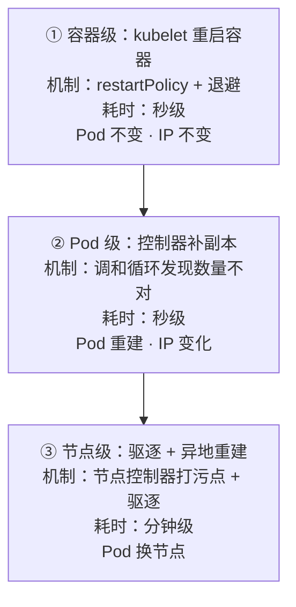
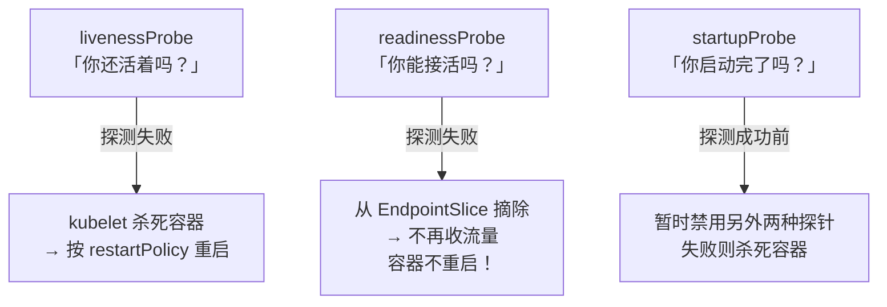
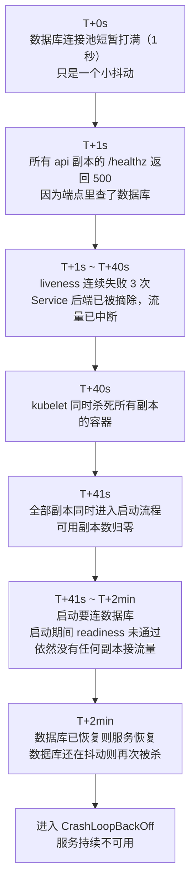

# 第 11 章　自愈的真相：探针与故障恢复

"自愈"这个词在前 10 章反复出现：第 1 章把它归功于调和循环，第 2 章指出裸 Pod 没有自愈能力，第 5 章称就绪探针是滚动更新的刹车，第 6 章说明 Pod 不 Ready 会被移出 Service 后端。但有一个问题始终没有正面回答：Kubernetes 到底能修什么、不能修什么。

本章把这条边界划清楚，并说明三种探针各自的适用范围——其中 `livenessProbe` 是配错之后唯一能把整个服务一次性搞挂的配置项。结论先行：

> **K8s 的"自愈"不是"修好你的程序"，而是"把不健康的东西换掉"。**
>
> **它修的是"进程和容器的存在性"，不是"业务的正确性"。**

这条边界一旦模糊，就会在最需要它的时候发现它帮不上忙。

---

### 11.1 先把"自愈"拆成三层

K8s 的自愈不是一个机制，而是**三个层次、三套机制**在协同：



| 层次 | 谁在修 | 修什么 | Pod 变了吗 | 典型耗时 |
|---|---|---|---|---|
| **容器级** | **kubelet** | 容器进程挂了 / 被探针判死 | **不变**（IP 不变） | 秒级 |
| **Pod 级** | **控制器**（RS / Deployment） | Pod 对象被删了 / 数量不对 | **重建**（IP 变） | 秒级 |
| **节点级** | **节点控制器 + 控制器** | 整台机器失联 | **换节点重建** | 分钟级（第 3 章讲过 40 秒判定） |

**三个层次的关键差别**：

- **容器级重启**是"同一个 Pod 里换个容器"——**Pod IP 不变**（第 2 章 pause 容器的作用）
- **Pod 级重建**是"换一个新 Pod"——**IP 变、名字变、节点可能变**
- **节点级**是"放弃这台机器上的 Pod，去别处重建"

**记住这条**：**`kubectl get pod` 里的 `RESTARTS` 那一列，统计的是"容器级重启"的次数。**它和 Pod 被重建是两回事——Pod 重建后 `RESTARTS` 会从 0 开始。

这也是为什么"Pod 重建了但 RESTARTS 是 0"看起来会让人困惑。

---

### 11.2 `restartPolicy` 与 CrashLoopBackOff 的由来

#### 谁来重启容器

**是 kubelet，不是控制器。**这一点很重要：

```
kubelet watch 到「我名下这个 Pod 的容器退出了」
    ↓
查这个 Pod 的 restartPolicy
    ↓
Always / OnFailure（且退出码非 0）→ 重启这个容器
Never → 什么都不做
```

| `restartPolicy` | 行为 | 适用 |
|---|---|---|
| **`Always`**（默认） | 无论退出码都重启 | 长期服务。**Deployment 管理的 Pod 必须是 Always** |
| `OnFailure` | 只有非 0 退出才重启 | 批处理任务（Job） |
| `Never` | 从不重启 | 一次性任务、调试 |

**注意**：`restartPolicy` 是 **Pod 级别**的，作用于 Pod 内所有容器。而且它管的是**容器重启**，不管 Pod 重建——Pod 重建是控制器的事（第 4 章）。

#### 退避重启：`CrashLoopBackOff` 到底是什么

如果容器一起来就崩，kubelet 不会"疯狂重启"，而是**指数退避**：

```
第 1 次崩溃 → 等 10 秒
第 2 次崩溃 → 等 20 秒
第 3 次崩溃 → 等 40 秒
第 4 次崩溃 → 等 80 秒
...
上限 5 分钟
（如果容器连续正常运行 10 分钟，退避计时器重置）
```

**状态里那个 `CrashLoopBackOff` 不是错误，而是"正在退避等待"的意思。**

```bash
kubectl get pod <pod> -n cloudnote
# NAME       READY   STATUS             RESTARTS   AGE
# api-xxx    0/1     CrashLoopBackOff   5          3m
#                          ↑ 正在等下一次重启，不是"崩了"
```

**这个机制的设计意图**：如果容器永远起不来，密集重启会浪费节点资源、把日志刷爆。**退避是一种"礼貌的重试"。**

**看到 `CrashLoopBackOff` 时的排查顺序**：
```bash
# ① 看它为什么退出
kubectl logs <pod> -n cloudnote --previous      # ← --previous 看上一次崩溃的日志
# ② 看退出码与原因
kubectl get pod <pod> -n cloudnote -o jsonpath='{.status.containerStatuses[0].lastState.terminated}'
# ③ 看事件
kubectl describe pod <pod> -n cloudnote | sed -n '/Events/,$p'
```

**`--previous` 这个参数极其有用**——因为 Pod 一崩溃就重启了，你看 `logs` 拿到的是新容器的日志（可能还没输出什么），**必须用 `--previous` 才能看到崩溃前的现场。**

---

### 11.3 三种探针：各解决什么问题、触发什么动作

这是本章的核心。**三种探针的"动作"完全不同**——这是理解它们的关键。



| 探针 | 回答的问题 | 失败时发生什么 | 成功时发生什么 |
|---|---|---|---|
| **`livenessProbe`** | "进程还活着吗？"（**能不能救活**） | **杀死容器并重启** | 什么都不做 |
| **`readinessProbe`** | "现在能处理请求吗？" | **从 Service 后端摘除**（流量不再进来） | **加进 Service 后端**（开始收流量） |
| **`startupProbe`** | "启动完成了没？" | 杀死容器并重启 | **启用 liveness 和 readiness** |

**三个必须记住的要点**：

1. **`readinessProbe` 失败不会重启容器。**它只是"暂时不给你流量"——这对"正在预热"或"依赖暂时不可用"的场景是**正确的行为**。
2. **`livenessProbe` 失败会杀死容器**——这是**破坏性**的，所以它必须谨慎设计（第 11.5 节会讲配错的后果）。
3. **`startupProbe` 一旦成功就不再执行。**它的唯一作用是"给慢启动的应用争取时间"。

#### 一张"我该配哪个"的决策表

| 你的问题 | 该用哪个 | 为什么 |
|---|---|---|
| 应用启动要 2 分钟，但 liveness 30 秒就杀 | **`startupProbe`** | 专门解决慢启动 |
| 进程会死锁 / 假死，需要自动救 | **`livenessProbe`** | 只有它能重启容器 |
| 应用依赖数据库，数据库抖动时不想收流量 | **`readinessProbe`** | 摘流量即可，**不该重启** |
| 滚动更新时不想让没准备好的 Pod 接流量 | **`readinessProbe`** | 第 5 章讲过，它是发布的刹车 |
| 应用本身很健壮，从不假死 | **都不配也行** | **见第 11.5 节的观点** |

**最后一行值得强调**：**不是所有服务都需要 `livenessProbe`。**

一个进程崩溃就退出、由 kubelet 自动重启的服务（大多数 Go / Node 服务），**`restartPolicy: Always` 已经够了**——进程真死了 kubelet 会重启它，不需要 liveness 探针。**liveness 探针真正要解决的只有一种情况：进程还在、但已经不干活了（死锁、无限循环、内部状态损坏）。**

**如果你的应用不存在这种"假死"模式，配 liveness 探针的风险大于收益。**

---

### 11.4 探针的四种检查方式与参数

#### 四种检查方式

```yaml
# ① HTTP GET：最常用。2xx 和 3xx 算成功
livenessProbe:
  httpGet:
    path: /healthz
    port: 8080
    httpHeaders:
      - name: Custom-Header
        value: health-check

# ② TCP：能建立连接就算成功（适合非 HTTP 服务）
livenessProbe:
  tcpSocket:
    port: 3306

# ③ exec：命令退出码为 0 算成功（最灵活，但会消耗资源）
livenessProbe:
  exec:
    command: ["sh", "-c", "pg_isready -U postgres"]

# ④ gRPC（1.27 GA）：返回 SERVING 状态算成功
livenessProbe:
  grpc:
    port: 50051
```

| 方式 | 适合 | 缺点 |
|---|---|---|
| `httpGet` | HTTP 服务 | 只能看状态码，看不了具体内容 |
| `tcpSocket` | 数据库、MQ 等非 HTTP 服务 | **只验证端口在监听**——进程活着但业务卡死时，它照样"成功" |
| `exec` | 需要复杂判断的场景 | **每次探测都要起进程**，开销大，频繁探测会拖慢容器 |
| `grpc` | gRPC 服务 | 需要服务实现标准健康检查协议 |

**`tcpSocket` 的陷阱值得单独说**：它只能证明"端口有人监听"。**一个已经死锁、无法处理请求的进程，端口照样是打开的。**所以用它做 `liveness` 时，你其实只防住了"进程完全退出"这一种情况——而那种情况 `restartPolicy` 本来就会处理。

#### 五个关键参数

```yaml
livenessProbe:
  httpGet: { path: /healthz, port: 8080 }
  initialDelaySeconds: 10    # 容器启动后先等 10 秒再开始探
  periodSeconds: 10          # 之后每 10 秒探一次
  timeoutSeconds: 3          # 单次探测超过 3 秒算失败
  failureThreshold: 3        # 连续失败 3 次才判定为失败
  successThreshold: 1        # 成功 1 次就算恢复（liveness 必须是 1）
```

**算一下"从故障到被杀"的时间**：

```
initialDelaySeconds + (failureThreshold × periodSeconds)
= 10 + (3 × 10) = 40 秒
```

**也就是说：容器在"假死"之后，最多 40 秒后会被重启。**这个数字你必须心里有数——**它决定了你的服务在出问题后有多少恢复时间**。

#### `startupProbe` 的独特算术

```yaml
startupProbe:
  httpGet: { path: /healthz, port: 8080 }
  periodSeconds: 10
  failureThreshold: 30        # ← 关键
```

**最大允许启动时间 = `failureThreshold × periodSeconds` = 30 × 10 = 300 秒（5 分钟）。**

**在这个时间内，liveness 和 readiness 都被禁用**——所以你可以放心地把 `liveness.initialDelaySeconds` 设得很小，因为启动阶段根本不会执行它。

**这是个非常优雅的设计**：

| 没有 startupProbe | 有 startupProbe |
|---|---|
| 启动要 2 分钟，就得把 `initialDelaySeconds` 设成 120 | `liveness` 可以配得很灵敏（启动后立即生效） |
| 但那 120 秒里，**假死也不会被发现** | 启动阶段由 `startupProbe` 兜底，启动后由 `liveness` 兜底 |
| 结果：为了不误杀，牺牲了故障发现速度 | **两者都拿到了** |

---

### 11.5 配错探针的三种典型事故

**这一节是本章最有价值的部分。**因为探针配错是最容易**自己制造全站故障**的原因之一。

#### 事故一：`liveness` 探针检查了外部依赖

```yaml
#  灾难配置
livenessProbe:
  httpGet:
    path: /healthz        # 这个端点的实现里查了数据库
    port: 8080
```

**推演一下会发生什么**：

```
数据库短暂抖动（1 秒）
    ↓
所有副本的 /healthz 开始返回 500
    ↓
liveness 探测失败
    ↓
40 秒后，kubelet 把所有副本的容器全部杀死
    ↓
容器重启，启动过程又要连数据库
    ↓
数据库还在抖动 → 新容器启动后健康检查继续失败
    ↓
被再次杀死 → 进入 CrashLoopBackOff
    ↓
【服务完全不可用】原本只是一个 1 秒的数据库抖动
```

**这就是"连锁故障（cascading failure）"**：**一个短暂的下游抖动，被 liveness 探针放大成了整个服务的雪崩。**

**核心原则**：

**`livenessProbe` 只能反映"我自己还能不能干活"，绝对不能反映"我的依赖是否健康"。**

#### 事故二：`initialDelaySeconds` 太短 → 永远起不来

```yaml
#  一个 Java 服务的典型错误配置
livenessProbe:
  httpGet: { path: /healthz, port: 8080 }
  initialDelaySeconds: 5      # ← JVM 光启动就要 40 秒
  periodSeconds: 5
  failureThreshold: 3
```

**推演**：

```
容器启动 → 第 5 秒开始探测
    ↓
JVM 还在加载类，8080 端口根本没监听 → 探测失败（第 1 次）
第 10 秒 → 失败（第 2 次）
第 15 秒 → 失败（第 3 次）→ 判定失败
    ↓
kubelet 杀死容器
    ↓
新容器重启，又走一遍同样的流程
    ↓
【永远 CrashLoopBackOff，服务永远起不来】
```

**这个配置的可怕之处**：应用代码完全正确，只是因为**探针比应用启动快**，就永远跑不起来。

**解法**：用 `startupProbe`，而不是把 `initialDelaySeconds` 调大。

#### 事故三：`readiness` 和 `liveness` 用了同一个端点

```yaml
# 
livenessProbe:
  httpGet: { path: /healthz, port: 8080 }
readinessProbe:
  httpGet: { path: /healthz, port: 8080 }     # ← 同一个
```

**问题在于两者的语义完全不同**：

- `readiness` 失败是**软性**的（"先别给我流量"）——依赖抖动时这样处理**是对的**
- `liveness` 失败是**硬性**的（"杀了它"）——依赖抖动时这样处理**是灾难**

**用同一个端点，就等于把软性的问题升级成了硬性的处理。**

####  正确的健康检查端点设计

| 端点 | 谁来探 | 该检查什么 | 不该检查什么 |
|---|---|---|---|
| **`/healthz`** | `livenessProbe` | **只检查进程自身**：主循环还在跑吗？关键 goroutine / 线程活着吗？ | 数据库、redis、下游 API、磁盘空间 |
| **`/readyz`** | `readinessProbe` | **"我现在能不能处理请求"**：依赖可用吗？缓存预热完了吗？连接池满了吗？ | 不需要检查"我还能不能恢复" |
| **`/startupz`** | `startupProbe` | 初始化完成了吗？（通常等价于 readyz） | — |

**一个判断"liveness 端点该写什么"的实用方法**：

问自己：**"如果这个检查失败了，重启容器真的能解决问题吗？"**

- 能（比如内部死锁、状态损坏）→ **适合做 liveness**
- 不能（比如数据库挂了，重启我也连不上）→ **不该做 liveness，应该做 readiness**

**这个问句能挡掉 90% 的探针配置错误。**

#### 三态健康模型：比布尔值更好的做法

成熟的做法是把健康状态分成三态，而不是简单的"好/坏"：

| 状态 | `/healthz`（liveness） | `/readyz`（readiness） | 含义 |
|---|---|---|---|
| **健康** | 200 | 200 | 一切正常 |
| **降级（degraded）** | **200** | **503** | 我活着，但**暂时不能好好服务**（依赖抖动、过载） |
| **不健康（unhealthy）** | **503** | 503 | 我死了，**重启我** |

**"降级"这个状态是精髓**：它让服务在依赖抖动时**主动退出负载均衡，但保留自己的进程**——等依赖恢复，readiness 自己就变绿了，**流量自动回来，全程没有任何重启**。

---

### 11.6 完整推演：一次探针配错如何造成全站故障

把第 11.5 节的事故一完整走一遍，看看每一个环节：



**这个推演里有两个可被利用的教训**：

#### 教训一：**"同时重启所有副本"是最坏的情况**

```
n 个副本同时重启 = 服务可用性从 100% 直接掉到 0%
```

而如果是**分批重启**（比如滚动更新那样），至少还有副本在服务。

**liveness 探针的失败判定是"每副本独立的"**，但因为它检查的是**同一个共享依赖**，所以会**同时失败、同时被杀**——效果上等于"一次全量重启"。

**这就是为什么 liveness 探针绝不能检查共享依赖。**

#### 教训二：**`readiness` 探针会先摘流量，这其实给了你缓冲**

注意推演里的 T+1s 到 T+40s 这 40 秒：**Service 后端已经被摘除了，但容器还没死。**

如果配置正确（`readiness` 查依赖、`liveness` 不查），这个过程会是这样：

```
数据库抖动 → readiness 失败 → 摘除流量（保护用户，不返回 500）
    ↓
数据库恢复 → readiness 成功 → 流量自动回来
    ↓
【全程没有任何容器被重启】
```

**这就是"降级"状态的价值：用"暂时不服务"换取"不用重启"。**

#### 防护清单

| 措施 | 作用 |
|---|---|
| **`liveness` 不检查任何外部依赖** | 从根上避免连锁故障 |
| **配 `startupProbe`** | 防止"启动慢被误杀"的死循环 |
| **`failureThreshold` 不要太小** | 给瞬时抖动留出容忍空间（建议 ≥ 3） |
| **`periodSeconds` 不要太小** | 减少无谓的探测压力 |
| **`readiness` 加超时和降级** | 依赖超时时快速返回 503，而不是拖到探针超时 |
| **副本数 ≥ 2 且做了打散** | 即便真的发生重启，也不是同时全挂（第 10 章） |
| **不要配 `liveness`（如果你不确定）** | **什么都不做，比配错强得多** |

**最后一条值得展开**：Kubernetes 官方文档本身就警告过 liveness 探针的风险。**很多成熟团队的做法是——除了少数确实有"假死"模式的应用，其余一律不配 `livenessProbe`，只配 `readinessProbe`。**

因为：**`readiness` 配错的后果是"流量暂时少了"；`liveness` 配错的后果是"服务全挂"。两者的风险不对称。**

---

### 11.7 自愈能力的完整边界：K8s 能修什么、不能修什么

现在正面回答导读的第一个问题。这张表建议存下来。

| 故障类型 | 谁在修 | 机制 | 耗时 | 服务受影响吗 |
|---|---|---|---|---|
| **容器进程崩溃退出** | **kubelet** | `restartPolicy: Always` | **秒级** | 该副本短暂不可用 |
| **容器假死（死锁）** | **kubelet** | `livenessProbe` 触发重启 | 数十秒 | 该副本不可用 |
| **Pod 对象被删除** | **控制器** | 调和循环补副本 | **秒级** | 短暂副本数不足 |
| **Pod 被驱逐（节点压力）** | **kubelet + 控制器** | 驱逐 + 异地重建 | 秒到分钟 | 短暂副本数不足 |
| **节点整机失联** | **节点控制器 + 控制器** | 打污点 → 驱逐 → 重建 | **分钟级**（40s 判定） | 副本会少一段时间 |
| **副本数不足** | **控制器** | 调和循环 | 秒级 | 无（补齐即可） |
| **镜像拉取失败** | **没人修**（会一直重试） | — | — | 需要人工介入 |
| **应用代码有 bug** | **没人修** | — | — | **会一直崩溃重启** |
| **依赖服务故障** | **没人修**（探针只能摘流量） | — | — | 需要依赖方恢复 |
| **配置错误** | **没人修** | — | — | **会 CrashLoopBackOff** |
| **数据损坏 / 误删** | **没人修** | — | — | 只能靠备份（第 9 章） |
| **流量突增导致过载** | **没人修**（除非配了 HPA） | — | — | 第 12 章 |

**把上面这段浓缩成一句话**：

> **K8s 修的是"进程和容器的存在性"，不是"业务的正确性"。**
>
> 它能让"应该跑着的东西"一直跑着，但它不能判断"跑着的东西有没有做对事"。

**这个边界带来的实践启示**：

| 你可能期待 K8s 帮你做的 | 实际上要靠 |
|---|---|
| 服务返回 500 时自动恢复 | **代码质量 + 监控告警** |
| 数据库连不上时自动恢复 | **依赖方 + 降级策略** |
| 配置写错了自动回滚 | **CI 校验 + 灰度发布 + `rollout undo`**（第 5 章） |
| 数据被误删后恢复 | **独立备份**（第 9 章） |
| 流量涨了自动扩容 | **HPA**（第 12 章） |
| 业务指标异常时报警 | **监控体系 + 探针设计**（第 14 章） |

---

### 11.8 动手：把每一种自愈都亲眼看一遍

配套脚本：

```bash
bash cases/cloudnote/tools/probes-lab.sh
```

#### 实验一：观察"容器重启"与"Pod 重建"的差别

```bash
kubectl apply -f cases/cloudnote/00-namespace.yaml
kubectl apply -f cases/cloudnote/20-api-deployment.yaml

# 记下当前 Pod 的 IP 和名字
kubectl get pods -n cloudnote -l app=api -o custom-columns='NAME:.metadata.name,IP:.status.podIP,RESTARTS:.status.containerStatuses[0].restartCount'

# ① 进容器把主进程干掉（模拟进程崩溃）
POD=$(kubectl get pods -n cloudnote -l app=api -o jsonpath='{.items[0].metadata.name}')
kubectl exec "$POD" -n cloudnote -- sh -c 'kill 1' 2>/dev/null || true

sleep 10
echo "===== 容器级重启后 ====="
kubectl get pods -n cloudnote -l app=api -o custom-columns='NAME:.metadata.name,IP:.status.podIP,RESTARTS:.status.containerStatuses[0].restartCount'
```

**关键观察**：

| | 容器级重启后 |
|---|---|
| Pod 名字 | **不变** |
| **Pod IP** | **不变** ← 第 2 章 pause 容器的功劳 |
| `RESTARTS` | **+1** |

现在对比 Pod 重建：

```bash
# ② 删掉整个 Pod（模拟 Pod 级故障）
kubectl delete pod "$POD" -n cloudnote

sleep 10
echo "===== Pod 重建后 ====="
kubectl get pods -n cloudnote -l app=api -o custom-columns='NAME:.metadata.name,IP:.status.podIP,RESTARTS:.status.containerStatuses[0].restartCount'
```

**关键观察**：

| | Pod 重建后 |
|---|---|
| Pod 名字 | **变了**（新的随机后缀） |
| **Pod IP** | **变了** |
| `RESTARTS` | **归 0**（新容器） |

**这两步的对比，就是"容器重启 ≠ Pod 重建"最直观的实证。**也顺便解释了为什么 `RESTARTS` 不能用来判断"Pod 是否稳定"——Pod 重建后它会清零。

#### 实验二：`readiness` 失败只摘流量，不重启

这个实验第 6 章做过，这里做**对比强化**：

```bash
kubectl apply -f cases/cloudnote/22-api-service.yaml

# 把 readiness 探针指向一个不存在的路径
kubectl patch deployment api -n cloudnote --type=json -p='[
  {"op":"replace","path":"/spec/template/spec/containers/0/readinessProbe/httpGet/path","value":"/does-not-exist"}
]'

sleep 30
echo "===== Pod 状态 ====="
kubectl get pods -n cloudnote -l app=api
# 注意 READY 列变成 0/1，但 STATUS 还是 Running

echo "===== RESTARTS 有没有增加？ ====="
kubectl get pods -n cloudnote -l app=api -o custom-columns='NAME:.metadata.name,RESTARTS:.status.containerStatuses[0].restartCount'

echo "===== Service 后端 ====="
kubectl get endpoints api -n cloudnote
# ENDPOINTS 应该是 <none>
```

**三个关键观察**：

1. `READY` 变成 `0/1`
2. **`RESTARTS` 完全没变** ← 容器没有被重启
3. **`ENDPOINTS` 变空** ← 流量被摘除了

**这就是 `readiness` 的正确行为**：它**只摘流量，不动容器**。所以依赖抖动时，用它是安全的。

恢复：

```bash
kubectl patch deployment api -n cloudnote --type=json -p='[
  {"op":"replace","path":"/spec/template/spec/containers/0/readinessProbe/httpGet/path","value":"/"}
]'
kubectl rollout status deployment/api -n cloudnote
```

#### 实验三：制造一次 CrashLoopBackOff 并观察退避

```bash
kubectl apply -f cases/cloudnote/70-probes-demo.yaml
kubectl get pod crash-demo -n cloudnote

# 连续观察 3 分钟，注意 RESTARTS 的增长速度和 STATUS 的变化
bash cases/cloudnote/tools/probes-lab.sh 3
```

**你会观察到的现象**：

| 时间 | STATUS | RESTARTS | 说明 |
|---|---|---|---|
| T+0 | `Error` | 1 | 立刻崩了 |
| T+10s | `CrashLoopBackOff` | 1 | **开始第一次退避（10 秒）** |
| T+30s | `CrashLoopBackOff` | 2 | 退避 20 秒 |
| T+1m | `CrashLoopBackOff` | 3 | 退避 40 秒 |
| T+2m | `CrashLoopBackOff` | 4 | 退避 80 秒 |
| …… | | | 最终上限 5 分钟 |

**关键观察**：**RESTARTS 的增长是"越来越慢"的**——这就是指数退避在起作用。

**也顺便看一下崩溃现场**：

```bash
# 看上一次崩溃的日志（当前容器可能刚启动还没输出）
kubectl logs crash-demo -n cloudnote --previous

# 看退出码
kubectl get pod crash-demo -n cloudnote -o jsonpath='{.status.containerStatuses[0].lastState.terminated}{"\n"}'
# 预期：{"exitCode":1,"reason":"Error",...}
```

**`kubectl logs --previous` 是排查 CrashLoopBackOff 的第一把钥匙。**因为当前容器可能刚启动还没输出，或者已经又崩了——**你要看的是"上一次"的现场。**

#### 实验四：制造"启动慢 + liveness 太急"的死循环，然后用 startupProbe 修复

这是本章最有教育意义的实验。两个 Pod 都在 `70-probes-demo.yaml` 里：

| Pod | 配置 | 预期结果 |
|---|---|---|
| `slow-start-broken` | 启动要 40 秒，但 liveness 从第 5 秒开始探 | **永远 CrashLoopBackOff** |
| `slow-start-fixed` | 多了一个 `startupProbe`（`10 × 30 = 300` 秒窗口） | **40 秒后正常 Running，RESTARTS = 0** |

```bash
kubectl apply -f cases/cloudnote/70-probes-demo.yaml

# 观察 2 分钟
bash cases/cloudnote/tools/probes-lab.sh 4
```

**`slow-start-broken` 你会看到**：

```
[xx:xx:xx] 开始启动，需要 40 秒……
（liveness 在 15 秒时判定失败 → 容器被杀）
[xx:xx:xx] 开始启动，需要 40 秒……   ← 又开始一遍
（又被杀）
……
RESTARTS 一直涨，STATUS 一直 CrashLoopBackOff
```

**看事件确认原因**：

```bash
kubectl describe pod slow-start-broken -n cloudnote | sed -n '/Events/,$p' | grep -iE "liveness|unhealthy|killing"
# 预期：Liveness probe failed: ...  然后  Killing container
```

**`slow-start-fixed` 你会看到**：

```
STATUS=Running  RESTARTS=0
```

| | 修复前（broken） | 修复后（fixed） |
|---|---|---|
| `RESTARTS` | 一直增长 | **0** |
| 启动能否完成 | **永远不能** | **40 秒后完成** |
| `liveness` 配置 | 被迫很保守（`initialDelaySeconds: 5`） | **灵敏（`periodSeconds: 10`，启动后立即生效）** |

**这就是 `startupProbe` 的价值：它让"启动宽容"和"运行敏感"这两个矛盾的需求**同时**得到满足。**

#### 清理

```bash
bash cases/cloudnote/tools/probes-lab.sh --cleanup
```

---

### 11.9 本章要点

1. **自愈分三层**：容器级（kubelet 重启容器，**IP 不变**）、Pod 级（控制器重建 Pod，**IP 变、`RESTARTS` 归零**）、节点级（驱逐换节点重建，分钟级）。
2. **三种探针触发三种完全不同的动作**：`liveness` 失败**杀容器**、`readiness` 失败**只摘流量**、`startup` 失败杀容器但成功后退出。**动作的风险差别巨大。**
3. **`liveness` 探针是危险工具**：它绝不能检查外部依赖（否则 1 秒的下游抖动会雪崩成全站不可用），也不能配得比启动还急。**配错 `readiness` 只是流量少了，配错 `liveness` 是服务全挂。**
4. **K8s 修的是"进程和容器的存在性"，不是"业务的正确性"。**代码 bug、依赖故障、配置错误、数据损坏、流量过载——**这些它都修不了**，只能靠你自建的能力（CI 校验、监控、备份、HPA）。

#### 本章全景图

```
          一个请求到了 Pod，但 Pod 不健康，会怎样？

  ┌─────────────────────────────────────────────────────────┐
  │  readinessProbe 失败                                    │
  │    → 从 EndpointSlice 摘除                              │
  │    → 流量不再进来（用户看到的是"没有这个副本"而非 500）    │
  │    → 容器继续运行，等恢复                                │
  │    【软性 · 可恢复 · 推荐用于依赖检查】                    │
  └─────────────────────────────────────────────────────────┘

  ┌─────────────────────────────────────────────────────────┐
  │  livenessProbe 失败                                     │
  │    → kubelet 杀死容器                                    │
  │    → 按 restartPolicy 重启（带指数退避）                  │
  │    → 若失败原因是"外部依赖"，重启解决不了，反而雪崩         │
  │    【硬性 · 破坏性 · 只该用于"我死了重启能好"的场景】       │
  └─────────────────────────────────────────────────────────┘

  ┌─────────────────────────────────────────────────────────┐
  │  startupProbe                                            │
  │    → 成功前：禁用上面两种探针，给慢启动留时间              │
  │    → 成功后：永久退出，交棒给上面的探针                    │
  │    【让"启动宽容"与"运行敏感"共存】                        │
  └─────────────────────────────────────────────────────────┘
```

### 11.10 练习题

1. 自愈的三个层次分别是谁在修、修什么、Pod IP 会不会变？
2. `RESTARTS` 统计的是什么？为什么 Pod 重建后它是 0？
3. 谁负责重启容器？`restartPolicy` 是 Pod 级还是容器级？
4. 指数退避的起始值和上限分别是多少？为什么要退避？
5. `CrashLoopBackOff` 是什么意思？排查它的第一把钥匙是什么命令？
6. 三种探针失败时**分别触发什么动作**？哪个是破坏性的？
7. 为什么说"不是所有服务都需要 `livenessProbe`"？
8. `tcpSocket` 探针有什么陷阱？
9. 一个 liveness 配置是 `initialDelaySeconds: 10, periodSeconds: 10, failureThreshold: 3`，从假死到被杀最久要多久？
10. `startupProbe` 的"最大允许启动时间"怎么算？它成功后会发生什么？
11. **为什么 `liveness` 探针检查外部依赖会造成"连锁故障"？**完整推演一遍。
12. `initialDelaySeconds` 太短会导致什么死循环？正确解法是什么？
13. `liveness` 和 `readiness` 用同一个端点有什么问题？
14. 判断一个检查该不该放进 `liveness` 的实用问句是什么？
15. "降级（degraded）"状态是什么？它比"直接重启"好在哪？
16. 列出至少五种 **K8s 修不了**的故障，并各说出一个应对手段。
17. 为什么 `readiness` 探针失败不会增加 `RESTARTS`？
