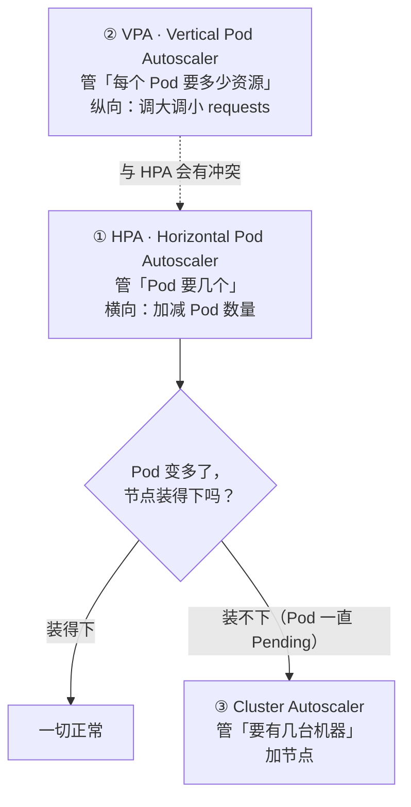
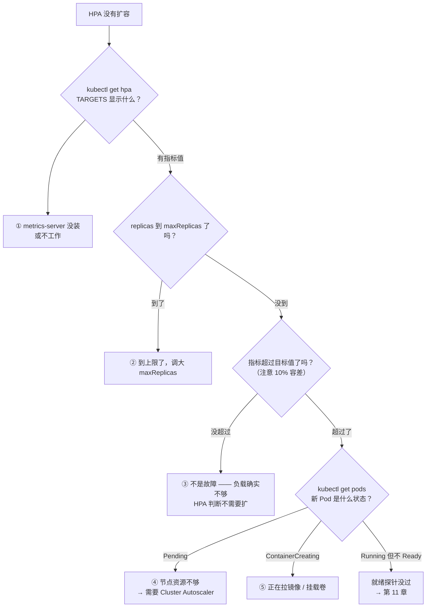

# 第 12 章　弹性伸缩：HPA、VPA 与 Cluster Autoscaler

第 1 章列出的第二种失效方式是**人肉扩容**：

每天晚上 20:00 是笔记同步高峰，`api` 需要从 2 个副本扩到 10 个。

最朴素的做法是写个 crontab：

```bash
# 19:50 扩到 10 个，23:00 缩回 2 个
50 19 * * * kubectl scale deployment/api -n cloudnote --replicas=10
0  23 * * * kubectl scale deployment/api -n cloudnote --replicas=2
```

**它有三个致命问题**：

| 问题 | 后果 |
|---|---|
| **它猜的是时间，不是负载** | 大促提前到 18:00？或者那天没人来？**脚本照跑，结果不是过载就是浪费** |
| **扩了就不敢缩** | 万一缩的时候流量还在，就是事故。所以大家倾向于"只扩不缩"——**成本浪费** |
| **突发流量完全反应不过来** | 流量是 19:47 突然起来的，脚本 19:50 才动，而且**不知道该扩多少** |

本章要解决的，就是把"猜"换成"根据实际负载自动调整"。伸缩有三个层次——HPA 调副本数、VPA 调单副本的资源、Cluster Autoscaler 调节点数——它们各自解决问题的一段，也各自有独特的失效方式。其中最常见的报障"HPA 不工作"，多数情况下是这三层没有接上，而不是某一层坏了。

---

### 12.1 弹性的三个层次

K8s 的弹性不是一个机制，而是**三个层次**，各管一件事：



| 层次 | 对象 | 调整什么 | 方向 | 生效速度 |
|---|---|---|---|---|
| **① Pod 数量** | **HPA** | `replicas` | **横向**（加 Pod） | **15 秒 ~ 几分钟** |
| **② Pod 资源** | **VPA** | `requests` / `limits` | **纵向**（加资源） | **需要重启 Pod** |
| **③ 机器数量** | **Cluster Autoscaler** / Karpenter | 节点数 | 基础设施 | **1 ~ 3 分钟** |

**三者的依赖链**（这是理解它们关系的关键）：

```
流量涨了
  → HPA 说"要 10 个副本"（管数量）
  → 但集群只有 3 台机器，装不下 10 个 Pod
  → 新的 Pod 卡在 Pending
  → Cluster Autoscaler 发现"有 Pod 没地方住"
  → 加机器（1~3 分钟）
  → Pod 终于被调度上去
```

**注意这条链的最后一环**：**HPA 扩容到 Pod 真正能接流量，可能要 3~5 分钟**（HPA 决策 + 加节点 + 拉镜像 + 启动 + 就绪探针）。

**这个数字决定了一个重要的架构选择**：如果你的流量在 30 秒内可能翻 10 倍，**自动扩容是救不了你的**——必须靠预留容量或者限流降级。**自动伸缩是"应对趋势"，不是"应对尖峰"。**

---

### 12.2 HPA 的第一原理：它不看 QPS，它看"比例"

**这是全章最重要的一节。**

大部分人以为 HPA 是这样工作的："CPU 超过 80% 就扩容"。**不是。**

HPA 的实际算法是一个**比例公式**：

```
desiredReplicas = ceil[ currentReplicas × (currentMetricValue / desiredMetricValue) ]
```

把它翻译成人话：

> **"当前每个 Pod 的平均负载，是目标值的几倍，就乘几倍副本数。"**

**它不是"超阈值就加一个"，而是"超出多少倍，就扩多少倍"。**

#### 走一遍具体计算

假设：

```
当前副本数             = 2
当前平均 CPU 利用率     = 70%
目标 CPU 利用率（你设的）= 50%
```

计算：

```
desiredReplicas = ceil[ 2 × (70 / 50) ] = ceil[2.8] = 3
```

**扩到 3 个。**再验证一下：3 个 Pod 分摊 2 个 Pod 的负载 → 每个 Pod 的利用率降到 `70 × 2/3 ≈ 47%`，**低于目标 50%**。收敛。

**这就是"比例"的含义**：它算的是"要让利用率回到目标值，需要几个 Pod"。

#### 关键推论：`requests` 是 HPA 的地基

现在看那个被忽略的核心问题：

**"CPU 利用率 70%"，这个 70% 是相对于什么的？**

**是相对于 `requests`，不是相对于 `limits`，更不是相对于节点 CPU。**

```yaml
resources:
  requests:
    cpu: 100m        # ← HPA 的分母就在这里
  limits:
    cpu: 500m
```

```
HPA 看到的 CPU 利用率 = 容器实际 CPU 用量 / requests.cpu
                      = 实际用量 / 100m
```

**所以 `requests` 写错，HPA 会彻底失灵，而且以两种相反的方式失灵**：

| `requests` 写错了 | HPA 看到什么 | 后果 |
|---|---|---|
| **写得太小**（比如实际需要 500m，写了 50m） | 利用率**虚高**（永远 100%+） | **一直扩，扩到 `maxReplicas` 还在扩**，Pod 一堆但都不够用 |
| **写得太大**（比如实际 50m，写了 500m） | 利用率**虚低**（永远 5%） | **永远不扩**，哪怕已经过载（真实的 CPU 不够用但显示很低） |

> **一句话记住**：**HPA 的 CPU 利用率 = 实际用量 ÷ requests。**
>
> 所以第 10 章那句"requests 是调度依据"要补一句：**它同时是自动伸缩的依据。**
>
> **实践结论**：**用 HPA 之前，必须先做容量规划，把 `requests` 按真实用量（P95）设准。**HPA 是建立在"requests 已经对了"这个前提之上的。前提错了，自动伸缩只会把错误放大。

#### 那个 `ceil` 和"容差"为什么重要

你可能已经注意到两个细节：

**① `ceil`（向上取整）** —— 保证扩出来的 Pod 数**足够**（宁可多一个）。

**② 容差（tolerance，默认 10%）** —— 如果计算出的比例接近 1（在 `0.9 ~ 1.1` 之间），**就不动了**。

假设利用率是 53%，目标是 50%：`53/50 = 1.06`，在 10% 容差内 → **不扩**。

**为什么需要容差？** 因为指标是时刻波动的。没有容差，利用率在 50% 上下抖一下就会导致 `Pod 数 3 → 4 → 3 → 4` 来回震荡。**容差是防止"抖动式扩缩"的第一道闸。**

---

### 12.3 HPA 工作的三个前置条件

HPA **不是装上就能用的**，它有三条硬性前提。

| 前提 | 为什么需要 | 缺了会怎样 |
|---|---|---|
| **① 装了 `metrics-server`** | 它提供 CPU / 内存指标 | `kubectl get hpa` 的 `TARGETS` 列显示 **`<unknown>/50%`**，HPA 完全不动 |
| **② 每个容器都写了 `requests`** | 利用率要除以 requests，没有分母算不出 | HPA 报 `missing request for cpu`，不工作 |
| **③ 目标对象有 `scale` 子资源** | HPA 靠调用它的 scale 接口来改副本数 | 裸 Pod 不能用 HPA（必须用 Deployment / RS / StatefulSet 这类控制器） |

**逐条验证一下**：

```bash
# ① metrics-server 装了吗
kubectl get pods -n kube-system | grep metrics-server
kubectl top nodes          # 能出数据说明它工作正常

# ② 容器有 requests 吗
kubectl get deploy api -n cloudnote -o jsonpath='{.spec.template.spec.containers[*].resources.requests}'

# ③ 看看 HPA 的状态
kubectl get hpa -n cloudnote
# NAME   REFERENCE        TARGETS         MINPODS   MAXPODS   REPLICAS
# api    Deployment/api   12%/50%         2         10        2
#                        ↑ 这个位置显示 <unknown> 就是指标有问题

# 看 HPA 的详细决策过程（排查利器）
kubectl describe hpa api -n cloudnote
```

**`kubectl describe hpa` 会打印 HPA 的"计算过程"**，包括它当前读到的指标值、算出的期望副本数、以及为什么没有动。**排查 HPA 问题，第一条命令就是它。**

---

### 12.4 三种指标源：从 CPU 到"队列里积压了多少个任务"

HPA 支持的指标分三类，**能力递增、配置成本也递增**：

| 指标类型 | 数据来源 | 怎么配 | 典型用途 |
|---|---|---|---|
| **`Resource`** | **`metrics-server`** | 内置，写 `cpu` / `memory` 就行 | 大多数 Web 服务 |
| **`Pods`** | 自定义指标 adapter（如 `prometheus-adapter`） | 需要部署 adapter + 写 PromQL | **按业务指标扩缩** |
| **`External`** | 集群外指标 adapter | 同上 | **按队列长度、外部系统指标扩缩** |

#### 什么时候"只按 CPU 扩缩"是不够的

**这是 CloudNote 里一个真实的痛点**，也是本节的精华。

看 CloudNote 的 `worker`（PDF 导出任务）：

```
worker 的工作模式：
    从队列取一个任务
    → 调外部服务生成 PDF（等 3 秒，CPU 几乎为 0）
    → 存文件（IO，CPU 几乎为 0）
    → 取下一个任务
```

**问题**：worker 是**典型的 IO 密集 + 等待型**服务，**它的 CPU 利用率永远很低**。

```
队列里积压了 10000 个任务
        ↓
worker 的 CPU 利用率：5%
        ↓
如果按 CPU 扩缩（目标 50%）：
    5/50 = 0.1 < 1 → 【不扩】
        ↓
任务越积越多，用户等了半小时
        ↓
而 HPA 认为"很闲，甚至想缩容"
```

**这就是"指标选错"的典型事故**：**你希望它按"队列积压量"扩缩，却让它按 CPU 扩缩。**

**正确的做法**是用自定义指标（`External` 类型）：

```yaml
metrics:
  - type: External
    external:
      metric:
        name: rabbitmq_queue_messages_ready     # 队列里待处理的消息数
        selector:
          matchLabels:
            queue: pdf-export
      target:
        type: AverageValue
        averageValue: "30"    # 每个 worker 平均消化 30 个积压任务
```

**判据（什么时候必须用自定义指标）**：

| 你的服务特征 | 该用的指标 |
|---|---|
| CPU 随负载线性上升（Web API、计算型） | **CPU 就够** |
| IO 密集 / 大量等待 / 异步消费 | **必须用业务指标**（队列长度、待处理请求数） |
| 内存随连接数上升（有状态的缓存） | 内存，或者连接数 |
| 有明确的业务"积压"概念 | 积压量（最直接） |

**一个通用的思维模型**：

**扩缩容的指标，应该是"反映系统压力的那个量"**，而不是"顺便能拿到的那个量"。

**CPU 之所以被当成默认指标，只是因为它是唯一一个"开箱即用"的指标**——不是因为它总是最好的。

---

### 12.5 HPA 的震荡抑制：为什么它不会疯狂扩缩

如果没有抑制机制，HPA 会像一个神经过敏的空调：人一进门就开最大，人一走就关掉。**K8s 用了"不对称"的设计来解这个问题**：

| 方向 | 默认行为 | 为什么 |
|---|---|---|
| **扩容** | **立即执行** | **保守方向**：宁可多给资源，不能让用户等待 |
| **缩容** | **先观察 300 秒**（`stabilizationWindowSeconds`） | **谨慎方向**：万一流量马上回来，缩了就很惨 |

**这个不对称解释了一个高频困惑**：

**"为什么流量降下来了，Pod 半天不缩？"**

因为它在**观察窗口内**。"观察 5 分钟，如果这 5 分钟内计算出的期望副本数一直是小的，才真的缩。"

#### `behavior` 字段：把这套规则写出来

```yaml
spec:
  behavior:
    scaleUp:
      stabilizationWindowSeconds: 0        # 扩容不等待，立即执行
      policies:
        - type: Percent
          value: 100                       # 每 15 秒最多翻一倍
          periodSeconds: 15
        - type: Pods
          value: 4                         # 或者每 15 秒最多加 4 个（取两者中较大的）
          periodSeconds: 15
      selectPolicy: Max

    scaleDown:
      stabilizationWindowSeconds: 300      # 缩容先观察 5 分钟
      policies:
        - type: Percent
          value: 10                        # 每 60 秒最多缩 10%
          periodSeconds: 60
      selectPolicy: Max
```

**为什么扩容也要限速（`value: 100` / `value: 4`）？**

因为**无限制扩容可能瞬间打爆后端**：`api` 从 2 个扩到 200 个，每个都要连数据库——**数据库连接被打满，整个系统崩了**。

**限速保护的是下游。**所以生产上常见的是：

```
扩容：快但有限速（每 15 秒最多翻倍 / 最多加 4 个）
缩容：慢且更保守（观察 5 分钟，每 60 秒最多缩 10%）
```

**一个反直觉的建议**：**缩容要做得比扩容更慢。**因为：

- 扩慢了 → 用户等待（可感知的体验问题）
- 缩快了 → 流量一回来就雪崩（不可逆的事故）

**两者的风险不对称，所以策略也不该对称。**

---

### 12.6 HPA 扩不上去的五个原因

**这一节是最实用的排查清单。**



#### 逐条对应的验证命令

| # | 原因 | 怎么确认 | 怎么修 |
|---|---|---|---|
| **1** | `metrics-server` 没装 / 挂了 | `kubectl top pods` 报错；`TARGETS` 是 `<unknown>` | 装 metrics-server |
| **2** | 容器**没写 `requests`** | `kubectl describe hpa` 里有 `missing request for cpu` | 补上 requests |
| **3** | 指标**没超过目标**（含 10% 容差） | `TARGETS` 显示 `45%/50%` | **不是故障**，不需要修 |
| **4** | 到 `maxReplicas` 了 | `kubectl get hpa` 的 `REPLICAS` = `MAXPODS` | 调大 `maxReplicas` |
| **5** | **扩了但 `Pending`** | `kubectl get pods` 看到 Pending；`describe` 里 `Insufficient cpu` | **需要 Cluster Autoscaler**（下一节） |

**第 3 条值得单独强调**：**很多"HPA 不工作"的报障，其实是"HPA 工作正常，只是它判断不需要扩"。**

先看 `TARGETS` 那一列的实际数值，再决定要不要排查。**不要一上来就怀疑 HPA 坏了。**

**第 5 条是"两个层次的伸缩没接上"的典型症状**：HPA 只管"要几个 Pod"，它**完全不管"节点装不装得下"**。这就是下一节要补的那一环。

---

### 12.7 Cluster Autoscaler：当节点不够时

#### 它做什么

**Cluster Autoscaler（CA）是集群层面的伸缩器**，它盯着两件事：

| 它观察到的现象 | 它的动作 |
|---|---|
| **有 Pod 因为资源不足而 `Pending`** | **增加节点** |
| **某个节点长时间利用率很低，且它上面的 Pod 都能搬到别处** | **减少节点** |

**和 HPA 的分工非常清晰**：

```
HPA：要几个 Pod？（应用层）
CA ：要几台机器？（基础设施层）
```

#### 它的工作方式：依赖"节点组"

CA 通常和云厂商的**节点池 / 自动伸缩组**配合：

```
CA 发现 Pending Pod 需要 4 核 8G
    ↓
它去看有哪些"节点组"
    ↓
选一个能装下的节点组，把期望数量 +1
    ↓
云厂商的控制面去创建这台机器（1~3 分钟）
    ↓
新节点加入集群 → Pod 被调度上去
```

**这就是为什么扩容要 1~3 分钟**：**大部分时间花在"创建一台真实的机器"上**（分配资源、启动、加入集群、拉镜像）。

**记住这个时间量级，因为它是架构决策的依据**（回到第 12.1 节那句话：**自动伸缩应对趋势，不应对尖峰**）。

#### CA 缩容的五个条件（很严格，是好事）

CA **不会随便缩节点**——它必须确认"缩掉这台不会出问题"。条件是：

| 条件 | 说明 |
|---|---|
| 节点利用率**低于阈值**（默认 50%），且**持续 10 分钟** | 避免抖动式缩容 |
| **节点上所有 Pod 都能被"搬"到别处** | 别的节点要有余量 |
| **没有本地存储**（`emptyDir`、`hostPath`） | 缩了数据就没了（第 9 章） |
| **没有禁止缩容的注解** | 见下面的注解 |
| **没有"裸 Pod"**（没被控制器管理的 Pod） | 裸 Pod 搬不走，会丢（第 2 章） |

**一个实用的注解**：

```yaml
metadata:
  annotations:
    # 阻止 CA 缩掉我所在的节点（比如这个 Pod 必须在特定节点）
    cluster-autoscaler.kubernetes.io/safe-to-evict: "false"
```

#### Karpenter：更快的新一代方案

云厂商推出的 **Karpenter**（AWS 开源，Azure / GCP 也有类似方案）改变了这个模式：

| | Cluster Autoscaler | Karpenter |
|---|---|---|
| 工作方式 | 调整**预定义的节点组**的期望数量 | **直接创建最合适的单台机器** |
| 机型灵活性 | 受节点组限制（每组一个机型） | **每次按 Pod 需求挑机型** |
| 扩容速度 | 1~3 分钟 | 通常更快 |
| 装箱效率 | 一般 | **按 Pod 需求装箱，成本更低** |

**趋势上 Karpenter 是方向**，但如果你的云平台已经跑着 CA，**没必要为了这个专门迁移**。

#### 三个实践建议

| 建议 | 理由 |
|---|---|
| **`minReplicas` 不要设太小** | 从 1 扩到 100 要几分钟；**留一点 baseline 容量，扛住突发的头几十秒** |
| **CA 的 `min` 节点数留一点 buffer** | 别让它缩到"刚好装下当前 Pod"，那下一次扩容又要等 3 分钟 |
| **给关键服务做"容量预留"而不是纯靠自动伸缩** | 自动伸缩是**成本优化**手段，不是**可用性保障**手段 |

---

### 12.8 VPA：纵向伸缩，以及它和 HPA 的尴尬关系

#### 它做什么

**VPA 调整的是 Pod 的 `requests` / `limits`，不是数量。**

```yaml
apiVersion: autoscaling.k8s.io/v1
kind: VerticalPodAutoscaler
metadata:
  name: api-vpa
  namespace: cloudnote
spec:
  targetRef:
    apiVersion: apps/v1
    kind: Deployment
    name: api
  updatePolicy:
    updateMode: "Off"        #  只给建议，不动手（最实用的模式）
```

#### 三种 `updateMode`，代价完全不同

| 模式 | 行为 | 代价 |
|---|---|---|
| **`Off`** | **只计算建议，不改任何东西** | 无。**推荐用它来"做容量规划"** |
| **`Initial`** | 只在**创建新 Pod** 时应用建议 | 已有 Pod 不变，所以**需要重启才生效** |
| **`Recreate`** | 修改已有 Pod 的 requests |  **会驱逐并重建 Pod**——**这是 VPA 的最大代价** |

**`Recreate` 模式的风险值得单独讲**：VPA 会**主动驱逐你的 Pod** 来调整资源。

如果它判断"你需要的资源变少了"，就会把 Pod 重建一遍。**在流量高峰期被 VPA 驱逐重建，后果可能比资源不准更严重。**

#### VPA 与 HPA 的尴尬关系

**能一起用吗？** 答案要分情况：

| 组合 | 能用吗 | 为什么 |
|---|---|---|
| **HPA 按 CPU + VPA 也管 CPU** | **不能**  | **两者打架**：HPA 想加 Pod，VPA 想加 CPU——它们都在尝试解决同一个问题（CPU 不够），会互相干扰 |
| **HPA 按自定义指标 + VPA 管 CPU** | 可以  | 管的是不同维度：一个管数量，一个管单 Pod 资源 |
| **HPA 按 CPU + VPA 用 `Off` 模式** | 可以  | VPA 只看不动，不产生冲突 |

**官方立场是"谨慎"**：因为 VPA 改 requests 会**改变 HPA 的分母**，两个控制器在互相影响对方的输入。

#### 那 VPA 到底该用来干什么（最实用的用法）

**VPA 最有价值的用法不是"让它自动调"，而是"让它告诉你该设多少"。**

```bash
# 1. 用 Off 模式部署 VPA，让它观察一到两周
kubectl apply -f cases/cloudnote/60-hpa.yaml

# 2. 读它给出的建议
kubectl describe vpa api-vpa -n cloudnote | sed -n '/Recommendation/,$p'
```

**输出长这样**：

```
Recommendation:
  Container Recommendations:
    Container Name:  api
    Lower Bound:     Cpu: 87m    Memory: 118Mi     ← 低于这个会不稳
    Target:          Cpu: 132m   Memory: 176Mi     ← 建议值
    Uncapped Target: Cpu: 132m   Memory: 176Mi
    Upper Bound:     Cpu: 421m   Memory: 512Mi     ← 高于这个基本是浪费
```

**`Target` 那一行就是你要写进 Deployment 的 `requests`。**

**这个用法解决了两个真实问题**：

| 问题 | VPA Off 模式怎么帮 |
|---|---|
| 团队不知道 requests 该设多少，只能拍脑袋 | **用真实数据给出建议**，而且有上下界（判断区间，不是单点） |
| 服务改版后资源画像变了，没人注意 | **每周看一次建议，和当前 requests 对比**（比如现在写 100m，建议 500m → 说明该调了） |

**这才是 VPA 在生产上的主流用法**：**当"资源顾问"，而不是"自动调节器"。**

因为自动调节的代价（重建 Pod）和风险（与 HPA 冲突）都不小，而"给建议"这个用法的收益（把 requests 调准）恰恰是 HPA 能否工作的**前提**。**两者刚好接上。**

---

### 12.9 CloudNote 的完整弹性伸缩配置

把这一章的东西拼起来。

#### `api`：按 CPU 扩缩（有明确的计算 / 请求处理压力）

```yaml
apiVersion: autoscaling/v2
kind: HorizontalPodAutoscaler
metadata:
  name: api
  namespace: cloudnote
spec:
  scaleTargetRef:
    apiVersion: apps/v1
    kind: Deployment
    name: api
  minReplicas: 2               # 不要设 1：扛住突发的头几十秒
  maxReplicas: 10
  metrics:
    - type: Resource
      resource:
        name: cpu
        target:
          type: Utilization
          averageUtilization: 50     # ← 注意：这是「占 requests 的百分比」
  behavior:
    scaleUp:
      stabilizationWindowSeconds: 0
      policies:
        - type: Percent
          value: 100
          periodSeconds: 15
        - type: Pods
          value: 4
          periodSeconds: 15
      selectPolicy: Max
    scaleDown:
      stabilizationWindowSeconds: 300
      policies:
        - type: Percent
          value: 10
          periodSeconds: 60
      selectPolicy: Max
```

**前提检查清单**（缺一个 HPA 就不工作）：

| 检查项 | 状态 |
|---|---|
| `metrics-server` 已部署 | 必须 |
| `api` 的容器写了 `requests.cpu` | 必须（分母） |
| `requests` 是按真实用量校准过的 | 强烈建议（用 VPA Off 验证） |
| 有 `readinessProbe` | 必须（未就绪的 Pod 不计入指标） |
| 有 `topologySpreadConstraints` | 建议（扩出来的 Pod 别全挤一个节点，第 10 章） |
| `maxReplicas` ≤ 集群能承载的数量 | 必须，否则扩到一半卡 Pending |

#### `worker`：按队列长度扩缩（必须用自定义指标）

```yaml
apiVersion: autoscaling/v2
kind: HorizontalPodAutoscaler
metadata:
  name: worker
  namespace: cloudnote
spec:
  scaleTargetRef:
    apiVersion: apps/v1
    kind: Deployment
    name: worker
  minReplicas: 1
  maxReplicas: 20
  metrics:
    # 关键：不用 CPU，用「队列积压量」
    - type: External
      external:
        metric:
          name: rabbitmq_queue_messages_ready
          selector:
            matchLabels:
              queue: pdf-export
        target:
          type: AverageValue
          averageValue: "30"        # 每个 worker 平均消化 30 个积压任务
```

**为什么这个必须用自定义指标**：回到第 12.4 节那个推演——**worker 等 IO 时 CPU 只有 5%，按 CPU 扩缩它永远不动，而队列已经积压了 10000 个任务。**

#### 与前面章节的配合

```
第 10 章：requests 校准        → HPA 能算对
第 10 章：topologySpread      → 扩出来的 Pod 打散（真高可用）
第 11 章：readinessProbe      → 未就绪的 Pod 不计入指标
第 5 章 ：滚动更新策略         → 扩缩过程中不中断服务
第 12 章：HPA + CA + VPA Off  → 弹性
```

**这五章合起来，才是"一个能在生产上跑的服务"的完整形态。**

---

### 12.10 动手：看着 Pod 自己变多

配套脚本：

```bash
bash cases/cloudnote/tools/autoscaling-lab.sh
```

#### 第一步：装上 `metrics-server`（HPA 的前提）

kind / minikube 默认**不带** metrics-server，需要手动装：

```bash
# 官方清单
kubectl apply -f https://github.com/kubernetes-sigs/metrics-server/releases/latest/download/components.yaml

# kind 环境需要额外跳过一次 TLS 校验（因为 kubelet 用的是自签证书）
kubectl patch deployment metrics-server -n kube-system --type=json -p='[
  {"op":"add","path":"/spec/template/spec/containers/0/args/-","value":"--kubelet-insecure-tls"}
]'

kubectl rollout status deployment/metrics-server -n kube-system
kubectl top nodes
kubectl top pods -n cloudnote
```

**如果 `kubectl top` 能出数据，就说明指标链路通了。**

#### 第二步：创建 HPA

```bash
kubectl apply -f cases/cloudnote/60-hpa.yaml

kubectl get hpa -n cloudnote -w
```

**初始状态应该长这样**：

```
NAME   REFERENCE        TARGETS    MINPODS   MAXPODS   REPLICAS
api    Deployment/api   1%/50%     2         10        2
```

**重点看 `TARGETS` 那一列**：

- 有数值（`1%/50%`）→ 指标链路正常
- **`<unknown>/50%`** → `metrics-server` 有问题，或者容器没写 `requests`

#### 第三步：打流量，看它自己扩容

```bash
# 开一个终端盯住 HPA
kubectl get hpa api -n cloudnote -w
```

**另开终端，把负载打起来**：

```bash
kubectl run load-generator -n cloudnote --image=busybox:1.36 --restart=Never \
  --command -- sh -c 'while true; do wget -q -O- http://api:8080/ >/dev/null 2>&1; done'

# 或者更直接：在 api 的容器里跑 CPU 密集操作
kubectl exec -it deploy/api -n cloudnote -- sh -c 'while true; do :; done'
```

**观察 HPA 的变化**：

```
NAME   REFERENCE        TARGETS     MINPODS   MAXPODS   REPLICAS
api    Deployment/api   1%/50%      2         10        2
api    Deployment/api   42%/50%     2         10        2
api    Deployment/api   118%/50%    2         10        3     ← 开始扩
api    Deployment/api   89%/50%     2         10        4
api    Deployment/api   61%/50%     2         10        5
api    Deployment/api   48%/50%     2         10        5     ← 收敛到目标附近
```

**验证一下第 12.2 节那个公式**：

```
当 TARGETS 是 118% 而当前是 2 个副本时：
desiredReplicas = ceil[ 2 × (118 / 50) ] = ceil[4.72] = 5
```

**但实际只扩到了 3** —— 因为 `behavior.scaleUp` 里的限速（每 15 秒最多加 4 个、最多翻倍）。**HPA 是逐步逼近目标，不是一步到位。**

**看它的决策过程**：

```bash
kubectl describe hpa api -n cloudnote | sed -n '/Events/,$p'
# 会看到类似：
#   SuccessfulRescale  New size: 5; reason: cpu resource utilization above target
```

#### 第四步：停掉流量，观察"缩容延迟"

```bash
# 停掉压力
kubectl delete pod load-generator -n cloudnote

# 继续盯 HPA
kubectl get hpa api -n cloudnote -w
```

**你会观察到**：

| 时间 | 现象 |
|---|---|
| T+0 | 压力停了，`TARGETS` 立刻降到 `3%/50%` |
| **T+0 ~ T+5min** | **`REPLICAS` 一直不变！** ← 这就是 `stabilizationWindowSeconds: 300` |
| T+5min 之后 | 开始逐步缩（每 60 秒缩 10%） |

**关键观察**：**指标立刻就降了，但副本数要等 5 分钟才开始缩。**

**这就是"扩容立即、缩容延迟"的实证。**如果你不知道这个设计，会以为"HPA 坏了"或者"缩容不工作"。

#### 第五步：观察"扩了但 Pending"（没有 CA 的世界）

这一步要在**本地集群**体会——因为 kind 没有 Cluster Autoscaler：

```bash
# 把 maxReplicas 调得很高，然后打流量
kubectl patch hpa api -n cloudnote -p '{"spec":{"maxReplicas":50}}'

# 打流量（同上），让它尽力扩
kubectl get pods -n cloudnote -l app=api -w
```

**你会看到**：

```
NAME                   READY   STATUS    NODE
api-xxx-1              1/1     Running   k8s-study-worker
api-xxx-2              1/1     Running   k8s-study-worker2
api-xxx-3              0/1     Pending   <none>          ← 卡住了
api-xxx-4              0/1     Pending   <none>
```

`describe` 里写着 `0/2 nodes are available: 2 Insufficient cpu`。

**这就是"两个层次的伸缩没接上"的典型症状**：

**HPA 说"要 8 个"，但集群只有 2 个节点，装不下第 3 个。**

**HPA 完全不管节点够不够**——那是 Cluster Autoscaler 的活。而在本地集群里没有 CA，所以 Pod 就永远 Pending。

**在云上，这时候 CA 会开始加机器（1~3 分钟）。在本地，你需要手动加节点或者调小 `maxReplicas`。**

#### 第六步：用 VPA 的 `Off` 模式拿到资源建议

```bash
# 60-hpa.yaml 里已经包含了一个 updateMode: Off 的 VPA
kubectl get vpa -n cloudnote

# 等几分钟让它收集数据
sleep 180

# 读建议
kubectl describe vpa api-vpa -n cloudnote | sed -n '/Recommendation/,$p'
```

**你会看到 `Target` / `Lower Bound` / `Upper Bound` 三行**——这就是"该给多少 requests"的实测答案。

**对比一下你现在写的是什么**：

```bash
echo "当前 Deployment 里的 requests："
kubectl get deploy api -n cloudnote -o jsonpath='{.spec.template.spec.containers[0].resources.requests}{"\n"}'

echo "VPA 的建议："
kubectl get vpa api-vpa -n cloudnote -o jsonpath='{.status.recommendation.containerRecommendations[0].target}{"\n"}'
```

**两者差得多，就说明你的 requests 没设准** —— 而 `requests` 不准，HPA 就算不对。

**这就是 VPA 最有价值的用法：当"资源顾问"，而不是"自动调节器"。**

#### 清理

```bash
bash cases/cloudnote/tools/autoscaling-lab.sh --cleanup
```

 **注意**：`metrics-server` 是集群级组件，清理脚本**不会**删除它（属于整个集群，不属于本章实验）。

---

### 12.11 本章要点

1. **弹性分三层**：`HPA` 管 Pod 数量（横向）、`VPA` 管单 Pod 资源（纵向）、`Cluster Autoscaler` 管机器数量。**三者有依赖链**：HPA 扩出 Pod → 节点装不下 → 需要 CA 加机器。**完整链路要 3~5 分钟**，所以自动伸缩应对趋势、不应对尖峰。
2. **HPA 的核心是一个比例公式**：`期望副本数 = ceil(当前副本数 × 当前指标 / 目标指标)`。它不是"超阈值就加一个"，而是"超出多少倍就扩多少倍"。
3. **`requests` 是 HPA 的地基**：CPU 利用率 = **实际用量 ÷ requests**。写小了会一直扩到上限，写大了永远不扩。**用 HPA 之前必须先把 requests 校准。**
4. **`VPA` 和 `HPA` 在同一指标上会打架**，而 VPA 的 `Recreate` 模式会**驱逐重建 Pod**。所以 VPA 最有价值的用法是 **`Off` 模式当"资源顾问"**——它给出的建议恰好就是 HPA 需要的那份正确 requests。

#### 本章全景图

```
                      流量上涨
                         │

   ┌─────────────────────┴─────────────────────┐
   │  HPA：该有几个 Pod？                       │
   │    公式 = ceil(当前副本 × 当前指标/目标指标) │
   │    分母是 requests ──► requests 错 = 全错  │
   │    扩容立即 / 缩容观察 5 分钟                │
   └─────────────────────┬─────────────────────┘
                         │ 扩出了 Pod
                         ▼
   ┌───────────────────────────────────────────┐
   │  节点装得下吗？                              │
   └───────┬───────────────────────┬───────────┘
           │ 装得下                 │ 装不下 → Pod Pending
           ▼                       ▼
   ┌───────────────┐   ┌───────────────────────────┐
   │   正常接流量    │   │ Cluster Autoscaler 加机器  │
   └───────────────┘   │  1~3 分钟（创建真实机器）    │
                       └───────────────────────────┘

   VPA（Off 模式）：只输出建议 ──► 用来校准 requests ──► 喂回给 HPA
```

### 12.12 练习题

1. 弹性的三个层次分别管什么？它们之间的依赖链是什么？
2. 为什么"自动伸缩应对趋势、不应对尖峰"？完整扩缩链路大概要多久？
3. **写出 HPA 的期望副本数公式**，并用"2 副本、当前 70%、目标 50%"算一遍。
4. **HPA 说的"CPU 利用率 70%"，分母是什么？**不是 limits 吗？
5. `requests` 写得太小和太大，分别会让 HPA 怎么失灵？
6. HPA 的"容差（tolerance）"默认是多少？它是干什么用的？
7. HPA 工作的三个前置条件是什么？缺了各会怎样？
8. `kubectl get hpa` 的 `TARGETS` 显示 `<unknown>/50%` 意味着什么？
9. **为什么 `worker` 这类 IO 密集型服务不能用 CPU 做扩缩指标？**该用什么？
10. HPA 扩容和缩容的默认行为有什么不对称？为什么这样设计？
11. 为什么"缩容要做得比扩容更慢"？两者的风险怎么不对称？
12. 为什么扩容也要限速（`scaleUp` 的 policies）？
13. HPA 扩不上去的五个原因分别是什么？各怎么确认？
14. "扩了但 Pod 一直 Pending"说明什么？该找谁解决？
15. Cluster Autoscaler 缩容有哪五个条件？为什么要这么严格？
16. VPA 的三种 `updateMode` 分别做什么？哪个代价最大？
17. VPA 和 HPA 能在同一指标上一起用吗？为什么？
18. **VPA 最有价值的用法是什么？**它和 HPA 怎么接上？
