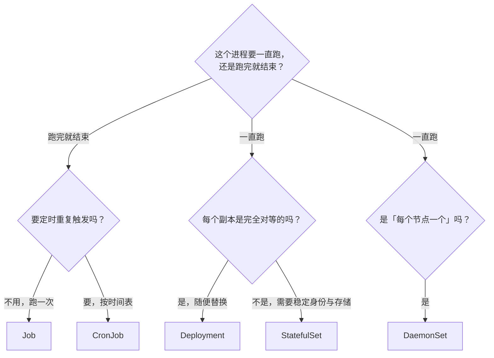
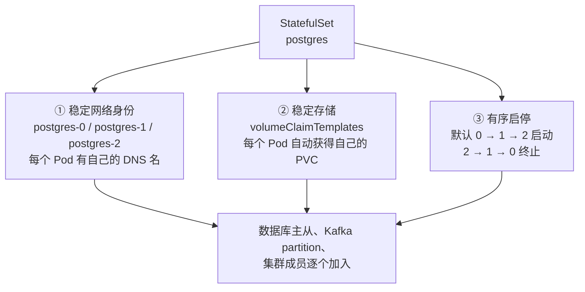

# 第 13 章　工作负载全景：StatefulSet、DaemonSet、Job 与 CronJob

前 12 章几乎只用到一个工作负载：**Deployment**。`api`、`web`、`worker` 都由它管理，这也够用，因为它们都是**无状态**的。

但 CloudNote 里还有三个需求，`Deployment` 全都解决不了：

| 需求 | Deployment 为什么不行 |
|---|---|
| **`postgres` 数据库** | 每个副本需要**自己的存储**、**自己的身份**、**有启动顺序**——Deployment 的 Pod 是完全对等的、可以随便替换的（第 9 章埋的伏笔：所有副本会抢同一个 PVC） |
| **每个节点上都要跑的日志采集器** | Deployment 管的是"**总数**"，它不知道"每个节点一个"是什么概念 |
| **一次性的数据迁移任务** | Job 要的是"**跑完就结束**"，而 Deployment 会**一直重启**它 |

本章补齐剩下的四个工作负载——StatefulSet、DaemonSet、Job 与 CronJob——并给出在它们之间做选择的判断准则。需要预先说明的是，StatefulSet 让"每个副本有自己的身份和存储"成为可能，但它并不理解数据库，更不负责主从切换；这条边界在 13.4 节会单独展开。

---

### 13.1 五种工作负载的总纲



| 工作负载 | 一句话定位 | Pod 名字 | 存储 | 启动顺序 |
|---|---|---|---|---|
| **Deployment** | **无状态应用**，副本完全对等 | 随机后缀 | 通常不需要（或共享） | 无要求 |
| **StatefulSet** | **有状态应用**，每个副本有身份 | **有序编号** `<name>-0/1/2` | **各自独立的 PVC** | **有序**（可配） |
| **DaemonSet** | **每个节点一个** | 随机后缀 | 常用 `hostPath` | 无要求 |
| **Job** | **跑完就结束**（要成功 N 次） | 随机后缀 | 视任务而定 | 无要求 |
| **CronJob** | **按时间表产生 Job** | 随机后缀 | 视任务而定 | 无要求 |

**两个判断问题就够了**：

1. **这个进程要一直跑，还是跑完就结束？** → 决定是 Deployment/StatefulSet/DaemonSet 这一族，还是 Job/CronJob 这一族
2. **每个副本是完全对等的，还是需要自己的身份和存储？** → 决定是 Deployment 还是 StatefulSet

**第三块判断**（补充）：**是"每个节点一个"吗？** → DaemonSet。这一条容易被忽略，因为它不由应用需求驱动，而由**基础设施需求**驱动（日志、监控、网络插件）。

---

### 13.2 StatefulSet 的三个"稳定"

先把第 9 章那个伏笔收掉。

**用 Deployment 管 postgres 会发生什么？**

```yaml
#  用 Deployment 管数据库
spec:
  replicas: 3
  template:
    spec:
      volumes:
        - name: data
          persistentVolumeClaim:
            claimName: postgres-data     # ← 三个副本都指向同一个 PVC
```

**三个 Pod 会争抢同一个 PVC**（第 9 章讲过：`ReadWriteOnce` 是"一个节点"，如果它们在同一节点上甚至能挂上，然后**三个进程同时写同一份数据**）。而且：

- Pod 名字是随机的 → **你无法知道哪个是主库**
- 重建后名字变、IP 变 → **从库的配置全部失效**
- 三个副本同时启动 → **它们不知道谁先谁后、谁是老大**

**StatefulSet 提供三个"稳定"来解决这些问题**：



#### ① 稳定网络身份

| | Deployment | StatefulSet |
|---|---|---|
| Pod 名字 | `api-7d4b9c8f5-9x2k7`（**随机**） | `postgres-0`、`postgres-1`（**有序、稳定**） |
| 重建后 | 名字变 | **名字不变**（`postgres-1` 永远是 `postgres-1`） |
| DNS 名 | 没有单个 Pod 的 DNS | **`postgres-1.postgres.cloudnote.svc.cluster.local`** |

**那个 DNS 名怎么来的？** 靠一个 **headless Service**（第 6 章那个终于派上用场）：

```yaml
apiVersion: v1
kind: Service
metadata:
  name: postgres          # ← StatefulSet 的 serviceName 指向它
  namespace: cloudnote
spec:
  clusterIP: None         # ← headless：DNS 返回所有 Pod IP，而不是一个虚拟 IP
  selector:
    app: postgres
  ports:
    - port: 5432
```

有了它，StatefulSet 的每个 Pod 都会获得两个 DNS 记录：

| DNS 名 | 解析到 | 用途 |
|---|---|---|
| `postgres-1.postgres` | **那一个** Pod 的 IP | **精确寻址**（"我要连 1 号节点"） |
| `postgres`（headless） | **所有** Pod 的 IP 列表 | 客户端自己选（第 6 章讲过） |

**这就是第 6 章那个 Headless Service 存在的理由。**当时说的是"用于 StatefulSet"，现在你看到实物了：**没有它，Pod 就没有自己的稳定域名，主从配置就写不出来。**

#### ② 稳定存储：`volumeClaimTemplates`

这是 StatefulSet 最优雅的设计——**它把"PVC 模板"写进 StatefulSet，由它给每个 Pod 自动创建一个独立的 PVC**：

```yaml
volumeClaimTemplates:
  - metadata:
      name: data
    spec:
      accessModes: ["ReadWriteOnce"]
      resources:
        requests:
          storage: 10Gi
```

**结果**：3 个副本会得到 **3 个独立的 PVC**：

```
data-postgres-0      ← 命名规则：<claimName>-<statefulsetName>-<ordinal>
data-postgres-1
data-postgres-2
```

**关键特性（这是 StatefulSet 存储和 Deployment 最本质的差别）**：

**每个 Pod 被重建时，会挂回它原来那个 PVC。**

```
postgres-1 挂了
    ↓
StatefulSet 控制器重建它，名字仍然是 postgres-1
    ↓
它去挂 data-postgres-1 这个 PVC —— 【还是原来那份数据】
    ↓
数据没丢，身份没变
```

**这是 Deployment 做不到的**：Deployment 的 Pod 重建后是"随便一个新 Pod"，它不知道"我原来用哪块盘"。

** 一个必须记住的行为**：**删除 StatefulSet 默认不会删除它创建的 PVC。**

```bash
kubectl delete statefulset postgres -n cloudnote
kubectl get pvc -n cloudnote
# data-postgres-0 / -1 / -2  【还在】
```

**这是刻意的保护**（防止手一抖删了 StatefulSet 顺便把数据库数据删了），但也意味着：**你以为删干净了，其实数据盘还占着、还在计费。**要清理必须手动删 PVC。

#### ③ 有序启停

默认 `podManagementPolicy: OrderedReady`，行为是：

```
创建时：
    postgres-0 启动 → 等它就绪（readinessProbe 通过）→ 才启动 postgres-1
    postgres-1 就绪 → 才启动 postgres-2

删除时（缩容）：
    postgres-2 先终止 → 确认终止 → 再终止 postgres-1 → 再 0

扩容时同理：只会在前一个就绪后才创建下一个
```

**为什么需要有序？** 因为很多分布式系统的集群成员是"逐个加入"的：

| 系统 | 为什么必须有序 |
|---|---|
| **数据库主从** | 0 号必须先起来成为主库，1/2 号才能作为从库去同步 |
| **Kafka** | partition leader 的分配依赖启动顺序 |
| **ZooKeeper / etcd** | 集群成员需要逐个加入并完成选举 |
| **Elasticsearch** | 主节点要先形成 quorum |

**如果你的应用不需要有序**（比如一个"每个副本独立处理一批数据"的分片任务），可以改成并行：

```yaml
spec:
  podManagementPolicy: Parallel    # 所有 Pod 同时创建，不等前一个就绪
```

**注意**：`Parallel` 只影响**创建/删除的顺序**，**不影响身份的稳定性**——Pod 仍然叫 `-0/-1/-2`、仍然各有自己的 PVC。**这两个保证是独立的。**

---

### 13.3 一个完整的 StatefulSet：CloudNote 的 postgres

文件位置：`cases/cloudnote/50-postgres.yaml`

```yaml
apiVersion: v1
kind: Service
metadata:
  name: postgres
  namespace: cloudnote
spec:
  clusterIP: None              # ← headless，为每个 Pod 提供稳定 DNS
  selector:
    app: postgres
  ports:
    - port: 5432
      name: postgres
---
apiVersion: apps/v1
kind: StatefulSet
metadata:
  name: postgres
  namespace: cloudnote
spec:
  serviceName: postgres        # ← 必须指向上面的 headless Service
  replicas: 3
  podManagementPolicy: OrderedReady
  selector:
    matchLabels:
      app: postgres
  template:
    metadata:
      labels:
        app: postgres
    spec:
      containers:
        - name: postgres
          image: postgres:16-alpine
          ports:
            - name: postgres
              containerPort: 5432
          env:
            - name: PGDATA
              value: /var/lib/postgresql/data/pgdata    # ← 第 9 章那个经典坑
            - name: POSTGRES_PASSWORD
              valueFrom:
                secretKeyRef:
                  name: api-secret
                  key: DB_PASSWORD
          volumeMounts:
            - name: data
              mountPath: /var/lib/postgresql/data
          resources:
            requests: { cpu: 100m, memory: 256Mi }
            limits:   { cpu: 1000m, memory: 1Gi }
          readinessProbe:
            exec:
              command: ["pg_isready", "-U", "postgres"]
            initialDelaySeconds: 10
            periodSeconds: 5
  # 每个 Pod 拿到自己独立的 PVC
  volumeClaimTemplates:
    - metadata:
        name: data
      spec:
        accessModes: ["ReadWriteOnce"]
        resources:
          requests:
            storage: 10Gi
```

#### 逐块拆解

| 片段 | 作用 | 漏了会怎样 |
|---|---|---|
| `serviceName: postgres` | 绑定 headless Service，给每个 Pod 稳定 DNS | **必填**。没有它 StatefulSet 创建失败 |
| `clusterIP: None` | 让 DNS 返回所有 Pod IP 而不是一个虚拟 IP | 拿不到单个 Pod 的域名 |
| `podManagementPolicy: OrderedReady` | 有序启停（默认值，写出来更明确） | 用默认值也能工作 |
| **`volumeClaimTemplates`** | **给每个 Pod 自动创建独立 PVC** | **所有副本共享一个 PVC** → 数据互相覆盖 |
| `PGDATA` 子目录 | 避开挂载点非空导致的初始化失败（第 9 章） | postgres 起不来，报 `data directory is not empty` |
| `readinessProbe: pg_isready` | **有序启动的判据**——前一个就绪才起下一个 | 有序启动退化成"起了就算"，主从可能错乱 |
| `terminationGracePeriodSeconds`（默认 30s） | 缩容时给数据库时间落盘 | 数据可能损坏 |

#### 观察它的行为

```bash
kubectl apply -f cases/cloudnote/50-postgres.yaml

# ① 观察有序启动（注意顺序和间隔）
kubectl get pods -n cloudnote -l app=postgres -w
# postgres-0   0/1   Pending → ContainerCreating → Running (就绪后才出现下一个)
# postgres-1   ...
# postgres-2   ...

# ② 每个 Pod 都有自己的 PVC
kubectl get pvc -n cloudnote -l app=postgres
# data-postgres-0   Bound   ...   10Gi
# data-postgres-1   Bound   ...   10Gi
# data-postgres-2   Bound   ...   10Gi

# ③ 每个 Pod 都有自己的稳定 DNS 名
kubectl run -it --rm dns-probe -n cloudnote --image=busybox:1.36 --restart=Never -- \
  nslookup postgres-0.postgres.cloudnote.svc.cluster.local

# ④ 删掉 1 号，看它重建后名字和存储都不变
kubectl delete pod postgres-1 -n cloudnote
sleep 15
kubectl get pods -n cloudnote -l app=postgres
# postgres-1 又回来了，而且挂的还是 data-postgres-1
```

**第 ④ 步是本章最关键的一次观察**：**名字回来了、数据也回来了**——这是 StatefulSet 与 Deployment 最本质的差别。

---

### 13.4 StatefulSet 的边界：它只给了地基，没给房子

**这一节必须讲清楚，否则你会对 StatefulSet 产生过高的期待。**

StatefulSet 提供的**只有**三块地基：

| 它给了什么 | 它**没有**给什么 |
|---|---|
| 稳定网络身份（`-0/-1/-2` + DNS） |  **不管数据复制**（主从同步要应用自己或 Operator 做） |
| 稳定存储（每个 Pod 自己的 PVC） |  **不管选主 / 故障转移**（谁是新主库？它不知道） |
| 有序启停 |  **不管备份**（第 9 章那条红线） |
| — |  **不管版本升级**（数据库大版本升级怎么滚动？） |
| — |  **不管扩缩容的数据再平衡**（加一个分片，数据怎么迁？） |

**换句话说**：

**StatefulSet 让"每个副本有自己的身份和存储"这件事成为可能，但它完全不知道 PostgreSQL 是什么、更不知道主从该怎么配。**

**它提供的是**编排原语**，不是**数据库运维能力**。

#### 那生产上该怎么办：Operator

**这正是第 4 章那个"CRD + 控制器 = Operator"的用武之地。**

以 PostgreSQL 为例，常见的 Operator：

| Operator | 它封装的运维知识 |
|---|---|
| **CloudNativePG** | 主从拓扑、自动故障转移、备份到对象存储、PITR、滚动升级 |
| **Zalando postgres-operator** | 同上（更早的方案） |
| **Percona Operator for PostgreSQL** | 同上 |
| 各云厂商的托管数据库 Operator | 与云平台深度集成 |

**用了 Operator 之后，你的 YAML 变成这样**：

```yaml
apiVersion: postgresql.cnpg.io/v1     # ← 自定义资源（CRD）
kind: Cluster
metadata:
  name: cloudnote-db
spec:
  instances: 3
  storage:
    size: 10Gi
  backup:
    barmanObjectStore:
      destinationPath: s3://cloudnote-backups/
```

**注意：上面没有一个字提到 StatefulSet、Service、PVC。**Operator 会在背后创建它们，并且**持续调谐**：主库挂了它会提升从库、备份失败了它会重试、你要扩容它会加实例。

**对比一下"手写 StatefulSet"要自己做的事**：

| 事项 | 手写 StatefulSet | Operator |
|---|---|---|
| 创建 StatefulSet + headless Service + PVC | 你写 | 自动 |
| 主从复制配置 | **你写脚本 / 让应用自己搞** | 自动 |
| 主库故障时提升从库 | **你写监控 + 自动化** | 自动 |
| 定期备份 + 验证可恢复 | **你写 CronJob + 自己验证** | 自动 |
| 版本升级（含数据目录升级） | **你查文档 + 手工操作** | 自动 |
| 扩容后数据再平衡 | **基本做不到** | 视 Operator 而定 |

#### 三条务实建议

| 优先级 | 做法 | 理由 |
|---|---|---|
| **首选** | **用云托管数据库**（RDS / 云数据库） | 别把数据库运维当成 K8s 的练习题。省心、可靠、有 SLA |
| **次选** | **用 Operator** | 需要跑在集群内时的标准做法 |
| **最后** | 手写 StatefulSet | 只适合"我完全清楚每一步在做什么"的场景，且必须自己解决备份验证 |

> **一句话**：**StatefulSet 是"能跑数据库"的前提，不是"能运维数据库"的答案。**

---

### 13.5 DaemonSet：每个节点跑一个

#### 它解决什么问题

有一类程序的需求不是"跑 N 个副本"，而是"**每个节点上都要有一个**"：

| 场景 | 为什么必须"每节点一个" |
|---|---|
| **日志采集**（Fluent Bit / Filebeat） | 要读**本节点**上所有容器的日志文件 |
| **监控 agent**（node-exporter / Datadog agent） | 要采集**本节点**的 CPU / 内存 / 磁盘 / 网络指标 |
| **CNI 网络插件**（Calico / Cilium 的 agent） | 要管**本节点**的网络规则、veth、路由 |
| **kube-proxy** | 要写**本节点**内核的转发规则（第 3 章、第 6 章讲过） |
| **节点级安全 agent** | 要监控**本节点**的进程与系统调用 |
| **存储插件**（CSI node plugin） | 要挂载**本节点**上的卷 |

**它们有个共同点**：**必须在本地，跨节点就没意义了。**

#### 为什么不能用 Deployment + 固定副本数代替

因为**节点数是会变的**：

```
Deployment replicas: 5
    ↓
集群从 5 个节点扩到 20 个节点
    ↓
新加进来的 15 个节点上没有日志采集器
    ↓
【那 15 个节点的日志全丢了】
```

**DaemonSet 的语义是"每个符合条件的节点一个"，它会自动跟随节点数变化**：新节点加入 → 自动部署；节点下线 → 自动清理。

**"N 个副本"和"每节点一个"是完全不同的两种需求**——这就是为什么需要另一个工作负载类型。

#### 关键特性

```yaml
apiVersion: apps/v1
kind: DaemonSet
metadata:
  name: fluent-bit
  namespace: logging
spec:
  selector:
    matchLabels:
      app: fluent-bit
  updateStrategy:
    type: RollingUpdate
    rollingUpdate:
      maxUnavailable: 1          # 一次最多更新一个节点的 agent
  template:
    metadata:
      labels:
        app: fluent-bit
    spec:
      # ① 容忍节点的各种"系统污点"，否则根本调度不上去
      tolerations:
        - operator: Exists        # 容忍所有污点（谨慎使用）
        # 更精细的写法：只容忍这几类
        # - key: node-role.kubernetes.io/control-plane
        #   operator: Exists
        # - key: node.kubernetes.io/not-ready
        #   operator: Exists
        #   effect: NoExecute
      containers:
        - name: fluent-bit
          image: fluent/fluent-bit:3.1
          # ② 常挂宿主机目录（读节点上的日志文件）
          volumeMounts:
            - name: varlog
              mountPath: /var/log
              readOnly: true
            - name: containers
              mountPath: /var/lib/docker/containers
              readOnly: true
          resources:
            requests: { cpu: 50m, memory: 64Mi }
            limits:   { cpu: 200m, memory: 256Mi }
      volumes:
        - name: varlog
          hostPath:
            path: /var/log
            type: Directory
        - name: containers
          hostPath:
            path: /var/lib/docker/containers
            type: Directory
```

**三个必须注意的点**：

| 点 | 说明 |
|---|---|
| **① 必须配 `tolerations`** | 控制平面节点默认有 `NoSchedule` 污点。**如果你希望 agent 也跑在控制平面上，就必须容忍它**；如果不想，就别配 |
| **② 常用 `hostPath`** | 因为它要读宿主机的文件。**注意：`hostPath` 是第 9 章说的反模式，但这里恰恰是正当用法**——因为"每个节点处理自己的东西"正是它的设计目的 |
| **③ 资源要卡死** | agent 跑在每个节点上，**资源 request 乘以节点数**。一个 request 200m 的 agent 在 100 个节点上就是 20 核 |

**`DaemonSet` 通常还需要 `hostNetwork: true`**（比如 CNI 插件、kube-proxy），让它直接用宿主机的网络栈。

**回顾第 3 章**：那里提到过"kube-proxy 和 CNI 插件以 DaemonSet 形式跑在每个节点上"，原因到这里就清楚了。

---

### 13.6 Job：第 4 章那个问题，终于有答案了

#### 先回顾那个问题

第 4.9 节提过一个问题：

**"给用户发一封通知邮件"这种一次性动作，怎么用声明式表达？**

因为"邮件已发出"这个状态没法持续维持——你无法让系统"保持邮件已发出"，再调谐一次就会再发一次。

当时给了一句提示：

> **Job 的巧妙之处在于：它把"执行一次动作"转换成了"保持一个计数器 = 1"。**

**现在把这件事讲清楚。**

#### Job 的模型：把"动作"转成"计数器"

**Job 的"期望状态"不是"执行某个动作"，而是**：

```
status.succeeded == spec.completions
```

也就是说：

**"我要有 1 个 Pod 成功退出。"**

**这个状态是"可以持续维持"的**——因为一旦 `succeeded` 达到 `completions`，Job 就完成了，**再调谐也不会重新跑**（它不会把自己的计数器归零）。

**关键设计：Pod 成功退出后，Job 不会再创建新的 Pod。**

```
Job（completions: 1）
    ↓
创建一个 Pod → Pod 执行任务 → 成功退出（exit 0）
    ↓
Job 控制器看到 status.succeeded = 1 == completions
    ↓
【Job 标记为 Complete，不再创建 Pod】
    ↓
即使控制器再调谐 100 次，结果也一样（幂等）
```

**这就是"把命令式动作塞进声明式框架"的标准手法**，也是你写自己的控制器时可以借鉴的思路（第 4 章说过）。

#### 关键字段

```yaml
apiVersion: batch/v1
kind: Job
metadata:
  name: db-migrate
  namespace: cloudnote
spec:
  # ① 需要成功几次
  completions: 1
  # ② 同时跑几个 Pod
  parallelism: 1
  # ③ 失败最多重试几次（超过就标记 Failed）
  backoffLimit: 4
  # ④ 最长允许跑多久（秒），超时会被终止
  activeDeadlineSeconds: 600
  # ⑤ 完成后多久自动清理（不设则一直保留，方便看日志）
  ttlSecondsAfterFinished: 3600
  template:
    spec:
      # ⑥ 注意：Job 的 restartPolicy 只能是 OnFailure 或 Never，不能是 Always
      restartPolicy: OnFailure
      containers:
        - name: migrate
          image: registry.example.com/cloudnote/api:1.2.3
          command: ["./migrate", "--to", "v1.2.3"]
          resources:
            requests: { cpu: 100m, memory: 256Mi }
```

| 字段 | 默认 | 说明 |
|---|---|---|
| `completions` | 1 | **需要成功退出的 Pod 总数**。"我要成功 5 次"就设 5 |
| `parallelism` | 1 | **同时允许几个 Pod 在跑**。设 5 就会 5 个一起跑 |
| `backoffLimit` | 6 | 失败重试上限（用的是第 11 章的指数退避） |
| `activeDeadlineSeconds` | 无 | **超时保护**——防止任务卡死一直跑。建议都设上 |
| `ttlSecondsAfterFinished` | 无 | 完成后 N 秒自动删除 Job 及其 Pod（**不设则永远保留**） |
| `restartPolicy` | — | **必须是 `OnFailure` 或 `Never`**（`Always` 会让 Job 永远不结束） |

**`ttlSecondsAfterFinished` 值得单独提醒**：**默认不设的话，Job 和它的 Pod 会一直留着。**

一个每天跑一次的 CronJob，如果每个 Job 都留着完整的 Pod（含日志），**几周后你会发现自己有几千个 Completed 的 Pod 占着 etcd 空间**（第 3 章讲过 etcd 的容量限制）。

#### 两种并行模式

| 模式 | 配置 | 适用 |
|---|---|---|
| **Work Queue（工作队列）** | `completions` 不设，`parallelism: N` | **每个 Pod 从队列取任务**，取完就退出。总完成数由队列内容决定 |
| **Indexed（索引）** | `completions: N` + `completionMode: Indexed` | **每个 Pod 处理第 i 个分片**（通过 `JOB_COMPLETION_INDEX` 环境变量拿到编号） |

**Indexed 模式特别有用**：比如"把 100 个分片的数据迁移任务"，每个 Pod 处理一个分片：

```yaml
spec:
  completions: 10
  parallelism: 5
  completionMode: Indexed
  template:
    spec:
      containers:
        - name: worker
          image: busybox:1.36
          command:
            - sh
            - -c
            - 'echo "我负责第 $JOB_COMPLETION_INDEX 个分片"; sleep 10'
```

#### Job 的状态与排查

```bash
kubectl get job db-migrate -n cloudnote
# NAME         COMPLETIONS   DURATION   AGE
# db-migrate   1/1           12s        1m     ← 1/1 表示成功 1 个，需要 1 个

kubectl describe job db-migrate -n cloudnote | sed -n '/Events/,$p'
kubectl logs job/db-migrate -n cloudnote            # Job 完成后日志还在
```

**注意**：**Job 完成后，Pod 不会被自动删除**（默认行为），状态是 `Completed`。

这是**方便你看日志**（对照 `ttlSecondsAfterFinished` 的取舍）。**但看完了记得清理**，否则会越积越多。

---

### 13.7 CronJob：定时任务

#### 它是什么

**CronJob 不直接跑 Pod，它按时间表"产生 Job"。**

```
CronJob（每秒/每分钟检查一次）
    ↓ 到点了
创建一个 Job
    ↓
Job 创建一个 Pod → 跑完 → Job 标记 Complete
```

```yaml
apiVersion: batch/v1
kind: CronJob
metadata:
  name: nightly-backup
  namespace: cloudnote
spec:
  # ① 标准 cron 格式（5 个字段）：分 时 日 月 周
  schedule: "0 3 * * *"          # 每天凌晨 3 点
  # 注意：默认时区是 UTC！要按本地时区跑得设 timeZone
  timeZone: "Asia/Shanghai"
  # ② 并发策略：上一轮还没跑完时怎么办
  concurrencyPolicy: Forbid
  # ③ 错过时间超过 100 秒就不再补跑
  startingDeadlineSeconds: 100
  # ④ 历史保留
  successfulJobsHistoryLimit: 3
  failedJobsHistoryLimit: 3
  # ⑤ 暂停（临时停掉定时任务，不删配置）
  suspend: false
  jobTemplate:
    spec:
      backoffLimit: 2
      activeDeadlineSeconds: 3600
      ttlSecondsAfterFinished: 7200
      template:
        spec:
          restartPolicy: OnFailure
          containers:
            - name: backup
              image: postgres:16-alpine
              command:
                - sh
                - -c
                - |
                  pg_dump -h postgres -U cloudnote cloudnote \
                    | gzip > /backup/cloudnote-$(date +%F).sql.gz
                  echo "备份完成：$(ls -lh /backup/)"
              env:
                - name: PGPASSWORD
                  valueFrom:
                    secretKeyRef: { name: api-secret, key: DB_PASSWORD }
              volumeMounts:
                - name: backup
                  mountPath: /backup
          volumes:
            - name: backup
              persistentVolumeClaim: { claimName: backup-pvc }
```

#### 五个必须知道的坑

**坑一：默认时区是 UTC**

```yaml
spec:
  schedule: "0 3 * * *"          # 这是 UTC 3 点 = 北京时间 11 点
  timeZone: "Asia/Shanghai"      # ← 想要北京时间 3 点，必须显式写
```

**这是最常见的"定时任务时间不对"的原因。**

**坑二：`concurrencyPolicy` 决定"上一轮没跑完怎么办"**

| 值 | 行为 | 适用 |
|---|---|---|
| `Allow`（默认） | **允许并发**：上一轮还在跑就再起一个 | 任务很短且幂等 |
| **`Forbid`**（推荐） | **跳过这一轮**：上一轮没跑完就不再起 | **备份、报表这类不能重叠的任务** |
| `Replace` | **杀掉上一轮，起新的** | 只需要最新结果的任务（如"同步最新配置"） |

**默认值是 `Allow`，这是危险的默认值。**一个耗时 2 小时的备份任务，如果每分钟触发一次，`Allow` 会让你同时跑着 120 个备份。

**坑三：不保证"精确时刻"**

```
schedule: "0 3 * * *"
        ↓
实际触发时间可能是 3:00:07、3:01:23
        ↓
如果那一刻 kubelet / 控制器在忙、或者集群刚重启
        ↓
可能延迟更久，甚至【被跳过】
```

**所以要设 `startingDeadlineSeconds`**（错过多久之内还补跑）。

**更要紧的是：任务必须幂等**（回到第 4 章）。

**CronJob 可能重复执行同一个任务**（比如控制器重启导致的重复触发、或者配置变更时的补跑）。**所以任何 CronJob 任务都必须是幂等的** —— 这是第 4 章那条"reconcile 里不做不可逆副作用"的同一类纪律在任务侧的体现。

**坑四：可能补跑大量错过的任务**

如果 CronJob 因为集群维护停了 2 小时，恢复后**可能一次性补跑错过的所有轮次**（受 `startingDeadlineSeconds` 约束）。

**坑五：历史 Job 要限制**

`successfulJobsHistoryLimit` / `failedJobsHistoryLimit` 默认值是 **3 和 1**。听起来够用，但**每个"历史 Job"还带着它创建的 Pod 和日志**——真正占空间的是这些 Pod。

**所以：`ttlSecondsAfterFinished` 比 historyLimit 更值得设。**前者会真正清理 Pod。

---

### 13.8 五种工作负载对照表与常见误用

#### 完整对照表（建议存下来）

| | Deployment | StatefulSet | DaemonSet | Job | CronJob |
|---|---|---|---|---|---|
| **语义** | 无状态应用，N 个对等副本 | 有状态应用，每个副本有身份 | **每节点一个** | 成功 N 次就结束 | **按时间表产生 Job** |
| **Pod 名** | 随机后缀 | **有序编号** | 随机后缀 | 随机后缀 | 随机后缀 |
| **扩缩依据** | 你设的 replicas / HPA | 你设的 replicas | **节点数** | completions / parallelism | 触发时间 |
| **存储** | 共享 PVC 或不用 | **各自独立 PVC** | 常用 hostPath | 视任务 | 视任务 |
| **启动顺序** | 无要求 | **有序（默认）** | 无要求 | 无要求 | 无要求 |
| **重启策略** | `Always` | `Always` | `Always` | `OnFailure` / `Never` | `OnFailure` / `Never` |
| **完成后** | 一直运行 | 一直运行 | 一直运行 | **Complete** | Job 完成后清理 |
| **更新方式** | 滚动更新 | 滚动更新（**倒序**） | 逐节点更新 | 一般不更新 | 改模板，新 Job 生效 |
| **典型对象** | api / web / worker | postgres / kafka | fluent-bit / node-exporter | 数据迁移 | 备份 / 报表 |

#### 五个常见误用

| 误用 | 后果 | 应该用什么 |
|---|---|---|
| **用 Deployment 跑数据库** | 所有副本抢同一个 PVC；身份不稳定；无法选主 | **StatefulSet（或 Operator / 托管数据库）** |
| **用 Deployment N 副本代替 DaemonSet** | 节点扩容后新节点没有 agent | **DaemonSet** |
| **用 CronJob 跑长时间任务** | 下一轮触发时上一轮还在跑（`Allow` 策略下会叠加） | **调小频率 + 设 `Forbid`**，或改成常驻的 Deployment + 队列 |
| **用 Job 跑永不结束的服务** | `restartPolicy` 不能是 `Always`；Pod 跑完就 Complete | **Deployment** |
| **StatefulSet 却不配 headless Service** | 创建失败（`serviceName` 是必填） | 补上 headless Service |

#### 判断流程（一个更完整的版本）

```
① 这个进程是要一直运行，还是跑完就退出？
   ├─ 跑完就退出 → ② 要按时间表重复触发吗？
   │                  ├─ 不要 → Job
   │                  └─ 要   → CronJob
   └─ 一直运行  → ③ 是「每个节点一个」的基础设施组件吗？
                     ├─ 是 → DaemonSet
                     └─ 不是 → ④ 每个副本是完全对等的吗？
                                 ├─ 是（无状态）→ Deployment
                                 └─ 不是（有状态）→ StatefulSet
                                                    └─ 生产环境再考虑用 Operator 替代
```

---

### 13.9 动手：把四种工作负载都跑一遍

配套脚本：

```bash
bash cases/cloudnote/tools/workloads-lab.sh
```

#### 实验一：StatefulSet 的三个稳定

```bash
kubectl apply -f cases/cloudnote/00-namespace.yaml
kubectl apply -f cases/cloudnote/50-postgres.yaml

# ① 观察有序启动：postgres-0 就绪后才出现 postgres-1
kubectl get pods -n cloudnote -l app=postgres -w
```

**你会看到明确的顺序**（注意时间戳的间隔）：

```
NAME         READY   STATUS              AGE
postgres-0   0/1     ContainerCreating   0s
postgres-0   1/1     Running             25s
postgres-1   0/1     Pending             0s     ← 0 号就绪后才出现
postgres-1   1/1     Running             30s
postgres-2   0/1     Pending             0s
```

**② 每个 Pod 有自己的 PVC**：

```bash
kubectl get pvc -n cloudnote
# data-postgres-0   Bound   pvc-xxx   10Gi   RWO
# data-postgres-1   Bound   pvc-yyy   10Gi   RWO
# data-postgres-2   Bound   pvc-zzz   10Gi   RWO
```

**命名规则**：`<volumeClaimTemplates里的name>-<StatefulSet名>-<序号>`

**③ 每个 Pod 有自己的稳定 DNS 名**：

```bash
kubectl run -it --rm dns-probe -n cloudnote --image=busybox:1.36 --restart=Never -- \
  sh -c 'nslookup postgres-0.postgres.cloudnote.svc.cluster.local; echo "---"; nslookup postgres.cloudnote.svc.cluster.local'
```

**观察差别**：

| 查哪个 | 返回什么 |
|---|---|
| `postgres-0.postgres...` | **那一个** Pod 的 IP |
| `postgres.cloudnote...`（headless） | **三个** Pod 的 IP |

**④ 删掉 1 号，验证"名字和存储都不变"（最关键的一步）**：

```bash
# 先记下 1 号挂的是哪个 PVC
kubectl get pod postgres-1 -n cloudnote -o jsonpath='{.spec.volumes[0].persistentVolumeClaim.claimName}{"\n"}'
# 输出：data-postgres-1

# 删掉它
kubectl delete pod postgres-1 -n cloudnote

sleep 20
kubectl get pods -n cloudnote -l app=postgres
# postgres-1 又回来了

# 再确认它挂的还是原来那个 PVC
kubectl get pod postgres-1 -n cloudnote -o jsonpath='{.spec.volumes[0].persistentVolumeClaim.claimName}{"\n"}'
# 输出：data-postgres-1   ← 【一样】
```

**对比一下 Deployment 的行为**（可以拿 `api` 做）：

```bash
POD=$(kubectl get pods -n cloudnote -l app=api -o jsonpath='{.items[0].metadata.name}')
echo "删之前：$POD"
kubectl delete pod "$POD" -n cloudnote
sleep 15
kubectl get pods -n cloudnote -l app=api
# 【名字完全变了】，而且是"随便一个新 Pod"
```

| | StatefulSet | Deployment |
|---|---|---|
| Pod 名字 | **不变**（`postgres-1`） | **变了**（随机后缀） |
| 存储 | **挂回原来那个 PVC** | 不知道"原来是哪块盘" |

**⑤ 别忘了：删 StatefulSet 不会删 PVC**

```bash
kubectl delete statefulset postgres -n cloudnote
kubectl get pvc -n cloudnote
# data-postgres-0/1/2 【还在！】

# 要清理必须手动删（这也说明：数据是安全的）
kubectl delete pvc -n cloudnote -l app=postgres
```

#### 实验二：DaemonSet 真的是"每节点一个"

```bash
cat <<'EOF' | kubectl apply -f -
apiVersion: apps/v1
kind: DaemonSet
metadata:
  name: node-info
  namespace: cloudnote
spec:
  selector:
    matchLabels:
      app: node-info
  template:
    metadata:
      labels:
        app: node-info
    spec:
      tolerations:
        - key: node-role.kubernetes.io/control-plane
          operator: Exists
          effect: NoSchedule
      containers:
        - name: info
          image: busybox:1.36
          command:
            - sh
            - -c
            - |
              echo "我运行在节点：$NODE_NAME"
              echo "节点 IP：$NODE_IP"
              sleep 3600
          env:
            - name: NODE_NAME
              valueFrom:
                fieldRef: { fieldPath: spec.nodeName }
            - name: NODE_IP
              valueFrom:
                fieldRef: { fieldPath: status.hostIP }
          resources:
            requests: { cpu: 10m, memory: 16Mi }
EOF

sleep 15
echo "===== DaemonSet 的 Pod 分布 ====="
kubectl get pods -n cloudnote -l app=node-info -o custom-columns='POD:.metadata.name,NODE:.spec.nodeName,STATUS:.status.phase'

echo "===== 集群里有几个节点？====="
kubectl get nodes --no-headers | wc -l

echo "===== 其中一个 Pod 的日志（证明它知道自己跑在哪个节点）====="
P=$(kubectl get pods -n cloudnote -l app=node-info -o jsonpath='{.items[0].metadata.name}')
kubectl logs "$P" -n cloudnote
```

**关键观察**：**DaemonSet 的 Pod 数 = 节点数**（而不是你指定的某个数字）。

**再做一次对比**：数一下 `api` 的 Pod 数——它由 `replicas` 决定，**和节点数无关**。

```bash
echo "DaemonSet 的 Pod 数（=节点数）：$(kubectl get pods -n cloudnote -l app=node-info --no-headers | wc -l)"
echo "Deployment 的 Pod 数（=replicas）：$(kubectl get pods -n cloudnote -l app=api --no-headers | wc -l)"
kubectl get deploy api -n cloudnote -o jsonpath='{.spec.replicas}{"\n"}'
```

**如果你给集群加一个节点，DaemonSet 会自动在新节点上多跑一个 Pod**（Deployment 不会）。

#### 实验三：Job——把"一次性动作"声明化

```bash
cat <<'EOF' | kubectl apply -f -
apiVersion: batch/v1
kind: Job
metadata:
  name: hello-job
  namespace: cloudnote
spec:
  completions: 1
  parallelism: 1
  backoffLimit: 2
  activeDeadlineSeconds: 120
  ttlSecondsAfterFinished: 600
  template:
    spec:
      restartPolicy: OnFailure
      containers:
        - name: task
          image: busybox:1.36
          command: ["sh", "-c", "echo '执行一次性任务（比如发一封邮件）'; sleep 5; echo '任务完成'"]
          resources:
            requests: { cpu: 10m, memory: 16Mi }
EOF

# 观察它从 Running 到 Complete
for i in $(seq 1 10); do
  printf '%s  ' "$(date +%H:%M:%S)"
  kubectl get job hello-job -n cloudnote --no-headers 2>/dev/null | awk '{printf "COMPLETIONS=%-8s DURATION=%s\n", $2, $3}'
  sleep 5
done

echo "===== Job 完成后，Pod 还在（方便看日志）====="
kubectl get pods -n cloudnote -l job-name=hello-job

echo "===== 看它的日志 ====="
kubectl logs job/hello-job -n cloudnote
```

**关键观察**：

| 观察 | 说明 |
|---|---|
| `COMPLETIONS` 从 `0/1` 变 `1/1` | **这就是 Job 的"期望状态达成"** |
| Job 状态变 `Complete` | 控制器**不会再创建新 Pod**（幂等） |
| **Pod 还在（`Completed`）** | 默认不清理，方便看日志 |
| 设了 `ttlSecondsAfterFinished: 600` | 10 分钟后自动清理 |

**再试一个并行 Job**（观察 Indexed 模式）：

```bash
cat <<'EOF' | kubectl apply -f -
apiVersion: batch/v1
kind: Job
metadata:
  name: indexed-job
  namespace: cloudnote
spec:
  completions: 5
  parallelism: 3          # 同时最多跑 3 个
  completionMode: Indexed
  template:
    spec:
      restartPolicy: Never
      containers:
        - name: shard
          image: busybox:1.36
          command:
            - sh
            - -c
            - 'echo "我负责第 $JOB_COMPLETION_INDEX 个分片"; sleep 8'
          resources:
            requests: { cpu: 10m, memory: 16Mi }
EOF

sleep 20
kubectl get pods -n cloudnote -l job-name=indexed-job -o custom-columns='POD:.metadata.name,STATUS:.status.phase'

echo "===== 每个 Pod 处理的分片编号 ====="
for p in $(kubectl get pods -n cloudnote -l job-name=indexed-job -o jsonpath='{.items[*].metadata.name}'); do
  printf '  %-24s ' "$p"
  kubectl logs "$p" -n cloudnote 2>/dev/null | head -1
done
```

**关键观察**：**每个 Pod 通过 `$JOB_COMPLETION_INDEX` 拿到自己的分片编号**（0、1、2、3、4）——这就是"分片任务"的标准做法。

#### 实验四：CronJob

```bash
cat <<'EOF' | kubectl apply -f -
apiVersion: batch/v1
kind: CronJob
metadata:
  name: every-minute
  namespace: cloudnote
spec:
  schedule: "*/1 * * * *"        # 每分钟（演示用；生产上不会这么频）
  concurrencyPolicy: Forbid      # 上一轮没跑完就跳过（推荐）
  successfulJobsHistoryLimit: 3
  failedJobsHistoryLimit: 1
  jobTemplate:
    spec:
      ttlSecondsAfterFinished: 300
      template:
        spec:
          restartPolicy: OnFailure
          containers:
            - name: tick
              image: busybox:1.36
              command: ["sh", "-c", "echo \"定时任务触发于 $(date)\"; sleep 5"]
              resources:
                requests: { cpu: 10m, memory: 16Mi }
EOF

# 看它有没有按时间产生 Job
kubectl get cronjob -n cloudnote
echo "等待触发（最多 2 分钟）……"
sleep 130
kubectl get jobs -n cloudnote -l job-name
kubectl get pods -n cloudnote | grep every-minute
```

**关键观察**：

- **CronJob 自己不跑 Pod**，它**产生 Job**（`kubectl get jobs` 能看到 `every-minute-<时间戳>`）
- **Job 再产生 Pod**

**验证 `concurrencyPolicy: Forbid` 的作用**（把任务改成跑很久，看它是否会重叠）：

```bash
kubectl patch cronjob every-minute -n cloudnote --type=json -p='[
  {"op":"replace","path":"/spec/jobTemplate/spec/template/spec/containers/0/command","value":["sh","-c","echo 长任务开始; sleep 300"]}
]'

sleep 150
echo "===== 观察：即使过了多个触发点，也只有一个 Job ====="
kubectl get jobs -n cloudnote -o name | grep every-minute
```

**因为 `Forbid` 会跳过"上一轮还在跑"的那些触发点。**

#### 清理

```bash
bash cases/cloudnote/tools/workloads-lab.sh --cleanup
```

---

### 13.10 本章要点

1. **五种工作负载回答五个不同的问题**：Deployment（无状态 N 副本）、**StatefulSet（有状态、要身份和独立存储）**、**DaemonSet（每节点一个）**、Job（成功 N 次就结束）、CronJob（按时间表产生 Job）。**两个判断问题就能选对**：要一直跑还是跑完就结束？副本是完全对等的还是需要自己的身份？
2. **StatefulSet 提供三个"稳定"**：**稳定网络身份**（有序编号 + headless Service 给的 Pod 级 DNS）、**稳定存储**（`volumeClaimTemplates` 给每个 Pod 独立 PVC，**重建后挂回原来那份**）、**有序启停**。它**只给地基，不给房子**——数据复制、选主、备份、升级全都要靠应用自己或 **Operator**。
3. **DaemonSet 的语义是"每节点一个"，它会跟随节点数变化**；而 Deployment 的语义是"总共 N 个"，**和节点数无关**。这就是为什么"用 Deployment 代替 DaemonSet"会在节点扩容后丢掉新节点的日志。
4. **Job 用"计数器"把命令式动作装进了声明式框架**——期望状态不是"执行某个动作"，而是 **`status.succeeded == spec.completions`**。这个状态**可以被持续维持**，所以不会重复执行。

#### 本章全景图

```
            这个进程要一直跑吗？
                    │
        ┌───────────┴───────────┐
        │ 要                    │ 不要（跑完就结束）
        ▼                       ▼
  每个节点一个？            要按时间表重复吗？
        │                       │
   ┌────┴────┐          ┌───────┴───────┐
   │是       │否        │是             │否
   ▼         ▼          ▼               ▼
DaemonSet  副本对等？  CronJob          Job
              │
        ┌─────┴─────┐
        │是         │否（有状态）
        ▼           ▼
  Deployment    StatefulSet
                    │
                    └─► 生产环境优先考虑：
                        托管数据库 > Operator > 手写 StatefulSet

  StatefulSet 的三个稳定：
   稳定身份（-0/-1/-2 + Pod DNS）· 稳定存储（各自独立 PVC）· 有序启停
```

### 13.11 练习题

1. 选择工作负载的两个核心判断问题是什么？
2. `StatefulSet` 提供的三个"稳定"分别是什么？
3. 为什么 StatefulSet 必须要配一个 **headless** Service？Pod 级 DNS 名是什么格式？
4. `volumeClaimTemplates` 创建的 PVC 命名规则是什么？3 个副本会产生几个 PVC？
5. **Pod 被删除重建后，StatefulSet 会挂回原来那个 PVC 吗？Deployment 呢？**
6. 删除 StatefulSet 会删除它创建的 PVC 吗？这个行为的利弊各是什么？
7. `podManagementPolicy` 的 `OrderedReady` 和 `Parallel` 有什么区别？后者会影响身份稳定性和独立存储吗？
8. 哪些分布式系统必须依赖"有序启动"？为什么？
9. **StatefulSet 不解决哪些问题？**至少说出四个。
10. 用了 Operator 之后，你的 YAML 会发生什么变化？它替你做了哪些事？
11. **`DaemonSet` 和"Deployment + N 副本"有什么本质区别？**节点扩容后各会发生什么？
12. 为什么 DaemonSet 通常要配 `tolerations`？不配会怎样？
13. `hostPath` 在第 9 章被称为反模式，为什么在 DaemonSet 里是正当用法？
14. **Job 是怎么把"执行一次动作"转换成声明式的？**它的"期望状态"具体是什么表达式？
15. `completions` 和 `parallelism` 分别控制什么？为什么 Job 的 `restartPolicy` 不能是 `Always`？
16. `ttlSecondsAfterFinished` 不设会有什么后果？
17. `completionMode: Indexed` 解决什么问题？Pod 怎么知道自己是第几个分片？
18. CronJob 的默认时区是什么？为什么"定时任务时间不对"是最常见的坑？
19. `concurrencyPolicy` 的三个值分别是什么行为？默认值是哪个、为什么说它危险？
20. **为什么 CronJob 的任务必须是幂等的？**
21. 列出五个常见的工作负载误用。
