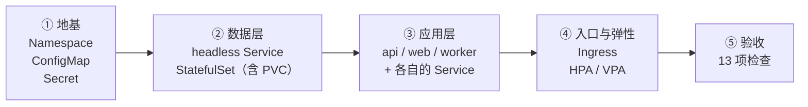

# 第 14 章　实战总演习：CloudNote 从 0 到 1

> **本章导读**
> - 建议用时：90 分钟（含 60 分钟动手）
> - 前置知识：第 1 ~ 13 章全部
> - 读完你应该能做到四件事：
>   1. **从空集群开始，按正确顺序把一套生产级应用部署起来**，并说清每一步为什么是这个顺序
>   2. 用一份**验收清单**确认"部署成功"不是"Pod 跑起来了"这么简单
>   3. **故意制造六类故障**，观察 K8s 在每一层的自愈表现与边界
>   4. 说清哪些故障它救不了，以及各自的应对手段

13 章讲完了，零件都齐了。**这一章把它们全装起来。**

但这一章的价值不在于"部署一遍"——而在于**故障演习**。因为：

> **一个没被打挂过的系统，不算跑过。**

---

## 【积木 14-1】部署的顺序原则：为什么不能一把梭

先讲一个看起来很简单、但会真正影响结果的问题：**这十几份 YAML 该按什么顺序 apply？**

**一条最朴素但最容易违反的原则**：

> **先地基，后负载；先下游，后上游。**

展开成四条：

| 原则 | 原因 | 违反的后果 |
|---|---|---|
| **① 命名空间最先** | 其它资源都要放进去 | 报 `namespaces "cloudnote" not found` |
| **② 配置与密钥先于使用它们的负载** | Pod 启动时就要读它们（`CreateContainerConfigError`） | Pod 卡在 `CreateContainerConfigError`（第 8 章） |
| **③ 数据层先于应用层** | `api` 启动时要连数据库 | `api` 反复崩溃（`CrashLoopBackOff`），即使它代码没错 |
| **④ 入口与弹性最后** | Ingress 要指向已存在的 Service；HPA 要指向已存在的 Deployment | Ingress `ADDRESS` 一直空；HPA 报 `unknown` |

**还有一个更隐蔽的顺序问题**：**PVC 和 Pod 谁先？**

```
如果先 apply Pod，Pod 会 Pending（等 PVC 绑定）
    ↓
但 volumeClaimTemplates 是由 StatefulSet 自己管的
    ↓
所以：StatefulSet 必须先创建，它才会「顺便」创建 PVC
```

**以及**：**如果用的是 `WaitForFirstConsumer` 的 StorageClass**（第 9 章，kind 的默认就是），**PVC 会一直 `Pending` 直到有 Pod 用到它**——这是设计，不是故障。

### 五个阶段



**每一阶段都要等上一阶段"就绪"再继续**——不是"apply 完就算"，而是**等 `kubectl rollout status` 或 PVC `Bound`**。

配套脚本已经把这五个阶段和等待逻辑都写好了：

```bash
bash cases/cloudnote/tools/capstone-lab.sh deploy
```

---

## 【积木 14-2】阶段一：地基（命名空间 + 配置 + 密钥）

```bash
kubectl apply -f cases/cloudnote/00-namespace.yaml
kubectl get ns cloudnote
```

**为什么命名空间必须最先**：其它所有资源都声明了 `namespace: cloudnote`，命名空间不存在时它们会被拒绝。

```bash
kubectl apply -f cases/cloudnote/10-config.yaml
kubectl get configmap,secret -n cloudnote
```

**这里有一个必须现在就检查的点**：**Secret 里的密码是明文 base64 的**（第 8 章）。

```bash
# 感受一下（教学用的假密码）
kubectl get secret api-secret -n cloudnote -o jsonpath='{.data.DB_PASSWORD}' | base64 -d; echo
```

**如果这是生产环境，你必须：**

| 检查项 | 生产做法 |
|---|---|
| Secret 从哪来 | **不能是提交进 Git 的 YAML**（Sealed Secrets / SOPS / External Secrets Operator） |
| etcd 落盘加密 | 配 `EncryptionConfiguration` |
| 谁能读 | RBAC 只给需要的人 `get secret`（第 15 章） |
| 轮转 | 有明确的轮转流程（Vault / 云 KMS） |

> **一个容易被跳过但很重要的动作**：**在部署一开始就确认"密钥的来源是安全的"。**等到上线前再改，成本是十倍。

---

## 【积木 14-3】阶段二：数据层（headless Service + StatefulSet）

```bash
kubectl apply -f cases/cloudnote/50-postgres.yaml

# 观察有序启动（第 13 章）
kubectl get pods -n cloudnote -l app=postgres -w
```

**预期看到**：`postgres-0` 就绪 → 才出现 `postgres-1` → 才出现 `postgres-2`。

**同时观察 PVC**：

```bash
kubectl get pvc -n cloudnote
# data-postgres-0   Bound   ...   10Gi
# data-postgres-1   Bound   ...   10Gi
# data-postgres-2   Bound   ...   10Gi
```

**如果 PVC 一直是 `Pending`**，别急着排查——先确认两件事：

```bash
# ① 有默认 StorageClass 吗
kubectl get storageclass
kubectl get sc -o jsonpath='{range .items[*]}{.metadata.name}{" default="}{.metadata.annotations.storageclass\.kubernetes\.io/is-default-class}{"\n"}{end}'

# ② StorageClass 的 volumeBindingMode 是什么
kubectl get sc -o custom-columns='NAME:.metadata.name,BINDING:.volumeBindingMode'
```

**如果 `BINDING` 是 `WaitForFirstConsumer`**（第 9 章），PVC 会等**第一个用到它的 Pod 被调度**才创建卷。而 StatefulSet 是按顺序创建 Pod 的——所以你会看到 **`postgres-0` 先起、它的 PVC 先 `Bound`，然后才是 1、2**。**这是设计，不是故障。**

> **这一步为什么必须在应用层之前**：如果先起 `api`，它会因为连不上数据库而崩溃重启（`CrashLoopBackOff`）。**代码完全正确也会崩**。这就是"先下游后上游"的意义。

---

## 【积木 14-4】阶段三：应用层（api / web / worker + Service）

```bash
kubectl apply -f cases/cloudnote/20-api-deployment.yaml
kubectl apply -f cases/cloudnote/22-api-service.yaml
kubectl apply -f cases/cloudnote/30-web.yaml
kubectl apply -f cases/cloudnote/35-worker.yaml

kubectl rollout status deployment/api -n cloudnote
kubectl rollout status deployment/web -n cloudnote
kubectl rollout status deployment/worker -n cloudnote
```

**三个关键检查**：

```bash
# ① Endpoints 有后端吗（第 6 章：这是排查 Service 问题的第一站）
kubectl get endpoints api web -n cloudnote

# ② DNS 能解析吗
kubectl run -it --rm dns-probe -n cloudnote --image=busybox:1.36 --restart=Never -- \
  nslookup api.cloudnote.svc.cluster.local

# ③ 真的能通吗
kubectl run -it --rm net-probe -n cloudnote --image=busybox:1.36 --restart=Never -- \
  wget -qO- http://api:8080 | head -3
```

**三层检查的顺序是有讲究的**（这也是第 15 章排错方法论的基础）：

```
Endpoints 有地址吗？      ← 没有 → Service 的 selector 或 Pod 的 Ready 有问题（不看网络）
  ↓ 有
DNS 解析对吗？           ← 不对 → CoreDNS 或命名空间/名字写错
  ↓ 对
TCP 能连上吗？           ← 连不上 → NetworkPolicy、端口、容器没监听
  ↓ 能
返回 200 吗？            ← 不能 → 应用自身的问题（看日志）
```

> **注意这里没有一步用 `ping`** —— 第 6 章讲过的：**ClusterIP 永远 ping 不通，它不是真实地址。**测 Service 一律用 TCP 工具。

---

## 【积木 14-5】阶段四：入口与弹性

```bash
kubectl apply -f cases/cloudnote/40-ingress.yaml
kubectl get ingress -n cloudnote
```

**检查 `ADDRESS` 那一列**（第 7 章）：

- 有地址 → 控制器接手了
- `<none>` → 没装 Ingress Controller，或者类名不匹配

**然后配弹性**：

```bash
# 前提：先装 metrics-server（第 12 章）
kubectl apply -f cases/cloudnote/60-hpa.yaml
kubectl get hpa,vpa -n cloudnote
```

**看 `TARGETS` 列**：

- `api` 应该显示真实数值（如 `2%/50%`）
- `worker` 会显示 `<unknown>` —— **这是预期行为**（它用的是 External 指标，需要 adapter）

> **这就是一个真实的运维状态**：**不是所有配置一开始就"全绿"。**`worker` 的 HPA 会一直是 `<unknown>`，直到你部署了指标 adapter。**你要能分辨"配置缺失"和"配置错误"。**

---

## 【积木 14-6】阶段五：验收清单（13 项）

**"部署成功"不等于"Pod 都在 Running"。**以下是真正的验收标准：

| # | 检查项 | 命令 | 期望结果 |
|---|---|---|---|
| 1 | 所有 Pod 就绪 | `kubectl get pods -n cloudnote` | 全部 `Running` 且 `READY` 分子=分母 |
| 2 | 无异常重启 | 同上 | `RESTARTS` **全是 0** |
| 3 | 无 Pending | 同上 | 没有 `Pending` |
| 4 | 所有 Service 有后端 | `kubectl get endpoints -n cloudnote` | **没有一个 `<none>`** |
| 5 | PVC 全部 Bound | `kubectl get pvc -n cloudnote` | 全部 `Bound` |
| 6 | 应用副本打散 | `kubectl get pods -l app=api -o custom-columns=NODE:.spec.nodeName` | **不同节点**（节点数够的话） |
| 7 | 探针就位 | `kubectl get deploy api -o jsonpath='{.spec.template.spec.containers[0].readinessProbe}'` | 有输出 |
| 8 | 资源已声明 | 同上取 `.resources` | requests / limits 都有 |
| 9 | QoS 等级合理 | `kubectl get pod <api-pod> -o jsonpath='{.status.qosClass}'` | `Burstable` 或 `Guaranteed`（**不是 BestEffort**） |
| 10 | HPA 有指标 | `kubectl get hpa` | `TARGETS` 不是 `<unknown>` |
| 11 | Ingress 有地址 | `kubectl get ingress -n cloudnote` | `ADDRESS` 非空 |
| 12 | 内部访问通 | 探针 Pod 里 `wget http://api:8080` | 返回 200 |
| 13 | 无异常事件 | `kubectl get events -n cloudnote --sort-by=.lastTimestamp \| tail -20` | **没有 `Warning`** |

**第 13 项特别值得单独看**：

```bash
kubectl get events -n cloudnote --sort-by=.lastTimestamp | grep -E "Warning|Error" | tail -20
```

**空输出 = 干净。**有 `Warning` 就去查——**事件是 K8s 最直接的"系统在抱怨什么"的地方**，而且**默认只保留 1 小时**（所以要在部署完立刻看）。

一键跑完这 13 项：

```bash
bash cases/cloudnote/tools/capstone-lab.sh verify
```

---

## 【积木 14-7】故障演习一：删掉主库 Pod，数据会丢吗？

**这是最该亲手做的一次演习。**

```bash
# ① 先往数据库里写一条数据
kubectl exec -it postgres-0 -n cloudnote -- \
  psql -U cloudnote -d cloudnote -c "CREATE TABLE IF NOT EXISTS t(id int, note text); INSERT INTO t VALUES (1,'这条数据很重要');"

# ② 确认数据在
kubectl exec -it postgres-0 -n cloudnote -- \
  psql -U cloudnote -d cloudnote -c "SELECT * FROM t;"

# ③ 记住它挂的是哪个 PVC
kubectl get pod postgres-0 -n cloudnote -o jsonpath='{.spec.volumes[0].persistentVolumeClaim.claimName}{"\n"}'
# data-postgres-0

# ④ 删掉它
kubectl delete pod postgres-0 -n cloudnote

# ⑤ 等它回来
kubectl get pods -n cloudnote -l app=postgres -w

# ⑥ 再查数据
kubectl exec -it postgres-0 -n cloudnote -- \
  psql -U cloudnote -d cloudnote -c "SELECT * FROM t;"
```

**预期结果**：

| 观察项 | 结果 |
|---|---|
| Pod 名字 | **还是 `postgres-0`**（第 13 章：稳定身份） |
| 挂的 PVC | **还是 `data-postgres-0`**（稳定存储） |
| **数据** | **还在！** ✅ |

**对比一下如果用 Deployment 会怎样**：Pod 名变了、PVC 是共享的、多副本会互相覆盖——**所以第 13 章说"Deployment 不能管数据库"。**

> **但注意这里有一个陷阱**：**这个演习成功，不代表你的数据库"高可用"了。**
>
> 它只证明了**数据没丢**（PVC 的作用）。而"主库挂了，从库能不能被提升为主"——**StatefulSet 完全不管这件事**（第 13 章）。**那需要 Operator 或者你手写的自动化。**

---

## 【积木 14-8】故障演习二：发一个坏版本，然后回滚

```bash
# ① 记下当前版本
kubectl get deploy api -n cloudnote -o jsonpath='{.spec.template.spec.containers[0].image}{"\n"}'
kubectl rollout history deployment/api -n cloudnote

# ② 发一个坏版本（用一个不存在的 tag）
kubectl set image deployment/api -n cloudnote api=nginx:1.27-does-not-exist

# ③ 观察：新 Pod 起不来，但旧副本一个都没少（第 5 章的 maxUnavailable: 0 在保护你）
kubectl get pods -n cloudnote -l app=api
kubectl get deploy api -n cloudnote        # READY 应该还是 2/2

# ④ 服务还通吗？（这是最关键的一问）
kubectl run -it --rm net-probe -n cloudnote --image=busybox:1.36 --restart=Never -- \
  wget -qO- http://api:8080 | head -3

# ⑤ 看"我卡住了"的标记
kubectl describe deploy api -n cloudnote | sed -n '/Conditions/,$p'

# ⑥ 回滚（秒级，第 5 章）
kubectl rollout undo deployment/api -n cloudnote
kubectl rollout status deployment/api -n cloudnote
```

**这一组演习对应的知识点**（全是第 5 章的）：

| 观察 | 对应知识 |
|---|---|
| 新 Pod `ImagePullBackOff`，旧 Pod 一个没少 | **`maxUnavailable: 0` 是安全气囊** |
| `READY` 一直是 `2/2`，服务不受影响 | **发布失败损失的是时间，不是可用性** |
| `ProgressDeadlineExceeded` | **不会自动回滚**（需要手动 `undo`） |
| `rollout undo` 秒级完成 | **旧 ReplicaSet 一直存在，回滚只是改两个数字** |

---

## 【积木 14-9】故障演习三：一个探针配置，让全站不可用

**这是第 11 章那个事故的实操版，也是"最容易自己制造的全站故障"。**

```bash
# ① 把 liveness 探针指向一个依赖检查的路径（模拟"探针查了数据库"）
kubectl patch deployment/api -n cloudnote --type=json -p='[
  {"op":"replace","path":"/spec/template/spec/containers/0/livenessProbe/httpGet/path","value":"/does-not-exist"}
]'

# ② 盯住 Pod（注意 RESTARTS 会长，且是【全部副本一起】）
kubectl get pods -n cloudnote -l app=api -w
```

**你会看到**：

```
api-xxx-1   0/1   Running   0
api-xxx-1   0/1   Running   1        ← liveness 失败，容器被杀重启
api-xxx-2   0/1   Running   1        ← 【另一个副本也同时被杀】
api-xxx-1   0/1   CrashLoopBackOff   ← 重启后探针还是失败，进入退避
api-xxx-2   0/1   CrashLoopBackOff
```

**关键观察**：**两个副本"同时"失败、同时重启**——因为 liveness 检查的是同一件事，而它跟外部依赖相关时，**会让所有副本同时不可用**。

```bash
# ③ 服务真的挂了吗
kubectl get endpoints api -n cloudnote
# ENDPOINTS: <none>     ← 全摘了

kubectl run -it --rm net-probe -n cloudnote --image=busybox:1.36 --restart=Never -- \
  wget -qO- --timeout=3 http://api:8080
# 连接失败
```

**④ 恢复**：

```bash
kubectl patch deployment/api -n cloudnote --type=json -p='[
  {"op":"replace","path":"/spec/template/spec/containers/0/livenessProbe/httpGet/path","value":"/"}
]'
kubectl rollout status deployment/api -n cloudnote
```

**这次演习的全部教训**（第 11 章）：

> **`liveness` 探针只能反映"我自己还能不能干活"，绝不能反映"我的依赖是否健康"。**
>
> 因为它的失败判定虽是每副本独立的，但检查的是**同一个共享依赖** → **会同时失败、同时被杀** → 效果上等于"一次全量重启"。

---

## 【积木 14-10】故障演习四：节点故障与污点驱逐

```bash
# ① 选一个节点
NODE=$(kubectl get nodes -o jsonpath='{.items[*].metadata.name}' | tr ' ' '\n' | grep -v control-plane | head -1)
echo "选中：$NODE"

# ② 看它上面跑着什么
kubectl get pods -A -o wide --field-selector spec.nodeName=$NODE | grep -v kube-system

# ③ 模拟节点"不再接收新 Pod"（NoSchedule）
kubectl taint nodes "$NODE" maintenance=true:NoSchedule

# ④ 现在滚动更新一次 api，观察新 Pod 会避开这个节点
kubectl rollout restart deployment/api -n cloudnote
kubectl get pods -n cloudnote -l app=api -o custom-columns='POD:.metadata.name,NODE:.spec.nodeName'
```

**观察**：新 Pod 被调度到**没有污点**的节点上，**原来的 Pod 还在污点节点上跑**（`NoSchedule` 不驱逐已运行的 Pod）。

**如果改成 `NoExecute`**（第 10 章）：

```bash
kubectl taint nodes "$NODE" maintenance=true:NoExecute
sleep 40
kubectl get pods -n cloudnote -l app=api -o custom-columns='POD:.metadata.name,NODE:.spec.nodeName,STATUS:.status.phase'
```

**这次原来的 Pod 会被驱逐**，并在别的节点重建。

> **`NoSchedule` 和 `NoExecute` 的区别，就是这个演习的全部价值**：
>
> | effect | 已运行的 Pod |
> |---|---|
> | `NoSchedule` | **留着不动** |
> | `NoExecute` | **驱逐** |
>
> **维护窗口用 `NoSchedule`（不影响在跑的业务），节点故障 / 下线用 `NoExecute`。**

**收尾（一定要做，否则影响后续实验）**：

```bash
kubectl taint nodes "$NODE" maintenance=true:NoExecute-
kubectl taint nodes "$NODE" maintenance=true:NoSchedule-
```

---

## 【积木 14-11】故障演习五：把流量打满，看它扩不上去

```bash
# ① 打流量
kubectl run load-gen -n cloudnote --image=busybox:1.36 --restart=Never \
  --command -- sh -c 'while true; do wget -q -O- http://api:8080 >/dev/null 2>&1; done'

# ② 盯住 HPA 和 Pod
kubectl get hpa api -n cloudnote -w
kubectl get pods -n cloudnote -l app=api -w
```

**可能出现的两种结局**：

| 结局 | 说明 | 对应知识 |
|---|---|---|
| **副本数上涨，全部 Running** | 集群资源够 | 弹性正常工作 |
| **副本数上涨，但有 Pod `Pending`** | **HPA 要的数量，节点装不下** | **第 12 章：HPA 不管节点够不够** |

**如果是第二种**：

```bash
# 看它为什么 Pending
P=$(kubectl get pods -n cloudnote -l app=api --no-headers | grep Pending | head -1 | awk '{print $1}')
kubectl describe pod "$P" -n cloudnote | sed -n '/Events/,$p'
# 预期：Insufficient cpu / Insufficient memory
```

**这就是"两个层次的伸缩没接上"**：

> **HPA 说"要 8 个"，但集群只有 2 个节点，装不下第 3 个。**
>
> **HPA 完全不管节点够不够** —— 那是 Cluster Autoscaler 的活（第 12 章）。本地集群没有 CA，所以 Pod 就永远 Pending。

**收尾**：

```bash
kubectl delete pod load-gen -n cloudnote
```

---

## 【积木 14-12】故障演习六：K8s 救不了的那些故障

**这一节是整门课最重要的一次"祛魅"。**前五个演习都在展示 K8s 的自愈能力，这一个展示它的边界。

**故意制造三类它救不了的故障**：

### 类型一：配置错误（会一直崩溃，永远不会自己好）

```bash
# 把数据库地址改错
kubectl set env deployment/api -n cloudnote DB_HOST=postgres-wrong-host

sleep 60
kubectl get pods -n cloudnote -l app=api
# CrashLoopBackOff，RESTARTS 一直涨
kubectl logs -n cloudnote -l app=api --tail=10
```

**观察**：**它会永远重启下去**，因为"重启"解决不了"配置错"。

**恢复**：

```bash
kubectl set env deployment/api -n cloudnote DB_HOST-
```

> **这就是第 11 章那句"K8s 修的是进程和容器的存在性，不是业务的正确性"的实证。**

### 类型二：让 Pod 直接挂掉业务逻辑（它会忠实地重启一个坏东西）

```bash
# 用一个"能启动但不干活"的配置（返回 500）
# 这里用探针模拟：探针通过，但业务失败
kubectl exec -it deploy/api -n cloudnote -- sh -c 'echo "模拟业务故障" > /tmp/broken'

# 观察：Pod 一切正常！Ready、Running、RESTARTS=0
kubectl get pods -n cloudnote -l app=api
```

**K8s 的视角**：进程活着、探针通过 → **"这个 Pod 很健康"**。

**用户的视角**：接口全返回错误。

> **这就是"就差一个业务指标监控"的经典场景。**探针只能证明"我还能响应 HTTP"，**它证明不了"我返回的结果是对的"**。
>
> **所以你需要**（第 15 章会展开）：**业务指标监控 + 告警**，而不是只依赖 K8s 的探针。

```bash
kubectl exec -it deploy/api -n cloudnote -- sh -c 'rm -f /tmp/broken'
```

### 类型三：数据误删（PVC 防不住人为操作）

```bash
# 让数据库里的表被误删
kubectl exec -it postgres-0 -n cloudnote -- \
  psql -U cloudnote -d cloudnote -c "DROP TABLE t;"

kubectl exec -it postgres-0 -n cloudnote -- \
  psql -U cloudnote -d cloudnote -c "SELECT * FROM t;"
# ERROR: relation "t" does not exist
```

**K8s 的反应**：**毫无反应。**数据库 Pod 依然健康、Running、Ready。

> **PVC 让数据在 Pod 重建、节点故障时活下来，但它完全防不住"人为误删"**（第 9 章红线二）。
>
> **唯一能救你的是：独立于 K8s 存储体系的备份，而且必须是验证过能恢复的备份。**

### 三类故障的总结

| 故障类型 | K8s 的反应 | 谁能救你 |
|---|---|---|
| **配置错误** | 忠实重启（`CrashLoopBackOff`） | **CI 校验 / 配置中心的 schema 校验 / 灰度发布** |
| **业务逻辑故障** | **认为一切正常** | **业务指标监控 + 告警** |
| **数据误删** | **毫无反应** | **独立备份（并定期演练恢复）** |
| 依赖服务故障 | 探针摘流量 | **依赖方恢复 + 降级策略** |
| 流量过载 | HPA 尽力扩 | **限流 / 熔断 / 预留容量** |
| 代码 bug | 忠实运行 | **测试 + 灰度 + 快速回滚** |

**一句话**：

> **K8s 让"运维的机械部分"自动化了，但它一点也不会替你做"判断"。**
>
> 判断配置对不对、业务是否正常、数据是否安全——**这些永远是人的责任。**

---

## 【积木 14-13】一键部署与一键清理

配套脚本把上面所有阶段和演习都封装好了：

```bash
# 按五个阶段部署 CloudNote（每阶段都等就绪）
bash cases/cloudnote/tools/capstone-lab.sh deploy

# 跑 13 项验收检查
bash cases/cloudnote/tools/capstone-lab.sh verify

# 跑全部六个故障演习（会二次确认）
bash cases/cloudnote/tools/capstone-lab.sh fault

# 只跑某一个演习（1~6）
bash cases/cloudnote/tools/capstone-lab.sh fault 3

# 全部清理
bash cases/cloudnote/tools/capstone-lab.sh cleanup
```

### 用 Kustomize 一次性部署（可选）

如果只是想要"一条命令装起来"，`cases/cloudnote/kustomization.yaml` 已经准备好了：

```bash
kubectl apply -k cases/cloudnote/
```

**但要注意**：

| Kustomize 帮你做的 | 它不能帮你做的 |
|---|---|
| 一次性聚合所有清单 | **保证应用层的启动顺序**（它是一次性提交的） |
| 统一加标签、前缀、命名空间 | **等待就绪**（不会等 `postgres` 好了再起 `api`） |

**所以**：**`kubectl apply -k` 适合"快速重建一个一模一样的环境"，但"理解部署顺序"还是要按阶段来一遍。**

> **`kubectl apply -k` 之后如果 `api` 在 `CrashLoopBackOff`** —— 别慌，等 1~2 分钟。因为它可能先于 `postgres` 起来了，连不上数据库就崩溃；**等 `postgres` 就绪后，它会自己恢复**（第 4 章的调和循环 + `backoffLimit` 式的重试）。
>
> **这也是一个知识点**：**有依赖关系的应用，靠"崩溃-重试"最终也能收敛，但体验很差**（日志刷屏、启动慢）。**这正是"init 容器等依赖"（第 2 章）存在的意义。**

---

## 【本章小结】

### 四句话总结

1. **部署顺序的四条原则**：命名空间最先 → 配置先于使用者 → 数据层先于应用层 → 入口与弹性最后。**违反它们不会报错，只会让你看到一堆"看起来莫名其妙"的 `CrashLoopBackOff`。**
2. **"部署成功"不等于"Pod 在 Running"**：13 项验收清单里，`RESTARTS` 必须为 0、`Endpoints` 不能有空、`QoS` 不能是 `BestEffort`、**事件里不能有 `Warning`**。
3. **六个故障演习演示了 K8s 自愈的完整光谱**：容器重启、Pod 重建、探针摘流量、发布回滚、节点驱逐、弹性扩容——**每一层都有它的职责与边界**。
4. **最该记住的是第六个演习**：**K8s 修的是"进程和容器的存在性"，不是"业务的正确性"。**配置错误、业务逻辑故障、数据误删——**它全都救不了，甚至可能毫无反应。**

### 一张图收尾

```
【五个部署阶段】                  【六个故障演习】         K8s 能救吗
① 地基（ns/config/secret）        ① 删主库 Pod            ✅ 数据不丢
② 数据层（STS + headless）        ② 坏版本发布            ✅ 秒级回滚
③ 应用层（api/web/worker）        ③ 探针配错              ⚠️ 能救但会全站抖一下
④ 入口与弹性（Ingress/HPA）       ④ 节点故障/污点          ✅ 驱逐重建（分钟级）
⑤ 验收 13 项                      ⑤ 流量打满              ⚠️ 扩不出来会 Pending
                                  ⑥ 配置错/业务错/数据误删  ❌ 全都救不了
```

### 自测题

1. 部署顺序的四条原则分别是什么？违反"数据层先于应用层"会看到什么现象？（积木 14-1）
2. 为什么 PVC 可能一直 `Pending`？这是故障吗？（积木 14-3）
3. 排查"Service 连不通"的三层顺序是什么？为什么每一步的顺序不能颠倒？（积木 14-4）
4. 13 项验收清单里，哪三项最容易被忽略？（积木 14-6）
5. **删掉 `postgres-0`，数据会丢吗？为什么？**（积木 14-7）
6. "删 Pod 数据没丢"证明了高可用吗？它还缺什么？（积木 14-7）
7. 发一个坏版本后，为什么服务还能正常？（积木 14-8）
8. `ProgressDeadlineExceeded` 出现后会怎样？为什么这是"最容易踩的坑"？（积木 14-8）
9. **为什么一个 liveness 探针配错会让"全部副本同时不可用"？**（积木 14-9）
10. `NoSchedule` 和 `NoExecute` 对已运行的 Pod 有什么不同？（积木 14-10）
11. "HPA 扩了但 Pod 一直 Pending" 说明什么？（积木 14-11）
12. **K8s 救不了哪三类故障？各自该用什么手段应对？**（积木 14-12）
13. 为什么"Pod 一切正常（Ready、RESTARTS=0）"不代表业务正常？（积木 14-12）
14. `kubectl apply -k` 和"按阶段 apply"各适合什么场景？它不能帮你做什么？（积木 14-13）

### 下一章预告

**第 15 章：生产实践与排错手册**

第 14 章我们把它跑起来又打挂了一遍。最后一章要把这些经验**固化成可复用的东西**：

> **一份"症状 → 命令 → 根因"的排查对照表**（覆盖 20 多种 Pod 异常状态）
>
> **一份上线前检查清单**（40 项可勾选）
>
> 还有生产上真正要紧的那些话题：RBAC 与最小权限、NetworkPolicy、可观测性该监控哪些指标、etcd 备份怎么验证、集群升级怎么做、以及**多环境怎么管**。

---

*学完本章，回到对话里说一句「继续」，我就开讲第 15 章。*
