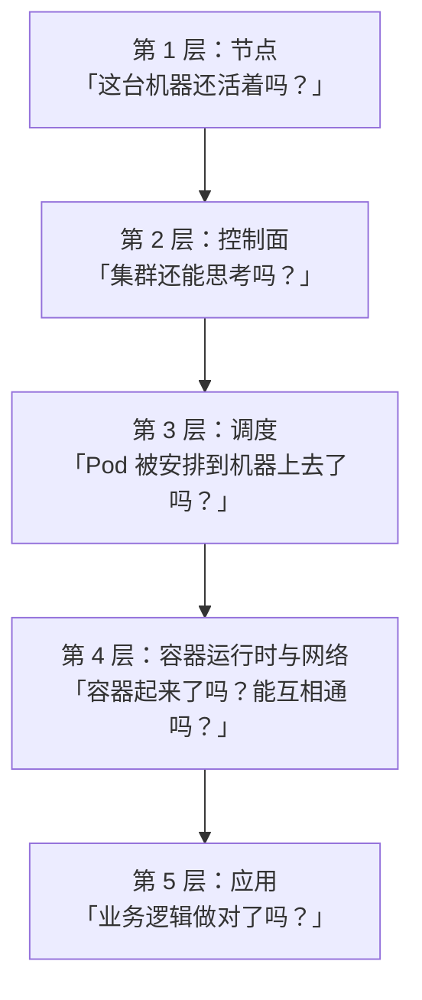

# 第 15 章　生产实践与排错手册

前 14 章把 Kubernetes 从原理讲到实战。本章做三件事：

1. **把排错经验固化成可查的表**（不是靠记忆）
2. **补上前 14 章刻意简化的生产话题**（权限、网络策略、可观测性、备份）
3. **给一份能直接用的上线检查清单**

---

### 15.1 排错方法论：分层收敛，不要跳步

新手排错的典型方式是**"猜 + 乱试"**：

```
"服务不通了" → 重启 Pod → 还是不通 → 重启节点 → 还是不通
    → 怀疑网络 → 改 CNI 配置 → 【问题扩大】
```

**有效的排错是"分层收敛"**：

> **从最外层（现象）开始，逐层向内确认，每一层只问一个问题，直到定位到出问题的那一层。**

**为什么必须分层？**因为**每一层的"健康标准"不同**，跳层会让你对着正常的东西排查半天。

#### 五层模型



| 层 | 检查什么 | 命令 | 出问题的典型症状 |
|---|---|---|---|
| **1. 节点** | 节点是否 `Ready` | `kubectl get nodes` | 节点 `NotReady` → **所有层都可能受影响** |
| **2. 控制面** | API Server / etcd 是否正常 | `kubectl get --raw /readyz?verbose` | `kubectl` 命令超时、所有对象都改不动 |
| **3. 调度** | Pod 有没有被分到节点 | `kubectl get pod -o wide`（看 `NODE` 列） | `Pending`、`FailedScheduling` 事件 |
| **4. 运行时/网络** | 容器是否启动、能否互通 | `kubectl describe pod` / `logs` | `ImagePullBackOff`、`CrashLoopBackOff`、`Endpoints` 为空 |
| **5. 应用** | 业务逻辑对不对 | 业务日志、业务指标、实际请求 | **Pod 全绿但接口报错** |

**第 5 层是最容易被忽略的一层。**因为前四层全绿时，你会以为"集群没问题"——**而集群确实没问题，是有问题的应用在健康地运行**（第 14 章演习六）。

#### 一条排查的"黄金路径"

**遇到任何问题，先按这个顺序敲三条命令**：

```bash
# ① 现象：现在是什么状态？
kubectl get pods -n <ns> -o wide

# ② 原因：K8s 在抱怨什么？
kubectl describe pod <pod> -n <ns> | sed -n '/Events/,$p'

# ③ 应用说什么？
kubectl logs <pod> -n <ns> --tail=50
# 崩溃过的用 --previous 看上一次的现场（第 11 章）
kubectl logs <pod> -n <ns> --previous
```

**这三条能解决 80% 的问题。**剩下 20% 才需要更深入的排查。

---

### 15.2 症状对照表（Pod 异常状态）

**这一节是本章最该收藏的部分。**

#### 状态类症状

| 状态 | 含义 | 先查什么 | 常见根因 |
|---|---|---|---|
| **`Pending`** | 还没被调度到节点 | `describe pod` 的 **Events** | ① 资源不足（`Insufficient cpu/memory`）② 节点亲和性/污点不满足 ③ PVC 没绑定 ④ 没有可用节点 |
| **`ContainerCreating`（长时间）** | 正在准备容器 | `describe pod` 的 Events | ① 正在拉镜像（大镜像）② **挂载卷失败**（`volume node affinity conflict`）③ CNI 分配 IP 失败 |
| **`ImagePullBackOff` / `ErrImagePull`** | 拉不到镜像 | `describe pod` | ① 镜像名/tag 拼错 ② 私有仓库缺 `imagePullSecrets`（`401`）③ 网络不通 ④ 仓库限流 |
| **`CrashLoopBackOff`** | 容器反复崩溃，正在退避 | **`logs --previous`** | ① 应用启动失败（配置错、依赖连不上）② **探针配得比启动还急**（第 11 章）③ 命令写错 |
| **`OOMKilled`** | 内存超 `limits` 被杀 | `describe pod` / `lastState` | ① `limits.memory` 太小 ② **JVM 未做容器感知**（第 10 章）③ 内存泄漏 |
| **`Evicted`** | 被 kubelet 驱逐 | `describe pod` 的 `reason` | ① 节点内存/磁盘压力 ② `BestEffort` QoS 首当其冲（第 10 章） |
| **`Completed`** | 正常结束（Job 的 Pod） | — | **正常**，但记得用 `ttlSecondsAfterFinished` 清理 |
| **`Terminating`（卡住）** | 删除时卡住 | `describe pod` 的 `deletionGracePeriodSeconds` / `finalizers` | ① 有 finalizer 没被处理 ② 应用不响应 SIGTERM 且宽限期很长 ③ kubelet 失联 |
| **`Unknown`** | 拿不到状态 | `kubectl get nodes` | **节点失联**（第 3 章） |
| **`Running` 但 `READY 0/1`** | 容器跑了但探针不过 | `describe pod` 看探针失败原因 | ① `readinessProbe` 路径/端口错 ② 应用真没准备好 ③ `initialDelaySeconds` 太短 |
| **`Running` 但 `RESTARTS` 一直涨** | 在"启动-崩溃"循环里但还没到退避 | `logs --previous` | 同 `CrashLoopBackOff` |

#### 事件类症状（`kubectl describe` / `get events` 里的关键字）

| 事件关键字 | 含义 | 对应章节 |
|---|---|---|
| `FailedScheduling ... Insufficient cpu` | 没有任何节点装得下 | 第 3 / 10 章 |
| `FailedScheduling ... node(s) had untolerated taint` | 污点没被容忍 | 第 10 章 |
| `FailedScheduling ... didn't match node selector` | 亲和性不满足 | 第 10 章 |
| `FailedScheduling ... volume node affinity conflict` | **卷在 A 可用区，Pod 被调度到 B** | 第 9 章（改 `WaitForFirstConsumer`） |
| `Liveness probe failed` | 存活探针失败 | 第 11 章 |
| `Readiness probe failed` | 就绪探针失败（只摘流量） | 第 11 章 |
| `OOMKilling` | 内存超限被杀 | 第 10 章 |
| `Unhealthy` | 探针失败 | 第 11 章 |
| `BackOff restarting failed container` | 容器反复重启 | 第 11 章 |
| `FailedMount` / `FailedAttachVolume` | 卷挂载失败 | 第 9 章 |
| `FailedCreatePodSandBox` | CNI 分配网络失败 | 第 3 / 6 章 |
| `Evicted` / `The node was low on resource` | 节点压力驱逐 | 第 10 章 |
| `Error: ErrImagePull` | 拉镜像失败 | 第 8 章 |

#### "服务不通"专用对照表（第 6 章那一套的扩展）

| 现象 | 先查 | 常见根因 |
|---|---|---|
| `Endpoints` 是 `<none>` | `kubectl get endpoints <svc>` | ① **selector 与 Pod 标签不一致**（最高频）② Pod 全都没 Ready ③ Service 和 Pod 不在同一命名空间 |
| `Endpoints` 有地址但连不上 | `nc -zv <svc> <port>` | ① `targetPort` 写错 ② 容器没监听那个端口 ③ NetworkPolicy 拦了 |
| DNS 解析不了 | 进 Pod `nslookup <svc>` | ① 名字/命名空间写错 ② CoreDNS 有问题 ③ `dnsPolicy` 被改过 |
| 解析到 IP 但连不上 | `nslookup` 对比 `get endpoints` | **ClusterIP 只是规则，不是地址** → 检查 kube-proxy / iptables 规则（第 6 章） |
| 集群外访问不到 | `kubectl get svc` 看 `TYPE` | ① `ClusterIP` 类型当然访问不到 ② NodePort 端口范围 ③ Ingress 没装 Controller |
| **`ping` 不通** | — | **正常！ClusterIP 永远 ping 不通，用 `nc` / `curl` 测**（第 6 章） |

---

### 15.3 十个高频命令与它们的"适用场景"

`kubectl` 命令很多，但**真正高频的就是这十个**。关键在于**知道每个命令"回答什么问题"**。

| # | 命令 | 回答什么问题 | 什么时候用 |
|---|---|---|---|
| 1 | `kubectl get pods -o wide` | **现在什么状态、在哪台机器** | **永远的第一步** |
| 2 | `kubectl describe pod` | **K8s 在抱怨什么** | 状态异常时 |
| 3 | `kubectl logs [--previous] [--tail]` | **应用说什么** | 崩溃、行为异常 |
| 4 | `kubectl get events --sort-by=.lastTimestamp` | **最近发生了什么** | 大范围异常时 |
| 5 | `kubectl get endpoints` | **Service 找到后端了吗** | 一切"不通"问题 |
| 6 | `kubectl exec -it -- sh` | **容器内部长什么样** | 验证配置、网络、文件 |
| 7 | `kubectl get <obj> -o yaml` | **对象的完整定义**（含 `status`） | 想看系统补了什么、status 什么情况 |
| 8 | `kubectl describe node` | **节点的资源分配情况** | 调度失败、资源不足 |
| 9 | `kubectl top pod/node` | **实际用量的当前快照** | 资源问题、扩容问题 |
| 10 | `kubectl debug` | **给 Pod 插一个调试容器** | 镜像里没有 shell / 工具时 |

#### 几个"进阶但极有用"的

| 命令 | 用途 |
|---|---|
| `kubectl get pod -o jsonpath='{.status.containerStatuses[0].lastState.terminated}'` | 看**上一次退出的原因和退出码**（OOMKilled 就在这） |
| `kubectl get pod -o jsonpath='{.status.qosClass}'` | 看 QoS 等级（第 10 章） |
| `kubectl get deploy -o jsonpath='{.spec.strategy}'` | 看发布策略 |
| `kubectl rollout history / status / undo` | 发布相关（第 5 章） |
| `kubectl explain deploy.spec.strategy` | **不记得字段写什么时，直接查**（比搜文档快） |
| `kubectl api-resources` | 这个集群支持哪些资源类型 |
| `kubectl auth can-i --list -n <ns>` | **我能做什么**（排查权限问题） |
| `kubectl get --raw /readyz?verbose` | 控制面各组件健康检查 |

**`kubectl explain` 是最高效的"文档"**。比如忘了 `topologySpreadConstraints` 有哪些字段：

```bash
kubectl explain pod.spec.topologySpreadConstraints
```

**它来自你集群实际支持的 API 版本**，比网上搜到的文章更准确。

#### 一键诊断脚本

配套脚本把最常见的检查都打包了：

```bash
bash cases/cloudnote/tools/diagnose.sh
```

它会依次检查：节点健康、控制面健康、Pod 状态汇总、异常事件、Endpoints 完整性、PVC 绑定、资源用量、HPA 状态、探针配置——**输出一份"体检报告"**。

---

### 15.4 必须补上的四块：权限、网络策略、可观测性、备份

前 14 章为了聚焦原理，刻意简化了这四块。**但它们在生产上是"不做就不敢上线"的**。

#### ① RBAC 与最小权限

**核心思想**：**任何组件（包括你的应用）只应拥有它真正需要的权限，不多一分。**

```yaml
# 一个「只能读自己命名空间的 Pod 和 ConfigMap」的角色
apiVersion: rbac.authorization.k8s.io/v1
kind: Role
metadata:
  name: app-reader
  namespace: cloudnote
rules:
  - apiGroups: [""]
    resources: ["pods", "configmaps"]
    verbs: ["get", "list", "watch"]        # ← 没有 create / delete / update
---
apiVersion: rbac.authorization.k8s.io/v1
kind: RoleBinding
metadata:
  name: app-reader-binding
  namespace: cloudnote
subjects:
  - kind: ServiceAccount
    name: api-sa
    namespace: cloudnote
roleRef:
  kind: Role
  name: app-reader
  apiGroup: rbac.authorization.k8s.io
```

| 对象 | 作用域 | 说明 |
|---|---|---|
| `Role` / `RoleBinding` | **命名空间级** | 最常用，隔离性好 |
| `ClusterRole` / `ClusterRoleBinding` | **集群级** | 用于节点、PV、命名空间等集群级资源 |

**三条必须遵守的纪律**：

| 纪律 | 为什么 |
|---|---|
| **不给应用 `cluster-admin`** | 一个被攻破的 Pod 就等于整个集群失守 |
| **不用 `default` ServiceAccount** | 它可能被赋予了额外权限；每个应用建自己的 SA |
| **不需要 API 访问的就关掉 token 挂载** | 见下 |

```yaml
spec:
  automountServiceAccountToken: false     # 不需要访问 API 的应用，直接关掉
  serviceAccountName: api-sa
```

**顺带一个 1.24 之后的重大变化**：**ServiceAccount 不再自动创建长期的 Secret Token**。现在默认用 **TokenRequest API**（投影卷，有有效期、可绑定对象、自动轮转）。**这是安全上的巨大改进**——如果你还在依赖 `kubectl get secret <sa>-token-xxx`，那个 Secret 已经不存在了。

#### ② NetworkPolicy：默认拒绝，按需放行

**K8s 默认是"所有 Pod 可以互相访问"**——扁平网络。这在多租户或合规场景下是不够的。

```yaml
# 给命名空间里的所有 Pod 设「默认拒绝所有入站」
apiVersion: networking.k8s.io/v1
kind: NetworkPolicy
metadata:
  name: default-deny-ingress
  namespace: cloudnote
spec:
  podSelector: {}              # ← 选中所有 Pod
  policyTypes:
    - Ingress
  # 没有任何 ingress 规则 = 谁都不许进
---
# 然后按需放行：只允许 web 访问 api 的 8080
apiVersion: networking.k8s.io/v1
kind: NetworkPolicy
metadata:
  name: api-allow-from-web
  namespace: cloudnote
spec:
  podSelector:
    matchLabels:
      app: api
  policyTypes:
    - Ingress
  ingress:
    - from:
        - podSelector:
            matchLabels:
              app: web
      ports:
        - protocol: TCP
          port: 8080
```

**"默认拒绝 + 按需放行"是标准做法**：

```
① 先加一条 default-deny（什么流量都不许）
② 观察：哪些服务开始不通
③ 逐条加放行规则，直到一切正常
```

**这比"默认允许 + 逐条封禁"安全得多**——因为后者你永远不知道漏了什么。

 **一个必须知道的前提**：**NetworkPolicy 需要 CNI 插件支持才会生效。**

| CNI | 是否执行 NetworkPolicy |
|---|---|
| **Calico / Cilium** |  支持 |
| Flannel |  **不支持**（策略会被创建但无效果） |
| kind 默认的 kindnet |  不支持 |

**最坑的地方是"它不报错"**：你 apply 了 NetworkPolicy、`kubectl get netpol` 看着正常、**但流量照样全通**。所以施加策略前先确认 CNI 支持。

#### ③ Pod Security Admission（PSA）

**替代了已移除的 PodSecurityPolicy**（1.25 移除）。**它是命名空间级别的标签**：

```yaml
apiVersion: v1
kind: Namespace
metadata:
  name: cloudnote
  labels:
    # 三档：privileged / baseline / restricted
    pod-security.kubernetes.io/enforce: baseline
    pod-security.kubernetes.io/enforce-version: latest
    pod-security.kubernetes.io/audit: restricted      # 只审计不阻断
    pod-security.kubernetes.io/warn: restricted       # 只警告不阻断
```

| 档位 | 限制 |
|---|---|
| `privileged` | 不限制（系统组件用） |
| **`baseline`** | 禁止特权容器、禁止 hostNetwork/hostPID、限制 hostPath 等 |
| **`restricted`** | 在 baseline 之上还要求：**非 root 运行、禁止提权、drop 所有 capability、只读根文件系统** |

**推荐的落地路径**：

```
① 先只开 audit + warn（观察有哪些 Pod 不合规，但不阻断）
② 逐个修应用（加 securityContext）
③ 确认无违规后，把 enforce 打开
```

**`restricted` 档位对应用开发者的要求**：容器要以非 root 用户跑、不写根文件系统、不要求任何 capability。**这些是好实践，但需要应用镜像配合**（比如用 `nginx-unprivileged` 这类镜像，而不是 `nginx`）。

#### ④ 可观测性：日志、指标、事件

**三者的分工**：

| 类型 | 回答什么 | 在 K8s 里怎么拿 |
|---|---|---|
| **日志** | **刚才发生了什么** | 容器写 stdout/stderr → 节点上的文件 → 采集器（Fluent Bit / Filebeat DaemonSet）→ 日志平台 |
| **指标** | **现在有多忙、趋势如何** | `metrics-server`（资源基础指标）+ **Prometheus**（全量） |
| **事件** | **K8s 在抱怨什么** | `kubectl get events`（**默认只留 1 小时**，生产要专门采集） |

**必须监控的 K8s 指标清单**（这份清单比"装个 Prometheus"重要得多）：

| 指标 | 监控什么 | 为什么重要 |
|---|---|---|
| `kube_pod_container_status_restarts_total` | **容器重启次数** | **异常重启的最直接信号** |
| `kube_pod_container_status_waiting_reason` | 卡在什么原因（ImagePull / CrashLoop） | 定位卡住的原因 |
| **`container_cpu_cfs_throttled_seconds_total`** | **CPU 被限流** | **第 10 章那个"静默的变慢"的唯一发现手段** |
| `container_memory_working_set_bytes` vs limits | 内存离上限还有多远 | 提前发现 OOM 风险 |
| `kube_deployment_status_replicas_unavailable` | 有多少副本不可用 | 发布出问题立刻知道 |
| `kube_pod_status_phase{phase="Pending"}` | 有多少 Pod 卡在 Pending | 调度/容量问题 |
| `kubelet_volume_stats_used_bytes` / `_available_bytes` | **PVC 用量与剩余** | **磁盘写满是最常见的事故之一** |
| `apiserver_request_duration_seconds` | API Server 延迟 | 集群健康的先行指标 |
| `etcd_server_leader_changes_seen_total` | etcd 主切换次数 | 非 0 增长说明 etcd 不稳 |
| `etcd_disk_wal_fsync_duration_seconds` | etcd 磁盘延迟 | **etcd 性能的关键指标**（P99 > 10ms 就要警惕） |

> **一句话**：**Pod 全绿 ≠ 业务正常**（第 14 章演习六）。**业务指标（QPS、错误率、P99 延迟）必须由你自己埋点上报**，K8s 完全不知道你的业务在干什么。

#### ⑤ 备份：必须验证过能恢复

**第 9 章的红线在这里落地**：

```bash
# ① 定期快照（在 etcd 节点上执行）
ETCDCTL_API=3 etcdctl snapshot save /backup/etcd-$(date +%F-%H%M).db \
  --endpoints=https://127.0.0.1:2379 \
  --cacert=/etc/kubernetes/pki/etcd/ca.crt \
  --cert=/etc/kubernetes/pki/etcd/server.crt \
  --key=/etc/kubernetes/pki/etcd/server.key

# ② 【必须】验证快照是好的
ETCDCTL_API=3 etcdctl snapshot status /backup/etcd-2026-09-24-1200.db -w table
# 看 hash 和 revision 是否正常

# ③ 【必须】定期在测试环境演练恢复
#    —— 没演练过的恢复流程，等于没有恢复流程
```

**备份的三条铁律**：

| 铁律 | 说明 |
|---|---|
| **备份要和数据分开存** | 存在同一个存储系统里 = 一起完蛋 |
| **恢复流程必须演练** | 第一次执行恢复流程，不应该是在事故现场 |
| **要有明确的 RPO / RTO** | 能接受丢多少数据、能接受停多久？这决定备份频率与架构 |

---

### 15.5 集群运维：排空、PDB、升级

#### 节点排空（维护窗口的必备操作）

```bash
# ① 先打污点：不再接收新 Pod（但不驱逐已有的）
kubectl taint nodes <node> maintenance=true:NoSchedule

# ② 排空：把已有 Pod 迁走
kubectl drain <node> --ignore-daemonsets --delete-emptydir-data
#                    ↑ DaemonSet 的 Pod 本来就不能迁，必须忽略
#                                              ↑ 明确同意删除 emptyDir 数据

# ③ 维护完成后恢复
kubectl uncordon <node>
```

**`drain` 会遵守 PodDisruptionBudget**：

```yaml
apiVersion: policy/v1
kind: PodDisruptionBudget
metadata:
  name: api-pdb
  namespace: cloudnote
spec:
  minAvailable: 1              # 任何时候至少保留 1 个可用副本
  selector:
    matchLabels:
      app: api
```

**PDB 的作用**：

| 没有 PDB | 有 PDB |
|---|---|
| `drain` 会把节点上的 Pod 一次全赶走 → **服务可能瞬间 0 副本** | `drain` 会发现"再赶就少于 `minAvailable` 了"，**停下来等** |

**PDB 是"主动运维"与"高可用"之间的桥梁**：它保证**你自己**发起的操作（排空、升级）不会把服务搞挂。

**注意 PDB 只保护"自愿中断"**（drain、升级），**不保护"非自愿中断"**（节点宕机、OOM）——后者要靠副本数与打散（第 10 章）。

#### 集群升级的顺序

```
① 读 release notes，确认 API 废弃项（kubectl convert / pluto 可以扫）
② 备份 etcd（并验证快照可用）
③ 升级控制平面（API Server → controller-manager → scheduler）
④ 逐个升级 worker 节点：
     drain → 升级 kubelet/kube-proxy → uncordon → 确认健康 → 下一个
⑤ 升级 CNI / CSI / Ingress Controller 等插件（按各自文档的兼容矩阵）
⑥ 观察一两天，再处理下一批节点
```

**几条硬约束**：

| 约束 | 说明 |
|---|---|
| **不能跳过 minor 版本** | 1.30 → 1.32 必须先经过 1.31 |
| **kubelet 不能比 API Server 新** | 先升控制面，再升节点 |
| **kubelet 最多落后 API Server 3 个 minor 版本** | 所以升级不能拖太久 |
| **发布节奏** | 每年约 3 个 minor 版本，每个版本支持约 14 个月 |

**务实的建议**：**别追最新版**。等一个版本发布 2~3 个月、社区踩过坑了再升。**目标不是"用最新"，而是"用仍在支持期内的版本"。**

---

### 15.6 多环境管理：三种做法

| 做法 | 结构 | 适用 |
|---|---|---|
| **Kustomize（base + overlay）** | 一套 base，各环境 overlay 打补丁 | **纯 YAML，无模板，最推荐入门** |
| **Helm** | 模板 + values 文件 | 需要对外分发（Chart）或有复杂逻辑时 |
| **GitOps（ArgoCD / Flux）** | 声明式同步 Git 仓库到集群 | 团队协作、审计要求高时 |

**Kustomize 的目录结构**：

```
cases/cloudnote/
├── kustomization.yaml          # base：聚合所有基础清单
├── 00-namespace.yaml
├── 20-api-deployment.yaml
└── ...
overlays/
├── staging/
│   ├── kustomization.yaml      # 引用 ../../cases/cloudnote 作为 base
│   └── replicas-patch.yaml     # 只覆盖副本数、镜像 tag、资源
└── production/
    ├── kustomization.yaml
    ├── replicas-patch.yaml
    └── resources-patch.yaml
```

```yaml
# overlays/production/kustomization.yaml
resources:
  - ../../cases/cloudnote
patches:
  - path: replicas-patch.yaml
images:
  - name: nginx
    newTag: "1.27-alpine"
commonLabels:
  env: production
```

**关键原则**：**环境差异只在 overlay 里，base 保持"环境无关"。**

**最常见的反模式**：**复制三份几乎相同的 YAML 分别改**。三个月后你会不知道哪份是"最新的正确版本"。

**判据**：`git diff staging/ production/` 应该**只显示真正的环境差异**（副本数、资源、域名），而不是一大堆无关的行。

---

### 15.7 上线前检查清单（40 项）

**可以直接复制到你的项目里当 PR 模板。**每一项都是前面 14 章里出现过的"必须配"。

#### A. 工作负载（12 项）

- [ ] `resources.requests` 已按真实用量（P95）设置，**不是拍脑袋**
- [ ] `resources.limits` 已设置，且 `limits.memory` 是 requests 的 1.5~3 倍
- [ ] **所有容器的 requests 都写了**（漏一个 HPA 就不工作）
- [ ] `replicas ≥ 2`（单副本 = 单点）
- [ ] `readinessProbe` 已配置，且指向**真正的就绪检查**
- [ ] `startupProbe` 已配置（如果是慢启动应用）
- [ ] **`livenessProbe` 不检查任何外部依赖**（或干脆不配）
- [ ] `image` 用**不可变 tag**（`v1.2.3` 或 digest），**不用 `latest`**
- [ ] `imagePullSecrets` 已配置（如果是私有镜像）
- [ ] `topologySpreadConstraints` 已配置（副本打散）
- [ ] `terminationGracePeriodSeconds` 足够应用优雅退出
- [ ] `securityContext` 已配置（非 root、只读根文件系统、drop capabilities）

#### B. 配置与密钥（5 项）

- [ ] 配置通过 ConfigMap / Secret 注入，**没有硬编码在镜像里**
- [ ] **Secret 不是以明文 YAML 形式提交在仓库里**
- [ ] 不在用的 ConfigMap / Secret 引用已移除
- [ ] 关键配置有 `checksum` 注解或走版本号命名（改配置能触发发布）
- [ ] `kind: Secret` 的敏感项已确认**没有被日志打印出来**

#### C. 网络与入口（6 项）

- [ ] Service 的 `selector` 与 Pod 标签**逐字核对一致**
- [ ] `targetPort` / 端口名与容器实际监听一致
- [ ] 需要对外时，Ingress 或 LoadBalancer 已配置（不是只有 ClusterIP）
- [ ] Ingress 的 `host` 与 `tls.hosts` 一致
- [ ] **TLS 证书来源明确**（cert-manager 自动轮转 / 手动轮转流程）
- [ ] NetworkPolicy 已评估（至少知道当前是"全通"还是"按需放行"）

#### D. 存储（4 项）

- [ ] 需要持久化的数据用 PVC，**没有用 `emptyDir`**
- [ ] **数据库类使用 `reclaimPolicy: Retain` 的 StorageClass**
- [ ] `allowVolumeExpansion: true`（未来能扩容）
- [ ] **有独立于 K8s 的备份，且恢复流程演练过**

#### E. 弹性与自愈（4 项）

- [ ] HPA 的目标指标**能反映真实压力**（不是盲选 CPU）
- [ ] HPA 的 `maxReplicas` ≤ 集群能承载的数量
- [ ] `behavior.scaleDown.stabilizationWindowSeconds` 不要太激进
- [ ] PDB 已配置（如果要经常做节点维护）

#### F. 可观测性（5 项）

- [ ] 应用日志写 **stdout/stderr**（不写容器内的文件）
- [ ] 关键业务指标已埋点（QPS / 错误率 / P99）
- [ ] `container_cpu_cfs_throttled_seconds_total` 已纳入监控
- [ ] 节点/PVC 磁盘用量有告警阈值
- [ ] **告警的接收人与升级路径明确**

#### G. 运维与交付（4 项）

- [ ] 有明确的**回滚方案**，且演练过
- [ ] 发布是**灰度 / 分批**的（不是一次性全量）
- [ ] `kubectl get events` 里**没有 `Warning`**
- [ ] 变更有记录（`change-cause` 注解 / Git commit 关联）

---

### 15.8 本章要点

1. **排错要分层收敛**：节点 → 控制面 → 调度 → 运行时/网络 → 应用。**每一层只问一个问题**，不要跳步猜。**先敲三条命令**：`get pods` → `describe` → `logs --previous`。
2. **症状对照表比记忆更重要**：`Pending` / `CrashLoopBackOff` / `OOMKilled` / `Evicted` 各自的根因与排查入口是固定的，**存下来查比背下来快**。
3. **生产上必须补四块**：**RBAC 最小权限**、**NetworkPolicy（先确认 CNI 支持）**、**可观测性（尤其是 CPU 限流指标与业务指标）**、**验证过能恢复的备份**。
4. **那份 40 项检查清单**是前 14 章所有"必须配"的收拢。**它不保证系统没问题，但它保证你不会犯那些"本可以避免"的错。**

#### 本章全景图

```
【排错】先分层，再收敛
  节点 → 控制面 → 调度 → 运行时/网络 → 应用
    │        │        │         │          │
  NotReady  超时    Pending   拉镜像/崩溃   业务报错
                                     ↑
                          K8s 认为这里"一切正常"

【生产】四块必须补的
  RBAC 最小权限 · NetworkPolicy · 可观测性 · 备份验证

【上线】40 项检查清单
  工作负载 12 · 配置密钥 5 · 网络入口 6 · 存储 4 · 弹性自愈 4 · 可观测性 5 · 运维交付 4
```

### 15.9 练习题

1. 五层排查模型是哪五层？每层只问什么问题？
2. 排查问题的"黄金三条命令"是什么？
3. `Pending` 和 `ContainerCreating` 卡住的常见根因分别有哪些？
4. `CrashLoopBackOff` 时为什么必须用 `logs --previous`？
5. `Running` 但 `READY 0/1` 和 `RESTARTS` 一直涨，分别是哪一层的问题？
6. 排查"Service 连不通"时，为什么第一步是看 `Endpoints`？
7. `ping` 不通 ClusterIP 是不是故障？该用什么测？
8. `kubectl explain` 比搜文档好在哪？
9. **为什么说"不给应用 `cluster-admin`"是底线？**
10. 1.24 之后 ServiceAccount Token 有什么重大变化？
11. NetworkPolicy 有个"不报错但也不生效"的坑，是什么？
12. PSA 的三档分别限制什么？推荐的落地路径是什么？
13. **如果只能监控三个 K8s 指标，你选哪三个？为什么？**
14. 为什么说"Pod 全绿 ≠ 业务正常"？该补什么？
15. 备份的三条铁律是什么？
16. `kubectl drain` 和 PDB 是什么关系？PDB 保护哪类中断、不保护哪类？
17. 集群升级的几步顺序是什么？为什么要先升控制面？
18. Kustomize 多环境管理的核心原则是什么？最常见的反模式是什么？
19. 40 项清单里，你觉得哪三项最容易被团队跳过？跳过后果最严重？

---

## 结语：从"会用"到"敢用"

13 章的技术内容到这里讲完了。最后说三句体会：

**第一句：K8s 的复杂度来自它要解决的问题本身，不是它故意复杂。**

回头看第 1 章那四大地狱——环境漂移、人肉扩容、故障无人接管、发布靠勇气。每一章都在解决其中一个角落：Pod 解决"跑什么"，控制器解决"谁来管"，Service 解决"怎么找到"，存储解决"数据放哪"，探针解决"怎么知道它坏了"，HPA 解决"怎么长大"。

**它们不是一堆炫技的抽象，而是一组针对具体痛点的答案。**当你能把每个机制对应回它解决的痛点时，你就不再需要"记住"它们了。

**第二句：K8s 有一半的价值在"边界"，不在"能力"。**

第 11 章那句"它修的是进程和容器的存在性，不是业务的正确性"，第 14 章那三类它救不了的故障——**这些边界比它的功能更值得记住**。

因为**误把它当万能的人，会在最需要它的时候发现它帮不上忙**；而清楚边界的人，会去补上该补的东西（监控、备份、降级、演练）。

**第三句：能用、好用、想用，是三个不同的层次。**

- **能用**：照着教程把服务跑起来
- **好用**：报了错你知道去哪一层找，知道那几个数字该设多少
- **想用**：你在设计系统的时候，会主动想"这个用 K8s 该怎么落地会最省心"

**本书的目标不是让你背下所有字段（那些查文档就行），而是让你在第三个层次上思考问题。**
